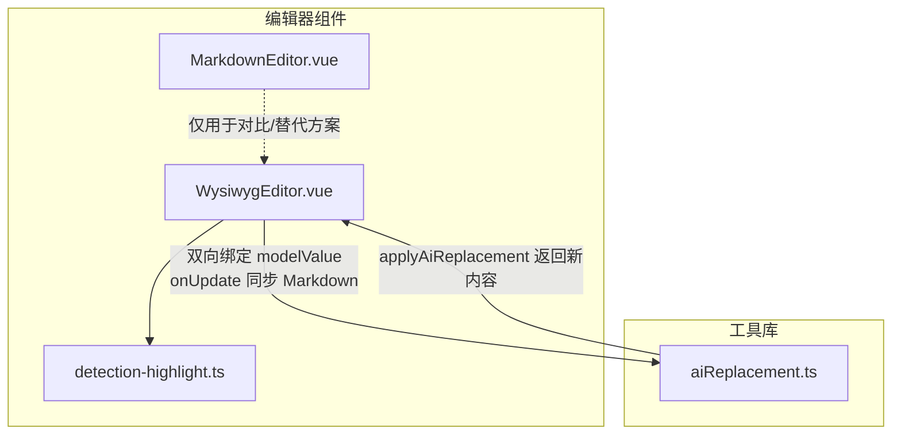
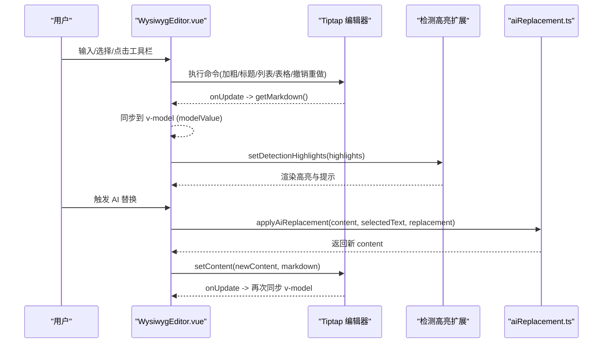
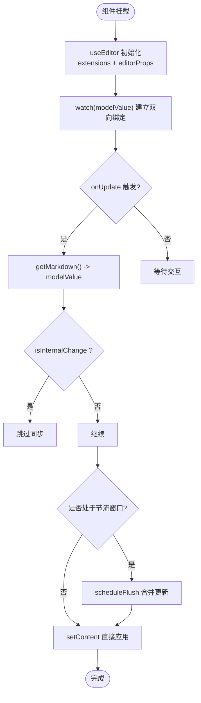
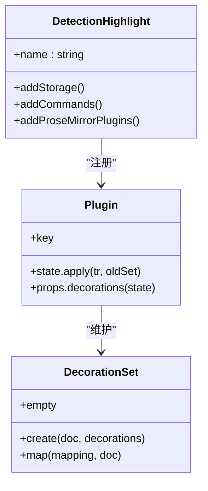
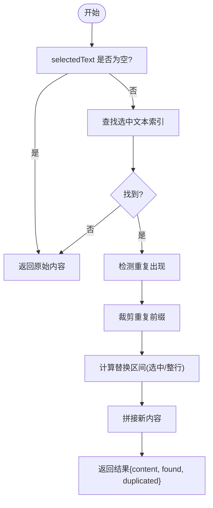
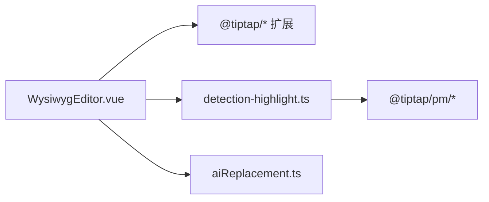

# 富文本编辑器

<cite>
**本文引用的文件**   
- [WysiwygEditor.vue](file://ele-ai-tender-frontend/src/components/editor/WysiwygEditor.vue)
- [detection-highlight.ts](file://ele-ai-tender-frontend/src/components/editor/detection-highlight.ts)
- [aiReplacement.ts](file://ele-ai-tender-frontend/src/utils/aiReplacement.ts)
- [MarkdownEditor.vue](file://ele-ai-tender-frontend/src/components/editor/MarkdownEditor.vue)
</cite>

## 目录
1. [简介](#简介)
2. [项目结构](#项目结构)
3. [核心组件](#核心组件)
4. [架构总览](#架构总览)
5. [详细组件分析](#详细组件分析)
6. [依赖关系分析](#依赖关系分析)
7. [性能考虑](#性能考虑)
8. [故障排查指南](#故障排查指南)
9. [结论](#结论)
10. [附录](#附录)

## 简介
本文件面向富文本编辑器组件 WysiwygEditor.vue，围绕其基于 Tiptap 的实现、Markdown 语法支持、工具栏与快捷键、撤销重做机制、检测高亮扩展、AI 助手内容替换集成等展开。文档同时提供扩展开发指南（自定义插件、主题定制、性能优化）以及协作编辑的接入建议。

## 项目结构
与编辑器相关的核心文件位于前端工程 components/editor 与 utils 目录下：
- WysiwygEditor.vue：基于 Tiptap 的可视化编辑器封装，内置 Markdown 解析、表格、占位符、检测高亮扩展等。
- detection-highlight.ts：Tiptap 扩展，用于在编辑器中渲染检测结果的高亮与悬浮提示。
- aiReplacement.ts：AI 助手内容替换工具集，提供可替换区域提取、重复上下文裁剪、整行替换策略等。
- MarkdownEditor.vue：基于 md-editor-v3 的纯 Markdown 编辑器（作为对比参考）。

图表来源
- [WysiwygEditor.vue:153-193](file://ele-ai-tender-frontend/src/components/editor/WysiwygEditor.vue#L153-L193)
- [detection-highlight.ts:16-62](file://ele-ai-tender-frontend/src/components/editor/detection-highlight.ts#L16-L62)
- [aiReplacement.ts:34-53](file://ele-ai-tender-frontend/src/utils/aiReplacement.ts#L34-L53)
- [MarkdownEditor.vue:1-50](file://ele-ai-tender-frontend/src/components/editor/MarkdownEditor.vue#L1-L50)

章节来源
- [WysiwygEditor.vue:1-597](file://ele-ai-tender-frontend/src/components/editor/WysiwygEditor.vue#L1-L597)
- [detection-highlight.ts:1-100](file://ele-ai-tender-frontend/src/components/editor/detection-highlight.ts#L1-L100)
- [aiReplacement.ts:1-133](file://ele-ai-tender-frontend/src/utils/aiReplacement.ts#L1-L133)
- [MarkdownEditor.vue:1-50](file://ele-ai-tender-frontend/src/components/editor/MarkdownEditor.vue#L1-L50)

## 核心组件
- WysiwygEditor.vue
  - 基于 @tiptap/vue-3 的 useEditor 初始化编辑器实例。
  - 启用 StarterKit（标题级别配置）、@tiptap/markdown、表格扩展、Placeholder、DetectionHighlight 自定义扩展。
  - 通过 onUpdate 将编辑器内容以 Markdown 形式同步到父组件 v-model。
  - 监听 readonly 属性动态切换可编辑状态；监听 highlights 属性驱动检测高亮。
  - 提供 selection-change 事件，用于向外部暴露选中文本片段。
  - 内部实现防抖/节流逻辑，避免高频更新导致的循环与抖动。

- detection-highlight.ts
  - 定义 DetectionHighlight 扩展，提供 setDetectionHighlights 命令。
  - 使用 ProseMirror Plugin 维护 DecorationSet，根据检测项在原内容中定位并添加内联装饰样式与 tooltip。

- aiReplacement.ts
  - 提供可替换正文标记提取、应用 AI 生成内容替换、去除重复前缀、整行替换策略等能力。
  - 供上层业务（如 AI 助手）调用，将生成的内容安全地插入或替换到当前选中位置。

章节来源
- [WysiwygEditor.vue:153-242](file://ele-ai-tender-frontend/src/components/editor/WysiwygEditor.vue#L153-L242)
- [detection-highlight.ts:16-62](file://ele-ai-tender-frontend/src/components/editor/detection-highlight.ts#L16-L62)
- [aiReplacement.ts:10-53](file://ele-ai-tender-frontend/src/utils/aiReplacement.ts#L10-L53)

## 架构总览
下图展示了编辑器从用户输入到数据同步、再到 AI 替换的关键流程。

图表来源
- [WysiwygEditor.vue:176-193](file://ele-ai-tender-frontend/src/components/editor/WysiwygEditor.vue#L176-L193)
- [WysiwygEditor.vue:240-242](file://ele-ai-tender-frontend/src/components/editor/WysiwygEditor.vue#L240-L242)
- [detection-highlight.ts:25-34](file://ele-ai-tender-frontend/src/components/editor/detection-highlight.ts#L25-L34)
- [aiReplacement.ts:34-53](file://ele-ai-tender-frontend/src/utils/aiReplacement.ts#L34-L53)

## 详细组件分析

### WysiwygEditor.vue 实现细节
- 编辑器初始化与扩展
  - 使用 useEditor 创建实例，contentType 为 markdown，content 来自 v-model。
  - 扩展清单：StarterKit（heading 级别 1-4）、Markdown、Table（可调整大小）、TableRow、TableCell、TableHeader、Placeholder、DetectionHighlight。
  - editorProps 设置根节点 class，便于样式覆盖。

- 双向绑定与更新策略
  - onUpdate 中调用 getMarkdown() 同步至 modelValue。
  - watch(modelValue) 监听外部变更，若与编辑器当前 Markdown 不同则 setContent，并通过 isInternalChange 标志防止循环触发。
  - 针对高频更新场景（如 SSE 流式增量），引入 pendingContent 与 flushTimer 进行合并刷新，降低频繁 DOM 操作开销。

- 只读模式与高亮
  - 监听 readonly 变化，调用 setEditable 控制可编辑性。
  - 监听 highlights 变化，调用自定义命令 setDetectionHighlights 注入高亮数据。

- 选择范围事件
  - onSelectionUpdate 延迟 300ms 获取选区文本，长度不足阈值时不触发，减少无用事件风暴。

- 工具栏与快捷键
  - 工具栏按钮直接调用 chain().focus().toggleXxx().run() 系列命令。
  - 撤销/重做按钮通过 can().undo()/can().redo() 控制禁用态。
  - 快捷键由 Tiptap StarterKit 默认提供（例如 Ctrl/Cmd+B/I/S 等），无需额外配置。

- 主题与样式
  - 通过 CSS 变量与 :deep(.ProseMirror) 覆盖默认样式，适配系统主题 token。
  - 检测高亮样式包含不同严重等级与悬浮提示箭头。

图表来源
- [WysiwygEditor.vue:153-193](file://ele-ai-tender-frontend/src/components/editor/WysiwygEditor.vue#L153-L193)
- [WysiwygEditor.vue:195-234](file://ele-ai-tender-frontend/src/components/editor/WysiwygEditor.vue#L195-L234)

章节来源
- [WysiwygEditor.vue:153-242](file://ele-ai-tender-frontend/src/components/editor/WysiwygEditor.vue#L153-L242)
- [WysiwygEditor.vue:260-597](file://ele-ai-tender-frontend/src/components/editor/WysiwygEditor.vue#L260-L597)

### 检测高亮扩展（detection-highlight.ts）
- 扩展接口
  - 新增命令 setDetectionHighlights(highlights)，将高亮数据写入 Transaction Meta。
- 渲染逻辑
  - 使用 ProseMirror Plugin 维护 DecorationSet，当文档变更或收到新的 highlights 时重建装饰。
  - 遍历文本节点，按 original 字段匹配原文片段，生成 inline 装饰，附带 class 与 data-tooltip 等属性。
- 复杂度
  - 每次文档变更都会扫描所有文本节点，时间复杂度近似 O(N*M)，N 为文本节点数，M 为活跃高亮项数量。可通过限制高亮项数量或增量匹配优化。

图表来源
- [detection-highlight.ts:16-62](file://ele-ai-tender-frontend/src/components/editor/detection-highlight.ts#L16-L62)
- [detection-highlight.ts:64-99](file://ele-ai-tender-frontend/src/components/editor/detection-highlight.ts#L64-L99)

章节来源
- [detection-highlight.ts:1-100](file://ele-ai-tender-frontend/src/components/editor/detection-highlight.ts#L1-L100)

### AI 助手内容替换机制（aiReplacement.ts）
- 可替换正文标记
  - 提供 extractReplaceableContents 提取被特定标记包裹的内容块，便于批量处理。
- 替换算法
  - applyAiReplacement 先定位选中文本首次出现位置，计算是否存在重复，再对 replacement 进行“重复前缀裁剪”，最后决定替换区间（默认选中区间或整行）。
  - trimDuplicatedLeadingContext 比较选中行前缀与 replacement 前缀，去除冗余重复部分，提升可读性与一致性。
  - getReplacementRange 判断是否为空壳 Markdown 行（如仅标题/引用/列表符号等），若是则扩展到整行替换，否则仅替换选中范围。
- 使用建议
  - 在 AI 助手回调中，先获取当前选中文本与编辑器 Markdown，调用 applyAiReplacement 得到新内容，再通过 setContent 更新编辑器。

图表来源
- [aiReplacement.ts:34-83](file://ele-ai-tender-frontend/src/utils/aiReplacement.ts#L34-L83)
- [aiReplacement.ts:55-68](file://ele-ai-tender-frontend/src/utils/aiReplacement.ts#L55-L68)
- [aiReplacement.ts:70-83](file://ele-ai-tender-frontend/src/utils/aiReplacement.ts#L70-L83)

章节来源
- [aiReplacement.ts:1-133](file://ele-ai-tender-frontend/src/utils/aiReplacement.ts#L1-L133)

### 实时预览与 Markdown 编辑器对比
- WysiwygEditor.vue 采用 Markdown 内容类型，结合 StarterKit 与 Markdown 扩展，具备所见即所得体验，同时底层数据为 Markdown。
- MarkdownEditor.vue 基于 md-editor-v3，提供原生 Markdown 编辑与预览面板，适合需要强 Markdown 语法的场景。
- 两者可并存于同一页面，通过条件渲染或路由切换实现“实时预览模式切换”。

章节来源
- [WysiwygEditor.vue:153-170](file://ele-ai-tender-frontend/src/components/editor/WysiwygEditor.vue#L153-L170)
- [MarkdownEditor.vue:1-50](file://ele-ai-tender-frontend/src/components/editor/MarkdownEditor.vue#L1-L50)

## 依赖关系分析
- 组件依赖
  - WysiwygEditor.vue 依赖 @tiptap/vue-3、@tiptap/starter-kit、@tiptap/markdown、@tiptap/extension-table、@tiptap/extension-placeholder 及自定义扩展 detection-highlight.ts。
  - detection-highlight.ts 依赖 @tiptap/core、@tiptap/pm/state、@tiptap/pm/view。
  - aiReplacement.ts 为纯函数工具集，无运行时 UI 依赖。
- 耦合与内聚
  - WysiwygEditor.vue 与 detection-highlight.ts 通过命令与 props 松耦合；与 aiReplacement.ts 通过函数调用解耦。
  - 高亮扩展独立维护 DecorationSet，具备良好的内聚性。

图表来源
- [WysiwygEditor.vue:123-170](file://ele-ai-tender-frontend/src/components/editor/WysiwygEditor.vue#L123-L170)
- [detection-highlight.ts:1-4](file://ele-ai-tender-frontend/src/components/editor/detection-highlight.ts#L1-L4)

章节来源
- [WysiwygEditor.vue:123-170](file://ele-ai-tender-frontend/src/components/editor/WysiwygEditor.vue#L123-L170)
- [detection-highlight.ts:1-4](file://ele-ai-tender-frontend/src/components/editor/detection-highlight.ts#L1-L4)

## 性能考虑
- 更新节流
  - 使用 pendingContent 与 flushTimer 合并高频更新，避免 setContent 频繁触发导致闪烁与卡顿。
- 防循环
  - isInternalChange 标志配合 emitUpdate: false 阻止 setContent 触发 onUpdate，避免死循环。
- 事件节流
  - onSelectionUpdate 使用 300ms 延时，过滤短文本选择，减少事件风暴。
- 高亮渲染
  - 检测高亮扩展在文档变更时重建 DecorationSet，建议在大数据量下限制高亮项数量或采用增量匹配策略。
- 主题与样式
  - 通过 CSS 变量与 :deep 选择器覆盖样式，避免在 JS 层频繁操作 DOM 类名。

[本节为通用性能建议，不直接分析具体代码]

## 故障排查指南
- 编辑器内容未同步
  - 检查 isInternalChange 标志是否在微任务后重置；确认 setContent 调用时 emitUpdate 参数是否正确。
- 撤销/重做不可用
  - 确认 StarterKit 已启用且未被覆盖；检查按钮 disabled 状态与 can().undo()/can().redo() 返回值。
- 高亮不显示
  - 确认 highlights 数组中的 handleStatus 与 original 字段有效；检查 buildDecorations 是否命中文本节点。
- 替换后格式错乱
  - 检查 applyAiReplacement 的替换区间计算逻辑，尤其是整行替换与空壳 Markdown 行的判定。
- 主题不一致
  - 确认 CSS 变量与 data-theme 设置一致；检查 :deep(.ProseMirror) 样式优先级。

章节来源
- [WysiwygEditor.vue:195-234](file://ele-ai-tender-frontend/src/components/editor/WysiwygEditor.vue#L195-L234)
- [detection-highlight.ts:64-99](file://ele-ai-tender-frontend/src/components/editor/detection-highlight.ts#L64-L99)
- [aiReplacement.ts:70-83](file://ele-ai-tender-frontend/src/utils/aiReplacement.ts#L70-L83)

## 结论
WysiwygEditor.vue 提供了开箱即用、可扩展的富文本编辑能力，结合 Markdown 内容与可视化操作，满足日常文档编辑需求。通过自定义扩展与工具函数，可实现检测高亮与 AI 助手内容替换等高级特性。建议在大规模数据与复杂交互场景下进一步优化高亮渲染与更新策略，以提升整体性能与用户体验。

[本节为总结性内容，不直接分析具体代码]

## 附录

### 编辑器配置选项与工具栏自定义
- 基础配置
  - contentType: 'markdown'，content 来自 v-model，editable 受 readonly 控制。
  - extensions：StarterKit（heading levels 1-4）、Markdown、Table（resizable）、TableRow、TableCell、TableHeader、Placeholder、DetectionHighlight。
- 工具栏
  - 通过按钮调用 chain().focus().toggleXxx().run() 实现常用格式化；表格插入、分隔线、撤销重做均已内置。
  - 可按需增删按钮组与分割线，保持与 isActive 状态联动。
- 快捷键
  - 由 StarterKit 默认提供，如需自定义可在 useEditor 的 editorProps 中追加 keyboardShortcuts。

章节来源
- [WysiwygEditor.vue:153-175](file://ele-ai-tender-frontend/src/components/editor/WysiwygEditor.vue#L153-L175)
- [WysiwygEditor.vue:4-114](file://ele-ai-tender-frontend/src/components/editor/WysiwygEditor.vue#L4-L114)

### 撤销重做机制
- 通过 StarterKit 内置的 undo/redo 命令实现。
- 工具栏按钮根据 can().undo()/can().redo() 动态禁用。

章节来源
- [WysiwygEditor.vue:99-113](file://ele-ai-tender-frontend/src/components/editor/WysiwygEditor.vue#L99-L113)

### 协作编辑特性（接入建议）
- 当前实现未内置协同引擎。可基于 Yjs 或 Tiptap Collaboration 扩展接入 WebSocket/CRDT 同步。
- 建议步骤：
  - 引入 y-websocket 或自研通道，将文档状态映射为 Tiptap 事务。
  - 在 onUpdate 中将本地变更广播给远端；在远端到达时通过 commands.setContent 或 transaction 应用。
  - 注意冲突解决与版本管理，确保 isInternalChange 与节流逻辑兼容。

[本节为概念性指导，不直接分析具体代码]

### 扩展开发指南
- 自定义插件
  - 参考 detection-highlight.ts，使用 Extension.create 定义 name、addStorage、addCommands、addProseMirrorPlugins。
  - 通过 PluginKey 与 Transaction Meta 传递数据，使用 DecorationSet 渲染视图层效果。
- 主题定制
  - 通过 CSS 变量与 :deep(.ProseMirror) 覆盖默认样式；遵循 _tokens.scss 的主题约定。
- 性能优化
  - 避免在装饰构建中进行昂贵计算；必要时缓存匹配结果或使用 Web Worker。
  - 合理设置节流与防抖，减少不必要的 re-render。

章节来源
- [detection-highlight.ts:16-62](file://ele-ai-tender-frontend/src/components/editor/detection-highlight.ts#L16-L62)
- [WysiwygEditor.vue:260-597](file://ele-ai-tender-frontend/src/components/editor/WysiwygEditor.vue#L260-L597)

### 与 AI 助手的集成方式与内容替换机制
- 集成方式
  - 在 AI 助手回调中，读取当前编辑器 Markdown 与选中文本，调用 aiReplacement.ts 的 applyAiReplacement 生成新内容。
  - 通过 editor.commands.setContent(newContent, { contentType: 'markdown', emitUpdate: false }) 更新编辑器，再由 onUpdate 同步回 v-model。
- 内容替换机制
  - 自动裁剪重复前缀，避免冗余文本。
  - 智能识别空壳 Markdown 行，优先整行替换，保证段落结构完整。
  - 返回 duplicated 标识，便于上层提示用户存在多处匹配。

章节来源
- [aiReplacement.ts:34-83](file://ele-ai-tender-frontend/src/utils/aiReplacement.ts#L34-L83)
- [WysiwygEditor.vue:176-193](file://ele-ai-tender-frontend/src/components/editor/WysiwygEditor.vue#L176-L193)