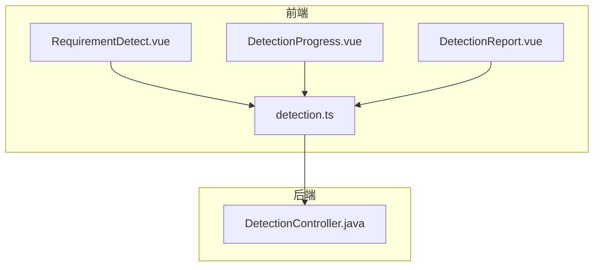
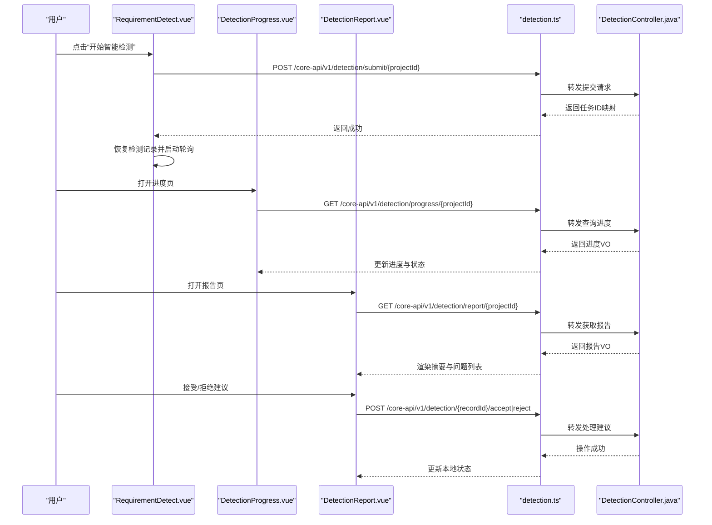
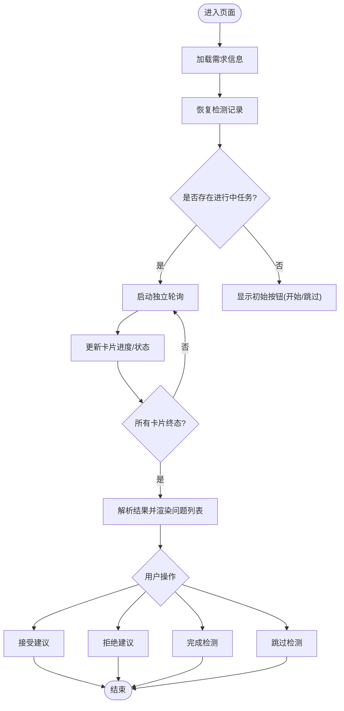
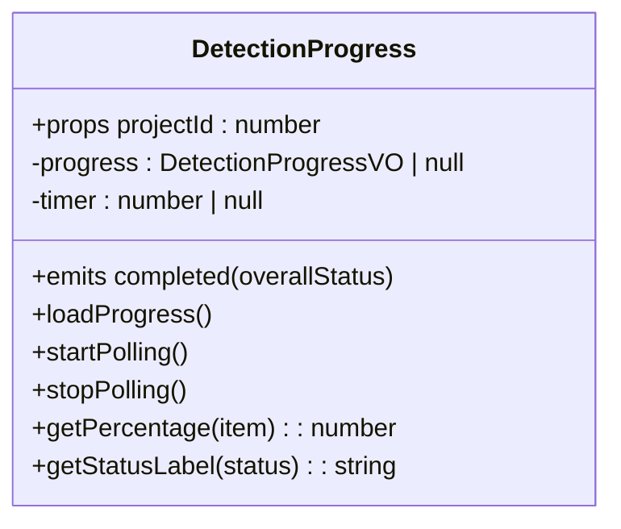
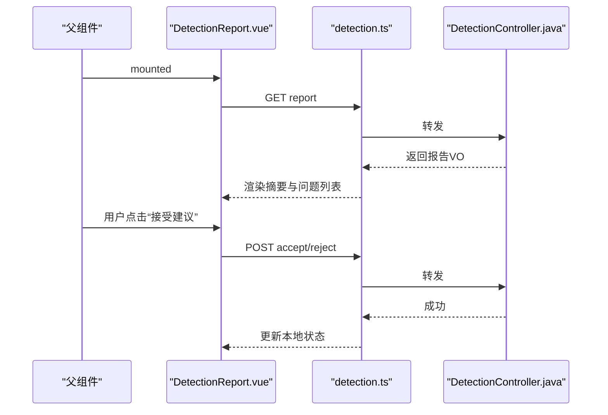
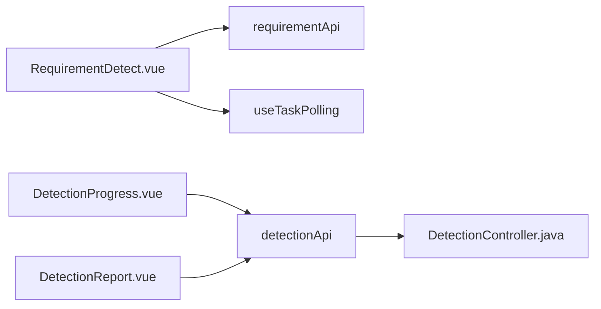

# 智能检测

<cite>
**本文引用的文件**   
- [RequirementDetect.vue](file://ele-ai-tender-frontend/src/views/requirement/RequirementDetect.vue)
- [DetectionProgress.vue](file://ele-ai-tender-frontend/src/components/detection/DetectionProgress.vue)
- [DetectionReport.vue](file://ele-ai-tender-frontend/src/components/detection/DetectionReport.vue)
- [detection.ts](file://ele-ai-tender-frontend/src/api/detection.ts)
- [DetectionController.java](file://ele-ai-tender-system/ele-ai-tender-core/src/main/java/com/jy/eleaitender/core/controller/DetectionController.java)
</cite>

## 目录
1. [简介](#简介)
2. [项目结构](#项目结构)
3. [核心组件](#核心组件)
4. [架构总览](#架构总览)
5. [详细组件分析](#详细组件分析)
6. [依赖关系分析](#依赖关系分析)
7. [性能与优化](#性能与优化)
8. [故障排查指南](#故障排查指南)
9. [结论](#结论)
10. [附录：规则配置与扩展开发](#附录：规则配置与扩展开发)

## 简介
本文件面向“智能检测”功能，聚焦前端需求级检测页面 RequirementDetect.vue 的检测流程实现，包括合规性检查、相似度分析、风险评估等能力在前端的呈现与交互；并详细说明 DetectionProgress.vue 的进度展示机制与 DetectionReport.vue 的报告生成与问题处理机制。同时提供检测规则配置、自定义检测器开发、检测结果处理的实践指南，以及误报率优化与批量检测性能调优建议。

## 项目结构
智能检测相关的前端代码主要位于 ele-ai-tender-frontend 模块中，包含：
- 视图层：需求级检测页面 RequirementDetect.vue
- 组件层：检测进度 DetectionProgress.vue、检测报告 DetectionReport.vue
- API 层：检测接口封装 detection.ts
- 后端控制器：DetectionController.java（用于提交检测、查询进度、获取报告、接受/拒绝建议、跳过与重试）

图表来源
- [RequirementDetect.vue:1-200](file://ele-ai-tender-frontend/src/views/requirement/RequirementDetect.vue#L1-L200)
- [DetectionProgress.vue:1-120](file://ele-ai-tender-frontend/src/components/detection/DetectionProgress.vue#L1-L120)
- [DetectionReport.vue:1-120](file://ele-ai-tender-frontend/src/components/detection/DetectionReport.vue#L1-L120)
- [detection.ts:1-45](file://ele-ai-tender-frontend/src/api/detection.ts#L1-L45)
- [DetectionController.java:1-90](file://ele-ai-tender-system/ele-ai-tender-core/src/main/java/com/jy/eleaitender/core/controller/DetectionController.java#L1-L90)

章节来源
- [RequirementDetect.vue:1-200](file://ele-ai-tender-frontend/src/views/requirement/RequirementDetect.vue#L1-L200)
- [DetectionProgress.vue:1-120](file://ele-ai-tender-frontend/src/components/detection/DetectionProgress.vue#L1-L120)
- [DetectionReport.vue:1-120](file://ele-ai-tender-frontend/src/components/detection/DetectionReport.vue#L1-L120)
- [detection.ts:1-45](file://ele-ai-tender-frontend/src/api/detection.ts#L1-L45)
- [DetectionController.java:1-90](file://ele-ai-tender-system/ele-ai-tender-core/src/main/java/com/jy/eleaitender/core/controller/DetectionController.java#L1-L90)

## 核心组件
- RequirementDetect.vue：负责需求级检测的启动、恢复、轮询、结果解析、建议接受/拒绝、完成与跳过等操作。当前需求级检测项为“错别字检查”和“敏感词检测”。
- DetectionProgress.vue：以卡片形式展示各检测项状态与百分比，并提供总体进度与完成事件回调。
- DetectionReport.vue：汇总检测摘要、检测文件列表、按类型分组的问题列表，支持查看原文、定位文档、接受/拒绝建议等。
- detection.ts：统一封装检测相关的 HTTP 接口调用。
- DetectionController.java：暴露检测提交、进度、报告、建议处理、跳过与重试等 REST 接口。

章节来源
- [RequirementDetect.vue:200-573](file://ele-ai-tender-frontend/src/views/requirement/RequirementDetect.vue#L200-L573)
- [DetectionProgress.vue:59-128](file://ele-ai-tender-frontend/src/components/detection/DetectionProgress.vue#L59-L128)
- [DetectionReport.vue:120-219](file://ele-ai-tender-frontend/src/components/detection/DetectionReport.vue#L120-L219)
- [detection.ts:1-45](file://ele-ai-tender-frontend/src/api/detection.ts#L1-L45)
- [DetectionController.java:17-90](file://ele-ai-tender-system/ele-ai-tender-core/src/main/java/com/jy/eleaitender/core/controller/DetectionController.java#L17-L90)

## 架构总览
下图展示了从前端到后端的检测关键流程：提交检测、轮询进度、拉取报告、处理建议。

图表来源
- [RequirementDetect.vue:422-476](file://ele-ai-tender-frontend/src/views/requirement/RequirementDetect.vue#L422-L476)
- [DetectionProgress.vue:80-97](file://ele-ai-tender-frontend/src/components/detection/DetectionProgress.vue#L80-L97)
- [DetectionReport.vue:208-218](file://ele-ai-tender-frontend/src/components/detection/DetectionReport.vue#L208-L218)
- [detection.ts:4-44](file://ele-ai-tender-frontend/src/api/detection.ts#L4-L44)
- [DetectionController.java:27-88](file://ele-ai-tender-system/ele-ai-tender-core/src/main/java/com/jy/eleaitender/core/controller/DetectionController.java#L27-L88)

## 详细组件分析

### RequirementDetect.vue 检测流程
- 初始化与恢复
  - 加载需求详情与状态，恢复历史检测记录，按检测类型去重取最新记录。
  - 若存在进行中的任务，则基于任务ID启动独立轮询，将任务进度同步至对应检测卡片。
- 检测项定义
  - 仅包含“错别字检查”与“敏感词检测”两类，分别对应后端任务类型与检测类型编码。
- 提交与重新检测
  - 提交检测成功后，刷新检测记录并恢复轮询；若检测到并发冲突错误码，自动恢复进度。
  - 重新检测会清空旧状态并重新发起提交。
- 结果解析与展示
  - 解析后端返回的 JSON 结果，聚合为问题列表，显示严重级别、建议、原文位置等。
  - 根据是否已完成需求，控制“接受/拒绝”按钮可见性与提示文案。
- 建议处理
  - 接受建议：调用后端接口并触发内容自动修正（由上层逻辑执行）。
  - 拒绝建议：二次确认后调用后端接口，标记为已拒绝。
- 完成与跳过
  - 完成检测：标记需求完成并跳转；跳过检测：确认后将直接完成需求。

图表来源
- [RequirementDetect.vue:318-391](file://ele-ai-tender-frontend/src/views/requirement/RequirementDetect.vue#L318-L391)
- [RequirementDetect.vue:394-420](file://ele-ai-tender-frontend/src/views/requirement/RequirementDetect.vue#L394-L420)
- [RequirementDetect.vue:478-504](file://ele-ai-tender-frontend/src/views/requirement/RequirementDetect.vue#L478-L504)
- [RequirementDetect.vue:506-560](file://ele-ai-tender-frontend/src/views/requirement/RequirementDetect.vue#L506-L560)

章节来源
- [RequirementDetect.vue:200-573](file://ele-ai-tender-frontend/src/views/requirement/RequirementDetect.vue#L200-L573)

### DetectionProgress.vue 进度展示
- 数据源：通过接口获取整体进度与各检测项进度。
- 轮询策略：每 3 秒轮询一次，当整体状态非“检测中”时停止轮询并触发完成事件。
- 进度计算：
  - 单项进度：根据任务状态映射为固定百分比（等待中/检测中/已完成/失败）。
  - 总进度：按已完成或失败项占比计算。
- 视觉反馈：使用图标与颜色区分不同状态，提供旋转动画与脉冲效果增强感知。

图表来源
- [DetectionProgress.vue:59-128](file://ele-ai-tender-frontend/src/components/detection/DetectionProgress.vue#L59-L128)

章节来源
- [DetectionProgress.vue:1-128](file://ele-ai-tender-frontend/src/components/detection/DetectionProgress.vue#L1-L128)

### DetectionReport.vue 报告生成与处理
- 数据加载：挂载时拉取报告数据，暴露 refresh 方法供外部刷新。
- 摘要统计：按检测类型统计未接受问题数量，展示通过/警告卡片。
- 问题分组：按检测类型分组展示，支持查看原文、定位到文档、接受/拒绝建议。
- 交互事件：向上抛出 accept/reject/locate 等事件，由父组件协调后续动作。

图表来源
- [DetectionReport.vue:120-219](file://ele-ai-tender-frontend/src/components/detection/DetectionReport.vue#L120-L219)
- [detection.ts:20-33](file://ele-ai-tender-frontend/src/api/detection.ts#L20-L33)
- [DetectionController.java:49-73](file://ele-ai-tender-system/ele-ai-tender-core/src/main/java/com/jy/eleaitender/core/controller/DetectionController.java#L49-L73)

章节来源
- [DetectionReport.vue:120-219](file://ele-ai-tender-frontend/src/components/detection/DetectionReport.vue#L120-L219)

## 依赖关系分析
- 前端内部依赖
  - RequirementDetect.vue 依赖 useTaskPolling 与 types/ai-task 工具，结合 requirementApi 管理需求级检测生命周期。
  - DetectionProgress.vue 与 DetectionReport.vue 均依赖 detectionApi 与 types/detection 类型定义。
- 前后端契约
  - detection.ts 定义了提交、进度、报告、建议处理、跳过与重试等接口路径与参数。
  - DetectionController.java 暴露了相同语义的 REST 接口，作为前后端契约的实现入口。

图表来源
- [RequirementDetect.vue:200-250](file://ele-ai-tender-frontend/src/views/requirement/RequirementDetect.vue#L200-L250)
- [DetectionProgress.vue:59-97](file://ele-ai-tender-frontend/src/components/detection/DetectionProgress.vue#L59-L97)
- [DetectionReport.vue:120-135](file://ele-ai-tender-frontend/src/components/detection/DetectionReport.vue#L120-L135)
- [detection.ts:4-44](file://ele-ai-tender-frontend/src/api/detection.ts#L4-L44)
- [DetectionController.java:27-88](file://ele-ai-tender-system/ele-ai-tender-core/src/main/java/com/jy/eleaitender/core/controller/DetectionController.java#L27-L88)

章节来源
- [detection.ts:1-45](file://ele-ai-tender-frontend/src/api/detection.ts#L1-L45)
- [DetectionController.java:17-90](file://ele-ai-tender-system/ele-ai-tender-core/src/main/java/com/jy/eleaitender/core/controller/DetectionController.java#L17-L90)

## 性能与优化
- 轮询频率与节流
  - 进度组件默认 3 秒轮询，建议在大数据量或高并发场景下可动态调整间隔，或在空闲时降低频率。
- 并行与批量化
  - 需求级检测采用每项独立轮询，避免单点阻塞；对于批量检测，可在后端引入任务队列与分片处理，前端按需分页拉取进度与结果。
- 结果增量更新
  - 在报告组件中优先展示已就绪的分组与问题，对未完成部分采用懒加载与占位渲染，减少首屏压力。
- 缓存与幂等
  - 对进度与报告接口增加短期缓存与幂等校验，避免重复提交导致的额外负载。
- 资源与渲染优化
  - 长列表虚拟化渲染、按需展开详情、延迟加载图片与富文本内容，提升滚动流畅度。

[本节为通用性能建议，不直接分析具体文件]

## 故障排查指南
- 提交检测失败
  - 现象：提示“提交检测失败”或出现并发冲突错误码。
  - 处理：自动恢复进度；若仍失败，检查网络与权限、确认任务未被其他会话抢占。
- 进度不更新
  - 现象：进度条停滞或状态不变。
  - 处理：检查轮询定时器是否被清理；确认后端接口正常返回；核对任务状态映射是否正确。
- 报告为空或异常
  - 现象：报告组件显示“暂无检测报告”。
  - 处理：确认检测已完成且结果已落库；必要时手动刷新或重试检测。
- 建议处理无效
  - 现象：接受/拒绝无响应或状态未更新。
  - 处理：检查接口返回；确认 recordId 与 issueIndex 正确；验证后端事务是否回滚。

章节来源
- [RequirementDetect.vue:422-476](file://ele-ai-tender-frontend/src/views/requirement/RequirementDetect.vue#L422-L476)
- [DetectionProgress.vue:80-97](file://ele-ai-tender-frontend/src/components/detection/DetectionProgress.vue#L80-L97)
- [DetectionReport.vue:208-218](file://ele-ai-tender-frontend/src/components/detection/DetectionReport.vue#L208-L218)

## 结论
智能检测功能以前端组件为核心，围绕“提交—轮询—报告—处理”的主链路构建，具备清晰的职责划分与良好的可扩展性。需求级检测聚焦错别字与敏感词两类，配合进度与报告组件形成完整的用户体验闭环。通过合理的轮询策略、结果增量渲染与后端幂等设计，可有效提升系统稳定性与性能表现。

[本节为总结性内容，不直接分析具体文件]

## 附录：规则配置与扩展开发
- 检测规则配置
  - 需求级检测项在当前实现中固定为“错别字检查”和“敏感词检测”，如需新增类型，需在 RequirementDetect.vue 中扩展检测类型配置与卡片初始化逻辑，并在后端控制器与服务中补充相应接口与处理流程。
- 自定义检测器开发
  - 前端：在检测类型映射与卡片结构中新增类型条目，确保与后端枚举一致；在结果解析处兼容新字段。
  - 后端：在控制器中新增或复用现有接口，在服务层实现新的检测逻辑，保证返回结构与既有 VO 兼容。
- 检测结果处理
  - 接受建议：调用后端接口并触发内容自动修正；注意幂等与并发安全。
  - 拒绝建议：二次确认后更新本地状态，保持 UI 与后端一致。
  - 查看原文：展示位置、原文与建议替换内容，便于人工复核。
- 误报率优化
  - 规则层面：细化匹配条件、引入上下文窗口与白名单机制。
  - 模型层面：引入更精准的模型路由与提示模板，结合反馈数据进行持续迭代。
  - 交互层面：提供“未找到原文”标记与快速反馈通道，收集误报样本用于优化。
- 批量检测性能调优
  - 后端：引入异步任务队列、分片处理与结果持久化；对热点数据加缓存。
  - 前端：分页与虚拟列表、懒加载、合并请求与防抖；在长任务中提供中断与断点续跑能力。

[本节为概念性指导，不直接分析具体文件]