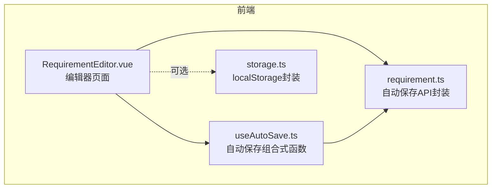
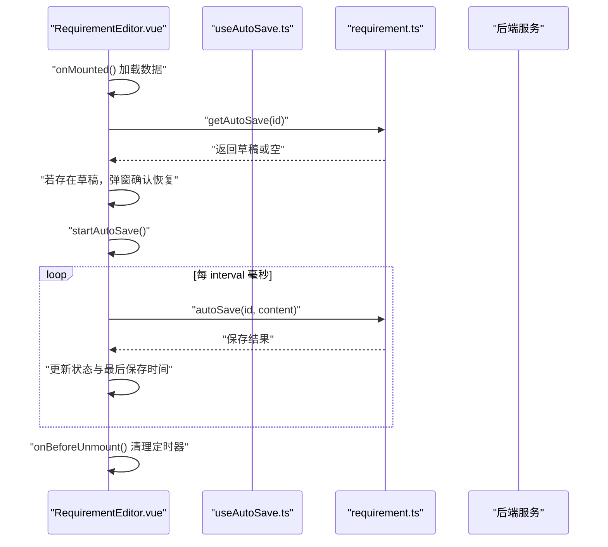
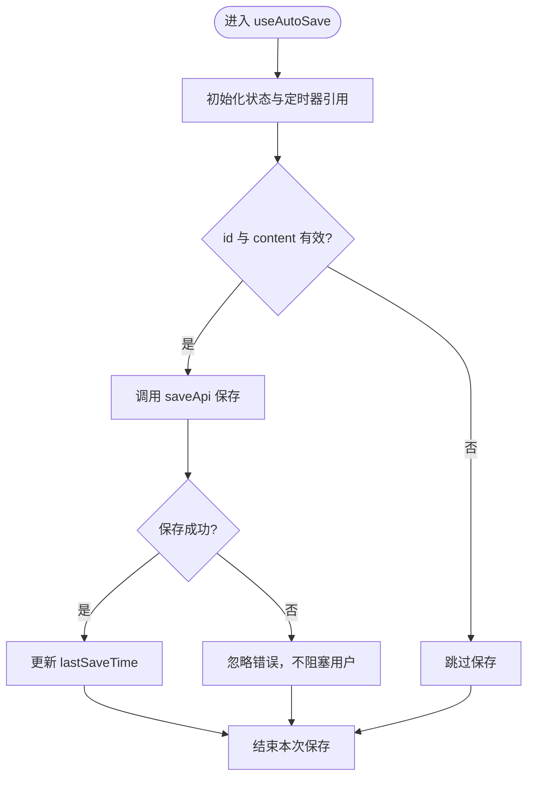
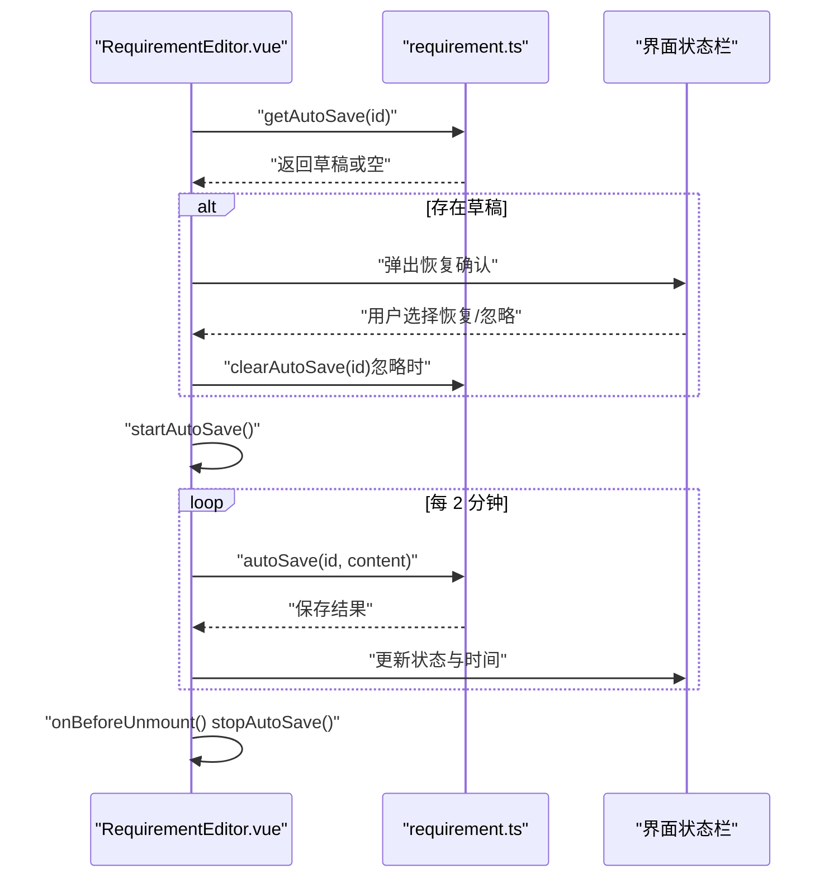
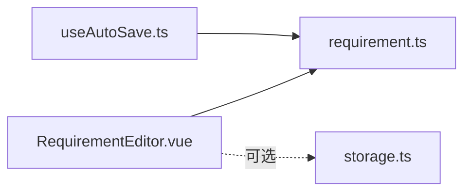

# 自动保存机制

<cite>
**本文引用的文件**
- [useAutoSave.ts](file://ele-ai-tender-frontend/src/composables/useAutoSave.ts)
- [RequirementEditor.vue](file://ele-ai-tender-frontend/src/views/requirement/RequirementEditor.vue)
- [requirement.ts](file://ele-ai-tender-frontend/src/api/requirement.ts)
- [storage.ts](file://ele-ai-tender-frontend/src/utils/storage.ts)
</cite>

## 目录
1. [简介](#简介)
2. [项目结构](#项目结构)
3. [核心组件](#核心组件)
4. [架构总览](#架构总览)
5. [详细组件分析](#详细组件分析)
6. [依赖关系分析](#依赖关系分析)
7. [性能与存储考量](#性能与存储考量)
8. [故障排查指南](#故障排查指南)
9. [结论](#结论)
10. [附录](#附录)

## 简介
本文件围绕前端“自动保存”能力进行系统化说明，重点解析 useAutoSave.ts 的实现原理、与编辑器页面的集成方式、定时保存策略、草稿恢复流程、异常处理与状态展示。同时给出 localStorage 使用规范、数据序列化格式、存储空间管理建议，以及配置项、保存频率调整、异常恢复策略、与手动保存的协调机制、版本控制集成和数据迁移方案等实践指导。

## 项目结构
自动保存相关的前端代码主要分布在以下位置：
- 组合式函数：composables/useAutoSave.ts（通用自动保存逻辑）
- 业务页面：views/requirement/RequirementEditor.vue（需求编辑器的自动保存实现）
- API 封装：api/requirement.ts（自动保存接口定义）
- 本地存储工具：utils/storage.ts（localStorage 统一封装）

图表来源
- [RequirementEditor.vue:129-365](file://ele-ai-tender-frontend/src/views/requirement/RequirementEditor.vue#L129-L365)
- [useAutoSave.ts:8-82](file://ele-ai-tender-frontend/src/composables/useAutoSave.ts#L8-L82)
- [requirement.ts:41-52](file://ele-ai-tender-frontend/src/api/requirement.ts#L41-L52)
- [storage.ts:1-18](file://ele-ai-tender-frontend/src/utils/storage.ts#L1-L18)

章节来源
- [RequirementEditor.vue:129-365](file://ele-ai-tender-frontend/src/views/requirement/RequirementEditor.vue#L129-L365)
- [useAutoSave.ts:8-82](file://ele-ai-tender-frontend/src/composables/useAutoSave.ts#L8-L82)
- [requirement.ts:41-52](file://ele-ai-tender-frontend/src/api/requirement.ts#L41-L52)
- [storage.ts:1-18](file://ele-ai-tender-frontend/src/utils/storage.ts#L1-L18)

## 核心组件
- useAutoSave 组合式函数
  - 职责：提供定时保存、启动/停止定时器、草稿恢复、保存状态与时间记录、立即保存能力。
  - 关键参数：id、content、saveApi、getApi、clearApi、interval（默认120秒）。
  - 返回：isSaving、lastSaveTime、startAutoSave、stopAutoSave、recoverDraft、saveNow。
- RequirementEditor 编辑器页面
  - 职责：在需求编辑场景内实现自动保存与草稿恢复；维护自动保存状态并展示给用户。
  - 关键点：独立于 useAutoSave 的定时器实现；调用 requirementApi.autoSave/getAutoSave/clearAutoSave；用户交互提示。
- requirement.ts API 封装
  - 职责：封装自动保存相关的后端接口（保存、获取、清除）。
- storage.ts 本地存储工具
  - 职责：对 localStorage 的 get/set/remove 进行统一封装，支持 JSON 序列化与容错解析。

章节来源
- [useAutoSave.ts:8-82](file://ele-ai-tender-frontend/src/composables/useAutoSave.ts#L8-L82)
- [RequirementEditor.vue:129-365](file://ele-ai-tender-frontend/src/views/requirement/RequirementEditor.vue#L129-L365)
- [requirement.ts:41-52](file://ele-ai-tender-frontend/src/api/requirement.ts#L41-L52)
- [storage.ts:1-18](file://ele-ai-tender-frontend/src/utils/storage.ts#L1-L18)

## 架构总览
自动保存的整体流程包括：
- 页面初始化时检查是否存在草稿，若有则弹窗询问是否恢复。
- 启动定时器，按固定间隔将当前内容提交到后端。
- 保存成功更新状态与最后保存时间；失败不阻塞用户操作，仅更新错误状态。
- 组件卸载时清理定时器，避免内存泄漏。

图表来源
- [RequirementEditor.vue:141-177](file://ele-ai-tender-frontend/src/views/requirement/RequirementEditor.vue#L141-L177)
- [RequirementEditor.vue:318-341](file://ele-ai-tender-frontend/src/views/requirement/RequirementEditor.vue#L318-L341)
- [requirement.ts:41-52](file://ele-ai-tender-frontend/src/api/requirement.ts#L41-L52)

## 详细组件分析

### useAutoSave 组合式函数
- 定时保存策略
  - 通过 setInterval 周期性触发 save 方法，默认间隔为 120 秒，可通过 interval 参数调整。
  - 每次保存前校验 id 与 content 是否为空，避免无效请求。
  - 保存成功后更新时间戳，失败不影响用户继续编辑。
- 本地草稿存储
  - recoverDraft 通过 getApi 拉取草稿，若存在则弹窗确认恢复；确认后覆盖 content，否则调用 clearApi 清理草稿。
- 冲突解决机制
  - 采用“最后一次保存优先”的策略：自动保存会覆盖之前的草稿；恢复时由用户决定是否覆盖当前编辑内容。
- 生命周期管理
  - onBeforeUnmount 中 stopAutoSave，确保组件销毁时清理定时器。
- 暴露能力
  - isSaving：当前是否正在保存
  - lastSaveTime：最近一次保存时间
  - startAutoSave / stopAutoSave：启停定时器
  - recoverDraft：恢复草稿
  - saveNow：立即保存

图表来源
- [useAutoSave.ts:20-31](file://ele-ai-tender-frontend/src/composables/useAutoSave.ts#L20-L31)
- [useAutoSave.ts:45-68](file://ele-ai-tender-frontend/src/composables/useAutoSave.ts#L45-L68)

章节来源
- [useAutoSave.ts:8-82](file://ele-ai-tender-frontend/src/composables/useAutoSave.ts#L8-L82)

### RequirementEditor 编辑器中的自动保存
- 初始化与草稿恢复
  - onMounted 中先加载需求详情，再调用 checkAutoSaveDraft 检查草稿，若存在则弹窗确认恢复。
- 定时保存
  - 使用独立的 AUTO_SAVE_INTERVAL（2分钟）启动定时器 doAutoSave，调用 requirementApi.autoSave 保存内容。
  - 根据保存结果更新 autoSaveStatus 与 lastSaveTime，并在底部状态栏展示给用户。
- 手动保存协调
  - handleSave 执行完整保存（包含名称与内容），成功后同步 originalContent/originalName，避免与自动保存产生歧义。
- 生命周期清理
  - onBeforeUnmount 中 stopAutoSave，防止定时器残留。

图表来源
- [RequirementEditor.vue:141-177](file://ele-ai-tender-frontend/src/views/requirement/RequirementEditor.vue#L141-L177)
- [RequirementEditor.vue:318-341](file://ele-ai-tender-frontend/src/views/requirement/RequirementEditor.vue#L318-L341)
- [requirement.ts:41-52](file://ele-ai-tender-frontend/src/api/requirement.ts#L41-L52)

章节来源
- [RequirementEditor.vue:129-365](file://ele-ai-tender-frontend/src/views/requirement/RequirementEditor.vue#L129-L365)
- [requirement.ts:41-52](file://ele-ai-tender-frontend/src/api/requirement.ts#L41-L52)

### API 封装（自动保存）
- 自动保存接口
  - POST /core-api/v1/requirements/:id/auto-save，请求体包含 content。
- 获取自动保存内容
  - GET /core-api/v1/requirements/:id/auto-save，返回字符串或空。
- 清除自动保存
  - DELETE /core-api/v1/requirements/:id/auto-save。

章节来源
- [requirement.ts:41-52](file://ele-ai-tender-frontend/src/api/requirement.ts#L41-L52)

### localStorage 使用规范与数据序列化
- 统一封装
  - storage.get：读取后尝试 JSON.parse，失败回退为原始字符串，增强健壮性。
  - storage.set：写入前 JSON.stringify，保证结构化数据的持久化。
  - storage.remove：删除指定键值。
- 适用场景
  - 适用于轻量级本地缓存（如主题、临时状态等）。对于自动保存，当前实现以服务端为主，但可结合 storage 做离线草稿兜底。

章节来源
- [storage.ts:1-18](file://ele-ai-tender-frontend/src/utils/storage.ts#L1-L18)

## 依赖关系分析
- RequirementEditor 依赖 requirement.ts 提供的自动保存接口。
- useAutoSave 作为通用组合式函数，依赖外部传入的 saveApi/getApi/clearApi，便于在不同页面复用。
- storage.ts 可作为扩展点，用于本地草稿的辅助存储。

图表来源
- [RequirementEditor.vue:129-365](file://ele-ai-tender-frontend/src/views/requirement/RequirementEditor.vue#L129-L365)
- [useAutoSave.ts:8-82](file://ele-ai-tender-frontend/src/composables/useAutoSave.ts#L8-L82)
- [requirement.ts:41-52](file://ele-ai-tender-frontend/src/api/requirement.ts#L41-L52)
- [storage.ts:1-18](file://ele-ai-tender-frontend/src/utils/storage.ts#L1-L18)

章节来源
- [RequirementEditor.vue:129-365](file://ele-ai-tender-frontend/src/views/requirement/RequirementEditor.vue#L129-L365)
- [useAutoSave.ts:8-82](file://ele-ai-tender-frontend/src/composables/useAutoSave.ts#L8-L82)
- [requirement.ts:41-52](file://ele-ai-tender-frontend/src/api/requirement.ts#L41-L52)
- [storage.ts:1-18](file://ele-ai-tender-frontend/src/utils/storage.ts#L1-L18)

## 性能与存储考量
- 保存频率
  - useAutoSave 默认 120 秒；RequirementEditor 使用 2 分钟。可根据业务需要调整 interval，平衡用户体验与网络开销。
- 网络与并发
  - 自动保存失败不阻塞用户操作，避免频繁重试造成雪崩。可在上层增加指数退避或队列合并策略（例如节流/去抖）进一步优化。
- 本地存储容量
  - localStorage 有容量限制（通常约 5MB），应避免存储大对象。如需离线草稿，建议压缩或分片存储，并定期清理过期数据。
- 序列化与兼容性
  - 使用 JSON 序列化时需考虑特殊字符与循环引用问题；storage.get 已对解析失败做容错处理，建议在更复杂场景引入 schema 校验。

[本节为通用指导，无需具体文件来源]

## 故障排查指南
- 常见问题
  - 自动保存未生效：检查定时器是否被正确启动与清理；确认 interval 设置合理；查看浏览器控制台是否有网络错误。
  - 草稿无法恢复：确认 getAutoSave 返回非空；检查用户交互是否选择了“忽略”。
  - 保存状态显示异常：核对 autoSaveStatus 更新逻辑与 UI 绑定是否正确。
- 定位步骤
  - 在 RequirementEditor 的状态栏观察“自动保存”状态变化。
  - 在 Network 面板查看 /auto-save 请求是否发出及响应码。
  - 若使用 storage.ts 做本地草稿，检查 key 是否存在且可解析。

章节来源
- [RequirementEditor.vue:318-341](file://ele-ai-tender-frontend/src/views/requirement/RequirementEditor.vue#L318-L341)
- [storage.ts:1-18](file://ele-ai-tender-frontend/src/utils/storage.ts#L1-L18)

## 结论
当前自动保存机制以服务端为中心，结合页面级定时器与用户交互提示，实现了稳定的草稿保护与恢复体验。useAutoSave 提供了可复用的组合式能力，而 RequirementEditor 展示了如何在业务场景中落地。后续可基于 storage.ts 扩展离线草稿能力，并结合版本控制与数据迁移策略提升系统的健壮性与可演进性。

[本节为总结，无需具体文件来源]

## 附录

### 自动保存配置选项与保存频率调整
- useAutoSave
  - interval：保存间隔（毫秒），默认 120000。
  - 通过传入不同 interval 调整保存频率。
- RequirementEditor
  - AUTO_SAVE_INTERVAL：页面级常量，当前为 2 分钟。
  - 修改该常量即可调整保存频率。

章节来源
- [useAutoSave.ts:14](file://ele-ai-tender-frontend/src/composables/useAutoSave.ts#L14)
- [RequirementEditor.vue:134](file://ele-ai-tender-frontend/src/views/requirement/RequirementEditor.vue#L134)

### 异常恢复策略
- 自动保存失败
  - 不中断用户操作，仅更新错误状态；下次保存周期再次尝试。
- 草稿恢复失败
  - 忽略异常，保持当前编辑内容不变。
- 建议增强
  - 增加重试次数与退避策略；在网络不可用时切换至本地草稿（storage.ts）并提示用户。

章节来源
- [useAutoSave.ts:26-30](file://ele-ai-tender-frontend/src/composables/useAutoSave.ts#L26-L30)
- [useAutoSave.ts:64-67](file://ele-ai-tender-frontend/src/composables/useAutoSave.ts#L64-L67)
- [RequirementEditor.vue:338-340](file://ele-ai-tender-frontend/src/views/requirement/RequirementEditor.vue#L338-L340)

### 与手动保存的协调机制
- 手动保存会覆盖自动保存的内容，并同步原始内容与名称，避免差异混淆。
- 建议在手动保存成功后重置自动保存状态，确保 UI 一致性。

章节来源
- [RequirementEditor.vue:186-201](file://ele-ai-tender-frontend/src/views/requirement/RequirementEditor.vue#L186-L201)

### 版本控制集成建议
- 在自动保存时附带版本号或时间戳，以便后端进行冲突检测与合并。
- 当检测到冲突时，前端可提示用户选择保留本地或远程版本。

[本节为概念性建议，无需具体文件来源]

### 数据迁移方案
- 针对 localStorage 的旧键名或数据结构变更，可在应用启动时进行一次性迁移：
  - 读取旧键，解析并转换为新结构。
  - 写入新键，删除旧键。
  - 对解析失败的条目进行日志记录与降级处理。

章节来源
- [storage.ts:1-18](file://ele-ai-tender-frontend/src/utils/storage.ts#L1-L18)