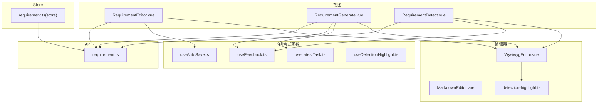
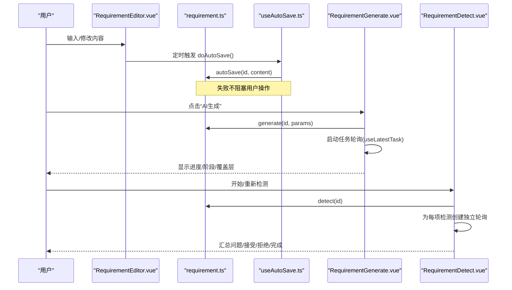
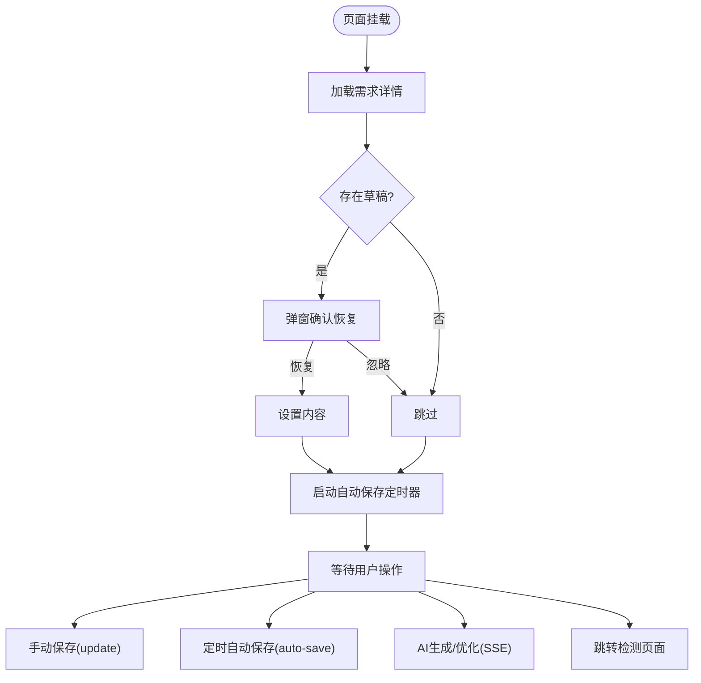
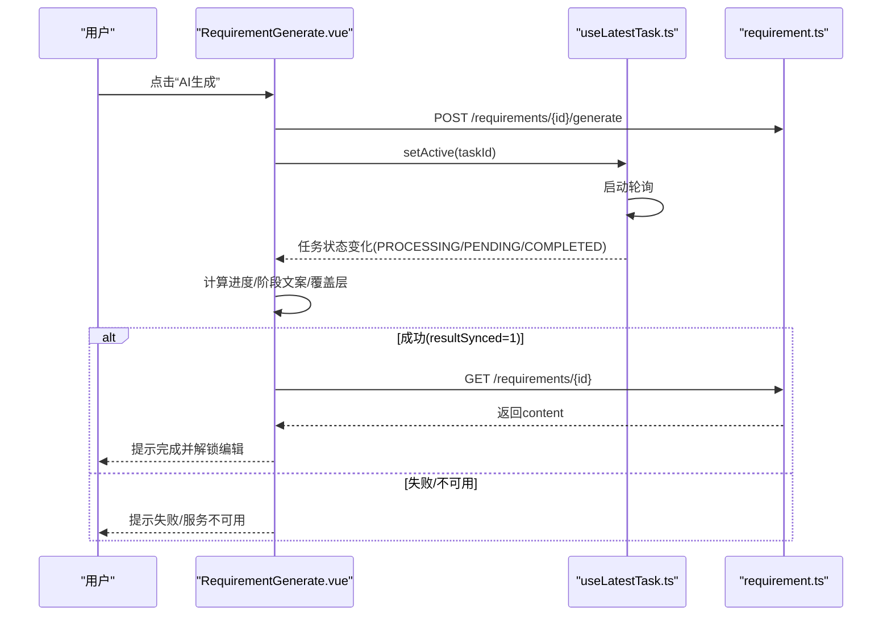
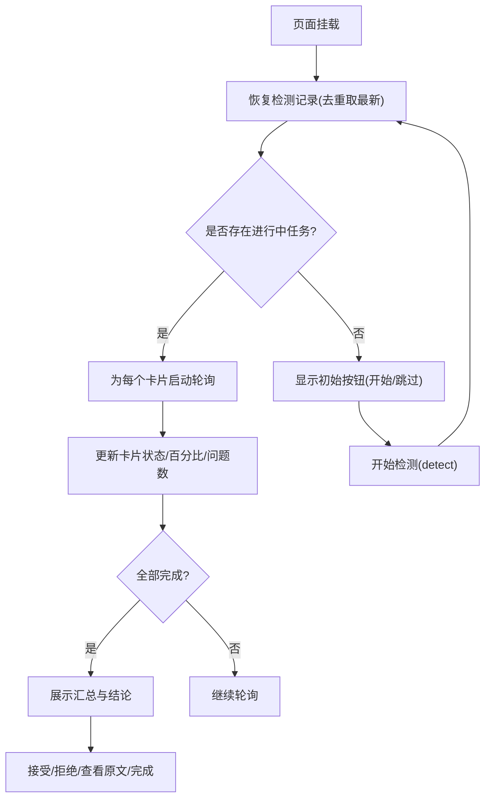
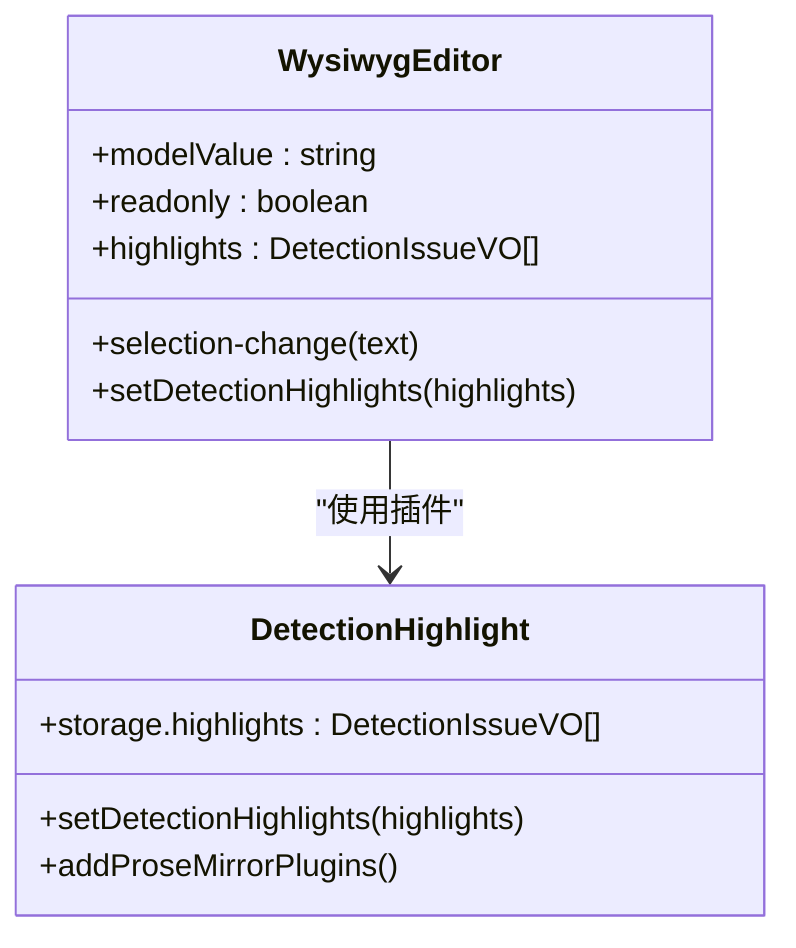
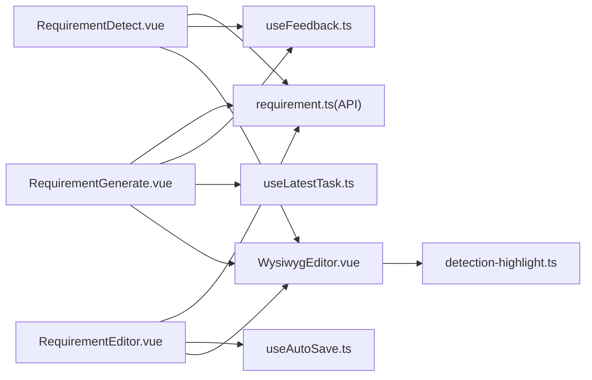

# 需求编辑模块

<cite>
**本文引用的文件**
- [RequirementEditor.vue](file://ele-ai-tender-frontend/src/views/requirement/RequirementEditor.vue)
- [RequirementGenerate.vue](file://ele-ai-tender-frontend/src/views/requirement/RequirementGenerate.vue)
- [RequirementDetect.vue](file://ele-ai-tender-frontend/src/views/requirement/RequirementDetect.vue)
- [WysiwygEditor.vue](file://ele-ai-tender-frontend/src/components/editor/WysiwygEditor.vue)
- [MarkdownEditor.vue](file://ele-ai-tender-frontend/src/components/editor/MarkdownEditor.vue)
- [detection-highlight.ts](file://ele-ai-tender-frontend/src/components/editor/detection-highlight.ts)
- [useAutoSave.ts](file://ele-ai-tender-frontend/src/composables/useAutoSave.ts)
- [useLatestTask.ts](file://ele-ai-tender-frontend/src/composables/useLatestTask.ts)
- [useFeedback.ts](file://ele-ai-tender-frontend/src/composables/useFeedback.ts)
- [useDetectionHighlight.ts](file://ele-ai-tender-frontend/src/composables/useDetectionHighlight.ts)
- [aiReplacement.ts](file://ele-ai-tender-frontend/src/utils/aiReplacement.ts)
- [requirement.ts](file://ele-ai-tender-frontend/src/api/requirement.ts)
- [requirement store](file://ele-ai-tender-frontend/src/store/requirement.ts)
</cite>

## 目录
1. [简介](#简介)
2. [项目结构](#项目结构)
3. [核心组件](#核心组件)
4. [架构总览](#架构总览)
5. [详细组件分析](#详细组件分析)
6. [依赖关系分析](#依赖关系分析)
7. [性能考虑](#性能考虑)
8. [故障排查指南](#故障排查指南)
9. [结论](#结论)
10. [附录](#附录)

## 简介
本模块围绕“业务需求”的编辑、生成与检测三大场景，提供富文本编辑（支持 Markdown）、实时预览、协作式 AI 助手交互、智能提示词工程与结果处理、合规性检查与相似度分析等能力。同时内置自动保存、撤销重做、版本对比等高级编辑特性，并提供编辑器配置选项、扩展开发指南与性能优化建议，帮助开发者快速集成与二次开发。

## 项目结构
需求编辑模块位于前端工程中，主要包含以下层次：
- 视图层：需求编辑、AI 生成、智能检测页面
- 编辑器组件：基于 Tiptap 的富文本编辑器与 Markdown 编辑器
- 组合式函数：自动保存、任务轮询、反馈收集、检测高亮定位
- API 层：需求相关接口封装
- Store：需求列表与基础 CRUD 操作

图表来源
- [RequirementEditor.vue:1-465](file://ele-ai-tender-frontend/src/views/requirement/RequirementEditor.vue#L1-L465)
- [RequirementGenerate.vue:1-800](file://ele-ai-tender-frontend/src/views/requirement/RequirementGenerate.vue#L1-L800)
- [RequirementDetect.vue:1-800](file://ele-ai-tender-frontend/src/views/requirement/RequirementDetect.vue#L1-L800)
- [WysiwygEditor.vue:1-597](file://ele-ai-tender-frontend/src/components/editor/WysiwygEditor.vue#L1-L597)
- [MarkdownEditor.vue:1-50](file://ele-ai-tender-frontend/src/components/editor/MarkdownEditor.vue#L1-L50)
- [detection-highlight.ts:1-100](file://ele-ai-tender-frontend/src/components/editor/detection-highlight.ts#L1-L100)
- [useAutoSave.ts:1-83](file://ele-ai-tender-frontend/src/composables/useAutoSave.ts#L1-L83)
- [useLatestTask.ts:1-116](file://ele-ai-tender-frontend/src/composables/useLatestTask.ts#L1-L116)
- [useFeedback.ts:1-107](file://ele-ai-tender-frontend/src/composables/useFeedback.ts#L1-L107)
- [useDetectionHighlight.ts:1-359](file://ele-ai-tender-frontend/src/composables/useDetectionHighlight.ts#L1-L359)
- [requirement.ts(API):1-80](file://ele-ai-tender-frontend/src/api/requirement.ts#L1-L80)
- [requirement store:1-41](file://ele-ai-tender-frontend/src/store/requirement.ts#L1-L41)

章节来源
- [RequirementEditor.vue:1-465](file://ele-ai-tender-frontend/src/views/requirement/RequirementEditor.vue#L1-L465)
- [RequirementGenerate.vue:1-800](file://ele-ai-tender-frontend/src/views/requirement/RequirementGenerate.vue#L1-L800)
- [RequirementDetect.vue:1-800](file://ele-ai-tender-frontend/src/views/requirement/RequirementDetect.vue#L1-L800)
- [WysiwygEditor.vue:1-597](file://ele-ai-tender-frontend/src/components/editor/WysiwygEditor.vue#L1-L597)
- [MarkdownEditor.vue:1-50](file://ele-ai-tender-frontend/src/components/editor/MarkdownEditor.vue#L1-L50)
- [detection-highlight.ts:1-100](file://ele-ai-tender-frontend/src/components/editor/detection-highlight.ts#L1-L100)
- [useAutoSave.ts:1-83](file://ele-ai-tender-frontend/src/composables/useAutoSave.ts#L1-L83)
- [useLatestTask.ts:1-116](file://ele-ai-tender-frontend/src/composables/useLatestTask.ts#L1-L116)
- [useFeedback.ts:1-107](file://ele-ai-tender-frontend/src/composables/useFeedback.ts#L1-L107)
- [useDetectionHighlight.ts:1-359](file://ele-ai-tender-frontend/src/composables/useDetectionHighlight.ts#L1-L359)
- [requirement.ts(API):1-80](file://ele-ai-tender-frontend/src/api/requirement.ts#L1-L80)
- [requirement store:1-41](file://ele-ai-tender-frontend/src/store/requirement.ts#L1-L41)

## 核心组件
- 富文本编辑器 WysiwygEditor
  - 基于 Tiptap StarterKit + Markdown 扩展，支持加粗/斜体/删除线、标题、有序/无序列表、引用、表格、分隔线、撤销/重做。
  - 通过自定义插件 detection-highlight 实现检测结果在编辑器内的高亮与悬浮提示。
  - 提供 selection-change 事件，用于将选中文本传递给 AI 助手进行上下文替换。
  - 内部对 SSE 流式更新做了节流合并，避免频繁 setContent 导致闪烁或卡顿。
- Markdown 编辑器 MarkdownEditor
  - 基于 md-editor-v3，提供 Markdown 语法支持与实时预览，适用于纯文本场景。
- 自动保存 useAutoSave
  - 定时保存编辑器内容，支持草稿恢复与清理，失败不阻塞用户操作。
- 最新任务 useLatestTask
  - 统一查询并轮询最新 AI 任务状态，非终态自动启动轮询，成功完成时触发回调以便读取业务数据。
- 反馈 useFeedback
  - 统一提交“赞/踩”反馈，dislike 时可收集原因，防止重复提交。
- 检测高亮 useDetectionHighlight
  - 针对文档预览容器，按 locationRef 精确定位段落/表格单元格，跨 textNode 高亮原文片段，支持滚动定位与闪烁提示。

章节来源
- [WysiwygEditor.vue:1-597](file://ele-ai-tender-frontend/src/components/editor/WysiwygEditor.vue#L1-L597)
- [MarkdownEditor.vue:1-50](file://ele-ai-tender-frontend/src/components/editor/MarkdownEditor.vue#L1-L50)
- [useAutoSave.ts:1-83](file://ele-ai-tender-frontend/src/composables/useAutoSave.ts#L1-L83)
- [useLatestTask.ts:1-116](file://ele-ai-tender-frontend/src/composables/useLatestTask.ts#L1-L116)
- [useFeedback.ts:1-107](file://ele-ai-tender-frontend/src/composables/useFeedback.ts#L1-L107)
- [useDetectionHighlight.ts:1-359](file://ele-ai-tender-frontend/src/composables/useDetectionHighlight.ts#L1-L359)

## 架构总览
需求编辑模块采用“视图-组件-组合式函数-API”的分层设计，关键流程如下：
- 编辑与保存：RequirementEditor 调用 requirementApi.update/auto-save/getAutoSave，结合 useAutoSave 定时持久化。
- AI 生成：RequirementGenerate 使用 useLatestTask 管理任务生命周期，结合进度计算与覆盖层展示；完成后拉取内容并允许编辑。
- 智能检测：RequirementDetect 为每项检测创建独立轮询实例，汇总问题并支持接受/拒绝建议，最终完成检测。
- 编辑器增强：WysiwygEditor 通过 detection-highlight 插件渲染检测结果高亮；useDetectionHighlight 用于文档预览中的精准定位与高亮。

图表来源
- [RequirementEditor.vue:1-465](file://ele-ai-tender-frontend/src/views/requirement/RequirementEditor.vue#L1-L465)
- [useAutoSave.ts:1-83](file://ele-ai-tender-frontend/src/composables/useAutoSave.ts#L1-L83)
- [RequirementGenerate.vue:1-800](file://ele-ai-tender-frontend/src/views/requirement/RequirementGenerate.vue#L1-L800)
- [RequirementDetect.vue:1-800](file://ele-ai-tender-frontend/src/views/requirement/RequirementDetect.vue#L1-L800)
- [requirement.ts(API):1-80](file://ele-ai-tender-frontend/src/api/requirement.ts#L1-L80)

## 详细组件分析

### RequirementEditor.vue（富文本编辑主界面）
- 功能要点
  - 顶部工具栏：返回、保存、AI 生成、AI 优化、提交检测。
  - 名称与内容双字段编辑，集成 WysiwygEditor 作为富文本主体。
  - 侧边 AI 助手：快捷动作、上下文感知（selectedText）、消息与替换回调。
  - 自动保存：每 2 分钟尝试保存，状态栏显示最近保存时间/错误提示。
  - 草稿恢复：进入页面时检测草稿并弹窗确认恢复。
  - 选择变更：向 AI 助手传递选中文本，便于针对性优化与替换。
- 关键流程
  - 初始化：加载需求详情、获取最新 AI 任务 ID（用于聊天反馈关联）、检查草稿、启动自动保存。
  - 手动保存：调用 requirementApi.update 同步名称与内容，更新原始快照。
  - AI 生成/优化：分别对接不同后端接口，SSE 流式追加内容，失败回滚或提示。
  - 提交检测：跳转至 RequirementDetect 页面。
  - 替换逻辑：通过 applyAiReplacement 精确匹配并替换选中内容，处理重复与未找到情况。

图表来源
- [RequirementEditor.vue:1-465](file://ele-ai-tender-frontend/src/views/requirement/RequirementEditor.vue#L1-L465)
- [requirement.ts(API):1-80](file://ele-ai-tender-frontend/src/api/requirement.ts#L1-L80)

章节来源
- [RequirementEditor.vue:1-465](file://ele-ai-tender-frontend/src/views/requirement/RequirementEditor.vue#L1-L465)
- [requirement.ts(API):1-80](file://ele-ai-tender-frontend/src/api/requirement.ts#L1-L80)

### RequirementGenerate.vue（AI 内容生成）
- 功能要点
  - 进度面板：统一进度模型，基于任务状态与运行时间计算百分比，只增不减。
  - 生成阶段文案：根据解析后的进度对象输出“大纲已生成/正文生成中/草稿已生成/全文审查中/已完成”等。
  - 生成锁定：生成中或结果同步中禁止编辑，完成后解锁。
  - 参考文件与标签：展示匹配文件与自动生成标签。
  - 导出与下一步：导出 Word 文档，跳转到智能检测。
  - AI 反馈：对生成结果点赞/踩，记录原因。
- 关键流程
  - 发起生成：刷新任务状态，确保可新建后调用 requirementApi.generate，设置活跃任务并启动轮询。
  - 进度更新：watch latestTask 驱动 displayProgress，PROCESSING/刚触发生成时使用时间估算，其他状态使用固定映射。
  - 结果同步：当 resultSynced=1 时拉取最新内容并提示完成；resultSynced=2 视为同步失败。
  - 检测高亮：加载历史检测记录，解析 issues 注入编辑器 highlights，实现可视化标注。

图表来源
- [RequirementGenerate.vue:1-800](file://ele-ai-tender-frontend/src/views/requirement/RequirementGenerate.vue#L1-L800)
- [useLatestTask.ts:1-116](file://ele-ai-tender-frontend/src/composables/useLatestTask.ts#L1-L116)
- [requirement.ts(API):1-80](file://ele-ai-tender-frontend/src/api/requirement.ts#L1-L80)

章节来源
- [RequirementGenerate.vue:1-800](file://ele-ai-tender-frontend/src/views/requirement/RequirementGenerate.vue#L1-L800)
- [useLatestTask.ts:1-116](file://ele-ai-tender-frontend/src/composables/useLatestTask.ts#L1-L116)
- [requirement.ts(API):1-80](file://ele-ai-tender-frontend/src/api/requirement.ts#L1-L80)

### RequirementDetect.vue（智能检测）
- 功能要点
  - 检测项：错别字检查、敏感词检测两项。
  - 独立轮询：为每个检测卡片创建独立的 useTaskPolling 实例，互不影响。
  - 进度与汇总：整体进度为各卡片平均，完成后展示问题数量与严重级别。
  - 问题处理：接受建议（自动修正内容）、拒绝建议、查看原文（高亮定位）。
  - 完成/跳过：完成检测后将需求置为 COMPLETED，或直接跳过。
- 关键流程
  - 恢复状态：加载检测记录，每种类型仅保留最新一条，区分终态与非终态，非终态启动轮询。
  - 提交检测：调用 detect 接口，成功后重新恢复状态以获取 recordId。
  - 接受/拒绝：调用 accept/reject 接口，更新本地 handleStatus。
  - 完成检测：finishDetection 接口，跳转回需求列表。

图表来源
- [RequirementDetect.vue:1-800](file://ele-ai-tender-frontend/src/views/requirement/RequirementDetect.vue#L1-L800)
- [requirement.ts(API):1-80](file://ele-ai-tender-frontend/src/api/requirement.ts#L1-L80)

章节来源
- [RequirementDetect.vue:1-800](file://ele-ai-tender-frontend/src/views/requirement/RequirementDetect.vue#L1-L800)
- [requirement.ts(API):1-80](file://ele-ai-tender-frontend/src/api/requirement.ts#L1-L80)

### WysiwygEditor.vue（富文本编辑器）
- 功能要点
  - 工具栏：加粗/斜体/删除线、H1-H3、列表、引用、表格、分隔线、撤销/重做。
  - Markdown 支持：contentType='markdown'，onUpdate 将内容同步为 Markdown 字符串。
  - 选择变更：延迟 300ms 上报选中文本，长度不足则清空，避免过多无效事件。
  - 高亮插件：通过 setDetectionHighlights 命令注入 DetectionIssueVO 数组，插件内部遍历文档节点构建 DecorationSet。
  - 性能优化：SSE 流式更新使用 pendingContent + flushTimer 合并写入，避免频繁 setContent。
- 扩展点
  - 新增工具栏按钮：在 toolbar-group 中添加按钮并绑定 editor.chain().focus().xxx.run()。
  - 新增扩展：在 extensions 数组注册新的 Tiptap 扩展（如代码块、数学公式等）。
  - 自定义高亮样式：在 CSS 中调整 .detection-high/.medium/.low 类名样式。

图表来源
- [WysiwygEditor.vue:1-597](file://ele-ai-tender-frontend/src/components/editor/WysiwygEditor.vue#L1-L597)
- [detection-highlight.ts:1-100](file://ele-ai-tender-frontend/src/components/editor/detection-highlight.ts#L1-L100)

章节来源
- [WysiwygEditor.vue:1-597](file://ele-ai-tender-frontend/src/components/editor/WysiwygEditor.vue#L1-L597)
- [detection-highlight.ts:1-100](file://ele-ai-tender-frontend/src/components/editor/detection-highlight.ts#L1-L100)

### MarkdownEditor.vue（Markdown 编辑器）
- 功能要点
  - 双向绑定 v-model，支持主题切换、禁用模式、工具栏排除。
  - 销毁前清空内容，避免 md-editor-v3 内部 MutationObserver 报错。
- 适用场景
  - 需要纯 Markdown 编辑与实时预览的场景，例如模板编写、知识库条目等。

章节来源
- [MarkdownEditor.vue:1-50](file://ele-ai-tender-frontend/src/components/editor/MarkdownEditor.vue#L1-L50)

### useAutoSave.ts（自动保存机制）
- 功能要点
  - 定时保存：默认 120 秒间隔，保存失败不阻塞用户操作。
  - 草稿恢复：进入页面时拉取草稿并弹窗确认，确认后填充内容，否则清除草稿。
  - 生命周期：组件卸载时停止定时器，避免内存泄漏。
- 使用建议
  - 在编辑器页面 onMounted 时调用 startAutoSave，并在 onBeforeUnmount 时 stopAutoSave。
  - 若需更短间隔，可通过 interval 参数调整。

章节来源
- [useAutoSave.ts:1-83](file://ele-ai-tender-frontend/src/composables/useAutoSave.ts#L1-L83)

### useLatestTask.ts（最新任务轮询）
- 功能要点
  - 首次加载查询最新任务，非终态自动启动轮询。
  - 提供 canCreateNew 守卫，避免并发创建任务。
  - 成功完成（resultSynced=1）时触发回调，此时业务数据可读。
- 使用建议
  - 在生成页面中使用，配合进度计算与覆盖层展示。
  - 在任务创建成功后调用 setActive 设置为活跃任务。

章节来源
- [useLatestTask.ts:1-116](file://ele-ai-tender-frontend/src/composables/useLatestTask.ts#L1-L116)

### useFeedback.ts（AI 反馈）
- 功能要点
  - 统一反馈入口，支持“赞/踩”，dislike 时收集原因。
  - 防重复提交：已反馈不可再修改。
- 使用建议
  - 在生成与聊天场景中分别传入对应 scene 与 getTaskId。

章节来源
- [useFeedback.ts:1-107](file://ele-ai-tender-frontend/src/composables/useFeedback.ts#L1-L107)

### useDetectionHighlight.ts（检测高亮定位）
- 功能要点
  - 基于 locationRef 精确定位段落/表格单元格，优先使用 segment 整段文本匹配，消除分页拆分导致的 index 偏移。
  - 跨 textNode 高亮 original 片段，支持滚动到目标位置与闪烁提示。
  - 异步拉取 extract-text 段落索引，失败降级为纯文本匹配。
- 使用建议
  - 在文档预览组件中传入 containerRef 与 fileId，按需调用 applyHighlights/scrollToAndHighlight。

章节来源
- [useDetectionHighlight.ts:1-359](file://ele-ai-tender-frontend/src/composables/useDetectionHighlight.ts#L1-L359)

### aiReplacement.ts（AI 替换工具）
- 功能要点
  - 提取可替换正文区间（标记起止），支持多处提取。
  - 应用替换：精确匹配 selectedText，处理重复出现与行级空壳清理。
  - 去除重复前缀：当 replacement 与选中文本所在行前缀重复时，裁剪多余部分。
- 使用建议
  - 在 AI 助手替换回调中调用 applyAiReplacement，根据 found/duplicated 提示用户。

章节来源
- [aiReplacement.ts:1-133](file://ele-ai-tender-frontend/src/utils/aiReplacement.ts#L1-L133)

## 依赖关系分析
- 组件耦合
  - RequirementEditor/Generate/Detect 均依赖 WysiwygEditor 作为编辑主体，降低重复实现成本。
  - 检测高亮由 detection-highlight 插件与 useDetectionHighlight 共同支撑，前者用于编辑器内装饰，后者用于文档预览 DOM 操作。
- 外部依赖
  - Tiptap StarterKit + Markdown 扩展：提供富文本与 Markdown 能力。
  - md-editor-v3：提供 Markdown 编辑器与预览。
  - Element Plus：UI 组件与交互反馈。
- 潜在循环依赖
  - 当前未见循环导入，组合式函数与 API 解耦清晰。

图表来源
- [RequirementEditor.vue:1-465](file://ele-ai-tender-frontend/src/views/requirement/RequirementEditor.vue#L1-L465)
- [RequirementGenerate.vue:1-800](file://ele-ai-tender-frontend/src/views/requirement/RequirementGenerate.vue#L1-L800)
- [RequirementDetect.vue:1-800](file://ele-ai-tender-frontend/src/views/requirement/RequirementDetect.vue#L1-L800)
- [WysiwygEditor.vue:1-597](file://ele-ai-tender-frontend/src/components/editor/WysiwygEditor.vue#L1-L597)
- [detection-highlight.ts:1-100](file://ele-ai-tender-frontend/src/components/editor/detection-highlight.ts#L1-L100)
- [useLatestTask.ts:1-116](file://ele-ai-tender-frontend/src/composables/useLatestTask.ts#L1-L116)
- [useFeedback.ts:1-107](file://ele-ai-tender-frontend/src/composables/useFeedback.ts#L1-L107)
- [useAutoSave.ts:1-83](file://ele-ai-tender-frontend/src/composables/useAutoSave.ts#L1-L83)
- [requirement.ts(API):1-80](file://ele-ai-tender-frontend/src/api/requirement.ts#L1-L80)

章节来源
- [RequirementEditor.vue:1-465](file://ele-ai-tender-frontend/src/views/requirement/RequirementEditor.vue#L1-L465)
- [RequirementGenerate.vue:1-800](file://ele-ai-tender-frontend/src/views/requirement/RequirementGenerate.vue#L1-L800)
- [RequirementDetect.vue:1-800](file://ele-ai-tender-frontend/src/views/requirement/RequirementDetect.vue#L1-L800)
- [WysiwygEditor.vue:1-597](file://ele-ai-tender-frontend/src/components/editor/WysiwygEditor.vue#L1-L597)
- [detection-highlight.ts:1-100](file://ele-ai-tender-frontend/src/components/editor/detection-highlight.ts#L1-L100)
- [useLatestTask.ts:1-116](file://ele-ai-tender-frontend/src/composables/useLatestTask.ts#L1-L116)
- [useFeedback.ts:1-107](file://ele-ai-tender-frontend/src/composables/useFeedback.ts#L1-L107)
- [useAutoSave.ts:1-83](file://ele-ai-tender-frontend/src/composables/useAutoSave.ts#L1-L83)
- [requirement.ts(API):1-80](file://ele-ai-tender-frontend/src/api/requirement.ts#L1-L80)

## 性能考虑
- 编辑器渲染
  - 使用 Markdown 内容类型减少 HTML 体积，onUpdate 仅同步 Markdown 字符串。
  - SSE 流式更新通过 pendingContent + flushTimer 合并写入，避免频繁 setContent 造成重排。
- 选择事件
  - selection-change 使用 300ms 延迟，避免高频触发。
- 任务轮询
  - useLatestTask 仅在非终态启动轮询，避免无意义请求。
  - RequirementDetect 为每个检测项独立轮询，避免单项阻塞影响整体体验。
- 高亮定位
  - useDetectionHighlight 优先使用 segment 整段文本匹配，减少全文搜索开销；失败时降级为纯文本匹配。
- 自动保存
  - 默认 120 秒间隔，可根据业务调整；失败不阻塞用户操作。

[本节为通用性能建议，无需特定文件来源]

## 故障排查指南
- 自动保存失败
  - 现象：状态栏显示“保存失败”。
  - 排查：检查 requirementApi.autoSave 接口响应与网络状态；确认 id 与 content 有效。
  - 参考路径：[doAutoSave:330-341](file://ele-ai-tender-frontend/src/views/requirement/RequirementEditor.vue#L330-L341)、[autoSave API:42-44](file://ele-ai-tender-frontend/src/api/requirement.ts#L42-L44)
- 草稿恢复异常
  - 现象：弹窗未出现或恢复失败。
  - 排查：检查 requirementApi.getAutoSave/clearAutoSave 接口；确认用户交互是否取消。
  - 参考路径：[checkAutoSaveDraft:350-365](file://ele-ai-tender-frontend/src/views/requirement/RequirementEditor.vue#L350-L365)、[useAutoSave.recoverDraft:46-68](file://ele-ai-tender-frontend/src/composables/useAutoSave.ts#L46-L68)
- AI 生成失败或服务不可用
  - 现象：提示“AI生成失败/服务不可用”，进度停滞。
  - 排查：检查 requirementApi.generate 与任务状态；确认 canCreateNew 守卫是否阻止重复创建。
  - 参考路径：[handleGenerate:594-624](file://ele-ai-tender-frontend/src/views/requirement/RequirementGenerate.vue#L594-L624)、[useLatestTask:17-116](file://ele-ai-tender-frontend/src/composables/useLatestTask.ts#L17-L116)
- 检测结果不完整
  - 现象：部分检测项未完成，汇总显示警告。
  - 排查：检查 restoreDetectionState 是否正确识别终态；确认 cardTaskIds 与轮询是否启动。
  - 参考路径：[restoreDetectionState:342-391](file://ele-ai-tender-frontend/src/views/requirement/RequirementDetect.vue#L342-L391)、[updateCardFromTask:394-420](file://ele-ai-tender-frontend/src/views/requirement/RequirementDetect.vue#L394-L420)
- 编辑器高亮错位
  - 现象：高亮位置与实际不符。
  - 排查：确认 detection-highlight 插件是否正确接收 highlights；检查 useDetectionHighlight 的 segment 索引是否加载完成。
  - 参考路径：[detection-highlight.ts:1-100](file://ele-ai-tender-frontend/src/components/editor/detection-highlight.ts#L1-L100)、[useDetectionHighlight.ts:1-359](file://ele-ai-tender-frontend/src/composables/useDetectionHighlight.ts#L1-L359)

章节来源
- [RequirementEditor.vue:1-465](file://ele-ai-tender-frontend/src/views/requirement/RequirementEditor.vue#L1-L465)
- [useAutoSave.ts:1-83](file://ele-ai-tender-frontend/src/composables/useAutoSave.ts#L1-L83)
- [RequirementGenerate.vue:1-800](file://ele-ai-tender-frontend/src/views/requirement/RequirementGenerate.vue#L1-L800)
- [useLatestTask.ts:1-116](file://ele-ai-tender-frontend/src/composables/useLatestTask.ts#L1-L116)
- [RequirementDetect.vue:1-800](file://ele-ai-tender-frontend/src/views/requirement/RequirementDetect.vue#L1-L800)
- [detection-highlight.ts:1-100](file://ele-ai-tender-frontend/src/components/editor/detection-highlight.ts#L1-L100)
- [useDetectionHighlight.ts:1-359](file://ele-ai-tender-frontend/src/composables/useDetectionHighlight.ts#L1-L359)

## 结论
需求编辑模块通过清晰的职责划分与可复用的组合式函数，实现了富文本编辑、AI 生成与智能检测的完整闭环。WysiwygEditor 与 detection-highlight 插件提供了强大的编辑与可视化能力，useAutoSave 与 useLatestTask 保障了用户体验与任务一致性。建议在后续迭代中持续优化 SSE 合并策略、提升高亮定位精度，并完善错误边界与日志埋点，以提升稳定性与可观测性。

[本节为总结性内容，无需特定文件来源]

## 附录

### 编辑器配置选项
- WysiwygEditor
  - readonly：是否只读模式。
  - highlights：检测问题数组，用于高亮显示。
  - selection-change：选中文本变更事件。
  - 扩展点：在 extensions 中注册新扩展；在 toolbar-group 中添加工具栏按钮。
- MarkdownEditor
  - preview：是否启用预览。
  - disabled：是否禁用编辑。
  - toolbarsExclude：排除的工具栏项。

章节来源
- [WysiwygEditor.vue:1-597](file://ele-ai-tender-frontend/src/components/editor/WysiwygEditor.vue#L1-597)
- [MarkdownEditor.vue:1-50](file://ele-ai-tender-frontend/src/components/editor/MarkdownEditor.vue#L1-50)

### 扩展开发指南
- 新增工具栏按钮
  - 在 WysiwygEditor 的 toolbar-group 中添加按钮，绑定 editor.chain().focus().xxx.run()。
- 新增 Tiptap 扩展
  - 在 extensions 数组注册扩展（如代码块、数学公式、图片上传等）。
- 自定义高亮样式
  - 在 CSS 中调整 .detection-high/.medium/.low 类名样式，或新增 severity 等级。
- 替换逻辑扩展
  - 在 aiReplacement.ts 中扩展正则与行级空壳判断，适配更多 Markdown 结构。

章节来源
- [WysiwygEditor.vue:1-597](file://ele-ai-tender-frontend/src/components/editor/WysiwygEditor.vue#L1-597)
- [aiReplacement.ts:1-133](file://ele-ai-tender-frontend/src/utils/aiReplacement.ts#L1-133)

### 性能优化建议
- 合并 SSE 更新：保持 pendingContent + flushTimer 策略，必要时调整合并窗口。
- 控制选择事件频率：维持 300ms 延迟，避免高频上报。
- 任务轮询节流：useLatestTask 仅在非终态轮询，避免无意义请求。
- 高亮定位优化：优先使用 segment 整段文本匹配，失败时降级为纯文本匹配。
- 自动保存间隔：根据业务需求调整 interval，平衡数据安全性与请求压力。

[本节为通用优化建议，无需特定文件来源]