# 项目管理模块

<cite>
**本文引用的文件**   
- [ProjectList.vue](file://ele-ai-tender-frontend/src/views/project/ProjectList.vue)
- [ProjectWizard.vue](file://ele-ai-tender-frontend/src/views/project/ProjectWizard.vue)
- [ProjectDetail.vue](file://ele-ai-tender-frontend/src/views/project/ProjectDetail.vue)
- [ProjectCreate.vue](file://ele-ai-tender-frontend/src/views/project/ProjectCreate.vue)
- [project.ts（API）](file://ele-ai-tender-frontend/src/api/project.ts)
- [project.ts（类型）](file://ele-ai-tender-frontend/src/types/project.ts)
- [PhaseBasicInfo.vue](file://ele-ai-tender-frontend/src/views/project/phases/PhaseBasicInfo.vue)
- [PhaseRequirement.vue](file://ele-ai-tender-frontend/src/views/project/phases/PhaseRequirement.vue)
- [PhaseReviewItem.vue](file://ele-ai-tender-frontend/src/views/project/phases/PhaseReviewItem.vue)
- [PhaseDocument.vue](file://ele-ai-tender-frontend/src/views/project/phases/PhaseDocument.vue)
- [PhaseDetection.vue](file://ele-ai-tender-frontend/src/views/project/phases/PhaseDetection.vue)
</cite>

## 目录
1. [简介](#简介)
2. [项目结构](#项目结构)
3. [核心组件](#核心组件)
4. [架构总览](#架构总览)
5. [详细组件分析](#详细组件分析)
6. [依赖关系分析](#依赖关系分析)
7. [性能与体验优化](#性能与体验优化)
8. [故障排查指南](#故障排查指南)
9. [结论](#结论)

## 简介
本模块围绕“项目管理”展开，覆盖项目列表、创建向导、详情与编辑、以及五步式编制流程（基础信息→需求生成→评审项设置→文档集成→智能检测）。前端通过统一的 API 层与后端交互，结合状态机驱动的进度推进、AI 任务轮询与 SSE 流式更新，实现从数据录入到文档生成、合规检测的完整闭环。

## 项目结构
- 视图层：ProjectList.vue、ProjectWizard.vue、ProjectDetail.vue、ProjectCreate.vue 及 phases 子步骤组件
- API 层：project.ts 封装所有项目相关接口
- 类型层：types/project.ts 定义项目实体、查询参数、版本信息等
- 通用能力：预算格式化、时间格式化、状态映射等工具与常量

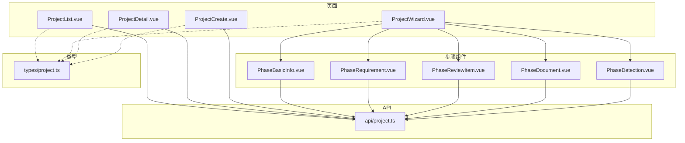

图表来源
- [ProjectList.vue:1-360](file://ele-ai-tender-frontend/src/views/project/ProjectList.vue#L1-L360)
- [ProjectWizard.vue:1-346](file://ele-ai-tender-frontend/src/views/project/ProjectWizard.vue#L1-L346)
- [ProjectDetail.vue:1-543](file://ele-ai-tender-frontend/src/views/project/ProjectDetail.vue#L1-L543)
- [ProjectCreate.vue:1-581](file://ele-ai-tender-frontend/src/views/project/ProjectCreate.vue#L1-L581)
- [project.ts（API）:1-59](file://ele-ai-tender-frontend/src/api/project.ts#L1-L59)
- [project.ts（类型）:1-72](file://ele-ai-tender-frontend/src/types/project.ts#L1-L72)

章节来源
- [ProjectList.vue:1-360](file://ele-ai-tender-frontend/src/views/project/ProjectList.vue#L1-L360)
- [ProjectWizard.vue:1-346](file://ele-ai-tender-frontend/src/views/project/ProjectWizard.vue#L1-L346)
- [ProjectDetail.vue:1-543](file://ele-ai-tender-frontend/src/views/project/ProjectDetail.vue#L1-L543)
- [ProjectCreate.vue:1-581](file://ele-ai-tender-frontend/src/views/project/ProjectCreate.vue#L1-L581)
- [project.ts（API）:1-59](file://ele-ai-tender-frontend/src/api/project.ts#L1-L59)
- [project.ts（类型）:1-72](file://ele-ai-tender-frontend/src/types/project.ts#L1-L72)

## 核心组件
- 项目列表页：支持多条件筛选、分页、批量删除、新建跳转
- 项目创建/编辑页：双模式（系统生成/引用），表单校验，模板加载，预算单位转换
- 项目向导：基于 currentPhase 的五步导航，URL step 同步，发布归档等状态控制
- 项目详情页：基本信息、文档预览/导出、版本管理、操作按钮（发布/归档/取消）
- 阶段组件：基础信息、需求生成、评审项、文档集成、智能检测

章节来源
- [ProjectList.vue:1-360](file://ele-ai-tender-frontend/src/views/project/ProjectList.vue#L1-L360)
- [ProjectCreate.vue:1-581](file://ele-ai-tender-frontend/src/views/project/ProjectCreate.vue#L1-L581)
- [ProjectWizard.vue:1-346](file://ele-ai-tender-frontend/src/views/project/ProjectWizard.vue#L1-L346)
- [ProjectDetail.vue:1-543](file://ele-ai-tender-frontend/src/views/project/ProjectDetail.vue#L1-L543)

## 架构总览
前端以 Vue 单页应用组织，页面通过 api/project.ts 调用 /core-api/v1/projects 系列接口；阶段组件在各自业务域内复用 useLatestTask 轮询 AI 任务状态，SSE 用于文本优化流式输出。

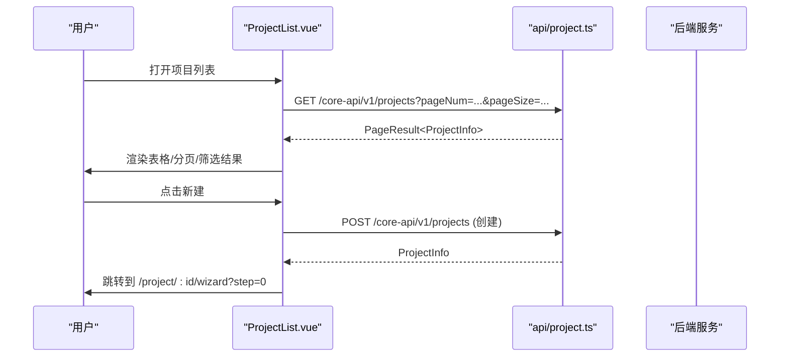

图表来源
- [ProjectList.vue:243-254](file://ele-ai-tender-frontend/src/views/project/ProjectList.vue#L243-L254)
- [project.ts（API）:6-15](file://ele-ai-tender-frontend/src/api/project.ts#L6-L15)

## 详细组件分析

### 项目列表页（ProjectList.vue）
- 展示与筛选
  - 支持按名称/编号、状态、类别、类型、创建时间范围筛选
  - 使用统一的状态/类别/类型映射进行标签化展示
  - 预算金额以万元为单位显示
- 分页与批量操作
  - 分页控件绑定 pageNum/pageSize，切换触发 fetchData
  - 多选后支持批量删除，二次确认后调用 deleteByIds
- 路由跳转
  - 新建跳转至 /project/create
  - 查看详情跳转至 /project/:id

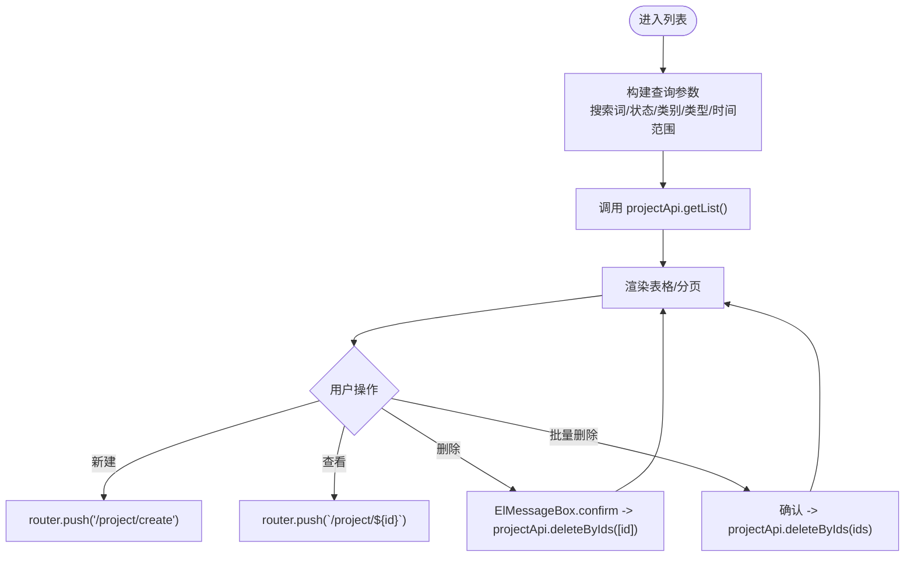

图表来源
- [ProjectList.vue:233-254](file://ele-ai-tender-frontend/src/views/project/ProjectList.vue#L233-L254)
- [ProjectList.vue:287-312](file://ele-ai-tender-frontend/src/views/project/ProjectList.vue#L287-L312)

章节来源
- [ProjectList.vue:1-360](file://ele-ai-tender-frontend/src/views/project/ProjectList.vue#L1-L360)
- [project.ts（API）:6-21](file://ele-ai-tender-frontend/src/api/project.ts#L6-L21)

### 项目创建/编辑页（ProjectCreate.vue）
- 双模式 Tab
  - 系统生成模式：直接填写项目描述等信息
  - 引用模式：选择已完成的业务需求，自动回填类别/类型/预算/内容预览
- 表单校验
  - 必填项：项目编号、项目名称、类别、类型、评审方式、预算、项目描述
  - 异步唯一性校验：项目名称不可重复（排除自身编辑时）
  - 预算数值校验：必须大于 0
- 模板与引用
  - 加载已发布模板列表，供后续阶段使用
  - 引用模式下自动选择评审方式为“人工评审”
- 提交逻辑
  - 新建：保存并跳转到对应项目的向导第一步
  - 编辑：保存修改后跳转到详情页

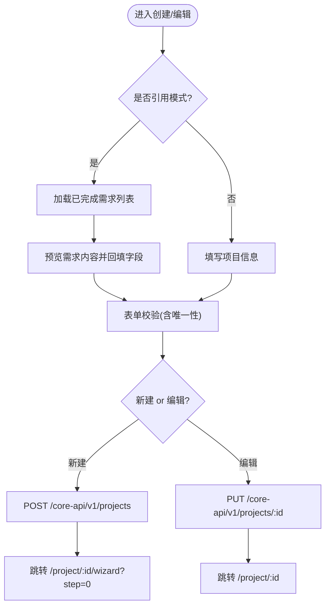

图表来源
- [ProjectCreate.vue:338-451](file://ele-ai-tender-frontend/src/views/project/ProjectCreate.vue#L338-L451)
- [ProjectCreate.vue:475-498](file://ele-ai-tender-frontend/src/views/project/ProjectCreate.vue#L475-L498)
- [project.ts（API）:13-18](file://ele-ai-tender-frontend/src/api/project.ts#L13-L18)

章节来源
- [ProjectCreate.vue:1-581](file://ele-ai-tender-frontend/src/views/project/ProjectCreate.vue#L1-L581)
- [project.ts（API）:13-18](file://ele-ai-tender-frontend/src/api/project.ts#L13-L18)

### 项目向导（ProjectWizard.vue）
- 五步流程
  - 基础信息 → 详细需求 → 评审项设置 → 文档集成 → 智能检测
- 进度控制
  - 根据项目 currentPhase 计算 phaseStep，已发布/归档视为全部完成
  - URL query.step 与内部 currentStep 双向同步，限制仅能访问已解锁步骤
- 下一步/上一步
  - 每步完成后调用 advancePhase 推进阶段，并更新 phaseStep
- 完成发布
  - 最后一步点击“完成编制”调用 publish，成功后返回列表

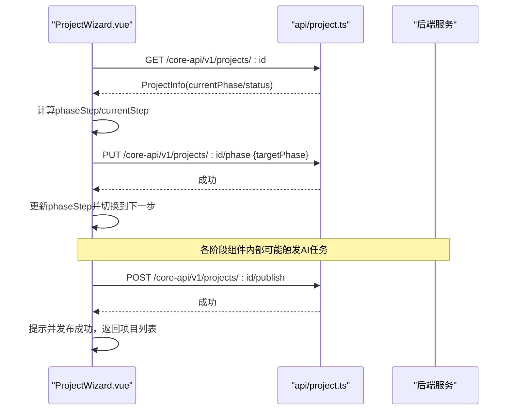

图表来源
- [ProjectWizard.vue:122-138](file://ele-ai-tender-frontend/src/views/project/ProjectWizard.vue#L122-L138)
- [ProjectWizard.vue:169-189](file://ele-ai-tender-frontend/src/views/project/ProjectWizard.vue#L169-L189)
- [ProjectWizard.vue:193-205](file://ele-ai-tender-frontend/src/views/project/ProjectWizard.vue#L193-L205)
- [project.ts（API）:28-51](file://ele-ai-tender-frontend/src/api/project.ts#L28-L51)

章节来源
- [ProjectWizard.vue:1-346](file://ele-ai-tender-frontend/src/views/project/ProjectWizard.vue#L1-L346)
- [project.ts（API）:28-51](file://ele-ai-tender-frontend/src/api/project.ts#L28-L51)

### 项目详情页（ProjectDetail.vue）
- 基本信息展示
  - 编号、类别、类型、预算、联系人、创建人、时间等
- 文档操作
  - 预览/导出：当存在 generatedFileId 时可用
- 版本管理
  - 列出版本记录，支持版本对比弹窗
- 状态驱动的操作按钮
  - 检测通过可发布；已发布可归档；未发布/未归档/未取消可取消
- 时间线跳转
  - 点击时间线节点跳转到向导对应步骤（注意索引映射）

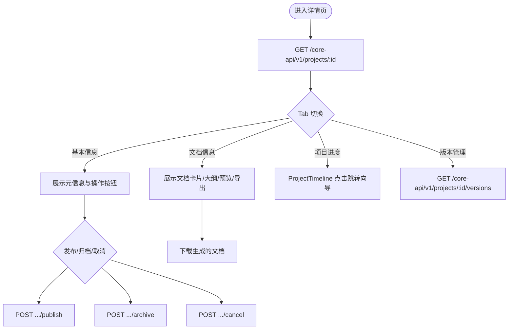

图表来源
- [ProjectDetail.vue:281-298](file://ele-ai-tender-frontend/src/views/project/ProjectDetail.vue#L281-L298)
- [ProjectDetail.vue:321-345](file://ele-ai-tender-frontend/src/views/project/ProjectDetail.vue#L321-L345)
- [ProjectDetail.vue:347-384](file://ele-ai-tender-frontend/src/views/project/ProjectDetail.vue#L347-L384)
- [project.ts（API）:22-51](file://ele-ai-tender-frontend/src/api/project.ts#L22-L51)

章节来源
- [ProjectDetail.vue:1-543](file://ele-ai-tender-frontend/src/views/project/ProjectDetail.vue#L1-L543)
- [project.ts（API）:22-51](file://ele-ai-tender-frontend/src/api/project.ts#L22-L51)

### 阶段组件概览

#### 基础信息（PhaseBasicInfo.vue）
- 项目基本信息表单 + 模板选择网格
- 历史招标文件匹配：自动匹配/手动选择/上传三种模式
- 保存并继续：更新项目信息、绑定模板快照、推进到“需求生成”阶段

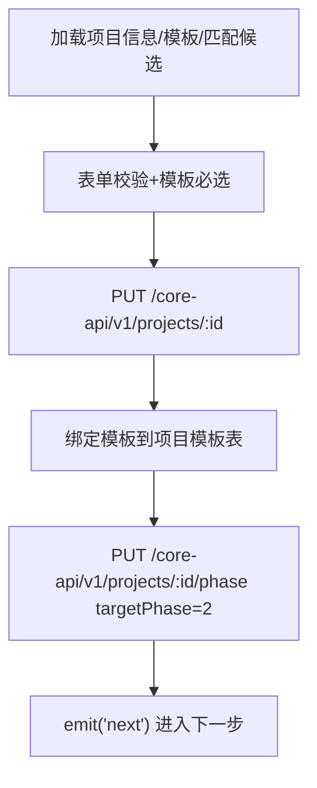

图表来源
- [PhaseBasicInfo.vue:466-501](file://ele-ai-tender-frontend/src/views/project/phases/PhaseBasicInfo.vue#L466-L501)
- [project.ts（API）:28-31](file://ele-ai-tender-frontend/src/api/project.ts#L28-L31)

章节来源
- [PhaseBasicInfo.vue:1-733](file://ele-ai-tender-frontend/src/views/project/phases/PhaseBasicInfo.vue#L1-L733)

#### 详细需求（PhaseRequirement.vue）
- AI 生成状态卡片：任务创建中/排队中/处理中/结果同步中/完成
- 编辑器实时填充：解析进度对象，逐步写入 Markdown 内容
- 自动保存：定时将编辑器内容保存到项目 requirementContent
- 反馈机制：对 AI 生成内容进行点赞/踩反馈
- 确认需求：保存并推进到“评审项设置”

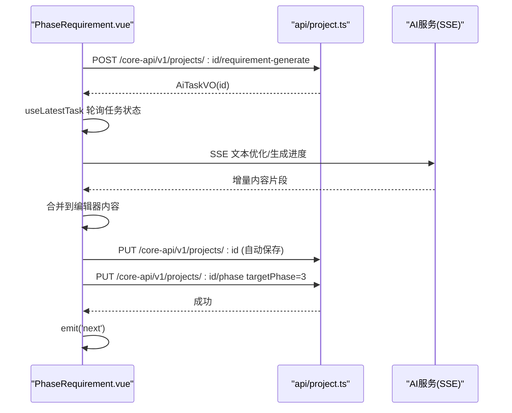

图表来源
- [PhaseRequirement.vue:392-414](file://ele-ai-tender-frontend/src/views/project/phases/PhaseRequirement.vue#L392-L414)
- [PhaseRequirement.vue:513-527](file://ele-ai-tender-frontend/src/views/project/phases/PhaseRequirement.vue#L513-L527)
- [project.ts（API）:32-35](file://ele-ai-tender-frontend/src/api/project.ts#L32-L35)

章节来源
- [PhaseRequirement.vue:1-803](file://ele-ai-tender-frontend/src/views/project/phases/PhaseRequirement.vue#L1-L803)

#### 评审项设置（PhaseReviewItem.vue）
- 评分模式：权重模式（各类权重合计100%，每类分值合计100）或分值模式（总分100）
- 树形评审项：支持增删改、层级限制（最多3级）、主观/客观标注
- AI 生成评审项：刷新任务状态，成功后加载树形数据
- 确认评审项：校验通过后保存并推进到“文档集成”

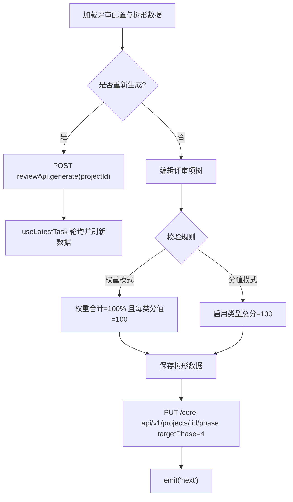

图表来源
- [PhaseReviewItem.vue:695-717](file://ele-ai-tender-frontend/src/views/project/phases/PhaseReviewItem.vue#L695-L717)
- [PhaseReviewItem.vue:757-800](file://ele-ai-tender-frontend/src/views/project/phases/PhaseReviewItem.vue#L757-L800)

章节来源
- [PhaseReviewItem.vue:1-1192](file://ele-ai-tender-frontend/src/views/project/phases/PhaseReviewItem.vue#L1-L1192)

#### 文档集成（PhaseDocument.vue）
- 文档集成任务：提交后轮询任务状态，完成后展示预览
- 预览与工具栏：目录导航、打印、缩放、下载
- 政策文件匹配：知识库/平台/本单位三类文件勾选，提交检测时携带 policyFileIds
- 提交检测：推进到“智能检测”阶段

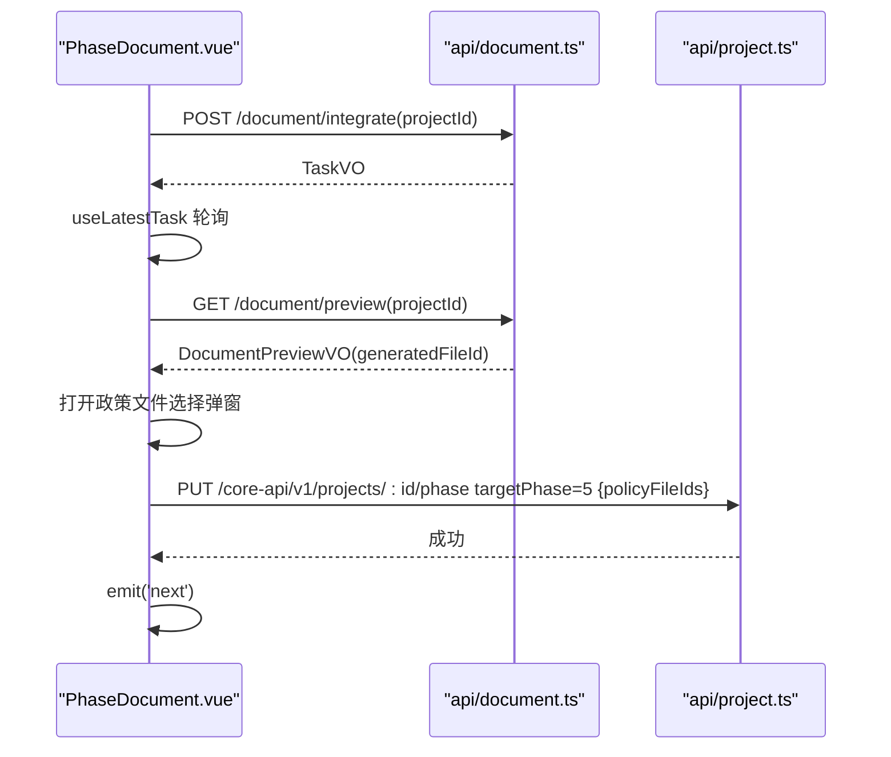

图表来源
- [PhaseDocument.vue:387-406](file://ele-ai-tender-frontend/src/views/project/phases/PhaseDocument.vue#L387-L406)
- [PhaseDocument.vue:343-364](file://ele-ai-tender-frontend/src/views/project/phases/PhaseDocument.vue#L343-L364)
- [project.ts（API）:28-31](file://ele-ai-tender-frontend/src/api/project.ts#L28-L31)

章节来源
- [PhaseDocument.vue:1-822](file://ele-ai-tender-frontend/src/views/project/phases/PhaseDocument.vue#L1-L822)

#### 智能检测（PhaseDetection.vue）
- 检测类型：敏感词、错别字、政策审查、格式规范
- 检测进度：提交后轮询进度，完成后展示检测报告
- 报告处理：接受/拒绝建议、一键接受全部、重新检测
- 定位高亮：点击问题在文档预览中高亮定位

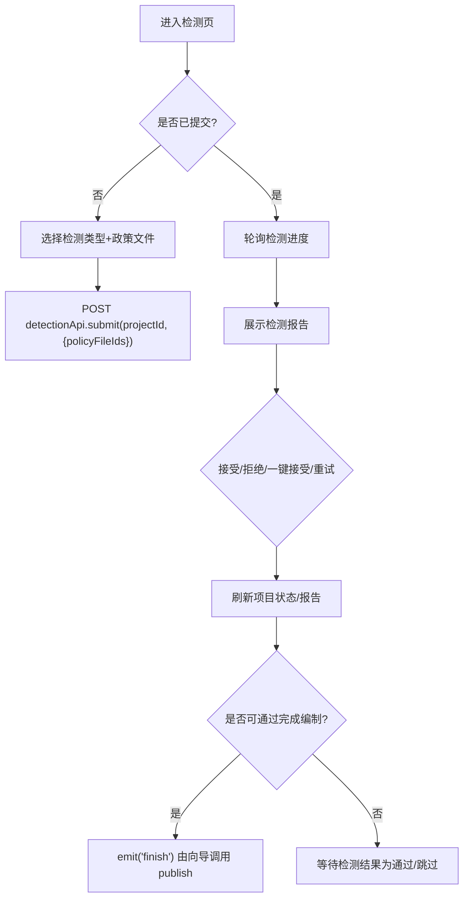

图表来源
- [PhaseDetection.vue:196-219](file://ele-ai-tender-frontend/src/views/project/phases/PhaseDetection.vue#L196-L219)
- [PhaseDetection.vue:233-244](file://ele-ai-tender-frontend/src/views/project/phases/PhaseDetection.vue#L233-L244)
- [PhaseDetection.vue:246-264](file://ele-ai-tender-frontend/src/views/project/phases/PhaseDetection.vue#L246-L264)

章节来源
- [PhaseDetection.vue:1-379](file://ele-ai-tender-frontend/src/views/project/phases/PhaseDetection.vue#L1-L379)

## 依赖关系分析
- 页面与 API
  - 列表/详情/创建均依赖 projectApi 提供的 CRUD、阶段推进、状态变更、版本查询等接口
- 阶段组件与任务轮询
  - 需求生成、评审项生成、文档集成均通过 useLatestTask 轮询 AI 任务状态，并在 resultSynced=1 时刷新业务数据
- 类型与常量
  - types/project.ts 提供 ProjectInfo、ProjectQueryParams、ProjectCreateParams、ProjectVersionInfo 等类型
  - 状态/类别/类型映射在页面中用于标签展示

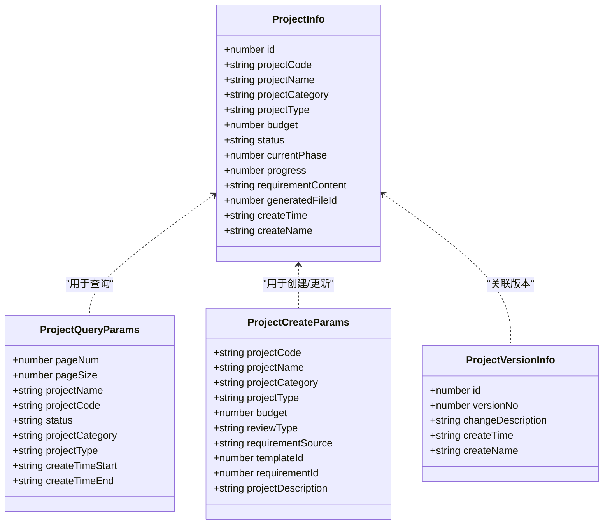

图表来源
- [project.ts（类型）:1-72](file://ele-ai-tender-frontend/src/types/project.ts#L1-L72)

章节来源
- [project.ts（类型）:1-72](file://ele-ai-tender-frontend/src/types/project.ts#L1-L72)
- [project.ts（API）:1-59](file://ele-ai-tender-frontend/src/api/project.ts#L1-L59)

## 性能与体验优化
- 列表页
  - 分页与筛选组合查询，避免全量拉取
  - 预算与时间格式化在展示层处理，减少后端负担
- 向导与阶段
  - 使用 useLatestTask 统一轮询策略，避免重复请求
  - 需求生成采用 SSE 增量填充，提升长任务感知度
  - 自动保存间隔合理，避免频繁写库
- 文档集成
  - 预览前获取文件大小/页数，增强用户体验
  - 目录导航与缩放提升阅读效率

[本节为通用指导，不直接分析具体文件]

## 故障排查指南
- 列表加载失败
  - 检查 queryParams 是否正确构建，确认网络与权限
  - 参考：[ProjectList.vue:243-254](file://ele-ai-tender-frontend/src/views/project/ProjectList.vue#L243-L254)
- 创建/编辑校验失败
  - 项目名称唯一性校验需关注 excludeId（编辑场景）
  - 预算值必须大于 0
  - 参考：[ProjectCreate.vue:282-332](file://ele-ai-tender-frontend/src/views/project/ProjectCreate.vue#L282-L332)
- 阶段推进失败
  - 检查当前项目状态是否允许推进，错误消息提示用户稍后重试
  - 参考：[PhaseBasicInfo.vue:495-501](file://ele-ai-tender-frontend/src/views/project/phases/PhaseBasicInfo.vue#L495-L501)
- AI 任务冲突
  - 若返回特定错误码（如 8084），提示“任务正在处理中”，并刷新状态
  - 参考：[PhaseRequirement.vue:407-413](file://ele-ai-tender-frontend/src/views/project/phases/PhaseRequirement.vue#L407-L413)
- 文档导出失败
  - 检查 generatedFileId 是否存在，捕获异常并提示
  - 参考：[ProjectDetail.vue:321-345](file://ele-ai-tender-frontend/src/views/project/ProjectDetail.vue#L321-L345)

章节来源
- [ProjectList.vue:243-254](file://ele-ai-tender-frontend/src/views/project/ProjectList.vue#L243-L254)
- [ProjectCreate.vue:282-332](file://ele-ai-tender-frontend/src/views/project/ProjectCreate.vue#L282-L332)
- [PhaseBasicInfo.vue:495-501](file://ele-ai-tender-frontend/src/views/project/phases/PhaseBasicInfo.vue#L495-L501)
- [PhaseRequirement.vue:407-413](file://ele-ai-tender-frontend/src/views/project/phases/PhaseRequirement.vue#L407-L413)
- [ProjectDetail.vue:321-345](file://ele-ai-tender-frontend/src/views/project/ProjectDetail.vue#L321-L345)

## 结论
本项目管理模块以清晰的页面分层与阶段化工作流为核心，结合 AI 任务轮询与 SSE 流式更新，实现了从项目创建到文档生成与合规检测的全链路自动化。通过完善的表单校验、状态驱动的操作按钮与版本管理，保证了业务流程的可控性与可追溯性。建议在后续迭代中持续优化错误提示与用户体验细节，并完善权限控制与审计日志。