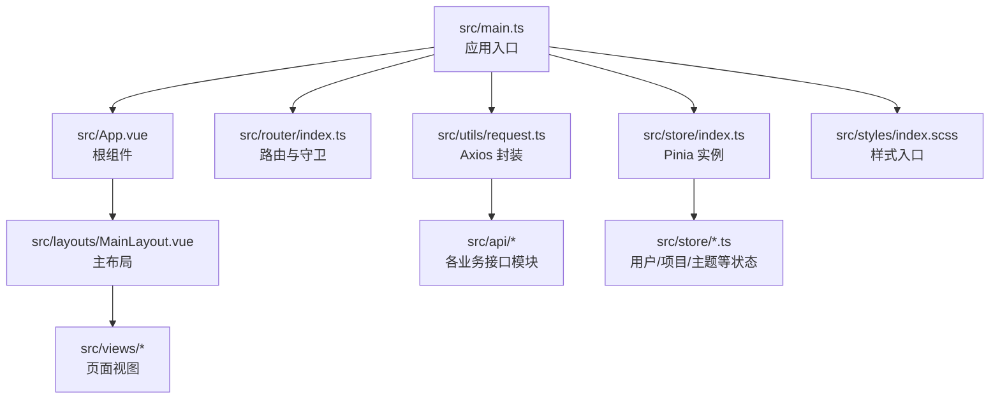
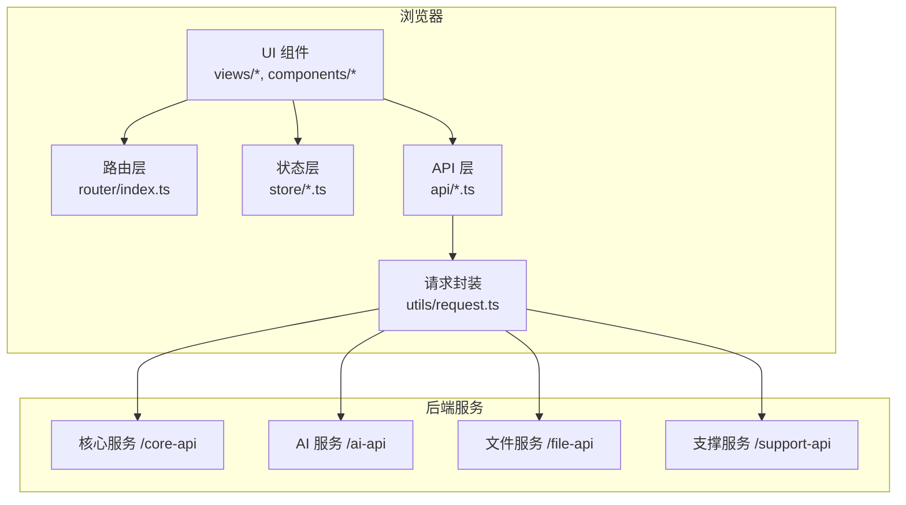
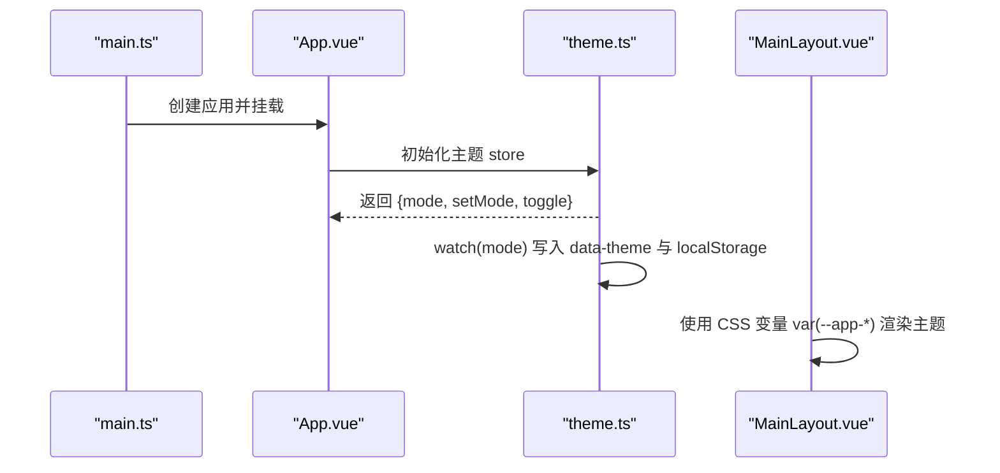
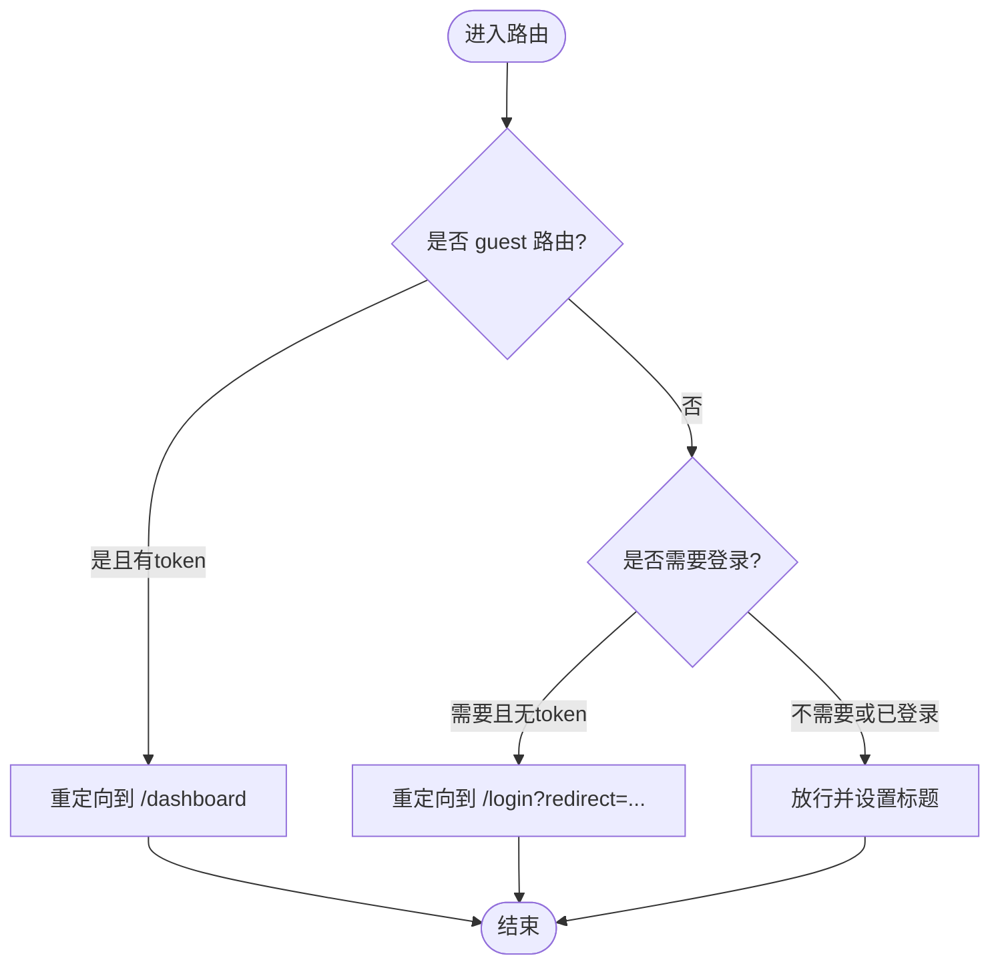
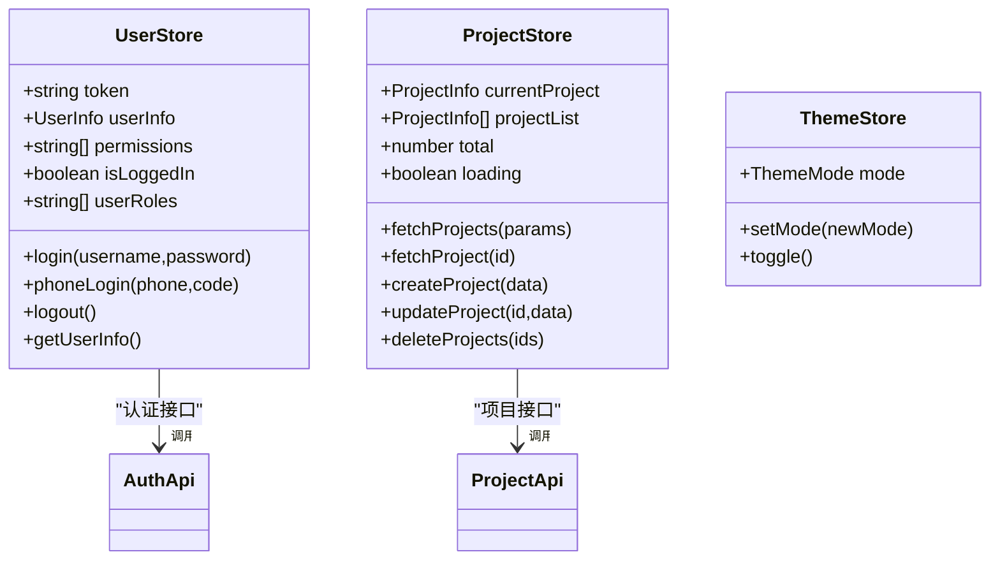
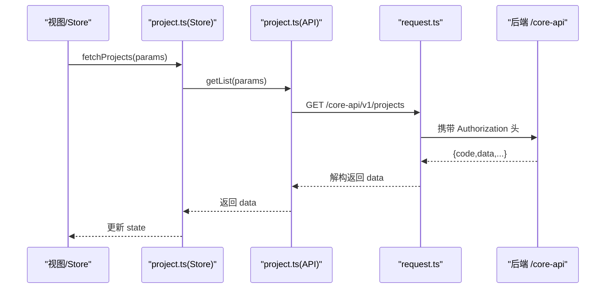
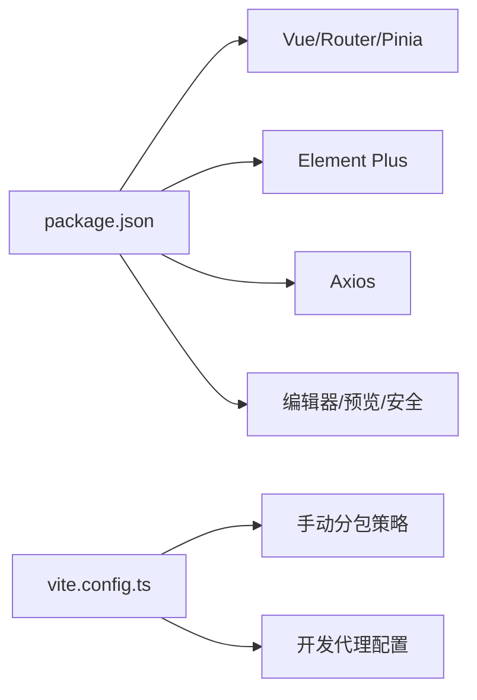

# 主应用 (ele-ai-tender-frontend)

<cite>
**本文引用的文件**   
- [package.json](file://ele-ai-tender-frontend/package.json)
- [vite.config.ts](file://ele-ai-tender-frontend/vite.config.ts)
- [main.ts](file://ele-ai-tender-frontend/src/main.ts)
- [App.vue](file://ele-ai-tender-frontend/src/App.vue)
- [index.ts（路由）](file://ele-ai-tender-frontend/src/router/index.ts)
- [index.ts（Pinia）](file://ele-ai-tender-frontend/src/store/index.ts)
- [user.ts（用户状态）](file://ele-ai-tender-frontend/src/store/user.ts)
- [project.ts（项目状态）](file://ele-ai-tender-frontend/src/store/project.ts)
- [theme.ts（主题状态）](file://ele-ai-tender-frontend/src/store/theme.ts)
- [request.ts（请求封装）](file://ele-ai-tender-frontend/src/utils/request.ts)
- [auth.ts（认证接口）](file://ele-ai-tender-frontend/src/api/auth.ts)
- [project.ts（项目接口）](file://ele-ai-tender-frontend/src/api/project.ts)
- [index.scss（样式入口）](file://ele-ai-tender-frontend/src/styles/index.scss)
- [MainLayout.vue（主布局）](file://ele-ai-tender-frontend/src/layouts/MainLayout.vue)
- [dashboard/index.vue（工作台）](file://ele-ai-tender-frontend/src/views/dashboard/index.vue)
</cite>

## 目录
1. [简介](#简介)
2. [项目结构](#项目结构)
3. [核心组件](#核心组件)
4. [架构总览](#架构总览)
5. [详细组件分析](#详细组件分析)
6. [依赖分析](#依赖分析)
7. [性能考虑](#性能考虑)
8. [故障排查指南](#故障排查指南)
9. [结论](#结论)
10. [附录](#附录)

## 简介
本文件为“招标文件AI编制系统”的用户端主应用文档，聚焦基于 Vue 3 + TypeScript + Vite 的前端工程。内容涵盖应用初始化、路由设计、状态管理(Pinia)、API 封装层、组件库集成、样式与主题、开发构建与调试等。同时提供项目管理、文档编辑、AI助手、实时协作等核心功能的界面说明与实现要点。

## 项目结构
前端采用按功能域划分的目录组织方式：
- src/api：按业务域拆分 API 模块（如 auth、project、ai 等），统一通过 request 封装发起网络请求
- src/components：通用与领域组件（编辑器、预览、检测、消息、项目等）
- src/composables：可组合式逻辑（自动保存、任务轮询、高亮等）
- src/constants：常量与映射表（如状态映射）
- src/layouts：页面级布局（Header、Sidebar、MainLayout）
- src/router：路由定义与守卫
- src/store：Pinia 状态管理（用户、项目、主题等）
- src/styles：SCSS 样式体系（Token、变量、重置、全局工具类）
- src/types：TypeScript 类型定义
- src/utils：工具函数（加密、存储、预算计算等）
- src/views：页面视图（登录、工作台、项目、需求、政策文件、消息中心等）

图表来源
- [main.ts:1-15](file://ele-ai-tender-frontend/src/main.ts#L1-L15)
- [App.vue:1-11](file://ele-ai-tender-frontend/src/App.vue#L1-L11)
- [index.ts（路由）:1-132](file://ele-ai-tender-frontend/src/router/index.ts#L1-L132)
- [index.ts（Pinia）:1-6](file://ele-ai-tender-frontend/src/store/index.ts#L1-L6)
- [request.ts（请求封装）:1-80](file://ele-ai-tender-frontend/src/utils/request.ts#L1-L80)
- [index.scss（样式入口）:1-22](file://ele-ai-tender-frontend/src/styles/index.scss#L1-L22)
- [MainLayout.vue（主布局）:1-45](file://ele-ai-tender-frontend/src/layouts/MainLayout.vue#L1-L45)

章节来源
- [package.json:1-49](file://ele-ai-tender-frontend/package.json#L1-L49)
- [vite.config.ts:1-106](file://ele-ai-tender-frontend/vite.config.ts#L1-L106)
- [main.ts:1-15](file://ele-ai-tender-frontend/src/main.ts#L1-L15)
- [App.vue:1-11](file://ele-ai-tender-frontend/src/App.vue#L1-L11)
- [index.ts（路由）:1-132](file://ele-ai-tender-frontend/src/router/index.ts#L1-L132)
- [index.ts（Pinia）:1-6](file://ele-ai-tender-frontend/src/store/index.ts#L1-L6)
- [index.scss（样式入口）:1-22](file://ele-ai-tender-frontend/src/styles/index.scss#L1-L22)

## 核心组件
- 应用初始化
  - 入口 main.ts 注册 Pinia、Element Plus（中文语言包）、路由并挂载到 #app
  - App.vue 作为根容器，仅渲染 router-view，并在启动时初始化主题 store，确保 watch 立即生效
- 路由系统
  - 使用 vue-router 的 createWebHistory，配置了登录页与受保护的主布局子路由
  - beforeEach 中根据 meta.requiresAuth/guest 与本地 token 进行鉴权跳转与标题设置
- 状态管理(Pinia)
  - user.ts：维护 token、用户信息、权限；提供登录、手机验证码登录、登出、获取用户信息等动作
  - project.ts：维护当前项目、项目列表、分页总数与加载态；提供列表查询、详情、创建、更新、删除等方法
  - theme.ts：维护明暗主题模式，持久化至 localStorage，并通过 data-theme 属性驱动 CSS 变量切换
- API 封装层
  - utils/request.ts：基于 axios 的封装，统一注入 Authorization 头、处理业务码 401 弹窗与登出、拦截错误提示、支持 blob 下载
  - api/auth.ts：认证相关接口，包含 RSA 公钥获取、密码加密、短信验证码、手机号登录、修改密码、获取用户信息与菜单、登出等
  - api/project.ts：项目相关接口，包括分页列表、详情、创建、更新、批量删除、版本、导出、阶段推进、AI 生成需求、状态变更、取消/发布/归档、名称唯一性校验等
- 组件库集成
  - Element Plus 作为 UI 框架，配合 @element-plus/icons-vue 图标集
  - 编辑器与预览：@tiptap/vue-3 生态、md-editor-v3、docx-preview、diff2html 等
- 样式系统
  - SCSS 模块化：tokens → element-overrides → typography → spacing → reset → global
  - 通过 CSS 自定义属性与 data-theme 实现主题切换与响应式适配

章节来源
- [main.ts:1-15](file://ele-ai-tender-frontend/src/main.ts#L1-L15)
- [App.vue:1-11](file://ele-ai-tender-frontend/src/App.vue#L1-L11)
- [index.ts（路由）:1-132](file://ele-ai-tender-frontend/src/router/index.ts#L1-L132)
- [user.ts（用户状态）:1-75](file://ele-ai-tender-frontend/src/store/user.ts#L1-L75)
- [project.ts（项目状态）:1-44](file://ele-ai-tender-frontend/src/store/project.ts#L1-L44)
- [theme.ts（主题状态）:1-28](file://ele-ai-tender-frontend/src/store/theme.ts#L1-L28)
- [request.ts（请求封装）:1-80](file://ele-ai-tender-frontend/src/utils/request.ts#L1-L80)
- [auth.ts（认证接口）:1-105](file://ele-ai-tender-frontend/src/api/auth.ts#L1-L105)
- [project.ts（项目接口）:1-59](file://ele-ai-tender-frontend/src/api/project.ts#L1-L59)
- [index.scss（样式入口）:1-22](file://ele-ai-tender-frontend/src/styles/index.scss#L1-L22)
- [package.json:1-49](file://ele-ai-tender-frontend/package.json#L1-L49)

## 架构总览
整体采用“单页应用 + 模块化 API + 集中式状态 + 统一请求封装”的架构。Vite 负责开发与构建，Element Plus 提供基础 UI，Pinia 管理跨组件状态，vue-router 控制页面导航与鉴权。

图表来源
- [index.ts（路由）:1-132](file://ele-ai-tender-frontend/src/router/index.ts#L1-L132)
- [index.ts（Pinia）:1-6](file://ele-ai-tender-frontend/src/store/index.ts#L1-L6)
- [request.ts（请求封装）:1-80](file://ele-ai-tender-frontend/src/utils/request.ts#L1-L80)
- [vite.config.ts:60-86](file://ele-ai-tender-frontend/vite.config.ts#L60-L86)

## 详细组件分析

### 应用初始化与主题系统
- 初始化流程
  - main.ts 依次引入 Element Plus 中文语言包、全局样式、Pinia、路由，最后挂载 App
  - App.vue 在根级别调用 useThemeStore()，触发主题 watch 立即执行，确保首屏主题正确
- 主题机制
  - theme.ts 以 ref 维护 mode，watch 同步写入 document.documentElement 的 data-theme 与 localStorage
  - MainLayout.vue 通过 CSS 变量 var(--app-*) 结合 data-theme 实现明暗主题与过渡动画

图表来源
- [main.ts:1-15](file://ele-ai-tender-frontend/src/main.ts#L1-L15)
- [App.vue:1-11](file://ele-ai-tender-frontend/src/App.vue#L1-L11)
- [theme.ts（主题状态）:1-28](file://ele-ai-tender-frontend/src/store/theme.ts#L1-L28)
- [MainLayout.vue（主布局）:1-45](file://ele-ai-tender-frontend/src/layouts/MainLayout.vue#L1-L45)

章节来源
- [main.ts:1-15](file://ele-ai-tender-frontend/src/main.ts#L1-L15)
- [App.vue:1-11](file://ele-ai-tender-frontend/src/App.vue#L1-L11)
- [theme.ts（主题状态）:1-28](file://ele-ai-tender-frontend/src/store/theme.ts#L1-L28)
- [MainLayout.vue（主布局）:1-45](file://ele-ai-tender-frontend/src/layouts/MainLayout.vue#L1-L45)

### 路由系统与鉴权
- 路由定义
  - 登录页 /login 标记 guest，其他主布局下的页面标记 requiresAuth
  - 首页重定向到 /dashboard，其余按功能域划分（需求、项目、政策文件、消息中心）
- 路由守卫
  - beforeEach 读取 localStorage.token，未登录访问受保护路由则跳转到 /login 并携带 redirect
  - 已登录访问登录页则重定向到 /dashboard
  - 动态设置 document.title

图表来源
- [index.ts（路由）:112-131](file://ele-ai-tender-frontend/src/router/index.ts#L112-L131)

章节来源
- [index.ts（路由）:1-132](file://ele-ai-tender-frontend/src/router/index.ts#L1-L132)

### 状态管理(Pinia)
- 用户状态(user.ts)
  - 登录/手机验证码登录：调用 authApi，成功后持久化 token 与 userInfo，并刷新 permissions
  - 登出：清空状态与本地存储，跳转登录页
  - 获取用户信息：带 token 拉取并缓存
- 项目状态(project.ts)
  - 列表/详情/创建/更新/删除：封装 projectApi 调用，统一管理 loading 与分页数据
- 主题状态(theme.ts)
  - 明暗模式切换，持久化与 DOM 属性同步

图表来源
- [user.ts（用户状态）:1-75](file://ele-ai-tender-frontend/src/store/user.ts#L1-L75)
- [project.ts（项目状态）:1-44](file://ele-ai-tender-frontend/src/store/project.ts#L1-L44)
- [theme.ts（主题状态）:1-28](file://ele-ai-tender-frontend/src/store/theme.ts#L1-L28)
- [auth.ts（认证接口）:1-105](file://ele-ai-tender-frontend/src/api/auth.ts#L1-L105)
- [project.ts（项目接口）:1-59](file://ele-ai-tender-frontend/src/api/project.ts#L1-L59)

章节来源
- [user.ts（用户状态）:1-75](file://ele-ai-tender-frontend/src/store/user.ts#L1-L75)
- [project.ts（项目状态）:1-44](file://ele-ai-tender-frontend/src/store/project.ts#L1-L44)
- [theme.ts（主题状态）:1-28](file://ele-ai-tender-frontend/src/store/theme.ts#L1-L28)

### API 接口封装层
- 请求封装(request.ts)
  - 统一 baseURL、超时、Content-Type
  - 请求拦截：注入 Authorization: Bearer token
  - 响应拦截：
    - 直接返回 data（当 responseType === 'blob'）
    - code === 200 返回 data
    - code === 401 弹出确认框后登出（防重复弹窗锁）
    - 其他错误统一 ElMessage.error 提示
    - 网络错误 401 直接登出
- 认证接口(auth.ts)
  - 获取 RSA 公钥，对密码进行加密后再提交
  - 支持短信验证码登录、重置密码、修改密码、获取用户信息与菜单、登出
- 项目接口(project.ts)
  - 标准 CRUD、版本、导出、阶段推进、AI 生成需求、状态变更、取消/发布/归档、名称唯一性校验

图表来源
- [project.ts（项目状态）:1-44](file://ele-ai-tender-frontend/src/store/project.ts#L1-L44)
- [project.ts（项目接口）:1-59](file://ele-ai-tender-frontend/src/api/project.ts#L1-L59)
- [request.ts（请求封装）:1-80](file://ele-ai-tender-frontend/src/utils/request.ts#L1-L80)

章节来源
- [request.ts（请求封装）:1-80](file://ele-ai-tender-frontend/src/utils/request.ts#L1-L80)
- [auth.ts（认证接口）:1-105](file://ele-ai-tender-frontend/src/api/auth.ts#L1-L105)
- [project.ts（项目接口）:1-59](file://ele-ai-tender-frontend/src/api/project.ts#L1-L59)

### 用户界面功能说明
- 工作台(dashboard/index.vue)
  - 统计卡片：项目总数、需求总数、检测通过率、进行中项目数
  - 最近项目表格：点击项目名称跳转详情页
  - 快捷操作：新建需求/项目、查看需求/项目列表
  - 待办事项：聚合待检测项目、进行中需求等
  - 数据来源：并行调用 projectApi 与 requirementApi，使用 Promise.allSettled 容错
- 主布局(MainLayout.vue)
  - 顶部 Header、左侧 Sidebar、右侧内容区，使用 CSS 变量与过渡提升体验
- 编辑器与预览
  - 使用 @tiptap/vue-3 与 md-editor-v3 提供富文本与 Markdown 编辑能力
  - docx-preview 用于 Word 文档在线预览
- AI 助手与实时协作
  - 侧边栏与聊天面板组件（AiAssistantSidebar.vue、AiChatPanel.vue）承载 AI 对话交互
  - 结合 composables/useTaskPolling.ts 与 useLatestTask.ts 实现任务轮询与最新任务展示
  - 实时协作可通过 WebSocket/SSE 扩展（当前仓库未包含具体实现，可在现有 Store 与 API 层基础上接入）

章节来源
- [dashboard/index.vue（工作台）:1-289](file://ele-ai-tender-frontend/src/views/dashboard/index.vue#L1-L289)
- [MainLayout.vue（主布局）:1-45](file://ele-ai-tender-frontend/src/layouts/MainLayout.vue#L1-L45)
- [package.json:14-32](file://ele-ai-tender-frontend/package.json#L14-L32)

## 依赖分析
- 运行时依赖
  - Vue 3、Vue Router、Pinia、Element Plus、Axios、SCSS 编译器等
  - 编辑器与预览：@tiptap/vue-3、md-editor-v3、docx-preview、diff2html
  - 安全：jsencrypt（RSA 加解密）
- 开发依赖
  - Vite、@vitejs/plugin-vue、TypeScript、vue-tsc
- 构建与分包
  - vite.config.ts 将 element-plus 与 vue/vue-router/pinia 拆分为独立 chunk，减少首屏体积
  - 生产环境 base 路径为 /ele-ai-tender-web/，输出目录 ele-ai-tender-web

图表来源
- [package.json:14-49](file://ele-ai-tender-frontend/package.json#L14-L49)
- [vite.config.ts:87-103](file://ele-ai-tender-frontend/vite.config.ts#L87-L103)

章节来源
- [package.json:1-49](file://ele-ai-tender-frontend/package.json#L1-L49)
- [vite.config.ts:1-106](file://ele-ai-tender-frontend/vite.config.ts#L1-L106)

## 性能考虑
- 路由懒加载：所有业务页面均使用动态 import，降低首屏体积
- 分包优化：Element Plus 与 Vue 生态库单独打包，利于浏览器缓存
- 请求优化：统一超时与错误处理，避免重复 401 弹窗
- 资源体积：按需引入 Element Plus 图标与组件（当前全量引入，可按需优化）
- 构建产物：关闭 sourcemap，提高构建速度并减小产物体积

[本节为通用指导，不直接分析具体文件]

## 故障排查指南
- 登录与鉴权
  - 现象：频繁弹出“登录状态已过期”
  - 排查：检查 request.ts 的 401 处理逻辑与 isShowing401Dialog 锁；确认后端返回的业务码是否为 401
  - 参考：[request.ts（请求封装）:48-66](file://ele-ai-tender-frontend/src/utils/request.ts#L48-L66)
- 网络错误
  - 现象：统一提示“网络错误”
  - 排查：检查 Axios 响应拦截器错误分支与后端实际返回；确认代理是否正确转发
  - 参考：[request.ts（请求封装）:68-76](file://ele-ai-tender-frontend/src/utils/request.ts#L68-L76)
- 代理问题
  - 现象：开发环境请求 404 或跨域
  - 排查：检查 vite.config.ts 的 proxy 配置与目标地址环境变量；查看 logs/vite-proxy.log 日志
  - 参考：[vite.config.ts:77-86](file://ele-ai-tender-frontend/vite.config.ts#L77-L86)
- 主题不生效
  - 现象：切换主题无效或首屏闪烁
  - 排查：确认 App.vue 是否初始化 useThemeStore()；检查 data-theme 属性与 CSS 变量覆盖
  - 参考：[App.vue:1-11](file://ele-ai-tender-frontend/src/App.vue#L1-L11)、[theme.ts（主题状态）:1-28](file://ele-ai-tender-frontend/src/store/theme.ts#L1-L28)

章节来源
- [request.ts（请求封装）:1-80](file://ele-ai-tender-frontend/src/utils/request.ts#L1-L80)
- [vite.config.ts:1-106](file://ele-ai-tender-frontend/vite.config.ts#L1-L106)
- [App.vue:1-11](file://ele-ai-tender-frontend/src/App.vue#L1-L11)
- [theme.ts（主题状态）:1-28](file://ele-ai-tender-frontend/src/store/theme.ts#L1-L28)

## 结论
该主应用以 Vue 3 + TypeScript + Vite 为核心，采用清晰的分层与模块化组织：路由与鉴权、Pinia 状态、Axios 封装、Element Plus 组件库与 SCSS 主题体系协同工作。通过懒加载与分包策略保障性能，统一的请求与错误处理提升稳定性。后续可在编辑器与 AI 助手方面持续增强，并引入按需加载与更细粒度的代码分割进一步优化首屏体验。

[本节为总结性内容，不直接分析具体文件]

## 附录
- 开发环境搭建
  - 安装依赖：npm install
  - 启动开发服务器：npm run dev（默认端口 5173）
  - 多环境：dev:test/dev:local 通过 --mode 指定
  - 构建：npm run build（生产）/ npm run build:test（测试）
  - 预览：npm run preview
- 环境变量与代理
  - 通过 VITE_CORE_API_URL、VITE_AI_API_URL、VITE_FILE_API_URL、VITE_SUPPORT_API_URL 配置后端地址
  - 开发代理将 /core-api、/ai-api、/file-api、/support-api 转发到对应服务
- 调试技巧
  - 打开浏览器控制台查看 Network 与 Console
  - 查看 logs/vite-proxy.log 了解代理重写后的目标 URL
  - 使用 Vue Devtools 检查组件树与 Pinia 状态
- 国际化支持
  - 当前 Element Plus 使用 zh-cn 语言包
  - 如需多语言，可在 Pinia 中维护 locale，动态切换 Element Plus 语言与文案

章节来源
- [package.json:6-12](file://ele-ai-tender-frontend/package.json#L6-L12)
- [vite.config.ts:60-86](file://ele-ai-tender-frontend/vite.config.ts#L60-L86)
- [main.ts:1-15](file://ele-ai-tender-frontend/src/main.ts#L1-L15)