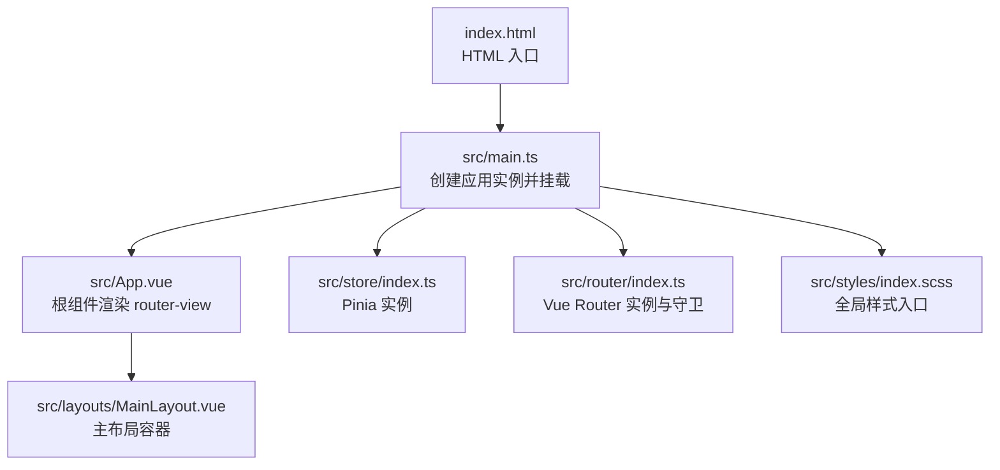
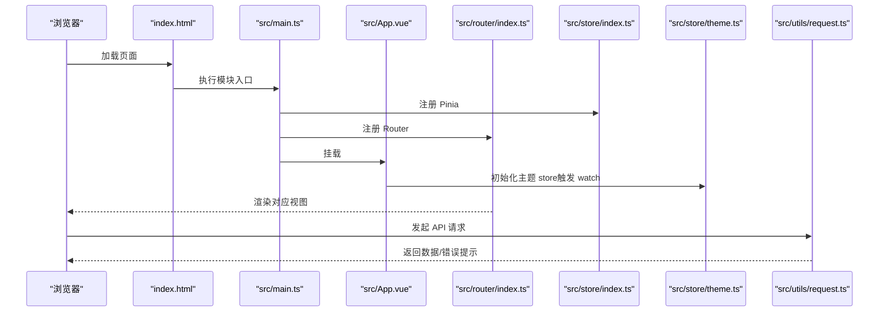
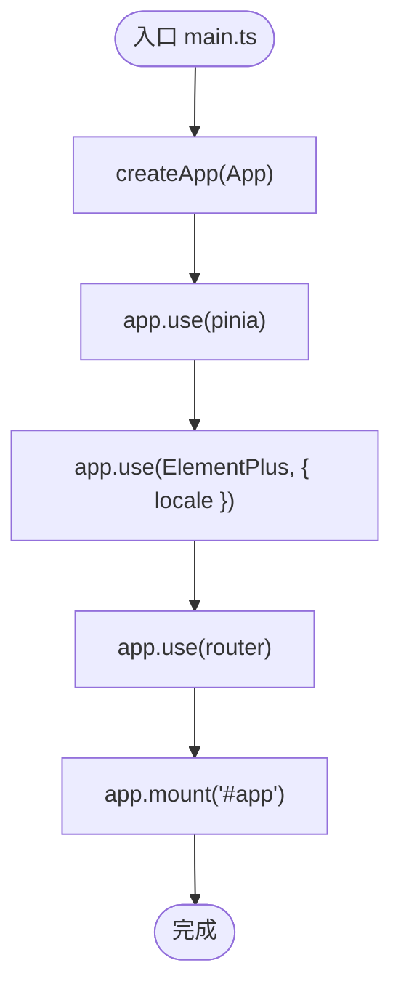
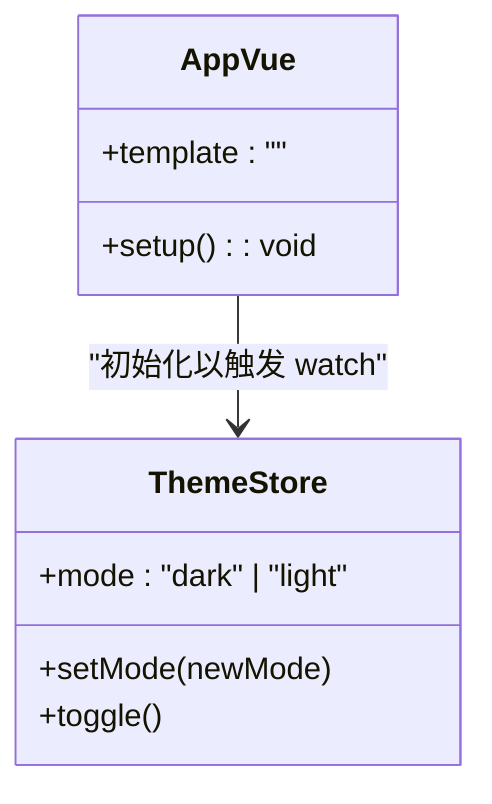
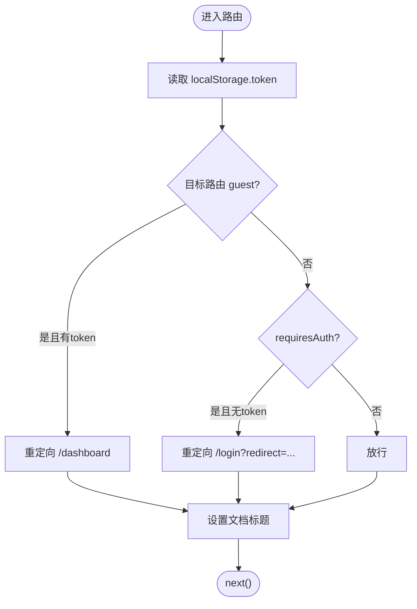
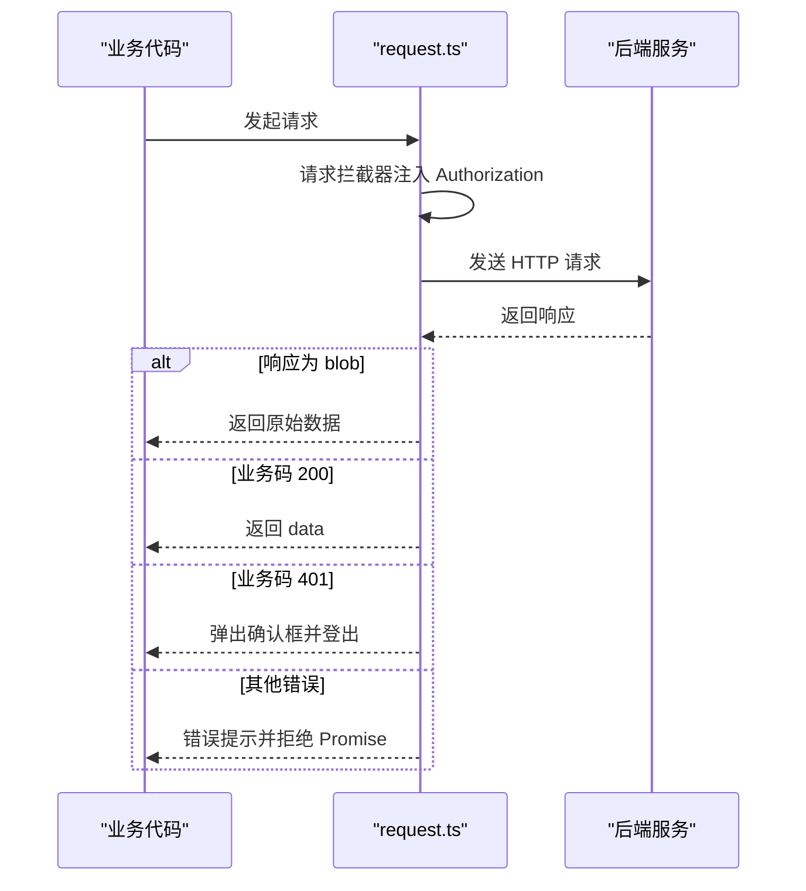
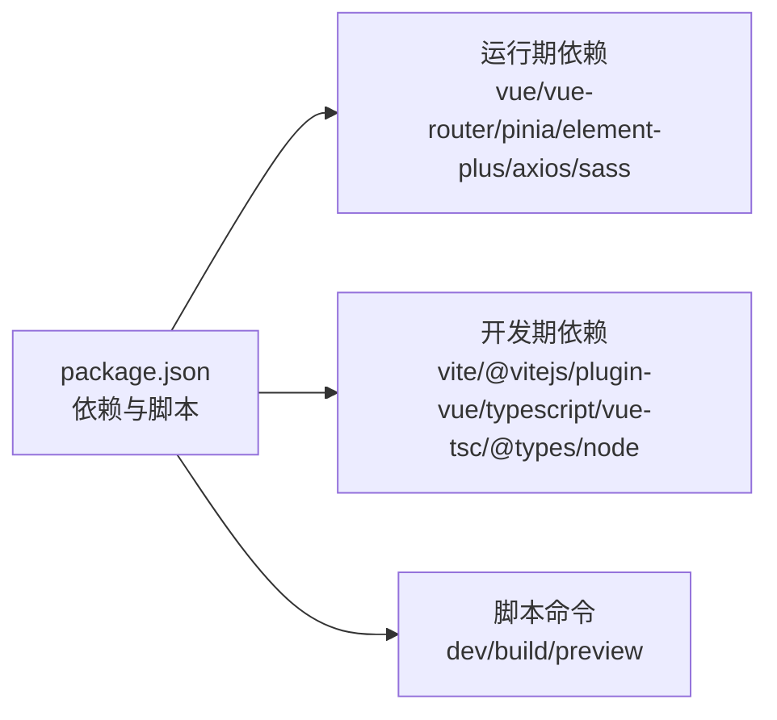
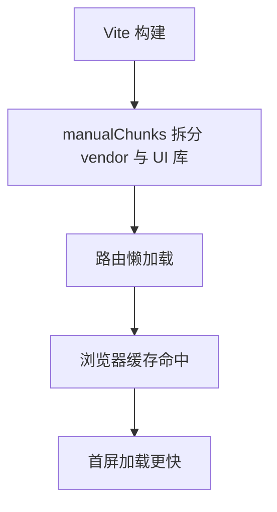

# 应用初始化与配置

<cite>
**本文引用的文件**   
- [ele-ai-tender-frontend/src/main.ts](file://ele-ai-tender-frontend/src/main.ts)
- [ele-ai-tender-frontend/src/App.vue](file://ele-ai-tender-frontend/src/App.vue)
- [ele-ai-tender-frontend/index.html](file://ele-ai-tender-frontend/index.html)
- [ele-ai-tender-frontend/vite.config.ts](file://ele-ai-tender-frontend/vite.config.ts)
- [ele-ai-tender-frontend/package.json](file://ele-ai-tender-frontend/package.json)
- [ele-ai-tender-frontend/tsconfig.json](file://ele-ai-tender-frontend/tsconfig.json)
- [ele-ai-tender-frontend/tsconfig.app.json](file://ele-ai-tender-frontend/tsconfig.app.json)
- [ele-ai-tender-frontend/tsconfig.node.json](file://ele-ai-tender-frontend/tsconfig.node.json)
- [ele-ai-tender-frontend/src/store/index.ts](file://ele-ai-tender-frontend/src/store/index.ts)
- [ele-ai-tender-frontend/src/router/index.ts](file://ele-ai-tender-frontend/src/router/index.ts)
- [ele-ai-tender-frontend/src/styles/index.scss](file://ele-ai-tender-frontend/src/styles/index.scss)
- [ele-ai-tender-frontend/src/store/theme.ts](file://ele-ai-tender-frontend/src/store/theme.ts)
- [ele-ai-tender-frontend/src/utils/request.ts](file://ele-ai-tender-frontend/src/utils/request.ts)
- [ele-ai-tender-frontend/src/layouts/MainLayout.vue](file://ele-ai-tender-frontend/src/layouts/MainLayout.vue)
</cite>

## 目录
1. [简介](#简介)
2. [项目结构](#项目结构)
3. [核心组件](#核心组件)
4. [架构总览](#架构总览)
5. [详细组件分析](#详细组件分析)
6. [依赖分析](#依赖分析)
7. [性能考虑](#性能考虑)
8. [故障排查指南](#故障排查指南)
9. [结论](#结论)
10. [附录](#附录)

## 简介
本文件聚焦于前端 Vue 3 应用的初始化与配置，覆盖从入口启动、插件注册、全局样式引入，到 Vite 构建、TypeScript 编译选项、路由与状态管理、网络请求封装、主题切换与错误处理等关键内容。同时提供开发环境搭建建议、环境变量配置、性能优化与代码分割策略，帮助读者快速理解并高效维护该应用。

## 项目结构
前端工程位于 ele-ai-tender-frontend 目录，采用模块化组织：
- 入口与根组件：index.html、src/main.ts、src/App.vue
- 构建与类型：vite.config.ts、tsconfig.*、package.json
- 路由与布局：src/router/index.ts、src/layouts/MainLayout.vue
- 状态管理：src/store/index.ts、src/store/theme.ts
- 网络请求：src/utils/request.ts
- 全局样式：src/styles/index.scss

图表来源
- [ele-ai-tender-frontend/index.html:1-15](file://ele-ai-tender-frontend/index.html#L1-L15)
- [ele-ai-tender-frontend/src/main.ts:1-15](file://ele-ai-tender-frontend/src/main.ts#L1-L15)
- [ele-ai-tender-frontend/src/App.vue:1-11](file://ele-ai-tender-frontend/src/App.vue#L1-L11)
- [ele-ai-tender-frontend/src/store/index.ts:1-6](file://ele-ai-tender-frontend/src/store/index.ts#L1-L6)
- [ele-ai-tender-frontend/src/router/index.ts:1-132](file://ele-ai-tender-frontend/src/router/index.ts#L1-L132)
- [ele-ai-tender-frontend/src/styles/index.scss:1-22](file://ele-ai-tender-frontend/src/styles/index.scss#L1-L22)
- [ele-ai-tender-frontend/src/layouts/MainLayout.vue:1-45](file://ele-ai-tender-frontend/src/layouts/MainLayout.vue#L1-L45)

章节来源
- [ele-ai-tender-frontend/index.html:1-15](file://ele-ai-tender-frontend/index.html#L1-L15)
- [ele-ai-tender-frontend/src/main.ts:1-15](file://ele-ai-tender-frontend/src/main.ts#L1-L15)
- [ele-ai-tender-frontend/src/App.vue:1-11](file://ele-ai-tender-frontend/src/App.vue#L1-L11)
- [ele-ai-tender-frontend/src/layouts/MainLayout.vue:1-45](file://ele-ai-tender-frontend/src/layouts/MainLayout.vue#L1-L45)

## 核心组件
- 应用实例与插件注册
  - 在入口文件中创建 Vue 应用实例，依次注册 Pinia、ElementPlus（含中文语言包）、Router，最后挂载到 DOM。
  - 全局样式通过统一入口 index.scss 引入，确保设计 Token、变量覆盖、字体规范、间距工具、基础重置与全局工具类按序加载。
- 根组件 App.vue
  - 仅包含 <router-view />，并在脚本中调用 useThemeStore() 以触发主题 watch 的立即执行，保证首屏主题正确。
- 路由与守卫
  - 使用 createWebHistory 模式，集中定义业务路由，并通过 beforeEach 实现登录态校验与标题设置。
- 状态管理
  - Pinia 单例在 store/index.ts 中创建并导出；theme store 负责主题持久化与 DOM 属性同步。
- 网络请求
  - 基于 axios 封装 request，统一注入 Authorization 头、拦截业务码 401 并引导重新登录、处理 blob 下载场景与通用错误提示。

章节来源
- [ele-ai-tender-frontend/src/main.ts:1-15](file://ele-ai-tender-frontend/src/main.ts#L1-L15)
- [ele-ai-tender-frontend/src/styles/index.scss:1-22](file://ele-ai-tender-frontend/src/styles/index.scss#L1-L22)
- [ele-ai-tender-frontend/src/App.vue:1-11](file://ele-ai-tender-frontend/src/App.vue#L1-L11)
- [ele-ai-tender-frontend/src/store/index.ts:1-6](file://ele-ai-tender-frontend/src/store/index.ts#L1-L6)
- [ele-ai-tender-frontend/src/store/theme.ts:1-28](file://ele-ai-tender-frontend/src/store/theme.ts#L1-L28)
- [ele-ai-tender-frontend/src/router/index.ts:1-132](file://ele-ai-tender-frontend/src/router/index.ts#L1-L132)
- [ele-ai-tender-frontend/src/utils/request.ts:1-80](file://ele-ai-tender-frontend/src/utils/request.ts#L1-L80)

## 架构总览
下图展示了应用启动与运行时关键路径：HTML 入口加载 main.ts，main.ts 创建应用并挂载插件与样式，App.vue 渲染路由视图，路由守卫控制鉴权，主题 store 驱动 UI 主题，网络请求统一封装。

图表来源
- [ele-ai-tender-frontend/index.html:1-15](file://ele-ai-tender-frontend/index.html#L1-L15)
- [ele-ai-tender-frontend/src/main.ts:1-15](file://ele-ai-tender-frontend/src/main.ts#L1-L15)
- [ele-ai-tender-frontend/src/App.vue:1-11](file://ele-ai-tender-frontend/src/App.vue#L1-L11)
- [ele-ai-tender-frontend/src/store/index.ts:1-6](file://ele-ai-tender-frontend/src/store/index.ts#L1-L6)
- [ele-ai-tender-frontend/src/store/theme.ts:1-28](file://ele-ai-tender-frontend/src/store/theme.ts#L1-L28)
- [ele-ai-tender-frontend/src/router/index.ts:1-132](file://ele-ai-tender-frontend/src/router/index.ts#L1-L132)
- [ele-ai-tender-frontend/src/utils/request.ts:1-80](file://ele-ai-tender-frontend/src/utils/request.ts#L1-L80)

## 详细组件分析

### 应用启动流程（main.ts）
- 创建应用实例后，依次注册 Pinia、ElementPlus（中文语言包）、Router，最后挂载到 #app。
- 全局样式通过 @/styles/index.scss 引入，确保样式顺序与变量覆盖生效。

图表来源
- [ele-ai-tender-frontend/src/main.ts:1-15](file://ele-ai-tender-frontend/src/main.ts#L1-L15)

章节来源
- [ele-ai-tender-frontend/src/main.ts:1-15](file://ele-ai-tender-frontend/src/main.ts#L1-L15)

### 根组件与主题初始化（App.vue + theme.ts）
- App.vue 作为最外层容器，仅渲染 <router-view />，并在 setup 中调用 useThemeStore() 以触发主题 watch 的立即执行。
- theme.ts 使用 Pinia 管理主题模式，监听变化后同步到 document.documentElement 的 data-theme 属性，并持久化到 localStorage。

图表来源
- [ele-ai-tender-frontend/src/App.vue:1-11](file://ele-ai-tender-frontend/src/App.vue#L1-L11)
- [ele-ai-tender-frontend/src/store/theme.ts:1-28](file://ele-ai-tender-frontend/src/store/theme.ts#L1-L28)

章节来源
- [ele-ai-tender-frontend/src/App.vue:1-11](file://ele-ai-tender-frontend/src/App.vue#L1-L11)
- [ele-ai-tender-frontend/src/store/theme.ts:1-28](file://ele-ai-tender-frontend/src/store/theme.ts#L1-L28)

### 路由与鉴权守卫（router/index.ts）
- 使用 createWebHistory 模式，集中定义业务路由，并对需要登录的路由进行 meta.requiresAuth 标记。
- beforeEach 中读取 token 判断是否允许访问，未登录时重定向至 /login 并携带 redirect 参数；已登录用户访问 guest 路由时重定向到首页。
- 动态设置 document.title 提升用户体验。

图表来源
- [ele-ai-tender-frontend/src/router/index.ts:1-132](file://ele-ai-tender-frontend/src/router/index.ts#L1-L132)

章节来源
- [ele-ai-tender-frontend/src/router/index.ts:1-132](file://ele-ai-tender-frontend/src/router/index.ts#L1-L132)

### 网络请求封装与错误处理（utils/request.ts）
- 请求拦截器自动注入 Authorization 头（Bearer token）。
- 响应拦截器：
  - 对 responseType 为 blob 的请求直接返回原始数据，便于文件下载。
  - 业务码 200 返回 data；业务码 401 弹出确认框并登出（防重复弹窗锁），其他错误统一提示。
  - 网络层 401 直接登出。
- 结合路由守卫形成完整的鉴权闭环。

图表来源
- [ele-ai-tender-frontend/src/utils/request.ts:1-80](file://ele-ai-tender-frontend/src/utils/request.ts#L1-L80)

章节来源
- [ele-ai-tender-frontend/src/utils/request.ts:1-80](file://ele-ai-tender-frontend/src/utils/request.ts#L1-L80)

### 全局样式体系（styles/index.scss）
- 按序导入设计 Token、Element Plus 变量覆盖、字体规范、间距工具、基础重置与全局工具类，确保 CSS 自定义属性优先定义，后续样式可安全覆盖。
- 在 main.ts 中统一引入，避免分散导入导致样式冲突或覆盖失效。

章节来源
- [ele-ai-tender-frontend/src/styles/index.scss:1-22](file://ele-ai-tender-frontend/src/styles/index.scss#L1-L22)
- [ele-ai-tender-frontend/src/main.ts:1-15](file://ele-ai-tender-frontend/src/main.ts#L1-L15)

### 主布局（layouts/MainLayout.vue）
- 使用 Element Plus 的容器组件组合头部、侧边栏与主内容区，内部嵌套 <router-view /> 承载页面视图。
- 通过 CSS 变量与过渡动画实现主题与交互一致性。

章节来源
- [ele-ai-tender-frontend/src/layouts/MainLayout.vue:1-45](file://ele-ai-tender-frontend/src/layouts/MainLayout.vue#L1-L45)

## 依赖分析
- 运行期依赖
  - vue、vue-router、pinia、element-plus、axios、sass 等。
- 开发期依赖
  - vite、@vitejs/plugin-vue、typescript、vue-tsc、@types/node 等。
- 脚本命令
  - dev、dev:local、dev:test、build、build:test、preview。

图表来源
- [ele-ai-tender-frontend/package.json:1-49](file://ele-ai-tender-frontend/package.json#L1-L49)

章节来源
- [ele-ai-tender-frontend/package.json:1-49](file://ele-ai-tender-frontend/package.json#L1-L49)

## 性能考虑
- 构建输出与分包
  - 生产环境 base 路径与 outDir 明确，关闭 sourcemap，chunkSizeWarningLimit 提高阈值。
  - 使用 manualChunks 将 element-plus 与 vue/vue-router/pinia 拆分为独立 chunk，利于缓存与并行加载。
- 懒加载
  - 路由组件采用动态 import，按需加载减少首屏体积。
- 代理与日志
  - 开发服务器针对多后端接口前缀进行代理重写，并记录代理日志便于调试。
- 浏览器兼容
  - browserslist 限定现代浏览器版本，避免不必要的 polyfill。

图表来源
- [ele-ai-tender-frontend/vite.config.ts:1-106](file://ele-ai-tender-frontend/vite.config.ts#L1-L106)
- [ele-ai-tender-frontend/src/router/index.ts:1-132](file://ele-ai-tender-frontend/src/router/index.ts#L1-L132)
- [ele-ai-tender-frontend/package.json:1-49](file://ele-ai-tender-frontend/package.json#L1-L49)

章节来源
- [ele-ai-tender-frontend/vite.config.ts:1-106](file://ele-ai-tender-frontend/vite.config.ts#L1-L106)
- [ele-ai-tender-frontend/src/router/index.ts:1-132](file://ele-ai-tender-frontend/src/router/index.ts#L1-L132)
- [ele-ai-tender-frontend/package.json:1-49](file://ele-ai-tender-frontend/package.json#L1-L49)

## 故障排查指南
- 登录态异常
  - 现象：频繁弹窗或无法跳转。检查路由守卫与 request 拦截器的 401 处理逻辑，确认 token 存储键名一致。
  - 参考位置：路由守卫与 request 拦截器。
- 主题不生效
  - 现象：首次加载主题不正确。确认 index.html 中 data-theme 初始值与 theme store 的 watch immediate 行为。
  - 参考位置：index.html 与 theme store。
- 样式覆盖无效
  - 现象：Element Plus 变量未生效。确认 styles/index.scss 的导入顺序与 Element Plus 样式引入时机。
  - 参考位置：styles/index.scss 与 main.ts。
- 代理转发异常
  - 现象：开发环境请求 404。检查 vite.config.ts 中的代理前缀与 rewrite 规则，查看 logs/vite-proxy.log 定位问题。
  - 参考位置：vite.config.ts。

章节来源
- [ele-ai-tender-frontend/src/router/index.ts:1-132](file://ele-ai-tender-frontend/src/router/index.ts#L1-L132)
- [ele-ai-tender-frontend/src/utils/request.ts:1-80](file://ele-ai-tender-frontend/src/utils/request.ts#L1-L80)
- [ele-ai-tender-frontend/index.html:1-15](file://ele-ai-tender-frontend/index.html#L1-L15)
- [ele-ai-tender-frontend/src/store/theme.ts:1-28](file://ele-ai-tender-frontend/src/store/theme.ts#L1-L28)
- [ele-ai-tender-frontend/src/styles/index.scss:1-22](file://ele-ai-tender-frontend/src/styles/index.scss#L1-L22)
- [ele-ai-tender-frontend/src/main.ts:1-15](file://ele-ai-tender-frontend/src/main.ts#L1-L15)
- [ele-ai-tender-frontend/vite.config.ts:1-106](file://ele-ai-tender-frontend/vite.config.ts#L1-L106)

## 结论
本项目以清晰的入口与插件注册流程为基础，配合路由守卫、Pinia 主题管理与统一的网络请求封装，形成了稳定易用的前端基础设施。通过 Vite 的分包与懒加载策略，以及严格的 TypeScript 编译选项，项目在可维护性与性能之间取得良好平衡。遵循本文档的配置与最佳实践，可快速扩展新功能并保持整体质量。

## 附录

### 开发环境搭建指南
- Node.js 版本
  - 建议使用较新的 LTS 版本（如 v18+），以确保与 Vite 7.x 及 TypeScript 5.x 的兼容性。
- 包管理器
  - 推荐使用 npm/yarn/pnpm 均可，保持与 package-lock.json 一致即可。
- 安装与运行
  - 安装依赖：npm install
  - 本地开发：npm run dev
  - 指定模式开发：npm run dev:local 或 npm run dev:test
  - 构建：npm run build 或 npm run build:test
  - 预览构建产物：npm run preview
- 环境变量
  - 通过 Vite 的 loadEnv 读取 .env.[mode] 文件，支持以下变量：
    - VITE_CORE_API_URL
    - VITE_AI_API_URL
    - VITE_FILE_API_URL
    - VITE_SUPPORT_API_URL
  - 这些变量用于 vite.config.ts 中的代理 target 配置。

章节来源
- [ele-ai-tender-frontend/package.json:1-49](file://ele-ai-tender-frontend/package.json#L1-L49)
- [ele-ai-tender-frontend/vite.config.ts:1-106](file://ele-ai-tender-frontend/vite.config.ts#L1-L106)

### TypeScript 编译选项要点
- 项目级 tsconfig.json 使用 references 聚合 app 与 node 两个子配置。
- tsconfig.app.json
  - 继承 @vue/tsconfig/dom 基线，启用 vite/client 类型声明，baseUrl 与 paths 映射 @/* 到 src/*，开启严格 lint 相关选项。
- tsconfig.node.json
  - 面向构建脚本与 Vite 配置，target ES2023，moduleResolution bundler，noEmit，strict lint 选项。

章节来源
- [ele-ai-tender-frontend/tsconfig.json:1-8](file://ele-ai-tender-frontend/tsconfig.json#L1-L8)
- [ele-ai-tender-frontend/tsconfig.app.json:1-19](file://ele-ai-tender-frontend/tsconfig.app.json#L1-L19)
- [ele-ai-tender-frontend/tsconfig.node.json:1-25](file://ele-ai-tender-frontend/tsconfig.node.json#L1-L25)