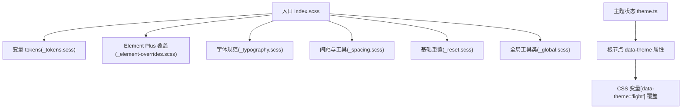
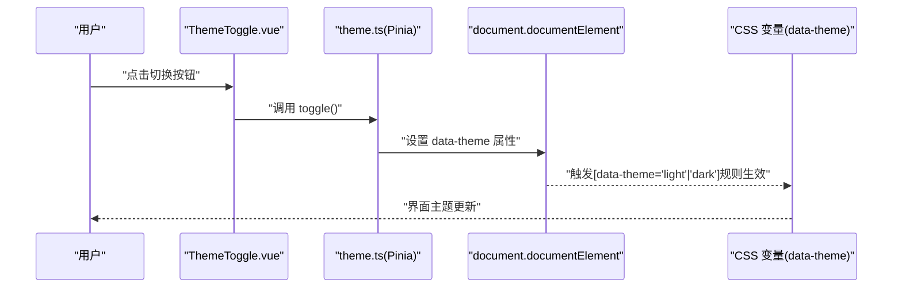
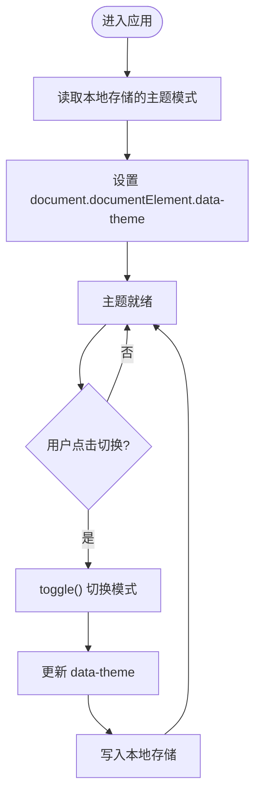
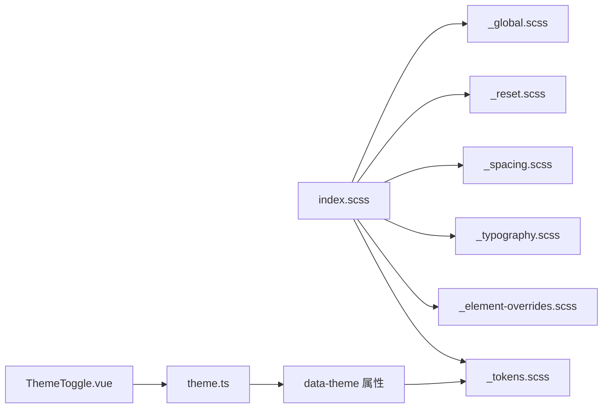

# 样式系统与主题

<cite>
**本文引用的文件**
- [ele-ai-tender-frontend/src/styles/index.scss](file://ele-ai-tender-frontend/src/styles/index.scss)
- [ele-ai-tender-frontend/src/styles/variables/_tokens.scss](file://ele-ai-tender-frontend/src/styles/variables/_tokens.scss)
- [ele-ai-tender-frontend/src/styles/variables/_element-overrides.scss](file://ele-ai-tender-frontend/src/styles/variables/_element-overrides.scss)
- [ele-ai-tender-frontend/src/styles/variables/_spacing.scss](file://ele-ai-tender-frontend/src/styles/variables/_spacing.scss)
- [ele-ai-tender-frontend/src/styles/variables/_typography.scss](file://ele-ai-tender-frontend/src/styles/variables/_typography.scss)
- [ele-ai-tender-frontend/src/styles/base/_reset.scss](file://ele-ai-tender-frontend/src/styles/base/_reset.scss)
- [ele-ai-tender-frontend/src/styles/base/_global.scss](file://ele-ai-tender-frontend/src/styles/base/_global.scss)
- [ele-ai-tender-frontend/src/store/theme.ts](file://ele-ai-tender-frontend/src/store/theme.ts)
- [ele-ai-tender-frontend/src/components/common/ThemeToggle.vue](file://ele-ai-tender-frontend/src/components/common/ThemeToggle.vue)
</cite>

## 目录
1. [简介](#简介)
2. [项目结构](#项目结构)
3. [核心组件](#核心组件)
4. [架构总览](#架构总览)
5. [详细组件分析](#详细组件分析)
6. [依赖关系分析](#依赖关系分析)
7. [性能考量](#性能考量)
8. [故障排查指南](#故障排查指南)
9. [结论](#结论)
10. [附录](#附录)

## 简介
本文件面向前端样式系统与主题管理，系统性梳理基于 SCSS 的样式架构、设计令牌（Tokens）与 CSS 变量体系、Element Plus 主题定制策略、全局样式重置与工具类组织、响应式与移动端适配思路、暗色主题切换机制，以及样式性能优化、调试工具、无障碍访问与兼容性处理建议。文档以仓库中实际源码为依据，提供可追溯的文件路径与行号引用，帮助读者快速理解并落地实施。

## 项目结构
前端样式采用“入口聚合 + 分层模块化”的组织方式：
- 入口文件负责按序导入各模块，确保变量定义优先于覆盖与基础样式加载。
- variables 层集中定义设计令牌与第三方库变量覆盖。
- base 层提供基础重置与通用工具类。
- 主题状态由 Pinia store 管理，通过 data-theme 属性驱动 CSS 变量切换。

图表来源
- [ele-ai-tender-frontend/src/styles/index.scss:1-22](file://ele-ai-tender-frontend/src/styles/index.scss#L1-L22)
- [ele-ai-tender-frontend/src/styles/variables/_tokens.scss:1-117](file://ele-ai-tender-frontend/src/styles/variables/_tokens.scss#L1-L117)
- [ele-ai-tender-frontend/src/styles/variables/_element-overrides.scss:1-77](file://ele-ai-tender-frontend/src/styles/variables/_element-overrides.scss#L1-L77)
- [ele-ai-tender-frontend/src/styles/variables/_typography.scss:1-36](file://ele-ai-tender-frontend/src/styles/variables/_typography.scss#L1-L36)
- [ele-ai-tender-frontend/src/styles/variables/_spacing.scss:1-17](file://ele-ai-tender-frontend/src/styles/variables/_spacing.scss#L1-L17)
- [ele-ai-tender-frontend/src/styles/base/_reset.scss:1-47](file://ele-ai-tender-frontend/src/styles/base/_reset.scss#L1-L47)
- [ele-ai-tender-frontend/src/styles/base/_global.scss:1-63](file://ele-ai-tender-frontend/src/styles/base/_global.scss#L1-L63)
- [ele-ai-tender-frontend/src/store/theme.ts:1-28](file://ele-ai-tender-frontend/src/store/theme.ts#L1-L28)

章节来源
- [ele-ai-tender-frontend/src/styles/index.scss:1-22](file://ele-ai-tender-frontend/src/styles/index.scss#L1-L22)

## 核心组件
- 设计令牌与 CSS 变量系统
  - 在 :root 下定义应用级品牌色、背景、文字、边框、阴影、圆角、过渡等变量，并通过 [data-theme="light"] 选择器覆盖浅色模式值，实现运行时主题切换。
  - 参考路径：[ele-ai-tender-frontend/src/styles/variables/_tokens.scss:1-117](file://ele-ai-tender-frontend/src/styles/variables/_tokens.scss#L1-L117)

- Element Plus 主题定制
  - 通过覆盖 --el-* 系列 CSS 变量，将 UI 库主色、文本、边框、填充、背景、阴影、圆角、字体、遮罩、过渡等映射到应用令牌，保证组件风格一致。
  - 参考路径：[ele-ai-tender-frontend/src/styles/variables/_element-overrides.scss:1-77](file://ele-ai-tender-frontend/src/styles/variables/_element-overrides.scss#L1-L77)

- 全局样式重置
  - 统一 html/body 基础样式、滚动条、选择高亮、根容器高度等，确保跨浏览器一致性。
  - 参考路径：[ele-ai-tender-frontend/src/styles/base/_reset.scss:1-47](file://ele-ai-tender-frontend/src/styles/base/_reset.scss#L1-L47)

- 全局工具类
  - 提供渐变按钮、卡片悬停、毛玻璃、状态徽章等常用样式能力，便于复用与统一视觉语言。
  - 参考路径：[ele-ai-tender-frontend/src/styles/base/_global.scss:1-63](file://ele-ai-tender-frontend/src/styles/base/_global.scss#L1-L63)

- 字体与排版工具
  - 封装标题、正文、说明文案等排版类，统一字号、字重、行高与颜色。
  - 参考路径：[ele-ai-tender-frontend/src/styles/variables/_typography.scss:1-36](file://ele-ai-tender-frontend/src/styles/variables/_typography.scss#L1-L36)

- 间距与通用工具
  - 提供圆角、阴影、过渡等原子化类名，提升组合效率。
  - 参考路径：[ele-ai-tender-frontend/src/styles/variables/_spacing.scss:1-17](file://ele-ai-tender-frontend/src/styles/variables/_spacing.scss#L1-L17)

- 主题状态管理与切换
  - 使用 Pinia 维护主题模式，监听变化后设置 document.documentElement 的 data-theme 属性，并持久化至 localStorage；提供切换按钮组件。
  - 参考路径：
    - [ele-ai-tender-frontend/src/store/theme.ts:1-28](file://ele-ai-tender-frontend/src/store/theme.ts#L1-L28)
    - [ele-ai-tender-frontend/src/components/common/ThemeToggle.vue:1-16](file://ele-ai-tender-frontend/src/components/common/ThemeToggle.vue#L1-L16)

章节来源
- [ele-ai-tender-frontend/src/styles/variables/_tokens.scss:1-117](file://ele-ai-tender-frontend/src/styles/variables/_tokens.scss#L1-L117)
- [ele-ai-tender-frontend/src/styles/variables/_element-overrides.scss:1-77](file://ele-ai-tender-frontend/src/styles/variables/_element-overrides.scss#L1-L77)
- [ele-ai-tender-frontend/src/styles/base/_reset.scss:1-47](file://ele-ai-tender-frontend/src/styles/base/_reset.scss#L1-L47)
- [ele-ai-tender-frontend/src/styles/base/_global.scss:1-63](file://ele-ai-tender-frontend/src/styles/base/_global.scss#L1-L63)
- [ele-ai-tender-frontend/src/styles/variables/_typography.scss:1-36](file://ele-ai-tender-frontend/src/styles/variables/_typography.scss#L1-L36)
- [ele-ai-tender-frontend/src/styles/variables/_spacing.scss:1-17](file://ele-ai-tender-frontend/src/styles/variables/_spacing.scss#L1-L17)
- [ele-ai-tender-frontend/src/store/theme.ts:1-28](file://ele-ai-tender-frontend/src/store/theme.ts#L1-L28)
- [ele-ai-tender-frontend/src/components/common/ThemeToggle.vue:1-16](file://ele-ai-tender-frontend/src/components/common/ThemeToggle.vue#L1-L16)

## 架构总览
样式系统遵循“变量先行、覆盖在后、工具复用”的原则，结合运行时主题切换，形成稳定可扩展的前端样式架构。

图表来源
- [ele-ai-tender-frontend/src/components/common/ThemeToggle.vue:1-16](file://ele-ai-tender-frontend/src/components/common/ThemeToggle.vue#L1-L16)
- [ele-ai-tender-frontend/src/store/theme.ts:1-28](file://ele-ai-tender-frontend/src/store/theme.ts#L1-L28)
- [ele-ai-tender-frontend/src/styles/variables/_tokens.scss:1-117](file://ele-ai-tender-frontend/src/styles/variables/_tokens.scss#L1-L117)

## 详细组件分析

### 设计令牌与 CSS 变量系统
- 职责
  - 集中定义应用级视觉常量，作为所有样式的单一事实来源。
  - 通过 :root 与 [data-theme] 双上下文支持深色默认与浅色覆盖。
- 关键要点
  - 品牌色族谱（主色、明度阶梯、暗度变体）用于构建一致的强调与交互反馈。
  - 背景、文字、边框、阴影、圆角、过渡等维度统一抽象，避免硬编码。
  - 组件专用变量（如卡片、输入框、侧边栏、头部）提高可读性与可维护性。
- 复杂度与扩展性
  - 新增主题只需在 [data-theme="light"] 块内补充覆盖项，无需改动业务样式。
  - 新增 Token 时，建议在对应语义域（色彩/尺寸/动效）集中维护，保持命名一致。

章节来源
- [ele-ai-tender-frontend/src/styles/variables/_tokens.scss:1-117](file://ele-ai-tender-frontend/src/styles/variables/_tokens.scss#L1-L117)

### Element Plus 主题定制
- 职责
  - 将 UI 库内部变量映射到应用令牌，确保组件与整体设计语言一致。
- 关键要点
  - 主色、状态色、文本、边框、填充、背景、阴影、圆角、字体、遮罩、过渡等全面覆盖。
  - 浅色模式下对填充与空白进行额外调整，保证对比度与层次。
- 注意事项
  - 覆盖文件需在 Element Plus 样式之后引入，以确保优先级正确。
  - 若需更细粒度覆盖，可在组件作用域内追加局部变量或类名。

章节来源
- [ele-ai-tender-frontend/src/styles/variables/_element-overrides.scss:1-77](file://ele-ai-tender-frontend/src/styles/variables/_element-overrides.scss#L1-L77)

### 全局样式重置与工具类
- 基础重置
  - 统一 html/body 基础样式、滚动条、选择高亮、根容器高度等，减少浏览器差异。
- 全局工具类
  - 提供渐变按钮、卡片悬停、毛玻璃、状态徽章等高频样式能力，降低重复代码。
- 字体与排版
  - 标题、正文、说明文案等排版类统一字号、字重、行高与颜色。
- 间距与通用工具
  - 圆角、阴影、过渡等原子化类名，提升组合效率。

章节来源
- [ele-ai-tender-frontend/src/styles/base/_reset.scss:1-47](file://ele-ai-tender-frontend/src/styles/base/_reset.scss#L1-L47)
- [ele-ai-tender-frontend/src/styles/base/_global.scss:1-63](file://ele-ai-tender-frontend/src/styles/base/_global.scss#L1-L63)
- [ele-ai-tender-frontend/src/styles/variables/_typography.scss:1-36](file://ele-ai-tender-frontend/src/styles/variables/_typography.scss#L1-L36)
- [ele-ai-tender-frontend/src/styles/variables/_spacing.scss:1-17](file://ele-ai-tender-frontend/src/styles/variables/_spacing.scss#L1-L17)

### 主题状态管理与切换机制
- 职责
  - 管理当前主题模式，驱动 DOM 属性变更并持久化用户偏好。
- 流程
  - 初始化时从本地存储读取主题模式，立即写入 data-theme。
  - 切换时更新状态、同步 DOM 属性与本地存储。
- 组件集成
  - 切换按钮组件直接调用 store 的 toggle 方法，图标与提示随模式动态变化。

图表来源
- [ele-ai-tender-frontend/src/store/theme.ts:1-28](file://ele-ai-tender-frontend/src/store/theme.ts#L1-L28)
- [ele-ai-tender-frontend/src/components/common/ThemeToggle.vue:1-16](file://ele-ai-tender-frontend/src/components/common/ThemeToggle.vue#L1-L16)

章节来源
- [ele-ai-tender-frontend/src/store/theme.ts:1-28](file://ele-ai-tender-frontend/src/store/theme.ts#L1-L28)
- [ele-ai-tender-frontend/src/components/common/ThemeToggle.vue:1-16](file://ele-ai-tender-frontend/src/components/common/ThemeToggle.vue#L1-L16)

### 样式文件组织结构与导入顺序
- 入口文件按序导入，确保：
  - 设计令牌最先加载，供后续覆盖与样式消费。
  - Element Plus 变量覆盖紧随其后，保证优先级。
  - 字体、间距等工具类按需引入。
  - 基础重置与全局工具类最后加载，避免被意外覆盖。
- 优点
  - 清晰的分层与明确的依赖顺序，降低样式冲突风险。
  - 易于扩展新模块与主题变体。

章节来源
- [ele-ai-tender-frontend/src/styles/index.scss:1-22](file://ele-ai-tender-frontend/src/styles/index.scss#L1-L22)

## 依赖关系分析
- 模块耦合
  - index.scss 为聚合入口，依赖 variables 与 base 子模块。
  - _element-overrides.scss 依赖 _tokens.scss 提供的令牌变量。
  - theme.ts 与 ThemeToggle.vue 共同驱动 data-theme 属性，影响 _tokens.scss 中的 [data-theme="light"] 覆盖规则。
- 外部依赖
  - Element Plus 的 CSS 变量体系通过覆盖接入应用令牌。
- 潜在循环
  - 当前样式模块间无循环依赖；主题状态与样式通过 DOM 属性解耦。

图表来源
- [ele-ai-tender-frontend/src/styles/index.scss:1-22](file://ele-ai-tender-frontend/src/styles/index.scss#L1-L22)
- [ele-ai-tender-frontend/src/styles/variables/_tokens.scss:1-117](file://ele-ai-tender-frontend/src/styles/variables/_tokens.scss#L1-L117)
- [ele-ai-tender-frontend/src/styles/variables/_element-overrides.scss:1-77](file://ele-ai-tender-frontend/src/styles/variables/_element-overrides.scss#L1-L77)
- [ele-ai-tender-frontend/src/store/theme.ts:1-28](file://ele-ai-tender-frontend/src/store/theme.ts#L1-L28)
- [ele-ai-tender-frontend/src/components/common/ThemeToggle.vue:1-16](file://ele-ai-tender-frontend/src/components/common/ThemeToggle.vue#L1-L16)

## 性能考量
- 变量与覆盖
  - 使用 CSS 自定义属性可减少重复计算，但大量 var() 引用可能带来解析开销；建议将热点变量集中在必要层级，避免过深嵌套。
- 动画与过渡
  - 合理使用 transition 与 transform，避免同时触发布局与绘制；控制过渡时长与缓动函数，兼顾流畅与性能。
- 滚动条与毛玻璃
  - 自定义滚动条与 backdrop-filter 在低端设备上可能影响性能，可按需降级或仅在桌面端启用。
- 打包与加载
  - 入口文件仅聚合导入，避免重复引入；按需引入 Element Plus 样式与组件，减小首屏体积。
- 主题切换
  - 通过 data-theme 切换属于运行时最小成本方案，避免重建样式表；注意首次渲染时的闪烁问题，可在入口脚本中尽早设置初始主题。

## 故障排查指南
- 主题未生效
  - 检查是否已设置 document.documentElement 的 data-theme 属性。
  - 确认 [data-theme="light"] 覆盖块是否正确加载且未被更高优先级规则覆盖。
- 组件颜色不一致
  - 确认 Element Plus 变量覆盖文件是否在库样式之后引入。
  - 检查组件是否存在内联样式或 !important 覆盖。
- 切换后出现闪烁
  - 在应用启动阶段尽早读取本地存储并设置 data-theme，避免二次渲染。
- 滚动条样式异常
  - 不同浏览器前缀与伪元素选择器存在差异，必要时做兼容处理或回退默认滚动条。

章节来源
- [ele-ai-tender-frontend/src/store/theme.ts:1-28](file://ele-ai-tender-frontend/src/store/theme.ts#L1-L28)
- [ele-ai-tender-frontend/src/styles/variables/_element-overrides.scss:1-77](file://ele-ai-tender-frontend/src/styles/variables/_element-overrides.scss#L1-L77)
- [ele-ai-tender-frontend/src/styles/base/_reset.scss:1-47](file://ele-ai-tender-frontend/src/styles/base/_reset.scss#L1-L47)

## 结论
本项目采用“设计令牌 + CSS 变量 + 运行时主题切换”的样式架构，结合 Element Plus 变量覆盖与分层模块化，实现了高内聚、低耦合、易扩展的样式系统。通过统一的 Token 与工具类，保证了视觉一致性与开发效率；通过 data-theme 驱动的轻量主题切换，提供了良好的用户体验与可维护性。

## 附录
- 响应式设计与移动端适配
  - 建议采用基于断点的媒体查询与弹性布局（Flex/Grid），配合相对单位（rem/vw）提升适配性。
  - 在小屏设备下简化导航与内容密度，优先保障核心任务的可读性与可操作性。
- 无障碍访问（a11y）
  - 为交互控件提供语义化标签与 aria-* 属性；确保键盘可达与焦点可见。
  - 主题切换需提供清晰的焦点指示与屏幕阅读器提示。
- 浏览器兼容性
  - 针对旧版浏览器提供降级策略（如禁用 backdrop-filter、回退默认滚动条）。
  - 使用前缀与特性检测，确保关键功能可用。
- 样式测试策略
  - 视觉回归测试：截图比对关键页面在不同主题下的表现。
  - 自动化校验：lint 检查命名规范与变量使用；单元测试覆盖主题切换逻辑。
- CSS-in-JS 方案对比
  - 优势：动态主题、作用域隔离、条件样式便捷。
  - 劣势：运行时开销、与现有 SCSS 生态整合成本。
  - 建议：在需要强动态性的场景局部引入，其余维持 SCSS + CSS 变量的混合方案。