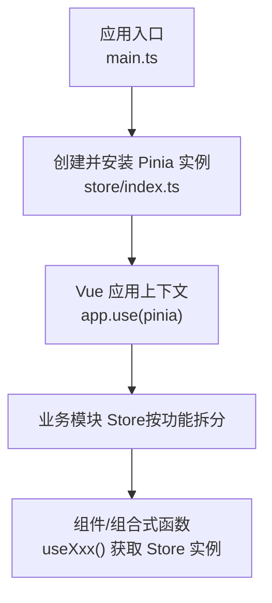
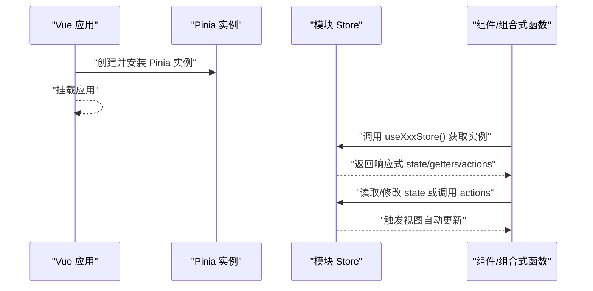
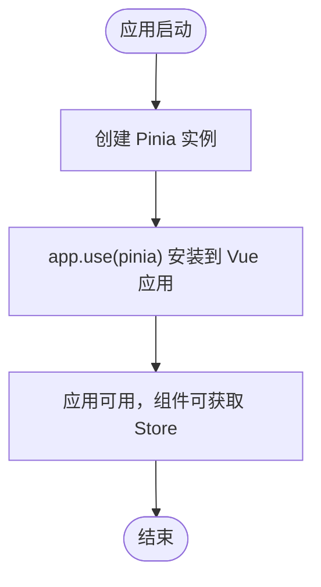
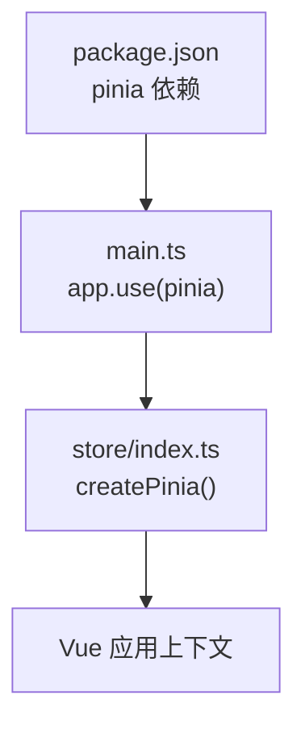

# Pinia架构设计

<cite>
**本文引用的文件**   
- [main.ts](file://ele-ai-tender-frontend/src/main.ts)
- [index.ts](file://ele-ai-tender-frontend/src/store/index.ts)
- [package.json](file://ele-ai-tender-frontend/package.json)
</cite>

## 目录
1. [简介](#简介)
2. [项目结构](#项目结构)
3. [核心组件](#核心组件)
4. [架构总览](#架构总览)
5. [详细组件分析](#详细组件分析)
6. [依赖分析](#依赖分析)
7. [性能考虑](#性能考虑)
8. [故障排查指南](#故障排查指南)
9. [结论](#结论)
10. [附录](#附录)

## 简介
本文件围绕仓库中前端应用对 Pinia 的使用，系统化梳理其状态管理架构与最佳实践。重点覆盖：
- Store 的创建、注册与初始化流程
- 模块化组织方式与依赖注入机制
- 响应式数据绑定原理与 Vue 3 组合式 API 集成模式
- 类型安全配置、插件系统扩展
- Store 生命周期、中间件开发思路、性能优化策略
- 调试工具使用、测试最佳实践与常见问题解决方案

## 项目结构
在前端应用中，Pinia 通过单例实例在应用启动时安装到 Vue 应用上下文，随后各模块按需定义并导出 Store，供组件或组合式函数使用。

图示来源
- [main.ts:1-15](file://ele-ai-tender-frontend/src/main.ts#L1-L15)
- [index.ts:1-6](file://ele-ai-tender-frontend/src/store/index.ts#L1-L6)

章节来源
- [main.ts:1-15](file://ele-ai-tender-frontend/src/main.ts#L1-L15)
- [index.ts:1-6](file://ele-ai-tender-frontend/src/store/index.ts#L1-L6)

## 核心组件
- Pinia 实例：在 store/index.ts 中通过 createPinia 创建单例，并在 main.ts 中通过 app.use(pinia) 安装到 Vue 应用。
- 模块 Store：建议以“功能域”为单位拆分为独立文件（例如用户、主题、项目等），每个文件暴露一个 Store 工厂函数，便于按需引入与类型推断。
- 组合式 API 集成：在组件或 composable 中使用 useXxxStore() 获取 Store 实例，直接访问 state/getters/actions，享受响应式更新与 TS 类型推导。

章节来源
- [index.ts:1-6](file://ele-ai-tender-frontend/src/store/index.ts#L1-L6)
- [main.ts:1-15](file://ele-ai-tender-frontend/src/main.ts#L1-L15)

## 架构总览
下图展示了从应用启动到 Store 可用的关键路径，以及后续组件如何消费状态。

图示来源
- [main.ts:1-15](file://ele-ai-tender-frontend/src/main.ts#L1-L15)
- [index.ts:1-6](file://ele-ai-tender-frontend/src/store/index.ts#L1-L6)

## 详细组件分析

### Store 创建与注册流程
- 创建：在 store/index.ts 中通过 createPinia 生成全局单例。
- 注册：在 main.ts 中通过 app.use(pinia) 将 Pinia 安装到 Vue 应用，使所有组件均可通过组合式 API 访问 Store。
- 初始化时机：应用启动阶段完成，早于路由与页面渲染，确保首次渲染即可使用状态。

图示来源
- [index.ts:1-6](file://ele-ai-tender-frontend/src/store/index.ts#L1-L6)
- [main.ts:1-15](file://ele-ai-tender-frontend/src/main.ts#L1-L15)

章节来源
- [index.ts:1-6](file://ele-ai-tender-frontend/src/store/index.ts#L1-L6)
- [main.ts:1-15](file://ele-ai-tender-frontend/src/main.ts#L1-L15)

### 模块化 Store 的组织方式
- 按领域拆分：将不同业务域（如用户、主题、项目、需求等）分别放在独立的 Store 文件中，避免单一巨型 Store。
- 统一入口：可在 index.ts 中集中导出各模块 Store 的 useXxxStore 函数，方便外部引用与类型推断。
- 命名约定：文件名与导出函数名保持一致，提升可读性与 IDE 支持体验。

章节来源
- [index.ts:1-6](file://ele-ai-tender-frontend/src/store/index.ts#L1-L6)

### 依赖注入机制
- 全局注入：通过 app.use(pinia)，Pinia 被注入到 Vue 应用上下文，所有子树均可访问。
- 运行时获取：在组件或组合式函数中通过 useXxxStore() 获取对应 Store 实例，无需手动传递依赖。
- 作用域隔离：每个 Store 实例拥有独立的状态与作用域，避免跨模块状态污染。

章节来源
- [main.ts:1-15](file://ele-ai-tender-frontend/src/main.ts#L1-L15)
- [index.ts:1-6](file://ele-ai-tender-frontend/src/store/index.ts#L1-L6)

### 响应式数据绑定原理
- 基于 Vue 3 响应式：Pinia 的 state/getters/actions 均具备响应式能力，组件订阅后会在状态变更时自动更新。
- 细粒度更新：仅影响实际使用的响应式字段，减少不必要的重渲染。
- 组合式 API 友好：在 setup 中直接解构或使用 toRefs，保持代码简洁与类型安全。

章节来源
- [index.ts:1-6](file://ele-ai-tender-frontend/src/store/index.ts#L1-L6)
- [main.ts:1-15](file://ele-ai-tender-frontend/src/main.ts#L1-L15)

### 与 Vue 3 组合式 API 的集成模式
- 在组件或 composable 中通过 useXxxStore() 获取实例，直接读写 state 与调用 actions。
- 推荐在组合式函数中封装复杂逻辑，对外暴露更简单的接口，提高复用性。
- 结合 TypeScript 提供完整类型推导，降低运行时错误风险。

章节来源
- [index.ts:1-6](file://ele-ai-tender-frontend/src/store/index.ts#L1-L6)
- [main.ts:1-15](file://ele-ai-tender-frontend/src/main.ts#L1-L15)

### 类型安全配置
- 使用 TypeScript 编写 Store，为 state/getters/actions 标注类型，获得编译期检查与智能提示。
- 在 useXxxStore 的返回类型上显式声明，确保跨模块调用的类型一致性。
- 借助 tsconfig 与 vue-tsc 保证构建时的类型校验。

章节来源
- [package.json:1-49](file://ele-ai-tender-frontend/package.json#L1-L49)

### 插件系统与扩展点
- 插件位置：在 store/index.ts 中创建 Pinia 实例后、安装前，可通过 pinia.use(plugin) 注册自定义插件。
- 常见用途：日志记录、埋点统计、持久化、权限控制、错误上报等。
- 执行时机：插件钩子在 action/state 变更前后触发，适合做横切关注点处理。

章节来源
- [index.ts:1-6](file://ele-ai-tender-frontend/src/store/index.ts#L1-L6)

### Store 生命周期管理
- 创建：首次 useXxxStore() 时创建实例，后续调用返回同一实例（单例）。
- 销毁：当前页面卸载且无其他引用时，Store 实例会被释放；如需跨页面共享，应将其提升到更高层级或通过路由参数关联。
- 重置：在需要时提供 resetState 或 clearState 等方法，用于恢复初始状态。

章节来源
- [index.ts:1-6](file://ele-ai-tender-frontend/src/store/index.ts#L1-L6)
- [main.ts:1-15](file://ele-ai-tender-frontend/src/main.ts#L1-L15)

### 中间件开发思路
- 拦截器：在插件中实现类似中间件的逻辑，统一处理异常、日志、性能监控等。
- 条件执行：根据 action 名称或业务场景决定是否执行特定逻辑。
- 副作用隔离：避免在中间件中直接操作 UI，尽量保持纯逻辑与可测试性。

章节来源
- [index.ts:1-6](file://ele-ai-tender-frontend/src/store/index.ts#L1-L6)

### 性能优化策略
- 按需引入：仅在需要的地方导入 useXxxStore，避免不必要的模块加载。
- 局部订阅：在模板或 computed 中只访问必要字段，减少响应式依赖范围。
- 批量更新：在 actions 中合并多次状态变更，减少重复渲染。
- 懒加载：对大体积 Store 或重型计算进行延迟初始化。

章节来源
- [index.ts:1-6](file://ele-ai-tender-frontend/src/store/index.ts#L1-L6)

## 依赖分析
Pinia 作为前端状态管理库，在本项目中由 package.json 声明依赖，并通过 main.ts 安装到 Vue 应用。

图示来源
- [package.json:1-49](file://ele-ai-tender-frontend/package.json#L1-L49)
- [main.ts:1-15](file://ele-ai-tender-frontend/src/main.ts#L1-L15)
- [index.ts:1-6](file://ele-ai-tender-frontend/src/store/index.ts#L1-L6)

章节来源
- [package.json:1-49](file://ele-ai-tender-frontend/package.json#L1-L49)
- [main.ts:1-15](file://ele-ai-tender-frontend/src/main.ts#L1-L15)
- [index.ts:1-6](file://ele-ai-tender-frontend/src/store/index.ts#L1-L6)

## 性能考虑
- 合理拆分 Store：将大状态拆分为多个小 Store，降低单次渲染的影响面。
- 避免深层嵌套：扁平化 state 结构，提升序列化与对比效率。
- 谨慎使用深度监听：优先选择精确字段订阅，减少不必要的 watcher。
- 异步操作优化：在 actions 中进行网络请求与数据处理，完成后一次性更新 state。

## 故障排查指南
- 未安装 Pinia：确认 main.ts 中已调用 app.use(pinia)。
- 找不到 useXxxStore：检查对应模块是否导出 useXxxStore 函数，并确保正确导入。
- 类型报错：检查 tsconfig 与 vue-tsc 配置，确保类型文件齐全。
- 状态未更新：确认在组件中使用了响应式访问方式（如 ref/toRefs 或直接访问），而非普通对象拷贝。
- 插件不生效：确认插件在 createPinia 之后、app.use 之前注册。

章节来源
- [main.ts:1-15](file://ele-ai-tender-frontend/src/main.ts#L1-L15)
- [index.ts:1-6](file://ele-ai-tender-frontend/src/store/index.ts#L1-L6)
- [package.json:1-49](file://ele-ai-tender-frontend/package.json#L1-L49)

## 结论
本项目采用 Pinia 作为前端状态管理方案，通过在应用入口处创建并安装 Pinia 实例，实现了全局状态管理与响应式更新。结合模块化 Store 与组合式 API，可获得良好的类型安全与可维护性。建议在现有基础上进一步完善插件与中间件体系，持续优化性能与可观测性。

## 附录
- 调试工具：可使用浏览器扩展或控制台 API 查看 Pinia 状态与变更记录。
- 测试建议：对 actions 进行单元测试，模拟异步与边界条件；对 getters 进行快照测试，确保输出稳定。
- 最佳实践：遵循单一职责原则拆分 Store，明确输入输出，保持纯逻辑与副作用分离。