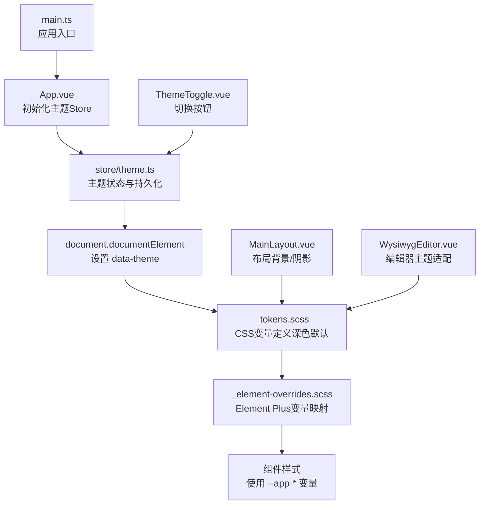
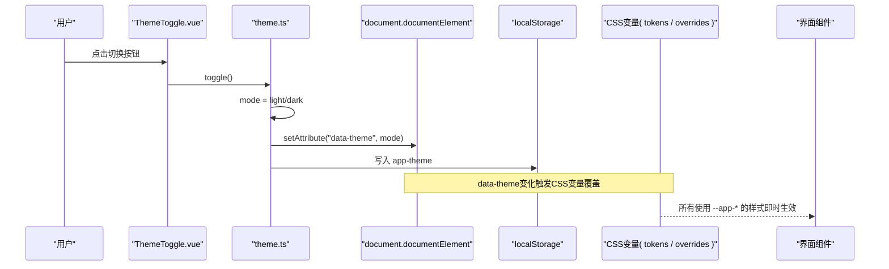
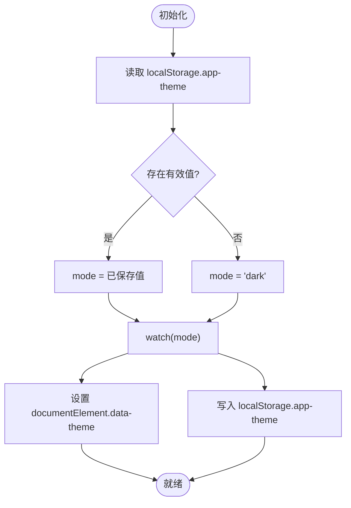
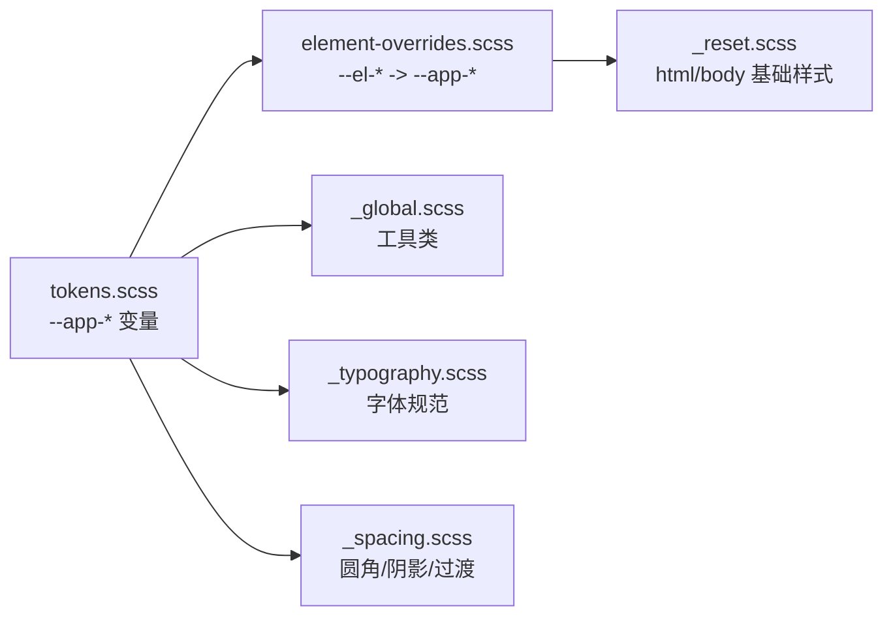
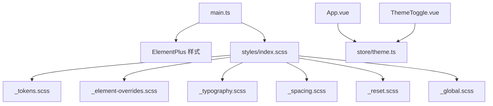

# 主题配置Store

<cite>
**本文引用的文件**
- [ele-ai-tender-frontend/src/store/theme.ts](file://ele-ai-tender-frontend/src/store/theme.ts)
- [ele-ai-tender-frontend/src/components/common/ThemeToggle.vue](file://ele-ai-tender-frontend/src/components/common/ThemeToggle.vue)
- [ele-ai-tender-frontend/src/styles/variables/_tokens.scss](file://ele-ai-tender-frontend/src/styles/variables/_tokens.scss)
- [ele-ai-tender-frontend/src/styles/variables/_element-overrides.scss](file://ele-ai-tender-frontend/src/styles/variables/_element-overrides.scss)
- [ele-ai-tender-frontend/src/styles/index.scss](file://ele-ai-tender-frontend/src/styles/index.scss)
- [ele-ai-tender-frontend/src/main.ts](file://ele-ai-tender-frontend/src/main.ts)
- [ele-ai-tender-frontend/src/App.vue](file://ele-ai-tender-frontend/src/App.vue)
- [ele-ai-tender-frontend/src/layouts/MainLayout.vue](file://ele-ai-tender-frontend/src/layouts/MainLayout.vue)
- [ele-ai-tender-frontend/src/styles/base/_reset.scss](file://ele-ai-tender-frontend/src/styles/base/_reset.scss)
- [ele-ai-tender-frontend/src/styles/base/_global.scss](file://ele-ai-tender-frontend/src/styles/base/_global.scss)
- [ele-ai-tender-frontend/src/styles/variables/_typography.scss](file://ele-ai-tender-frontend/src/styles/variables/_typography.scss)
- [ele-ai-tender-frontend/src/styles/variables/_spacing.scss](file://ele-ai-tender-frontend/src/styles/variables/_spacing.scss)
- [ele-ai-tender-frontend/src/components/editor/WysiwygEditor.vue](file://ele-ai-tender-frontend/src/components/editor/WysiwygEditor.vue)
</cite>

## 目录
1. [简介](#简介)
2. [项目结构](#项目结构)
3. [核心组件](#核心组件)
4. [架构总览](#架构总览)
5. [详细组件分析](#详细组件分析)
6. [依赖关系分析](#依赖关系分析)
7. [性能与动画](#性能与动画)
8. [兼容性处理](#兼容性处理)
9. [开发规范与扩展机制](#开发规范与扩展机制)
10. [测试方法](#测试方法)
11. [故障排查](#故障排查)
12. [结论](#结论)

## 简介
本文件围绕“主题配置Store”的设计与实现，系统性阐述明暗主题切换、自定义主题配置、CSS变量管理、Element Plus主题定制、颜色系统、字体配置、动态样式应用、状态持久化、动画与性能优化、兼容性与扩展机制等。目标是帮助开发者快速理解并高效维护前端主题体系。

## 项目结构
主题相关代码主要分布在以下位置：
- Store层：主题状态管理与持久化
- 样式层：设计Token、Element Plus覆盖、基础重置与全局工具类
- 组件层：主题切换按钮、布局与编辑器对主题的适配
- 入口层：样式导入顺序与应用初始化

图表来源
- [ele-ai-tender-frontend/src/main.ts:1-15](file://ele-ai-tender-frontend/src/main.ts#L1-L15)
- [ele-ai-tender-frontend/src/App.vue:1-11](file://ele-ai-tender-frontend/src/App.vue#L1-L11)
- [ele-ai-tender-frontend/src/store/theme.ts:1-28](file://ele-ai-tender-frontend/src/store/theme.ts#L1-L28)
- [ele-ai-tender-frontend/src/styles/variables/_tokens.scss:1-117](file://ele-ai-tender-frontend/src/styles/variables/_tokens.scss#L1-L117)
- [ele-ai-tender-frontend/src/styles/variables/_element-overrides.scss:1-77](file://ele-ai-tender-frontend/src/styles/variables/_element-overrides.scss#L1-L77)
- [ele-ai-tender-frontend/src/components/common/ThemeToggle.vue:1-16](file://ele-ai-tender-frontend/src/components/common/ThemeToggle.vue#L1-L16)
- [ele-ai-tender-frontend/src/layouts/MainLayout.vue:1-44](file://ele-ai-tender-frontend/src/layouts/MainLayout.vue#L1-L44)
- [ele-ai-tender-frontend/src/components/editor/WysiwygEditor.vue:240-250](file://ele-ai-tender-frontend/src/components/editor/WysiwygEditor.vue#L240-L250)

章节来源
- [ele-ai-tender-frontend/src/main.ts:1-15](file://ele-ai-tender-frontend/src/main.ts#L1-L15)
- [ele-ai-tender-frontend/src/styles/index.scss:1-22](file://ele-ai-tender-frontend/src/styles/index.scss#L1-L22)

## 核心组件
- 主题Store（Pinia）
  - 职责：维护当前主题模式（dark/light）、提供切换与设置方法、监听变化并同步到DOM属性与本地存储。
  - 关键行为：
    - 初始化时从本地存储读取上次选择，若无则使用深色为默认。
    - 通过watch在值变化时更新根节点data-theme属性，并写入localStorage。
    - 暴露mode、setMode、toggle三个接口供组件消费。
- 主题切换按钮
  - 职责：根据当前模式显示对应图标并提供点击切换能力。
  - 交互：点击调用store的toggle方法，触发状态变更与持久化。
- 样式系统
  - 设计Token：集中定义品牌色、背景、文字、边框、阴影、圆角、过渡、模糊、渐变等CSS变量；深色为默认，浅色通过[data-theme="light"]覆盖。
  - Element Plus覆盖：将--el-*变量映射到--app-*变量，确保UI库跟随主题。
  - 基础重置与全局工具：统一html/body初始样式、滚动条、选择高亮、常用工具类（圆角、阴影、过渡、毛玻璃等）。
- 布局与编辑器适配
  - 布局：头部、侧边栏、主内容区均使用--app-*变量，保证整体一致。
  - 富文本编辑器：通过CSS变量控制输入框背景、边框、文本颜色等，不直接操作编辑器实例，保持主题切换无侵入。

章节来源
- [ele-ai-tender-frontend/src/store/theme.ts:1-28](file://ele-ai-tender-frontend/src/store/theme.ts#L1-L28)
- [ele-ai-tender-frontend/src/components/common/ThemeToggle.vue:1-16](file://ele-ai-tender-frontend/src/components/common/ThemeToggle.vue#L1-L16)
- [ele-ai-tender-frontend/src/styles/variables/_tokens.scss:1-117](file://ele-ai-tender-frontend/src/styles/variables/_tokens.scss#L1-L117)
- [ele-ai-tender-frontend/src/styles/variables/_element-overrides.scss:1-77](file://ele-ai-tender-frontend/src/styles/variables/_element-overrides.scss#L1-L77)
- [ele-ai-tender-frontend/src/styles/base/_reset.scss:1-47](file://ele-ai-tender-frontend/src/styles/base/_reset.scss#L1-L47)
- [ele-ai-tender-frontend/src/styles/base/_global.scss:1-63](file://ele-ai-tender-frontend/src/styles/base/_global.scss#L1-L63)
- [ele-ai-tender-frontend/src/layouts/MainLayout.vue:1-44](file://ele-ai-tender-frontend/src/layouts/MainLayout.vue#L1-L44)
- [ele-ai-tender-frontend/src/components/editor/WysiwygEditor.vue:240-250](file://ele-ai-tender-frontend/src/components/editor/WysiwygEditor.vue#L240-L250)

## 架构总览
主题系统采用“状态驱动 + CSS变量覆盖”的轻量方案：
- 状态层：Pinia store负责主题模式与持久化。
- DOM层：根节点data-theme作为主题开关。
- 样式层：CSS变量集中管理，Element Plus变量映射到应用变量，实现一键换肤。
- 组件层：各组件仅消费CSS变量或调用store接口，避免硬编码颜色。

图表来源
- [ele-ai-tender-frontend/src/components/common/ThemeToggle.vue:1-16](file://ele-ai-tender-frontend/src/components/common/ThemeToggle.vue#L1-L16)
- [ele-ai-tender-frontend/src/store/theme.ts:1-28](file://ele-ai-tender-frontend/src/store/theme.ts#L1-L28)
- [ele-ai-tender-frontend/src/styles/variables/_tokens.scss:1-117](file://ele-ai-tender-frontend/src/styles/variables/_tokens.scss#L1-L117)
- [ele-ai-tender-frontend/src/styles/variables/_element-overrides.scss:1-77](file://ele-ai-tender-frontend/src/styles/variables/_element-overrides.scss#L1-L77)

## 详细组件分析

### 主题Store（theme.ts）
- 数据结构
  - mode：当前主题模式（'dark' | 'light'）
- 状态持久化
  - 初始化：从localStorage读取键值，不存在则回退到'dark'
  - 变更：watch(mode)立即执行，同步到document.documentElement.setAttribute('data-theme', val)并写入localStorage
- API
  - mode：响应式读取当前模式
  - setMode(newMode)：显式设置主题
  - toggle()：在dark与light之间切换
- 副作用
  - 通过watch的immediate:true确保首次渲染即完成DOM与本地存储同步

图表来源
- [ele-ai-tender-frontend/src/store/theme.ts:1-28](file://ele-ai-tender-frontend/src/store/theme.ts#L1-L28)

章节来源
- [ele-ai-tender-frontend/src/store/theme.ts:1-28](file://ele-ai-tender-frontend/src/store/theme.ts#L1-L28)

### 主题切换按钮（ThemeToggle.vue）
- 功能
  - 根据当前mode显示太阳/月亮图标
  - 点击调用store.toggle()
- 可访问性
  - title提示随模式变化，提升无障碍体验

章节来源
- [ele-ai-tender-frontend/src/components/common/ThemeToggle.vue:1-16](file://ele-ai-tender-frontend/src/components/common/ThemeToggle.vue#L1-L16)

### 样式系统与变量管理
- 设计Token（_tokens.scss）
  - 以:root定义深色默认变量，[data-theme="light"]覆盖浅色变量
  - 涵盖品牌色、辅助色、背景、文字、边框、阴影、圆角、过渡、模糊、渐变等
- Element Plus覆盖（_element-overrides.scss）
  - 将--el-*映射到--app-*，使UI库跟随主题
  - 浅色模式下额外覆盖填充色等细节
- 样式入口（index.scss）
  - 按序导入：Token → Element覆盖 → 字体规范 → 间距工具 → 基础重置 → 全局工具类
- 基础重置（_reset.scss）
  - html/body背景、文字、字体、过渡、选择高亮、滚动条样式
- 全局工具类（_global.scss）
  - 渐变按钮、卡片悬停、毛玻璃效果、状态徽章等
- 字体与间距（_typography.scss, _spacing.scss）
  - 标题、正文、说明文字字号与行高
  - 圆角、阴影、过渡工具类

图表来源
- [ele-ai-tender-frontend/src/styles/variables/_tokens.scss:1-117](file://ele-ai-tender-frontend/src/styles/variables/_tokens.scss#L1-L117)
- [ele-ai-tender-frontend/src/styles/variables/_element-overrides.scss:1-77](file://ele-ai-tender-frontend/src/styles/variables/_element-overrides.scss#L1-L77)
- [ele-ai-tender-frontend/src/styles/index.scss:1-22](file://ele-ai-tender-frontend/src/styles/index.scss#L1-L22)
- [ele-ai-tender-frontend/src/styles/base/_reset.scss:1-47](file://ele-ai-tender-frontend/src/styles/base/_reset.scss#L1-L47)
- [ele-ai-tender-frontend/src/styles/base/_global.scss:1-63](file://ele-ai-tender-frontend/src/styles/base/_global.scss#L1-L63)
- [ele-ai-tender-frontend/src/styles/variables/_typography.scss:1-36](file://ele-ai-tender-frontend/src/styles/variables/_typography.scss#L1-L36)
- [ele-ai-tender-frontend/src/styles/variables/_spacing.scss:1-17](file://ele-ai-tender-frontend/src/styles/variables/_spacing.scss#L1-L17)

章节来源
- [ele-ai-tender-frontend/src/styles/index.scss:1-22](file://ele-ai-tender-frontend/src/styles/index.scss#L1-L22)
- [ele-ai-tender-frontend/src/styles/variables/_tokens.scss:1-117](file://ele-ai-tender-frontend/src/styles/variables/_tokens.scss#L1-L117)
- [ele-ai-tender-frontend/src/styles/variables/_element-overrides.scss:1-77](file://ele-ai-tender-frontend/src/styles/variables/_element-overrides.scss#L1-L77)
- [ele-ai-tender-frontend/src/styles/base/_reset.scss:1-47](file://ele-ai-tender-frontend/src/styles/base/_reset.scss#L1-L47)
- [ele-ai-tender-frontend/src/styles/base/_global.scss:1-63](file://ele-ai-tender-frontend/src/styles/base/_global.scss#L1-L63)
- [ele-ai-tender-frontend/src/styles/variables/_typography.scss:1-36](file://ele-ai-tender-frontend/src/styles/variables/_typography.scss#L1-L36)
- [ele-ai-tender-frontend/src/styles/variables/_spacing.scss:1-17](file://ele-ai-tender-frontend/src/styles/variables/_spacing.scss#L1-L17)

### 布局与编辑器适配
- 布局（MainLayout.vue）
  - 头部、侧边栏、主内容区使用--app-header-bg、--app-sidebar-bg、--app-bg-secondary等变量，配合过渡实现平滑切换
- 富文本编辑器（WysiwygEditor.vue）
  - 通过CSS变量控制输入框背景、边框、文本颜色等
  - 注释明确主题由[data-theme="light"]控制，不直接操作编辑器实例，降低耦合

章节来源
- [ele-ai-tender-frontend/src/layouts/MainLayout.vue:1-44](file://ele-ai-tender-frontend/src/layouts/MainLayout.vue#L1-L44)
- [ele-ai-tender-frontend/src/components/editor/WysiwygEditor.vue:240-250](file://ele-ai-tender-frontend/src/components/editor/WysiwygEditor.vue#L240-L250)

## 依赖关系分析
- 入口与初始化
  - main.ts引入Element Plus与全局样式，确保样式加载顺序正确
  - App.vue初始化useThemeStore，确保watch立即生效
- 样式加载顺序
  - index.scss严格遵循：Token → Element覆盖 → 字体 → 间距 → 重置 → 全局工具
- 运行时依赖
  - theme.ts依赖localStorage与document.documentElement
  - ThemeToggle.vue依赖@element-plus/icons-vue图标

图表来源
- [ele-ai-tender-frontend/src/main.ts:1-15](file://ele-ai-tender-frontend/src/main.ts#L1-L15)
- [ele-ai-tender-frontend/src/App.vue:1-11](file://ele-ai-tender-frontend/src/App.vue#L1-L11)
- [ele-ai-tender-frontend/src/styles/index.scss:1-22](file://ele-ai-tender-frontend/src/styles/index.scss#L1-L22)
- [ele-ai-tender-frontend/src/components/common/ThemeToggle.vue:1-16](file://ele-ai-tender-frontend/src/components/common/ThemeToggle.vue#L1-L16)

章节来源
- [ele-ai-tender-frontend/src/main.ts:1-15](file://ele-ai-tender-frontend/src/main.ts#L1-L15)
- [ele-ai-tender-frontend/src/App.vue:1-11](file://ele-ai-tender-frontend/src/App.vue#L1-L11)
- [ele-ai-tender-frontend/src/styles/index.scss:1-22](file://ele-ai-tender-frontend/src/styles/index.scss#L1-L22)

## 性能与动画
- 过渡与动画
  - 使用统一的--app-transition-base，应用于html/body、头部、侧边栏、主内容区，确保切换流畅
  - 毛玻璃效果使用backdrop-filter，注意浏览器支持
- 性能优化建议
  - 避免在频繁触发的回调中读写大量DOM；当前实现仅在主题切换时修改根节点属性，开销极低
  - 合理使用CSS变量，减少重复计算与重绘
  - 大型页面可考虑按需加载第三方库样式，减少首屏体积

章节来源
- [ele-ai-tender-frontend/src/styles/base/_reset.scss:1-47](file://ele-ai-tender-frontend/src/styles/base/_reset.scss#L1-L47)
- [ele-ai-tender-frontend/src/styles/base/_global.scss:1-63](file://ele-ai-tender-frontend/src/styles/base/_global.scss#L1-L63)
- [ele-ai-tender-frontend/src/layouts/MainLayout.vue:1-44](file://ele-ai-tender-frontend/src/layouts/MainLayout.vue#L1-L44)

## 兼容性处理
- CSS变量与data-theme
  - 现代浏览器广泛支持CSS自定义属性与属性选择器[data-theme]
- backdrop-filter
  - 毛玻璃效果需考虑不支持的浏览器降级策略（如纯色背景）
- Element Plus主题变量
  - 通过--el-*映射到--app-*，确保UI库在不同主题下表现一致

章节来源
- [ele-ai-tender-frontend/src/styles/variables/_tokens.scss:1-117](file://ele-ai-tender-frontend/src/styles/variables/_tokens.scss#L1-L117)
- [ele-ai-tender-frontend/src/styles/variables/_element-overrides.scss:1-77](file://ele-ai-tender-frontend/src/styles/variables/_element-overrides.scss#L1-L77)

## 开发规范与扩展机制
- 命名规范
  - 应用级变量统一以--app-前缀，Element Plus变量以--el-前缀
  - 语义化命名：brand、bg、text、border、shadow、radius、transition等
- 变量分层
  - 设计Token集中定义，Element覆盖仅做映射，业务组件尽量引用--app-*变量
- 扩展机制
  - 新增主题：在_tokens.scss中增加新的[data-theme="xxx"]块，并在需要处切换根节点属性
  - 新增颜色：在Token中补充--app-brand-color-light-x/--app-brand-color-dark-x等，Element覆盖自动继承
  - 新增组件样式：优先使用--app-*变量，必要时在局部样式中覆盖
- 最佳实践
  - 避免在JS中硬编码颜色值
  - 使用工具类（圆角、阴影、过渡）保持一致性
  - 在布局与编辑器中统一使用变量，减少重复样式

章节来源
- [ele-ai-tender-frontend/src/styles/variables/_tokens.scss:1-117](file://ele-ai-tender-frontend/src/styles/variables/_tokens.scss#L1-L117)
- [ele-ai-tender-frontend/src/styles/variables/_element-overrides.scss:1-77](file://ele-ai-tender-frontend/src/styles/variables/_element-overrides.scss#L1-L77)
- [ele-ai-tender-frontend/src/styles/base/_global.scss:1-63](file://ele-ai-tender-frontend/src/styles/base/_global.scss#L1-L63)

## 测试方法
- 单元测试（推荐）
  - 验证初始化：检查首次加载时mode是否为'dark'或localStorage中的值
  - 验证切换：调用toggle后，检查mode是否翻转、localStorage是否更新、根节点data-theme是否正确
  - 验证持久化：刷新页面后，检查mode是否与localStorage一致
- 集成测试（可选）
  - 断言不同主题下关键组件的背景、文字、边框颜色符合预期
  - 验证Element Plus组件在主色、文字、边框、阴影等方面跟随主题

章节来源
- [ele-ai-tender-frontend/src/store/theme.ts:1-28](file://ele-ai-tender-frontend/src/store/theme.ts#L1-L28)

## 故障排查
- 主题未生效
  - 检查样式导入顺序：确保_token.scss先于_element-overrides.scss导入
  - 检查根节点是否存在data-theme属性
- 切换闪烁
  - 确认html/body与布局元素已添加transition属性
- 第三方组件样式异常
  - 检查其是否使用--el-*变量，必要时在_element-overrides.scss中补充映射
- 毛玻璃效果不生效
  - 检查浏览器是否支持backdrop-filter，必要时提供降级背景

章节来源
- [ele-ai-tender-frontend/src/styles/index.scss:1-22](file://ele-ai-tender-frontend/src/styles/index.scss#L1-L22)
- [ele-ai-tender-frontend/src/styles/base/_reset.scss:1-47](file://ele-ai-tender-frontend/src/styles/base/_reset.scss#L1-L47)
- [ele-ai-tender-frontend/src/styles/base/_global.scss:1-63](file://ele-ai-tender-frontend/src/styles/base/_global.scss#L1-L63)

## 结论
本项目采用“Pinia状态 + CSS变量 + data-theme”的轻量主题方案，具备清晰的职责划分与良好的可扩展性。通过统一的Token与Element Plus变量映射，实现了明暗主题的一键切换与持久化，同时保证了布局与编辑器的良好适配。建议在后续迭代中继续完善多主题扩展、自动化测试与兼容性降级策略，以提升用户体验与维护效率。