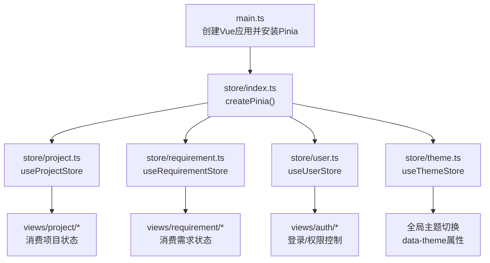
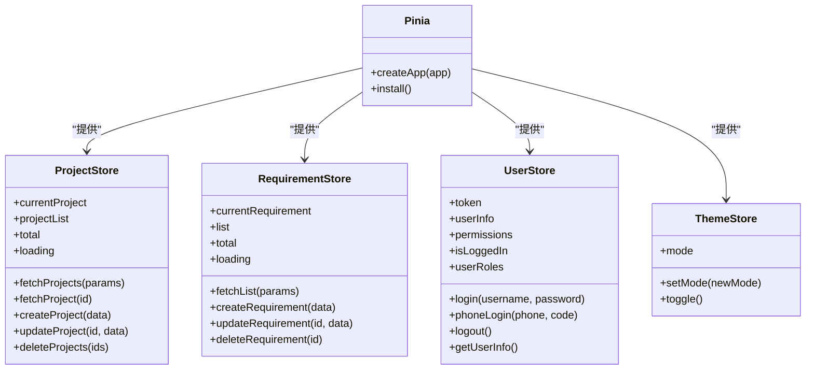
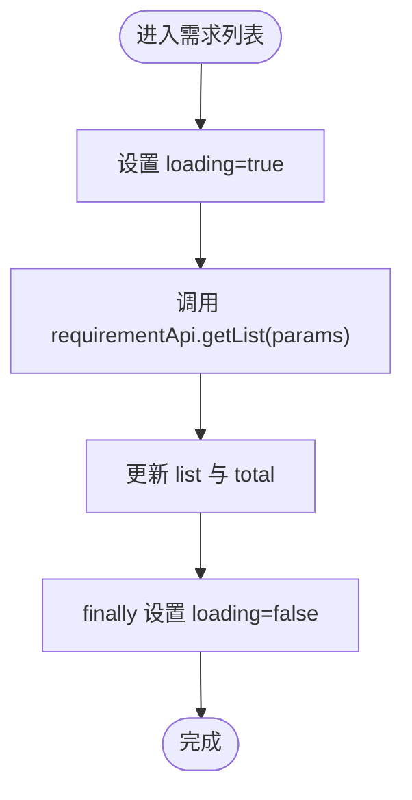
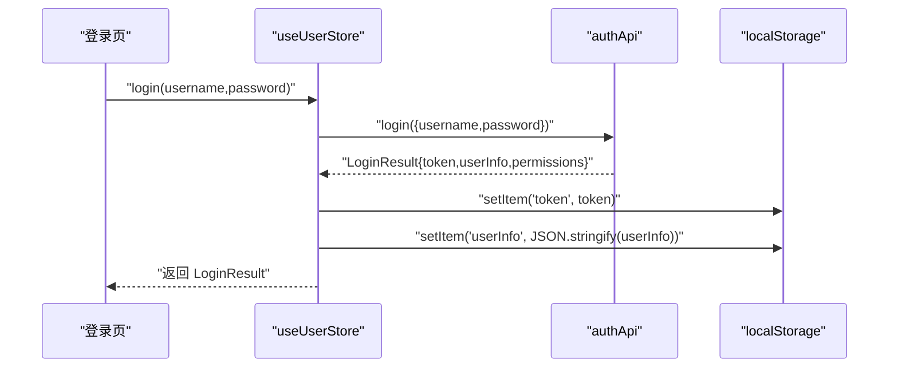
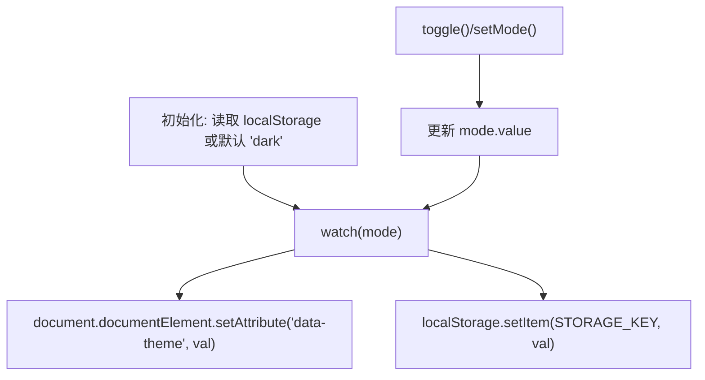
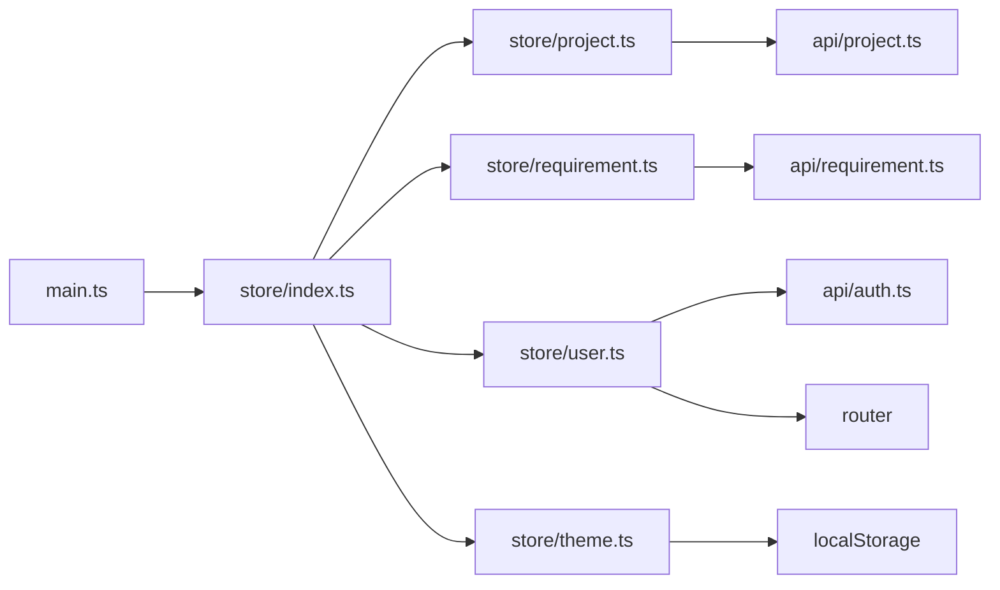

# 状态管理(Pinia)

<cite>
**本文引用的文件**   
- [ele-ai-tender-frontend/src/store/index.ts](file://ele-ai-tender-frontend/src/store/index.ts)
- [ele-ai-tender-frontend/src/store/project.ts](file://ele-ai-tender-frontend/src/store/project.ts)
- [ele-ai-tender-frontend/src/store/requirement.ts](file://ele-ai-tender-frontend/src/store/requirement.ts)
- [ele-ai-tender-frontend/src/store/user.ts](file://ele-ai-tender-frontend/src/store/user.ts)
- [ele-ai-tender-frontend/src/store/theme.ts](file://ele-ai-tender-frontend/src/store/theme.ts)
- [ele-ai-tender-frontend/src/main.ts](file://ele-ai-tender-frontend/src/main.ts)
- [ele-ai-tender-frontend/src/utils/storage.ts](file://ele-ai-tender-frontend/src/utils/storage.ts)
- [ele-ai-tender-frontend/src/views/project/ProjectDetail.vue](file://ele-ai-tender-frontend/src/views/project/ProjectDetail.vue)
- [ele-ai-tender-frontend/src/views/requirement/RequirementList.vue](file://ele-ai-tender-frontend/src/views/requirement/RequirementList.vue)
</cite>

## 目录
1. [简介](#简介)
2. [项目结构](#项目结构)
3. [核心组件](#核心组件)
4. [架构总览](#架构总览)
5. [详细组件分析](#详细组件分析)
6. [依赖关系分析](#依赖关系分析)
7. [性能考虑](#性能考虑)
8. [故障排查指南](#故障排查指南)
9. [结论](#结论)
10. [附录](#附录)

## 简介
本文件围绕前端基于 Pinia 的状态管理系统，系统性梳理 Store 的架构设计与实现模式，覆盖模块化组织、响应式数据管理、异步操作处理、持久化策略、跨组件通信方案、组合式 API 使用模式、类型安全配置与测试策略，并给出性能优化技巧、调试工具与最佳实践。

## 项目结构
本项目在前端工程中采用按领域划分的 Store 模块：
- 应用初始化入口注册 Pinia 实例
- 业务 Store 分别位于 store 目录下，每个文件对应一个领域（项目、需求、用户、主题）
- 视图层通过组合式 API 调用 Store，完成数据获取与交互



图表来源
- [ele-ai-tender-frontend/src/main.ts:1-15](file://ele-ai-tender-frontend/src/main.ts#L1-L15)
- [ele-ai-tender-frontend/src/store/index.ts:1-6](file://ele-ai-tender-frontend/src/store/index.ts#L1-L6)
- [ele-ai-tender-frontend/src/store/project.ts:1-44](file://ele-ai-tender-frontend/src/store/project.ts#L1-L44)
- [ele-ai-tender-frontend/src/store/requirement.ts:1-41](file://ele-ai-tender-frontend/src/store/requirement.ts#L1-L41)
- [ele-ai-tender-frontend/src/store/user.ts:1-75](file://ele-ai-tender-frontend/src/store/user.ts#L1-L75)
- [ele-ai-tender-frontend/src/store/theme.ts:1-28](file://ele-ai-tender-frontend/src/store/theme.ts#L1-L28)

章节来源
- [ele-ai-tender-frontend/src/main.ts:1-15](file://ele-ai-tender-frontend/src/main.ts#L1-L15)
- [ele-ai-tender-frontend/src/store/index.ts:1-6](file://ele-ai-tender-frontend/src/store/index.ts#L1-L6)

## 核心组件
- 应用级 Pinia 实例：在应用启动时创建并注入到 Vue 应用中，供所有组件共享
- 项目 Store：负责项目列表、分页、详情加载与基础 CRUD 动作
- 需求 Store：负责需求列表、分页与基础 CRUD 动作
- 用户 Store：负责登录态、用户信息、权限缓存与路由跳转
- 主题 Store：负责明暗主题切换与本地持久化

章节来源
- [ele-ai-tender-frontend/src/store/project.ts:1-44](file://ele-ai-tender-frontend/src/store/project.ts#L1-L44)
- [ele-ai-tender-frontend/src/store/requirement.ts:1-41](file://ele-ai-tender-frontend/src/store/requirement.ts#L1-L41)
- [ele-ai-tender-frontend/src/store/user.ts:1-75](file://ele-ai-tender-frontend/src/store/user.ts#L1-L75)
- [ele-ai-tender-frontend/src/store/theme.ts:1-28](file://ele-ai-tender-frontend/src/store/theme.ts#L1-L28)

## 架构总览
整体采用“单例 Pinia + 多 Store 模块”的模式，各 Store 独立维护自身状态与副作用，组件通过组合式 API 订阅与触发更新。



图表来源
- [ele-ai-tender-frontend/src/store/project.ts:1-44](file://ele-ai-tender-frontend/src/store/project.ts#L1-L44)
- [ele-ai-tender-frontend/src/store/requirement.ts:1-41](file://ele-ai-tender-frontend/src/store/requirement.ts#L1-L41)
- [ele-ai-tender-frontend/src/store/user.ts:1-75](file://ele-ai-tender-frontend/src/store/user.ts#L1-L75)
- [ele-ai-tender-frontend/src/store/theme.ts:1-28](file://ele-ai-tender-frontend/src/store/theme.ts#L1-L28)

## 详细组件分析

### 项目管理 Store（project.ts）
- 状态设计
  - currentProject：当前选中项目详情
  - projectList：分页列表
  - total：总数
  - loading：加载态
- 行为设计
  - fetchProjects：设置 loading，请求后回填 records 与 total，finally 重置 loading
  - fetchProject：根据 id 拉取详情
  - create/update/delete：透传至 API 层并返回结果
- 错误处理
  - 未显式捕获网络异常，建议在调用方或统一拦截器中处理
- 性能考量
  - 列表与详情分离，避免重复渲染；分页由后端 records/total 驱动
- 类型安全
  - 使用接口定义 state 字段，结合 types 中的类型约束

```mermaid
sequenceDiagram
participant View as "项目详情页"
participant Store as "useProjectStore"
participant API as "projectApi"
View->>Store : "fetchProjects(params)"
Store->>Store : "loading = true"
Store->>API : "getList(params)"
API-->>Store : "{records,total}"
Store->>Store : "projectList=records; total=total"
Store->>Store : "loading = false"
Note over Store : "finally 保证 loading 复位"
```

图表来源
- [ele-ai-tender-frontend/src/store/project.ts:19-29](file://ele-ai-tender-frontend/src/store/project.ts#L19-L29)

章节来源
- [ele-ai-tender-frontend/src/store/project.ts:1-44](file://ele-ai-tender-frontend/src/store/project.ts#L1-L44)

### 需求管理 Store（requirement.ts）
- 状态设计
  - currentRequirement：当前需求详情
  - list：列表
  - total：总数
  - loading：加载态
- 行为设计
  - fetchList：分页查询，设置 loading，回填 records 与 total
  - create/update/delete：透传至 API 层
- 错误处理
  - 同项目 Store，建议由调用方或拦截器统一处理
- 性能考量
  - 列表与详情解耦，按需加载详情，减少首屏压力



图表来源
- [ele-ai-tender-frontend/src/store/requirement.ts:19-29](file://ele-ai-tender-frontend/src/store/requirement.ts#L19-L29)

章节来源
- [ele-ai-tender-frontend/src/store/requirement.ts:1-41](file://ele-ai-tender-frontend/src/store/requirement.ts#L1-L41)

### 用户状态 Store（user.ts）
- 状态设计
  - token、userInfo、permissions：登录态与用户信息
  - isLoggedIn、userRoles：派生计算属性
- 行为设计
  - login/phoneLogin：调用认证 API，写入 token 与 userInfo，持久化到 localStorage，返回结果
  - logout：清空状态与本地存储，重定向到登录页
  - getUserInfo：无 token 直接返回；有 token 则拉取用户信息并持久化
- 错误处理
  - getUserInfo 内部 try/catch 记录错误日志
- 类型安全
  - 使用 ref/computed 的组合式写法，配合 UserInfo 类型约束



图表来源
- [ele-ai-tender-frontend/src/store/user.ts:15-26](file://ele-ai-tender-frontend/src/store/user.ts#L15-L26)

章节来源
- [ele-ai-tender-frontend/src/store/user.ts:1-75](file://ele-ai-tender-frontend/src/store/user.ts#L1-L75)

### 主题配置 Store（theme.ts）
- 状态设计
  - mode：'dark'|'light'
- 行为设计
  - setMode/toggle：切换主题
  - watch(mode)：同步到 DOM 根节点 data-theme 属性，并持久化到 localStorage
- 初始化
  - 从 localStorage 读取初始值，默认 dark
- 类型安全
  - 使用泛型 ref 与联合类型约束



图表来源
- [ele-ai-tender-frontend/src/store/theme.ts:6-27](file://ele-ai-tender-frontend/src/store/theme.ts#L6-L27)

章节来源
- [ele-ai-tender-frontend/src/store/theme.ts:1-28](file://ele-ai-tender-frontend/src/store/theme.ts#L1-L28)

## 依赖关系分析
- 应用入口 main.ts 安装 Pinia，使所有 Store 可被任意组件访问
- 各 Store 依赖 API 层进行数据读写，遵循“Store 仅做状态管理与副作用编排”的职责边界
- 用户与主题 Store 直接操作 localStorage，作为轻量持久化方案
- 视图层通过组合式 API 使用 Store，保持低耦合与高内聚



图表来源
- [ele-ai-tender-frontend/src/main.ts:1-15](file://ele-ai-tender-frontend/src/main.ts#L1-L15)
- [ele-ai-tender-frontend/src/store/index.ts:1-6](file://ele-ai-tender-frontend/src/store/index.ts#L1-L6)
- [ele-ai-tender-frontend/src/store/project.ts:1-44](file://ele-ai-tender-frontend/src/store/project.ts#L1-L44)
- [ele-ai-tender-frontend/src/store/requirement.ts:1-41](file://ele-ai-tender-frontend/src/store/requirement.ts#L1-L41)
- [ele-ai-tender-frontend/src/store/user.ts:1-75](file://ele-ai-tender-frontend/src/store/user.ts#L1-L75)
- [ele-ai-tender-frontend/src/store/theme.ts:1-28](file://ele-ai-tender-frontend/src/store/theme.ts#L1-L28)

章节来源
- [ele-ai-tender-frontend/src/main.ts:1-15](file://ele-ai-tender-frontend/src/main.ts#L1-L15)

## 性能考虑
- 列表分页与懒加载
  - 列表与详情分离，仅在需要时拉取详情，降低首屏负载
- 防抖与节流
  - 搜索输入场景建议使用防抖，避免频繁请求
- 计算属性与响应式最小化
  - 尽量将派生数据放入 computed，避免在模板中进行复杂计算
- 批量更新
  - 对多次赋值合并为一次更新，减少不必要的重渲染
- 大对象持久化
  - 谨慎持久化大型对象，必要时拆分键值或压缩存储

[本节为通用指导，不直接分析具体文件]

## 故障排查指南
- 登录失败
  - 检查 authApi 返回值结构与 userStore 的赋值逻辑是否一致
  - 确认 localStorage 写入成功且后续请求携带正确 token
- 列表不刷新
  - 检查 actions 是否正确更新 list 与 total
  - 确认 finally 分支是否执行以复位 loading
- 主题不生效
  - 检查 watch 是否触发以及 data-theme 属性是否正确设置
  - 确认 CSS 选择器与样式变量是否匹配 data-theme
- 用户信息不同步
  - 检查 getUserInfo 的 try/catch 与错误日志
  - 确认路由守卫或页面初始化是否调用了 getUserInfo

章节来源
- [ele-ai-tender-frontend/src/store/user.ts:50-61](file://ele-ai-tender-frontend/src/store/user.ts#L50-L61)
- [ele-ai-tender-frontend/src/store/theme.ts:21-24](file://ele-ai-tender-frontend/src/store/theme.ts#L21-L24)

## 结论
本项目采用 Pinia 构建清晰、可扩展的前端状态管理架构。通过模块化 Store、组合式 API 与轻量持久化，实现了良好的职责分离与可维护性。后续可在错误处理、缓存策略与测试覆盖方面进一步完善，以提升健壮性与开发体验。

[本节为总结性内容，不直接分析具体文件]

## 附录

### 组合式 API 使用模式
- 在组件中引入并使用 useXxxStore，直接访问 state、computed 与 actions
- 推荐在 setup 中集中声明与调用，保持逻辑内聚
- 对于表单提交等流程，优先在 Store 中封装 action，组件只负责触发与展示

章节来源
- [ele-ai-tender-frontend/src/store/project.ts:12-43](file://ele-ai-tender-frontend/src/store/project.ts#L12-L43)
- [ele-ai-tender-frontend/src/store/requirement.ts:12-40](file://ele-ai-tender-frontend/src/store/requirement.ts#L12-L40)
- [ele-ai-tender-frontend/src/store/user.ts:7-74](file://ele-ai-tender-frontend/src/store/user.ts#L7-L74)
- [ele-ai-tender-frontend/src/store/theme.ts:6-27](file://ele-ai-tender-frontend/src/store/theme.ts#L6-L27)

### 类型安全配置
- 使用 TypeScript 接口定义 State 字段，确保强类型约束
- 在 actions 参数与返回值处标注类型，提升可读性与可维护性
- 在组件中使用 from stores 的类型导出，避免 any

章节来源
- [ele-ai-tender-frontend/src/store/project.ts:5-10](file://ele-ai-tender-frontend/src/store/project.ts#L5-L10)
- [ele-ai-tender-frontend/src/store/requirement.ts:5-10](file://ele-ai-tender-frontend/src/store/requirement.ts#L5-L10)
- [ele-ai-tender-frontend/src/store/user.ts:7-13](file://ele-ai-tender-frontend/src/store/user.ts#L7-L13)
- [ele-ai-tender-frontend/src/store/theme.ts:4-11](file://ele-ai-tender-frontend/src/store/theme.ts#L4-L11)

### 状态持久化策略
- 用户相关：token、userInfo 写入 localStorage，登出时清理
- 主题相关：mode 写入 localStorage，并通过 watch 同步到 DOM
- 通用工具：utils/storage.ts 提供 get/set/remove 封装，便于扩展

章节来源
- [ele-ai-tender-frontend/src/store/user.ts:22-24](file://ele-ai-tender-frontend/src/store/user.ts#L22-L24)
- [ele-ai-tender-frontend/src/store/user.ts:35-36](file://ele-ai-tender-frontend/src/store/user.ts#L35-L36)
- [ele-ai-tender-frontend/src/store/user.ts:45-47](file://ele-ai-tender-frontend/src/store/user.ts#L45-L47)
- [ele-ai-tender-frontend/src/store/theme.ts:21-24](file://ele-ai-tender-frontend/src/store/theme.ts#L21-L24)
- [ele-ai-tender-frontend/src/utils/storage.ts:1-18](file://ele-ai-tender-frontend/src/utils/storage.ts#L1-L18)

### 数据同步机制
- 列表与分页：后端 records/total 驱动前端 list/total
- 详情加载：按需拉取，避免冗余渲染
- 用户信息：登录后立即持久化，并在需要时主动刷新

章节来源
- [ele-ai-tender-frontend/src/store/project.ts:23-28](file://ele-ai-tender-frontend/src/store/project.ts#L23-L28)
- [ele-ai-tender-frontend/src/store/requirement.ts:23-28](file://ele-ai-tender-frontend/src/store/requirement.ts#L23-L28)
- [ele-ai-tender-frontend/src/store/user.ts:50-61](file://ele-ai-tender-frontend/src/store/user.ts#L50-L61)

### 跨组件通信方案
- 通过 Pinia 全局 Store 共享状态，组件间无需父子传递
- 典型场景：用户登录态、主题模式、项目/需求列表与详情

章节来源
- [ele-ai-tender-frontend/src/store/index.ts:1-6](file://ele-ai-tender-frontend/src/store/index.ts#L1-L6)
- [ele-ai-tender-frontend/src/store/user.ts:7-13](file://ele-ai-tender-frontend/src/store/user.ts#L7-L13)
- [ele-ai-tender-frontend/src/store/theme.ts:6-11](file://ele-ai-tender-frontend/src/store/theme.ts#L6-L11)

### 测试策略
- 单元测试
  - 针对 Store 的 actions 编写用例，模拟 API 返回，断言 state 变化
  - 对用户 Store 的登录/登出流程进行端到端断言
- 集成测试
  - 验证主题切换对 DOM 属性的影响
- Mock 策略
  - 使用 jest/vitest 的 mock 能力替换 API 与 localStorage

[本节为通用指导，不直接分析具体文件]

### 调试工具与最佳实践
- 浏览器插件
  - 使用 Pinia Devtools 可视化状态树与 Actions 调用链
- 日志与埋点
  - 关键路径添加必要日志，便于定位问题
- 代码规范
  - 单一职责：Store 只做状态与副作用编排，UI 逻辑留在组件
  - 命名规范：action 动词开头，state 语义清晰
  - 错误处理：统一在拦截器或调用方处理，避免分散 try/catch

[本节为通用指导，不直接分析具体文件]