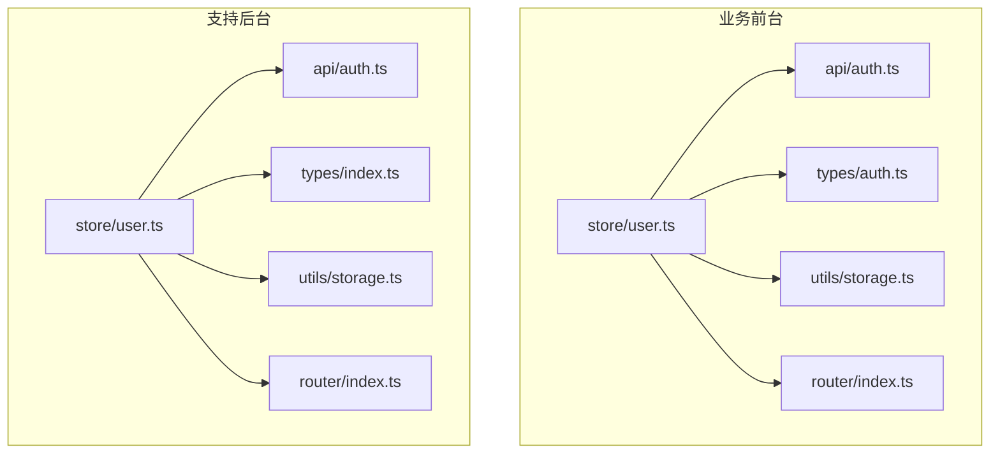
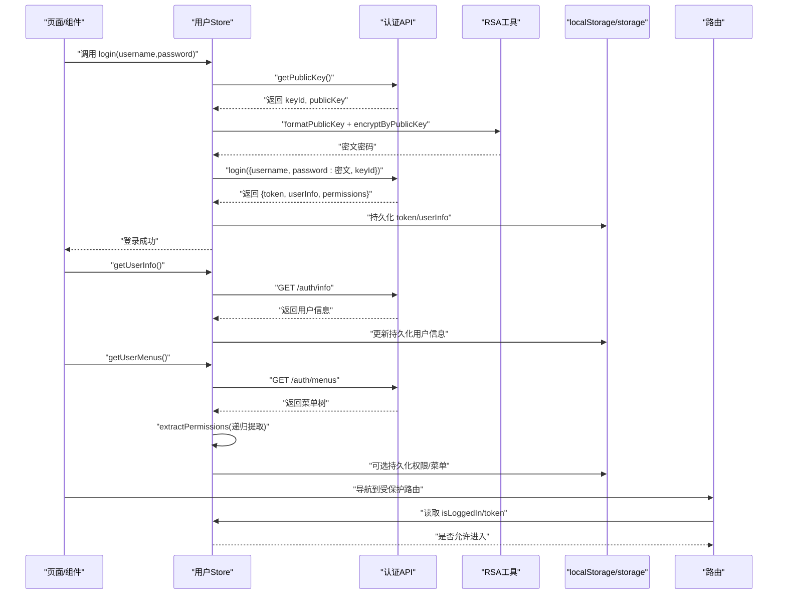
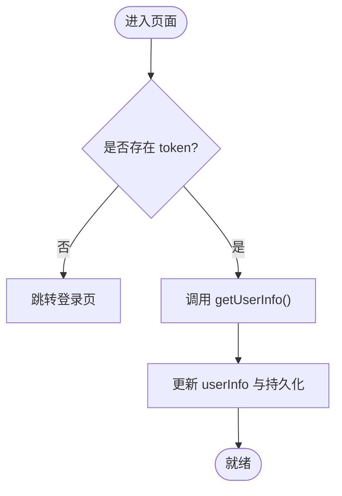
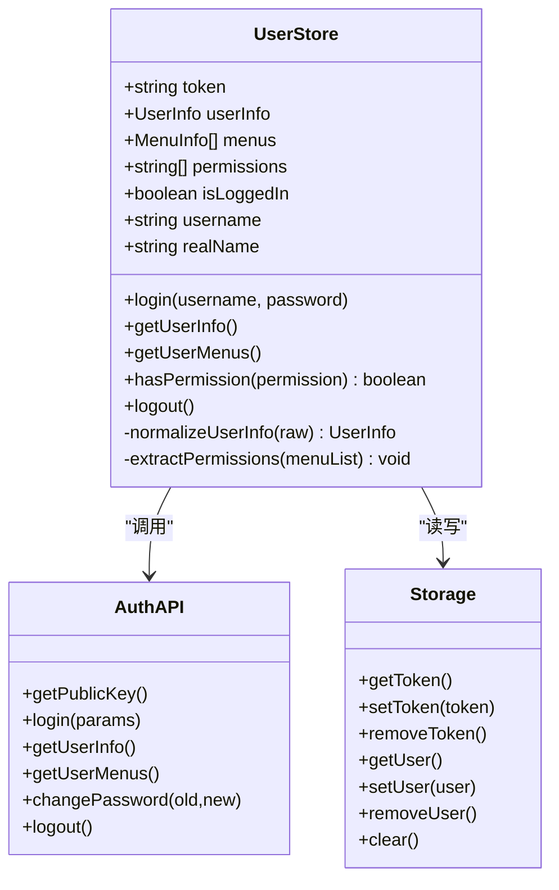
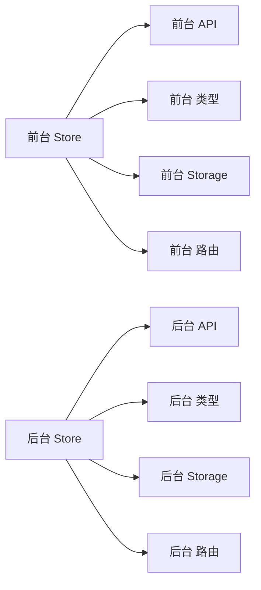

# 用户状态Store

<cite>
**本文引用的文件**
- [ele-ai-tender-frontend/src/store/user.ts](file://ele-ai-tender-frontend/src/store/user.ts)
- [ele-ai-tender-support-frontend/src/store/user.ts](file://ele-ai-tender-support-frontend/src/store/user.ts)
- [ele-ai-tender-frontend/src/api/auth.ts](file://ele-ai-tender-frontend/src/api/auth.ts)
- [ele-ai-tender-support-frontend/src/api/auth.ts](file://ele-ai-tender-support-frontend/src/api/auth.ts)
- [ele-ai-tender-frontend/src/types/auth.ts](file://ele-ai-tender-frontend/src/types/auth.ts)
- [ele-ai-tender-support-frontend/src/types/index.ts](file://ele-ai-tender-support-frontend/src/types/index.ts)
- [ele-ai-tender-frontend/src/utils/storage.ts](file://ele-ai-tender-frontend/src/utils/storage.ts)
- [ele-ai-tender-support-frontend/src/utils/storage.ts](file://ele-ai-tender-support-frontend/src/utils/storage.ts)
- [ele-ai-tender-frontend/src/router/index.ts](file://ele-ai-tender-frontend/src/router/index.ts)
- [ele-ai-tender-support-frontend/src/router/index.ts](file://ele-ai-tender-support-frontend/src/router/index.ts)
</cite>

## 目录
1. [简介](#简介)
2. [项目结构](#项目结构)
3. [核心组件](#核心组件)
4. [架构总览](#架构总览)
5. [详细组件分析](#详细组件分析)
6. [依赖关系分析](#依赖关系分析)
7. [性能与缓存策略](#性能与缓存策略)
8. [安全与最佳实践](#安全与最佳实践)
9. [异常处理与用户体验](#异常处理与用户体验)
10. [测试方法](#测试方法)
11. [结论](#结论)

## 简介
本文件为用户状态Store的完整技术文档，聚焦于两个前端应用中的用户认证与权限管理实现：
- 业务前台（ele-ai-tender-frontend）
- 支持后台（ele-ai-tender-support-frontend）

内容覆盖登录/登出流程、JWT Token 的处理与持久化、用户信息与权限的获取与缓存、菜单驱动的权限提取、路由守卫集成思路、Token 刷新机制建议、安全存储方案、异常处理与用户体验优化，以及可落地的测试方法。

## 项目结构
围绕用户状态的核心文件分布如下：
- Store 层：分别维护 token、userInfo、permissions/menus 等状态
- API 层：封装认证相关接口（登录、获取公钥、用户信息、菜单、修改密码、登出）
- 类型定义：统一前后端交互的数据模型
- 工具层：本地存储封装、RSA 加密工具
- 路由层：用于登录后跳转与未登录拦截（概念性说明）

图表来源
- [ele-ai-tender-frontend/src/store/user.ts:1-75](file://ele-ai-tender-frontend/src/store/user.ts#L1-L75)
- [ele-ai-tender-support-frontend/src/store/user.ts:1-122](file://ele-ai-tender-support-frontend/src/store/user.ts#L1-L122)
- [ele-ai-tender-frontend/src/api/auth.ts:1-105](file://ele-ai-tender-frontend/src/api/auth.ts#L1-L105)
- [ele-ai-tender-support-frontend/src/api/auth.ts:1-58](file://ele-ai-tender-support-frontend/src/api/auth.ts#L1-L58)
- [ele-ai-tender-frontend/src/types/auth.ts:1-45](file://ele-ai-tender-frontend/src/types/auth.ts#L1-L45)
- [ele-ai-tender-support-frontend/src/types/index.ts:1-177](file://ele-ai-tender-support-frontend/src/types/index.ts#L1-L177)
- [ele-ai-tender-frontend/src/utils/storage.ts:1-18](file://ele-ai-tender-frontend/src/utils/storage.ts#L1-L18)
- [ele-ai-tender-support-frontend/src/utils/storage.ts:1-47](file://ele-ai-tender-support-frontend/src/utils/storage.ts#L1-L47)
- [ele-ai-tender-frontend/src/router/index.ts](file://ele-ai-tender-frontend/src/router/index.ts)
- [ele-ai-tender-support-frontend/src/router/index.ts](file://ele-ai-tender-support-frontend/src/router/index.ts)

章节来源
- [ele-ai-tender-frontend/src/store/user.ts:1-75](file://ele-ai-tender-frontend/src/store/user.ts#L1-L75)
- [ele-ai-tender-support-frontend/src/store/user.ts:1-122](file://ele-ai-tender-support-frontend/src/store/user.ts#L1-L122)
- [ele-ai-tender-frontend/src/api/auth.ts:1-105](file://ele-ai-tender-frontend/src/api/auth.ts#L1-L105)
- [ele-ai-tender-support-frontend/src/api/auth.ts:1-58](file://ele-ai-tender-support-frontend/src/api/auth.ts#L1-L58)
- [ele-ai-tender-frontend/src/types/auth.ts:1-45](file://ele-ai-tender-frontend/src/types/auth.ts#L1-L45)
- [ele-ai-tender-support-frontend/src/types/index.ts:1-177](file://ele-ai-tender-support-frontend/src/types/index.ts#L1-L177)
- [ele-ai-tender-frontend/src/utils/storage.ts:1-18](file://ele-ai-tender-frontend/src/utils/storage.ts#L1-L18)
- [ele-ai-tender-support-frontend/src/utils/storage.ts:1-47](file://ele-ai-tender-support-frontend/src/utils/storage.ts#L1-L47)

## 核心组件
- 业务前台用户Store
  - 状态：token、userInfo、permissions、isLoggedIn、userRoles
  - 能力：密码登录、手机验证码登录、获取用户信息、登出、基础权限判断
  - 持久化：localStorage 保存 token 与 userInfo
- 支持后台用户Store
  - 状态：token、userInfo、menus、permissions、isLoggedIn、username、realName
  - 能力：RSA 公钥获取与密码加密、登录、获取用户信息、获取菜单并提取权限、权限检查、登出
  - 持久化：storage 工具封装的 localStorage 键值对

章节来源
- [ele-ai-tender-frontend/src/store/user.ts:1-75](file://ele-ai-tender-frontend/src/store/user.ts#L1-L75)
- [ele-ai-tender-support-frontend/src/store/user.ts:1-122](file://ele-ai-tender-support-frontend/src/store/user.ts#L1-L122)

## 架构总览
下图展示两个前端应用的认证与权限数据流，包括 RSA 公钥获取、密码加密、登录响应、用户信息与菜单加载、权限提取与持久化。

图表来源
- [ele-ai-tender-support-frontend/src/store/user.ts:35-90](file://ele-ai-tender-support-frontend/src/store/user.ts#L35-L90)
- [ele-ai-tender-support-frontend/src/api/auth.ts:10-29](file://ele-ai-tender-support-frontend/src/api/auth.ts#L10-L29)
- [ele-ai-tender-frontend/src/store/user.ts:15-39](file://ele-ai-tender-frontend/src/store/user.ts#L15-L39)
- [ele-ai-tender-frontend/src/api/auth.ts:10-47](file://ele-ai-tender-frontend/src/api/auth.ts#L10-L47)
- [ele-ai-tender-support-frontend/src/utils/storage.ts:1-47](file://ele-ai-tender-support-frontend/src/utils/storage.ts#L1-L47)
- [ele-ai-tender-frontend/src/utils/storage.ts:1-18](file://ele-ai-tender-frontend/src/utils/storage.ts#L1-L18)

## 详细组件分析

### 业务前台用户Store（ele-ai-tender-frontend）
- 关键职责
  - 登录：调用 authApi.login，自动在请求前获取RSA公钥并对密码进行加密（由API层完成），成功后写入 store 与 localStorage
  - 手机验证码登录：调用 phoneLogin，成功后同步状态与持久化
  - 获取用户信息：若存在 token，则拉取最新用户信息并更新持久化
  - 登出：清空状态与持久化，跳转到登录页
- 状态与计算属性
  - token、userInfo、permissions
  - isLoggedIn、userRoles
- 数据持久化
  - 使用 localStorage 直接存取 token 与 userInfo

图表来源
- [ele-ai-tender-frontend/src/store/user.ts:50-61](file://ele-ai-tender-frontend/src/store/user.ts#L50-L61)
- [ele-ai-tender-frontend/src/store/user.ts:41-48](file://ele-ai-tender-frontend/src/store/user.ts#L41-L48)

章节来源
- [ele-ai-tender-frontend/src/store/user.ts:1-75](file://ele-ai-tender-frontend/src/store/user.ts#L1-L75)
- [ele-ai-tender-frontend/src/api/auth.ts:10-47](file://ele-ai-tender-frontend/src/api/auth.ts#L10-L47)
- [ele-ai-tender-frontend/src/types/auth.ts:24-38](file://ele-ai-tender-frontend/src/types/auth.ts#L24-L38)
- [ele-ai-tender-frontend/src/utils/storage.ts:1-18](file://ele-ai-tender-frontend/src/utils/storage.ts#L1-L18)

### 支持后台用户Store（ele-ai-tender-support-frontend）
- 关键职责
  - 登录：先获取RSA公钥，再对密码进行加密后提交；成功后设置 token、userInfo、permissions，并持久化
  - 获取用户信息：拉取并标准化用户信息，持久化
  - 获取菜单与权限：拉取菜单树，递归提取 permission 字段形成权限集合
  - 权限检查：提供 hasPermission 方法供组件或指令使用
  - 登出：清空所有状态与持久化，跳转登录页
- 数据持久化
  - 通过 storage 工具封装的 localStorage 键名 ele_bid_token、ele_bid_user

图表来源
- [ele-ai-tender-support-frontend/src/store/user.ts:10-122](file://ele-ai-tender-support-frontend/src/store/user.ts#L10-L122)
- [ele-ai-tender-support-frontend/src/api/auth.ts:10-58](file://ele-ai-tender-support-frontend/src/api/auth.ts#L10-L58)
- [ele-ai-tender-support-frontend/src/utils/storage.ts:1-47](file://ele-ai-tender-support-frontend/src/utils/storage.ts#L1-L47)

章节来源
- [ele-ai-tender-support-frontend/src/store/user.ts:1-122](file://ele-ai-tender-support-frontend/src/store/user.ts#L1-L122)
- [ele-ai-tender-support-frontend/src/api/auth.ts:1-58](file://ele-ai-tender-support-frontend/src/api/auth.ts#L1-L58)
- [ele-ai-tender-support-frontend/src/types/index.ts:55-109](file://ele-ai-tender-support-frontend/src/types/index.ts#L55-L109)
- [ele-ai-tender-support-frontend/src/utils/storage.ts:1-47](file://ele-ai-tender-support-frontend/src/utils/storage.ts#L1-L47)

### 认证API与类型定义
- 业务前台认证API
  - 获取RSA公钥、密码登录（内部完成公钥获取与密码加密）、手机验证码登录、短信重置密码、获取用户信息、获取菜单、修改密码、登出
- 支持后台认证API
  - 获取RSA公钥、登录（外部已加密）、获取用户信息、获取菜单、修改密码、登出
- 类型定义
  - 业务前台：LoginRequest、PhoneLoginRequest、SendSmsCodeRequest、ResetPasswordRequest、UserInfo、LoginResult、ApiResponse
  - 支持后台：LoginParams、LoginResult、AuthUserInfo、MenuInfo、RoleInfo 等

章节来源
- [ele-ai-tender-frontend/src/api/auth.ts:1-105](file://ele-ai-tender-frontend/src/api/auth.ts#L1-L105)
- [ele-ai-tender-support-frontend/src/api/auth.ts:1-58](file://ele-ai-tender-support-frontend/src/api/auth.ts#L1-L58)
- [ele-ai-tender-frontend/src/types/auth.ts:1-45](file://ele-ai-tender-frontend/src/types/auth.ts#L1-L45)
- [ele-ai-tender-support-frontend/src/types/index.ts:155-177](file://ele-ai-tender-support-frontend/src/types/index.ts#L155-L177)

## 依赖关系分析
- 模块耦合
  - Store 依赖 API 层进行网络请求
  - Store 依赖类型定义保证数据结构一致性
  - Store 依赖 storage 工具进行本地持久化
  - 路由层根据 Store 的状态控制访问
- 潜在循环依赖
  - 当前未见明显循环依赖；注意避免在 router 中直接 import store 造成初始化顺序问题，建议使用函数式读取或全局注入方式

图表来源
- [ele-ai-tender-frontend/src/store/user.ts:1-75](file://ele-ai-tender-frontend/src/store/user.ts#L1-L75)
- [ele-ai-tender-support-frontend/src/store/user.ts:1-122](file://ele-ai-tender-support-frontend/src/store/user.ts#L1-L122)

章节来源
- [ele-ai-tender-frontend/src/store/user.ts:1-75](file://ele-ai-tender-frontend/src/store/user.ts#L1-L75)
- [ele-ai-tender-support-frontend/src/store/user.ts:1-122](file://ele-ai-tender-support-frontend/src/store/user.ts#L1-L122)

## 性能与缓存策略
- 用户信息缓存
  - 登录成功后将 userInfo 写入持久化，后续页面初始化可直接从本地读取，减少不必要的网络请求
- 权限缓存
  - 支持后台在获取菜单后提取权限集合，可在内存中缓存并在需要时快速判断
- 建议
  - 为 getUserInfo 增加短时缓存与失效策略（如基于时间戳或版本号）
  - 菜单与权限变更时主动失效缓存，确保一致性

章节来源
- [ele-ai-tender-frontend/src/store/user.ts:50-61](file://ele-ai-tender-frontend/src/store/user.ts#L50-L61)
- [ele-ai-tender-support-frontend/src/store/user.ts:66-90](file://ele-ai-tender-support-frontend/src/store/user.ts#L66-L90)

## 安全与最佳实践
- 传输安全
  - 密码采用 RSA 公钥在前端加密后再传输，降低明文泄露风险
- 存储安全
  - 当前使用 localStorage 存储 token 与用户信息，存在 XSS 窃取风险
  - 建议：
    - 优先使用 httpOnly Cookie 存储 token，避免前端脚本访问
    - 若必须使用 localStorage，应结合严格的 CSP 与输入校验，最小化暴露面
- 会话管理
  - 建议引入 refresh token 机制，在 access token 过期前自动续期
  - 服务端侧配合黑名单或短有效期策略，提升安全性
- 权限最小化
  - 仅按需加载菜单与权限，避免一次性下发过多敏感标识

章节来源
- [ele-ai-tender-frontend/src/api/auth.ts:10-34](file://ele-ai-tender-frontend/src/api/auth.ts#L10-L34)
- [ele-ai-tender-support-frontend/src/api/auth.ts:10-29](file://ele-ai-tender-support-frontend/src/api/auth.ts#L10-L29)
- [ele-ai-tender-support-frontend/src/store/user.ts:35-56](file://ele-ai-tender-support-frontend/src/store/user.ts#L35-L56)

## 异常处理与用户体验
- 错误提示
  - 支持后台在密码加密失败时给出明确的用户提示
- 网络异常
  - 建议在 request 拦截器中统一处理 401/403 等状态码，触发登出或刷新逻辑
- 用户体验优化
  - 登录过程中显示加载态，避免重复提交
  - 登出后清理状态并跳转登录页，防止回退导致的状态不一致

章节来源
- [ele-ai-tender-support-frontend/src/store/user.ts:44-47](file://ele-ai-tender-support-frontend/src/store/user.ts#L44-L47)
- [ele-ai-tender-frontend/src/store/user.ts:58-61](file://ele-ai-tender-frontend/src/store/user.ts#L58-L61)

## 测试方法
- 单元测试
  - 针对 Store 的 login、getUserInfo、getUserMenus、hasPermission、logout 等方法编写用例
  - 模拟 API 返回与错误场景，验证状态更新与持久化行为
- 集成测试
  - 使用端到端工具模拟登录流程，验证路由守卫与页面渲染
- 安全测试
  - 验证 RSA 公钥获取与密码加密流程
  - 验证 401/403 时的登出与重定向行为

章节来源
- [ele-ai-tender-frontend/src/store/user.ts:15-48](file://ele-ai-tender-frontend/src/store/user.ts#L15-L48)
- [ele-ai-tender-support-frontend/src/store/user.ts:35-105](file://ele-ai-tender-support-frontend/src/store/user.ts#L35-L105)

## 结论
两个前端应用的用户状态Store均实现了基础的认证与权限管理能力：
- 业务前台侧重简洁的登录与信息获取
- 支持后台具备更完善的菜单驱动权限体系与RSA加密登录流程

建议在未来版本中完善以下方面：
- 引入 refresh token 与自动续期机制
- 将 token 迁移至 httpOnly Cookie 以提升安全性
- 增强全局错误处理与用户反馈
- 完善路由守卫与权限指令的集成