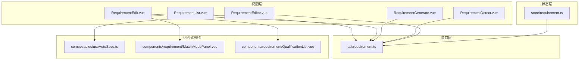
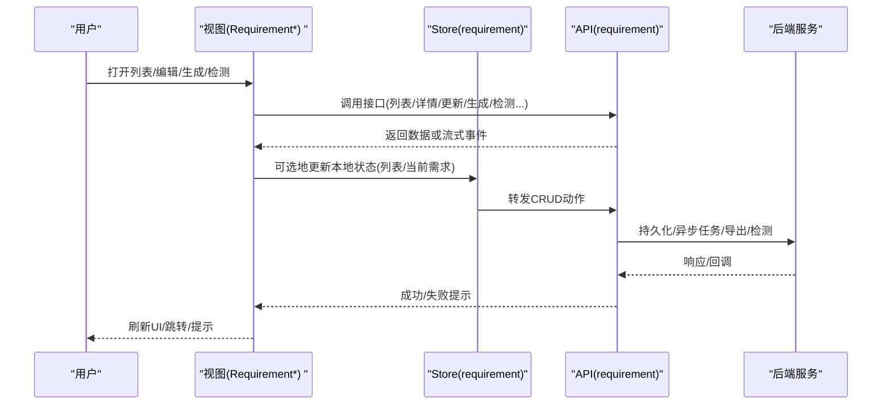
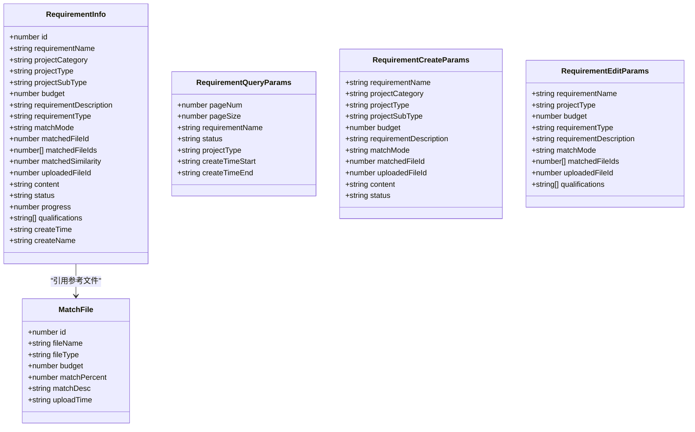
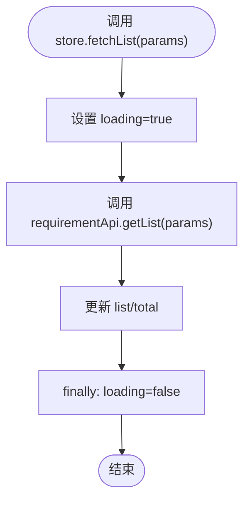
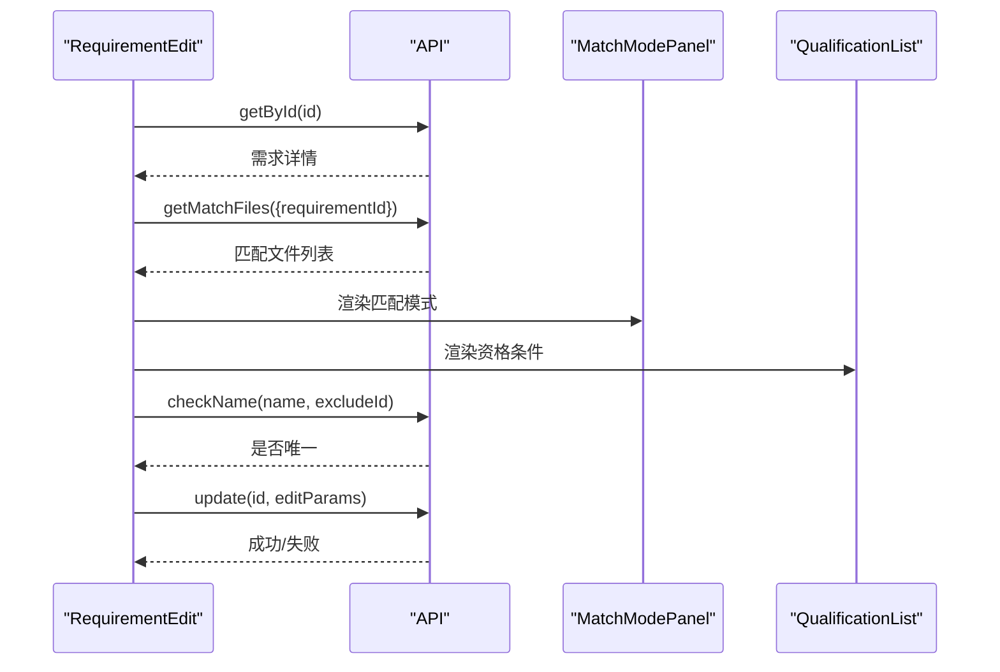
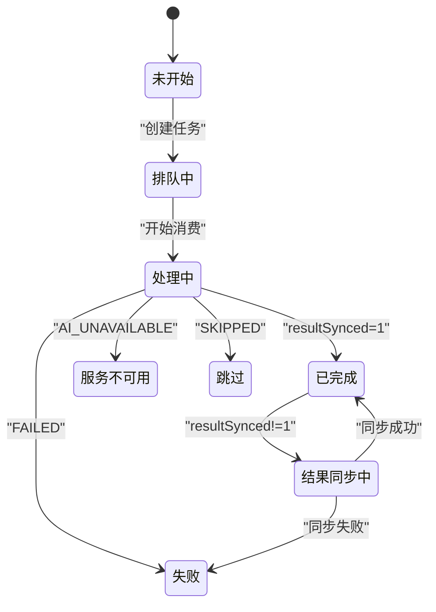
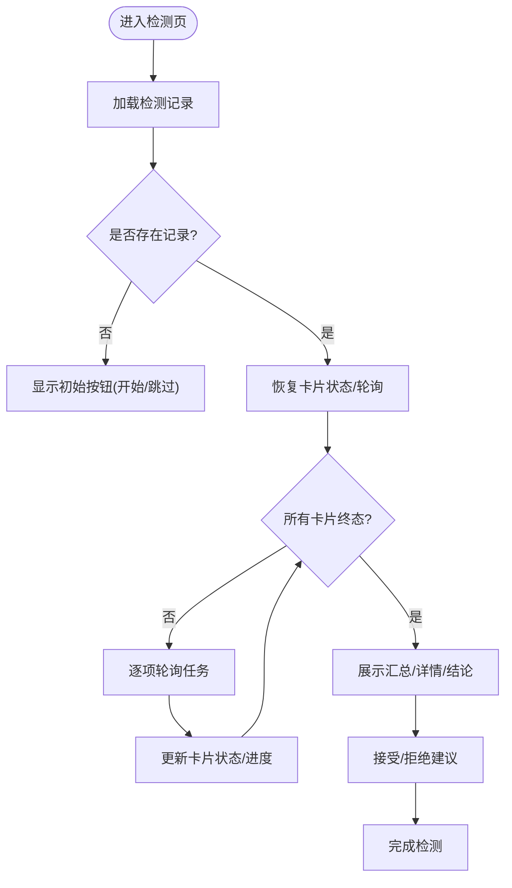
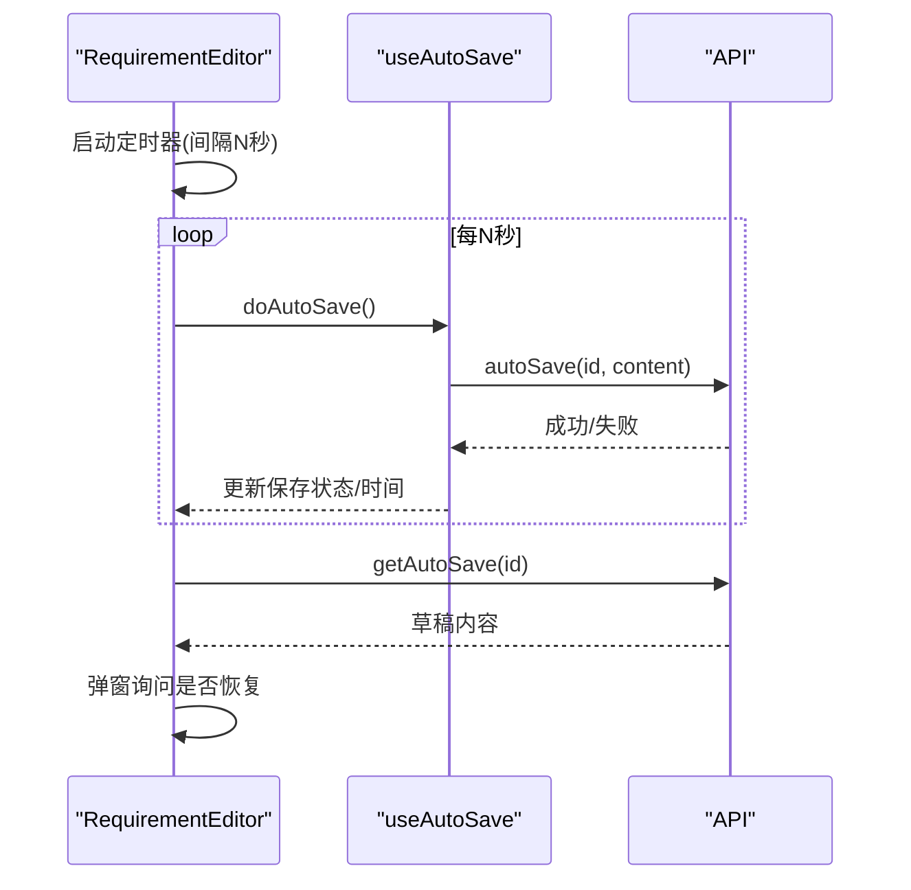
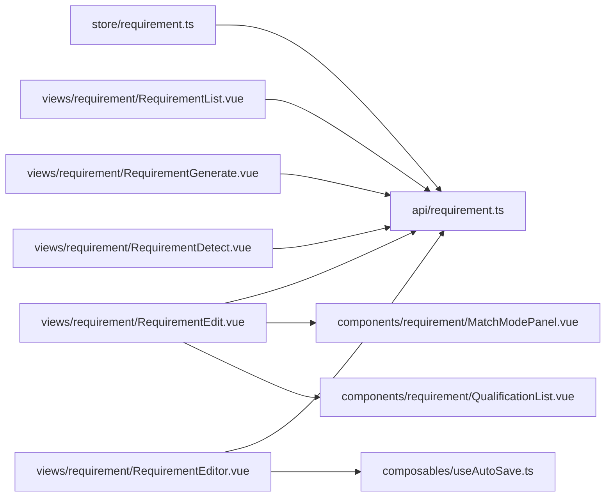

# 需求管理Store

<cite>
**本文引用的文件列表**
- [requirement.ts](file://ele-ai-tender-frontend/src/store/requirement.ts)
- [requirement.ts（类型）](file://ele-ai-tender-frontend/src/types/requirement.ts)
- [requirement.ts（API）](file://ele-ai-tender-frontend/src/api/requirement.ts)
- [RequirementList.vue](file://ele-ai-tender-frontend/src/views/requirement/RequirementList.vue)
- [RequirementEdit.vue](file://ele-ai-tender-frontend/src/views/requirement/RequirementEdit.vue)
- [RequirementEditor.vue](file://ele-ai-tender-frontend/src/views/requirement/RequirementEditor.vue)
- [RequirementGenerate.vue](file://ele-ai-tender-frontend/src/views/requirement/RequirementGenerate.vue)
- [RequirementDetect.vue](file://ele-ai-tender-frontend/src/views/requirement/RequirementDetect.vue)
- [useAutoSave.ts](file://ele-ai-tender-frontend/src/composables/useAutoSave.ts)
- [MatchModePanel.vue](file://ele-ai-tender-frontend/src/components/requirement/MatchModePanel.vue)
- [QualificationList.vue](file://ele-ai-tender-frontend/src/components/requirement/QualificationList.vue)
</cite>

## 目录
1. [简介](#简介)
2. [项目结构](#项目结构)
3. [核心组件](#核心组件)
4. [架构总览](#架构总览)
5. [详细组件分析](#详细组件分析)
6. [依赖关系分析](#依赖关系分析)
7. [性能与优化](#性能与优化)
8. [故障排查指南](#故障排查指南)
9. [结论](#结论)
10. [附录](#附录)

## 简介
本文件围绕“需求管理Store”及其周边实现，系统性梳理前端在需求生命周期中的状态管理与业务逻辑。内容覆盖：
- 需求列表、详情编辑、匹配模式、AI生成任务、智能检测等关键流程
- 数据模型、关联关系、校验规则与同步机制
- 编辑器状态管理、自动保存、冲突解决策略
- 复杂场景处理、性能优化、错误恢复与测试建议

## 项目结构
需求相关的前端代码主要分布在以下位置：
- Store层：集中式状态定义与基础CRUD动作
- API层：统一封装后端接口调用
- 视图层：列表、创建/编辑、生成、检测、编辑器等页面
- 组合式函数：自动保存等通用能力
- 组件：匹配模式面板、资格条件列表等可复用UI

图表来源
- [requirement.ts:1-41](file://ele-ai-tender-frontend/src/store/requirement.ts#L1-L41)
- [requirement.ts（API）:1-80](file://ele-ai-tender-frontend/src/api/requirement.ts#L1-L80)
- [RequirementList.vue:1-303](file://ele-ai-tender-frontend/src/views/requirement/RequirementList.vue#L1-L303)
- [RequirementEdit.vue:1-328](file://ele-ai-tender-frontend/src/views/requirement/RequirementEdit.vue#L1-L328)
- [RequirementGenerate.vue:1-800](file://ele-ai-tender-frontend/src/views/requirement/RequirementGenerate.vue#L1-L800)
- [RequirementDetect.vue:1-800](file://ele-ai-tender-frontend/src/views/requirement/RequirementDetect.vue#L1-L800)
- [RequirementEditor.vue:1-465](file://ele-ai-tender-frontend/src/views/requirement/RequirementEditor.vue#L1-L465)
- [useAutoSave.ts:1-83](file://ele-ai-tender-frontend/src/composables/useAutoSave.ts#L1-L83)
- [MatchModePanel.vue:1-310](file://ele-ai-tender-frontend/src/components/requirement/MatchModePanel.vue#L1-L310)
- [QualificationList.vue:1-113](file://ele-ai-tender-frontend/src/components/requirement/QualificationList.vue#L1-L113)

章节来源
- [requirement.ts:1-41](file://ele-ai-tender-frontend/src/store/requirement.ts#L1-L41)
- [requirement.ts（API）:1-80](file://ele-ai-tender-frontend/src/api/requirement.ts#L1-L80)
- [RequirementList.vue:1-303](file://ele-ai-tender-frontend/src/views/requirement/RequirementList.vue#L1-L303)
- [RequirementEdit.vue:1-328](file://ele-ai-tender-frontend/src/views/requirement/RequirementEdit.vue#L1-L328)
- [RequirementGenerate.vue:1-800](file://ele-ai-tender-frontend/src/views/requirement/RequirementGenerate.vue#L1-L800)
- [RequirementDetect.vue:1-800](file://ele-ai-tender-frontend/src/views/requirement/RequirementDetect.vue#L1-L800)
- [RequirementEditor.vue:1-465](file://ele-ai-tender-frontend/src/views/requirement/RequirementEditor.vue#L1-L465)
- [useAutoSave.ts:1-83](file://ele-ai-tender-frontend/src/composables/useAutoSave.ts#L1-L83)
- [MatchModePanel.vue:1-310](file://ele-ai-tender-frontend/src/components/requirement/MatchModePanel.vue#L1-L310)
- [QualificationList.vue:1-113](file://ele-ai-tender-frontend/src/components/requirement/QualificationList.vue#L1-L113)

## 核心组件
- 需求Store（Pinia）
  - 职责：维护当前需求对象、列表、分页总数、加载态；提供获取列表、增删改等基础动作
  - 特点：轻量、薄封装，直接委托给API层
- 需求API
  - 职责：统一封装需求相关的HTTP请求，包括CRUD、匹配、导出、AI生成、自动保存、检测等
  - 特点：按功能域组织，返回Promise，便于上层组合使用
- 视图与交互
  - 列表页：筛选、分页、删除、跳转生成
  - 编辑页：基本信息、匹配模式、资格要求、名称唯一性校验
  - 生成页：AI任务进度、结果同步、反馈、导出、下一步进入检测
  - 检测页：多任务轮询、问题接受/拒绝、完成检测
  - 编辑器：手动保存、自动保存、草稿恢复、AI辅助替换

章节来源
- [requirement.ts:1-41](file://ele-ai-tender-frontend/src/store/requirement.ts#L1-L41)
- [requirement.ts（API）:1-80](file://ele-ai-tender-frontend/src/api/requirement.ts#L1-L80)
- [RequirementList.vue:1-303](file://ele-ai-tender-frontend/src/views/requirement/RequirementList.vue#L1-L303)
- [RequirementEdit.vue:1-328](file://ele-ai-tender-frontend/src/views/requirement/RequirementEdit.vue#L1-L328)
- [RequirementGenerate.vue:1-800](file://ele-ai-tender-frontend/src/views/requirement/RequirementGenerate.vue#L1-L800)
- [RequirementDetect.vue:1-800](file://ele-ai-tender-frontend/src/views/requirement/RequirementDetect.vue#L1-L800)
- [RequirementEditor.vue:1-465](file://ele-ai-tender-frontend/src/views/requirement/RequirementEditor.vue#L1-L465)

## 架构总览
从用户操作到数据落库的端到端路径如下：

图表来源
- [requirement.ts:1-41](file://ele-ai-tender-frontend/src/store/requirement.ts#L1-L41)
- [requirement.ts（API）:1-80](file://ele-ai-tender-frontend/src/api/requirement.ts#L1-L80)
- [RequirementList.vue:1-303](file://ele-ai-tender-frontend/src/views/requirement/RequirementList.vue#L1-L303)
- [RequirementEdit.vue:1-328](file://ele-ai-tender-frontend/src/views/requirement/RequirementEdit.vue#L1-L328)
- [RequirementGenerate.vue:1-800](file://ele-ai-tender-frontend/src/views/requirement/RequirementGenerate.vue#L1-L800)
- [RequirementDetect.vue:1-800](file://ele-ai-tender-frontend/src/views/requirement/RequirementDetect.vue#L1-L800)
- [RequirementEditor.vue:1-465](file://ele-ai-tender-frontend/src/views/requirement/RequirementEditor.vue#L1-L465)

## 详细组件分析

### 数据模型与关联关系
- 需求信息实体
  - 关键字段：标识、名称、类别/类型、预算、描述、类型枚举、匹配模式、参考文件ID/IDs、相似度、上传文件ID、内容、状态、进度、资格条件、时间戳、创建人
  - 用途：贯穿列表展示、编辑表单、生成上下文、检测高亮、导出文档
- 查询参数
  - 支持分页、关键词、状态、类型、时间范围过滤
- 创建/编辑参数
  - 包含必填项与选填项，区分创建与编辑的差异字段
- 匹配文件信息
  - 用于“参考文件选择”面板，支持预览、多选/单选、上传

图表来源
- [requirement.ts（类型）:1-79](file://ele-ai-tender-frontend/src/types/requirement.ts#L1-L79)

章节来源
- [requirement.ts（类型）:1-79](file://ele-ai-tender-frontend/src/types/requirement.ts#L1-L79)

### Store实现与职责边界
- 状态设计
  - currentRequirement：当前编辑/查看的需求详情
  - list/total：列表与分页总数
  - loading：全局加载态
- 动作设计
  - fetchList：拉取分页列表并更新list/total/loading
  - create/update/delete：透传到API层，供视图层调用
- 适用场景
  - 适合跨页面共享的基础需求数据；对于强耦合页面的局部状态（如编辑器内容、生成进度），由各自视图自行管理更合适

图表来源
- [requirement.ts:1-41](file://ele-ai-tender-frontend/src/store/requirement.ts#L1-L41)

章节来源
- [requirement.ts:1-41](file://ele-ai-tender-frontend/src/store/requirement.ts#L1-L41)

### 列表管理（RequirementList）
- 功能要点
  - 筛选：项目名称、状态、类型、时间范围
  - 分页：页码/每页条数变化触发重新拉取
  - 操作：查看详情（跳转生成）、删除（二次确认）
- 数据流
  - 初始化时拉取列表；搜索/重置后重置页码并拉取；删除成功后刷新列表
- 与Store的关系
  - 该页面未直接使用Store，而是直接调用API；如需跨页面共享列表，可迁移至Store

章节来源
- [RequirementList.vue:1-303](file://ele-ai-tender-frontend/src/views/requirement/RequirementList.vue#L1-L303)
- [requirement.ts（API）:1-80](file://ele-ai-tender-frontend/src/api/requirement.ts#L1-L80)

### 详情编辑（RequirementEdit）
- 功能要点
  - 基本信息：名称、类型、预算、需求类型、描述
  - 匹配模式：系统自动匹配/手动选择/本地上传
  - 资格要求：动态添加/删除，最小数量限制
  - 名称唯一性：失焦时异步校验
- 数据流
  - 进入页面加载详情与匹配文件；提交时组装编辑参数并调用更新接口
- 校验规则
  - 必填项、预算大于0、名称唯一性、资格条件非空

图表来源
- [RequirementEdit.vue:1-328](file://ele-ai-tender-frontend/src/views/requirement/RequirementEdit.vue#L1-L328)
- [requirement.ts（API）:1-80](file://ele-ai-tender-frontend/src/api/requirement.ts#L1-L80)
- [MatchModePanel.vue:1-310](file://ele-ai-tender-frontend/src/components/requirement/MatchModePanel.vue#L1-L310)
- [QualificationList.vue:1-113](file://ele-ai-tender-frontend/src/components/requirement/QualificationList.vue#L1-L113)

章节来源
- [RequirementEdit.vue:1-328](file://ele-ai-tender-frontend/src/views/requirement/RequirementEdit.vue#L1-L328)
- [requirement.ts（API）:1-80](file://ele-ai-tender-frontend/src/api/requirement.ts#L1-L80)
- [MatchModePanel.vue:1-310](file://ele-ai-tender-frontend/src/components/requirement/MatchModePanel.vue#L1-L310)
- [QualificationList.vue:1-113](file://ele-ai-tender-frontend/src/components/requirement/QualificationList.vue#L1-L113)

### AI生成任务管理（RequirementGenerate）
- 功能要点
  - 任务创建：POST创建任务，记录task.id并启用轮询
  - 进度展示：基于任务状态与运行时间的统一进度计算，避免视觉回退
  - 结果同步：resultSynced=1表示已同步，直接读取最新内容；=2表示同步失败
  - 反馈：对生成结果点赞/点踩，关联最新任务ID
  - 导出：下载docx文档
  - 下一步：进入智能检测
- 状态流转
  - PENDING → PROCESSING → COMPLETED/AI_UNAVAILABLE/FAILED/SKIPPED
  - 生成中锁定编辑器，完成后解锁并可编辑
- 冲突与恢复
  - 页面刷新后根据历史任务恢复进度与内容
  - 若结果同步失败，提示重试或刷新

图表来源
- [RequirementGenerate.vue:1-800](file://ele-ai-tender-frontend/src/views/requirement/RequirementGenerate.vue#L1-L800)
- [requirement.ts（API）:1-80](file://ele-ai-tender-frontend/src/api/requirement.ts#L1-L80)

章节来源
- [RequirementGenerate.vue:1-800](file://ele-ai-tender-frontend/src/views/requirement/RequirementGenerate.vue#L1-L800)
- [requirement.ts（API）:1-80](file://ele-ai-tender-frontend/src/api/requirement.ts#L1-L80)

### 智能检测（RequirementDetect）
- 功能要点
  - 检测类型：错别字检查、敏感词检测
  - 任务轮询：为每个检测项独立轮询，聚合整体进度
  - 结果解析：将检测结果转换为问题列表，支持接受/拒绝建议
  - 完成检测：标记需求完成，跳转到列表
- 状态与进度
  - 每项检测有独立taskId与状态；整体进度为各卡片百分比的平均值
  - 当需求已完成但检测未完成，视为失败不再轮询
- 冲突与恢复
  - 提交检测失败且存在进行中任务时，恢复进度而非重复提交

图表来源
- [RequirementDetect.vue:1-800](file://ele-ai-tender-frontend/src/views/requirement/RequirementDetect.vue#L1-L800)
- [requirement.ts（API）:1-80](file://ele-ai-tender-frontend/src/api/requirement.ts#L1-L80)

章节来源
- [RequirementDetect.vue:1-800](file://ele-ai-tender-frontend/src/views/requirement/RequirementDetect.vue#L1-L800)
- [requirement.ts（API）:1-80](file://ele-ai-tender-frontend/src/api/requirement.ts#L1-L80)

### 编辑器与自动保存（RequirementEditor + useAutoSave）
- 功能要点
  - 手动保存：立即提交内容与名称变更
  - 自动保存：定时保存内容，支持草稿恢复
  - AI助手：侧边栏对话、快捷操作、文本替换
  - 状态栏：显示自动保存状态与最近保存时间
- 自动保存策略
  - 间隔固定时长触发保存；失败不阻塞用户操作
  - 进入页面时尝试恢复草稿，用户可选择忽略并清除草稿
- 冲突解决
  - 通过“原文已被修改”提示与仅替换第一处策略降低冲突风险

图表来源
- [RequirementEditor.vue:1-465](file://ele-ai-tender-frontend/src/views/requirement/RequirementEditor.vue#L1-L465)
- [useAutoSave.ts:1-83](file://ele-ai-tender-frontend/src/composables/useAutoSave.ts#L1-L83)
- [requirement.ts（API）:1-80](file://ele-ai-tender-frontend/src/api/requirement.ts#L1-L80)

章节来源
- [RequirementEditor.vue:1-465](file://ele-ai-tender-frontend/src/views/requirement/RequirementEditor.vue#L1-L465)
- [useAutoSave.ts:1-83](file://ele-ai-tender-frontend/src/composables/useAutoSave.ts#L1-L83)
- [requirement.ts（API）:1-80](file://ele-ai-tender-frontend/src/api/requirement.ts#L1-L80)

### 匹配模式与参考文件（MatchModePanel）
- 模式
  - 系统自动匹配：提示说明，编辑模式下可触发匹配
  - 手动选择/系统匹配用户选择：加载历史文件，单选或多选
  - 本地上传：拖拽上传，限制格式与大小
- 交互
  - 切换模式时按需加载匹配文件
  - 上传成功后回填uploadedFileId

章节来源
- [MatchModePanel.vue:1-310](file://ele-ai-tender-frontend/src/components/requirement/MatchModePanel.vue#L1-L310)
- [requirement.ts（API）:1-80](file://ele-ai-tender-frontend/src/api/requirement.ts#L1-L80)

### 资格条件列表（QualificationList）
- 功能
  - 动态添加/删除条目，最小数量限制
  - 双向绑定modelValue数组，确保父组件状态同步

章节来源
- [QualificationList.vue:1-113](file://ele-ai-tender-frontend/src/components/requirement/QualificationList.vue#L1-L113)

## 依赖关系分析
- 模块内聚与耦合
  - Store与API解耦，职责清晰；视图层直接依赖API，必要时再引入Store
  - 组合式函数useAutoSave可被多个编辑器复用，提升内聚性
- 外部依赖
  - Element Plus UI组件、路由、图标库
  - 后端REST接口与可能的SSE/长轮询（生成/检测）
- 潜在循环依赖
  - 当前结构未见循环导入；保持Store薄、视图自管复杂状态有助于避免耦合加深

图表来源
- [requirement.ts:1-41](file://ele-ai-tender-frontend/src/store/requirement.ts#L1-L41)
- [requirement.ts（API）:1-80](file://ele-ai-tender-frontend/src/api/requirement.ts#L1-L80)
- [RequirementList.vue:1-303](file://ele-ai-tender-frontend/src/views/requirement/RequirementList.vue#L1-L303)
- [RequirementEdit.vue:1-328](file://ele-ai-tender-frontend/src/views/requirement/RequirementEdit.vue#L1-L328)
- [RequirementGenerate.vue:1-800](file://ele-ai-tender-frontend/src/views/requirement/RequirementGenerate.vue#L1-L800)
- [RequirementDetect.vue:1-800](file://ele-ai-tender-frontend/src/views/requirement/RequirementDetect.vue#L1-L800)
- [RequirementEditor.vue:1-465](file://ele-ai-tender-frontend/src/views/requirement/RequirementEditor.vue#L1-L465)
- [useAutoSave.ts:1-83](file://ele-ai-tender-frontend/src/composables/useAutoSave.ts#L1-L83)
- [MatchModePanel.vue:1-310](file://ele-ai-tender-frontend/src/components/requirement/MatchModePanel.vue#L1-L310)
- [QualificationList.vue:1-113](file://ele-ai-tender-frontend/src/components/requirement/QualificationList.vue#L1-L113)

章节来源
- [requirement.ts:1-41](file://ele-ai-tender-frontend/src/store/requirement.ts#L1-L41)
- [requirement.ts（API）:1-80](file://ele-ai-tender-frontend/src/api/requirement.ts#L1-L80)
- [RequirementList.vue:1-303](file://ele-ai-tender-frontend/src/views/requirement/RequirementList.vue#L1-L303)
- [RequirementEdit.vue:1-328](file://ele-ai-tender-frontend/src/views/requirement/RequirementEdit.vue#L1-L328)
- [RequirementGenerate.vue:1-800](file://ele-ai-tender-frontend/src/views/requirement/RequirementGenerate.vue#L1-L800)
- [RequirementDetect.vue:1-800](file://ele-ai-tender-frontend/src/views/requirement/RequirementDetect.vue#L1-L800)
- [RequirementEditor.vue:1-465](file://ele-ai-tender-frontend/src/views/requirement/RequirementEditor.vue#L1-L465)
- [useAutoSave.ts:1-83](file://ele-ai-tender-frontend/src/composables/useAutoSave.ts#L1-L83)
- [MatchModePanel.vue:1-310](file://ele-ai-tender-frontend/src/components/requirement/MatchModePanel.vue#L1-L310)
- [QualificationList.vue:1-113](file://ele-ai-tender-frontend/src/components/requirement/QualificationList.vue#L1-L113)

## 性能与优化
- 列表加载
  - 分页+条件筛选减少首屏数据量；避免全量缓存大列表
- 自动保存
  - 合理设置保存间隔，避免频繁网络请求；失败静默处理，不阻塞用户
- AI生成/检测
  - 统一进度计算，避免频繁重绘；仅在必要节点刷新内容
  - 任务轮询去抖/节流，防止过多并发请求
- 编辑器
  - 增量替换策略，避免整块内容重建导致闪烁
- 资源与内存
  - 离开页面清理定时器与连接；及时清空大对象引用

[本节为通用指导，无需特定文件来源]

## 故障排查指南
- 常见问题
  - 名称重复：编辑时名称唯一性校验失败，需修改名称
  - 预算非法：小于等于0时报错，需输入正数
  - 资格条件为空：提交前校验提示补齐
  - 自动保存失败：状态栏显示失败，不影响后续编辑
  - AI生成失败：提示失败并允许重试；若服务不可用，提示等待或更换模型
  - 检测未完成：部分检测失败时给出警告，建议重新检测
- 定位步骤
  - 检查API返回码与消息
  - 核对任务状态与resultSynced字段
  - 查看自动保存日志与草稿恢复提示
  - 验证匹配文件加载与上传成功回调

章节来源
- [RequirementEdit.vue:1-328](file://ele-ai-tender-frontend/src/views/requirement/RequirementEdit.vue#L1-L328)
- [RequirementEditor.vue:1-465](file://ele-ai-tender-frontend/src/views/requirement/RequirementEditor.vue#L1-L465)
- [RequirementGenerate.vue:1-800](file://ele-ai-tender-frontend/src/views/requirement/RequirementGenerate.vue#L1-L800)
- [RequirementDetect.vue:1-800](file://ele-ai-tender-frontend/src/views/requirement/RequirementDetect.vue#L1-L800)

## 结论
需求管理Store采用“薄状态+厚视图”的设计，聚焦于基础CRUD与列表状态；复杂交互（生成、检测、编辑器）由视图层与组合式函数承担，保证职责清晰与可维护性。配合统一的API封装与完善的校验、自动保存、任务轮询机制，形成稳定可靠的前端体验。

[本节为总结性内容，无需特定文件来源]

## 附录
- 版本对比
  - 当前仓库未提供需求版本的差异对比功能；可在未来扩展以支持需求内容的版本比对与合并
- 批量操作
  - 当前列表未实现批量删除/批量状态变更；可按需在表格增加复选框与批量动作
- 测试策略
  - 单元测试：API封装、工具函数、组合式函数
  - 集成测试：关键流程（创建→编辑→生成→检测→完成）
  - 冒烟测试：页面加载、基本交互、错误提示
  - 性能测试：自动保存频率、生成/检测进度刷新开销

[本节为补充说明，无需特定文件来源]