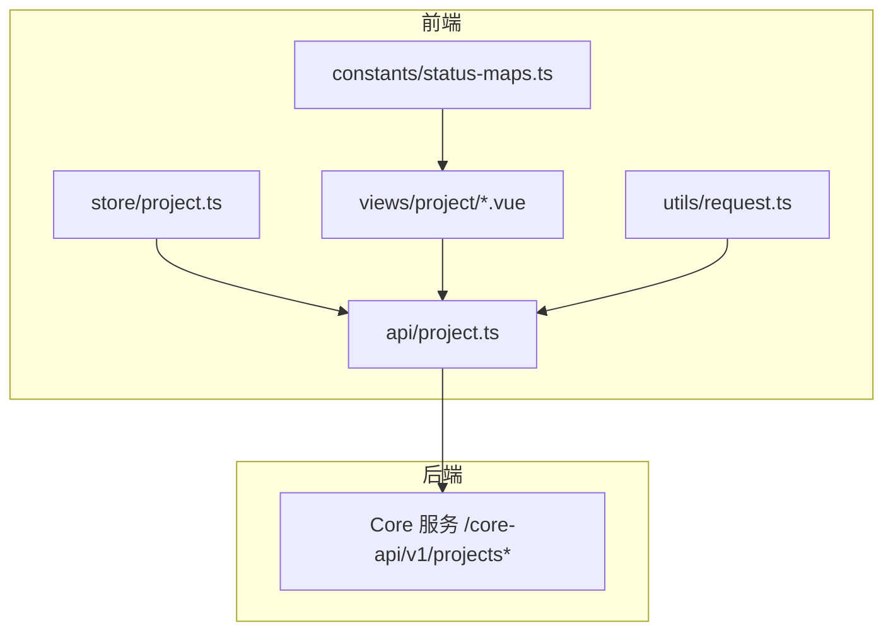
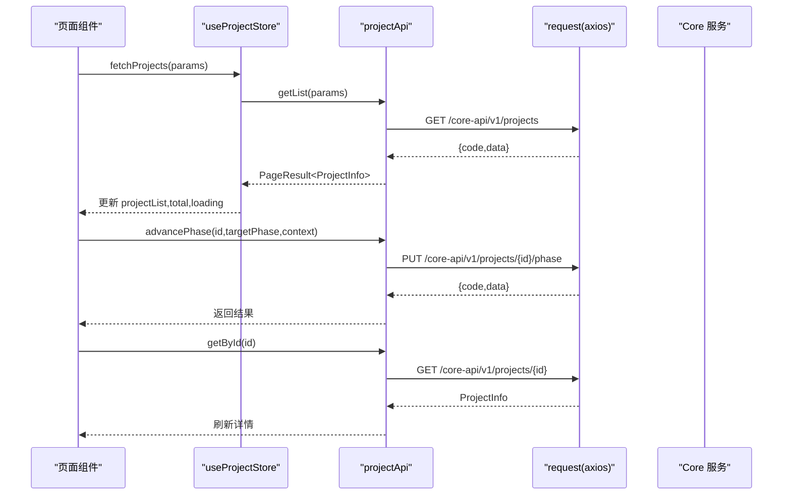
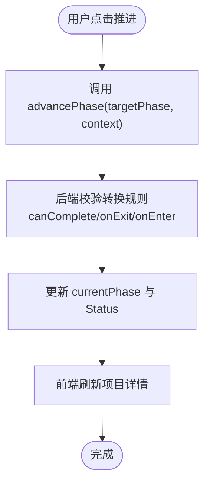
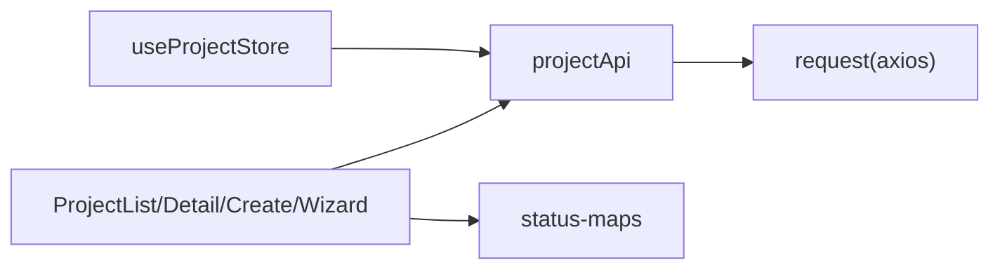

# 项目管理Store

<cite>
**本文引用的文件**   
- [ele-ai-tender-frontend/src/store/project.ts](file://ele-ai-tender-frontend/src/store/project.ts)
- [ele-ai-tender-frontend/src/types/project.ts](file://ele-ai-tender-frontend/src/types/project.ts)
- [ele-ai-tender-frontend/src/api/project.ts](file://ele-ai-tender-frontend/src/api/project.ts)
- [ele-ai-tender-frontend/src/utils/request.ts](file://ele-ai-tender-frontend/src/utils/request.ts)
- [ele-ai-tender-frontend/src/constants/status-maps.ts](file://ele-ai-tender-frontend/src/constants/status-maps.ts)
- [ele-ai-tender-frontend/src/views/project/ProjectList.vue](file://ele-ai-tender-frontend/src/views/project/ProjectList.vue)
- [ele-ai-tender-frontend/src/views/project/ProjectDetail.vue](file://ele-ai-tender-frontend/src/views/project/ProjectDetail.vue)
- [ele-ai-tender-frontend/src/views/project/ProjectCreate.vue](file://ele-ai-tender-frontend/src/views/project/ProjectCreate.vue)
- [ele-ai-tender-frontend/src/views/project/ProjectWizard.vue](file://ele-ai-tender-frontend/src/views/project/ProjectWizard.vue)
- [docs/rules/PHASE_FLOW_SPEC.md](file://docs/rules/PHASE_FLOW_SPEC.md)
</cite>

## 目录
1. [引言](#引言)
2. [项目结构](#项目结构)
3. [核心组件](#核心组件)
4. [架构总览](#架构总览)
5. [详细组件分析](#详细组件分析)
6. [依赖关系分析](#依赖关系分析)
7. [性能与内存优化](#性能与内存优化)
8. [故障排查指南](#故障排查指南)
9. [结论](#结论)
10. [附录：测试与调试建议](#附录测试与调试建议)

## 引言
本文件聚焦“项目管理Store”的前端实现，围绕项目列表管理、项目详情状态、版本控制、阶段流转等业务逻辑，系统阐述数据模型定义、CRUD操作、异步处理、错误处理策略、状态同步机制、跨组件共享与实时更新方案，并给出性能优化、内存管理与调试、测试建议。

## 项目结构
前端采用 Vue 3 + TypeScript + Pinia 的状态管理模式。项目相关代码主要分布在以下位置：
- Store: ele-ai-tender-frontend/src/store/project.ts
- 类型定义: ele-ai-tender-frontend/src/types/project.ts
- API 封装: ele-ai-tender-frontend/src/api/project.ts
- 请求拦截与错误处理: ele-ai-tender-frontend/src/utils/request.ts
- 常量映射（状态、类别、类型）: ele-ai-tender-frontend/src/constants/status-maps.ts
- 页面视图（列表、详情、创建/编辑、向导）: views/project/*
- 阶段流程规范: docs/rules/PHASE_FLOW_SPEC.md

图表来源
- [ele-ai-tender-frontend/src/store/project.ts:1-44](file://ele-ai-tender-frontend/src/store/project.ts#L1-L44)
- [ele-ai-tender-frontend/src/api/project.ts:1-59](file://ele-ai-tender-frontend/src/api/project.ts#L1-L59)
- [ele-ai-tender-frontend/src/utils/request.ts:1-80](file://ele-ai-tender-frontend/src/utils/request.ts#L1-L80)
- [ele-ai-tender-frontend/src/constants/status-maps.ts:1-33](file://ele-ai-tender-frontend/src/constants/status-maps.ts#L1-L33)

章节来源
- [ele-ai-tender-frontend/src/store/project.ts:1-44](file://ele-ai-tender-frontend/src/store/project.ts#L1-L44)
- [ele-ai-tender-frontend/src/types/project.ts:1-72](file://ele-ai-tender-frontend/src/types/project.ts#L1-L72)
- [ele-ai-tender-frontend/src/api/project.ts:1-59](file://ele-ai-tender-frontend/src/api/project.ts#L1-L59)
- [ele-ai-tender-frontend/src/utils/request.ts:1-80](file://ele-ai-tender-frontend/src/utils/request.ts#L1-L80)
- [ele-ai-tender-frontend/src/constants/status-maps.ts:1-33](file://ele-ai-tender-frontend/src/constants/status-maps.ts#L1-L33)

## 核心组件
- 项目 Store（Pinia）
  - 职责：维护当前项目、项目列表、分页总数、加载态；提供获取列表、获取详情、创建、更新、批量删除等动作。
  - 关键状态与方法见：[ele-ai-tender-frontend/src/store/project.ts:1-44](file://ele-ai-tender-frontend/src/store/project.ts#L1-L44)
- 类型定义
  - 项目信息、查询参数、创建参数、版本信息等类型见：[ele-ai-tender-frontend/src/types/project.ts:1-72](file://ele-ai-tender-frontend/src/types/project.ts#L1-L72)
- API 层
  - 统一封装项目 CRUD、版本、导出、阶段推进、AI需求生成、状态变更、取消/发布/归档、名称唯一性校验等接口见：[ele-ai-tender-frontend/src/api/project.ts:1-59](file://ele-ai-tender-frontend/src/api/project.ts#L1-L59)
- 请求拦截器
  - 统一注入 Token、业务码处理、401 登出、Blob 下载透传、全局错误提示见：[ele-ai-tender-frontend/src/utils/request.ts:1-80](file://ele-ai-tender-frontend/src/utils/request.ts#L1-L80)
- 常量映射
  - 项目状态、类别、类型映射见：[ele-ai-tender-frontend/src/constants/status-maps.ts:1-33](file://ele-ai-tender-frontend/src/constants/status-maps.ts#L1-L33)

章节来源
- [ele-ai-tender-frontend/src/store/project.ts:1-44](file://ele-ai-tender-frontend/src/store/project.ts#L1-L44)
- [ele-ai-tender-frontend/src/types/project.ts:1-72](file://ele-ai-tender-frontend/src/types/project.ts#L1-L72)
- [ele-ai-tender-frontend/src/api/project.ts:1-59](file://ele-ai-tender-frontend/src/api/project.ts#L1-L59)
- [ele-ai-tender-frontend/src/utils/request.ts:1-80](file://ele-ai-tender-frontend/src/utils/request.ts#L1-L80)
- [ele-ai-tender-frontend/src/constants/status-maps.ts:1-33](file://ele-ai-tender-frontend/src/constants/status-maps.ts#L1-L33)

## 架构总览
前端通过 Store 聚合项目领域状态，页面组件直接调用 API 或 Store 方法完成数据读写。请求层统一处理鉴权、错误与响应解包。阶段推进由前端触发，后端状态机负责阶段与状态联动。

图表来源
- [ele-ai-tender-frontend/src/store/project.ts:19-41](file://ele-ai-tender-frontend/src/store/project.ts#L19-L41)
- [ele-ai-tender-frontend/src/api/project.ts:6-31](file://ele-ai-tender-frontend/src/api/project.ts#L6-L31)
- [ele-ai-tender-frontend/src/utils/request.ts:25-76](file://ele-ai-tender-frontend/src/utils/request.ts#L25-L76)

## 详细组件分析

### 项目数据模型与验证规则
- 数据模型
  - 项目信息包含基础字段、阶段进度、模板/需求关联、匹配与上传文件ID、时间戳与创建人等，详见：[ele-ai-tender-frontend/src/types/project.ts:1-72](file://ele-ai-tender-frontend/src/types/project.ts#L1-L72)
  - 版本信息用于展示版本号、操作人与变更摘要，详见：[ele-ai-tender-frontend/src/types/project.ts:65-72](file://ele-ai-tender-frontend/src/types/project.ts#L65-L72)
- 表单验证
  - 项目编号必填且长度限制；项目名称支持异步唯一性校验；类别、类型、评审方式必填；预算金额需大于0；描述必填。详见：[ele-ai-tender-frontend/src/views/project/ProjectCreate.vue:282-332](file://ele-ai-tender-frontend/src/views/project/ProjectCreate.vue#L282-L332)
  - 唯一性校验调用：[ele-ai-tender-frontend/src/api/project.ts:52-58](file://ele-ai-tender-frontend/src/api/project.ts#L52-L58)

章节来源
- [ele-ai-tender-frontend/src/types/project.ts:1-72](file://ele-ai-tender-frontend/src/types/project.ts#L1-L72)
- [ele-ai-tender-frontend/src/views/project/ProjectCreate.vue:282-332](file://ele-ai-tender-frontend/src/views/project/ProjectCreate.vue#L282-L332)
- [ele-ai-tender-frontend/src/api/project.ts:52-58](file://ele-ai-tender-frontend/src/api/project.ts#L52-L58)

### 项目列表管理
- 功能要点
  - 筛选条件：关键词、状态、类别、类型、时间范围；分页切换自动刷新。
  - 列表渲染：编号、名称、类别、类型、预算、进度、创建时间、操作列。
  - 交互：新建跳转、查看详情、单删/批量删除、选择行。
- 数据来源
  - 列表页直接调用 API 获取数据，未使用 Store 的列表缓存。详见：[ele-ai-tender-frontend/src/views/project/ProjectList.vue:243-254](file://ele-ai-tender-frontend/src/views/project/ProjectList.vue#L243-L254)
- 与 Store 的关系
  - 当前列表页未使用 useProjectStore 的列表状态，属于“直连 API”模式；Store 提供通用能力，可按需接入。

章节来源
- [ele-ai-tender-frontend/src/views/project/ProjectList.vue:157-314](file://ele-ai-tender-frontend/src/views/project/ProjectList.vue#L157-L314)
- [ele-ai-tender-frontend/src/api/project.ts:6-21](file://ele-ai-tender-frontend/src/api/project.ts#L6-L21)
- [ele-ai-tender-frontend/src/store/project.ts:19-29](file://ele-ai-tender-frontend/src/store/project.ts#L19-L29)

### 项目详情状态与文档操作
- 详情加载
  - 进入详情页时调用 getById 拉取项目详情，失败时提示错误。详见：[ele-ai-tender-frontend/src/views/project/ProjectDetail.vue:281-290](file://ele-ai-tender-frontend/src/views/project/ProjectDetail.vue#L281-L290)
- 文档预览与导出
  - 基于 generatedFileId 进行预览与导出，导出通过 fileApi.download 获取 Blob 后触发浏览器下载。详见：[ele-ai-tender-frontend/src/views/project/ProjectDetail.vue:321-345](file://ele-ai-tender-frontend/src/views/project/ProjectDetail.vue#L321-L345)
- 状态显示与按钮可见性
  - 根据 status 计算是否可发布/归档/取消，使用常量映射展示标签。详见：[ele-ai-tender-frontend/src/views/project/ProjectDetail.vue:271-279](file://ele-ai-tender-frontend/src/views/project/ProjectDetail.vue#L271-L279), [ele-ai-tender-frontend/src/constants/status-maps.ts:1-12](file://ele-ai-tender-frontend/src/constants/status-maps.ts#L1-L12)

章节来源
- [ele-ai-tender-frontend/src/views/project/ProjectDetail.vue:281-345](file://ele-ai-tender-frontend/src/views/project/ProjectDetail.vue#L281-L345)
- [ele-ai-tender-frontend/src/constants/status-maps.ts:1-12](file://ele-ai-tender-frontend/src/constants/status-maps.ts#L1-L12)

### 版本管理
- 版本列表
  - 进入详情页时调用 getVersions 拉取版本记录，展示版本号、操作人、时间与变更摘要。详见：[ele-ai-tender-frontend/src/views/project/ProjectDetail.vue:292-298](file://ele-ai-tender-frontend/src/views/project/ProjectDetail.vue#L292-L298)
- 版本对比
  - 打开对比弹窗，具体差异展示由子组件负责。详见：[ele-ai-tender-frontend/src/views/project/ProjectDetail.vue:177-181](file://ele-ai-tender-frontend/src/views/project/ProjectDetail.vue#L177-L181)

章节来源
- [ele-ai-tender-frontend/src/views/project/ProjectDetail.vue:292-298](file://ele-ai-tender-frontend/src/views/project/ProjectDetail.vue#L292-L298)
- [ele-ai-tender-frontend/src/api/project.ts:22-24](file://ele-ai-tender-frontend/src/api/project.ts#L22-L24)

### 项目阶段流转
- 阶段推进
  - 前端通过 advancePhase 接口传入目标阶段与上下文（如检测阶段的政策文件ID），后端状态机执行阶段 onEnter/onExit、校验 canComplete、更新 currentPhase 并联动 Status。详见：[docs/rules/PHASE_FLOW_SPEC.md:72-85](file://docs/rules/PHASE_FLOW_SPEC.md#L72-L85)
- 阶段-状态联动
  - 进入 BASIC_INFO~DOCUMENT → IN_PROGRESS；进入 DETECTION → PENDING_DETECTION/DETECTING；通过后 → PUBLISHED；失败 → IN_PROGRESS 重试。详见：[docs/rules/PHASE_FLOW_SPEC.md:37-57](file://docs/rules/PHASE_FLOW_SPEC.md#L37-L57)
- 前端导航与步骤映射
  - 详情页时间线点击映射到向导步骤，URL step 与当前进度双向同步，防止越界跳转。详见：[ele-ai-tender-frontend/src/views/project/ProjectDetail.vue:300-315](file://ele-ai-tender-frontend/src/views/project/ProjectDetail.vue#L300-L315), [ele-ai-tender-frontend/src/views/project/ProjectWizard.vue:119-157](file://ele-ai-tender-frontend/src/views/project/ProjectWizard.vue#L119-L157)

图表来源
- [docs/rules/PHASE_FLOW_SPEC.md:72-85](file://docs/rules/PHASE_FLOW_SPEC.md#L72-L85)
- [ele-ai-tender-frontend/src/api/project.ts:28-31](file://ele-ai-tender-frontend/src/api/project.ts#L28-L31)
- [ele-ai-tender-frontend/src/views/project/ProjectDetail.vue:300-315](file://ele-ai-tender-frontend/src/views/project/ProjectDetail.vue#L300-L315)

### 项目创建与编辑
- 双模式创建
  - 系统生成模式：手动填写项目信息；引用模式：选择已完成的需求并预览内容，自动回填部分字段。详见：[ele-ai-tender-frontend/src/views/project/ProjectCreate.vue:19-54](file://ele-ai-tender-frontend/src/views/project/ProjectCreate.vue#L19-L54)
- 表单提交
  - 编辑模式：update；新建模式：create 成功后跳转到向导第一步。详见：[ele-ai-tender-frontend/src/views/project/ProjectCreate.vue:475-498](file://ele-ai-tender-frontend/src/views/project/ProjectCreate.vue#L475-L498)
- 名称唯一性校验
  - 异步校验项目名称是否重复，支持排除自身 ID。详见：[ele-ai-tender-frontend/src/views/project/ProjectCreate.vue:289-305](file://ele-ai-tender-frontend/src/views/project/ProjectCreate.vue#L289-L305), [ele-ai-tender-frontend/src/api/project.ts:52-58](file://ele-ai-tender-frontend/src/api/project.ts#L52-L58)

章节来源
- [ele-ai-tender-frontend/src/views/project/ProjectCreate.vue:19-54](file://ele-ai-tender-frontend/src/views/project/ProjectCreate.vue#L19-L54)
- [ele-ai-tender-frontend/src/views/project/ProjectCreate.vue:475-498](file://ele-ai-tender-frontend/src/views/project/ProjectCreate.vue#L475-L498)
- [ele-ai-tender-frontend/src/api/project.ts:52-58](file://ele-ai-tender-frontend/src/api/project.ts#L52-L58)

### 项目状态持久化与跨组件共享
- 持久化现状
  - 当前 Store 未实现本地持久化（localStorage/sessionStorage）。所有项目数据来源于后端 API。
- 跨组件共享
  - 若需要跨组件共享项目详情，可将 useProjectStore.currentProject 作为共享源，并在详情页/向导/时间线中订阅该状态，避免重复请求。
- 实时更新机制
  - 当前未引入 WebSocket/SSE。可通过轮询或事件总线在关键节点（如检测完成、文档生成完成）主动刷新详情。

章节来源
- [ele-ai-tender-frontend/src/store/project.ts:1-44](file://ele-ai-tender-frontend/src/store/project.ts#L1-L44)

### 错误处理策略
- 全局错误
  - request 拦截器统一处理业务码 401（弹出确认并登出）、网络错误提示、Blob 响应透传。详见：[ele-ai-tender-frontend/src/utils/request.ts:38-76](file://ele-ai-tender-frontend/src/utils/request.ts#L38-L76)
- 局部错误
  - 页面级 try/catch 捕获异常并提示用户，例如详情加载失败、导出失败、删除失败等。详见：[ele-ai-tender-frontend/src/views/project/ProjectDetail.vue:281-290](file://ele-ai-tender-frontend/src/views/project/ProjectDetail.vue#L281-L290), [ele-ai-tender-frontend/src/views/project/ProjectList.vue:287-312](file://ele-ai-tender-frontend/src/views/project/ProjectList.vue#L287-L312)

章节来源
- [ele-ai-tender-frontend/src/utils/request.ts:38-76](file://ele-ai-tender-frontend/src/utils/request.ts#L38-L76)
- [ele-ai-tender-frontend/src/views/project/ProjectDetail.vue:281-290](file://ele-ai-tender-frontend/src/views/project/ProjectDetail.vue#L281-L290)
- [ele-ai-tender-frontend/src/views/project/ProjectList.vue:287-312](file://ele-ai-tender-frontend/src/views/project/ProjectList.vue#L287-L312)

## 依赖关系分析
- 模块耦合
  - Store 依赖 API 层；API 层依赖 request 拦截器；页面组件依赖 API 与常量映射。
- 外部依赖
  - axios 用于 HTTP 请求；Element Plus 用于 UI 与消息提示；Vue Router 用于路由跳转。
- 潜在循环依赖
  - 前端无循环依赖风险；后端阶段触发器存在循环依赖设计约束（@Lazy），详见规范文档。

图表来源
- [ele-ai-tender-frontend/src/store/project.ts:1-44](file://ele-ai-tender-frontend/src/store/project.ts#L1-L44)
- [ele-ai-tender-frontend/src/api/project.ts:1-59](file://ele-ai-tender-frontend/src/api/project.ts#L1-L59)
- [ele-ai-tender-frontend/src/utils/request.ts:1-80](file://ele-ai-tender-frontend/src/utils/request.ts#L1-L80)
- [ele-ai-tender-frontend/src/constants/status-maps.ts:1-33](file://ele-ai-tender-frontend/src/constants/status-maps.ts#L1-L33)

章节来源
- [ele-ai-tender-frontend/src/store/project.ts:1-44](file://ele-ai-tender-frontend/src/store/project.ts#L1-L44)
- [ele-ai-tender-frontend/src/api/project.ts:1-59](file://ele-ai-tender-frontend/src/api/project.ts#L1-L59)
- [ele-ai-tender-frontend/src/utils/request.ts:1-80](file://ele-ai-tender-frontend/src/utils/request.ts#L1-L80)
- [ele-ai-tender-frontend/src/constants/status-maps.ts:1-33](file://ele-ai-tender-frontend/src/constants/status-maps.ts#L1-L33)

## 性能与内存优化
- 列表分页与按需加载
  - 列表页已实现分页，避免一次性加载全部数据。建议在大数据量场景下启用虚拟滚动。
- 减少重复请求
  - 将 useProjectStore.currentProject 作为共享源，详情页与向导共用同一份数据，避免多次 getById。
- 防抖与节流
  - 搜索框输入可加防抖；导出大文件前增加节流，避免重复点击。
- 资源释放
  - 导出完成后及时 revokeObjectURL，避免内存泄漏。详见：[ele-ai-tender-frontend/src/views/project/ProjectDetail.vue:331-339](file://ele-ai-tender-frontend/src/views/project/ProjectDetail.vue#L331-L339)
- 懒加载与路由级拆分
  - 对非首屏组件（版本对比、文档预览）保持按需加载，降低首屏体积。

章节来源
- [ele-ai-tender-frontend/src/views/project/ProjectDetail.vue:321-345](file://ele-ai-tender-frontend/src/views/project/ProjectDetail.vue#L321-L345)

## 故障排查指南
- 401 未授权
  - 检查 request 拦截器是否成功注入 Authorization；确认 token 是否过期；查看是否触发登出逻辑。详见：[ele-ai-tender-frontend/src/utils/request.ts:48-66](file://ele-ai-tender-frontend/src/utils/request.ts#L48-L66)
- 阶段推进失败
  - 检查 targetPhase 是否为下一阶段；确认 canComplete 条件满足；查看后端日志与 PhaseFlowController 流程。详见：[docs/rules/PHASE_FLOW_SPEC.md:72-85](file://docs/rules/PHASE_FLOW_SPEC.md#L72-L85)
- 需求内容为空
  - 检查 requirementId 是否存在；若无则关注 AI 任务结果同步；确认 project.requirementContent 是否被写入。详见：[docs/rules/PHASE_FLOW_SPEC.md:87-132](file://docs/rules/PHASE_FLOW_SPEC.md#L87-L132)
- 导出失败
  - 检查 generatedFileId 是否存在；确认 fileApi.download 返回 Blob；查看网络与权限。详见：[ele-ai-tender-frontend/src/views/project/ProjectDetail.vue:321-345](file://ele-ai-tender-frontend/src/views/project/ProjectDetail.vue#L321-L345)

章节来源
- [ele-ai-tender-frontend/src/utils/request.ts:48-66](file://ele-ai-tender-frontend/src/utils/request.ts#L48-L66)
- [docs/rules/PHASE_FLOW_SPEC.md:72-132](file://docs/rules/PHASE_FLOW_SPEC.md#L72-L132)
- [ele-ai-tender-frontend/src/views/project/ProjectDetail.vue:321-345](file://ele-ai-tender-frontend/src/views/project/ProjectDetail.vue#L321-L345)

## 结论
本项目在前端实现了清晰的项目数据模型与 API 封装，结合 Pinia Store 提供了可扩展的状态管理能力。当前列表页采用直连 API 的方式，Store 可作为未来跨组件共享与持久化的统一入口。阶段流转由后端状态机保障一致性，前端通过 advancePhase 与 URL step 同步实现良好用户体验。后续可在 Store 中补充持久化、实时更新与更完善的缓存策略，进一步提升性能与可维护性。

## 附录：测试与调试建议
- 单元测试
  - 对 Store actions 进行 Mock API 的单元测试，覆盖成功/失败路径与 loading 状态。
  - 对表单验证规则编写用例，包括必填、长度、数值范围与唯一性校验。
- 集成测试
  - 模拟网络异常与 401 场景，验证全局错误处理与登出流程。
  - 模拟阶段推进不同分支，验证前端导航与状态刷新。
- 调试技巧
  - 使用浏览器 Network 面板观察请求与响应；在 request 拦截器处断点定位错误。
  - 在详情页与向导中打印 currentPhase 与 status，确保前后端一致。