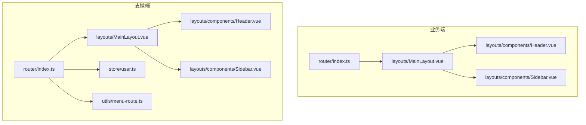
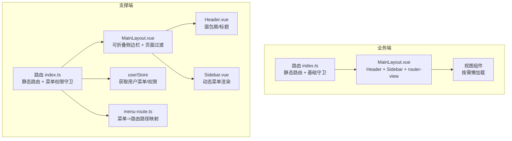
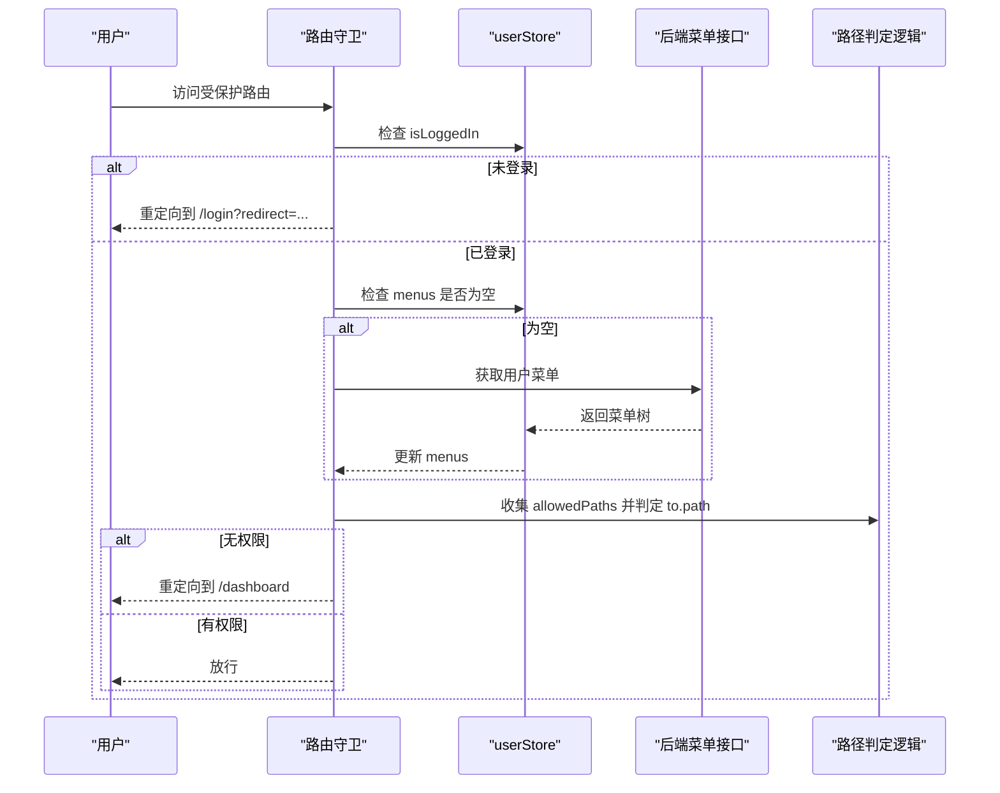
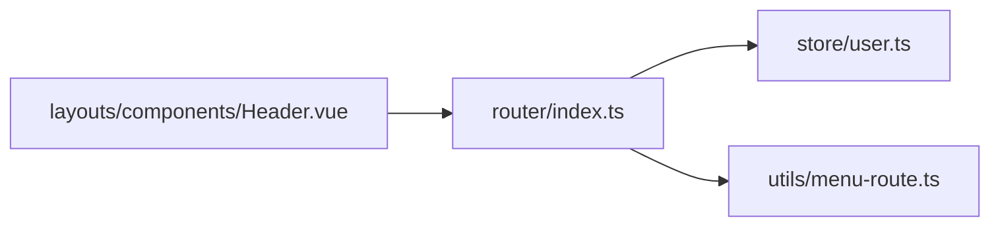

# 路由系统设计

<cite>
**本文引用的文件列表**
- [ele-ai-tender-frontend/src/router/index.ts](file://ele-ai-tender-frontend/src/router/index.ts)
- [ele-ai-tender-support-frontend/src/router/index.ts](file://ele-ai-tender-support-frontend/src/router/index.ts)
- [ele-ai-tender-frontend/src/layouts/MainLayout.vue](file://ele-ai-tender-frontend/src/layouts/MainLayout.vue)
- [ele-ai-tender-support-frontend/src/layouts/MainLayout.vue](file://ele-ai-tender-support-frontend/src/layouts/MainLayout.vue)
- [ele-ai-tender-frontend/src/layouts/components/Sidebar.vue](file://ele-ai-tender-frontend/src/layouts/components/Sidebar.vue)
- [ele-ai-tender-support-frontend/src/layouts/components/Sidebar.vue](file://ele-ai-tender-support-frontend/src/layouts/components/Sidebar.vue)
- [ele-ai-tender-frontend/src/layouts/components/Header.vue](file://ele-ai-tender-frontend/src/layouts/components/Header.vue)
- [ele-ai-tender-support-frontend/src/layouts/components/Header.vue](file://ele-ai-tender-support-frontend/src/layouts/components/Header.vue)
- [ele-ai-tender-support-frontend/src/utils/menu-route.ts](file://ele-ai-tender-support-frontend/src/utils/menu-route.ts)
- [ele-ai-tender-support-frontend/src/store/user.ts](file://ele-ai-tender-support-frontend/src/store/user.ts)
- [ele-ai-tender-frontend/src/store/user.ts](file://ele-ai-tender-frontend/src/store/user.ts)
</cite>

## 目录
1. [引言](#引言)
2. [项目结构](#项目结构)
3. [核心组件](#核心组件)
4. [架构总览](#架构总览)
5. [详细组件分析](#详细组件分析)
6. [依赖关系分析](#依赖关系分析)
7. [性能与优化](#性能与优化)
8. [故障排查指南](#故障排查指南)
9. [结论](#结论)
10. [附录](#附录)

## 引言
本文件聚焦于前端路由系统的设计与实现，覆盖两个前端应用：
- 业务端（ele-ai-tender-frontend）：面向招标文档编制场景，采用静态路由表 + 基础鉴权守卫。
- 支撑端（ele-ai-tender-support-frontend）：面向运营与系统管理，采用静态路由 + 动态权限控制（基于用户菜单），并内置面包屑导航、页面过渡动画等高级特性。

目标包括：
- 深入解析路由表配置、嵌套路由结构与动态路由生成机制
- 说明路由守卫与权限控制策略
- 详解主布局 MainLayout 设计模式及侧边栏 Sidebar、头部 Header 的组件化实现
- 解释路由元信息 meta 的使用、面包屑导航的实现方式
- 提供懒加载、缓存策略、过渡动画等高级特性的实践建议
- 给出调试技巧、性能优化与最佳实践

## 项目结构
两个前端应用的路由与布局组织清晰，遵循“路由集中配置 + 布局组件复用”的模式：
- 路由定义位于 src/router/index.ts
- 布局组件位于 src/layouts/，包含 MainLayout.vue 及其子组件 Header.vue、Sidebar.vue
- 支撑端额外提供菜单到路由路径映射工具 utils/menu-route.ts 以及用户状态 store/user.ts

图表来源
- [ele-ai-tender-frontend/src/router/index.ts:1-132](file://ele-ai-tender-frontend/src/router/index.ts#L1-L132)
- [ele-ai-tender-support-frontend/src/router/index.ts:1-219](file://ele-ai-tender-support-frontend/src/router/index.ts#L1-L219)
- [ele-ai-tender-frontend/src/layouts/MainLayout.vue:1-45](file://ele-ai-tender-frontend/src/layouts/MainLayout.vue#L1-L45)
- [ele-ai-tender-support-frontend/src/layouts/MainLayout.vue:1-138](file://ele-ai-tender-support-frontend/src/layouts/MainLayout.vue#L1-L138)
- [ele-ai-tender-support-frontend/src/utils/menu-route.ts:1-47](file://ele-ai-tender-support-frontend/src/utils/menu-route.ts#L1-L47)
- [ele-ai-tender-support-frontend/src/store/user.ts:1-122](file://ele-ai-tender-support-frontend/src/store/user.ts#L1-L122)

章节来源
- [ele-ai-tender-frontend/src/router/index.ts:1-132](file://ele-ai-tender-frontend/src/router/index.ts#L1-L132)
- [ele-ai-tender-support-frontend/src/router/index.ts:1-219](file://ele-ai-tender-support-frontend/src/router/index.ts#L1-L219)

## 核心组件
- 路由入口与守卫
  - 业务端：使用 createRouter + createWebHistory，定义静态路由表，并在 beforeEach 中根据 token 进行登录态校验与跳转。
  - 支撑端：在静态路由基础上，结合 userStore 的用户菜单数据，计算允许访问的路径集合，实现细粒度权限控制；同时处理白名单与未登录重定向。
- 主布局 MainLayout
  - 业务端：基于 Element Plus 容器组合 Header、Sidebar 与 router-view。
  - 支撑端：支持侧边栏折叠与移动端抽屉式菜单，包裹 router-view 并使用 transition 实现页面切换动画。
- 侧边栏 Sidebar
  - 业务端：静态菜单项，绑定当前路由高亮，消息中心带未读角标轮询刷新。
  - 支撑端：根据用户菜单渲染多级菜单，支持折叠与唯一展开，自动匹配当前激活项。
- 头部 Header
  - 业务端：展示标题、主题切换、用户下拉菜单（修改密码、退出）。
  - 支撑端：除用户操作外，还通过 route.matched 计算面包屑与完整路径标签，显示当前页层级。

章节来源
- [ele-ai-tender-frontend/src/router/index.ts:112-132](file://ele-ai-tender-frontend/src/router/index.ts#L112-L132)
- [ele-ai-tender-support-frontend/src/router/index.ts:136-219](file://ele-ai-tender-support-frontend/src/router/index.ts#L136-L219)
- [ele-ai-tender-frontend/src/layouts/MainLayout.vue:1-45](file://ele-ai-tender-frontend/src/layouts/MainLayout.vue#L1-L45)
- [ele-ai-tender-support-frontend/src/layouts/MainLayout.vue:1-138](file://ele-ai-tender-support-frontend/src/layouts/MainLayout.vue#L1-L138)
- [ele-ai-tender-frontend/src/layouts/components/Sidebar.vue:1-96](file://ele-ai-tender-frontend/src/layouts/components/Sidebar.vue#L1-L96)
- [ele-ai-tender-support-frontend/src/layouts/components/Sidebar.vue:1-164](file://ele-ai-tender-support-frontend/src/layouts/components/Sidebar.vue#L1-L164)
- [ele-ai-tender-frontend/src/layouts/components/Header.vue:1-161](file://ele-ai-tender-frontend/src/layouts/components/Header.vue#L1-L161)
- [ele-ai-tender-support-frontend/src/layouts/components/Header.vue:1-235](file://ele-ai-tender-support-frontend/src/layouts/components/Header.vue#L1-L235)

## 架构总览
下图展示了两个前端应用的路由与布局交互关系，以及支撑端的权限控制流程。

图表来源
- [ele-ai-tender-frontend/src/router/index.ts:1-132](file://ele-ai-tender-frontend/src/router/index.ts#L1-L132)
- [ele-ai-tender-support-frontend/src/router/index.ts:1-219](file://ele-ai-tender-support-frontend/src/router/index.ts#L1-L219)
- [ele-ai-tender-support-frontend/src/store/user.ts:1-122](file://ele-ai-tender-support-frontend/src/store/user.ts#L1-L122)
- [ele-ai-tender-support-frontend/src/utils/menu-route.ts:1-47](file://ele-ai-tender-support-frontend/src/utils/menu-route.ts#L1-L47)
- [ele-ai-tender-support-frontend/src/layouts/MainLayout.vue:1-138](file://ele-ai-tender-support-frontend/src/layouts/MainLayout.vue#L1-L138)
- [ele-ai-tender-support-frontend/src/layouts/components/Header.vue:1-235](file://ele-ai-tender-support-frontend/src/layouts/components/Header.vue#L1-L235)
- [ele-ai-tender-support-frontend/src/layouts/components/Sidebar.vue:1-164](file://ele-ai-tender-support-frontend/src/layouts/components/Sidebar.vue#L1-L164)

## 详细组件分析

### 路由表与嵌套路由
- 业务端
  - 根路由 / 指向 MainLayout，并重定向至 /dashboard
  - 子路由按功能域划分：首页、需求管理、项目管理、政策文件、消息中心等
  - 动态路由参数示例：requirement/edit/:id、project/:id/wizard 等
  - 所有子路由均使用函数式 import 实现懒加载
- 支撑端
  - 根路由 / 指向 MainLayout，并重定向至 /dashboard
  - 子路由涵盖系统管理、接入系统、版本管理、模板与知识库、统计分析、模型路由等
  - 提供 404 兜底路由，匹配任意未命中路径
  - 同样采用函数式 import 懒加载

章节来源
- [ele-ai-tender-frontend/src/router/index.ts:6-110](file://ele-ai-tender-frontend/src/router/index.ts#L6-L110)
- [ele-ai-tender-support-frontend/src/router/index.ts:7-134](file://ele-ai-tender-support-frontend/src/router/index.ts#L7-L134)

### 动态路由生成与权限控制（支撑端）
支撑端通过“用户菜单 -> 允许路径集合 -> 路由守卫校验”的方式实现动态权限控制：
- 用户登录后，若尚未拉取菜单，则在进入受保护路由前调用接口获取用户菜单
- 将菜单树递归收集为 allowedPaths 集合，并对路径进行标准化与兼容映射
- 对请求路径进行归一化后，判断是否等于或属于某个允许路径的前缀
- 未授权时重定向至首页；已登录访问登录页则重定向至首页

图表来源
- [ele-ai-tender-support-frontend/src/router/index.ts:175-219](file://ele-ai-tender-support-frontend/src/router/index.ts#L175-L219)
- [ele-ai-tender-support-frontend/src/store/user.ts:66-90](file://ele-ai-tender-support-frontend/src/store/user.ts#L66-L90)
- [ele-ai-tender-support-frontend/src/utils/menu-route.ts:28-47](file://ele-ai-tender-support-frontend/src/utils/menu-route.ts#L28-L47)

章节来源
- [ele-ai-tender-support-frontend/src/router/index.ts:141-219](file://ele-ai-tender-support-frontend/src/router/index.ts#L141-L219)
- [ele-ai-tender-support-frontend/src/store/user.ts:66-122](file://ele-ai-tender-support-frontend/src/store/user.ts#L66-L122)
- [ele-ai-tender-support-frontend/src/utils/menu-route.ts:1-47](file://ele-ai-tender-support-frontend/src/utils/menu-route.ts#L1-L47)

### 路由守卫与元信息
- 业务端
  - 使用 meta.guest 标识仅游客可访问的路由（如登录页）
  - 使用 meta.requiresAuth 标识需要登录的路由
  - 在 beforeEach 中设置 document.title，并根据 token 与 meta 进行跳转
- 支撑端
  - 使用 meta.requiresAuth !== false 作为默认受保护策略
  - 维护白名单路径集合，避免重复鉴权
  - 在守卫中统一设置页面标题后缀

章节来源
- [ele-ai-tender-frontend/src/router/index.ts:117-129](file://ele-ai-tender-frontend/src/router/index.ts#L117-L129)
- [ele-ai-tender-support-frontend/src/router/index.ts:175-219](file://ele-ai-tender-support-frontend/src/router/index.ts#L175-L219)

### 主布局 MainLayout 设计模式
- 业务端
  - 使用 el-container/el-header/el-aside/el-main 构建经典三栏布局
  - 顶部 Header、左侧 Sidebar、右侧内容区 router-view
- 支撑端
  - 自定义布局结构，支持侧边栏折叠与移动端抽屉式菜单
  - 使用 v-slot="{ Component }" 包裹 <transition> 实现页面切换淡入淡出动画
  - 通过事件向 Header 传递折叠/移动端开关状态

章节来源
- [ele-ai-tender-frontend/src/layouts/MainLayout.vue:1-45](file://ele-ai-tender-frontend/src/layouts/MainLayout.vue#L1-L45)
- [ele-ai-tender-support-frontend/src/layouts/MainLayout.vue:1-138](file://ele-ai-tender-support-frontend/src/layouts/MainLayout.vue#L1-L138)

### 侧边栏 Sidebar 组件化实现
- 业务端
  - 静态菜单项，使用 router 属性驱动路由跳转
  - 消息中心带未读角标，定时轮询刷新
- 支撑端
  - 根据 userStore.menus 动态渲染一级分组与二级子项
  - 使用 resolveMenuRoutePath 将菜单项转换为路由路径
  - 支持唯一展开、折叠状态、点击关闭移动端菜单

章节来源
- [ele-ai-tender-frontend/src/layouts/components/Sidebar.vue:1-96](file://ele-ai-tender-frontend/src/layouts/components/Sidebar.vue#L1-L96)
- [ele-ai-tender-support-frontend/src/layouts/components/Sidebar.vue:1-164](file://ele-ai-tender-support-frontend/src/layouts/components/Sidebar.vue#L1-L164)
- [ele-ai-tender-support-frontend/src/utils/menu-route.ts:34-47](file://ele-ai-tender-support-frontend/src/utils/menu-route.ts#L34-L47)

### 头部 Header 与面包屑导航
- 业务端
  - 展示系统标题、主题切换、用户下拉菜单（修改密码、退出）
- 支撑端
  - 通过 computed 从 route.matched 提取面包屑条目，过滤根路径
  - 计算当前标题与完整路径标签，用于头部展示
  - 提供折叠按钮与移动端菜单开关

章节来源
- [ele-ai-tender-frontend/src/layouts/components/Header.vue:1-161](file://ele-ai-tender-frontend/src/layouts/components/Header.vue#L1-L161)
- [ele-ai-tender-support-frontend/src/layouts/components/Header.vue:85-96](file://ele-ai-tender-support-frontend/src/layouts/components/Header.vue#L85-L96)

### 权限控制与路由元信息
- 业务端
  - 基于 token 的基础鉴权，meta.guest 与 meta.requiresAuth 控制访问
- 支撑端
  - 基于用户菜单的细粒度权限控制，支持路径前缀匹配与历史路径兼容映射
  - 支持权限标识提取与 hasPermission 方法，便于后续按钮级权限控制

章节来源
- [ele-ai-tender-frontend/src/router/index.ts:117-129](file://ele-ai-tender-frontend/src/router/index.ts#L117-L129)
- [ele-ai-tender-support-frontend/src/router/index.ts:141-219](file://ele-ai-tender-support-frontend/src/router/index.ts#L141-L219)
- [ele-ai-tender-support-frontend/src/store/user.ts:76-95](file://ele-ai-tender-support-frontend/src/store/user.ts#L76-L95)

### 路由懒加载与过渡动画
- 懒加载
  - 两个应用均在路由定义中使用函数式 import 实现组件懒加载
- 过渡动画
  - 支撑端在 MainLayout 中使用 <transition name="page-fade" mode="out-in"> 包裹 router-view，实现页面切换淡入淡出效果

章节来源
- [ele-ai-tender-frontend/src/router/index.ts:20-108](file://ele-ai-tender-frontend/src/router/index.ts#L20-L108)
- [ele-ai-tender-support-frontend/src/router/index.ts:18-126](file://ele-ai-tender-support-frontend/src/router/index.ts#L18-L126)
- [ele-ai-tender-support-frontend/src/layouts/MainLayout.vue:18-22](file://ele-ai-tender-support-frontend/src/layouts/MainLayout.vue#L18-L22)

### 缓存策略与高级特性建议
- 页面缓存
  - 可在 MainLayout 中对 router-view 使用 <keep-alive> 包裹，并结合 include/exclude 精确控制缓存范围
- 路由级缓存
  - 针对大表单或复杂页面，可使用 keep-alive 配合生命周期钩子减少重复初始化成本
- 预加载与分包
  - 保持现有函数式 import 的同时，可按模块进一步拆分路由，提升首屏加载速度
- 错误边界与兜底
  - 支撑端已提供 404 路由，建议在大型应用中增加全局错误捕获与友好提示

[本节为通用建议，不直接分析具体文件]

## 依赖关系分析
- 支撑端路由与 store、工具函数的耦合关系如下：
  - 路由守卫依赖 userStore 的用户信息与菜单数据
  - 菜单到路由路径的转换依赖 menu-route.ts 的映射规则
  - Header 依赖 route.matched 计算面包屑

图表来源
- [ele-ai-tender-support-frontend/src/router/index.ts:175-219](file://ele-ai-tender-support-frontend/src/router/index.ts#L175-L219)
- [ele-ai-tender-support-frontend/src/store/user.ts:66-90](file://ele-ai-tender-support-frontend/src/store/user.ts#L66-L90)
- [ele-ai-tender-support-frontend/src/utils/menu-route.ts:28-47](file://ele-ai-tender-support-frontend/src/utils/menu-route.ts#L28-L47)
- [ele-ai-tender-support-frontend/src/layouts/components/Header.vue:85-96](file://ele-ai-tender-support-frontend/src/layouts/components/Header.vue#L85-L96)

章节来源
- [ele-ai-tender-support-frontend/src/router/index.ts:136-219](file://ele-ai-tender-support-frontend/src/router/index.ts#L136-L219)
- [ele-ai-tender-support-frontend/src/store/user.ts:1-122](file://ele-ai-tender-support-frontend/src/store/user.ts#L1-L122)
- [ele-ai-tender-support-frontend/src/utils/menu-route.ts:1-47](file://ele-ai-tender-support-frontend/src/utils/menu-route.ts#L1-L47)

## 性能与优化
- 路由懒加载
  - 现状：已在路由定义中使用函数式 import，有效降低初始包体
  - 建议：对超大页面进一步拆分为子模块，结合路由分块命名
- 菜单权限计算
  - 现状：每次进入受保护路由时可能触发菜单拉取与路径集合构建
  - 建议：在首次登录后缓存 allowedPaths，仅在菜单变化时重建
- 侧边栏轮询
  - 现状：消息中心每 30 秒轮询未读数
  - 建议：在不可见页面时暂停轮询，恢复可见时再启动，降低无效请求
- 过渡动画
  - 现状：支撑端使用淡入淡出过渡
  - 建议：对复杂页面可考虑更轻量的过渡或禁用动画以提升流畅度

[本节为通用建议，不直接分析具体文件]

## 故障排查指南
- 无法进入受保护页面
  - 检查路由 meta.requiresAuth 是否正确设置
  - 检查用户登录态与 token 是否持久化成功
  - 支撑端需确认用户菜单是否拉取成功且 allowedPaths 包含目标路径
- 面包屑显示异常
  - 检查 route.matched 中对应路由是否设置了 meta.title
  - 确保根路径被正确过滤
- 404 页面频繁出现
  - 检查是否存在未注册的路由或路径拼写错误
  - 确认动态参数 :id 是否与视图组件期望一致
- 侧边栏高亮不正确
  - 检查 default-active 绑定的是否为当前 route.path
  - 支撑端需确认 resolveMenuRoutePath 映射是否正确

章节来源
- [ele-ai-tender-frontend/src/router/index.ts:117-129](file://ele-ai-tender-frontend/src/router/index.ts#L117-L129)
- [ele-ai-tender-support-frontend/src/router/index.ts:175-219](file://ele-ai-tender-support-frontend/src/router/index.ts#L175-L219)
- [ele-ai-tender-support-frontend/src/layouts/components/Header.vue:85-96](file://ele-ai-tender-support-frontend/src/layouts/components/Header.vue#L85-L96)
- [ele-ai-tender-support-frontend/src/utils/menu-route.ts:28-47](file://ele-ai-tender-support-frontend/src/utils/menu-route.ts#L28-L47)

## 结论
本项目在前端路由设计上兼顾了简洁与扩展性：
- 业务端以静态路由为主，快速落地核心功能
- 支撑端引入基于用户菜单的动态权限控制，具备更强的可配置性与安全性
- 布局组件化程度高，支持响应式与过渡动画，用户体验良好
- 通过 meta 元信息与面包屑导航，提升了导航清晰度与可维护性

未来可进一步优化缓存策略、预加载与错误边界，持续提升性能与健壮性。

## 附录
- 关键实现位置参考
  - 路由定义与懒加载：[ele-ai-tender-frontend/src/router/index.ts](file://ele-ai-tender-frontend/src/router/index.ts)、[ele-ai-tender-support-frontend/src/router/index.ts](file://ele-ai-tender-support-frontend/src/router/index.ts)
  - 路由守卫与权限控制：[ele-ai-tender-frontend/src/router/index.ts](file://ele-ai-tender-frontend/src/router/index.ts)、[ele-ai-tender-support-frontend/src/router/index.ts](file://ele-ai-tender-support-frontend/src/router/index.ts)
  - 主布局与过渡动画：[ele-ai-tender-support-frontend/src/layouts/MainLayout.vue](file://ele-ai-tender-support-frontend/src/layouts/MainLayout.vue)
  - 侧边栏与消息角标：[ele-ai-tender-frontend/src/layouts/components/Sidebar.vue](file://ele-ai-tender-frontend/src/layouts/components/Sidebar.vue)、[ele-ai-tender-support-frontend/src/layouts/components/Sidebar.vue](file://ele-ai-tender-support-frontend/src/layouts/components/Sidebar.vue)
  - 头部与面包屑：[ele-ai-tender-support-frontend/src/layouts/components/Header.vue](file://ele-ai-tender-support-frontend/src/layouts/components/Header.vue)
  - 菜单到路由映射：[ele-ai-tender-support-frontend/src/utils/menu-route.ts](file://ele-ai-tender-support-frontend/src/utils/menu-route.ts)
  - 用户状态与权限：[ele-ai-tender-support-frontend/src/store/user.ts](file://ele-ai-tender-support-frontend/src/store/user.ts)、[ele-ai-tender-frontend/src/store/user.ts](file://ele-ai-tender-frontend/src/store/user.ts)