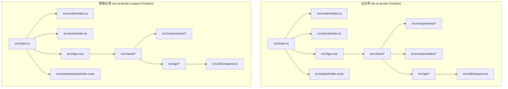
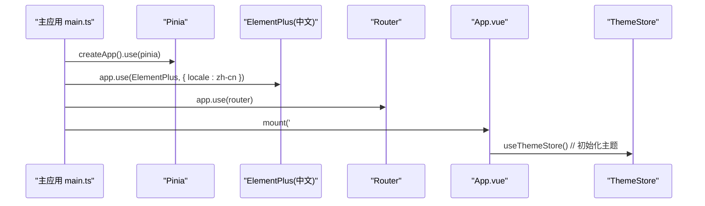
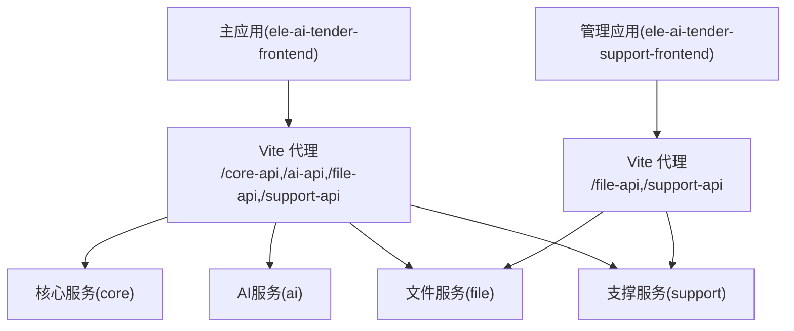
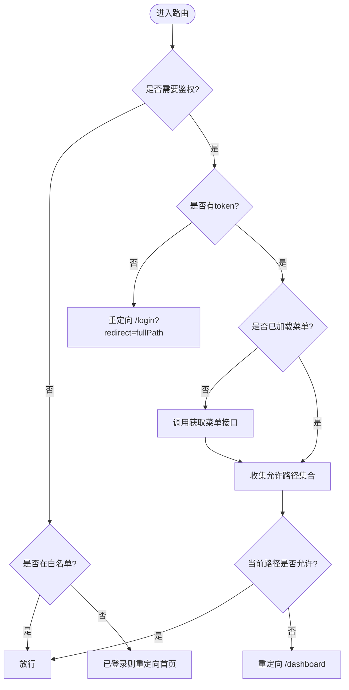
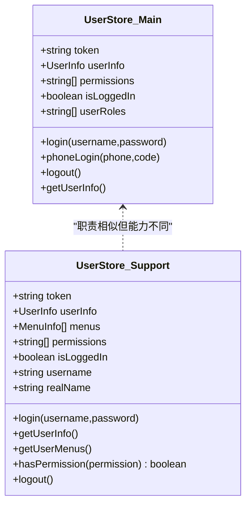
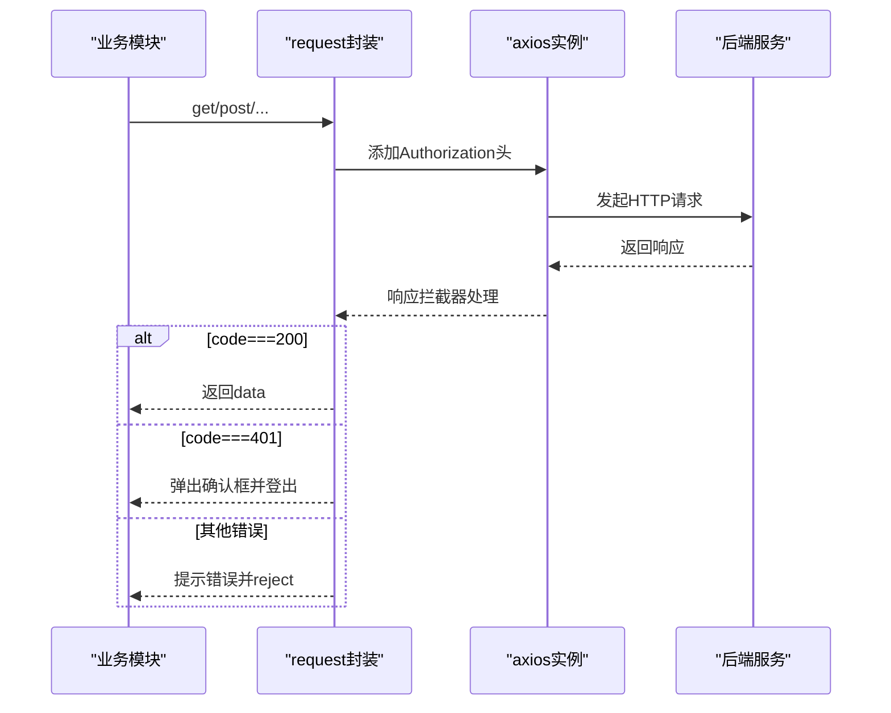
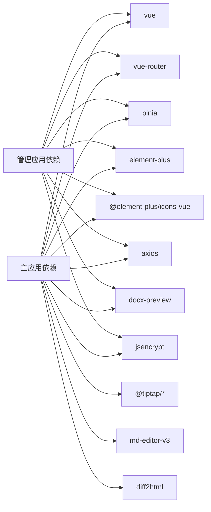

# 前端应用

<cite>
**本文引用的文件**   
- [ele-ai-tender-frontend/package.json](file://ele-ai-tender-frontend/package.json)
- [ele-ai-tender-support-frontend/package.json](file://ele-ai-tender-support-frontend/package.json)
- [ele-ai-tender-frontend/src/main.ts](file://ele-ai-tender-frontend/src/main.ts)
- [ele-ai-tender-support-frontend/src/main.ts](file://ele-ai-tender-support-frontend/src/main.ts)
- [ele-ai-tender-frontend/vite.config.ts](file://ele-ai-tender-frontend/vite.config.ts)
- [ele-ai-tender-support-frontend/vite.config.ts](file://ele-ai-tender-support-frontend/vite.config.ts)
- [ele-ai-tender-frontend/src/router/index.ts](file://ele-ai-tender-frontend/src/router/index.ts)
- [ele-ai-tender-support-frontend/src/router/index.ts](file://ele-ai-tender-support-frontend/src/router/index.ts)
- [ele-ai-tender-frontend/src/store/index.ts](file://ele-ai-tender-frontend/src/store/index.ts)
- [ele-ai-tender-support-frontend/src/store/index.ts](file://ele-ai-tender-support-frontend/src/store/index.ts)
- [ele-ai-tender-frontend/src/utils/request.ts](file://ele-ai-tender-frontend/src/utils/request.ts)
- [ele-ai-tender-support-frontend/src/utils/request.ts](file://ele-ai-tender-support-frontend/src/utils/request.ts)
- [ele-ai-tender-frontend/src/store/user.ts](file://ele-ai-tender-frontend/src/store/user.ts)
- [ele-ai-tender-support-frontend/src/store/user.ts](file://ele-ai-tender-support-frontend/src/store/user.ts)
- [ele-ai-tender-frontend/src/App.vue](file://ele-ai-tender-frontend/src/App.vue)
- [ele-ai-tender-support-frontend/src/App.vue](file://ele-ai-tender-support-frontend/src/App.vue)
</cite>

## 目录
1. [简介](#简介)
2. [项目结构](#项目结构)
3. [核心组件](#核心组件)
4. [架构总览](#架构总览)
5. [详细组件分析](#详细组件分析)
6. [依赖分析](#依赖分析)
7. [性能考虑](#性能考虑)
8. [故障排查指南](#故障排查指南)
9. [结论](#结论)
10. [附录](#附录)

## 简介
本文件为“招标文件AI编制系统”的前端应用文档，覆盖两个独立的前端工程：
- 主应用 ele-ai-tender-frontend：面向用户的业务界面，基于 Vue 3 + TypeScript + Vite 构建，集成 Element Plus、Pinia、Vue Router。
- 管理应用 ele-ai-tender-support-frontend：面向管理员的后台系统，同样采用 Vue 3 + TypeScript + Vite 技术栈，提供动态菜单与权限控制。

文档将深入解析组件化架构、状态管理（Pinia）、路由配置、API 封装、样式体系、国际化与主题切换、构建优化、代码规范、调试技巧与性能策略等关键实现。

## 项目结构
两个前端工程遵循一致的现代前端工程化结构：
- src/api：按领域划分的接口模块
- src/components：可复用业务/通用组件
- src/composables：组合式函数（仅主应用）
- src/layouts：布局容器（Header/Sidebar/MainLayout）
- src/router：路由定义与守卫
- src/store：Pinia 状态管理
- src/styles：全局样式与变量
- src/types：TypeScript 类型定义
- src/utils：工具函数（请求封装、加密、存储等）
- src/views：页面级视图
- vite.config.ts：Vite 构建与开发服务器配置
- package.json：依赖与脚本

图表来源
- [ele-ai-tender-frontend/src/main.ts:1-15](file://ele-ai-tender-frontend/src/main.ts#L1-L15)
- [ele-ai-tender-support-frontend/src/main.ts:1-25](file://ele-ai-tender-support-frontend/src/main.ts#L1-L25)

章节来源
- [ele-ai-tender-frontend/package.json:1-49](file://ele-ai-tender-frontend/package.json#L1-L49)
- [ele-ai-tender-support-frontend/package.json:1-35](file://ele-ai-tender-support-frontend/package.json#L1-L35)

## 核心组件
本节聚焦两个应用的启动入口、插件注册、路由与状态初始化流程。

- 主应用启动流程
  - 创建 Vue 应用实例
  - 注册 Pinia、Element Plus（中文语言包）、Router
  - 挂载到 #app
  - App.vue 中初始化主题 store，确保主题 watch 生效

- 管理应用启动流程
  - 创建 Vue 应用实例
  - 全局注册 Element Plus 图标
  - 注册 Element Plus（中文语言包）、Router、Pinia
  - 挂载到 #app

图表来源
- [ele-ai-tender-frontend/src/main.ts:1-15](file://ele-ai-tender-frontend/src/main.ts#L1-L15)
- [ele-ai-tender-frontend/src/App.vue:1-11](file://ele-ai-tender-frontend/src/App.vue#L1-L11)

章节来源
- [ele-ai-tender-frontend/src/main.ts:1-15](file://ele-ai-tender-frontend/src/main.ts#L1-L15)
- [ele-ai-tender-support-frontend/src/main.ts:1-25](file://ele-ai-tender-support-frontend/src/main.ts#L1-L25)
- [ele-ai-tender-frontend/src/App.vue:1-11](file://ele-ai-tender-frontend/src/App.vue#L1-L11)

## 架构总览
整体架构采用前后端分离模式，前端通过 Vite 代理在开发环境转发至各后端服务；生产环境由 Nginx 或网关统一分发。

图表来源
- [ele-ai-tender-frontend/vite.config.ts:60-106](file://ele-ai-tender-frontend/vite.config.ts#L60-L106)
- [ele-ai-tender-support-frontend/vite.config.ts:24-75](file://ele-ai-tender-support-frontend/vite.config.ts#L24-L75)

## 详细组件分析

### 路由与鉴权
- 主应用路由
  - 静态路由：登录页、主布局及子路由（首页、需求、项目、政策文件、消息中心）
  - 路由守卫：根据 meta.requiresAuth/guest 与本地 token 进行跳转控制
  - 动态标题：根据 to.meta.title 设置 document.title

- 管理应用路由
  - 静态路由：登录、404、主布局及子路由（系统管理、模板、知识库、模型配置、版本、统计等）
  - 动态菜单与权限：登录后拉取用户菜单，计算允许访问路径集合，未授权时重定向至首页
  - 白名单：/login、/404 不校验权限

图表来源
- [ele-ai-tender-frontend/src/router/index.ts:1-132](file://ele-ai-tender-frontend/src/router/index.ts#L1-L132)
- [ele-ai-tender-support-frontend/src/router/index.ts:1-219](file://ele-ai-tender-support-frontend/src/router/index.ts#L1-L219)

章节来源
- [ele-ai-tender-frontend/src/router/index.ts:1-132](file://ele-ai-tender-frontend/src/router/index.ts#L1-L132)
- [ele-ai-tender-support-frontend/src/router/index.ts:1-219](file://ele-ai-tender-support-frontend/src/router/index.ts#L1-L219)

### 状态管理（Pinia）
- 主应用 user store
  - 状态：token、userInfo、permissions
  - 方法：login、phoneLogin、logout、getUserInfo
  - 持久化：localStorage 保存 token 与 userInfo
  - 计算属性：isLoggedIn、userRoles

- 管理应用 user store
  - 状态：token、userInfo、menus、permissions
  - 方法：login（RSA 公钥加密密码）、getUserInfo、getUserMenus、hasPermission、logout
  - 持久化：storage 工具类封装 token/user 存取
  - 权限：从菜单树提取 permission 标识，用于按钮/路由级权限控制

图表来源
- [ele-ai-tender-frontend/src/store/user.ts:1-75](file://ele-ai-tender-frontend/src/store/user.ts#L1-L75)
- [ele-ai-tender-support-frontend/src/store/user.ts:1-122](file://ele-ai-tender-support-frontend/src/store/user.ts#L1-L122)

章节来源
- [ele-ai-tender-frontend/src/store/index.ts:1-6](file://ele-ai-tender-frontend/src/store/index.ts#L1-L6)
- [ele-ai-tender-support-frontend/src/store/index.ts:1-8](file://ele-ai-tender-support-frontend/src/store/index.ts#L1-L8)
- [ele-ai-tender-frontend/src/store/user.ts:1-75](file://ele-ai-tender-frontend/src/store/user.ts#L1-L75)
- [ele-ai-tender-support-frontend/src/store/user.ts:1-122](file://ele-ai-tender-support-frontend/src/store/user.ts#L1-L122)

### API 接口封装
- 主应用 request 封装
  - 基础配置：baseURL 为空（由 Vite 代理处理），超时 30s
  - 请求拦截器：自动注入 Authorization: Bearer token
  - 响应拦截器：
    - 成功：返回 data
    - 业务码 401：弹窗确认后登出并阻止后续操作
    - 其他错误：统一提示并 reject
    - blob 响应：直接返回原始数据（下载场景）

- 管理应用 request 封装
  - baseURL：/support-api（开发环境由 Vite 代理重写）
  - 请求拦截器：从 userStore.token 注入 Authorization
  - 响应拦截器：
    - 业务码非 200：统一错误提示；401 弹窗确认后登出并跳转登录
    - HTTP 错误：按状态码给出友好提示
  - 导出便捷方法：get/post/put/delete，返回 ApiResponse<T>

图表来源
- [ele-ai-tender-frontend/src/utils/request.ts:1-80](file://ele-ai-tender-frontend/src/utils/request.ts#L1-L80)
- [ele-ai-tender-support-frontend/src/utils/request.ts:1-116](file://ele-ai-tender-support-frontend/src/utils/request.ts#L1-L116)

章节来源
- [ele-ai-tender-frontend/src/utils/request.ts:1-80](file://ele-ai-tender-frontend/src/utils/request.ts#L1-L80)
- [ele-ai-tender-support-frontend/src/utils/request.ts:1-116](file://ele-ai-tender-support-frontend/src/utils/request.ts#L1-L116)

### 样式系统与主题
- 主应用
  - 全局样式入口：styles/index.scss
  - 样式组织：variables/_tokens.scss、_spacing.scss、_typography.scss、_element-overrides.scss；base/_reset.scss、_global.scss
  - 主题切换：App.vue 初始化 theme store，结合 Element Plus 主题变量与自定义 CSS 变量实现亮/暗主题切换

- 管理应用
  - 全局样式入口：assets/styles/index.scss
  - 基础样式重置与根节点高度设置

章节来源
- [ele-ai-tender-frontend/src/App.vue:1-11](file://ele-ai-tender-frontend/src/App.vue#L1-L11)
- [ele-ai-tender-support-frontend/src/App.vue:1-15](file://ele-ai-tender-support-frontend/src/App.vue#L1-L15)

### UI 组件库使用指南
- Element Plus
  - 主应用：按需引入中文语言包，无需全局注册图标
  - 管理应用：全局注册 @element-plus/icons-vue 所有图标，便于在模板中使用
- 编辑器与预览
  - 主应用集成 TipTap（Markdown、表格、占位符扩展）与 md-editor-v3、docx-preview 等，满足富文本编辑与文档预览需求

章节来源
- [ele-ai-tender-frontend/src/main.ts:1-15](file://ele-ai-tender-frontend/src/main.ts#L1-L15)
- [ele-ai-tender-support-frontend/src/main.ts:1-25](file://ele-ai-tender-support-frontend/src/main.ts#L1-L25)
- [ele-ai-tender-frontend/package.json:14-32](file://ele-ai-tender-frontend/package.json#L14-L32)

### 响应式设计实现
- 通过 SCSS 变量与媒体查询实现适配
- 利用 Element Plus 栅格与布局组件构建自适应页面
- 建议：在复杂页面中使用弹性布局与相对单位，避免固定像素宽度

[本节为通用指导，不涉及具体文件]

### 国际化支持
- Element Plus 中文语言包已在两个应用中启用
- 若需多语言文案，可在 i18n 层扩展（当前仓库未显式引入 i18n 包）

章节来源
- [ele-ai-tender-frontend/src/main.ts:1-15](file://ele-ai-tender-frontend/src/main.ts#L1-L15)
- [ele-ai-tender-support-frontend/src/main.ts:1-25](file://ele-ai-tender-support-frontend/src/main.ts#L1-L25)

### 主题切换
- 主应用通过 theme store 驱动主题切换，配合 CSS 变量与 Element Plus 主题覆盖实现
- 建议在 variables/_tokens.scss 中集中维护颜色、字号、间距等设计令牌

章节来源
- [ele-ai-tender-frontend/src/App.vue:1-11](file://ele-ai-tender-frontend/src/App.vue#L1-L11)

## 依赖分析
- 主应用依赖
  - 运行时：vue、vue-router、pinia、element-plus、@element-plus/icons-vue、axios、sass、tip tap 系列、md-editor-v3、docx-preview、jsencrypt、diff2html
  - 开发时：vite、@vitejs/plugin-vue、typescript、vue-tsc、@types/node、@vue/tsconfig

- 管理应用依赖
  - 运行时：vue、vue-router、pinia、element-plus、@element-plus/icons-vue、axios、sass、docx-preview、jsencrypt
  - 开发时：vite、@vitejs/plugin-vue、typescript、vue-tsc、@types/node、@vue/tsconfig

图表来源
- [ele-ai-tender-frontend/package.json:14-40](file://ele-ai-tender-frontend/package.json#L14-L40)
- [ele-ai-tender-support-frontend/package.json:15-33](file://ele-ai-tender-support-frontend/package.json#L15-L33)

章节来源
- [ele-ai-tender-frontend/package.json:1-49](file://ele-ai-tender-frontend/package.json#L1-L49)
- [ele-ai-tender-support-frontend/package.json:1-35](file://ele-ai-tender-support-frontend/package.json#L1-L35)

## 性能考虑
- 构建产物拆分
  - 主应用：手动分包 element-plus 与 vue-vendor（vue/vue-router/pinia），减少首屏体积
  - 管理应用：同样对 element-plus 与 vue-vendor 进行分包
- 开发代理与日志
  - 主应用：自定义代理日志写入 logs/vite-proxy.log，便于定位跨域与路径问题
  - 管理应用：打印 proxyReq 日志，辅助调试
- 资源缓存
  - 生产环境 base 路径区分（/ele-ai-tender-web/ 与 /ele-ai-tender-support-web/），利于 CDN 与浏览器缓存
- 懒加载
  - 路由组件采用动态 import，降低初始包体

章节来源
- [ele-ai-tender-frontend/vite.config.ts:87-106](file://ele-ai-tender-frontend/vite.config.ts#L87-L106)
- [ele-ai-tender-support-frontend/vite.config.ts:60-75](file://ele-ai-tender-support-frontend/vite.config.ts#L60-L75)

## 故障排查指南
- 401 未授权
  - 主应用：响应拦截器检测到 code===401 时弹窗确认并登出；网络层 401 也会触发登出
  - 管理应用：业务码 401 弹窗确认后登出并跳转登录；HTTP 401 直接登出并跳转
- 代理问题
  - 检查 Vite 代理 rewrite 规则与目标地址是否正确
  - 查看控制台与日志文件（主应用 logs/vite-proxy.log）
- 路由权限
  - 管理应用：确认用户菜单是否加载成功，allowedPaths 集合是否包含目标路径
- 主题与样式
  - 主应用：确认 theme store 初始化是否执行，CSS 变量是否生效

章节来源
- [ele-ai-tender-frontend/src/utils/request.ts:38-77](file://ele-ai-tender-frontend/src/utils/request.ts#L38-L77)
- [ele-ai-tender-support-frontend/src/utils/request.ts:33-94](file://ele-ai-tender-support-frontend/src/utils/request.ts#L33-L94)
- [ele-ai-tender-frontend/vite.config.ts:77-86](file://ele-ai-tender-frontend/vite.config.ts#L77-L86)
- [ele-ai-tender-support-frontend/src/router/index.ts:175-216](file://ele-ai-tender-support-frontend/src/router/index.ts#L175-L216)

## 结论
两个前端应用均采用成熟的 Vue 3 + TypeScript + Vite 技术栈，具备清晰的模块化结构与完善的工程化配置。主应用侧重业务功能与交互体验，管理应用强调权限控制与系统管理能力。通过统一的请求封装、路由守卫与状态管理，实现了良好的可维护性与可扩展性。在生产部署与性能优化方面，借助分包、懒加载与代理日志等手段，提升了用户体验与排障效率。

## 附录
- 常用命令
  - 主应用：dev/dev:local/dev:test/build/build:test/preview
  - 管理应用：dev/dev:local/dev:test/build/build:local/build:test/preview
- 环境变量
  - 主应用：VITE_CORE_API_URL、VITE_AI_API_URL、VITE_FILE_API_URL、VITE_SUPPORT_API_URL
  - 管理应用：VITE_FILE_API_URL、VITE_SUPPORT_API_URL

章节来源
- [ele-ai-tender-frontend/package.json:6-12](file://ele-ai-tender-frontend/package.json#L6-L12)
- [ele-ai-tender-support-frontend/package.json:6-13](file://ele-ai-tender-support-frontend/package.json#L6-L13)
- [ele-ai-tender-frontend/vite.config.ts:61-68](file://ele-ai-tender-frontend/vite.config.ts#L61-L68)
- [ele-ai-tender-support-frontend/vite.config.ts:24-29](file://ele-ai-tender-support-frontend/vite.config.ts#L24-L29)