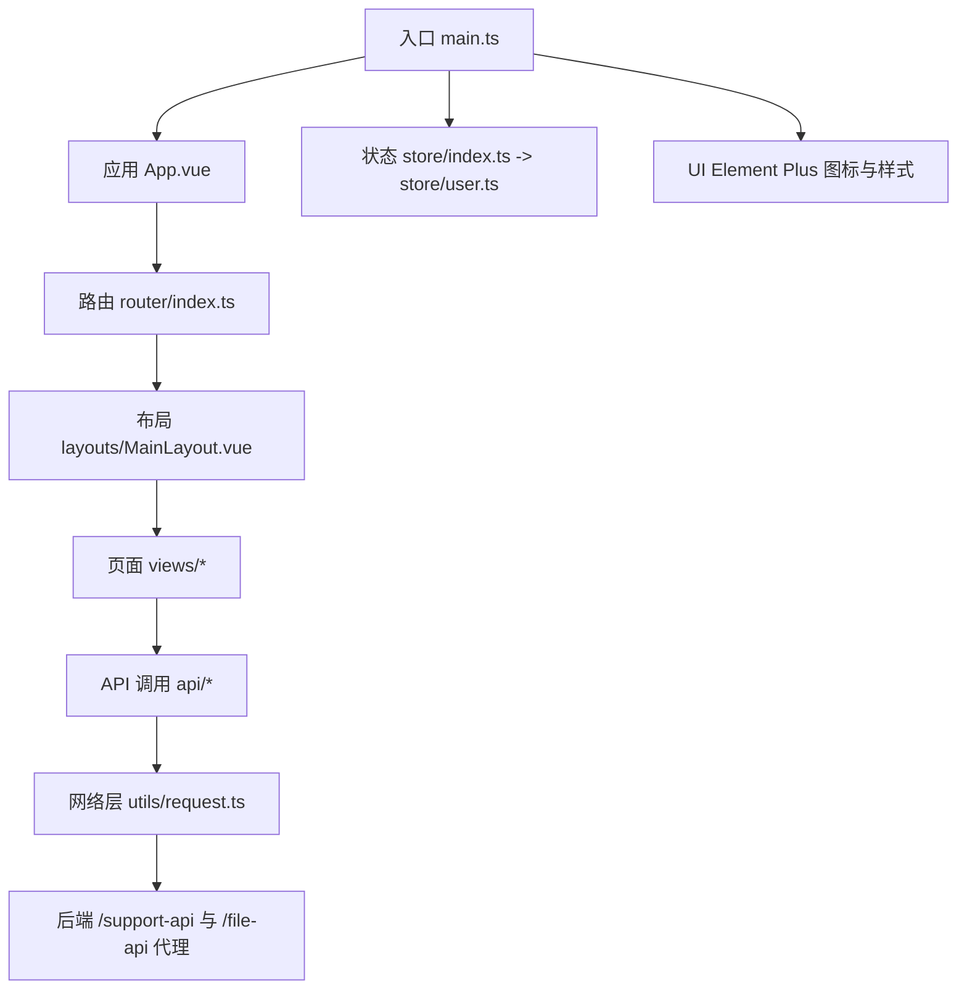
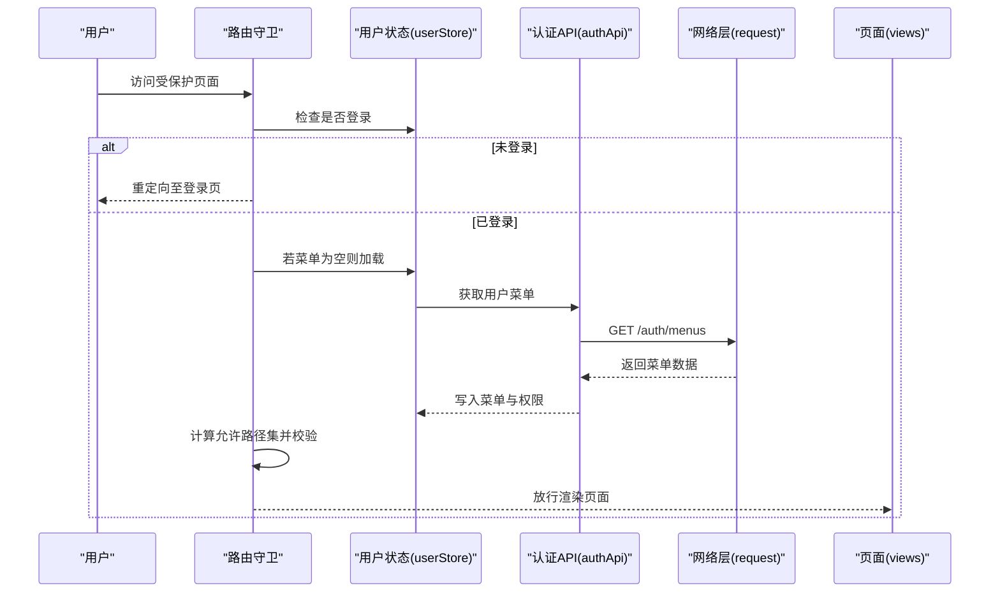
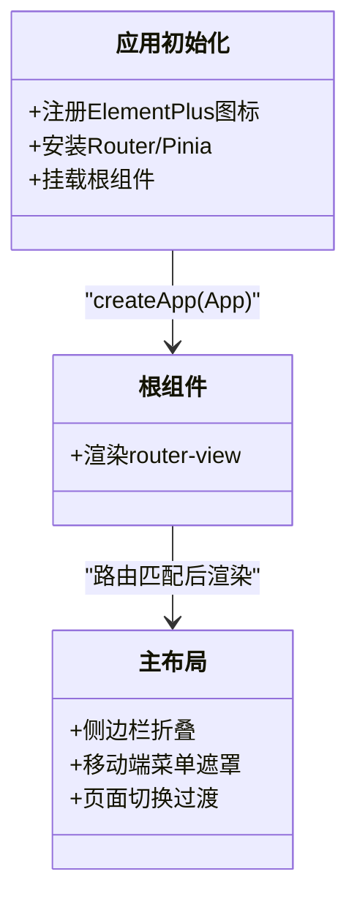
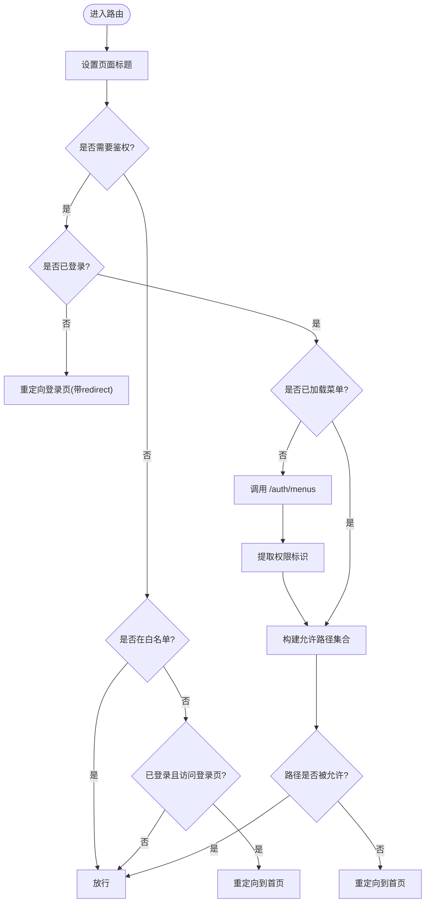
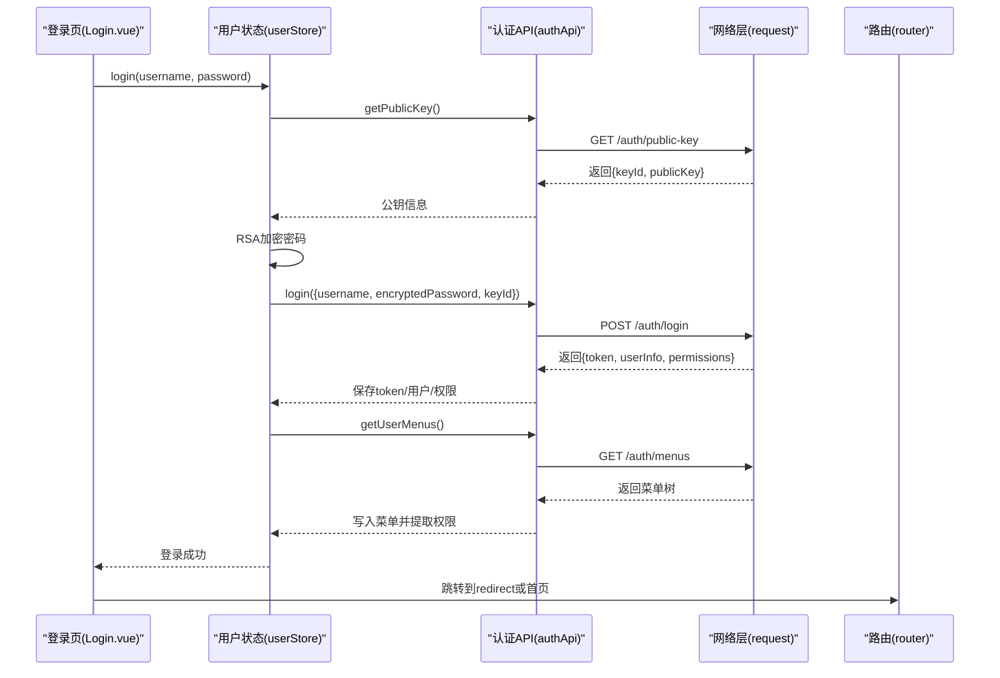
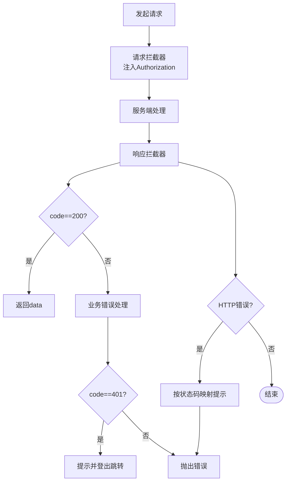
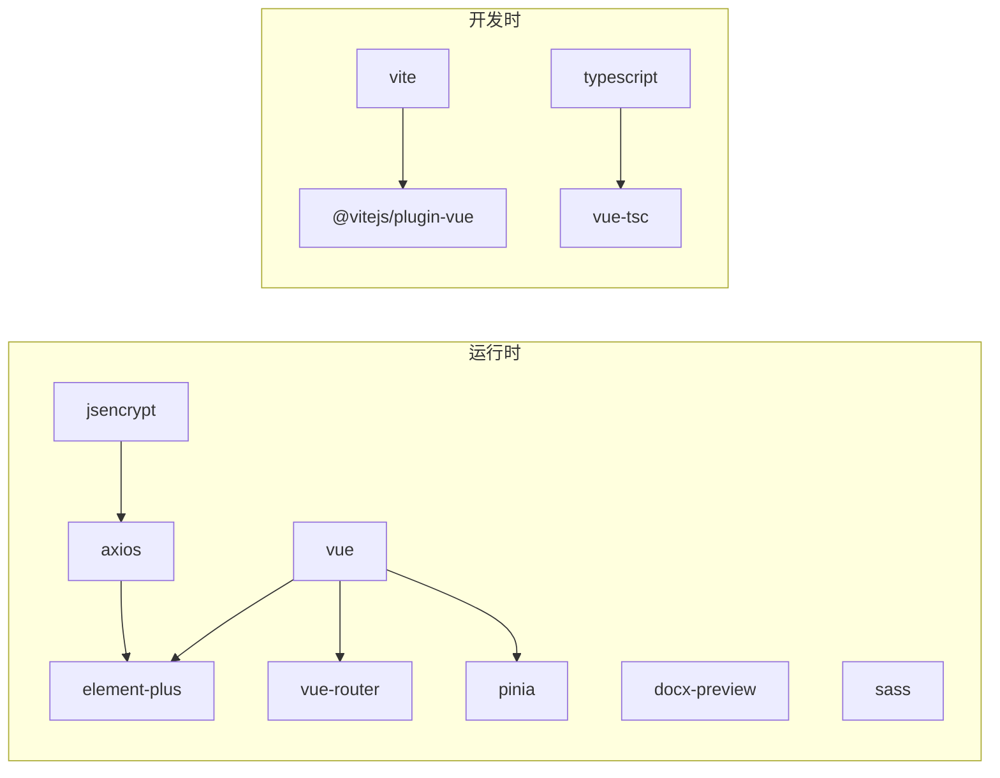

# 管理应用 (ele-ai-tender-support-frontend)

<cite>
**本文引用的文件**
- [package.json](file://ele-ai-tender-support-frontend/package.json)
- [vite.config.ts](file://ele-ai-tender-support-frontend/vite.config.ts)
- [main.ts](file://ele-ai-tender-support-frontend/src/main.ts)
- [App.vue](file://ele-ai-tender-support-frontend/src/App.vue)
- [router/index.ts](file://ele-ai-tender-support-frontend/src/router/index.ts)
- [store/index.ts](file://ele-ai-tender-support-frontend/src/store/index.ts)
- [store/user.ts](file://ele-ai-tender-support-frontend/src/store/user.ts)
- [utils/request.ts](file://ele-ai-tender-support-frontend/src/utils/request.ts)
- [utils/storage.ts](file://ele-ai-tender-support-frontend/src/utils/storage.ts)
- [api/auth.ts](file://ele-ai-tender-support-frontend/src/api/auth.ts)
- [types/index.ts](file://ele-ai-tender-support-frontend/src/types/index.ts)
- [views/auth/Login.vue](file://ele-ai-tender-support-frontend/src/views/auth/Login.vue)
- [layouts/MainLayout.vue](file://ele-ai-tender-support-frontend/src/layouts/MainLayout.vue)
- [utils/menu-route.ts](file://ele-ai-tender-support-frontend/src/utils/menu-route.ts)
</cite>

## 目录
1. [简介](#简介)
2. [项目结构](#项目结构)
3. [核心组件](#核心组件)
4. [架构总览](#架构总览)
5. [详细组件分析](#详细组件分析)
6. [依赖分析](#依赖分析)
7. [性能考虑](#性能考虑)
8. [故障排查指南](#故障排查指南)
9. [结论](#结论)
10. [附录](#附录)

## 简介
本仓库为“招标文件AI编制系统”的管理后台前端工程，基于 Vue 3 + TypeScript + Vite 构建。面向管理员提供用户与角色权限、菜单与路由、系统参数、版本与插件、知识库、模型配置、消息中心、统计分析、访问/操作日志等管理能力。文档聚焦于应用初始化、权限控制、路由守卫、状态管理、界面设计模式、组件复用策略、数据展示方案，以及安全认证、操作审计、数据导出等高级特性的实现说明，并提供管理员使用指南与开发者扩展建议。

## 项目结构
- 工程根位于 ele-ai-tender-support-frontend，采用功能域分层组织：
  - src/api：按业务域划分接口封装（如 auth、user、role、menu、statistics、operation-log、access-log、model-config、template、knowledge、policy-file、version 等）
  - src/components：通用与领域组件（如 DocxPreview）
  - src/layouts：布局容器 MainLayout 及 Header/Sidebar 子组件
  - src/router：路由定义与全局守卫
  - src/store：Pinia 状态（当前包含 user 模块）
  - src/types：统一类型定义（API 响应、分页、用户/角色/菜单、版本/插件、登录参数等）
  - src/utils：工具函数（请求封装、存储、加密、菜单路径解析等）
  - src/views：页面视图（auth、dashboard、system/*、external、version、template、knowledge、model-config、message、statistics、model-route 等）
  - public：静态资源
- 构建与开发：
  - 通过 vite.config.ts 配置代理、别名、分包与输出目录
  - package.json 提供 dev/build/preview 脚本与环境模式

图表来源
- [main.ts:1-25](file://ele-ai-tender-support-frontend/src/main.ts#L1-L25)
- [App.vue:1-15](file://ele-ai-tender-support-frontend/src/App.vue#L1-L15)
- [router/index.ts:1-219](file://ele-ai-tender-support-frontend/src/router/index.ts#L1-L219)
- [layouts/MainLayout.vue:1-138](file://ele-ai-tender-support-frontend/src/layouts/MainLayout.vue#L1-L138)
- [store/index.ts:1-8](file://ele-ai-tender-support-frontend/src/store/index.ts#L1-L8)
- [store/user.ts:1-122](file://ele-ai-tender-support-frontend/src/store/user.ts#L1-L122)
- [api/auth.ts:1-58](file://ele-ai-tender-support-frontend/src/api/auth.ts#L1-L58)
- [utils/request.ts:1-116](file://ele-ai-tender-support-frontend/src/utils/request.ts#L1-L116)
- [vite.config.ts:1-75](file://ele-ai-tender-support-frontend/vite.config.ts#L1-L75)

章节来源
- [package.json:1-35](file://ele-ai-tender-support-frontend/package.json#L1-L35)
- [vite.config.ts:1-75](file://ele-ai-tender-support-frontend/vite.config.ts#L1-L75)
- [main.ts:1-25](file://ele-ai-tender-support-frontend/src/main.ts#L1-L25)
- [App.vue:1-15](file://ele-ai-tender-support-frontend/src/App.vue#L1-L15)

## 核心组件
- 应用初始化
  - 创建 Vue 应用并挂载 Element Plus（含中文语言包与全部图标）、Vue Router、Pinia，引入全局样式
- 路由与守卫
  - 静态路由覆盖登录、首页、系统管理、接入系统、版本/插件、模板、知识库、模型配置、系统参数、操作/访问日志、政策文件审查库、消息中心、统计分析、模型路由等
  - 全局前置守卫负责：设置标题、鉴权检查、动态菜单加载、路径授权校验、白名单处理、已登录跳转首页
- 状态管理
  - Pinia 的 user 模块维护 token、用户信息、菜单树、权限标识集合；提供登录、获取用户信息、获取菜单、权限判断、登出等方法
- 网络请求
  - Axios 实例统一 baseURL、超时、拦截器（请求头注入 Authorization、业务码处理、Token 过期引导重新登录、HTTP 错误提示）
- 本地存储
  - 封装 localStorage 存取 token 与用户信息，支持清理
- 安全认证
  - 登录前获取 RSA 公钥，前端对密码进行 RSA 加密后传输；修改密码同样走 RSA 流程
- 菜单与路由映射
  - 兼容历史路径与 menuCode 到实际路由的映射，规范化路径用于权限判定

章节来源
- [main.ts:1-25](file://ele-ai-tender-support-frontend/src/main.ts#L1-L25)
- [router/index.ts:1-219](file://ele-ai-tender-support-frontend/src/router/index.ts#L1-L219)
- [store/user.ts:1-122](file://ele-ai-tender-support-frontend/src/store/user.ts#L1-L122)
- [utils/request.ts:1-116](file://ele-ai-tender-support-frontend/src/utils/request.ts#L1-L116)
- [utils/storage.ts:1-47](file://ele-ai-tender-support-frontend/src/utils/storage.ts#L1-L47)
- [api/auth.ts:1-58](file://ele-ai-tender-support-frontend/src/api/auth.ts#L1-L58)
- [utils/menu-route.ts:1-47](file://ele-ai-tender-support-frontend/src/utils/menu-route.ts#L1-L47)

## 架构总览
整体采用“布局+路由+状态+网络层”的标准中后台架构：
- 入口装配 UI 框架与插件
- 路由驱动页面渲染，并在进入时执行鉴权与菜单加载
- 状态集中管理用户上下文与权限
- 网络层统一拦截与错误处理
- 页面通过 API 模块发起请求，返回数据由类型约束保证一致性

图表来源
- [router/index.ts:175-216](file://ele-ai-tender-support-frontend/src/router/index.ts#L175-L216)
- [store/user.ts:66-90](file://ele-ai-tender-support-frontend/src/store/user.ts#L66-L90)
- [api/auth.ts:26-29](file://ele-ai-tender-support-frontend/src/api/auth.ts#L26-L29)
- [utils/request.ts:17-30](file://ele-ai-tender-support-frontend/src/utils/request.ts#L17-L30)

## 详细组件分析

### 应用初始化与布局
- 入口 main.ts
  - 注册 Element Plus 图标、中文语言包，安装路由与状态管理，挂载根组件
- 根组件 App.vue
  - 仅包含 <router-view/> 与基础样式重置
- 主布局 MainLayout.vue
  - 侧边栏可折叠、移动端抽屉式菜单、顶部 Header 与内容区过渡动画

图表来源
- [main.ts:1-25](file://ele-ai-tender-support-frontend/src/main.ts#L1-L25)
- [App.vue:1-15](file://ele-ai-tender-support-frontend/src/App.vue#L1-L15)
- [layouts/MainLayout.vue:1-138](file://ele-ai-tender-support-frontend/src/layouts/MainLayout.vue#L1-L138)

章节来源
- [main.ts:1-25](file://ele-ai-tender-support-frontend/src/main.ts#L1-L25)
- [App.vue:1-15](file://ele-ai-tender-support-frontend/src/App.vue#L1-L15)
- [layouts/MainLayout.vue:1-138](file://ele-ai-tender-support-frontend/src/layouts/MainLayout.vue#L1-L138)

### 路由与权限控制
- 静态路由
  - 登录、首页、系统管理（用户/角色/菜单/访问日志/系统参数/操作日志）、接入系统、版本与插件、模板、知识库、模型配置、政策文件审查库、消息中心、统计分析、模型路由等
- 路由守卫
  - 设置页面标题
  - 未登录重定向登录页，携带 redirect 以便登录后回跳
  - 首次进入加载用户菜单，提取权限标识集合
  - 基于菜单生成允许路径集合，结合 normalizeRoutePath 与 resolveMenuRoutePath 做路径匹配
  - 白名单处理与已登录访问登录页的重定向
- 菜单到路由映射
  - 兼容历史路径与 menuCode 到实际路由的映射，确保旧数据与新路由一致

图表来源
- [router/index.ts:175-216](file://ele-ai-tender-support-frontend/src/router/index.ts#L175-L216)
- [utils/menu-route.ts:28-43](file://ele-ai-tender-support-frontend/src/utils/menu-route.ts#L28-L43)

章节来源
- [router/index.ts:1-219](file://ele-ai-tender-support-frontend/src/router/index.ts#L1-L219)
- [utils/menu-route.ts:1-47](file://ele-ai-tender-support-frontend/src/utils/menu-route.ts#L1-L47)

### 状态管理与认证流程
- 用户状态 userStore
  - 状态：token、userInfo、menus、permissions
  - 方法：login、getUserInfo、getUserMenus、hasPermission、logout
  - 计算属性：isLoggedIn、username、realName
- 登录流程
  - 先获取 RSA 公钥，格式化后对密码进行 RSA 加密
  - 提交用户名、加密后的密码与 keyId
  - 成功后持久化 token 与用户信息，拉取菜单并提取权限
- 修改密码
  - 同样走 RSA 公钥获取与双端加密流程

图表来源
- [views/auth/Login.vue:93-110](file://ele-ai-tender-support-frontend/src/views/auth/Login.vue#L93-L110)
- [store/user.ts:35-73](file://ele-ai-tender-support-frontend/src/store/user.ts#L35-L73)
- [api/auth.ts:10-29](file://ele-ai-tender-support-frontend/src/api/auth.ts#L10-L29)
- [utils/request.ts:17-30](file://ele-ai-tender-support-frontend/src/utils/request.ts#L17-L30)

章节来源
- [store/user.ts:1-122](file://ele-ai-tender-support-frontend/src/store/user.ts#L1-L122)
- [api/auth.ts:1-58](file://ele-ai-tender-support-frontend/src/api/auth.ts#L1-L58)
- [views/auth/Login.vue:1-238](file://ele-ai-tender-support-frontend/src/views/auth/Login.vue#L1-L238)

### 网络层与错误处理
- 请求拦截器
  - 自动注入 Authorization: Bearer <token>
- 响应拦截器
  - 业务码非 200 时弹出错误提示；当 code=401 时弹窗确认并触发登出与跳转
  - HTTP 错误根据状态码给出友好提示；超时单独处理
- 封装方法
  - 提供 get/post/put/delete 统一返回 ApiResponse<T>

图表来源
- [utils/request.ts:17-94](file://ele-ai-tender-support-frontend/src/utils/request.ts#L17-L94)

章节来源
- [utils/request.ts:1-116](file://ele-ai-tender-support-frontend/src/utils/request.ts#L1-L116)

### 本地存储与类型体系
- 本地存储 storage
  - 提供 getToken/setToken/removeToken、getUser/setUser/removeUser、clear 等能力
- 类型体系 types/index.ts
  - 统一 ApiResponse、PageParams/PageResult、UserInfo/AuthUserInfo、RoleInfo、MenuInfo、ExternalSystem、VersionInfo/PluginInfo、LoginParams/LoginResult、FileUploadResult 等

章节来源
- [utils/storage.ts:1-47](file://ele-ai-tender-support-frontend/src/utils/storage.ts#L1-L47)
- [types/index.ts:1-177](file://ele-ai-tender-support-frontend/src/types/index.ts#L1-L177)

### 界面设计与组件复用策略
- 设计模式
  - 布局：MainLayout 提供侧边栏与头部，适配桌面与移动端
  - 表单：登录页使用 Element Plus Form 校验与交互
  - 列表/详情：各管理页面遵循统一的表格+分页+筛选+操作的常见模式（具体页面在 views/system/* 等）
- 组件复用
  - 通用组件集中在 components/common 与 domain 组件（如 DocxPreview），便于跨页面复用
  - 通过组合式函数与 store 抽象业务逻辑，减少重复代码

章节来源
- [layouts/MainLayout.vue:1-138](file://ele-ai-tender-support-frontend/src/layouts/MainLayout.vue#L1-L138)
- [views/auth/Login.vue:1-238](file://ele-ai-tender-support-frontend/src/views/auth/Login.vue#L1-L238)

### 系统管理功能说明
- 用户管理
  - 典型能力：查询、新增、编辑、删除、启用/禁用、批量操作、导入/导出（以对应 API 为准）
- 角色权限
  - 角色增删改查、菜单与按钮权限分配、数据范围（如有）
- 菜单管理
  - 树形菜单维护、排序、可见性、状态、权限标识绑定
- 系统配置
  - 系统参数键值对管理、分组与类型、在线生效
- 监控统计
  - 关键指标概览、趋势图、维度筛选
- 日志查看
  - 访问日志：记录请求链路、耗时、状态码、客户端IP、业务信息等
  - 操作日志：记录关键业务操作、操作人、时间、结果
- 其他
  - 接入系统管理：第三方系统接入、密钥管理
  - 版本与插件：版本发布、插件生命周期管理
  - 模板/知识库/模型配置：支撑 AI 编制的资源与模型路由

说明：以上功能的具体字段与交互以对应 API 与页面实现为准。

章节来源
- [router/index.ts:25-126](file://ele-ai-tender-support-frontend/src/router/index.ts#L25-L126)

### 安全认证机制、操作审计与数据导出
- 安全认证
  - 登录前获取 RSA 公钥，前端对密码进行 RSA 加密后再传输；修改密码同理
  - Token 通过请求头 Authorization 传递，后端校验失败时返回 401，前端统一处理并引导重新登录
- 操作审计
  - 访问日志与操作日志页面提供检索与查看能力，便于追踪与复盘
- 数据导出
  - 常见做法：后端提供导出接口，前端触发下载；或在浏览器端将数据转换为 CSV/Excel 并下载（需评估大数据量场景）

章节来源
- [api/auth.ts:10-51](file://ele-ai-tender-support-frontend/src/api/auth.ts#L10-L51)
- [utils/request.ts:33-94](file://ele-ai-tender-support-frontend/src/utils/request.ts#L33-L94)
- [router/index.ts:45-101](file://ele-ai-tender-support-frontend/src/router/index.ts#L45-L101)

## 依赖分析
- 运行时依赖
  - vue、vue-router、pinia、element-plus、axios、docx-preview、jsencrypt、sass
- 开发依赖
  - @vitejs/plugin-vue、typescript、vite、vue-tsc、@types/node
- 构建与打包
  - 手动分包 element-plus 与 vue-vendor，提升缓存命中率
  - 生产环境 base 路径与输出目录独立配置

图表来源
- [package.json:15-33](file://ele-ai-tender-support-frontend/package.json#L15-L33)
- [vite.config.ts:60-72](file://ele-ai-tender-support-frontend/vite.config.ts#L60-L72)

章节来源
- [package.json:1-35](file://ele-ai-tender-support-frontend/package.json#L1-L35)
- [vite.config.ts:1-75](file://ele-ai-tender-support-frontend/vite.config.ts#L1-L75)

## 性能考虑
- 路由懒加载：页面组件按需异步加载，降低首屏体积
- 分包策略：将 Element Plus 与 Vue 生态拆分为独立 chunk，提高缓存命中
- 代理与开发体验：本地开发通过 Vite 代理转发至后端，避免 CORS 问题
- 图片与静态资源：按需引入与压缩，减少不必要的资源体积
- 列表与大数据：分页加载、虚拟滚动（必要时）、导出采用流式或后端直链下载

[本节为通用指导，不直接分析具体文件]

## 故障排查指南
- 登录相关
  - 公钥获取失败：检查 /auth/public-key 可达性与跨域
  - 密码加密失败：确认 jsencrypt 与公钥格式正确
  - 登录成功但无菜单：检查 /auth/menus 返回结构与权限标识
- 网络请求
  - 401 未授权：检查 token 是否存在与是否过期；确认请求头注入正常
  - 403 拒绝访问：检查菜单权限与路由守卫判定
  - 404 资源不存在：核对 API 路径与后端路由
  - 500 服务器错误：查看后端日志与入参
  - 超时：检查网络与服务端处理耗时
- 路由与权限
  - 无法进入页面：检查菜单 status/visible/menuType 与路径映射
  - 历史路径不生效：确认 LEGACY_MENU_PATH_MAP 与 MENU_CODE_ROUTE_MAP 配置

章节来源
- [utils/request.ts:33-94](file://ele-ai-tender-support-frontend/src/utils/request.ts#L33-L94)
- [router/index.ts:141-173](file://ele-ai-tender-support-frontend/src/router/index.ts#L141-L173)
- [utils/menu-route.ts:1-47](file://ele-ai-tender-support-frontend/src/utils/menu-route.ts#L1-L47)

## 结论
该管理应用以清晰的分层与模块化组织，结合 Vue 3 + TypeScript + Vite 的现代前端技术栈，实现了完善的认证、权限、路由与状态管理，并通过统一的网络层与类型体系保障稳定性与可维护性。在此基础上，系统管理功能覆盖用户、角色、菜单、参数、日志、版本与插件、知识库与模型配置等关键领域，满足运维支撑中心的日常管理需求。后续可在数据导出、可视化报表、国际化与主题定制等方面持续增强。

[本节为总结性内容，不直接分析具体文件]

## 附录

### 管理员使用指南
- 首次登录
  - 使用管理员账号登录，系统会加载菜单与权限
- 用户与角色
  - 在“用户管理”中创建用户并分配角色；在“角色管理”中配置菜单与按钮权限
- 系统参数
  - 在“系统参数”中维护键值对，注意类型与分组
- 日志与审计
  - 在“访问日志”和“操作日志”中按条件检索，定位问题与审计轨迹
- 版本与插件
  - 在“版本管理”中发布新版本，并在“插件管理”中维护插件生命周期
- 知识库与模型配置
  - 在“知识库管理”维护知识文档；在“AI模型配置”与“模型路由”中配置与调度模型

[本节为概念性说明，不直接分析具体文件]

### 开发者扩展说明
- 新增页面
  - 在 views 下新建页面，在 router 中注册路由并设置 meta.title/icon
  - 如需权限控制，确保后端菜单返回中包含 path/menuUrl 与 permission
- 新增 API
  - 在 api 目录下按域创建模块，使用 request 封装 get/post/put/delete
  - 在 types 中补充类型定义，保持前后端契约一致
- 新增状态
  - 在 store 下新增模块，使用 defineStore 声明状态与方法
- 权限与菜单
  - 通过后端菜单接口返回的 permission 字段进行按钮级权限控制
  - 使用 normalizeRoutePath 与 resolveMenuRoutePath 确保路径匹配稳定
- 构建与部署
  - 通过环境变量配置 VITE_SUPPORT_API_URL/VITE_FILE_API_URL
  - 生产环境 base 路径与 outDir 已在 vite.config.ts 中配置

章节来源
- [router/index.ts:1-134](file://ele-ai-tender-support-frontend/src/router/index.ts#L1-L134)
- [utils/menu-route.ts:1-47](file://ele-ai-tender-support-frontend/src/utils/menu-route.ts#L1-L47)
- [vite.config.ts:24-72](file://ele-ai-tender-support-frontend/vite.config.ts#L24-L72)