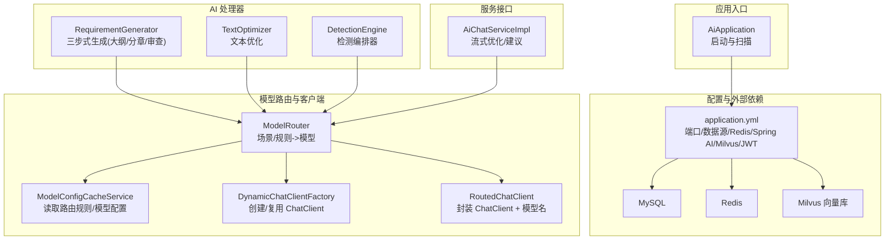
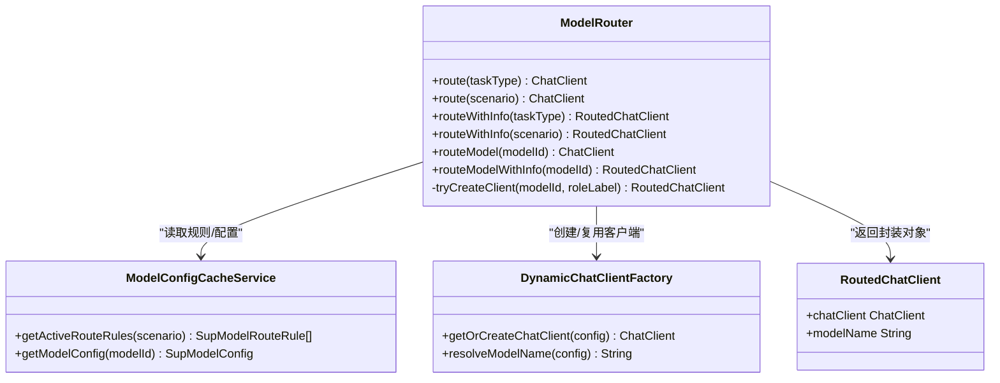
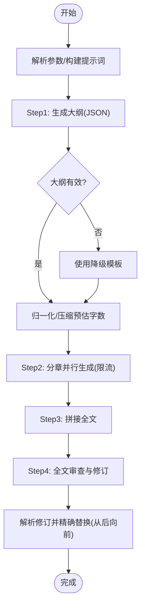
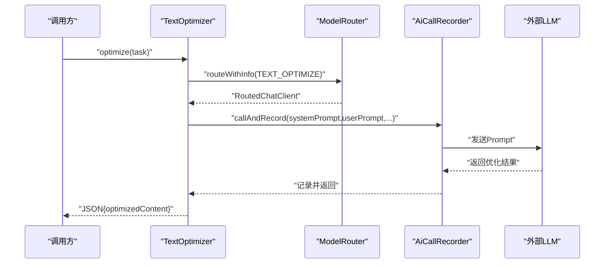
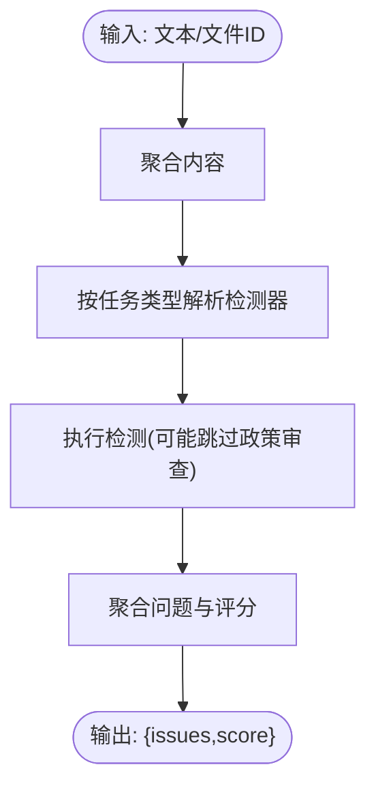
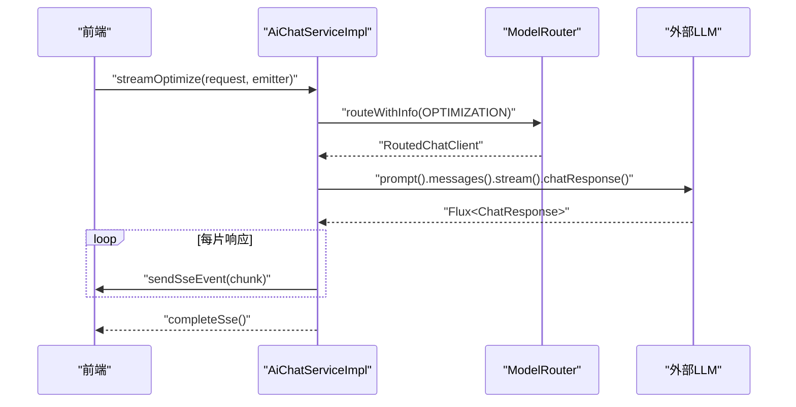
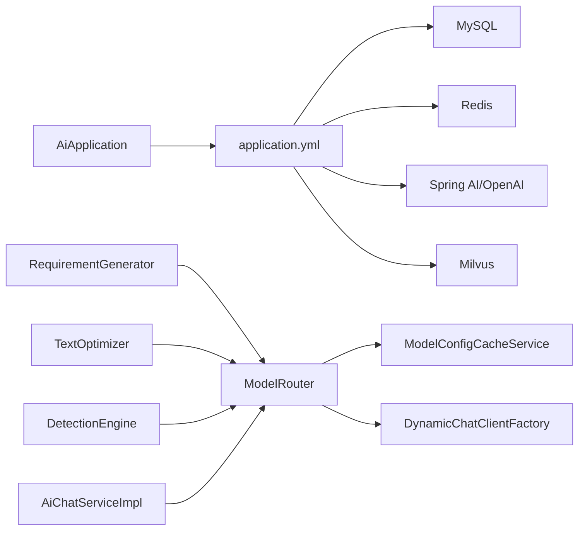

# AI处理服务 (ele-ai-tender-ai) 技术文档

<cite>
**本文档引用的文件**
- [AiApplication.java](file://ele-ai-tender-system/ele-ai-tender-ai/src/main/java/com/jy/eleaitender/ai/AiApplication.java)
- [application.yml](file://ele-ai-tender-system/ele-ai-tender-ai/src/main/resources/application.yml)
- [ModelRouter.java](file://ele-ai-tender-system/ele-ai-tender-ai/src/main/java/com/jy/eleaitender/ai/processor/model/ModelRouter.java)
- [RoutedChatClient.java](file://ele-ai-tender-system/ele-ai-tender-ai/src/main/java/com/jy/eleaitender/ai/processor/model/RoutedChatClient.java)
- [ModelConfigCacheService.java](file://ele-ai-tender-system/ele-ai-tender-ai/src/main/java/com/jy/eleaitender/ai/processor/model/ModelConfigCacheService.java)
- [RequirementGenerator.java](file://ele-ai-tender-system/ele-ai-tender-ai/src/main/java/com/jy/eleaitender/ai/processor/generator/RequirementGenerator.java)
- [TextOptimizer.java](file://ele-ai-tender-system/ele-ai-tender-ai/src/main/java/com/jy/eleaitender/ai/processor/generator/TextOptimizer.java)
- [DetectionEngine.java](file://ele-ai-tender-system/ele-ai-tender-ai/src/main/java/com/jy/eleaitender/ai/processor/checker/DetectionEngine.java)
- [AiChatServiceImpl.java](file://ele-ai-tender-system/ele-ai-tender-ai/src/main/java/com/jy/eleaitender/ai/service/impl/AiChatServiceImpl.java)
- [init.sql](file://ele-ai-tender-system/ele-ai-tender-ai/sql/init.sql)
</cite>

## 目录
1. [简介](#简介)
2. [项目结构](#项目结构)
3. [核心组件](#核心组件)
4. [架构总览](#架构总览)
5. [详细组件分析](#详细组件分析)
6. [依赖关系分析](#依赖关系分析)
7. [性能与并发](#性能与并发)
8. [监控、调优与故障诊断](#监控调优与故障诊断)
9. [结论](#结论)
10. [附录](#附录)

## 简介
本技术文档围绕 ele-ai-tender-ai 模块，系统性阐述基于 Spring AI 的 AI 处理服务实现方案。内容覆盖多模型路由、动态配置管理、连接池与线程池管理、智能内容生成（需求生成三步式编排）、质量检测引擎、向量知识库构建（Milvus 集成）、提示词工程、模型调用优化、结果解析处理、异步任务与重试机制、以及监控与排障指南。读者可据此快速理解系统架构与关键算法，并指导生产环境的部署与调优。

## 项目结构
AI 服务采用模块化分层设计：启动类负责应用初始化；配置层提供数据库、Redis、Spring AI、Milvus 等外部依赖；处理器层包含生成器、检测器、提示词与结果解析；模型路由与动态客户端工厂负责多模型选择与连接管理；服务层暴露聊天、连通性测试等能力；数据层通过 MyBatis-Plus 访问业务表。



图表来源
- [AiApplication.java:1-26](file://ele-ai-tender-system/ele-ai-tender-ai/src/main/java/com/jy/eleaitender/ai/AiApplication.java#L1-L26)
- [application.yml:1-72](file://ele-ai-tender-system/ele-ai-tender-ai/src/main/resources/application.yml#L1-L72)
- [ModelRouter.java:1-106](file://ele-ai-tender-system/ele-ai-tender-ai/src/main/java/com/jy/eleaitender/ai/processor/model/ModelRouter.java#L1-L106)
- [ModelConfigCacheService.java:1-60](file://ele-ai-tender-system/ele-ai-tender-ai/src/main/java/com/jy/eleaitender/ai/processor/model/ModelConfigCacheService.java#L1-L60)
- [RoutedChatClient.java:1-6](file://ele-ai-tender-system/ele-ai-tender-ai/src/main/java/com/jy/eleaitender/ai/processor/model/RoutedChatClient.java#L1-L6)
- [RequirementGenerator.java:1-200](file://ele-ai-tender-system/ele-ai-tender-ai/src/main/java/com/jy/eleaitender/ai/processor/generator/RequirementGenerator.java#L1-L200)
- [TextOptimizer.java:37-62](file://ele-ai-tender-system/ele-ai-tender-ai/src/main/java/com/jy/eleaitender/ai/processor/generator/TextOptimizer.java#L37-L62)
- [DetectionEngine.java:1-126](file://ele-ai-tender-system/ele-ai-tender-ai/src/main/java/com/jy/eleaitender/ai/processor/checker/DetectionEngine.java#L1-L126)
- [AiChatServiceImpl.java:126-180](file://ele-ai-tender-system/ele-ai-tender-ai/src/main/java/com/jy/eleaitender/ai/service/impl/AiChatServiceImpl.java#L126-L180)

章节来源
- [AiApplication.java:1-26](file://ele-ai-tender-system/ele-ai-tender-ai/src/main/java/com/jy/eleaitender/ai/AiApplication.java#L1-L26)
- [application.yml:1-72](file://ele-ai-tender-system/ele-ai-tender-ai/src/main/resources/application.yml#L1-L72)

## 核心组件
- 模型路由器 ModelRouter：根据使用场景或任务类型从数据库读取生效的路由规则，优先尝试主模型，失败则降级到备用模型，最终返回带模型名的 RoutedChatClient。
- 模型配置缓存服务 ModelConfigCacheService：直接查询数据库获取活跃路由规则与模型配置，保证配置实时生效。
- 动态客户端工厂 DynamicChatClientFactory：按模型配置创建/复用 ChatClient，并解析实际模型名称。
- 需求生成器 RequirementGenerator：三步式 Agent 编排（大纲→分章并行→审查修订），内置字数控制、限流并发、进度上报与降级模板。
- 文本优化器 TextOptimizer：基于提示词与路由模型进行同步优化，记录调用并返回结构化结果。
- 检测引擎 DetectionEngine：统一分发到敏感词、错别字、政策审查、格式检查等具体检测器，聚合问题与评分。
- 聊天服务 AiChatServiceImpl：提供流式优化与建议能力，结合 SSE 推送与调用记录。

章节来源
- [ModelRouter.java:1-106](file://ele-ai-tender-system/ele-ai-tender-ai/src/main/java/com/jy/eleaitender/ai/processor/model/ModelRouter.java#L1-L106)
- [ModelConfigCacheService.java:1-60](file://ele-ai-tender-system/ele-ai-tender-ai/src/main/java/com/jy/eleaitender/ai/processor/model/ModelConfigCacheService.java#L1-L60)
- [RequirementGenerator.java:1-200](file://ele-ai-tender-system/ele-ai-tender-ai/src/main/java/com/jy/eleaitender/ai/processor/generator/RequirementGenerator.java#L1-L200)
- [TextOptimizer.java:37-62](file://ele-ai-tender-system/ele-ai-tender-ai/src/main/java/com/jy/eleaitender/ai/processor/generator/TextOptimizer.java#L37-L62)
- [DetectionEngine.java:1-126](file://ele-ai-tender-system/ele-ai-tender-ai/src/main/java/com/jy/eleaitender/ai/processor/checker/DetectionEngine.java#L1-L126)
- [AiChatServiceImpl.java:126-180](file://ele-ai-tender-system/ele-ai-tender-ai/src/main/java/com/jy/eleaitender/ai/service/impl/AiChatServiceImpl.java#L126-L180)

## 架构总览
下图展示请求从控制器进入后，经服务层到处理器层，再到模型路由与外部模型的完整链路，同时体现 Milvus 向量库与数据库/Redis 的支撑作用。

```mermaid
sequenceDiagram
participant Client as "客户端"
participant Controller as "控制器"
participant Service as "AiChatServiceImpl"
participant Router as "ModelRouter"
participant Cache as "ModelConfigCacheService"
participant Factory as "DynamicChatClientFactory"
participant Model as "外部LLM"
participant DB as "MySQL"
participant Redis as "Redis"
participant Milvus as "Milvus"
Client->>Controller : "发起AI请求"
Controller->>Service : "调用服务方法"
Service->>Router : "routeWithInfo(场景)"
Router->>Cache : "getActiveRouteRules(场景)"
Cache->>DB : "查询路由规则/模型配置"
DB-->>Cache : "返回规则与配置"
Router->>Factory : "getOrCreateChatClient(配置)"
Factory-->>Router : "返回ChatClient+模型名"
Service->>Model : "发送Prompt并接收响应"
Model-->>Service : "返回结果/流式片段"
Service-->>Controller : "组装结果"
Controller-->>Client : "返回响应"
Note over DB,Redis,Milvus : "持久化/缓存/向量检索按需使用"
```

图表来源
- [AiChatServiceImpl.java:126-180](file://ele-ai-tender-system/ele-ai-tender-ai/src/main/java/com/jy/eleaitender/ai/service/impl/AiChatServiceImpl.java#L126-L180)
- [ModelRouter.java:1-106](file://ele-ai-tender-system/ele-ai-tender-ai/src/main/java/com/jy/eleaitender/ai/processor/model/ModelRouter.java#L1-L106)
- [ModelConfigCacheService.java:1-60](file://ele-ai-tender-system/ele-ai-tender-ai/src/main/java/com/jy/eleaitender/ai/processor/model/ModelConfigCacheService.java#L1-L60)
- [application.yml:1-72](file://ele-ai-tender-system/ele-ai-tender-ai/src/main/resources/application.yml#L1-L72)

## 详细组件分析

### 多模型路由与动态配置管理
- 路由策略：按使用场景（如 GENERATION/OPTIMIZATION/DETECTION）查询生效规则，依次尝试主模型与降级模型，任一可用即返回 RoutedChatClient。
- 配置来源：直接从数据库读取 SupModelRouteRule 与 SupModelConfig，确保热更新即时生效。
- 客户端生命周期：通过工厂创建/复用 ChatClient，避免重复初始化开销。



图表来源
- [ModelRouter.java:1-106](file://ele-ai-tender-system/ele-ai-tender-ai/src/main/java/com/jy/eleaitender/ai/processor/model/ModelRouter.java#L1-L106)
- [ModelConfigCacheService.java:1-60](file://ele-ai-tender-system/ele-ai-tender-ai/src/main/java/com/jy/eleaitender/ai/processor/model/ModelConfigCacheService.java#L1-L60)
- [RoutedChatClient.java:1-6](file://ele-ai-tender-system/ele-ai-tender-ai/src/main/java/com/jy/eleaitender/ai/processor/model/RoutedChatClient.java#L1-L6)

章节来源
- [ModelRouter.java:1-106](file://ele-ai-tender-system/ele-ai-tender-ai/src/main/java/com/jy/eleaitender/ai/processor/model/ModelRouter.java#L1-L106)
- [ModelConfigCacheService.java:1-60](file://ele-ai-tender-system/ele-ai-tender-ai/src/main/java/com/jy/eleaitender/ai/processor/model/ModelConfigCacheService.java#L1-L60)
- [RoutedChatClient.java:1-6](file://ele-ai-tender-system/ele-ai-tender-ai/src/main/java/com/jy/eleaitender/ai/processor/model/RoutedChatClient.java#L1-L6)

### 智能内容生成（需求生成三步式编排）
- Step1 大纲生成：构造系统提示与用户提示，调用 LLM 输出 JSON 大纲，若解析失败则回退到预设模板。
- Step2 分章并行：使用虚拟线程执行器与信号量限流，并发生成各章节内容，期间持续上报进度。
- Step3 全文拼接与审查：拼接为 Markdown，再进行一次全文审查，解析修订列表并按位置从后向前精确替换，避免偏移漂移。
- 字数控制：对大纲预估字数进行归一化与压缩，确保不超过上限阈值。



图表来源
- [RequirementGenerator.java:124-200](file://ele-ai-tender-system/ele-ai-tender-ai/src/main/java/com/jy/eleaitender/ai/processor/generator/RequirementGenerator.java#L124-L200)
- [RequirementGenerator.java:346-428](file://ele-ai-tender-system/ele-ai-tender-ai/src/main/java/com/jy/eleaitender/ai/processor/generator/RequirementGenerator.java#L346-L428)
- [RequirementGenerator.java:494-530](file://ele-ai-tender-system/ele-ai-tender-ai/src/main/java/com/jy/eleaitender/ai/processor/generator/RequirementGenerator.java#L494-L530)
- [RequirementGenerator.java:646-764](file://ele-ai-tender-system/ele-ai-tender-ai/src/main/java/com/jy/eleaitender/ai/processor/generator/RequirementGenerator.java#L646-L764)

章节来源
- [RequirementGenerator.java:124-200](file://ele-ai-tender-system/ele-ai-tender-ai/src/main/java/com/jy/eleaitender/ai/processor/generator/RequirementGenerator.java#L124-L200)
- [RequirementGenerator.java:346-428](file://ele-ai-tender-system/ele-ai-tender-ai/src/main/java/com/jy/eleaitender/ai/processor/generator/RequirementGenerator.java#L346-L428)
- [RequirementGenerator.java:494-530](file://ele-ai-tender-system/ele-ai-tender-ai/src/main/java/com/jy/eleaitender/ai/processor/generator/RequirementGenerator.java#L494-L530)
- [RequirementGenerator.java:646-764](file://ele-ai-tender-system/ele-ai-tender-ai/src/main/java/com/jy/eleaitender/ai/processor/generator/RequirementGenerator.java#L646-L764)

### 文本优化与提示词工程
- 提示词工程：通过 PromptBuilder 与 SystemPromptTemplates 组合系统提示与用户提示，确保模型输出稳定且符合规范。
- 同步优化流程：解析请求参数→构建提示词→路由模型→调用并记录→返回结构化 JSON。



图表来源
- [TextOptimizer.java:37-62](file://ele-ai-tender-system/ele-ai-tender-ai/src/main/java/com/jy/eleaitender/ai/processor/generator/TextOptimizer.java#L37-L62)
- [ModelRouter.java:1-106](file://ele-ai-tender-system/ele-ai-tender-ai/src/main/java/com/jy/eleaitender/ai/processor/model/ModelRouter.java#L1-L106)

章节来源
- [TextOptimizer.java:37-62](file://ele-ai-tender-system/ele-ai-tender-ai/src/main/java/com/jy/eleaitender/ai/processor/generator/TextOptimizer.java#L37-L62)

### 质量检测引擎
- 编排器 DetectionEngine：根据任务类型分发到具体检测器（敏感词、错别字、政策审查、格式检查）。
- 输入聚合：支持直接文本与文件内容合并，减少上下文缺失。
- 结果聚合：统一输出 issues 列表与综合评分。



图表来源
- [DetectionEngine.java:53-95](file://ele-ai-tender-system/ele-ai-tender-ai/src/main/java/com/jy/eleaitender/ai/processor/checker/DetectionEngine.java#L53-L95)
- [DetectionEngine.java:100-126](file://ele-ai-tender-system/ele-ai-tender-ai/src/main/java/com/jy/eleaitender/ai/processor/checker/DetectionEngine.java#L100-L126)

章节来源
- [DetectionEngine.java:53-95](file://ele-ai-tender-system/ele-ai-tender-ai/src/main/java/com/jy/eleaitender/ai/processor/checker/DetectionEngine.java#L53-L95)
- [DetectionEngine.java:100-126](file://ele-ai-tender-system/ele-ai-tender-ai/src/main/java/com/jy/eleaitender/ai/processor/checker/DetectionEngine.java#L100-L126)

### 流式优化与 SSE 推送
- 流式调用：使用 chatResponse 流式获取片段，边收边推至前端 SSE。
- 记录与收尾：订阅 onComplete 时记录最后一次响应与累计内容，完成后关闭 SSE。



图表来源
- [AiChatServiceImpl.java:126-180](file://ele-ai-tender-system/ele-ai-tender-ai/src/main/java/com/jy/eleaitender/ai/service/impl/AiChatServiceImpl.java#L126-L180)
- [ModelRouter.java:1-106](file://ele-ai-tender-system/ele-ai-tender-ai/src/main/java/com/jy/eleaitender/ai/processor/model/ModelRouter.java#L1-L106)

章节来源
- [AiChatServiceImpl.java:126-180](file://ele-ai-tender-system/ele-ai-tender-ai/src/main/java/com/jy/eleaitender/ai/service/impl/AiChatServiceImpl.java#L126-L180)

### 向量知识库构建（Milvus 集成）
- 配置项：host/port/database 通过 application.yml 注入，便于环境隔离与热更新。
- 用途：用于语义检索、相似知识召回，配合提示词增强生成质量。
- 注意：当前仓库未找到具体 KnowledgeDocumentService 实现，建议在后续迭代中补充文档入库、切片、向量化与检索逻辑。

章节来源
- [application.yml:50-54](file://ele-ai-tender-system/ele-ai-tender-ai/src/main/resources/application.yml#L50-L54)

## 依赖关系分析
- 外部依赖：MySQL（任务与配置存储）、Redis（会话/缓存）、Spring AI（OpenAI兼容接口）、Milvus（向量检索）。
- 内部耦合：处理器依赖路由与记录器；路由依赖配置服务与客户端工厂；服务层依赖处理器与路由。
- 潜在风险：路由规则缺失或模型不可用会抛出异常；高并发下需关注 API 速率限制与超时。



图表来源
- [AiApplication.java:1-26](file://ele-ai-tender-system/ele-ai-tender-ai/src/main/java/com/jy/eleaitender/ai/AiApplication.java#L1-L26)
- [application.yml:1-72](file://ele-ai-tender-system/ele-ai-tender-ai/src/main/resources/application.yml#L1-L72)
- [ModelRouter.java:1-106](file://ele-ai-tender-system/ele-ai-tender-ai/src/main/java/com/jy/eleaitender/ai/processor/model/ModelRouter.java#L1-L106)
- [ModelConfigCacheService.java:1-60](file://ele-ai-tender-system/ele-ai-tender-ai/src/main/java/com/jy/eleaitender/ai/processor/model/ModelConfigCacheService.java#L1-L60)

章节来源
- [application.yml:1-72](file://ele-ai-tender-system/ele-ai-tender-ai/src/main/resources/application.yml#L1-L72)

## 性能与并发
- 虚拟线程：需求生成使用 JDK21 虚拟线程执行器提升 I/O 密集型任务吞吐。
- 限流并发：分章生成使用 Semaphore 控制最大并发数，避免触发外部 API 速率限制。
- 超时控制：分章等待设置超时时间，防止长时间阻塞。
- 流式处理：优化接口采用 Flux 流式响应，降低首字节延迟。
- 连接池与客户端复用：通过工厂创建/复用 ChatClient，减少握手与鉴权开销。

章节来源
- [RequirementGenerator.java:114-117](file://ele-ai-tender-system/ele-ai-tender-ai/src/main/java/com/jy/eleaitender/ai/processor/generator/RequirementGenerator.java#L114-L117)
- [RequirementGenerator.java:361-428](file://ele-ai-tender-system/ele-ai-tender-ai/src/main/java/com/jy/eleaitender/ai/processor/generator/RequirementGenerator.java#L361-L428)
- [AiChatServiceImpl.java:126-180](file://ele-ai-tender-system/ele-ai-tender-ai/src/main/java/com/jy/eleaitender/ai/service/impl/AiChatServiceImpl.java#L126-L180)

## 监控、调优与故障诊断
- 日志与追踪：
  - 全局日志模式包含 traceId，便于跨服务关联。
  - 需求生成专用日志记录任务起止、阶段耗时、章节状态与错误信息。
- 任务状态与重试：
  - 任务表包含 status/retry_count/max_retry/timeout_minutes 等字段，支持重试与超时控制。
- 常见问题定位：
  - 路由无可用模型：检查 SupModelRouteRule 是否启用且优先级正确。
  - 模型不可用：校验 SupModelConfig 激活状态与外部凭据。
  - 分章生成超时：调整并发度与超时时间，评估外部 API 配额。
  - 流式中断：检查 SSE 客户端连接稳定性与服务端异常捕获。

章节来源
- [application.yml:66-72](file://ele-ai-tender-system/ele-ai-tender-ai/src/main/resources/application.yml#L66-L72)
- [init.sql:23-44](file://ele-ai-tender-system/ele-ai-tender-ai/sql/init.sql#L23-L44)
- [RequirementGenerator.java:789-851](file://ele-ai-tender-system/ele-ai-tender-ai/src/main/java/com/jy/eleaitender/ai/processor/generator/RequirementGenerator.java#L789-L851)

## 结论
本服务以 Spring AI 为核心，结合多模型路由、动态配置、虚拟线程与流式处理，实现了高可用的智能内容生成与质量检测能力。通过严格的提示词工程与结果解析策略，保障输出质量与稳定性。生产环境应重点关注路由规则与模型配置的可用性、API 速率限制与超时策略，并结合日志与任务状态进行持续监控与调优。

## 附录
- 配置要点：
  - 服务器端口、字符集、数据源、Redis、JWT、内部文件服务地址均在 application.yml 中集中管理。
  - Milvus 向量库 host/port/database 可按环境独立配置。
- 数据库关键字段：
  - 任务表包含状态、重试次数、最大重试、超时分钟、开始/完成时间等，支撑异步任务与重试机制。

章节来源
- [application.yml:1-72](file://ele-ai-tender-system/ele-ai-tender-ai/src/main/resources/application.yml#L1-L72)
- [init.sql:23-44](file://ele-ai-tender-system/ele-ai-tender-ai/sql/init.sql#L23-L44)