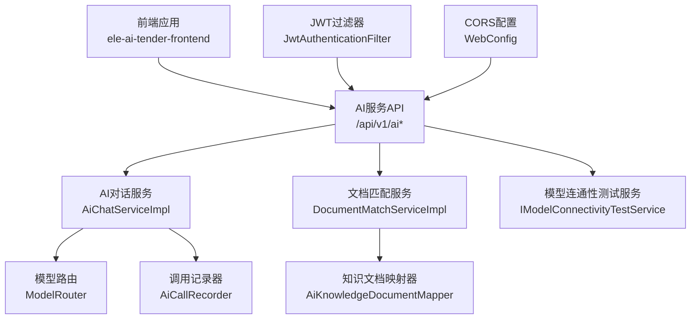
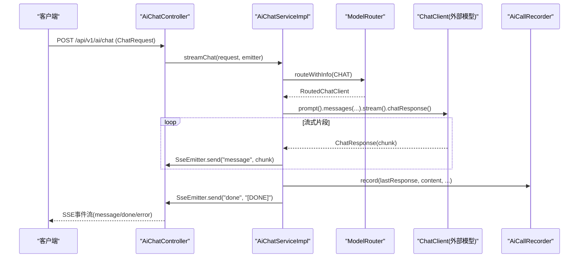
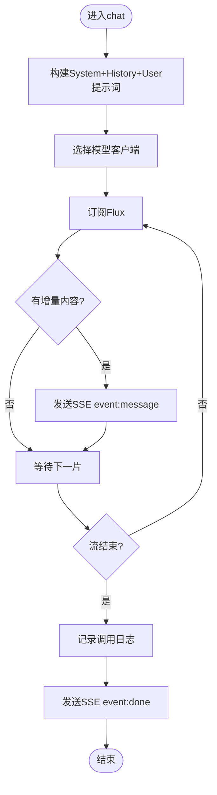
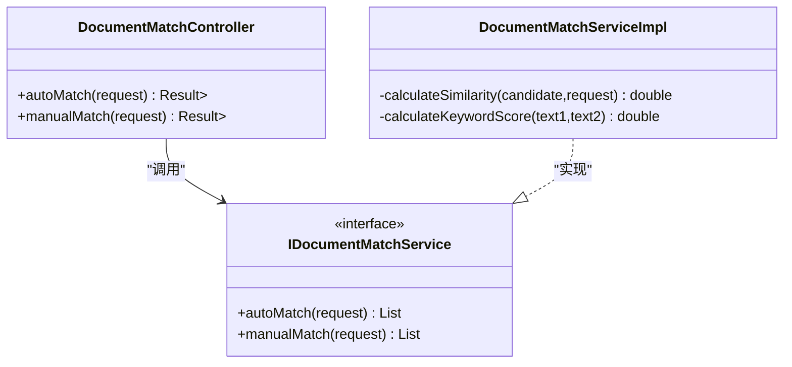
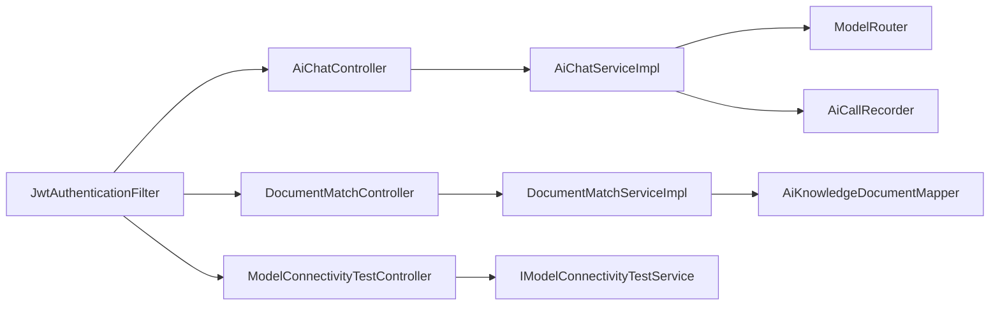
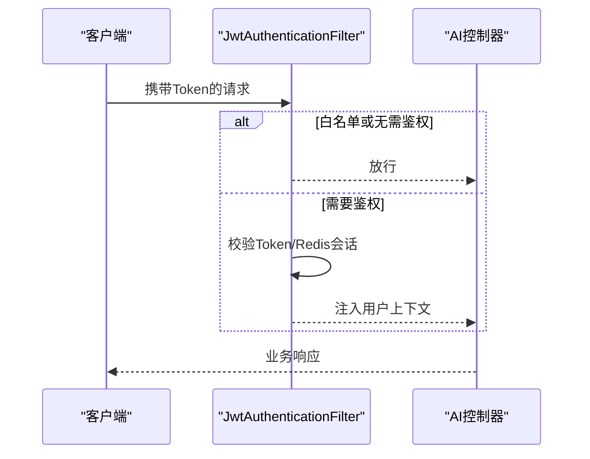

# API接口与服务集成

<cite>
**本文引用的文件**
- [AiChatController.java](file://ele-ai-tender-system/ele-ai-tender-ai/src/main/java/com/jy/eleaitender/ai/controller/AiChatController.java)
- [DocumentMatchController.java](file://ele-ai-tender-system/ele-ai-tender-ai/src/main/java/com/jy/eleaitender/ai/controller/DocumentMatchController.java)
- [ModelConnectivityTestController.java](file://ele-ai-tender-system/ele-ai-tender-ai/src/main/java/com/jy/eleaitender/ai/controller/ModelConnectivityTestController.java)
- [AiChatServiceImpl.java](file://ele-ai-tender-system/ele-ai-tender-ai/src/main/java/com/jy/eleaitender/ai/service/impl/AiChatServiceImpl.java)
- [IDocumentMatchService.java](file://ele-ai-tender-system/ele-ai-tender-ai/src/main/java/com/jy/eleaitender/ai/service/IDocumentMatchService.java)
- [DocumentMatchServiceImpl.java](file://ele-ai-tender-system/ele-ai-tender-ai/src/main/java/com/jy/eleaitender/ai/service/impl/DocumentMatchServiceImpl.java)
- [IModelConnectivityTestService.java](file://ele-ai-tender-system/ele-ai-tender-ai/src/main/java/com/jy/eleaitender/ai/service/IModelConnectivityTestService.java)
- [WebConfig.java](file://ele-ai-tender-system/ele-ai-tender-support/src/main/java/com/jy/eleaitender/support/config/WebConfig.java)
- [JwtAuthenticationFilter.java](file://ele-ai-tender-system/ele-ai-tender-common/src/main/java/com/jy/eleaitender/common/security/JwtAuthenticationFilter.java)
- [RequestParamJwtAuthenticationFilter.java](file://ele-ai-tender-system/ele-ai-tender-file/src/main/java/com/jy/eleaitender/file/security/RequestParamJwtAuthenticationFilter.java)
- [UserConcurrencyManager.java](file://ele-ai-tender-system/ele-ai-tender-ai/src/main/java/com/jy/eleaitender/ai/threadpool/UserConcurrencyManager.java)
- [CORE_MODULE_SPEC.md](file://docs/rules/CORE_MODULE_SPEC.md)
- [INTERACTION_INTEGRATION_SPEC.md](file://docs/rules/INTERACTION_INTEGRATION_SPEC.md)
- [SUPPORT_SYSTEM_SPEC.md](file://docs/rules/SUPPORT_SYSTEM_SPEC.md)
- [ai.ts](file://ele-ai-tender-frontend/src/api/ai.ts)
</cite>

## 目录
1. [简介](#简介)
2. [项目结构](#项目结构)
3. [核心组件](#核心组件)
4. [架构总览](#架构总览)
5. [详细组件分析](#详细组件分析)
6. [依赖关系分析](#依赖关系分析)
7. [性能与限流](#性能与限流)
8. [安全与认证](#安全与认证)
9. [错误码与异常处理](#错误码与异常处理)
10. [高级功能](#高级功能)
11. [SDK与集成示例](#sdk与集成示例)
12. [调试与排障](#调试与排障)
13. [结论](#结论)

## 简介
本文件面向AI服务API接口的开发者与集成方，覆盖聊天对话、文档匹配、模型连通性测试等核心能力，并补充认证授权、限流控制、安全策略、WebSocket/SSE实时通信、文件上传下载、批量操作等治理与实践指南。内容基于仓库中控制器、服务实现、前端调用与规范文档进行梳理，确保与实际代码一致。

## 项目结构
- AI服务模块提供对外REST接口：
  - 聊天对话与文本优化（SSE流式）
  - 文档匹配（自动/手动候选）
  - 模型连通性测试（DeepSeek/OpenAI兼容、智谱）
- 支撑模块提供认证、用户/角色/菜单、模板配置、知识库、模型配置与路由、系统参数、消息通知、日志、版本管理等能力
- 交互集成模块定义外部系统对接SPI与出站客户端能力
- 前端通过HTTP+SSE与后端交互，封装了SSE解析与事件处理

图表来源
- [AiChatController.java:1-57](file://ele-ai-tender-system/ele-ai-tender-ai/src/main/java/com/jy/eleaitender/ai/controller/AiChatController.java#L1-L57)
- [DocumentMatchController.java:1-49](file://ele-ai-tender-system/ele-ai-tender-ai/src/main/java/com/jy/eleaitender/ai/controller/DocumentMatchController.java#L1-L49)
- [ModelConnectivityTestController.java:1-37](file://ele-ai-tender-system/ele-ai-tender-ai/src/main/java/com/jy/eleaitender/ai/controller/ModelConnectivityTestController.java#L1-L37)
- [AiChatServiceImpl.java:1-263](file://ele-ai-tender-system/ele-ai-tender-ai/src/main/java/com/jy/eleaitender/ai/service/impl/AiChatServiceImpl.java#L1-L263)
- [DocumentMatchServiceImpl.java:1-115](file://ele-ai-tender-system/ele-ai-tender-ai/src/main/java/com/jy/eleaitender/ai/service/impl/DocumentMatchServiceImpl.java#L1-L115)
- [WebConfig.java:30-61](file://ele-ai-tender-system/ele-ai-tender-support/src/main/java/com/jy/eleaitender/support/config/WebConfig.java#L30-L61)
- [JwtAuthenticationFilter.java:1-36](file://ele-ai-tender-system/ele-ai-tender-common/src/main/java/com/jy/eleaitender/common/security/JwtAuthenticationFilter.java#L1-L36)

章节来源
- [CORE_MODULE_SPEC.md:1-358](file://docs/rules/CORE_MODULE_SPEC.md#L1-L358)
- [INTERACTION_INTEGRATION_SPEC.md:1-89](file://docs/rules/INTERACTION_INTEGRATION_SPEC.md#L1-L89)
- [SUPPORT_SYSTEM_SPEC.md:1-34](file://docs/rules/SUPPORT_SYSTEM_SPEC.md#L1-L34)

## 核心组件
- AI对话与文本优化
  - 控制器：POST /api/v1/ai/chat、/api/v1/ai/optimize（SSE）、/api/v1/ai/suggest（同步）
  - 服务：构建提示词、路由到具体模型、流式推送、完成/错误事件
- 文档匹配
  - 控制器：POST /api/v1/ai/match/auto、/api/v1/ai/match/manual
  - 服务：按类型/类别/关键词评分排序，返回TopN候选
- 模型连通性测试
  - 控制器：POST /api/v1/ai/model-test/deepseek、/api/v1/ai/model-test/zhipu
  - 服务：调用对应模型供应商端点，返回连通性结果

章节来源
- [AiChatController.java:1-57](file://ele-ai-tender-system/ele-ai-tender-ai/src/main/java/com/jy/eleaitender/ai/controller/AiChatController.java#L1-L57)
- [DocumentMatchController.java:1-49](file://ele-ai-tender-system/ele-ai-tender-ai/src/main/java/com/jy/eleaitender/ai/controller/DocumentMatchController.java#L1-L49)
- [ModelConnectivityTestController.java:1-37](file://ele-ai-tender-system/ele-ai-tender-ai/src/main/java/com/jy/eleaitender/ai/controller/ModelConnectivityTestController.java#L1-L37)
- [AiChatServiceImpl.java:1-263](file://ele-ai-tender-system/ele-ai-tender-ai/src/main/java/com/jy/eleaitender/ai/service/impl/AiChatServiceImpl.java#L1-L263)
- [DocumentMatchServiceImpl.java:1-115](file://ele-ai-tender-system/ele-ai-tender-ai/src/main/java/com/jy/eleaitender/ai/service/impl/DocumentMatchServiceImpl.java#L1-L115)
- [IModelConnectivityTestService.java:1-11](file://ele-ai-tender-system/ele-ai-tender-ai/src/main/java/com/jy/eleaitender/ai/service/IModelConnectivityTestService.java#L1-L11)

## 架构总览
AI服务采用“控制器→服务→模型路由/记录器/存储”的分层结构；认证由全局JWT过滤器统一拦截；SSE用于实时增量输出；并发与限流通过信号量在任务调度侧控制。

图表来源
- [AiChatController.java:30-56](file://ele-ai-tender-system/ele-ai-tender-ai/src/main/java/com/jy/eleaitender/ai/controller/AiChatController.java#L30-L56)
- [AiChatServiceImpl.java:64-123](file://ele-ai-tender-system/ele-ai-tender-ai/src/main/java/com/jy/eleaitender/ai/service/impl/AiChatServiceImpl.java#L64-L123)

## 详细组件分析

### 聊天对话接口（SSE）
- 路径与方法
  - POST /api/v1/ai/chat（SSE）
  - POST /api/v1/ai/optimize（SSE）
  - POST /api/v1/ai/suggest（JSON）
- 请求体要点
  - chat/optimize：包含消息、上下文、历史、替换模式等字段（由@Valid校验）
- 响应格式
  - SSE事件：event=message/data为JSON{"content":"..."}；event=done/data为{"content":"[DONE]"}；event=error/data为{"error":"..."}
  - suggest：标准Result包装的字符串
- 使用建议
  - 客户端需维护SSE连接、断线重连、超时处理
  - 注意JSON转义与行缓冲，避免数据截断

图表来源
- [AiChatServiceImpl.java:64-123](file://ele-ai-tender-system/ele-ai-tender-ai/src/main/java/com/jy/eleaitender/ai/service/impl/AiChatServiceImpl.java#L64-L123)
- [AiChatServiceImpl.java:217-249](file://ele-ai-tender-system/ele-ai-tender-ai/src/main/java/com/jy/eleaitender/ai/service/impl/AiChatServiceImpl.java#L217-L249)

章节来源
- [AiChatController.java:30-56](file://ele-ai-tender-system/ele-ai-tender-ai/src/main/java/com/jy/eleaitender/ai/controller/AiChatController.java#L30-L56)
- [AiChatServiceImpl.java:1-263](file://ele-ai-tender-system/ele-ai-tender-ai/src/main/java/com/jy/eleaitender/ai/service/impl/AiChatServiceImpl.java#L1-L263)
- [ai.ts:88-180](file://ele-ai-tender-frontend/src/api/ai.ts#L88-L180)

### 文档匹配接口
- 路径与方法
  - POST /api/v1/ai/match/auto（自动匹配Top5）
  - POST /api/v1/ai/match/manual（手动候选列表）
- 请求体要点
  - MatchRequest：项目类型、类别、名称、描述等
- 响应格式
  - Result<List<MatchResultVO>>，包含相似度分数与预览信息
- 算法说明
  - 维度：项目类型、类别、预算范围、关键词匹配
  - 评分归一化至0-1，排序后取TopN

图表来源
- [DocumentMatchController.java:30-48](file://ele-ai-tender-system/ele-ai-tender-ai/src/main/java/com/jy/eleaitender/ai/controller/DocumentMatchController.java#L30-L48)
- [IDocumentMatchService.java:1-22](file://ele-ai-tender-system/ele-ai-tender-ai/src/main/java/com/jy/eleaitender/ai/service/IDocumentMatchService.java#L1-L22)
- [DocumentMatchServiceImpl.java:25-115](file://ele-ai-tender-system/ele-ai-tender-ai/src/main/java/com/jy/eleaitender/ai/service/impl/DocumentMatchServiceImpl.java#L25-L115)

章节来源
- [DocumentMatchController.java:1-49](file://ele-ai-tender-system/ele-ai-tender-ai/src/main/java/com/jy/eleaitender/ai/controller/DocumentMatchController.java#L1-L49)
- [DocumentMatchServiceImpl.java:1-115](file://ele-ai-tender-system/ele-ai-tender-ai/src/main/java/com/jy/eleaitender/ai/service/impl/DocumentMatchServiceImpl.java#L1-L115)

### 模型连通性测试接口
- 路径与方法
  - POST /api/v1/ai/model-test/deepseek
  - POST /api/v1/ai/model-test/zhipu
- 响应格式
  - Result<ModelConnectivityTestResponse>，包含连通性状态与诊断信息
- 用途
  - 运维自检、模型可用性巡检、告警触发

章节来源
- [ModelConnectivityTestController.java:1-37](file://ele-ai-tender-system/ele-ai-tender-ai/src/main/java/com/jy/eleaitender/ai/controller/ModelConnectivityTestController.java#L1-L37)
- [IModelConnectivityTestService.java:1-11](file://ele-ai-tender-system/ele-ai-tender-ai/src/main/java/com/jy/eleaitender/ai/service/IModelConnectivityTestService.java#L1-L11)

## 依赖关系分析
- 控制器依赖服务接口，服务实现依赖模型路由、记录器、数据库映射器
- 认证过滤器对/api/*路径生效，支持自定义Token来源（Header或Query参数）
- 前端SSE解析逻辑与后端事件协议保持一致

图表来源
- [AiChatController.java:1-57](file://ele-ai-tender-system/ele-ai-tender-ai/src/main/java/com/jy/eleaitender/ai/controller/AiChatController.java#L1-L57)
- [DocumentMatchController.java:1-49](file://ele-ai-tender-system/ele-ai-tender-ai/src/main/java/com/jy/eleaitender/ai/controller/DocumentMatchController.java#L1-L49)
- [ModelConnectivityTestController.java:1-37](file://ele-ai-tender-system/ele-ai-tender-ai/src/main/java/com/jy/eleaitender/ai/controller/ModelConnectivityTestController.java#L1-L37)
- [AiChatServiceImpl.java:1-263](file://ele-ai-tender-system/ele-ai-tender-ai/src/main/java/com/jy/eleaitender/ai/service/impl/AiChatServiceImpl.java#L1-L263)
- [DocumentMatchServiceImpl.java:1-115](file://ele-ai-tender-system/ele-ai-tender-ai/src/main/java/com/jy/eleaitender/ai/service/impl/DocumentMatchServiceImpl.java#L1-L115)
- [JwtAuthenticationFilter.java:1-36](file://ele-ai-tender-system/ele-ai-tender-common/src/main/java/com/jy/eleaitender/common/security/JwtAuthenticationFilter.java#L1-L36)

章节来源
- [CORE_MODULE_SPEC.md:1-358](file://docs/rules/CORE_MODULE_SPEC.md#L1-L358)
- [INTERACTION_INTEGRATION_SPEC.md:1-89](file://docs/rules/INTERACTION_INTEGRATION_SPEC.md#L1-L89)

## 性能与限流
- 并发控制
  - 用户级与全局并发通过信号量控制，支持热更新上限
  - 发起数限制（PENDING+PROCESSING）与并发执行数（PROCESSING）分离
- 线程池
  - 动态线程池管理，结合用户并发管理器进行资源隔离
- 建议
  - 合理设置全局与用户并发上限
  - 监控活跃任务数与排队情况，避免雪崩

章节来源
- [UserConcurrencyManager.java:1-130](file://ele-ai-tender-system/ele-ai-tender-ai/src/main/java/com/jy/eleaitender/ai/threadpool/UserConcurrencyManager.java#L1-L130)

## 安全与认证
- JWT认证
  - 全局过滤器注册于/api/*路径，支持白名单前缀与多Token类型
  - 支持从Header或请求参数提取Token（文件服务特定路径）
- CORS
  - 默认允许跨域，生产环境建议收紧来源
- 交互集成
  - 固定前缀/api/eleAiTender/interaction，定义出站客户端与SPI契约

图表来源
- [WebConfig.java:30-61](file://ele-ai-tender-system/ele-ai-tender-support/src/main/java/com/jy/eleaitender/support/config/WebConfig.java#L30-L61)
- [JwtAuthenticationFilter.java:1-36](file://ele-ai-tender-system/ele-ai-tender-common/src/main/java/com/jy/eleaitender/common/security/JwtAuthenticationFilter.java#L1-L36)
- [RequestParamJwtAuthenticationFilter.java:1-31](file://ele-ai-tender-system/ele-ai-tender-file/src/main/java/com/jy/eleaitender/file/security/RequestParamJwtAuthenticationFilter.java#L1-L31)
- [INTERACTION_INTEGRATION_SPEC.md:1-89](file://docs/rules/INTERACTION_INTEGRATION_SPEC.md#L1-L89)

章节来源
- [SUPPORT_SYSTEM_SPEC.md:1-34](file://docs/rules/SUPPORT_SYSTEM_SPEC.md#L1-L34)

## 错误码与异常处理
- 通用响应
  - 所有接口以Result包装返回，包含code/message/data
- SSE错误
  - event=error，data为{"error":"..."}，客户端应捕获并提示
- 业务异常
  - 参考全局异常处理器与业务异常类（如BusinessException、AiUnavailableException等），统一转换为Result错误响应

章节来源
- [AiChatServiceImpl.java:238-249](file://ele-ai-tender-system/ele-ai-tender-ai/src/main/java/com/jy/eleaitender/ai/service/impl/AiChatServiceImpl.java#L238-L249)

## 高级功能
- SSE实时通信
  - 事件名message/done/error，兼容纯文本与JSON data
  - 前端需处理分块拼接、断线重连、Abort取消
- 文件上传下载
  - 文件服务提供独立认证过滤器（请求参数token），避免影响全局Bearer语义
- 批量操作
  - 核心模块提供评审项批量创建/更新、检测一键接受等批量能力（详见核心模块规范）

章节来源
- [ai.ts:88-180](file://ele-ai-tender-frontend/src/api/ai.ts#L88-L180)
- [RequestParamJwtAuthenticationFilter.java:1-31](file://ele-ai-tender-system/ele-ai-tender-file/src/main/java/com/jy/eleaitender/file/security/RequestParamJwtAuthenticationFilter.java#L1-L31)
- [CORE_MODULE_SPEC.md:52-76](file://docs/rules/CORE_MODULE_SPEC.md#L52-L76)

## SDK与集成示例
- 前端SSE调用示例（TypeScript）
  - 使用fetch读取ReadableStream，按\n\n分割事件块，解析event与data行
  - 兼容data:value与data: value两种格式，支持[DONE]与JSON content字段
- 关键注意事项
  - 超时与中断：controller.abort()
  - 错误回调：error事件或网络异常
  - 完成回调：done事件或流正常结束

章节来源
- [ai.ts:88-180](file://ele-ai-tender-frontend/src/api/ai.ts#L88-L180)

## 调试与排障
- 常见问题
  - SSE未收到事件：检查Content-Type是否为text/event-stream，确认服务端onTimeout/onError处理
  - Token无效：确认Header或参数中的Token是否有效且未被撤销
  - 并发受限：查看全局与用户并发上限，观察活跃任务数
- 定位方法
  - 查看AI调用记录器日志（含模型名、耗时、Token统计）
  - 核对模型连通性测试结果
  - 关注Redis键空间（任务状态、会话、Token用量）

章节来源
- [AiChatServiceImpl.java:110-123](file://ele-ai-tender-system/ele-ai-tender-ai/src/main/java/com/jy/eleaitender/ai/service/impl/AiChatServiceImpl.java#L110-L123)
- [ModelConnectivityTestController.java:25-35](file://ele-ai-tender-system/ele-ai-tender-ai/src/main/java/com/jy/eleaitender/ai/controller/ModelConnectivityTestController.java#L25-L35)
- [CORE_MODULE_SPEC.md:284-293](file://docs/rules/CORE_MODULE_SPEC.md#L284-L293)

## 结论
本API体系围绕AI对话、文档匹配与模型连通性测试三大核心能力展开，配合JWT认证、SSE实时通信、并发限流与统一异常处理，形成稳定可扩展的服务边界。建议在集成时严格遵循事件协议、做好断线重连与错误处理，并结合连通性测试与日志记录进行持续观测与调优。