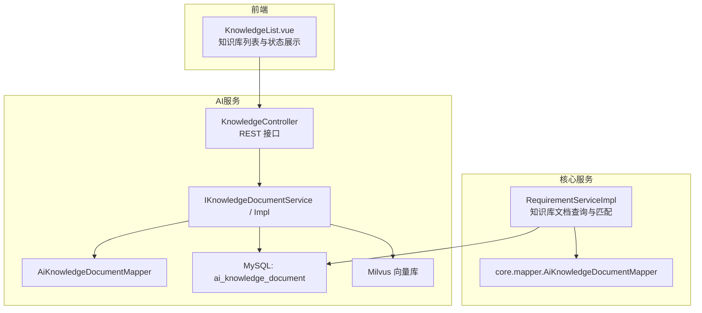
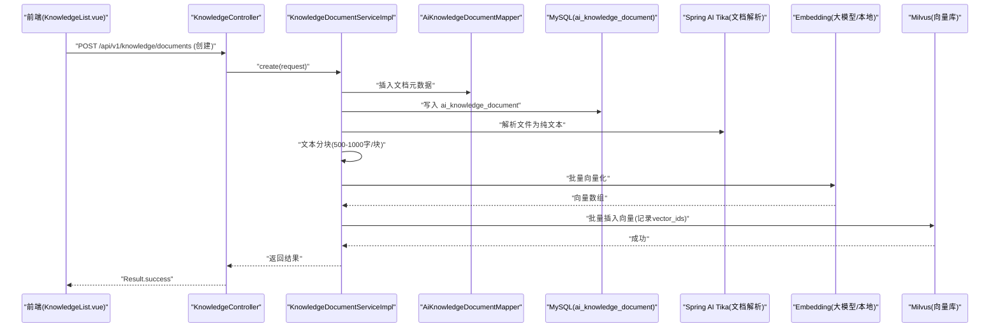
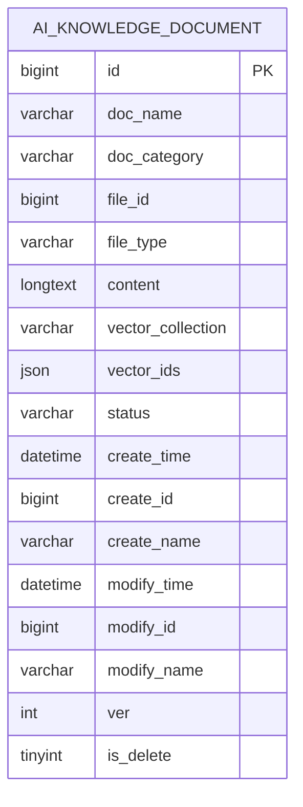
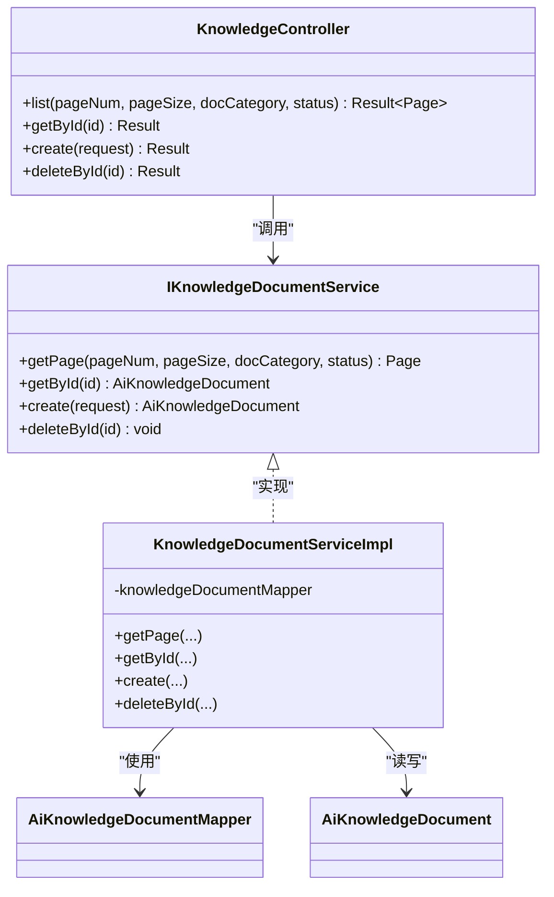
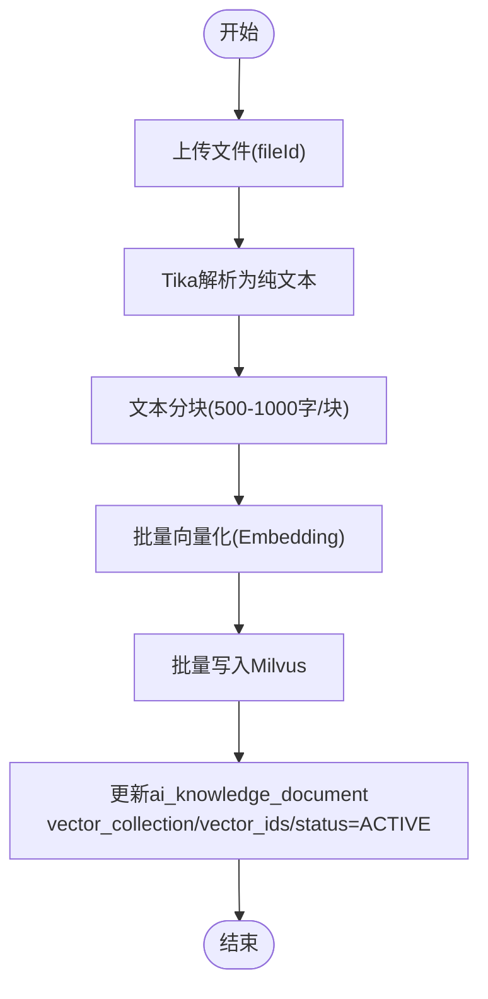
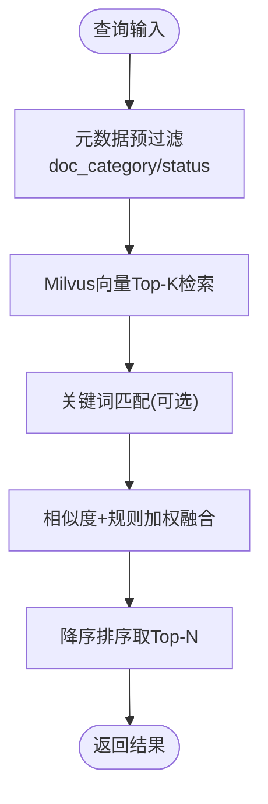
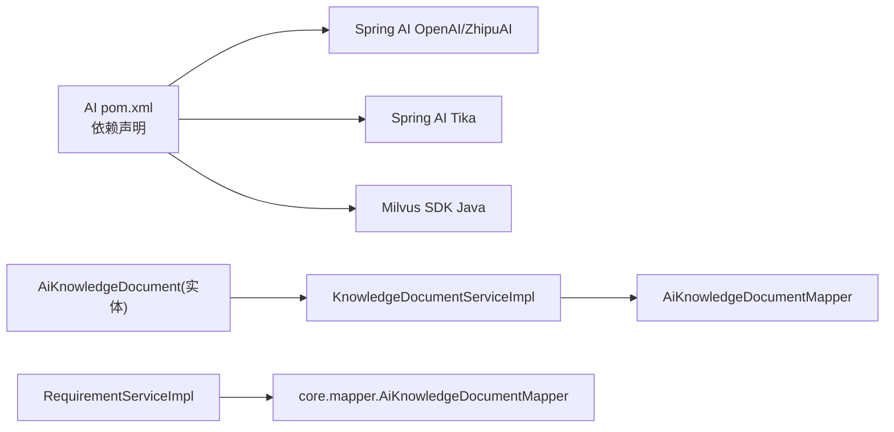

# 向量知识库管理

<cite>
**本文引用的文件**
- [ele-ai-tender-system/ele-ai-tender-ai/sql/init.sql](file://ele-ai-tender-system/ele-ai-tender-ai/sql/init.sql)
- [ele-ai-tender-system/ele-ai-tender-common/src/main/java/com/jy/eleaitender/common/entity/ai/AiKnowledgeDocument.java](file://ele-ai-tender-system/ele-ai-tender-common/src/main/java/com/jy/eleaitender/common/entity/ai/AiKnowledgeDocument.java)
- [ele-ai-tender-system/ele-ai-tender-ai/src/main/java/com/jy/eleaitender/ai/controller/KnowledgeController.java](file://ele-ai-tender-system/ele-ai-tender-ai/src/main/java/com/jy/eleaitender/ai/controller/KnowledgeController.java)
- [ele-ai-tender-system/ele-ai-tender-ai/src/main/java/com/jy/eleaitender/ai/service/IKnowledgeDocumentService.java](file://ele-ai-tender-system/ele-ai-tender-ai/src/main/java/com/jy/eleaitender/ai/service/IKnowledgeDocumentService.java)
- [ele-ai-tender-system/ele-ai-tender-ai/src/main/java/com/jy/eleaitender/ai/service/impl/KnowledgeDocumentServiceImpl.java](file://ele-ai-tender-system/ele-ai-tender-ai/src/main/java/com/jy/eleaitender/ai/service/impl/KnowledgeDocumentServiceImpl.java)
- [ele-ai-tender-system/ele-ai-tender-ai/src/main/java/com/jy/eleaitender/ai/mapper/AiKnowledgeDocumentMapper.java](file://ele-ai-tender-system/ele-ai-tender-ai/src/main/java/com/jy/eleaitender/ai/mapper/AiKnowledgeDocumentMapper.java)
- [ele-ai-tender-system/ele-ai-tender-core/src/main/java/com/jy/eleaitender/core/service/impl/RequirementServiceImpl.java](file://ele-ai-tender-system/ele-ai-tender-core/src/main/java/com/jy/eleaitender/core/service/impl/RequirementServiceImpl.java)
- [ele-ai-tender-system/ele-ai-tender-ai/src/main/java/com/jy/eleaitender/ai/dto/request/KnowledgeDocumentRequest.java](file://ele-ai-tender-system/ele-ai-tender-ai/src/main/java/com/jy/eleaitender/ai/dto/request/KnowledgeDocumentRequest.java)
- [ele-ai-tender-system/ele-ai-tender-ai/pom.xml](file://ele-ai-tender-system/ele-ai-tender-ai/pom.xml)
- [README.md](file://README.md)
- [CLAUDE.md](file://CLAUDE.md)
- [docs/guides/系统架构设计文档.md](file://docs/guides/系统架构设计文档.md)
- [ele-ai-tender-support-frontend/src/views/knowledge/KnowledgeList.vue](file://ele-ai-tender-support-frontend/src/views/knowledge/KnowledgeList.vue)
</cite>

## 目录
1. [简介](#简介)
2. [项目结构](#项目结构)
3. [核心组件](#核心组件)
4. [架构总览](#架构总览)
5. [详细组件分析](#详细组件分析)
6. [依赖分析](#依赖分析)
7. [性能考虑](#性能考虑)
8. [故障排查指南](#故障排查指南)
9. [结论](#结论)
10. [附录](#附录)

## 简介
本技术文档围绕“向量知识库管理系统”展开，聚焦以下目标：
- Milvus 向量数据库集成与配置要点
- 文档上传、解析、分块与向量化处理流程
- 语义检索实现（召回策略、相似度计算、排序）
- 知识库更新策略（增量索引、版本管理）
- 运维能力（监控、日志、可观测性）
- 构建最佳实践与性能调优建议

说明：当前仓库已具备知识库数据模型、API 与服务层骨架，Milvus SDK 与 Spring AI 依赖已声明；向量化与检索的具体客户端实现位于待开发或扩展位置。本文在现有代码基础上进行系统化梳理，并给出落地方案与演进路径。

## 项目结构
与知识库相关的后端模块主要分布在：
- ele-ai-tender-ai：AI 服务，包含知识库文档的控制器、服务接口与实现、数据访问映射器
- ele-ai-tender-common：通用实体定义，如 AiKnowledgeDocument
- ele-ai-tender-core：业务编排与需求生成等场景中对知识库文档的查询与匹配
- ele-ai-tender-support-frontend：支持端前端，提供知识库列表展示与管理操作入口
- SQL 初始化脚本：知识库文档表结构与索引定义
- 配置与依赖：pom.xml 中引入 Spring AI、Milvus SDK、Tika 文档解析等

图表来源
- [ele-ai-tender-system/ele-ai-tender-ai/src/main/java/com/jy/eleaitender/ai/controller/KnowledgeController.java:1-33](file://ele-ai-tender-system/ele-ai-tender-ai/src/main/java/com/jy/eleaitender/ai/controller/KnowledgeController.java#L1-L33)
- [ele-ai-tender-system/ele-ai-tender-ai/src/main/java/com/jy/eleaitender/ai/service/IKnowledgeDocumentService.java:1-12](file://ele-ai-tender-system/ele-ai-tender-ai/src/main/java/com/jy/eleaitender/ai/service/IKnowledgeDocumentService.java#L1-L12)
- [ele-ai-tender-system/ele-ai-tender-ai/src/main/java/com/jy/eleaitender/ai/service/impl/KnowledgeDocumentServiceImpl.java:1-30](file://ele-ai-tender-system/ele-ai-tender-ai/src/main/java/com/jy/eleaitender/ai/service/impl/KnowledgeDocumentServiceImpl.java#L1-L30)
- [ele-ai-tender-system/ele-ai-tender-ai/src/main/java/com/jy/eleaitender/ai/mapper/AiKnowledgeDocumentMapper.java](file://ele-ai-tender-system/ele-ai-tender-ai/src/main/java/com/jy/eleaitender/ai/mapper/AiKnowledgeDocumentMapper.java)
- [ele-ai-tender-system/ele-ai-tender-core/src/main/java/com/jy/eleaitender/core/service/impl/RequirementServiceImpl.java:334-396](file://ele-ai-tender-system/ele-ai-tender-core/src/main/java/com/jy/eleaitender/core/service/impl/RequirementServiceImpl.java#L334-L396)
- [ele-ai-tender-support-frontend/src/views/knowledge/KnowledgeList.vue:66-95](file://ele-ai-tender-support-frontend/src/views/knowledge/KnowledgeList.vue#L66-L95)

章节来源
- [ele-ai-tender-system/ele-ai-tender-ai/sql/init.sql:48-73](file://ele-ai-tender-system/ele-ai-tender-ai/sql/init.sql#L48-L73)
- [ele-ai-tender-system/ele-ai-tender-common/src/main/java/com/jy/eleaitender/common/entity/ai/AiKnowledgeDocument.java:1-30](file://ele-ai-tender-system/ele-ai-tender-common/src/main/java/com/jy/eleaitender/common/entity/ai/AiKnowledgeDocument.java#L1-L30)
- [ele-ai-tender-system/ele-ai-tender-ai/src/main/java/com/jy/eleaitender/ai/controller/KnowledgeController.java:1-33](file://ele-ai-tender-system/ele-ai-tender-ai/src/main/java/com/jy/eleaitender/ai/controller/KnowledgeController.java#L1-L33)
- [ele-ai-tender-system/ele-ai-tender-ai/src/main/java/com/jy/eleaitender/ai/service/IKnowledgeDocumentService.java:1-12](file://ele-ai-tender-system/ele-ai-tender-ai/src/main/java/com/jy/eleaitender/ai/service/IKnowledgeDocumentService.java#L1-L12)
- [ele-ai-tender-system/ele-ai-tender-ai/src/main/java/com/jy/eleaitender/ai/service/impl/KnowledgeDocumentServiceImpl.java:1-30](file://ele-ai-tender-system/ele-ai-tender-ai/src/main/java/com/jy/eleaitender/ai/service/impl/KnowledgeDocumentServiceImpl.java#L1-L30)
- [ele-ai-tender-system/ele-ai-tender-core/src/main/java/com/jy/eleaitender/core/service/impl/RequirementServiceImpl.java:334-396](file://ele-ai-tender-system/ele-ai-tender-core/src/main/java/com/jy/eleaitender/core/service/impl/RequirementServiceImpl.java#L334-L396)
- [ele-ai-tender-support-frontend/src/views/knowledge/KnowledgeList.vue:66-95](file://ele-ai-tender-support-frontend/src/views/knowledge/KnowledgeList.vue#L66-L95)

## 核心组件
- 数据模型：AiKnowledgeDocument 表示知识库文档，包含文档名称、类别、文件ID、类型、文本内容、向量集合名、向量ID列表、状态等字段，用于持久化元数据与向量关联信息。
- 控制层：KnowledgeController 暴露知识库文档分页查询等 REST 接口，统一返回 Result 包装。
- 服务层：IKnowledgeDocumentService 及其实现 KnowledgeDocumentServiceImpl 负责文档分页、按条件过滤、创建与删除等基础能力。
- 数据访问：AiKnowledgeDocumentMapper 对接 MySQL 存储，支撑 CRUD 与条件查询。
- 业务集成：RequirementServiceImpl 在需求相关场景中读取知识库文档，基于类别与关键词进行筛选与评分，辅助后续生成与匹配。
- 前端展示：KnowledgeList.vue 展示知识库文档列表、向量集合状态、状态标签及操作按钮。

章节来源
- [ele-ai-tender-system/ele-ai-tender-common/src/main/java/com/jy/eleaitender/common/entity/ai/AiKnowledgeDocument.java:1-30](file://ele-ai-tender-system/ele-ai-tender-common/src/main/java/com/jy/eleaitender/common/entity/ai/AiKnowledgeDocument.java#L1-L30)
- [ele-ai-tender-system/ele-ai-tender-ai/src/main/java/com/jy/eleaitender/ai/controller/KnowledgeController.java:1-33](file://ele-ai-tender-system/ele-ai-tender-ai/src/main/java/com/jy/eleaitender/ai/controller/KnowledgeController.java#L1-L33)
- [ele-ai-tender-system/ele-ai-tender-ai/src/main/java/com/jy/eleaitender/ai/service/IKnowledgeDocumentService.java:1-12](file://ele-ai-tender-system/ele-ai-tender-ai/src/main/java/com/jy/eleaitender/ai/service/IKnowledgeDocumentService.java#L1-L12)
- [ele-ai-tender-system/ele-ai-tender-ai/src/main/java/com/jy/eleaitender/ai/service/impl/KnowledgeDocumentServiceImpl.java:1-30](file://ele-ai-tender-system/ele-ai-tender-ai/src/main/java/com/jy/eleaitender/ai/service/impl/KnowledgeDocumentServiceImpl.java#L1-L30)
- [ele-ai-tender-system/ele-ai-tender-core/src/main/java/com/jy/eleaitender/core/service/impl/RequirementServiceImpl.java:334-396](file://ele-ai-tender-system/ele-ai-tender-core/src/main/java/com/jy/eleaitender/core/service/impl/RequirementServiceImpl.java#L334-L396)
- [ele-ai-tender-support-frontend/src/views/knowledge/KnowledgeList.vue:66-95](file://ele-ai-tender-support-frontend/src/views/knowledge/KnowledgeList.vue#L66-L95)

## 架构总览
整体架构由“文档入库 → 解析与分块 → 向量化 → 向量存储 → 检索与排序 → 结果融合”组成。当前阶段已完成数据模型与 API 骨架，Milvus SDK 与 Spring AI 依赖已就绪，向量化与检索逻辑可按如下方式落地。

图表来源
- [ele-ai-tender-system/ele-ai-tender-ai/src/main/java/com/jy/eleaitender/ai/controller/KnowledgeController.java:1-33](file://ele-ai-tender-system/ele-ai-tender-ai/src/main/java/com/jy/eleaitender/ai/controller/KnowledgeController.java#L1-L33)
- [ele-ai-tender-system/ele-ai-tender-ai/src/main/java/com/jy/eleaitender/ai/service/impl/KnowledgeDocumentServiceImpl.java:1-30](file://ele-ai-tender-system/ele-ai-tender-ai/src/main/java/com/jy/eleaitender/ai/service/impl/KnowledgeDocumentServiceImpl.java#L1-L30)
- [ele-ai-tender-system/ele-ai-tender-ai/src/main/java/com/jy/eleaitender/ai/mapper/AiKnowledgeDocumentMapper.java](file://ele-ai-tender-system/ele-ai-tender-ai/src/main/java/com/jy/eleaitender/ai/mapper/AiKnowledgeDocumentMapper.java)
- [ele-ai-tender-system/ele-ai-tender-ai/sql/init.sql:48-73](file://ele-ai-tender-system/ele-ai-tender-ai/sql/init.sql#L48-L73)
- [ele-ai-tender-system/ele-ai-tender-ai/pom.xml:81-104](file://ele-ai-tender-system/ele-ai-tender-ai/pom.xml#L81-L104)
- [README.md:10-10](file://README.md#L10-L10)
- [CLAUDE.md:10-10](file://CLAUDE.md#L10-L10)
- [docs/guides/系统架构设计文档.md:724-724](file://docs/guides/系统架构设计文档.md#L724-L724)

## 详细组件分析

### 数据模型与数据库设计
- 表 ai_knowledge_document 关键字段：
  - doc_name/doc_category/file_id/file_type/content：文档元信息与解析后的文本
  - vector_collection/vector_ids：指向 Milvus 集合与向量 ID 列表
  - status：ACTIVE/ARCHIVED/PROCESSING/FAILED 等生命周期状态
  - 审计字段：create_time/create_id/create_name/modify_time/modify_id/modify_name
  - 软删除与乐观锁：is_delete/ver
- 索引：
  - idx_category：按文档类别快速筛选
  - idx_status：按状态过滤
  - idx_file_id：按文件ID定位

图表来源
- [ele-ai-tender-system/ele-ai-tender-ai/sql/init.sql:48-73](file://ele-ai-tender-system/ele-ai-tender-ai/sql/init.sql#L48-L73)

章节来源
- [ele-ai-tender-system/ele-ai-tender-ai/sql/init.sql:48-73](file://ele-ai-tender-system/ele-ai-tender-ai/sql/init.sql#L48-L73)
- [ele-ai-tender-system/ele-ai-tender-common/src/main/java/com/jy/eleaitender/common/entity/ai/AiKnowledgeDocument.java:1-30](file://ele-ai-tender-system/ele-ai-tender-common/src/main/java/com/jy/eleaitender/common/entity/ai/AiKnowledgeDocument.java#L1-L30)

### 控制层与服务层
- KnowledgeController：
  - GET /api/v1/knowledge/documents：分页查询，支持 docCategory/status 过滤
  - 其他接口（根据 IKnowledgeDocumentService 定义）：getById、create、deleteById
- IKnowledgeDocumentService / KnowledgeDocumentServiceImpl：
  - getPage：按条件构造 LambdaQueryWrapper，分页返回
  - getById/deleteById：单条查询与删除
  - create：预留扩展点，用于触发解析、分块、向量化与 Milvus 写入

图表来源
- [ele-ai-tender-system/ele-ai-tender-ai/src/main/java/com/jy/eleaitender/ai/controller/KnowledgeController.java:1-33](file://ele-ai-tender-system/ele-ai-tender-ai/src/main/java/com/jy/eleaitender/ai/controller/KnowledgeController.java#L1-L33)
- [ele-ai-tender-system/ele-ai-tender-ai/src/main/java/com/jy/eleaitender/ai/service/IKnowledgeDocumentService.java:1-12](file://ele-ai-tender-system/ele-ai-tender-ai/src/main/java/com/jy/eleaitender/ai/service/IKnowledgeDocumentService.java#L1-L12)
- [ele-ai-tender-system/ele-ai-tender-ai/src/main/java/com/jy/eleaitender/ai/service/impl/KnowledgeDocumentServiceImpl.java:1-30](file://ele-ai-tender-system/ele-ai-tender-ai/src/main/java/com/jy/eleaitender/ai/service/impl/KnowledgeDocumentServiceImpl.java#L1-L30)
- [ele-ai-tender-system/ele-ai-tender-ai/src/main/java/com/jy/eleaitender/ai/mapper/AiKnowledgeDocumentMapper.java](file://ele-ai-tender-system/ele-ai-tender-ai/src/main/java/com/jy/eleaitender/ai/mapper/AiKnowledgeDocumentMapper.java)
- [ele-ai-tender-system/ele-ai-tender-common/src/main/java/com/jy/eleaitender/common/entity/ai/AiKnowledgeDocument.java:1-30](file://ele-ai-tender-system/ele-ai-tender-common/src/main/java/com/jy/eleaitender/common/entity/ai/AiKnowledgeDocument.java#L1-L30)

章节来源
- [ele-ai-tender-system/ele-ai-tender-ai/src/main/java/com/jy/eleaitender/ai/controller/KnowledgeController.java:1-33](file://ele-ai-tender-system/ele-ai-tender-ai/src/main/java/com/jy/eleaitender/ai/controller/KnowledgeController.java#L1-L33)
- [ele-ai-tender-system/ele-ai-tender-ai/src/main/java/com/jy/eleaitender/ai/service/IKnowledgeDocumentService.java:1-12](file://ele-ai-tender-system/ele-ai-tender-ai/src/main/java/com/jy/eleaitender/ai/service/IKnowledgeDocumentService.java#L1-L12)
- [ele-ai-tender-system/ele-ai-tender-ai/src/main/java/com/jy/eleaitender/ai/service/impl/KnowledgeDocumentServiceImpl.java:1-30](file://ele-ai-tender-system/ele-ai-tender-ai/src/main/java/com/jy/eleaitender/ai/service/impl/KnowledgeDocumentServiceImpl.java#L1-L30)

### 文档解析、分块与向量化流程
- 文档解析：通过 Spring AI Tika 将多种格式（DOC/DOCX/PDF/TXT/MD）转换为纯文本
- 文本分块：按 500-1000 字/块切分，保证语义完整性与检索精度
- 向量化：调用 Embedding 服务（OpenAI/ZhipuAI 等），生成向量
- 向量存储：批量写入 Milvus，同时记录 vector_collection 与 vector_ids 到数据库

图表来源
- [ele-ai-tender-system/ele-ai-tender-ai/pom.xml:81-104](file://ele-ai-tender-system/ele-ai-tender-ai/pom.xml#L81-L104)
- [docs/guides/系统架构设计文档.md:724-724](file://docs/guides/系统架构设计文档.md#L724-L724)
- [ele-ai-tender-system/ele-ai-tender-ai/sql/init.sql:48-73](file://ele-ai-tender-system/ele-ai-tender-ai/sql/init.sql#L48-L73)

章节来源
- [ele-ai-tender-system/ele-ai-tender-ai/pom.xml:81-104](file://ele-ai-tender-system/ele-ai-tender-ai/pom.xml#L81-L104)
- [docs/guides/系统架构设计文档.md:724-724](file://docs/guides/系统架构设计文档.md#L724-L724)

### 语义搜索与检索机制
- 召回策略：
  - 向量召回：以查询向量在 Milvus 中进行 Top-K 相似检索
  - 元数据过滤：结合 doc_category、status、file_id 等字段进行预过滤
- 相似度计算：
  - 默认余弦相似度（Cosine），也可根据业务选择内积或欧氏距离
- 排序算法：
  - 初排：向量相似度得分
  - 重排：结合关键词命中、类别权重、时间衰减等规则进行加权排序
- 结果融合：
  - 向量结果与关键词结果做去重与融合，输出最终 Top-N

[此图为概念流程图，不直接映射具体源码文件]

### 知识库更新策略与版本管理
- 增量索引：
  - 新增文档：走完整入库流程（解析→分块→向量化→Milvus写入）
  - 修改文档：标记旧版本为 ARCHIVED，新建 ACTIVE 版本，仅对变更部分增量向量化
  - 删除文档：软删除（is_delete=1），同步清理 Milvus 对应向量（依据 vector_ids）
- 版本管理：
  - 利用 ver 字段与 status 区分版本与生命周期
  - 保留历史向量以便回滚与审计
- 一致性保障：
  - 事务边界：数据库元数据与 Milvus 写入采用补偿/重试机制，确保最终一致

章节来源
- [ele-ai-tender-system/ele-ai-tender-ai/sql/init.sql:48-73](file://ele-ai-tender-system/ele-ai-tender-ai/sql/init.sql#L48-L73)
- [ele-ai-tender-system/ele-ai-tender-common/src/main/java/com/jy/eleaitender/common/entity/ai/AiKnowledgeDocument.java:1-30](file://ele-ai-tender-system/ele-ai-tender-common/src/main/java/com/jy/eleaitender/common/entity/ai/AiKnowledgeDocument.java#L1-L30)

### 前端展示与交互
- KnowledgeList.vue 展示知识库文档列表，包括文件大小、向量集合状态、状态标签、创建人与创建时间，并提供编辑与删除操作。
- 向量集合列显示“已向量化”标签，便于用户感知入库进度与质量。

章节来源
- [ele-ai-tender-support-frontend/src/views/knowledge/KnowledgeList.vue:66-95](file://ele-ai-tender-support-frontend/src/views/knowledge/KnowledgeList.vue#L66-L95)

## 依赖分析
- 外部依赖：
  - Spring AI：OpenAI、ZhipuAI 启动器，用于对话与嵌入能力
  - Spring AI Tika：文档解析
  - Milvus SDK Java：向量数据库客户端
- 内部依赖：
  - AI 服务依赖 common 中的 AiKnowledgeDocument 实体
  - Core 服务通过 Mapper 读取知识库文档，参与需求匹配与生成

图表来源
- [ele-ai-tender-system/ele-ai-tender-ai/pom.xml:81-104](file://ele-ai-tender-system/ele-ai-tender-ai/pom.xml#L81-L104)
- [ele-ai-tender-system/ele-ai-tender-common/src/main/java/com/jy/eleaitender/common/entity/ai/AiKnowledgeDocument.java:1-30](file://ele-ai-tender-system/ele-ai-tender-common/src/main/java/com/jy/eleaitender/common/entity/ai/AiKnowledgeDocument.java#L1-L30)
- [ele-ai-tender-system/ele-ai-tender-ai/src/main/java/com/jy/eleaitender/ai/service/impl/KnowledgeDocumentServiceImpl.java:1-30](file://ele-ai-tender-system/ele-ai-tender-ai/src/main/java/com/jy/eleaitender/ai/service/impl/KnowledgeDocumentServiceImpl.java#L1-L30)
- [ele-ai-tender-system/ele-ai-tender-core/src/main/java/com/jy/eleaitender/core/service/impl/RequirementServiceImpl.java:334-396](file://ele-ai-tender-system/ele-ai-tender-core/src/main/java/com/jy/eleaitender/core/service/impl/RequirementServiceImpl.java#L334-L396)

章节来源
- [ele-ai-tender-system/ele-ai-tender-ai/pom.xml:81-104](file://ele-ai-tender-system/ele-ai-tender-ai/pom.xml#L81-L104)
- [ele-ai-tender-system/ele-ai-tender-common/src/main/java/com/jy/eleaitender/common/entity/ai/AiKnowledgeDocument.java:1-30](file://ele-ai-tender-system/ele-ai-tender-common/src/main/java/com/jy/eleaitender/common/entity/ai/AiKnowledgeDocument.java#L1-L30)
- [ele-ai-tender-system/ele-ai-tender-ai/src/main/java/com/jy/eleaitender/ai/service/impl/KnowledgeDocumentServiceImpl.java:1-30](file://ele-ai-tender-system/ele-ai-tender-ai/src/main/java/com/jy/eleaitender/ai/service/impl/KnowledgeDocumentServiceImpl.java#L1-L30)
- [ele-ai-tender-system/ele-ai-tender-core/src/main/java/com/jy/eleaitender/core/service/impl/RequirementServiceImpl.java:334-396](file://ele-ai-tender-system/ele-ai-tender-core/src/main/java/com/jy/eleaitender/core/service/impl/RequirementServiceImpl.java#L334-L396)

## 性能考虑
- 分块策略：
  - 推荐 500-1000 字/块，兼顾上下文连贯性与检索精度
  - 对表格、公式等特殊结构进行预处理，避免噪声影响向量质量
- 向量化批处理：
  - 批量调用 Embedding，降低网络与模型开销
  - 控制并发度，避免大模型限流
- Milvus 参数：
  - 选择合适的度量类型（Cosine/Inner Product）
  - 合理设置 index_type 与 nlist/nprobe，平衡召回率与延迟
- 缓存与预热：
  - 热点文档的元数据与高频查询向量可缓存
  - 定期重建索引以提升大规模数据下的检索效率
- 资源隔离：
  - 向量化任务与在线检索分离线程池，避免相互影响

[本节为通用性能建议，不直接分析具体文件]

## 故障排查指南
- 常见问题：
  - 向量集合未创建：检查 Milvus 连接与集合初始化逻辑
  - 向量化失败：确认 Embedding 服务可用性与限流策略
  - 元数据不一致：核对 vector_ids 与 Milvus 实际向量是否对齐
- 日志与追踪：
  - 记录入库各阶段耗时与错误码
  - 关键链路埋点：解析、分块、向量化、Milvus 写入、检索
- 恢复策略：
  - 失败重试与幂等写入
  - 增量修复：基于差异重新向量化并替换旧向量

[本节为通用运维建议，不直接分析具体文件]

## 结论
本项目已具备知识库的数据模型、API 与服务层骨架，并引入了 Spring AI 与 Milvus SDK，为向量检索提供了坚实基础。下一步应重点完善：
- 文档解析与分块实现
- 向量化与 Milvus 写入流程
- 语义检索与排序策略
- 增量索引与版本管理
- 监控与可观测性建设

通过以上步骤，可实现高质量、可扩展的向量知识库系统，支撑招标文件编制等业务场景的智能检索与生成。

## 附录
- 环境与技术栈参考：
  - Milvus 2.3.3、Spring AI 1.1.0、Apache Tika 2.9.0
  - 向量数据库地址与集合命名规范见架构文档
- 配置项建议：
  - MILVUS_COLLECTION：集合名称
  - EMBEDDING_MODEL：嵌入模型标识
  - CHUNK_SIZE：分块大小
  - TOP_K：检索数量

章节来源
- [README.md:10-10](file://README.md#L10-L10)
- [CLAUDE.md:10-10](file://CLAUDE.md#L10-L10)
- [docs/guides/系统架构设计文档.md:498-498](file://docs/guides/系统架构设计文档.md#L498-L498)
- [docs/guides/系统架构设计文档.md:516-516](file://docs/guides/系统架构设计文档.md#L516-L516)