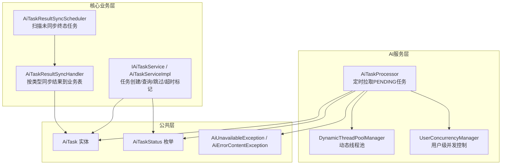
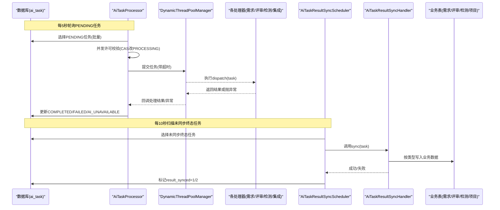
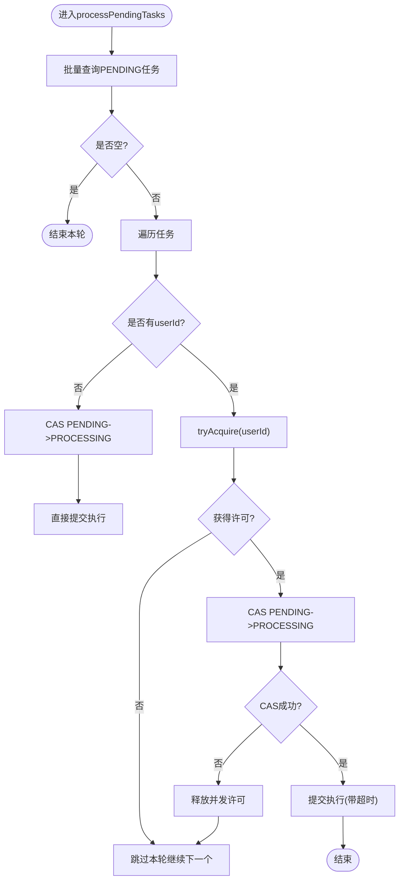
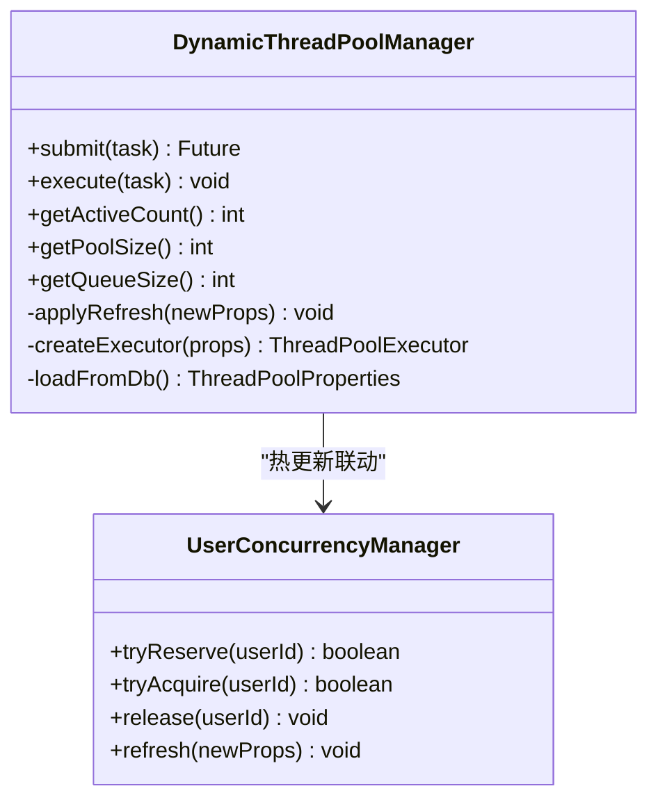
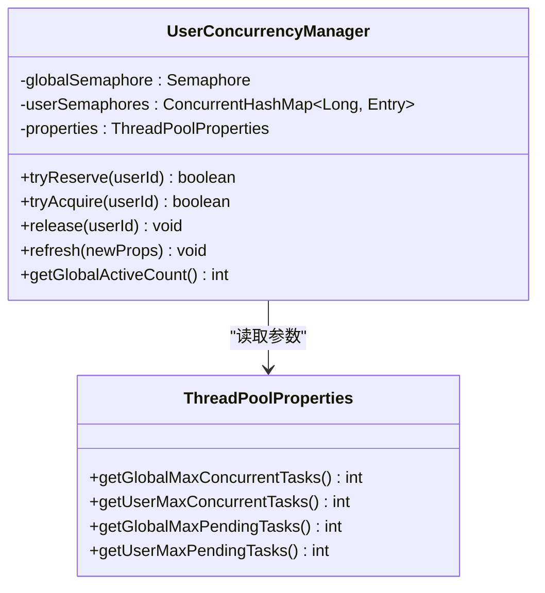
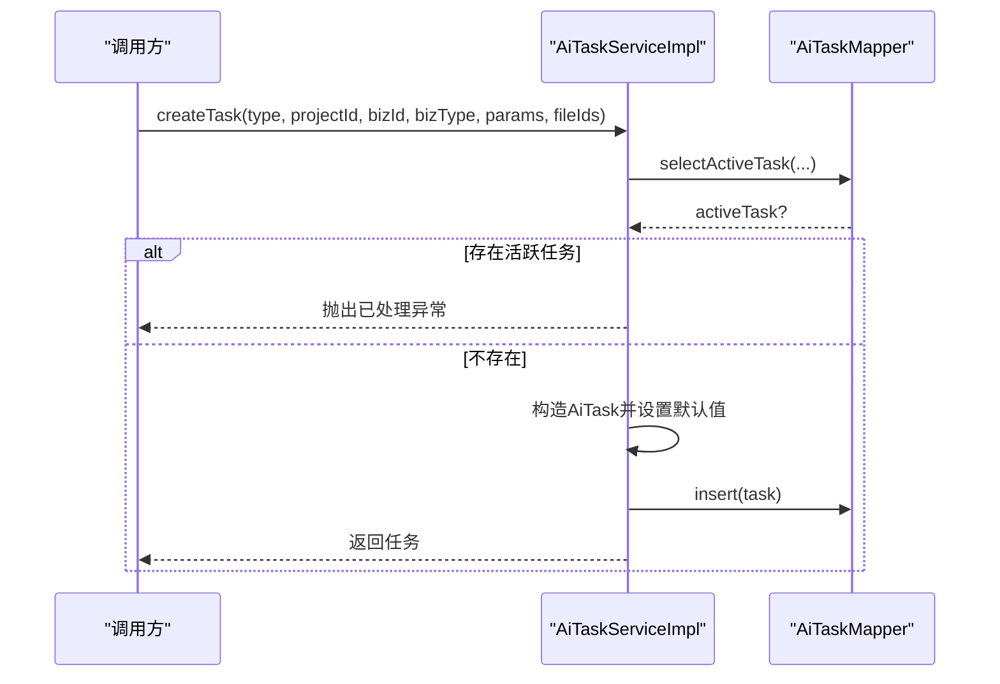
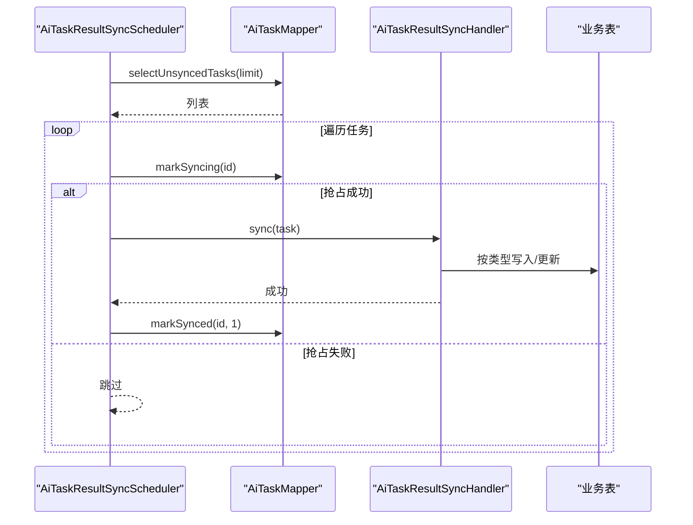
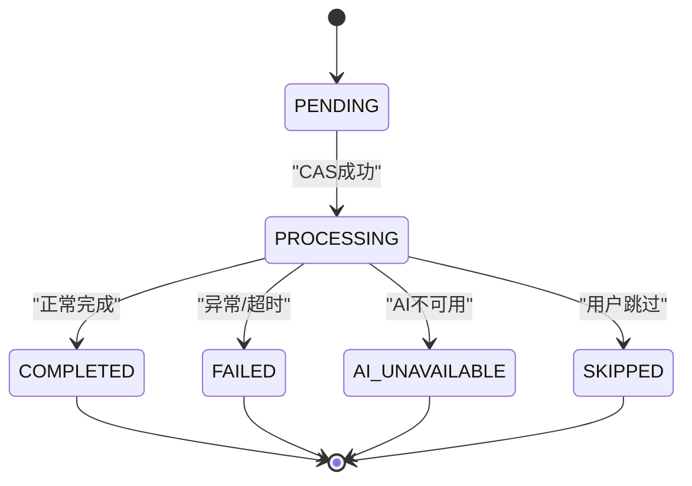
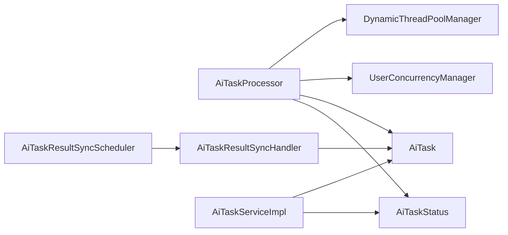

# AI任务生命周期管理

<cite>
**本文引用的文件**   
- [AiTaskProcessor.java](file://ele-ai-tender-system/ele-ai-tender-ai/src/main/java/com/jy/eleaitender/ai/processor/AiTaskProcessor.java)
- [DynamicThreadPoolManager.java](file://ele-ai-tender-system/ele-ai-tender-ai/src/main/java/com/jy/eleaitender/ai/threadpool/DynamicThreadPoolManager.java)
- [UserConcurrencyManager.java](file://ele-ai-tender-system/ele-ai-tender-ai/src/main/java/com/jy/eleaitender/ai/threadpool/UserConcurrencyManager.java)
- [AiTaskServiceImpl.java](file://ele-ai-tender-system/ele-ai-tender-core/src/main/java/com/jy/eleaitender/core/service/impl/AiTaskServiceImpl.java)
- [IAiTaskService.java](file://ele-ai-tender-system/ele-ai-tender-core/src/main/java/com/jy/eleaitender/core/service/IAiTaskService.java)
- [AiTaskResultSyncScheduler.java](file://ele-ai-tender-system/ele-ai-tender-core/src/main/java/com/jy/eleaitender/core/scheduler/AiTaskResultSyncScheduler.java)
- [AiTaskResultSyncHandler.java](file://ele-ai-tender-system/ele-ai-tender-core/src/main/java/com/jy/eleaitender/core/scheduler/AiTaskResultSyncHandler.java)
- [AiTask.java](file://ele-ai-tender-system/ele-ai-tender-common/src/main/java/com/jy/eleaitender/common/entity/ai/AiTask.java)
- [AiTaskStatus.java](file://ele-ai-tender-system/ele-ai-tender-common/src/main/java/com/jy/eleaitender/common/enums/AiTaskStatus.java)
- [AiUnavailableException.java](file://ele-ai-tender-system/ele-ai-tender-common/src/main/java/com/jy/eleaitender/common/exception/AiUnavailableException.java)
- [AiErrorContentException.java](file://ele-ai-tender-system/ele-ai-tender-common/src/main/java/com/jy/eleaitender/common/exception/AiErrorContentException.java)
- [application.yml](file://ele-ai-tender-system/ele-ai-tender-ai/src/main/resources/application.yml)
- [CORE_MODULE_SPEC.md](file://docs/rules/CORE_MODULE_SPEC.md)
</cite>

## 目录
1. [简介](#简介)
2. [项目结构](#项目结构)
3. [核心组件](#核心组件)
4. [架构总览](#架构总览)
5. [详细组件分析](#详细组件分析)
6. [依赖关系分析](#依赖关系分析)
7. [性能与容量规划](#性能与容量规划)
8. [故障诊断与排错指南](#故障诊断与排错指南)
9. [结论](#结论)
10. [附录](#附录)

## 简介
本技术文档围绕AI任务生命周期管理系统，系统性阐述从任务创建、提交、执行、监控、重试到完成的全链路机制。重点解析AiTaskProcessor的任务调度模型、状态机设计、异步执行与超时控制、错误处理策略，以及并发控制、负载均衡与资源隔离等高级能力；同时覆盖结果同步、监控接口、日志记录等运维支撑能力，并提供调试、优化与排障实践建议。

## 项目结构
系统采用多模块分层组织：
- 公共层（common）：定义任务实体、枚举、异常与通用DTO
- AI服务层（ai）：负责任务轮询、分发执行、线程池与并发控制
- 核心业务层（core）：提供任务服务接口、结果同步调度与处理器
- 前端（frontend/support-frontend）：展示任务进度与状态

图表来源
- [AiTaskProcessor.java:1-196](file://ele-ai-tender-system/ele-ai-tender-ai/src/main/java/com/jy/eleaitender/ai/processor/AiTaskProcessor.java#L1-L196)
- [DynamicThreadPoolManager.java:1-190](file://ele-ai-tender-system/ele-ai-tender-ai/src/main/java/com/jy/eleaitender/ai/threadpool/DynamicThreadPoolManager.java#L1-L190)
- [UserConcurrencyManager.java:1-131](file://ele-ai-tender-system/ele-ai-tender-ai/src/main/java/com/jy/eleaitender/ai/threadpool/UserConcurrencyManager.java#L1-L131)
- [IAiTaskService.java:1-43](file://ele-ai-tender-system/ele-ai-tender-core/src/main/java/com/jy/eleaitender/core/service/IAiTaskService.java#L1-L43)
- [AiTaskResultSyncScheduler.java:1-64](file://ele-ai-tender-system/ele-ai-tender-core/src/main/java/com/jy/eleaitender/core/scheduler/AiTaskResultSyncScheduler.java#L1-L64)
- [AiTaskResultSyncHandler.java:1-766](file://ele-ai-tender-system/ele-ai-tender-core/src/main/java/com/jy/eleaitender/core/scheduler/AiTaskResultSyncHandler.java#L1-L766)
- [AiTask.java:1-77](file://ele-ai-tender-system/ele-ai-tender-common/src/main/java/com/jy/eleaitender/common/entity/ai/AiTask.java#L1-L77)
- [AiTaskStatus.java:1-46](file://ele-ai-tender-system/ele-ai-tender-common/src/main/java/com/jy/eleaitender/common/enums/AiTaskStatus.java#L1-L46)
- [AiUnavailableException.java:1-31](file://ele-ai-tender-system/ele-ai-tender-common/src/main/java/com/jy/eleaitender/common/exception/AiUnavailableException.java#L1-L31)
- [AiErrorContentException.java:1-39](file://ele-ai-tender-system/ele-ai-tender-common/src/main/java/com/jy/eleaitender/common/exception/AiErrorContentException.java#L1-L39)

章节来源
- [CORE_MODULE_SPEC.md:155-195](file://docs/rules/CORE_MODULE_SPEC.md#L155-L195)

## 核心组件
- 任务调度器：定时轮询待处理任务，进行并发许可校验与CAS状态更新，提交至动态线程池执行，并统一捕获异常落库。
- 动态线程池：支持从数据库参数热更新核心/最大线程数、队列容量、保活时间、任务超时等，具备优雅关闭与重建能力。
- 并发控制：全局+用户级双维度并发限制，基于信号量实现“排队等待”，避免PROCESSING→PENDING弹跳。
- 任务服务：提供任务创建（防重）、状态查询、跳过、超时标记、最新任务查询、活跃任务检查等。
- 结果同步：定时扫描未同步的终态任务，按类型将结果持久化到业务表，并触发通知与状态联动。
- 实体与状态：统一的AiTask实体与AiTaskStatus枚举，明确终态与可重试语义。

章节来源
- [AiTaskProcessor.java:1-196](file://ele-ai-tender-system/ele-ai-tender-ai/src/main/java/com/jy/eleaitender/ai/processor/AiTaskProcessor.java#L1-L196)
- [DynamicThreadPoolManager.java:1-190](file://ele-ai-tender-system/ele-ai-tender-ai/src/main/java/com/jy/eleaitender/ai/threadpool/DynamicThreadPoolManager.java#L1-L190)
- [UserConcurrencyManager.java:1-131](file://ele-ai-tender-system/ele-ai-tender-ai/src/main/java/com/jy/eleaitender/ai/threadpool/UserConcurrencyManager.java#L1-L131)
- [IAiTaskService.java:1-43](file://ele-ai-tender-system/ele-ai-tender-core/src/main/java/com/jy/eleaitender/core/service/IAiTaskService.java#L1-L43)
- [AiTaskResultSyncScheduler.java:1-64](file://ele-ai-tender-system/ele-ai-tender-core/src/main/java/com/jy/eleaitender/core/scheduler/AiTaskResultSyncScheduler.java#L1-L64)
- [AiTaskResultSyncHandler.java:1-766](file://ele-ai-tender-system/ele-ai-tender-core/src/main/java/com/jy/eleaitender/core/scheduler/AiTaskResultSyncHandler.java#L1-L766)
- [AiTask.java:1-77](file://ele-ai-tender-system/ele-ai-tender-common/src/main/java/com/jy/eleaitender/common/entity/ai/AiTask.java#L1-L77)
- [AiTaskStatus.java:1-46](file://ele-ai-tender-system/ele-ai-tender-common/src/main/java/com/jy/eleaitender/common/enums/AiTaskStatus.java#L1-L46)

## 架构总览
整体流程分为“调度-执行-同步”三段式：
- 调度：每5秒轮询PENDING任务，先做并发许可校验，再CAS改为PROCESSING，随后提交执行。
- 执行：根据任务类型分发给具体处理器，带超时控制与异常分类处理。
- 同步：每10秒扫描未同步的终态任务，按类型写入业务数据并触发通知/状态流转。

图表来源
- [AiTaskProcessor.java:57-101](file://ele-ai-tender-system/ele-ai-tender-ai/src/main/java/com/jy/eleaitender/ai/processor/AiTaskProcessor.java#L57-L101)
- [AiTaskProcessor.java:127-167](file://ele-ai-tender-system/ele-ai-tender-ai/src/main/java/com/jy/eleaitender/ai/processor/AiTaskProcessor.java#L127-L167)
- [AiTaskResultSyncScheduler.java:26-63](file://ele-ai-tender-system/ele-ai-tender-core/src/main/java/com/jy/eleaitender/core/scheduler/AiTaskResultSyncScheduler.java#L26-L63)
- [AiTaskResultSyncHandler.java:72-104](file://ele-ai-tender-system/ele-ai-tender-core/src/main/java/com/jy/eleaitender/core/scheduler/AiTaskResultSyncHandler.java#L72-L104)

## 详细组件分析

### 任务调度器 AiTaskProcessor
- 轮询策略：固定延迟5秒拉取PENDING任务，批量上限可控。
- 并发控制：优先获取用户级与全局并发许可，再进行CAS状态变更，避免重复抢占与状态弹跳。
- 执行路径：无用户ID任务直接提交；有用户ID任务通过Future+超时控制，统一在回调中落库。
- 异常分类：区分AI不可用、内容异常、普通异常，分别落库为不同终态。
- 任务分发：按AiTaskType路由到文本优化、需求生成、评审项生成、文档集成、检测引擎等处理器。

图表来源
- [AiTaskProcessor.java:57-101](file://ele-ai-tender-system/ele-ai-tender-ai/src/main/java/com/jy/eleaitender/ai/processor/AiTaskProcessor.java#L57-L101)
- [AiTaskProcessor.java:127-167](file://ele-ai-tender-system/ele-ai-tender-ai/src/main/java/com/jy/eleaitender/ai/processor/AiTaskProcessor.java#L127-L167)

章节来源
- [AiTaskProcessor.java:1-196](file://ele-ai-tender-system/ele-ai-tender-ai/src/main/java/com/jy/eleaitender/ai/processor/AiTaskProcessor.java#L1-L196)

### 动态线程池 DynamicThreadPoolManager
- 参数来源：从系统参数表读取AI_THREAD_POOL组配置，启动时初始化，运行时每10秒轮询Hash变化自动刷新。
- 热更新策略：队列容量变更则重建线程池；否则调整核心/最大线程数与保活时间；同时联动并发控制参数刷新。
- 拒绝策略：CallerRunsPolicy，保证背压与稳定性。
- 指标暴露：提供活跃数、池大小、队列长度等统计方法。

图表来源
- [DynamicThreadPoolManager.java:1-190](file://ele-ai-tender-system/ele-ai-tender-ai/src/main/java/com/jy/eleaitender/ai/threadpool/DynamicThreadPoolManager.java#L1-L190)
- [UserConcurrencyManager.java:1-131](file://ele-ai-tender-system/ele-ai-tender-ai/src/main/java/com/jy/eleaitender/ai/threadpool/UserConcurrencyManager.java#L1-L131)

章节来源
- [DynamicThreadPoolManager.java:1-190](file://ele-ai-tender-system/ele-ai-tender-ai/src/main/java/com/jy/eleaitender/ai/threadpool/DynamicThreadPoolManager.java#L1-L190)

### 并发控制 UserConcurrencyManager
- 双维度控制：
  - 发起数：基于数据库统计PENDING+PROCESSING数量，超限直接拒绝。
  - 并发数：基于Semaphore控制PROCESSING数量，满则排队等待。
- 热更新：新许可数=新上限-当前活跃数，确保刷新后并发控制不失效。
- 使用场景：在调度器中先获取并发许可，再进行CAS状态更新，避免状态弹跳。

图表来源
- [UserConcurrencyManager.java:1-131](file://ele-ai-tender-system/ele-ai-tender-ai/src/main/java/com/jy/eleaitender/ai/threadpool/UserConcurrencyManager.java#L1-L131)

章节来源
- [UserConcurrencyManager.java:1-131](file://ele-ai-tender-system/ele-ai-tender-ai/src/main/java/com/jy/eleaitender/ai/threadpool/UserConcurrencyManager.java#L1-L131)

### 任务服务 IAiTaskService / AiTaskServiceImpl
- 创建任务：防重复提交（同一业务同一类型不允许活跃任务），设置默认重试次数与超时，序列化请求参数。
- 查询状态：封装VO，包含任务类型/状态名称映射。
- 跳过任务：仅允许非终态或特定终态下操作。
- 超时标记：定时任务调用，将超时任务标记为AI_UNAVAILABLE。
- 活跃任务检查：用于页面加载时判断是否已有进行中任务。

图表来源
- [AiTaskServiceImpl.java:31-62](file://ele-ai-tender-system/ele-ai-tender-core/src/main/java/com/jy/eleaitender/core/service/impl/AiTaskServiceImpl.java#L31-L62)
- [IAiTaskService.java:11-43](file://ele-ai-tender-system/ele-ai-tender-core/src/main/java/com/jy/eleaitender/core/service/IAiTaskService.java#L11-L43)

章节来源
- [IAiTaskService.java:1-43](file://ele-ai-tender-system/ele-ai-tender-core/src/main/java/com/jy/eleaitender/core/service/IAiTaskService.java#L1-L43)
- [AiTaskServiceImpl.java:1-148](file://ele-ai-tender-system/ele-ai-tender-core/src/main/java/com/jy/eleaitender/core/service/impl/AiTaskServiceImpl.java#L1-L148)

### 结果同步 AiTaskResultSyncScheduler / AiTaskResultSyncHandler
- 调度器：每10秒扫描未同步的终态任务，CAS抢占后交由处理器同步。
- 处理器：按任务类型分发到对应同步逻辑，包括需求生成、评审项生成、文档集成、检测记录等；失败时标记同步失败状态，不影响主流程。
- 业务联动：检测完成后汇总问题数并驱动项目状态机流转，发送消息通知，必要时自动创建版本快照。

图表来源
- [AiTaskResultSyncScheduler.java:26-63](file://ele-ai-tender-system/ele-ai-tender-core/src/main/java/com/jy/eleaitender/core/scheduler/AiTaskResultSyncScheduler.java#L26-L63)
- [AiTaskResultSyncHandler.java:72-104](file://ele-ai-tender-system/ele-ai-tender-core/src/main/java/com/jy/eleaitender/core/scheduler/AiTaskResultSyncHandler.java#L72-L104)

章节来源
- [AiTaskResultSyncScheduler.java:1-64](file://ele-ai-tender-system/ele-ai-tender-core/src/main/java/com/jy/eleaitender/core/scheduler/AiTaskResultSyncScheduler.java#L1-L64)
- [AiTaskResultSyncHandler.java:1-766](file://ele-ai-tender-system/ele-ai-tender-core/src/main/java/com/jy/eleaitender/core/scheduler/AiTaskResultSyncHandler.java#L1-L766)

### 任务实体与状态机
- 实体字段：任务类型、关联项目/业务ID、请求参数JSON、文件ID列表、状态、结果JSON、错误信息、重试计数、最大重试、开始/完成时间、超时分钟、结果同步标志。
- 状态机：PENDING → PROCESSING → COMPLETED/FAILED/AI_UNAVAILABLE/SKIPPED；其中FAILED与AI_UNAVAILABLE可重试。
- 规则约束：终态判定、可重试判定、结果同步双维度（status + result_synced）。

图表来源
- [AiTaskStatus.java:11-45](file://ele-ai-tender-system/ele-ai-tender-common/src/main/java/com/jy/eleaitender/common/enums/AiTaskStatus.java#L11-L45)
- [CORE_MODULE_SPEC.md:187-195](file://docs/rules/CORE_MODULE_SPEC.md#L187-L195)

章节来源
- [AiTask.java:1-77](file://ele-ai-tender-system/ele-ai-tender-common/src/main/java/com/jy/eleaitender/common/entity/ai/AiTask.java#L1-L77)
- [AiTaskStatus.java:1-46](file://ele-ai-tender-system/ele-ai-tender-common/src/main/java/com/jy/eleaitender/common/enums/AiTaskStatus.java#L1-L46)
- [CORE_MODULE_SPEC.md:187-195](file://docs/rules/CORE_MODULE_SPEC.md#L187-L195)

## 依赖关系分析
- 组件耦合：
  - AiTaskProcessor依赖线程池与并发管理器，解耦了具体处理器实现。
  - 结果同步调度与处理器独立于执行阶段，降低执行期复杂度。
- 外部依赖：
  - 数据库：任务表、业务表、系统参数表。
  - Redis：应用配置中启用，可用于扩展限流/缓存（当前代码未直接使用）。
- 潜在循环依赖：未发现直接循环引用；线程池与并发控制通过属性注入与懒加载规避。

图表来源
- [AiTaskProcessor.java:1-196](file://ele-ai-tender-system/ele-ai-tender-ai/src/main/java/com/jy/eleaitender/ai/processor/AiTaskProcessor.java#L1-L196)
- [DynamicThreadPoolManager.java:1-190](file://ele-ai-tender-system/ele-ai-tender-ai/src/main/java/com/jy/eleaitender/ai/threadpool/DynamicThreadPoolManager.java#L1-L190)
- [UserConcurrencyManager.java:1-131](file://ele-ai-tender-system/ele-ai-tender-ai/src/main/java/com/jy/eleaitender/ai/threadpool/UserConcurrencyManager.java#L1-L131)
- [AiTaskResultSyncScheduler.java:1-64](file://ele-ai-tender-system/ele-ai-tender-core/src/main/java/com/jy/eleaitender/core/scheduler/AiTaskResultSyncScheduler.java#L1-L64)
- [AiTaskResultSyncHandler.java:1-766](file://ele-ai-tender-system/ele-ai-tender-core/src/main/java/com/jy/eleaitender/core/scheduler/AiTaskResultSyncHandler.java#L1-L766)
- [AiTaskServiceImpl.java:1-148](file://ele-ai-tender-system/ele-ai-tender-core/src/main/java/com/jy/eleaitender/core/service/impl/AiTaskServiceImpl.java#L1-L148)
- [AiTask.java:1-77](file://ele-ai-tender-system/ele-ai-tender-common/src/main/java/com/jy/eleaitender/common/entity/ai/AiTask.java#L1-L77)
- [AiTaskStatus.java:1-46](file://ele-ai-tender-system/ele-ai-tender-common/src/main/java/com/jy/eleaitender/common/enums/AiTaskStatus.java#L1-L46)

## 性能与容量规划
- 线程池参数：
  - 核心/最大线程数、队列容量、保活时间、任务超时分钟均可通过系统参数表热更新。
  - 建议依据CPU核数与IO密集程度调优，队列容量需结合峰值QPS评估。
- 并发控制：
  - 全局并发与用户并发分开限制，避免单用户独占资源。
  - 发起数限制防止雪崩，配合排队等待提升吞吐稳定性。
- 超时控制：
  - 任务级超时优先于全局配置，避免长尾任务阻塞。
- 资源隔离：
  - 用户级并发信号量实现软隔离；未来可扩展为按租户/项目维度的隔离。
- 监控指标：
  - 线程池活跃数、池大小、队列长度；任务成功率、失败率、平均耗时、超时率。

章节来源
- [DynamicThreadPoolManager.java:1-190](file://ele-ai-tender-system/ele-ai-tender-ai/src/main/java/com/jy/eleaitender/ai/threadpool/DynamicThreadPoolManager.java#L1-L190)
- [UserConcurrencyManager.java:1-131](file://ele-ai-tender-system/ele-ai-tender-ai/src/main/java/com/jy/eleaitender/ai/threadpool/UserConcurrencyManager.java#L1-L131)
- [application.yml:1-72](file://ele-ai-tender-system/ele-ai-tender-ai/src/main/resources/application.yml#L1-L72)

## 故障诊断与排错指南
- 常见问题定位
  - 任务卡住：检查是否处于PROCESSING且长时间无进展，确认是否被其他实例抢占或并发已满。
  - 超时失败：核对任务超时配置与业务实际耗时，适当增大超时或拆分任务。
  - AI不可用：关注AI服务健康与模型路由可用性，必要时降级或切换备用模型。
  - 结果未同步：查看result_synced标志位，排查同步处理器异常与业务表写入权限。
- 关键日志与断点
  - 调度器日志：轮询批次、并发许可、CAS结果、提交执行、完成/失败。
  - 线程池日志：参数变更、重建过程、关闭过程。
  - 同步日志：未同步任务发现、同步成功/失败、业务状态联动。
- 恢复策略
  - 重启清理：服务启动/关闭时清理残留PROCESSING任务，避免僵尸任务。
  - 重试与跳过：对可重试状态支持重试；用户可主动跳过任务以推进流程。
  - 幂等与去重：创建任务前检查活跃任务，避免重复提交。

章节来源
- [AiTaskProcessor.java:103-167](file://ele-ai-tender-system/ele-ai-tender-ai/src/main/java/com/jy/eleaitender/ai/processor/AiTaskProcessor.java#L103-L167)
- [DynamicThreadPoolManager.java:46-82](file://ele-ai-tender-system/ele-ai-tender-ai/src/main/java/com/jy/eleaitender/ai/threadpool/DynamicThreadPoolManager.java#L46-L82)
- [AiTaskResultSyncScheduler.java:26-63](file://ele-ai-tender-system/ele-ai-tender-core/src/main/java/com/jy/eleaitender/core/scheduler/AiTaskResultSyncScheduler.java#L26-L63)
- [AiTaskResultSyncHandler.java:72-104](file://ele-ai-tender-system/ele-ai-tender-core/src/main/java/com/jy/eleaitender/core/scheduler/AiTaskResultSyncHandler.java#L72-L104)
- [AiTaskServiceImpl.java:73-99](file://ele-ai-tender-system/ele-ai-tender-core/src/main/java/com/jy/eleaitender/core/service/impl/AiTaskServiceImpl.java#L73-L99)

## 结论
本系统通过“调度-执行-同步”三段式架构实现了AI任务的稳定、可控、可观测的生命周期管理。借助动态线程池与用户级并发控制，系统在保障吞吐的同时有效抑制热点与雪崩风险；结果同步与状态机联动确保了业务一致性与用户体验。后续可在重试策略精细化、指标采集完善、资源隔离增强等方面持续演进。

## 附录
- 配置参考
  - 应用端口、数据源、Redis、AI模型基础URL、JWT、内部文件服务地址、日志级别等。
- 相关规范
  - 项目状态流转、编制阶段流转、AI任务进度与终态规则等。

章节来源
- [application.yml:1-72](file://ele-ai-tender-system/ele-ai-tender-ai/src/main/resources/application.yml#L1-L72)
- [CORE_MODULE_SPEC.md:155-195](file://docs/rules/CORE_MODULE_SPEC.md#L155-L195)