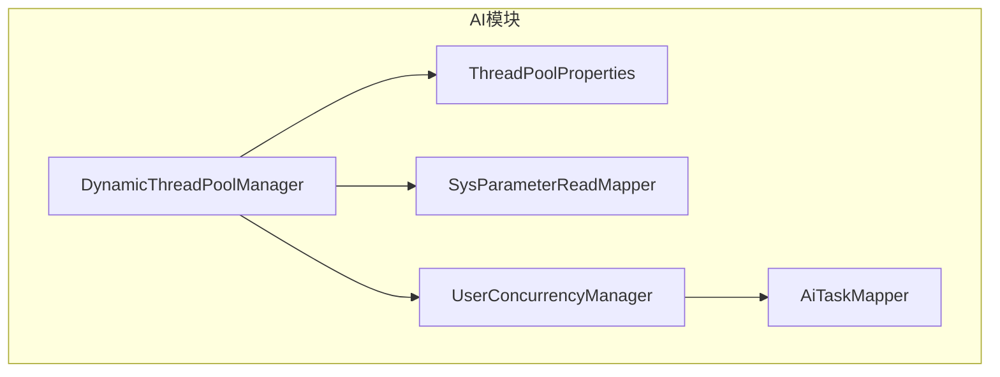
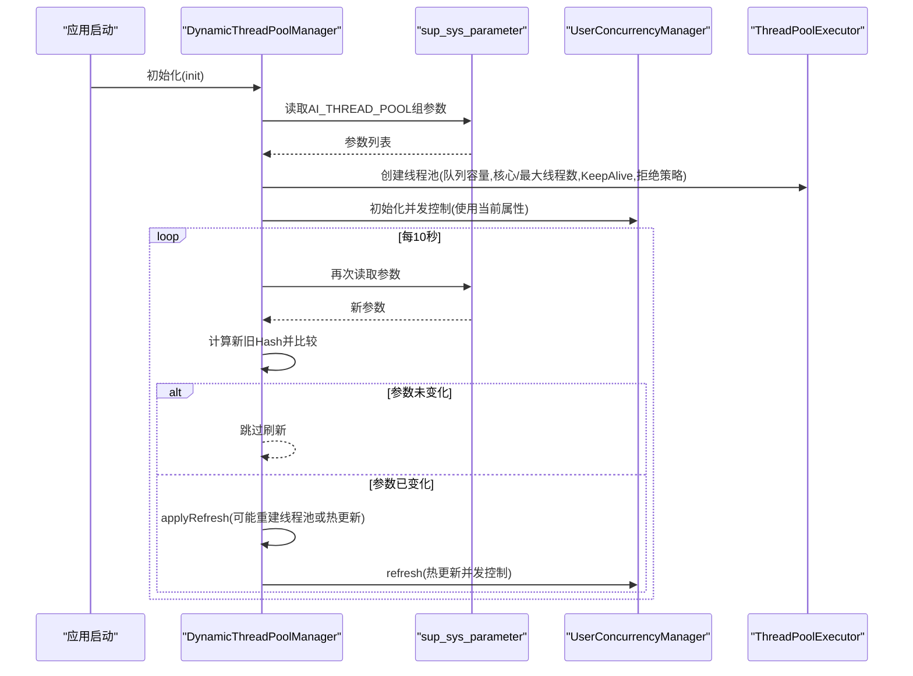
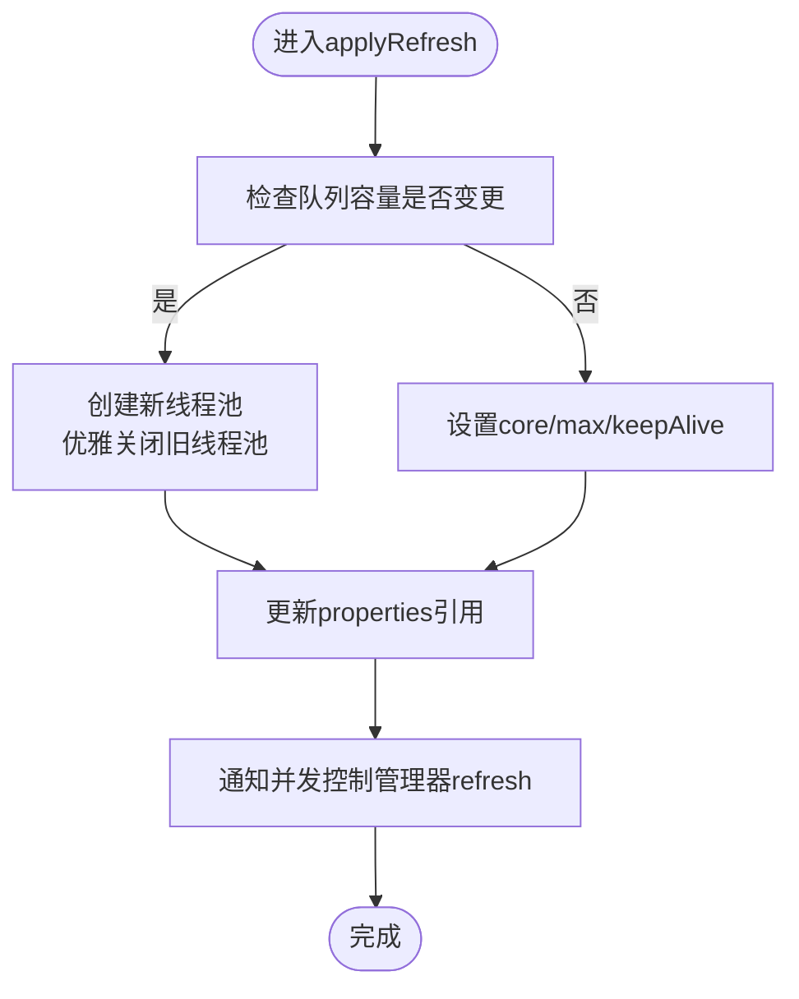
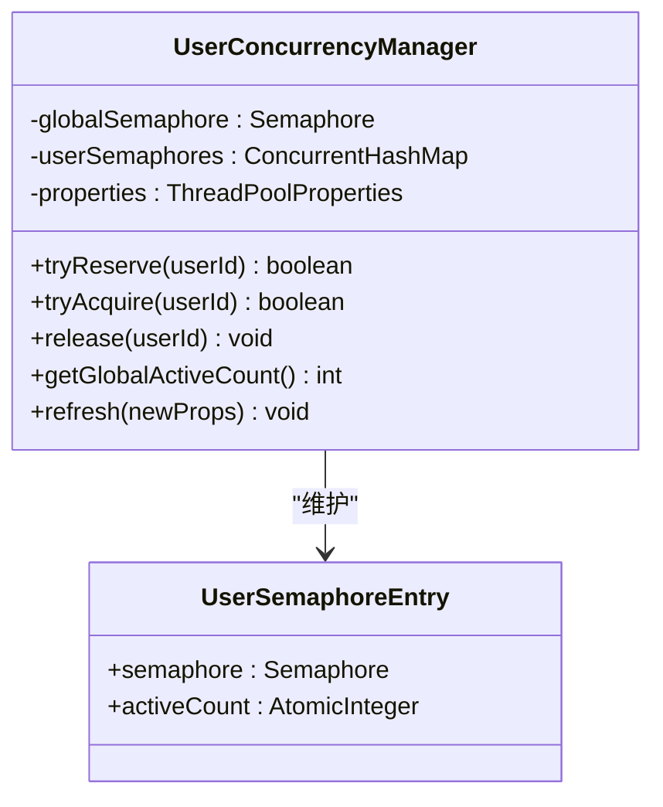
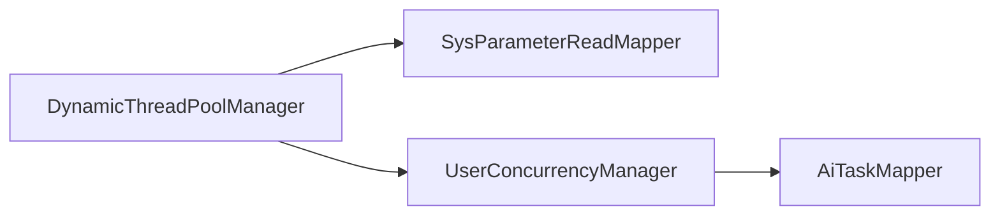

# 动态线程池管理

<cite>
**本文引用的文件**   
- [DynamicThreadPoolManager.java](file://ele-ai-tender-system/ele-ai-tender-ai/src/main/java/com/jy/eleaitender/ai/threadpool/DynamicThreadPoolManager.java)
- [UserConcurrencyManager.java](file://ele-ai-tender-system/ele-ai-tender-ai/src/main/java/com/jy/eleaitender/ai/threadpool/UserConcurrencyManager.java)
- [ThreadPoolProperties.java](file://ele-ai-tender-system/ele-ai-tender-ai/src/main/java/com/jy/eleaitender/ai/config/ThreadPoolProperties.java)
- [SysParameterReadMapper.java](file://ele-ai-tender-system/ele-ai-tender-ai/src/main/java/com/jy/eleaitender/ai/mapper/SysParameterReadMapper.java)
- [AiTaskMapper.java](file://ele-ai-tender-system/ele-ai-tender-ai/src/main/java/com/jy/eleaitender/ai/mapper/AiTaskMapper.java)
</cite>

## 目录
1. [简介](#简介)
2. [项目结构](#项目结构)
3. [核心组件](#核心组件)
4. [架构总览](#架构总览)
5. [详细组件分析](#详细组件分析)
6. [依赖关系分析](#依赖关系分析)
7. [性能与调优建议](#性能与调优建议)
8. [故障恢复与排障指南](#故障恢复与排障指南)
9. [结论](#结论)

## 简介
本技术文档聚焦于动态线程池管理系统，围绕 DynamicThreadPoolManager 的核心实现展开，涵盖从数据库动态加载配置、运行时热更新机制、线程池参数监控、拒绝策略选择原因与效果、并发控制与状态监控接口、性能指标收集思路以及故障恢复机制等。同时提供线程池调优建议和最佳实践，帮助读者在生产环境中安全、高效地运行 AI 任务处理流程。

## 项目结构
该功能位于 AI 模块中，主要涉及以下包与类：
- 线程池管理与并发控制：threadpool 包下的 DynamicThreadPoolManager 与 UserConcurrencyManager
- 动态参数模型：config 包下的 ThreadPoolProperties
- 数据访问层：mapper 包下的 SysParameterReadMapper（系统参数只读）与 AiTaskMapper（AI 任务统计与状态变更）

图表来源
- [DynamicThreadPoolManager.java:1-190](file://ele-ai-tender-system/ele-ai-tender-ai/src/main/java/com/jy/eleaitender/ai/threadpool/DynamicThreadPoolManager.java#L1-L190)
- [UserConcurrencyManager.java:1-131](file://ele-ai-tender-system/ele-ai-tender-ai/src/main/java/com/jy/eleaitender/ai/threadpool/UserConcurrencyManager.java#L1-L131)
- [ThreadPoolProperties.java:1-40](file://ele-ai-tender-system/ele-ai-tender-ai/src/main/java/com/jy/eleaitender/ai/config/ThreadPoolProperties.java#L1-L40)
- [SysParameterReadMapper.java:1-13](file://ele-ai-tender-system/ele-ai-tender-ai/src/main/java/com/jy/eleaitender/ai/mapper/SysParameterReadMapper.java#L1-L13)
- [AiTaskMapper.java:1-107](file://ele-ai-tender-system/ele-ai-tender-ai/src/main/java/com/jy/eleaitender/ai/mapper/AiTaskMapper.java#L1-L107)

章节来源
- [DynamicThreadPoolManager.java:1-190](file://ele-ai-tender-system/ele-ai-tender-ai/src/main/java/com/jy/eleaitender/ai/threadpool/DynamicThreadPoolManager.java#L1-L190)
- [UserConcurrencyManager.java:1-131](file://ele-ai-tender-system/ele-ai-tender-ai/src/main/java/com/jy/eleaitender/ai/threadpool/UserConcurrencyManager.java#L1-L131)
- [ThreadPoolProperties.java:1-40](file://ele-ai-tender-system/ele-ai-tender-ai/src/main/java/com/jy/eleaitender/ai/config/ThreadPoolProperties.java#L1-L40)
- [SysParameterReadMapper.java:1-13](file://ele-ai-tender-system/ele-ai-tender-ai/src/main/java/com/jy/eleaitender/ai/mapper/SysParameterReadMapper.java#L1-L13)
- [AiTaskMapper.java:1-107](file://ele-ai-tender-system/ele-ai-tender-ai/src/main/java/com/jy/eleaitender/ai/mapper/AiTaskMapper.java#L1-L107)

## 核心组件
- DynamicThreadPoolManager：负责线程池生命周期管理、从数据库加载参数、基于 Hash 的变更检测与热更新、对外暴露提交与监控接口。
- UserConcurrencyManager：实现用户级与全局并发控制，支持热更新并发上限并保证刷新后并发控制不失效。
- ThreadPoolProperties：承载所有可动态调整的参数，并提供 computeHash 方法用于变更检测。
- SysParameterReadMapper：读取 sup_sys_parameter 表中 AI_THREAD_POOL 组的参数键值对。
- AiTaskMapper：提供任务计数与状态更新能力，支撑并发控制的“发起数”限制与任务流转。

章节来源
- [DynamicThreadPoolManager.java:29-189](file://ele-ai-tender-system/ele-ai-tender-ai/src/main/java/com/jy/eleaitender/ai/threadpool/DynamicThreadPoolManager.java#L29-L189)
- [UserConcurrencyManager.java:21-130](file://ele-ai-tender-system/ele-ai-tender-ai/src/main/java/com/jy/eleaitender/ai/threadpool/UserConcurrencyManager.java#L21-L130)
- [ThreadPoolProperties.java:8-39](file://ele-ai-tender-system/ele-ai-tender-ai/src/main/java/com/jy/eleaitender/ai/config/ThreadPoolProperties.java#L8-L39)
- [SysParameterReadMapper.java:10-12](file://ele-ai-tender-system/ele-ai-tender-ai/src/main/java/com/jy/eleaitender/ai/mapper/SysParameterReadMapper.java#L10-L12)
- [AiTaskMapper.java:17-106](file://ele-ai-tender-system/ele-ai-tender-ai/src/main/java/com/jy/eleaitender/ai/mapper/AiTaskMapper.java#L17-L106)

## 架构总览
下图展示了动态线程池管理的整体交互：启动时从数据库加载参数并创建线程池；定时任务轮询数据库参数，通过 Hash 比较决定是否重建或热更新；并发控制由 UserConcurrencyManager 维护，支持用户级与全局并发上限；外部服务通过 DynamicThreadPoolManager 提交任务并获取监控指标。

图表来源
- [DynamicThreadPoolManager.java:46-82](file://ele-ai-tender-system/ele-ai-tender-ai/src/main/java/com/jy/eleaitender/ai/threadpool/DynamicThreadPoolManager.java#L46-L82)
- [DynamicThreadPoolManager.java:113-145](file://ele-ai-tender-system/ele-ai-tender-ai/src/main/java/com/jy/eleaitender/ai/threadpool/DynamicThreadPoolManager.java#L113-L145)
- [UserConcurrencyManager.java:105-116](file://ele-ai-tender-system/ele-ai-tender-ai/src/main/java/com/jy/eleaitender/ai/threadpool/UserConcurrencyManager.java#L105-L116)

## 详细组件分析

### DynamicThreadPoolManager 核心实现
- 初始化流程
  - 启动时从数据库加载 AI_THREAD_POOL 组参数，构造 ThreadPoolProperties，计算 Hash 缓存，创建线程池并记录日志。
- 定时轮询与热更新
  - 每 10 秒执行一次 checkAndRefreshIfNeeded：读取最新参数并计算 Hash，若与缓存一致则跳过；否则调用 applyRefresh 进行热更新。
- 参数变更检测算法（基于 Hash）
  - ThreadPoolProperties.computeHash 将所有 key=value 拼接为字符串后取 hashCode，生成十六进制字符串作为参数指纹。
- 线程池重建策略
  - 当队列容量发生变更时，需要重建线程池：先创建新实例，再优雅关闭旧实例（awaitTermination 超时保护），避免中断导致资源泄漏。
  - 非队列容量变更时，直接 setCorePoolSize、setMaximumPoolSize、setKeepAliveTime 完成热更新。
- 拒绝策略选择与效果
  - 采用 CallerRunsPolicy：当线程池饱和时，由调用线程直接执行任务，起到天然背压作用，降低丢任务风险，但会拖慢调用方响应时间，适合对稳定性要求高且可接受一定延迟的场景。
- 监控接口
  - 暴露 getActiveCount、getPoolSize、getQueueSize 等指标，便于上层集成监控系统。

图表来源
- [DynamicThreadPoolManager.java:113-145](file://ele-ai-tender-system/ele-ai-tender-ai/src/main/java/com/jy/eleaitender/ai/threadpool/DynamicThreadPoolManager.java#L113-L145)

章节来源
- [DynamicThreadPoolManager.java:46-82](file://ele-ai-tender-system/ele-ai-tender-ai/src/main/java/com/jy/eleaitender/ai/threadpool/DynamicThreadPoolManager.java#L46-L82)
- [DynamicThreadPoolManager.java:113-145](file://ele-ai-tender-system/ele-ai-tender-ai/src/main/java/com/jy/eleaitender/ai/threadpool/DynamicThreadPoolManager.java#L113-L145)
- [DynamicThreadPoolManager.java:147-161](file://ele-ai-tender-system/ele-ai-tender-ai/src/main/java/com/jy/eleaitender/ai/threadpool/DynamicThreadPoolManager.java#L147-L161)
- [DynamicThreadPoolManager.java:166-187](file://ele-ai-tender-system/ele-ai-tender-ai/src/main/java/com/jy/eleaitender/ai/threadpool/DynamicThreadPoolManager.java#L166-L187)
- [ThreadPoolProperties.java:24-37](file://ele-ai-tender-system/ele-ai-tender-ai/src/main/java/com/jy/eleaitender/ai/config/ThreadPoolProperties.java#L24-L37)

### UserConcurrencyManager 并发控制
- 并发控制维度
  - 全局并发上限：Semaphore 控制全局 PROCESSING 任务数量。
  - 用户级并发上限：每个用户独立 Semaphore 控制其并发任务数。
  - 发起数限制：查询数据库统计 PENDING+PROCESSING 数量，超过上限直接拒绝。
- 热更新策略
  - refresh 时根据当前活跃任务数计算新的全局许可数，确保刷新后并发控制不失效。
  - 用户级信号量在刷新后重建，按新上限重新分配。
- 关键流程
  - tryReserve：校验全局与用户发起数是否超限。
  - tryAcquire：尝试获取用户与全局并发许可，失败则排队等待。
  - release：释放用户与全局并发许可。

图表来源
- [UserConcurrencyManager.java:21-130](file://ele-ai-tender-system/ele-ai-tender-ai/src/main/java/com/jy/eleaitender/ai/threadpool/UserConcurrencyManager.java#L21-L130)

章节来源
- [UserConcurrencyManager.java:30-35](file://ele-ai-tender-system/ele-ai-tender-ai/src/main/java/com/jy/eleaitender/ai/threadpool/UserConcurrencyManager.java#L30-L35)
- [UserConcurrencyManager.java:43-55](file://ele-ai-tender-system/ele-ai-tender-ai/src/main/java/com/jy/eleaitender/ai/threadpool/UserConcurrencyManager.java#L43-L55)
- [UserConcurrencyManager.java:63-76](file://ele-ai-tender-system/ele-ai-tender-ai/src/main/java/com/jy/eleaitender/ai/threadpool/UserConcurrencyManager.java#L63-L76)
- [UserConcurrencyManager.java:81-88](file://ele-ai-tender-system/ele-ai-tender-ai/src/main/java/com/jy/eleaitender/ai/threadpool/UserConcurrencyManager.java#L81-L88)
- [UserConcurrencyManager.java:105-116](file://ele-ai-tender-system/ele-ai-tender-ai/src/main/java/com/jy/eleaitender/ai/threadpool/UserConcurrencyManager.java#L105-L116)

### 参数加载与 Hash 变更检测
- 参数来源
  - 从 sup_sys_parameter 表读取 param_group = "AI_THREAD_POOL" 的所有键值对，映射到 ThreadPoolProperties。
- Hash 计算
  - 将 core、max、queue、keepAlive、timeout、userMaxPending、userMaxConcurrent、globalMaxPending、globalMaxConcurrent 拼接为字符串，取 hashCode 并转为十六进制字符串。
- 变更检测
  - 每次轮询计算新 Hash，与缓存对比，相等则跳过刷新，减少不必要的重建与开销。

章节来源
- [DynamicThreadPoolManager.java:166-187](file://ele-ai-tender-system/ele-ai-tender-ai/src/main/java/com/jy/eleaitender/ai/threadpool/DynamicThreadPoolManager.java#L166-L187)
- [ThreadPoolProperties.java:24-37](file://ele-ai-tender-system/ele-ai-tender-ai/src/main/java/com/jy/eleaitender/ai/config/ThreadPoolProperties.java#L24-L37)
- [SysParameterReadMapper.java:10-12](file://ele-ai-tender-system/ele-ai-tender-ai/src/main/java/com/jy/eleaitender/ai/mapper/SysParameterReadMapper.java#L10-L12)

### 线程池监控接口与指标收集
- 内置指标
  - 活跃线程数：getActiveCount
  - 当前线程池大小：getPoolSize
  - 队列长度：getQueueSize
- 扩展建议
  - 可将上述指标接入 Prometheus/Grafana 或内部监控系统，结合业务 QPS、P99/P95 延迟、拒绝率等形成综合看板。
  - 建议在任务入口与出口埋点，统计任务耗时分布与失败率，辅助定位瓶颈。

章节来源
- [DynamicThreadPoolManager.java:98-108](file://ele-ai-tender-system/ele-ai-tender-ai/src/main/java/com/jy/eleaitender/ai/threadpool/DynamicThreadPoolManager.java#L98-L108)

## 依赖关系分析
- 组件耦合
  - DynamicThreadPoolManager 依赖 SysParameterReadMapper 读取参数，依赖 UserConcurrencyManager 进行并发控制热更新。
  - UserConcurrencyManager 依赖 AiTaskMapper 进行任务计数，支撑“发起数”限制。
- 外部依赖
  - 数据库：sup_sys_parameter（系统参数）、ai_task（任务状态与计数）。
- 潜在循环依赖
  - 无直接循环依赖；UserConcurrencyManager 构造时注入 DynamicThreadPoolManager 仅用于读取初始属性，属于单向依赖。

图表来源
- [DynamicThreadPoolManager.java:33-38](file://ele-ai-tender-system/ele-ai-tender-ai/src/main/java/com/jy/eleaitender/ai/threadpool/DynamicThreadPoolManager.java#L33-L38)
- [UserConcurrencyManager.java:30-35](file://ele-ai-tender-system/ele-ai-tender-ai/src/main/java/com/jy/eleaitender/ai/threadpool/UserConcurrencyManager.java#L30-L35)
- [AiTaskMapper.java:17-106](file://ele-ai-tender-system/ele-ai-tender-ai/src/main/java/com/jy/eleaitender/ai/mapper/AiTaskMapper.java#L17-L106)

章节来源
- [DynamicThreadPoolManager.java:33-38](file://ele-ai-tender-system/ele-ai-tender-ai/src/main/java/com/jy/eleaitender/ai/threadpool/DynamicThreadPoolManager.java#L33-L38)
- [UserConcurrencyManager.java:30-35](file://ele-ai-tender-system/ele-ai-tender-ai/src/main/java/com/jy/eleaitender/ai/threadpool/UserConcurrencyManager.java#L30-L35)
- [AiTaskMapper.java:17-106](file://ele-ai-tender-system/ele-ai-tender-ai/src/main/java/com/jy/eleaitender/ai/mapper/AiTaskMapper.java#L17-L106)

## 性能与调优建议
- 线程池规模
  - 根据 CPU 密集型与 IO 密集型任务比例调整 core/max 线程数；IO 密集可适当提高 max，CPU 密集需避免过度放大。
- 队列容量
  - 队列过大可能导致内存压力与长尾延迟；建议结合业务峰值与内存预算设定合理容量，必要时考虑有界队列配合背压。
- KeepAlive 与线程回收
  - 对于空闲线程较多的场景，适当降低 keepAlive 以节省资源；注意不要过小导致频繁创建销毁。
- 拒绝策略
  - CallerRunsPolicy 提供背压，适合稳定性优先；在高吞吐低延迟场景可评估自定义策略（如丢弃最老任务或快速失败）。
- 并发控制
  - 全局与用户级并发上限应结合下游依赖（如 AI 服务限流）与数据库连接池容量协同调优。
- 监控与告警
  - 对队列长度、活跃线程、拒绝次数、任务耗时分位值建立阈值告警，及时发现异常。

[本节为通用指导，不涉及具体文件分析]

## 故障恢复与排障指南
- 启动阶段
  - 若数据库不可用或参数缺失，初始化仍会使用默认值；建议增加降级逻辑与告警，确保服务可用。
- 热更新过程
  - 队列容量变更触发重建：旧线程池 awaitTermination 超时后会 shutdownNow，防止长时间阻塞；注意捕获中断并恢复中断标志。
  - 并发控制刷新：根据当前活跃任务数计算新许可，避免刷新后并发失控。
- 任务失败与清理
  - 服务启动/关闭时可批量将 PROCESSING 任务标记为 AI_UNAVAILABLE，避免残留任务影响后续调度。
- 常见问题排查
  - 任务堆积：检查队列长度与活跃线程，确认是否达到上限；观察下游依赖是否限流或慢。
  - 拒绝增多：评估 CallerRunsPolicy 导致的调用方延迟；考虑提升线程池容量或优化任务耗时。
  - 参数未生效：确认 Hash 是否变化；检查数据库参数键名与默认值映射是否正确。

章节来源
- [DynamicThreadPoolManager.java:113-145](file://ele-ai-tender-system/ele-ai-tender-ai/src/main/java/com/jy/eleaitender/ai/threadpool/DynamicThreadPoolManager.java#L113-L145)
- [UserConcurrencyManager.java:105-116](file://ele-ai-tender-system/ele-ai-tender-ai/src/main/java/com/jy/eleaitender/ai/threadpool/UserConcurrencyManager.java#L105-L116)
- [AiTaskMapper.java:87-90](file://ele-ai-tender-system/ele-ai-tender-ai/src/main/java/com/jy/eleaitender/ai/mapper/AiTaskMapper.java#L87-L90)

## 结论
DynamicThreadPoolManager 提供了从数据库动态加载配置、基于 Hash 的变更检测与热更新、CallerRunsPolicy 背压策略、以及基础监控接口的完整方案。配合 UserConcurrencyManager 的用户级与全局并发控制，能够在高负载与多租户场景下保持系统稳定。生产环境建议结合监控告警与合理的参数调优，持续优化性能与可靠性。