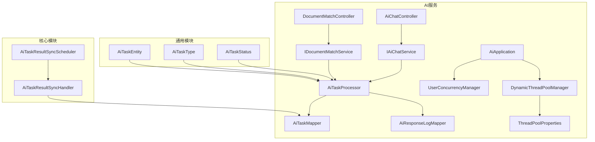
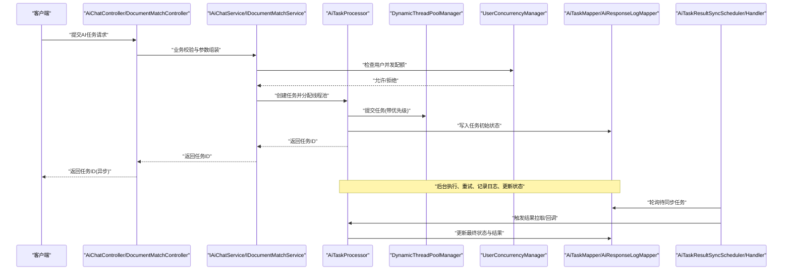
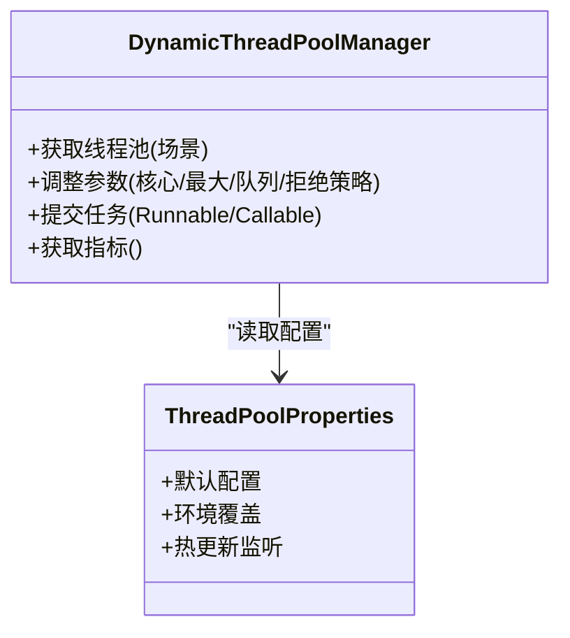
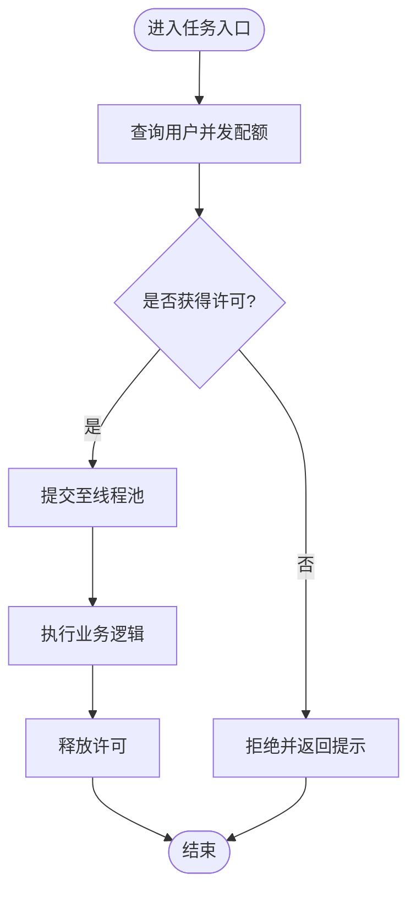
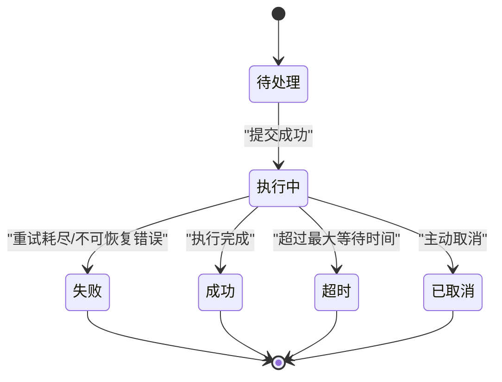
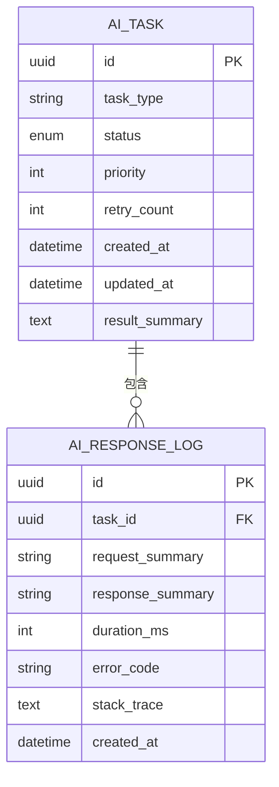
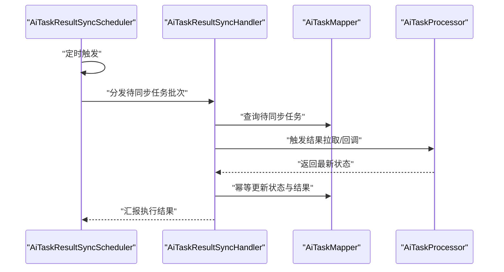
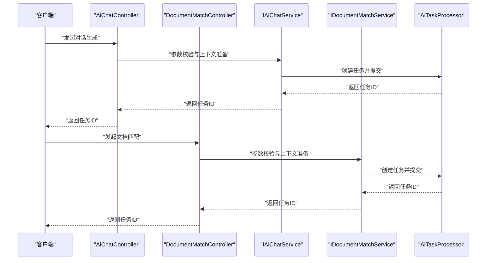
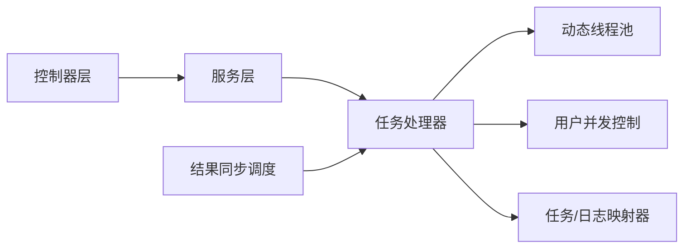

# 异步任务处理与线程池管理

<cite>
**本文引用的文件**   
- [DynamicThreadPoolManager.java](file://ele-ai-tender-system/ele-ai-tender-ai/src/main/java/com/jy/eleaitender/ai/threadpool/DynamicThreadPoolManager.java)
- [UserConcurrencyManager.java](file://ele-ai-tender-system/ele-ai-tender-ai/src/main/java/com/jy/eleaitender/ai/threadpool/UserConcurrencyManager.java)
- [AiTaskProcessor.java](file://ele-ai-tender-system/ele-ai-tender-ai/src/main/java/com/jy/eleaitender/ai/processor/AiTaskProcessor.java)
- [AiTaskMapper.java](file://ele-ai-tender-system/ele-ai-tender-ai/src/main/java/com/jy/eleaitender/ai/mapper/AiTaskMapper.java)
- [AiTaskStatus.java](file://ele-ai-tender-system/ele-ai-tender-common/src/main/java/com/jy/eleaitender/common/enums/AiTaskStatus.java)
- [AiTaskType.java](file://ele-ai-tender-system/ele-ai-tender-common/src/main/java/com/jy/eleaitender/common/enums/AiTaskType.java)
- [AiTaskEntity.java](file://ele-ai-tender-system/ele-ai-tender-common/src/main/java/com/jy/eleaitender/common/entity/ai/AiTaskEntity.java)
- [AiResponseLogMapper.java](file://ele-ai-tender-system/ele-ai-tender-ai/src/main/java/com/jy/eleaitender/ai/mapper/AiResponseLogMapper.java)
- [GlobalExceptionHandler.java](file://ele-ai-tender-system/ele-ai-tender-ai/src/main/java/com/jy/eleaitender/ai/handler/GlobalExceptionHandler.java)
- [ThreadPoolProperties.java](file://ele-ai-tender-system/ele-ai-tender-ai/src/main/java/com/jy/eleaitender/ai/config/ThreadPoolProperties.java)
- [AiApplication.java](file://ele-ai-tender-system/ele-ai-tender-ai/src/main/java/com/jy/eleaitender/ai/AiApplication.java)
- [AiTaskResultSyncScheduler.java](file://ele-ai-tender-system/ele-ai-tender-core/src/main/java/com/jy/eleaitender/core/scheduler/AiTaskResultSyncScheduler.java)
- [AiTaskResultSyncHandler.java](file://ele-ai-tender-system/ele-ai-tender-core/src/main/java/com/jy/eleaitender/core/scheduler/AiTaskResultSyncHandler.java)
- [AiChatController.java](file://ele-ai-tender-system/ele-ai-tender-ai/src/main/java/com/jy/eleaitender/ai/controller/AiChatController.java)
- [DocumentMatchController.java](file://ele-ai-tender-system/ele-ai-tender-ai/src/main/java/com/jy/eleaitender/ai/controller/DocumentMatchController.java)
- [IAiChatService.java](file://ele-ai-tender-system/ele-ai-tender-ai/src/main/java/com/jy/eleaitender/ai/service/IAiChatService.java)
- [IDocumentMatchService.java](file://ele-ai-tender-system/ele-ai-tender-ai/src/main/java/com/jy/eleaitender/ai/service/IDocumentMatchService.java)
- [AiCallRecorderTest.java](file://ele-ai-tender-system/ele-ai-tender-ai/src/test/java/com/jy/eleaitender/ai/processor/recorder/AiCallRecorderTest.java)
</cite>

## 目录
1. [简介](#简介)
2. [项目结构](#项目结构)
3. [核心组件](#核心组件)
4. [架构总览](#架构总览)
5. [详细组件分析](#详细组件分析)
6. [依赖关系分析](#依赖关系分析)
7. [性能考量](#性能考量)
8. [故障排查指南](#故障排查指南)
9. [结论](#结论)
10. [附录](#附录)

## 简介
本技术文档聚焦于异步任务处理系统与动态线程池管理，围绕以下目标展开：
- 动态线程池管理：运行时可配置、可观测的线程池能力。
- 任务队列调度与并发控制：用户级并发限制、资源隔离与优先级调度。
- AI任务全生命周期：创建、执行、监控、重试、结果同步。
- 可靠性保障：状态同步、错误处理、超时控制。
- 运维实践：任务监控、性能调优与故障诊断。

## 项目结构
系统采用多模块分层设计，AI服务负责任务编排与执行，通用模块提供枚举、实体与公共能力，核心模块提供定时同步等支撑能力。

图表来源
- [AiApplication.java](file://ele-ai-tender-system/ele-ai-tender-ai/src/main/java/com/jy/eleaitender/ai/AiApplication.java)
- [DynamicThreadPoolManager.java](file://ele-ai-tender-system/ele-ai-tender-ai/src/main/java/com/jy/eleaitender/ai/threadpool/DynamicThreadPoolManager.java)
- [UserConcurrencyManager.java](file://ele-ai-tender-system/ele-ai-tender-ai/src/main/java/com/jy/eleaitender/ai/threadpool/UserConcurrencyManager.java)
- [AiTaskProcessor.java](file://ele-ai-tender-system/ele-ai-tender-ai/src/main/java/com/jy/eleaitender/ai/processor/AiTaskProcessor.java)
- [AiChatController.java](file://ele-ai-tender-system/ele-ai-tender-ai/src/main/java/com/jy/eleaitender/ai/controller/AiChatController.java)
- [DocumentMatchController.java](file://ele-ai-tender-system/ele-ai-tender-ai/src/main/java/com/jy/eleaitender/ai/controller/DocumentMatchController.java)
- [IAiChatService.java](file://ele-ai-tender-system/ele-ai-tender-ai/src/main/java/com/jy/eleaitender/ai/service/IAiChatService.java)
- [IDocumentMatchService.java](file://ele-ai-tender-system/ele-ai-tender-ai/src/main/java/com/jy/eleaitender/ai/service/IDocumentMatchService.java)
- [AiTaskMapper.java](file://ele-ai-tender-system/ele-ai-tender-ai/src/main/java/com/jy/eleaitender/ai/mapper/AiTaskMapper.java)
- [AiResponseLogMapper.java](file://ele-ai-tender-system/ele-ai-tender-ai/src/main/java/com/jy/eleaitender/ai/mapper/AiResponseLogMapper.java)
- [ThreadPoolProperties.java](file://ele-ai-tender-system/ele-ai-tender-ai/src/main/java/com/jy/eleaitender/ai/config/ThreadPoolProperties.java)
- [AiTaskStatus.java](file://ele-ai-tender-system/ele-ai-tender-common/src/main/java/com/jy/eleaitender/common/enums/AiTaskStatus.java)
- [AiTaskType.java](file://ele-ai-tender-system/ele-ai-tender-common/src/main/java/com/jy/eleaitender/common/enums/AiTaskType.java)
- [AiTaskEntity.java](file://ele-ai-tender-system/ele-ai-tender-common/src/main/java/com/jy/eleaitender/common/entity/ai/AiTaskEntity.java)
- [AiTaskResultSyncScheduler.java](file://ele-ai-tender-system/ele-ai-tender-core/src/main/java/com/jy/eleaitender/core/scheduler/AiTaskResultSyncScheduler.java)
- [AiTaskResultSyncHandler.java](file://ele-ai-tender-system/ele-ai-tender-core/src/main/java/com/jy/eleaitender/core/scheduler/AiTaskResultSyncHandler.java)

章节来源
- [AiApplication.java](file://ele-ai-tender-system/ele-ai-tender-ai/src/main/java/com/jy/eleaitender/ai/AiApplication.java)
- [DynamicThreadPoolManager.java](file://ele-ai-tender-system/ele-ai-tender-ai/src/main/java/com/jy/eleaitender/ai/threadpool/DynamicThreadPoolManager.java)
- [UserConcurrencyManager.java](file://ele-ai-tender-system/ele-ai-tender-ai/src/main/java/com/jy/eleaitender/ai/threadpool/UserConcurrencyManager.java)
- [AiTaskProcessor.java](file://ele-ai-tender-system/ele-ai-tender-ai/src/main/java/com/jy/eleaitender/ai/processor/AiTaskProcessor.java)
- [AiTaskResultSyncScheduler.java](file://ele-ai-tender-system/ele-ai-tender-core/src/main/java/com/jy/eleaitender/core/scheduler/AiTaskResultSyncScheduler.java)
- [AiTaskResultSyncHandler.java](file://ele-ai-tender-system/ele-ai-tender-core/src/main/java/com/jy/eleaitender/core/scheduler/AiTaskResultSyncHandler.java)

## 核心组件
- 动态线程池管理器：提供运行时调整线程池大小、队列容量与拒绝策略的能力，支持按场景或租户维度隔离。
- 用户级并发管理器：基于用户维度的令牌桶/信号量实现并发上限控制，避免单用户独占资源。
- AI任务处理器：封装任务生命周期（创建、入队、执行、重试、落库、日志记录），对接模型调用与外部依赖。
- 任务映射器与响应日志：持久化任务元数据与调用轨迹，便于追踪与审计。
- 全局异常处理器：统一捕获并转换异常为稳定返回码，保证接口契约一致性。
- 线程池属性配置：集中管理线程池参数，支持热更新与环境差异化。
- 结果同步调度器与处理器：周期性拉取远端或下游任务结果，完成状态同步与补偿。

章节来源
- [DynamicThreadPoolManager.java](file://ele-ai-tender-system/ele-ai-tender-ai/src/main/java/com/jy/eleaitender/ai/threadpool/DynamicThreadPoolManager.java)
- [UserConcurrencyManager.java](file://ele-ai-tender-system/ele-ai-tender-ai/src/main/java/com/jy/eleaitender/ai/threadpool/UserConcurrencyManager.java)
- [AiTaskProcessor.java](file://ele-ai-tender-system/ele-ai-tender-ai/src/main/java/com/jy/eleaitender/ai/processor/AiTaskProcessor.java)
- [AiTaskMapper.java](file://ele-ai-tender-system/ele-ai-tender-ai/src/main/java/com/jy/eleaitender/ai/mapper/AiTaskMapper.java)
- [AiResponseLogMapper.java](file://ele-ai-tender-system/ele-ai-tender-ai/src/main/java/com/jy/eleaitender/ai/mapper/AiResponseLogMapper.java)
- [GlobalExceptionHandler.java](file://ele-ai-tender-system/ele-ai-tender-ai/src/main/java/com/jy/eleaitender/ai/handler/GlobalExceptionHandler.java)
- [ThreadPoolProperties.java](file://ele-ai-tender-system/ele-ai-tender-ai/src/main/java/com/jy/eleaitender/ai/config/ThreadPoolProperties.java)
- [AiTaskResultSyncScheduler.java](file://ele-ai-tender-system/ele-ai-tender-core/src/main/java/com/jy/eleaitender/core/scheduler/AiTaskResultSyncScheduler.java)
- [AiTaskResultSyncHandler.java](file://ele-ai-tender-system/ele-ai-tender-core/src/main/java/com/jy/eleaitender/core/scheduler/AiTaskResultSyncHandler.java)

## 架构总览
下图展示从控制器到任务处理器、线程池与持久化的端到端流程，以及结果同步的闭环。

图表来源
- [AiChatController.java](file://ele-ai-tender-system/ele-ai-tender-ai/src/main/java/com/jy/eleaitender/ai/controller/AiChatController.java)
- [DocumentMatchController.java](file://ele-ai-tender-system/ele-ai-tender-ai/src/main/java/com/jy/eleaitender/ai/controller/DocumentMatchController.java)
- [IAiChatService.java](file://ele-ai-tender-system/ele-ai-tender-ai/src/main/java/com/jy/eleaitender/ai/service/IAiChatService.java)
- [IDocumentMatchService.java](file://ele-ai-tender-system/ele-ai-tender-ai/src/main/java/com/jy/eleaitender/ai/service/IDocumentMatchService.java)
- [AiTaskProcessor.java](file://ele-ai-tender-system/ele-ai-tender-ai/src/main/java/com/jy/eleaitender/ai/processor/AiTaskProcessor.java)
- [DynamicThreadPoolManager.java](file://ele-ai-tender-system/ele-ai-tender-ai/src/main/java/com/jy/eleaitender/ai/threadpool/DynamicThreadPoolManager.java)
- [UserConcurrencyManager.java](file://ele-ai-tender-system/ele-ai-tender-ai/src/main/java/com/jy/eleaitender/ai/threadpool/UserConcurrencyManager.java)
- [AiTaskMapper.java](file://ele-ai-tender-system/ele-ai-tender-ai/src/main/java/com/jy/eleaitender/ai/mapper/AiTaskMapper.java)
- [AiResponseLogMapper.java](file://ele-ai-tender-system/ele-ai-tender-ai/src/main/java/com/jy/eleaitender/ai/mapper/AiResponseLogMapper.java)
- [AiTaskResultSyncScheduler.java](file://ele-ai-tender-system/ele-ai-tender-core/src/main/java/com/jy/eleaitender/core/scheduler/AiTaskResultSyncScheduler.java)
- [AiTaskResultSyncHandler.java](file://ele-ai-tender-system/ele-ai-tender-core/src/main/java/com/jy/eleaitender/core/scheduler/AiTaskResultSyncHandler.java)

## 详细组件分析

### 动态线程池管理
- 职责
  - 提供多场景线程池实例（如聊天生成、文档匹配、批量导出）。
  - 支持运行时修改核心线程数、最大线程数、队列容量与拒绝策略。
  - 暴露健康指标（活跃线程、队列长度、拒绝计数）供监控。
- 关键特性
  - 隔离性：不同业务域使用独立线程池，避免相互影响。
  - 弹性：根据负载自动或手动扩容/缩容。
  - 可观测：指标上报至监控系统。
- 配置项
  - 通过配置类集中定义默认值与覆盖规则，支持环境差异。
- 复杂度与性能
  - 线程切换与上下文传递开销可控；队列过大可能增加延迟，需结合SLA评估。

图表来源
- [DynamicThreadPoolManager.java](file://ele-ai-tender-system/ele-ai-tender-ai/src/main/java/com/jy/eleaitender/ai/threadpool/DynamicThreadPoolManager.java)
- [ThreadPoolProperties.java](file://ele-ai-tender-system/ele-ai-tender-ai/src/main/java/com/jy/eleaitender/ai/config/ThreadPoolProperties.java)

章节来源
- [DynamicThreadPoolManager.java](file://ele-ai-tender-system/ele-ai-tender-ai/src/main/java/com/jy/eleaitender/ai/threadpool/DynamicThreadPoolManager.java)
- [ThreadPoolProperties.java](file://ele-ai-tender-system/ele-ai-tender-ai/src/main/java/com/jy/eleaitender/ai/config/ThreadPoolProperties.java)

### 用户级并发控制
- 职责
  - 以用户维度限制并发任务数，防止单用户抢占系统资源。
  - 支持按用户等级或租户设置不同配额。
- 机制
  - 基于令牌桶/信号量的限流，进入前申请许可，完成后释放。
  - 与线程池解耦，先限流再入池，确保公平性与稳定性。
- 复杂度与性能
  - 高并发下锁粒度与统计结构选择影响吞吐，建议采用无锁计数器或分段锁优化热点路径。

图表来源
- [UserConcurrencyManager.java](file://ele-ai-tender-system/ele-ai-tender-ai/src/main/java/com/jy/eleaitender/ai/threadpool/UserConcurrencyManager.java)

章节来源
- [UserConcurrencyManager.java](file://ele-ai-tender-system/ele-ai-tender-ai/src/main/java/com/jy/eleaitender/ai/threadpool/UserConcurrencyManager.java)

### AI任务处理器与生命周期
- 生命周期阶段
  - 创建：生成任务ID、填充类型、优先级、超时时间、重试策略。
  - 入队：根据任务类型选择线程池与队列，应用用户并发限制。
  - 执行：调用模型或服务，记录开始时间、耗时、输入输出摘要。
  - 重试：对瞬态失败进行指数退避重试，达到上限后标记失败。
  - 落库：持久化任务状态、结果与日志，供查询与审计。
  - 同步：由结果同步调度器拉取远端结果，完成最终状态收敛。
- 状态机
  - 典型状态包括：待处理、执行中、成功、失败、已取消、超时。
  - 状态迁移受事件驱动（提交、开始、完成、失败、超时、取消）。
- 优先级调度
  - 支持按业务优先级选择队列或线程池，高优先级任务优先获得CPU与IO资源。
- 错误处理
  - 区分业务异常与系统异常，统一转换为标准响应码。
  - 记录错误堆栈与上下文，便于定位问题。

图表来源
- [AiTaskProcessor.java](file://ele-ai-tender-system/ele-ai-tender-ai/src/main/java/com/jy/eleaitender/ai/processor/AiTaskProcessor.java)
- [AiTaskStatus.java](file://ele-ai-tender-system/ele-ai-tender-common/src/main/java/com/jy/eleaitender/common/enums/AiTaskStatus.java)

章节来源
- [AiTaskProcessor.java](file://ele-ai-tender-system/ele-ai-tender-ai/src/main/java/com/jy/eleaitender/ai/processor/AiTaskProcessor.java)
- [AiTaskStatus.java](file://ele-ai-tender-system/ele-ai-tender-common/src/main/java/com/jy/eleaitender/common/enums/AiTaskStatus.java)
- [AiTaskType.java](file://ele-ai-tender-system/ele-ai-tender-common/src/main/java/com/jy/eleaitender/common/enums/AiTaskType.java)
- [AiTaskEntity.java](file://ele-ai-tender-system/ele-ai-tender-common/src/main/java/com/jy/eleaitender/common/entity/ai/AiTaskEntity.java)

### 任务持久化与日志
- 任务表
  - 存储任务ID、类型、状态、优先级、超时、重试次数、结果摘要、创建/更新时间等。
- 响应日志
  - 记录每次模型调用的输入输出摘要、耗时、错误码与堆栈，用于审计与排障。
- 查询与索引
  - 针对任务ID、状态、创建时间建立索引，提升查询效率。

图表来源
- [AiTaskMapper.java](file://ele-ai-tender-system/ele-ai-tender-ai/src/main/java/com/jy/eleaitender/ai/mapper/AiTaskMapper.java)
- [AiResponseLogMapper.java](file://ele-ai-tender-system/ele-ai-tender-ai/src/main/java/com/jy/eleaitender/ai/mapper/AiResponseLogMapper.java)
- [AiTaskEntity.java](file://ele-ai-tender-system/ele-ai-tender-common/src/main/java/com/jy/eleaitender/common/entity/ai/AiTaskEntity.java)

章节来源
- [AiTaskMapper.java](file://ele-ai-tender-system/ele-ai-tender-ai/src/main/java/com/jy/eleaitender/ai/mapper/AiTaskMapper.java)
- [AiResponseLogMapper.java](file://ele-ai-tender-system/ele-ai-tender-ai/src/main/java/com/jy/eleaitender/ai/mapper/AiResponseLogMapper.java)
- [AiTaskEntity.java](file://ele-ai-tender-system/ele-ai-tender-common/src/main/java/com/jy/eleaitender/common/entity/ai/AiTaskEntity.java)

### 结果同步调度
- 职责
  - 周期扫描未完成的任务，尝试拉取远端结果或回调本地服务。
  - 将最终状态写回数据库，清理中间态。
- 策略
  - 分片拉取、幂等更新、去重与防抖。
  - 失败重试与告警。

图表来源
- [AiTaskResultSyncScheduler.java](file://ele-ai-tender-system/ele-ai-tender-core/src/main/java/com/jy/eleaitender/core/scheduler/AiTaskResultSyncScheduler.java)
- [AiTaskResultSyncHandler.java](file://ele-ai-tender-system/ele-ai-tender-core/src/main/java/com/jy/eleaitender/core/scheduler/AiTaskResultSyncHandler.java)
- [AiTaskMapper.java](file://ele-ai-tender-system/ele-ai-tender-ai/src/main/java/com/jy/eleaitender/ai/mapper/AiTaskMapper.java)
- [AiTaskProcessor.java](file://ele-ai-tender-system/ele-ai-tender-ai/src/main/java/com/jy/eleaitender/ai/processor/AiTaskProcessor.java)

章节来源
- [AiTaskResultSyncScheduler.java](file://ele-ai-tender-system/ele-ai-tender-core/src/main/java/com/jy/eleaitender/core/scheduler/AiTaskResultSyncScheduler.java)
- [AiTaskResultSyncHandler.java](file://ele-ai-tender-system/ele-ai-tender-core/src/main/java/com/jy/eleaitender/core/scheduler/AiTaskResultSyncHandler.java)
- [AiTaskMapper.java](file://ele-ai-tender-system/ele-ai-tender-ai/src/main/java/com/jy/eleaitender/ai/mapper/AiTaskMapper.java)
- [AiTaskProcessor.java](file://ele-ai-tender-system/ele-ai-tender-ai/src/main/java/com/jy/eleaitender/ai/processor/AiTaskProcessor.java)

### 控制器与服务层协作
- 控制器
  - 接收前端请求，做基础校验与参数转换，返回任务ID以便异步跟踪。
- 服务层
  - 封装业务规则，协调用户并发控制、任务创建与线程池提交。
- 测试
  - 通过单元测试验证调用链路与记录行为，确保可观测性。

图表来源
- [AiChatController.java](file://ele-ai-tender-system/ele-ai-tender-ai/src/main/java/com/jy/eleaitender/ai/controller/AiChatController.java)
- [DocumentMatchController.java](file://ele-ai-tender-system/ele-ai-tender-ai/src/main/java/com/jy/eleaitender/ai/controller/DocumentMatchController.java)
- [IAiChatService.java](file://ele-ai-tender-system/ele-ai-tender-ai/src/main/java/com/jy/eleaitender/ai/service/IAiChatService.java)
- [IDocumentMatchService.java](file://ele-ai-tender-system/ele-ai-tender-ai/src/main/java/com/jy/eleaitender/ai/service/IDocumentMatchService.java)
- [AiTaskProcessor.java](file://ele-ai-tender-system/ele-ai-tender-ai/src/main/java/com/jy/eleaitender/ai/processor/AiTaskProcessor.java)

章节来源
- [AiChatController.java](file://ele-ai-tender-system/ele-ai-tender-ai/src/main/java/com/jy/eleaitender/ai/controller/AiChatController.java)
- [DocumentMatchController.java](file://ele-ai-tender-system/ele-ai-tender-ai/src/main/java/com/jy/eleaitender/ai/controller/DocumentMatchController.java)
- [IAiChatService.java](file://ele-ai-tender-system/ele-ai-tender-ai/src/main/java/com/jy/eleaitender/ai/service/IAiChatService.java)
- [IDocumentMatchService.java](file://ele-ai-tender-system/ele-ai-tender-ai/src/main/java/com/jy/eleaitender/ai/service/IDocumentMatchService.java)
- [AiTaskProcessor.java](file://ele-ai-tender-system/ele-ai-tender-ai/src/main/java/com/jy/eleaitender/ai/processor/AiTaskProcessor.java)
- [AiCallRecorderTest.java](file://ele-ai-tender-system/ele-ai-tender-ai/src/test/java/com/jy/eleaitender/ai/processor/recorder/AiCallRecorderTest.java)

## 依赖关系分析
- 组件耦合
  - 控制器仅依赖服务接口，服务依赖处理器与并发控制组件，处理器依赖线程池与持久化层。
  - 结果同步调度器与处理器松耦合，通过任务状态与ID交互。
- 外部依赖
  - 数据库访问通过MyBatis Plus映射器；日志与监控通过通用组件接入。
- 潜在风险
  - 若线程池与用户并发控制未协同，可能出现“限流过紧”或“限流过松”，需联合压测校准。

图表来源
- [AiChatController.java](file://ele-ai-tender-system/ele-ai-tender-ai/src/main/java/com/jy/eleaitender/ai/controller/AiChatController.java)
- [DocumentMatchController.java](file://ele-ai-tender-system/ele-ai-tender-ai/src/main/java/com/jy/eleaitender/ai/controller/DocumentMatchController.java)
- [IAiChatService.java](file://ele-ai-tender-system/ele-ai-tender-ai/src/main/java/com/jy/eleaitender/ai/service/IAiChatService.java)
- [IDocumentMatchService.java](file://ele-ai-tender-system/ele-ai-tender-ai/src/main/java/com/jy/eleaitender/ai/service/IDocumentMatchService.java)
- [AiTaskProcessor.java](file://ele-ai-tender-system/ele-ai-tender-ai/src/main/java/com/jy/eleaitender/ai/processor/AiTaskProcessor.java)
- [DynamicThreadPoolManager.java](file://ele-ai-tender-system/ele-ai-tender-ai/src/main/java/com/jy/eleaitender/ai/threadpool/DynamicThreadPoolManager.java)
- [UserConcurrencyManager.java](file://ele-ai-tender-system/ele-ai-tender-ai/src/main/java/com/jy/eleaitender/ai/threadpool/UserConcurrencyManager.java)
- [AiTaskMapper.java](file://ele-ai-tender-system/ele-ai-tender-ai/src/main/java/com/jy/eleaitender/ai/mapper/AiTaskMapper.java)
- [AiResponseLogMapper.java](file://ele-ai-tender-system/ele-ai-tender-ai/src/main/java/com/jy/eleaitender/ai/mapper/AiResponseLogMapper.java)
- [AiTaskResultSyncScheduler.java](file://ele-ai-tender-system/ele-ai-tender-core/src/main/java/com/jy/eleaitender/core/scheduler/AiTaskResultSyncScheduler.java)

章节来源
- [AiTaskProcessor.java](file://ele-ai-tender-system/ele-ai-tender-ai/src/main/java/com/jy/eleaitender/ai/processor/AiTaskProcessor.java)
- [DynamicThreadPoolManager.java](file://ele-ai-tender-system/ele-ai-tender-ai/src/main/java/com/jy/eleaitender/ai/threadpool/DynamicThreadPoolManager.java)
- [UserConcurrencyManager.java](file://ele-ai-tender-system/ele-ai-tender-ai/src/main/java/com/jy/eleaitender/ai/threadpool/UserConcurrencyManager.java)
- [AiTaskMapper.java](file://ele-ai-tender-system/ele-ai-tender-ai/src/main/java/com/jy/eleaitender/ai/mapper/AiTaskMapper.java)
- [AiResponseLogMapper.java](file://ele-ai-tender-system/ele-ai-tender-ai/src/main/java/com/jy/eleaitender/ai/mapper/AiResponseLogMapper.java)
- [AiTaskResultSyncScheduler.java](file://ele-ai-tender-system/ele-ai-tender-core/src/main/java/com/jy/eleaitender/core/scheduler/AiTaskResultSyncScheduler.java)

## 性能考量
- 线程池参数调优
  - 核心线程数与最大线程数依据CPU密集/IO密集特征设定；队列容量需结合峰值QPS与SLA评估。
  - 拒绝策略优先选择CallerRunsPolicy或自定义降级策略，避免丢失任务。
- 用户并发配额
  - 配额阈值应随用户等级与整体容量动态调整；热点用户需单独限流。
- 重试与退避
  - 指数退避+抖动降低雪崩风险；重试上限与死信队列配合，避免无限重试。
- 超时控制
  - 任务级超时与模型调用超时分层设置，及时释放资源。
- 监控与告警
  - 关注线程池活跃数、队列长度、拒绝计数、任务平均耗时与P99/P999延迟。

[本节为通用指导，不直接分析具体文件]

## 故障排查指南
- 常见问题
  - 任务堆积：检查线程池容量与队列长度，确认是否存在慢任务或下游瓶颈。
  - 用户限流频繁：核对用户并发配额与热点用户识别策略。
  - 结果不同步：检查结果同步调度间隔、幂等更新逻辑与网络连通性。
  - 超时过多：评估任务超时阈值与模型响应时延，必要时拆分任务。
- 定位方法
  - 通过任务ID在响应日志中检索完整调用链与错误堆栈。
  - 查看全局异常处理器记录的标准化错误码与上下文信息。
  - 对比线程池指标与业务指标，定位资源争用点。

章节来源
- [GlobalExceptionHandler.java](file://ele-ai-tender-system/ele-ai-tender-ai/src/main/java/com/jy/eleaitender/ai/handler/GlobalExceptionHandler.java)
- [AiResponseLogMapper.java](file://ele-ai-tender-system/ele-ai-tender-ai/src/main/java/com/jy/eleaitender/ai/mapper/AiResponseLogMapper.java)
- [AiTaskResultSyncScheduler.java](file://ele-ai-tender-system/ele-ai-tender-core/src/main/java/com/jy/eleaitender/core/scheduler/AiTaskResultSyncScheduler.java)
- [AiTaskResultSyncHandler.java](file://ele-ai-tender-system/ele-ai-tender-core/src/main/java/com/jy/eleaitender/core/scheduler/AiTaskResultSyncHandler.java)

## 结论
本方案通过动态线程池、用户级并发控制与任务处理器协同，构建了可扩展、可观测、可治理的异步任务体系。结合结果同步调度与完善的错误处理、超时控制，能够保障AI任务在高并发场景下的稳定性与可靠性。建议在上线前开展容量规划与压测，持续完善监控与告警，形成闭环的运维体系。

[本节为总结性内容，不直接分析具体文件]

## 附录
- 术语
  - 动态线程池：运行时可调参数的线程池集合。
  - 用户级并发控制：以用户为粒度的并发限制机制。
  - 结果同步：周期性拉取或回调以完成任务最终状态。
- 参考
  - 线程池属性配置类与动态管理器接口定义。
  - 任务状态枚举与任务实体定义。
  - 结果同步调度器与处理器实现。

[本节为补充说明，不直接分析具体文件]