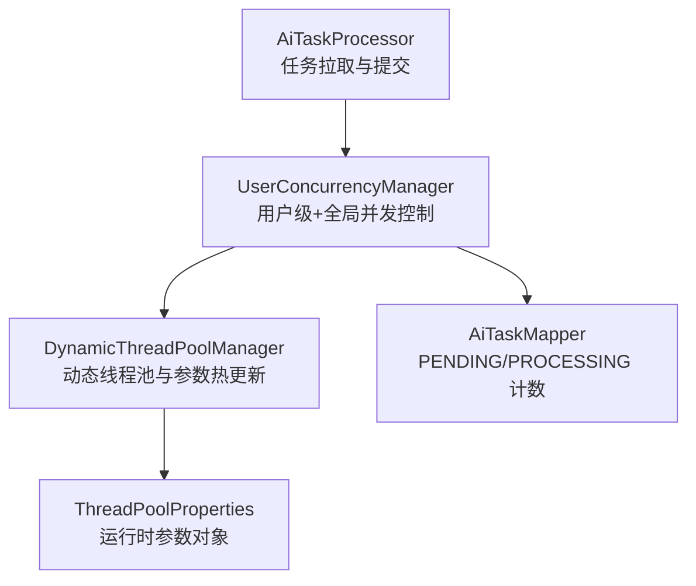
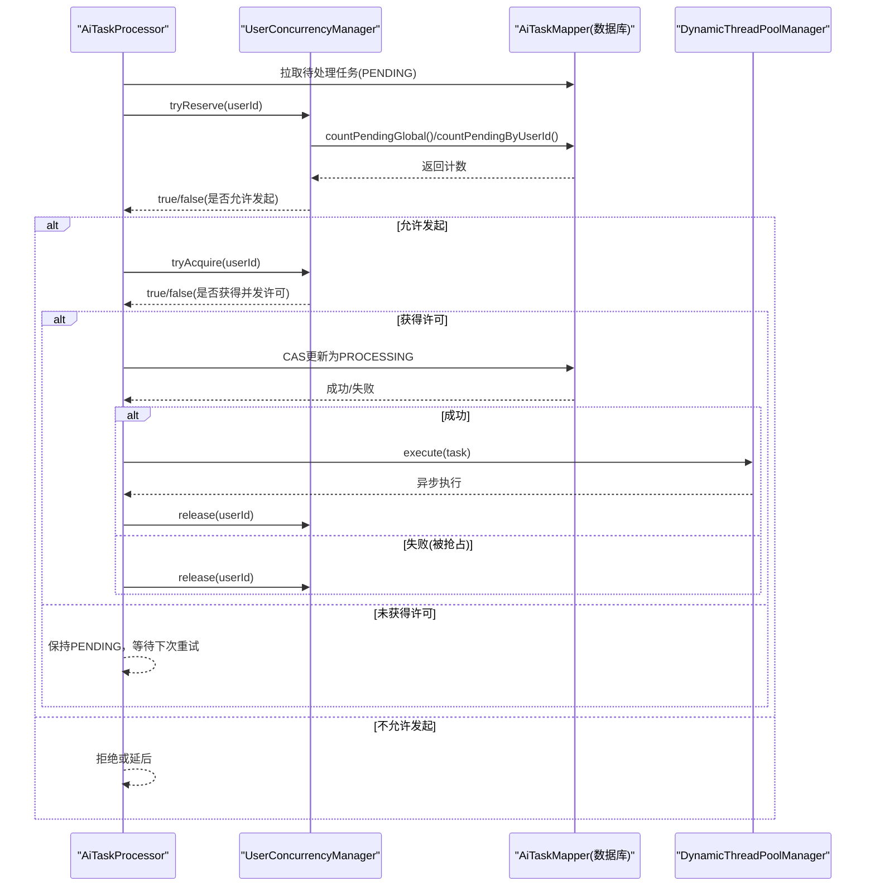
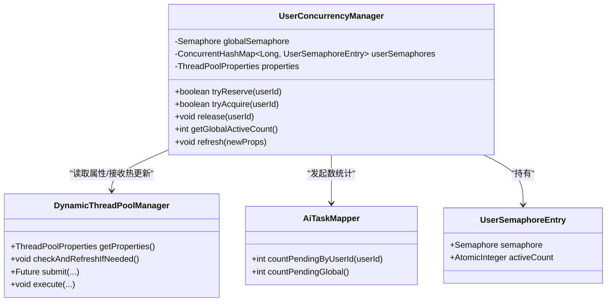
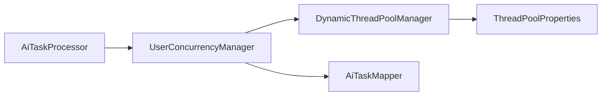

# 用户级并发控制

<cite>
**本文引用的文件**   
- [UserConcurrencyManager.java](file://ele-ai-tender-system/ele-ai-tender-ai/src/main/java/com/jy/eleaitender/ai/threadpool/UserConcurrencyManager.java)
- [DynamicThreadPoolManager.java](file://ele-ai-tender-system/ele-ai-tender-ai/src/main/java/com/jy/eleaitender/ai/threadpool/DynamicThreadPoolManager.java)
- [ThreadPoolProperties.java](file://ele-ai-tender-system/ele-ai-tender-ai/src/main/java/com/jy/eleaitender/ai/config/ThreadPoolProperties.java)
- [AiTaskMapper.java](file://ele-ai-tender-system/ele-ai-tender-ai/src/main/java/com/jy/eleaitender/ai/mapper/AiTaskMapper.java)
- [AiTaskProcessor.java](file://ele-ai-tender-system/ele-ai-tender-ai/src/main/java/com/jy/eleaitender/ai/processor/AiTaskProcessor.java)
</cite>

## 目录
1. [简介](#简介)
2. [项目结构](#项目结构)
3. [核心组件](#核心组件)
4. [架构总览](#架构总览)
5. [详细组件分析](#详细组件分析)
6. [依赖关系分析](#依赖关系分析)
7. [性能与容量规划](#性能与容量规划)
8. [监控指标与可观测性](#监控指标与可观测性)
9. [配置参数与热更新](#配置参数与热更新)
10. [异常处理与容错](#异常处理与容错)
11. [调优指南](#调优指南)
12. [故障排查手册](#故障排查手册)
13. [结论](#结论)

## 简介
本技术文档围绕“用户级并发控制系统”展开，重点解析 UserConcurrencyManager 的实现原理与使用方式。该系统在用户维度实现任务队列隔离、并发限制与排队策略，并与全局并发控制协同工作，确保在多租户场景下资源公平分配与系统稳定。文档涵盖会话管理、任务计数统计、限流算法、配置参数、监控指标、异常处理以及调优与排障实践。

## 项目结构
该能力位于 AI 模块的线程池与调度层，核心由以下组件构成：
- 动态线程池管理器：负责从数据库加载线程池与并发控制参数，定时轮询并热更新。
- 用户级并发管理器：基于信号量实现用户级与全局双层并发控制，并提供活跃计数与热刷新接口。
- 任务处理器：在拉取任务后，先获取并发许可，再 CAS 更新状态并提交执行。
- 任务数据访问：提供按用户和全局维度的未完成任务计数查询。

图表来源
- [AiTaskProcessor.java:75-111](file://ele-ai-tender-system/ele-ai-tender-ai/src/main/java/com/jy/eleaitender/ai/processor/AiTaskProcessor.java#L75-L111)
- [UserConcurrencyManager.java:23-130](file://ele-ai-tender-system/ele-ai-tender-ai/src/main/java/com/jy/eleaitender/ai/threadpool/UserConcurrencyManager.java#L23-L130)
- [DynamicThreadPoolManager.java:31-189](file://ele-ai-tender-system/ele-ai-tender-ai/src/main/java/com/jy/eleaitender/ai/threadpool/DynamicThreadPoolManager.java#L31-L189)
- [ThreadPoolProperties.java:9-39](file://ele-ai-tender-system/ele-ai-tender-ai/src/main/java/com/jy/eleaitender/ai/config/ThreadPoolProperties.java#L9-L39)
- [AiTaskMapper.java:92-106](file://ele-ai-tender-system/ele-ai-tender-ai/src/main/java/com/jy/eleaitender/ai/mapper/AiTaskMapper.java#L92-L106)

章节来源
- [AiTaskProcessor.java:75-111](file://ele-ai-tender-system/ele-ai-tender-ai/src/main/java/com/jy/eleaitender/ai/processor/AiTaskProcessor.java#L75-L111)
- [UserConcurrencyManager.java:23-130](file://ele-ai-tender-system/ele-ai-tender-ai/src/main/java/com/jy/eleaitender/ai/threadpool/UserConcurrencyManager.java#L23-L130)
- [DynamicThreadPoolManager.java:31-189](file://ele-ai-tender-system/ele-ai-tender-ai/src/main/java/com/jy/eleaitender/ai/threadpool/DynamicThreadPoolManager.java#L31-L189)
- [ThreadPoolProperties.java:9-39](file://ele-ai-tender-system/ele-ai-tender-ai/src/main/java/com/jy/eleaitender/ai/config/ThreadPoolProperties.java#L9-L39)
- [AiTaskMapper.java:92-106](file://ele-ai-tender-system/ele-ai-tender-ai/src/main/java/com/jy/eleaitender/ai/mapper/AiTaskMapper.java#L92-L106)

## 核心组件
- 用户级并发管理器（UserConcurrencyManager）
  - 职责：用户维度并发许可控制、全局并发许可控制、活跃计数、参数热刷新。
  - 关键方法：tryReserve（发起数检查）、tryAcquire（并发许可获取）、release（释放许可）、refresh（热更新）。
- 动态线程池管理器（DynamicThreadPoolManager）
  - 职责：从数据库加载参数、创建/重建线程池、定时检测参数变更并触发热更新。
  - 关键流程：init → loadFromDb → createExecutor；checkAndRefreshIfNeeded → applyRefresh → concurrencyManager.refresh。
- 任务处理器（AiTaskProcessor）
  - 职责：拉取 PENDING 任务，尝试获取并发许可，CAS 更新为 PROCESSING，提交到线程池执行，完成后释放许可。
- 任务数据访问（AiTaskMapper）
  - 职责：提供 countPendingByUserId 与 countPendingGlobal 两个计数查询，用于“发起数”上限判断。

章节来源
- [UserConcurrencyManager.java:23-130](file://ele-ai-tender-system/ele-ai-tender-ai/src/main/java/com/jy/eleaitender/ai/threadpool/UserConcurrencyManager.java#L23-L130)
- [DynamicThreadPoolManager.java:31-189](file://ele-ai-tender-system/ele-ai-tender-ai/src/main/java/com/jy/eleaitender/ai/threadpool/DynamicThreadPoolManager.java#L31-L189)
- [AiTaskProcessor.java:75-111](file://ele-ai-tender-system/ele-ai-tender-ai/src/main/java/com/jy/eleaitender/ai/processor/AiTaskProcessor.java#L75-L111)
- [AiTaskMapper.java:92-106](file://ele-ai-tender-system/ele-ai-tender-ai/src/main/java/com/jy/eleaitender/ai/mapper/AiTaskMapper.java#L92-L106)

## 架构总览
下图展示了“任务拉取—并发控制—执行—释放”的完整时序，体现用户级与全局并发控制的协作关系。

图表来源
- [AiTaskProcessor.java:75-111](file://ele-ai-tender-system/ele-ai-tender-ai/src/main/java/com/jy/eleaitender/ai/processor/AiTaskProcessor.java#L75-L111)
- [UserConcurrencyManager.java:43-88](file://ele-ai-tender-system/ele-ai-tender-ai/src/main/java/com/jy/eleaitender/ai/threadpool/UserConcurrencyManager.java#L43-L88)
- [AiTaskMapper.java:92-106](file://ele-ai-tender-system/ele-ai-tender-ai/src/main/java/com/jy/eleaitender/ai/mapper/AiTaskMapper.java#L92-L106)
- [DynamicThreadPoolManager.java:87-96](file://ele-ai-tender-system/ele-ai-tender-ai/src/main/java/com/jy/eleaitender/ai/threadpool/DynamicThreadPoolManager.java#L87-L96)

## 详细组件分析

### 用户级并发管理器（UserConcurrencyManager）
- 并发模型
  - 用户级并发：每个用户一个 Semaphore，限制同一用户的并发执行数。
  - 全局并发：单一 Semaphore，限制全局限定的并发执行数。
  - 活跃计数：每个用户维护 AtomicInteger 记录当前活跃任务数，便于热更新时计算剩余许可。
- 关键流程
  - tryReserve：通过数据库统计 PENDING+PROCESSING 数量，判断是否超过“发起数”上限。超限直接拒绝。
  - tryAcquire：先尝试获取用户级许可，再尝试获取全局许可；任一失败则回滚并返回 false，调用方应排队重试。
  - release：释放用户级与全局许可，并递减活跃计数。
  - refresh：根据新参数与当前活跃数，重新初始化全局信号量与用户映射，保证热更新不破坏并发约束。
- 复杂度与性能
  - tryReserve：O(1) 次数据库查询（全局与用户各一次），受限于数据库负载。
  - tryAcquire/release：O(1) 内存操作，低开销。
  - getGlobalActiveCount：O(U)，U 为活跃用户数，通常较小。
- 错误与边界
  - 并发抢占：CAS 更新失败会归还许可，避免泄漏。
  - 热更新：全局许可数至少保留 1，防止无可用许可导致死锁。

图表来源
- [UserConcurrencyManager.java:23-130](file://ele-ai-tender-system/ele-ai-tender-ai/src/main/java/com/jy/eleaitender/ai/threadpool/UserConcurrencyManager.java#L23-L130)
- [DynamicThreadPoolManager.java:31-189](file://ele-ai-tender-system/ele-ai-tender-ai/src/main/java/com/jy/eleaitender/ai/threadpool/DynamicThreadPoolManager.java#L31-L189)
- [AiTaskMapper.java:92-106](file://ele-ai-tender-system/ele-ai-tender-ai/src/main/java/com/jy/eleaitender/ai/mapper/AiTaskMapper.java#L92-L106)

章节来源
- [UserConcurrencyManager.java:23-130](file://ele-ai-tender-system/ele-ai-tender-ai/src/main/java/com/jy/eleaitender/ai/threadpool/UserConcurrencyManager.java#L23-L130)

### 动态线程池管理器（DynamicThreadPoolManager）
- 参数来源：从 sup_sys_parameter 表 AI_THREAD_POOL 组读取键值对，填充 ThreadPoolProperties。
- 热更新机制：每 10 秒轮询，比较参数 Hash，若变化则：
  - 若队列容量变化：重建线程池并优雅关闭旧实例。
  - 否则：动态调整 core/max/keepAlive。
  - 调用 concurrencyManager.refresh 同步更新并发控制参数。
- 生命周期：@PostConstruct 初始化，@PreDestroy 关闭线程池。

章节来源
- [DynamicThreadPoolManager.java:46-82](file://ele-ai-tender-system/ele-ai-tender-ai/src/main/java/com/jy/eleaitender/ai/threadpool/DynamicThreadPoolManager.java#L46-L82)
- [DynamicThreadPoolManager.java:113-145](file://ele-ai-tender-system/ele-ai-tender-ai/src/main/java/com/jy/eleaitender/ai/threadpool/DynamicThreadPoolManager.java#L113-L145)
- [DynamicThreadPoolManager.java:166-187](file://ele-ai-tender-system/ele-ai-tender-ai/src/main/java/com/jy/eleaitender/ai/threadpool/DynamicThreadPoolManager.java#L166-L187)

### 任务处理器（AiTaskProcessor）
- 流程要点：
  - 拉取 PENDING 任务。
  - 可选：调用 tryReserve 进行“发起数”预检（代码中已预留开关）。
  - 调用 tryAcquire 获取并发许可；失败则跳过，等待下次轮询重试。
  - CAS 将任务状态从 PENDING 改为 PROCESSING；失败则释放并发许可。
  - 提交到线程池执行；完成后统一释放并发许可。
- 并发安全：
  - 先获许可再 CAS，避免“PROCESSING→PENDING”弹跳导致的并发失控。
  - CAS 失败路径必须释放并发许可，防止泄漏。

章节来源
- [AiTaskProcessor.java:75-111](file://ele-ai-tender-system/ele-ai-tender-ai/src/main/java/com/jy/eleaitender/ai/processor/AiTaskProcessor.java#L75-L111)

### 任务数据访问（AiTaskMapper）
- 提供两个关键计数查询：
  - countPendingByUserId：统计某用户 PENDING+PROCESSING 的任务数。
  - countPendingGlobal：统计全局 PENDING+PROCESSING 的任务数。
- 用途：作为“发起数”上限判断依据，超限直接拒绝，避免积压过多任务。

章节来源
- [AiTaskMapper.java:92-106](file://ele-ai-tender-system/ele-ai-tender-ai/src/main/java/com/jy/eleaitender/ai/mapper/AiTaskMapper.java#L92-L106)

## 依赖关系分析
- 组件耦合
  - UserConcurrencyManager 依赖 DynamicThreadPoolManager 提供的属性对象，并在热更新时接收新参数。
  - UserConcurrencyManager 依赖 AiTaskMapper 完成“发起数”统计。
  - AiTaskProcessor 组合使用 UserConcurrencyManager 与 DynamicThreadPoolManager，形成“控制—执行”闭环。
- 循环依赖处理
  - DynamicThreadPoolManager 通过 @Lazy 注入 UserConcurrencyManager，避免启动期循环依赖。
- 外部依赖
  - 数据库：sup_sys_parameter 表承载运行时参数；ai_task 表承载任务状态与计数。

图表来源
- [AiTaskProcessor.java:75-111](file://ele-ai-tender-system/ele-ai-tender-ai/src/main/java/com/jy/eleaitender/ai/processor/AiTaskProcessor.java#L75-L111)
- [UserConcurrencyManager.java:23-130](file://ele-ai-tender-system/ele-ai-tender-ai/src/main/java/com/jy/eleaitender/ai/threadpool/UserConcurrencyManager.java#L23-L130)
- [DynamicThreadPoolManager.java:31-189](file://ele-ai-tender-system/ele-ai-tender-ai/src/main/java/com/jy/eleaitender/ai/threadpool/DynamicThreadPoolManager.java#L31-L189)
- [ThreadPoolProperties.java:9-39](file://ele-ai-tender-system/ele-ai-tender-ai/src/main/java/com/jy/eleaitender/ai/config/ThreadPoolProperties.java#L9-L39)
- [AiTaskMapper.java:92-106](file://ele-ai-tender-system/ele-ai-tender-ai/src/main/java/com/jy/eleaitender/ai/mapper/AiTaskMapper.java#L92-L106)

章节来源
- [DynamicThreadPoolManager.java:36-38](file://ele-ai-tender-system/ele-ai-tender-ai/src/main/java/com/jy/eleaitender/ai/threadpool/DynamicThreadPoolManager.java#L36-L38)

## 性能与容量规划
- 并发控制开销
  - 用户级与全局并发许可均为 O(1) 操作，CPU 开销极低。
  - “发起数”检查涉及两次数据库查询，建议结合缓存或聚合统计降低压力。
- 线程池容量
  - 建议根据 CPU 核数与 I/O 特性设置 core/max 与队列容量，避免队列过长导致延迟放大。
- 热点用户保护
  - 用户级并发限制可有效抑制单用户独占资源，保障多租户公平性。
- 热更新影响
  - 热更新期间全局许可数至少保留 1，避免瞬时不可用；队列容量变更需重建线程池，注意平滑过渡。

[本节为通用指导，无需特定文件引用]

## 监控指标与可观测性
- 建议暴露的指标
  - 全局活跃任务数：getGlobalActiveCount
  - 用户级活跃任务数：遍历用户条目累加 activeCount
  - 线程池指标：activeCount、poolSize、queueSize
  - 参数版本：ThreadPoolProperties.computeHash
- 日志要点
  - 并发受限告警：用户/全局并发已满、发起数已达上限
  - 热更新事件：参数变更、线程池重建、并发控制刷新

章节来源
- [UserConcurrencyManager.java:93-116](file://ele-ai-tender-system/ele-ai-tender-ai/src/main/java/com/jy/eleaitender/ai/threadpool/UserConcurrencyManager.java#L93-L116)
- [DynamicThreadPoolManager.java:98-108](file://ele-ai-tender-system/ele-ai-tender-ai/src/main/java/com/jy/eleaitender/ai/threadpool/DynamicThreadPoolManager.java#L98-L108)
- [ThreadPoolProperties.java:24-37](file://ele-ai-tender-system/ele-ai-tender-ai/src/main/java/com/jy/eleaitender/ai/config/ThreadPoolProperties.java#L24-L37)

## 配置参数与热更新
- 参数来源
  - 从 sup_sys_parameter 表的 AI_THREAD_POOL 分组读取键值对，映射至 ThreadPoolProperties。
- 关键参数
  - 线程池：corePoolSize、maxPoolSize、queueCapacity、keepAliveSeconds、taskTimeoutMinutes
  - 并发控制：userMaxPendingTasks、userMaxConcurrentTasks、globalMaxPendingTasks、globalMaxConcurrentTasks
- 热更新流程
  - 定时轮询参数哈希，变化则：
    - 若 queueCapacity 变化：重建线程池并优雅关闭旧实例
    - 否则：动态调整 core/max/keepAlive
    - 调用 concurrencyManager.refresh 同步更新并发控制参数

章节来源
- [DynamicThreadPoolManager.java:166-187](file://ele-ai-tender-system/ele-ai-tender-ai/src/main/java/com/jy/eleaitender/ai/threadpool/DynamicThreadPoolManager.java#L166-L187)
- [DynamicThreadPoolManager.java:113-145](file://ele-ai-tender-system/ele-ai-tender-ai/src/main/java/com/jy/eleaitender/ai/threadpool/DynamicThreadPoolManager.java#L113-L145)
- [ThreadPoolProperties.java:9-39](file://ele-ai-tender-system/ele-ai-tender-ai/src/main/java/com/jy/eleaitender/ai/config/ThreadPoolProperties.java#L9-L39)

## 异常处理与容错
- 并发抢占
  - CAS 更新失败视为被其他实例抢占，立即释放并发许可，避免泄漏。
- 服务启停
  - 启动/关闭时将残留 PROCESSING 任务标记为 AI_UNAVAILABLE，避免悬挂状态。
- 热更新健壮性
  - 全局许可数最小值为 1，防止热更新后无可用许可导致阻塞。
  - 线程池重建采用优雅关闭与超时强制关闭相结合的策略。

章节来源
- [AiTaskProcessor.java:91-96](file://ele-ai-tender-system/ele-ai-tender-ai/src/main/java/com/jy/eleaitender/ai/processor/AiTaskProcessor.java#L91-L96)
- [AiTaskMapper.java:84-90](file://ele-ai-tender-system/ele-ai-tender-ai/src/main/java/com/jy/eleaitender/ai/mapper/AiTaskMapper.java#L84-L90)
- [UserConcurrencyManager.java:105-116](file://ele-ai-tender-system/ele-ai-tender-ai/src/main/java/com/jy/eleaitender/ai/threadpool/UserConcurrencyManager.java#L105-L116)
- [DynamicThreadPoolManager.java:117-135](file://ele-ai-tender-system/ele-ai-tender-ai/src/main/java/com/jy/eleaitender/ai/threadpool/DynamicThreadPoolManager.java#L117-L135)

## 调优指南
- 并发上限
  - 合理设置 userMaxConcurrentTasks 与 globalMaxConcurrentTasks，避免单用户独占与全局拥塞。
- 发起数上限
  - 根据业务吞吐与下游处理能力设置 userMaxPendingTasks 与 globalMaxPendingTasks，防止积压。
- 线程池容量
  - 根据 CPU 与 I/O 特征调整 core/max 与队列容量，观察队列长度与活跃线程比。
- 热更新窗口
  - 在低峰期调整参数，减少重建线程池带来的抖动。
- 监控联动
  - 结合活跃任务数、队列长度、耗时分布等指标，持续评估并微调参数。

[本节为通用指导，无需特定文件引用]

## 故障排查手册
- 现象：任务长期处于 PENDING
  - 排查点：用户/全局并发是否已满；发起数是否超限；是否存在 CAS 抢占频繁。
  - 定位：查看 tryAcquire 与 tryReserve 的日志输出；核对数据库计数。
- 现象：全局并发频繁打满
  - 排查点：globalMaxConcurrentTasks 是否过小；是否存在热点用户；下游依赖是否慢。
  - 动作：适当提升全局并发上限；优化热点用户策略；扩容下游。
- 现象：热更新后出现短暂不可用
  - 排查点：是否触发了线程池重建；全局许可数是否为 1 导致瞬时不足。
  - 动作：确认热更新逻辑；在低峰期调整；关注日志中的“参数变更”与“线程池重建”。
- 现象：任务悬挂为 PROCESSING
  - 排查点：服务异常退出或重启；是否执行了清理脚本。
  - 动作：使用批量清理接口将残留 PROCESSING 标记为 AI_UNAVAILABLE。

章节来源
- [UserConcurrencyManager.java:43-88](file://ele-ai-tender-system/ele-ai-tender-ai/src/main/java/com/jy/eleaitender/ai/threadpool/UserConcurrencyManager.java#L43-L88)
- [AiTaskMapper.java:84-90](file://ele-ai-tender-system/ele-ai-tender-ai/src/main/java/com/jy/eleaitender/ai/mapper/AiTaskMapper.java#L84-L90)
- [DynamicThreadPoolManager.java:117-135](file://ele-ai-tender-system/ele-ai-tender-ai/src/main/java/com/jy/eleaitender/ai/threadpool/DynamicThreadPoolManager.java#L117-L135)

## 结论
UserConcurrencyManager 以“用户级+全局”双层信号量为核心，配合数据库“发起数”统计，实现了精细化的并发控制与资源隔离。DynamicThreadPoolManager 提供参数化与热更新能力，使系统在运行期具备弹性与可观测性。通过合理的参数配置、完善的监控与规范的异常处理，可在多租户高并发场景下保障稳定性与公平性。