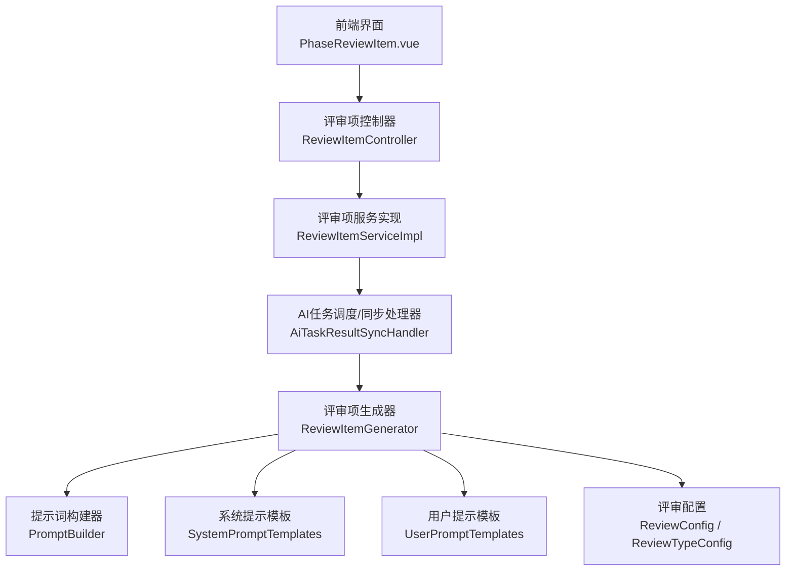
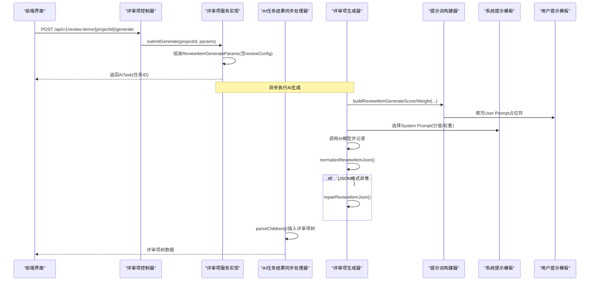
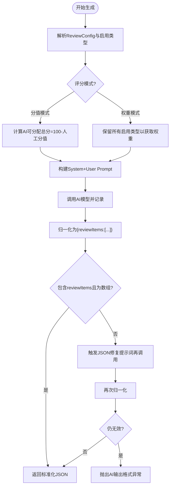
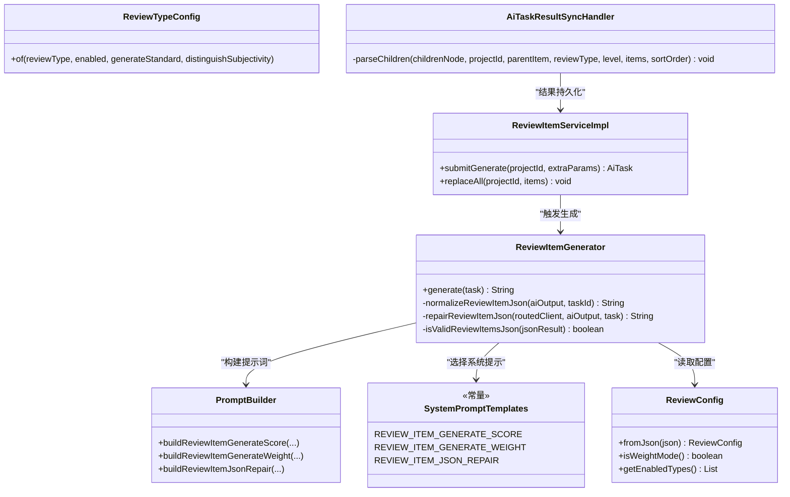

# 审查项生成器

<cite>
**本文引用的文件**   
- [ReviewItemGenerator.java](file://ele-ai-tender-system/ele-ai-tender-ai/src/main/java/com/jy/eleaitender/ai/processor/generator/ReviewItemGenerator.java)
- [PromptBuilder.java](file://ele-ai-tender-system/ele-ai-tender-ai/src/main/java/com/jy/eleaitender/ai/processor/prompt/PromptBuilder.java)
- [SystemPromptTemplates.java](file://ele-ai-tender-system/ele-ai-tender-ai/src/main/java/com/jy/eleaitender/ai/processor/prompt/SystemPromptTemplates.java)
- [UserPromptTemplates.java](file://ele-ai-tender-system/ele-ai-tender-ai/src/main/java/com/jy/eleaitender/ai/processor/prompt/UserPromptTemplates.java)
- [ReviewConfig.java](file://ele-ai-tender-system/ele-ai-tender-common/src/main/java/com/jy/eleaitender/common/dto/ReviewConfig.java)
- [ReviewTypeConfig.java](file://ele-ai-tender-system/ele-ai-tender-common/src/main/java/com/jy/eleaitender/common/dto/ReviewTypeConfig.java)
- [ReviewItemGenerateParams.java](file://ele-ai-tender-system/ele-ai-tender-common/src/main/java/com/jy/eleaitender/common/dto/ai/ReviewItemGenerateParams.java)
- [ReviewItemController.java](file://ele-ai-tender-system/ele-ai-tender-core/src/main/java/com/jy/eleaitender/core/controller/ReviewItemController.java)
- [ReviewItemServiceImpl.java](file://ele-ai-tender-system/ele-ai-tender-core/src/main/java/com/jy/eleaitender/core/service/impl/ReviewItemServiceImpl.java)
- [AiTaskResultSyncHandler.java](file://ele-ai-tender-system/ele-ai-tender-core/src/main/java/com/jy/eleaitender/core/scheduler/AiTaskResultSyncHandler.java)
- [PhaseReviewItem.vue](file://ele-ai-tender-frontend/src/views/project/phases/PhaseReviewItem.vue)
</cite>

## 目录
1. [简介](#简介)
2. [项目结构](#项目结构)
3. [核心组件](#核心组件)
4. [架构总览](#架构总览)
5. [详细组件分析](#详细组件分析)
6. [依赖关系分析](#依赖关系分析)
7. [性能与可扩展性](#性能与可扩展性)
8. [故障排查指南](#故障排查指南)
9. [结论](#结论)
10. [附录：规则定制与扩展开发指南](#附录规则定制与扩展开发指南)

## 简介
本技术文档围绕“审查项生成器”展开，聚焦于招标评审项的智能识别与自动生成能力。系统通过AI模型结合项目信息与需求内容，自动产出结构化评审标准体系，支持分值模式与权重模式两种评分策略，内置JSON格式归一化与修复机制，并提供前端可视化展示与交互编辑能力。同时，文档覆盖多维度审查指标、动态规则配置、结果可视化展示等特性，并给出规则定制化和扩展开发的实践指南。

## 项目结构
审查项生成器涉及前后端多模块协作：
- AI服务层：负责提示词构建、模型路由、调用记录、输出解析与归一化
- 通用DTO与枚举：承载评审配置、任务参数、类型定义
- 核心业务层：提供评审项的CRUD、批量操作、替换、以及AI生成任务的提交与结果同步
- 前端界面：展示评审树、权重/分值校验、交互式编辑

图表来源
- [ReviewItemController.java:1-90](file://ele-ai-tender-system/ele-ai-tender-core/src/main/java/com/jy/eleaitender/core/controller/ReviewItemController.java#L1-L90)
- [ReviewItemServiceImpl.java:1-276](file://ele-ai-tender-system/ele-ai-tender-core/src/main/java/com/jy/eleaitender/core/service/impl/ReviewItemServiceImpl.java#L1-L276)
- [AiTaskResultSyncHandler.java:464-495](file://ele-ai-tender-system/ele-ai-tender-core/src/main/java/com/jy/eleaitender/core/scheduler/AiTaskResultSyncHandler.java#L464-L495)
- [ReviewItemGenerator.java:1-305](file://ele-ai-tender-system/ele-ai-tender-ai/src/main/java/com/jy/eleaitender/ai/processor/generator/ReviewItemGenerator.java#L1-L305)
- [PromptBuilder.java:1-173](file://ele-ai-tender-system/ele-ai-tender-ai/src/main/java/com/jy/eleaitender/ai/processor/prompt/PromptBuilder.java#L1-L173)
- [SystemPromptTemplates.java:1-497](file://ele-ai-tender-system/ele-ai-tender-ai/src/main/java/com/jy/eleaitender/ai/processor/prompt/SystemPromptTemplates.java#L1-L497)
- [UserPromptTemplates.java:109-131](file://ele-ai-tender-system/ele-ai-tender-ai/src/main/java/com/jy/eleaitender/ai/processor/prompt/UserPromptTemplates.java#L109-L131)
- [ReviewConfig.java:1-121](file://ele-ai-tender-system/ele-ai-tender-common/src/main/java/com/jy/eleaitender/common/dto/ReviewConfig.java#L1-L121)
- [ReviewTypeConfig.java:1-47](file://ele-ai-tender-system/ele-ai-tender-common/src/main/java/com/jy/eleaitender/common/dto/ReviewTypeConfig.java#L1-L47)
- [PhaseReviewItem.vue:28-58](file://ele-ai-tender-frontend/src/views/project/phases/PhaseReviewItem.vue#L28-L58)

章节来源
- [ReviewItemController.java:1-90](file://ele-ai-tender-system/ele-ai-tender-core/src/main/java/com/jy/eleaitender/core/controller/ReviewItemController.java#L1-L90)
- [ReviewItemServiceImpl.java:1-276](file://ele-ai-tender-system/ele-ai-tender-core/src/main/java/com/jy/eleaitender/core/service/impl/ReviewItemServiceImpl.java#L1-L276)
- [ReviewItemGenerator.java:1-305](file://ele-ai-tender-system/ele-ai-tender-ai/src/main/java/com/jy/eleaitender/ai/processor/generator/ReviewItemGenerator.java#L1-L305)
- [PromptBuilder.java:1-173](file://ele-ai-tender-system/ele-ai-tender-ai/src/main/java/com/jy/eleaitender/ai/processor/prompt/PromptBuilder.java#L1-L173)
- [SystemPromptTemplates.java:190-340](file://ele-ai-tender-system/ele-ai-tender-ai/src/main/java/com/jy/eleaitender/ai/processor/prompt/SystemPromptTemplates.java#L190-L340)
- [UserPromptTemplates.java:109-131](file://ele-ai-tender-system/ele-ai-tender-ai/src/main/java/com/jy/eleaitender/ai/processor/prompt/UserPromptTemplates.java#L109-L131)
- [ReviewConfig.java:1-121](file://ele-ai-tender-system/ele-ai-tender-common/src/main/java/com/jy/eleaitender/common/dto/ReviewConfig.java#L1-L121)
- [ReviewTypeConfig.java:1-47](file://ele-ai-tender-system/ele-ai-tender-common/src/main/java/com/jy/eleaitender/common/dto/ReviewTypeConfig.java#L1-L47)
- [PhaseReviewItem.vue:28-58](file://ele-ai-tender-frontend/src/views/project/phases/PhaseReviewItem.vue#L28-L58)

## 核心组件
- 评审项生成器（ReviewItemGenerator）
  - 职责：组装提示词、选择评分模式、调用AI模型、归一化与修复JSON、返回标准评审项结构
  - 关键逻辑：根据ReviewConfig决定启用类型与总分分配；在分值模式下计算AI可分配的剩余分数；在权重模式下要求类型权重合计为100%
- 提示词构建器（PromptBuilder）
  - 职责：将项目信息、需求内容与配置转换为User Prompt；区分分值/权重模式
- 系统提示模板（SystemPromptTemplates）
  - 职责：定义AI角色、设计原则、计分口径、输出格式约束与修复指令
- 评审配置（ReviewConfig / ReviewTypeConfig）
  - 职责：描述评分模式、启用类型、是否生成标准、是否区分主客观、手动评审项树
- 评审项服务（ReviewItemServiceImpl）
  - 职责：创建/更新/删除/批量操作/替换评审项；提交AI生成任务；读取项目模板中的评审配置
- 控制器（ReviewItemController）
  - 职责：暴露REST接口，包括提交AI生成、批量创建/更新、替换全部评审项
- 前端展示（PhaseReviewItem.vue）
  - 职责：按类型分组展示评审树；权重模式下显示类型权重输入与合计校验；分值模式下显示分值汇总与合规提示

章节来源
- [ReviewItemGenerator.java:66-154](file://ele-ai-tender-system/ele-ai-tender-ai/src/main/java/com/jy/eleaitender/ai/processor/generator/ReviewItemGenerator.java#L66-L154)
- [PromptBuilder.java:90-133](file://ele-ai-tender-system/ele-ai-tender-ai/src/main/java/com/jy/eleaitender/ai/processor/prompt/PromptBuilder.java#L90-L133)
- [SystemPromptTemplates.java:190-340](file://ele-ai-tender-system/ele-ai-tender-ai/src/main/java/com/jy/eleaitender/ai/processor/prompt/SystemPromptTemplates.java#L190-L340)
- [ReviewConfig.java:1-121](file://ele-ai-tender-system/ele-ai-tender-common/src/main/java/com/jy/eleaitender/common/dto/ReviewConfig.java#L1-L121)
- [ReviewTypeConfig.java:1-47](file://ele-ai-tender-system/ele-ai-tender-common/src/main/java/com/jy/eleaitender/common/dto/ReviewTypeConfig.java#L1-L47)
- [ReviewItemServiceImpl.java:138-170](file://ele-ai-tender-system/ele-ai-tender-core/src/main/java/com/jy/eleaitender/core/service/impl/ReviewItemServiceImpl.java#L138-L170)
- [ReviewItemController.java:57-88](file://ele-ai-tender-system/ele-ai-tender-core/src/main/java/com/jy/eleaitender/core/controller/ReviewItemController.java#L57-L88)
- [PhaseReviewItem.vue:28-58](file://ele-ai-tender-frontend/src/views/project/phases/PhaseReviewItem.vue#L28-L58)

## 架构总览
评审项生成的端到端流程如下：
- 前端触发“提交AI生成评审项”
- 后端服务组装任务参数（含项目信息、需求内容、评审配置），创建AI任务
- AI服务根据评分模式构建提示词，调用模型，获取原始输出
- 对AI输出进行JSON提取、字段定位、类别对象转换、统一包装为reviewItems数组
- 若格式异常，触发二次修复提示词再次调用模型
- 结果同步处理器将JSON树解析为持久化实体，维护父子关系与排序
- 前端以树形结构展示，并在权重/分值模式下进行合计校验与可视化反馈

图表来源
- [ReviewItemController.java:57-63](file://ele-ai-tender-system/ele-ai-tender-core/src/main/java/com/jy/eleaitender/core/controller/ReviewItemController.java#L57-L63)
- [ReviewItemServiceImpl.java:138-170](file://ele-ai-tender-system/ele-ai-tender-core/src/main/java/com/jy/eleaitender/core/service/impl/ReviewItemServiceImpl.java#L138-L170)
- [ReviewItemGenerator.java:74-154](file://ele-ai-tender-system/ele-ai-tender-ai/src/main/java/com/jy/eleaitender/ai/processor/generator/ReviewItemGenerator.java#L74-L154)
- [PromptBuilder.java:95-133](file://ele-ai-tender-system/ele-ai-tender-ai/src/main/java/com/jy/eleaitender/ai/processor/prompt/PromptBuilder.java#L95-L133)
- [SystemPromptTemplates.java:190-340](file://ele-ai-tender-system/ele-ai-tender-ai/src/main/java/com/jy/eleaitender/ai/processor/prompt/SystemPromptTemplates.java#L190-L340)
- [AiTaskResultSyncHandler.java:464-495](file://ele-ai-tender-system/ele-ai-tender-core/src/main/java/com/jy/eleaitender/core/scheduler/AiTaskResultSyncHandler.java#L464-L495)

## 详细组件分析

### 评审项生成器（ReviewItemGenerator）
- 功能要点
  - 解析任务参数，读取ReviewConfig，确定启用类型与评分模式
  - 分值模式：计算AI可分配的总分=100-人工已分配的分值总和；仅让AI生成generateStandard=true的类型
  - 权重模式：保留所有启用类型以获取类型权重；要求非符合性类型权重合计=100%
  - 选择System Prompt与User Prompt构建方法，调用模型并记录
  - 归一化AI输出：提取JSON、查找reviewItems数组或类别对象，统一包装为{"reviewItems":[...]}
  - 失败修复：当JSON不合法或缺少reviewItems时，使用修复提示词再次调用模型
- 复杂度与健壮性
  - JSON归一化采用递归遍历与字段名集合匹配，兼容多种AI输出偏差
  - 修复流程降低格式错误导致的整体失败概率
- 关键路径参考
  - 生成入口与模式选择：[ReviewItemGenerator.java:74-154](file://ele-ai-tender-system/ele-ai-tender-ai/src/main/java/com/jy/eleaitender/ai/processor/generator/ReviewItemGenerator.java#L74-L154)
  - 人工分值求和与类型过滤：[ReviewItemGenerator.java:156-196](file://ele-ai-tender-system/ele-ai-tender-ai/src/main/java/com/jy/eleaitender/ai/processor/generator/ReviewItemGenerator.java#L156-L196)
  - JSON归一化与修复：[ReviewItemGenerator.java:202-302](file://ele-ai-tender-system/ele-ai-tender-ai/src/main/java/com/jy/eleaitender/ai/processor/generator/ReviewItemGenerator.java#L202-L302)

图表来源
- [ReviewItemGenerator.java:74-154](file://ele-ai-tender-system/ele-ai-tender-ai/src/main/java/com/jy/eleaitender/ai/processor/generator/ReviewItemGenerator.java#L74-L154)
- [ReviewItemGenerator.java:202-302](file://ele-ai-tender-system/ele-ai-tender-ai/src/main/java/com/jy/eleaitender/ai/processor/generator/ReviewItemGenerator.java#L202-L302)

章节来源
- [ReviewItemGenerator.java:66-154](file://ele-ai-tender-system/ele-ai-tender-ai/src/main/java/com/jy/eleaitender/ai/processor/generator/ReviewItemGenerator.java#L66-L154)
- [ReviewItemGenerator.java:156-196](file://ele-ai-tender-system/ele-ai-tender-ai/src/main/java/com/jy/eleaitender/ai/processor/generator/ReviewItemGenerator.java#L156-L196)
- [ReviewItemGenerator.java:202-302](file://ele-ai-tender-system/ele-ai-tender-ai/src/main/java/com/jy/eleaitender/ai/processor/generator/ReviewItemGenerator.java#L202-L302)

### 提示词构建与模板（PromptBuilder + SystemPromptTemplates + UserPromptTemplates）
- 职责分工
  - PromptBuilder：将项目信息、需求内容、评审方法与启用类型组合成User Prompt；区分分值/权重模式
  - SystemPromptTemplates：定义AI角色、设计原则、计分口径、输出格式约束与修复指令
  - UserPromptTemplates：承载具体占位符与示例，确保AI输出稳定可控
- 关键约束
  - 分值模式：非符合性叶子节点score合计必须等于目标分；符合性审查不计入100分
  - 权重模式：各评分类型weight合计=100%，每类型内叶子score合计=100
  - 输出格式：根节点必须为reviewItems数组，禁止Markdown与多余文字

章节来源
- [PromptBuilder.java:95-133](file://ele-ai-tender-system/ele-ai-tender-ai/src/main/java/com/jy/eleaitender/ai/processor/prompt/PromptBuilder.java#L95-L133)
- [SystemPromptTemplates.java:190-340](file://ele-ai-tender-system/ele-ai-tender-ai/src/main/java/com/jy/eleaitender/ai/processor/prompt/SystemPromptTemplates.java#L190-L340)
- [UserPromptTemplates.java:109-131](file://ele-ai-tender-system/ele-ai-tender-ai/src/main/java/com/jy/eleaitender/ai/processor/prompt/UserPromptTemplates.java#L109-L131)

### 评审配置（ReviewConfig / ReviewTypeConfig）
- 能力概览
  - 支持SCORE/WEIGHT两种评分模式，默认SCORE
  - 控制每个评审类型的启用、是否生成标准、是否区分主客观
  - 支持模板级manualItems树，用于未生成标准时的兜底
- 向后兼容
  - scoreMode为空时回退为SCORE
  - distinguishSubjectivity为空时回退到历史硬编码（CREDIT/TECHNICAL为true）

章节来源
- [ReviewConfig.java:1-121](file://ele-ai-tender-system/ele-ai-tender-common/src/main/java/com/jy/eleaitender/common/dto/ReviewConfig.java#L1-L121)
- [ReviewTypeConfig.java:1-47](file://ele-ai-tender-system/ele-ai-tender-common/src/main/java/com/jy/eleaitender/common/dto/ReviewTypeConfig.java#L1-L47)

### 评审项服务与控制器（ReviewItemServiceImpl / ReviewItemController）
- 服务层
  - 提交AI生成：从项目与模板中收集参数，创建AI任务
  - 树形查询：按项目ID返回扁平列表，前端按reviewType分组展示
  - 批量与替换：支持批量创建/更新与全量替换，保证层级与排序正确
- 控制器
  - 暴露REST接口：创建、更新、删除、批量操作、替换、提交AI生成

章节来源
- [ReviewItemServiceImpl.java:138-170](file://ele-ai-tender-system/ele-ai-tender-core/src/main/java/com/jy/eleaitender/core/service/impl/ReviewItemServiceImpl.java#L138-L170)
- [ReviewItemServiceImpl.java:172-274](file://ele-ai-tender-system/ele-ai-tender-core/src/main/java/com/jy/eleaitender/core/service/impl/ReviewItemServiceImpl.java#L172-L274)
- [ReviewItemController.java:27-88](file://ele-ai-tender-system/ele-ai-tender-core/src/main/java/com/jy/eleaitender/core/controller/ReviewItemController.java#L27-L88)

### 结果同步与持久化（AiTaskResultSyncHandler）
- 职责
  - 解析AI输出的JSON树，递归处理children，建立父子关系映射
  - 按level顺序插入，确保父节点先入库获得ID后再插入子节点
- 关键点
  - 容错处理：解析异常时返回空列表，避免阻塞后续流程

章节来源
- [AiTaskResultSyncHandler.java:464-495](file://ele-ai-tender-system/ele-ai-tender-core/src/main/java/com/jy/eleaitender/core/scheduler/AiTaskResultSyncHandler.java#L464-L495)

### 前端可视化与交互（PhaseReviewItem.vue）
- 功能要点
  - 权重模式：显示类型权重输入与合计校验（须等于100%）
  - 分值模式：显示各类分值与总分校验；符合性审查标记为通过/不通过
  - 树形展示：按reviewType分组，展开分类根节点避免重复
  - 分值汇总：递归汇总叶子节点分值，实时校验

章节来源
- [PhaseReviewItem.vue:28-58](file://ele-ai-tender-frontend/src/views/project/phases/PhaseReviewItem.vue#L28-L58)
- [PhaseReviewItem.vue:556-597](file://ele-ai-tender-frontend/src/views/project/phases/PhaseReviewItem.vue#L556-L597)

## 依赖关系分析
- 组件耦合
  - ReviewItemGenerator强依赖PromptBuilder与SystemPromptTemplates，弱依赖ModelRouter与AiCallRecorder
  - ReviewItemServiceImpl依赖IProjectService/IProjectTemplateService以获取上下文与配置
  - AiTaskResultSyncHandler依赖JSON解析与数据库写入
- 外部依赖
  - AI模型路由与聊天客户端由ModelRouter与RoutedChatClient提供
  - 前端通过REST接口与后端交互

图表来源
- [ReviewItemGenerator.java:1-305](file://ele-ai-tender-system/ele-ai-tender-ai/src/main/java/com/jy/eleaitender/ai/processor/generator/ReviewItemGenerator.java#L1-L305)
- [PromptBuilder.java:1-173](file://ele-ai-tender-system/ele-ai-tender-ai/src/main/java/com/jy/eleaitender/ai/processor/prompt/PromptBuilder.java#L1-L173)
- [SystemPromptTemplates.java:1-497](file://ele-ai-tender-system/ele-ai-tender-ai/src/main/java/com/jy/eleaitender/ai/processor/prompt/SystemPromptTemplates.java#L1-L497)
- [ReviewConfig.java:1-121](file://ele-ai-tender-system/ele-ai-tender-common/src/main/java/com/jy/eleaitender/common/dto/ReviewConfig.java#L1-L121)
- [ReviewTypeConfig.java:1-47](file://ele-ai-tender-system/ele-ai-tender-common/src/main/java/com/jy/eleaitender/common/dto/ReviewTypeConfig.java#L1-L47)
- [ReviewItemServiceImpl.java:1-276](file://ele-ai-tender-system/ele-ai-tender-core/src/main/java/com/jy/eleaitender/core/service/impl/ReviewItemServiceImpl.java#L1-L276)
- [AiTaskResultSyncHandler.java:464-495](file://ele-ai-tender-system/ele-ai-tender-core/src/main/java/com/jy/eleaitender/core/scheduler/AiTaskResultSyncHandler.java#L464-L495)

## 性能与可扩展性
- 性能考量
  - JSON归一化与修复采用轻量递归与集合匹配，时间复杂度与JSON规模线性相关
  - 人工分值求和与类型过滤为O(n)，n为启用类型数量
  - 建议对大JSON输出进行流式解析与增量校验以降低内存占用
- 可扩展性
  - 新增评审类型：在ReviewType与配置中扩展，无需改动生成器核心逻辑
  - 新增评分维度：可在PromptBuilder与SystemPromptTemplates中增加约束与校验规则
  - 前端扩展：在PhaseReviewItem.vue中增加新的校验与展示逻辑

## 故障排查指南
- 常见问题
  - AI输出缺少reviewItems或格式非法：检查SystemPromptTemplates与UserPromptTemplates约束是否正确；确认normalizeReviewItemJson与repairReviewItemJson流程是否被触发
  - 分值合计不为目标分：检查分值模式下人工分值求和逻辑与AI输出叶子节点score分布
  - 权重合计不为100%：检查权重模式下类型权重分配与前端合计校验
- 定位步骤
  - 查看生成日志与AI调用记录，确认System/ User Prompt内容
  - 检查ReviewConfig解析结果与启用类型
  - 验证AiTaskResultSyncHandler解析过程与父子关系映射

章节来源
- [ReviewItemGenerator.java:138-154](file://ele-ai-tender-system/ele-ai-tender-ai/src/main/java/com/jy/eleaitender/ai/processor/generator/ReviewItemGenerator.java#L138-L154)
- [ReviewItemGenerator.java:202-302](file://ele-ai-tender-system/ele-ai-tender-ai/src/main/java/com/jy/eleaitender/ai/processor/generator/ReviewItemGenerator.java#L202-L302)
- [AiTaskResultSyncHandler.java:464-495](file://ele-ai-tender-system/ele-ai-tender-core/src/main/java/com/jy/eleaitender/core/scheduler/AiTaskResultSyncHandler.java#L464-L495)

## 结论
审查项生成器通过灵活的配置与严格的提示词约束，实现了评审标准的智能生成与稳健落地。系统在分值与权重两种模式下均具备完善的校验与修复机制，前端提供直观的可视化与交互能力。未来可通过扩展评审类型、评分维度与前端校验进一步提升系统的适用性与用户体验。

## 附录：规则定制与扩展开发指南
- 规则定制
  - 调整评分模式：在ReviewConfig中设置scoreMode为SCORE或WEIGHT
  - 控制启用类型与生成策略：在ReviewTypeConfig中设置enabled与generateStandard
  - 主客观区分：在ReviewTypeConfig中设置distinguishSubjectivity，或依赖默认回退逻辑
- 扩展开发
  - 新增评审类型：在ReviewType枚举中添加新类型，并在PromptBuilder与SystemPromptTemplates中补充约束
  - 自定义提示词：在UserPromptTemplates与SystemPromptTemplates中扩展模板，保持输出格式一致
  - 前端校验增强：在PhaseReviewItem.vue中增加新的合计校验与展示逻辑
- 最佳实践
  - 严格遵循输出格式约束，避免AI输出偏离预期结构
  - 在分值模式下合理分配人工分值，确保AI可分配总分非负
  - 在权重模式下确保类型权重合计为100%，并在前端进行实时校验

章节来源
- [ReviewConfig.java:1-121](file://ele-ai-tender-system/ele-ai-tender-common/src/main/java/com/jy/eleaitender/common/dto/ReviewConfig.java#L1-L121)
- [ReviewTypeConfig.java:1-47](file://ele-ai-tender-system/ele-ai-tender-common/src/main/java/com/jy/eleaitender/common/dto/ReviewTypeConfig.java#L1-L47)
- [PromptBuilder.java:95-133](file://ele-ai-tender-system/ele-ai-tender-ai/src/main/java/com/jy/eleaitender/ai/processor/prompt/PromptBuilder.java#L95-L133)
- [SystemPromptTemplates.java:190-340](file://ele-ai-tender-system/ele-ai-tender-ai/src/main/java/com/jy/eleaitender/ai/processor/prompt/SystemPromptTemplates.java#L190-L340)
- [PhaseReviewItem.vue:28-58](file://ele-ai-tender-frontend/src/views/project/phases/PhaseReviewItem.vue#L28-L58)