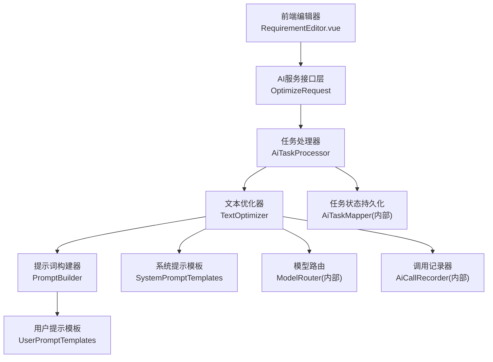
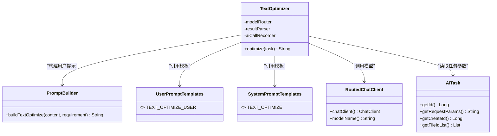
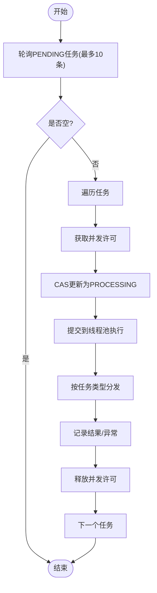
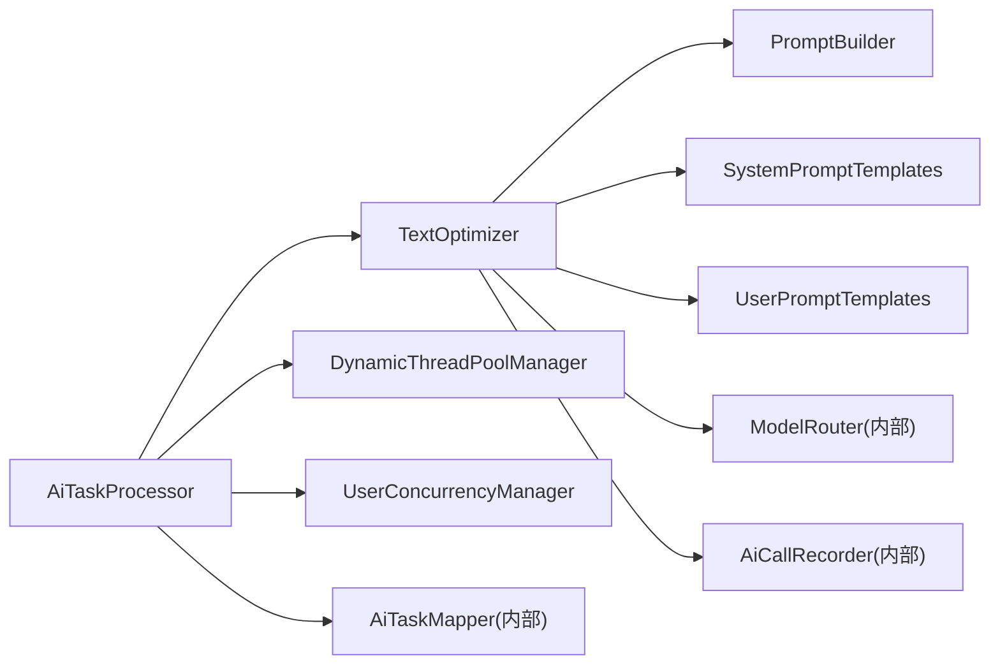

# 文本优化器

<cite>
**本文引用的文件**   
- [TextOptimizer.java](file://ele-ai-tender-system/ele-ai-tender-ai/src/main/java/com/jy/eleaitender/ai/processor/generator/TextOptimizer.java)
- [AiTaskProcessor.java](file://ele-ai-tender-system/ele-ai-tender-ai/src/main/java/com/jy/eleaitender/ai/processor/AiTaskProcessor.java)
- [PromptBuilder.java](file://ele-ai-tender-system/ele-ai-tender-ai/src/main/java/com/jy/eleaitender/ai/processor/prompt/PromptBuilder.java)
- [UserPromptTemplates.java](file://ele-ai-tender-system/ele-ai-tender-ai/src/main/java/com/jy/eleaitender/ai/processor/prompt/UserPromptTemplates.java)
- [SystemPromptTemplates.java](file://ele-ai-tender-system/ele-ai-tender-ai/src/main/java/com/jy/eleaitender/ai/processor/prompt/SystemPromptTemplates.java)
- [TextOptimizeParams.java](file://ele-ai-tender-system/ele-ai-tender-common/src/main/java/com/jy/eleaitender/common/dto/ai/TextOptimizeParams.java)
- [OptimizeRequest.java](file://ele-ai-tender-system/ele-ai-tender-ai/src/main/java/com/jy/eleaitender/ai/dto/request/OptimizeRequest.java)
- [RequirementEditor.vue](file://ele-ai-tender-frontend/src/views/requirement/RequirementEditor.vue)
- [ModelRouteRuleController.java](file://ele-ai-tender-system/ele-ai-tender-support/src/main/java/com/jy/eleaitender/support/controller/ModelRouteRuleController.java)
- [IModelRouteRuleService.java](file://ele-ai-tender-system/ele-ai-tender-support/src/main/java/com/jy/eleaitender/support/service/IModelRouteRuleService.java)
- [ModelRouteRuleServiceImpl.java](file://ele-ai-tender-system/ele-ai-tender-support/src/main/java/com/jy/eleaitender/support/service/impl/ModelRouteRuleServiceImpl.java)
- [ModelRouteRuleVO.java](file://ele-ai-tender-system/ele-ai-tender-support/src/main/java/com/jy/eleaitender/support/vo/ModelRouteRuleVO.java)
</cite>

## 目录
1. [简介](#简介)
2. [项目结构](#项目结构)
3. [核心组件](#核心组件)
4. [架构总览](#架构总览)
5. [详细组件分析](#详细组件分析)
6. [依赖关系分析](#依赖关系分析)
7. [性能与并发特性](#性能与并发特性)
8. [质量评估与效果调优](#质量评估与效果调优)
9. [高级特性：批量处理、增量优化、版本对比](#高级特性批量处理增量优化版本对比)
10. [自定义规则与策略配置](#自定义规则与策略配置)
11. [故障排查指南](#故障排查指南)
12. [结论](#结论)

## 简介
本技术文档面向“文本优化器”子系统，聚焦AI驱动的文本内容优化能力，包括语法修正、语义润色、风格统一、专业术语规范化等。系统通过任务化编排、模型路由、提示词工程与调用记录机制，实现稳定可观测的文本优化流程；同时提供前端交互、批量处理、增量优化与版本对比等高级特性，并支持基于使用场景的模型路由规则管理，便于在复杂业务环境中进行效果调优与治理。

## 项目结构
文本优化器位于后端AI服务模块中，围绕“任务驱动+提示词模板+模型路由+调用记录”的架构展开。前端通过编辑器触发优化请求，后端以任务形式调度执行，最终将优化结果回写至编辑器或持久化存储。



图表来源
- [TextOptimizer.java:1-62](file://ele-ai-tender-system/ele-ai-tender-ai/src/main/java/com/jy/eleaitender/ai/processor/generator/TextOptimizer.java#L1-L62)
- [AiTaskProcessor.java:1-196](file://ele-ai-tender-system/ele-ai-tender-ai/src/main/java/com/jy/eleaitender/ai/processor/AiTaskProcessor.java#L1-L196)
- [PromptBuilder.java:1-173](file://ele-ai-tender-system/ele-ai-tender-ai/src/main/java/com/jy/eleaitender/ai/processor/prompt/PromptBuilder.java#L1-L173)
- [UserPromptTemplates.java:1-225](file://ele-ai-tender-system/ele-ai-tender-ai/src/main/java/com/jy/eleaitender/ai/processor/prompt/UserPromptTemplates.java#L1-L225)
- [SystemPromptTemplates.java:1-497](file://ele-ai-tender-system/ele-ai-tender-ai/src/main/java/com/jy/eleaitender/ai/processor/prompt/SystemPromptTemplates.java#L1-L497)

章节来源
- [TextOptimizer.java:1-62](file://ele-ai-tender-system/ele-ai-tender-ai/src/main/java/com/jy/eleaitender/ai/processor/generator/TextOptimizer.java#L1-L62)
- [AiTaskProcessor.java:1-196](file://ele-ai-tender-system/ele-ai-tender-ai/src/main/java/com/jy/eleaitender/ai/processor/AiTaskProcessor.java#L1-L196)
- [PromptBuilder.java:1-173](file://ele-ai-tender-system/ele-ai-tender-ai/src/main/java/com/jy/eleaitender/ai/processor/prompt/PromptBuilder.java#L1-L173)
- [UserPromptTemplates.java:1-225](file://ele-ai-tender-system/ele-ai-tender-ai/src/main/java/com/jy/eleaitender/ai/processor/prompt/UserPromptTemplates.java#L1-L225)
- [SystemPromptTemplates.java:1-497](file://ele-ai-tender-system/ele-ai-tender-ai/src/main/java/com/jy/eleaitender/ai/processor/prompt/SystemPromptTemplates.java#L1-L497)

## 核心组件
- 文本优化器（TextOptimizer）：解析任务参数、构建提示词、选择模型、调用大模型并返回标准化JSON结果。
- 任务处理器（AiTaskProcessor）：定时拉取待处理任务，按类型分发到具体处理器，负责并发控制、超时与异常落库。
- 提示词构建器（PromptBuilder）：根据场景组装用户侧提示词，避免Spring AI模板占位符冲突。
- 提示词模板（UserPromptTemplates / SystemPromptTemplates）：定义文本优化的系统级与用户级提示词规范。
- 任务参数（TextOptimizeParams）：承载待优化内容与可选优化要求。
- 请求DTO（OptimizeRequest）：对外暴露的文本优化请求体。
- 前端编辑器（RequirementEditor.vue）：发起优化、接收流式结果、错误恢复与替换应用。

章节来源
- [TextOptimizer.java:1-62](file://ele-ai-tender-system/ele-ai-tender-ai/src/main/java/com/jy/eleaitender/ai/processor/generator/TextOptimizer.java#L1-L62)
- [AiTaskProcessor.java:1-196](file://ele-ai-tender-system/ele-ai-tender-ai/src/main/java/com/jy/eleaitender/ai/processor/AiTaskProcessor.java#L1-L196)
- [PromptBuilder.java:1-173](file://ele-ai-tender-system/ele-ai-tender-ai/src/main/java/com/jy/eleaitender/ai/processor/prompt/PromptBuilder.java#L1-L173)
- [UserPromptTemplates.java:1-225](file://ele-ai-tender-system/ele-ai-tender-ai/src/main/java/com/jy/eleaitender/ai/processor/prompt/UserPromptTemplates.java#L1-L225)
- [SystemPromptTemplates.java:1-497](file://ele-ai-tender-system/ele-ai-tender-ai/src/main/java/com/jy/eleaitender/ai/processor/prompt/SystemPromptTemplates.java#L1-L497)
- [TextOptimizeParams.java:1-16](file://ele-ai-tender-system/ele-ai-tender-common/src/main/java/com/jy/eleaitender/common/dto/ai/TextOptimizeParams.java#L1-L16)
- [OptimizeRequest.java:1-23](file://ele-ai-tender-system/ele-ai-tender-ai/src/main/java/com/jy/eleaitender/ai/dto/request/OptimizeRequest.java#L1-L23)
- [RequirementEditor.vue:256-306](file://ele-ai-tender-frontend/src/views/requirement/RequirementEditor.vue#L256-L306)

## 架构总览
文本优化器采用“任务驱动+提示词工程+模型路由+调用记录”的分层设计。前端提交优化请求后，后端将其转化为任务，由任务处理器轮询并分发至文本优化器；优化器组合系统提示与用户提示，经模型路由选择合适模型，调用完成后记录日志并返回结构化结果。

```mermaid
sequenceDiagram
participant FE as "前端编辑器"
participant API as "AI服务接口"
participant PROC as "任务处理器"
participant OPT as "文本优化器"
participant PB as "提示词构建器"
participant SPT as "系统提示模板"
participant UPT as "用户提示模板"
participant ROUTE as "模型路由"
participant REC as "调用记录器"
FE->>API : "提交优化请求(OptimizeRequest)"
API->>PROC : "创建任务并标记PENDING"
PROC->>PROC : "定时轮询PENDING任务"
PROC->>OPT : "分发TEXT_OPTIMIZE任务"
OPT->>PB : "构建用户提示(buildTextOptimize)"
PB-->>OPT : "用户提示字符串"
OPT->>SPT : "加载系统提示(TEXT_OPTIMIZE)"
OPT->>ROUTE : "按场景路由模型"
ROUTE-->>OPT : "RoutedChatClient"
OPT->>REC : "同步调用并记录响应"
REC-->>OPT : "优化后的文本"
OPT-->>PROC : "返回JSON结果{optimizedContent}"
PROC-->>API : "更新任务为COMPLETED"
API-->>FE : "推送结果/前端应用替换"
```

图表来源
- [AiTaskProcessor.java:1-196](file://ele-ai-tender-system/ele-ai-tender-ai/src/main/java/com/jy/eleaitender/ai/processor/AiTaskProcessor.java#L1-L196)
- [TextOptimizer.java:1-62](file://ele-ai-tender-system/ele-ai-tender-ai/src/main/java/com/jy/eleaitender/ai/processor/generator/TextOptimizer.java#L1-L62)
- [PromptBuilder.java:1-173](file://ele-ai-tender-system/ele-ai-tender-ai/src/main/java/com/jy/eleaitender/ai/processor/prompt/PromptBuilder.java#L1-L173)
- [UserPromptTemplates.java:1-225](file://ele-ai-tender-system/ele-ai-tender-ai/src/main/java/com/jy/eleaitender/ai/processor/prompt/UserPromptTemplates.java#L1-L225)
- [SystemPromptTemplates.java:1-497](file://ele-ai-tender-system/ele-ai-tender-ai/src/main/java/com/jy/eleaitender/ai/processor/prompt/SystemPromptTemplates.java#L1-L497)

## 详细组件分析

### 文本优化器（TextOptimizer）
- 职责：解析任务参数、构建提示词、路由模型、调用大模型、封装结果。
- 关键流程：
  - 解析TextOptimizeParams(content, requirement)。
  - 使用PromptBuilder.buildTextOptimize生成用户提示。
  - 通过ModelRouter按AiTaskType.TEXT_OPTIMIZE选择模型。
  - 使用AiCallRecorder.callAndRecord完成同步调用与记录。
  - 返回JSON格式{"optimizedContent": "..."}。
- 复杂度：O(n)用于参数解析与提示词拼接；模型调用时间取决于外部服务。
- 错误处理：由上层任务处理器捕获异常并落库。



图表来源
- [TextOptimizer.java:1-62](file://ele-ai-tender-system/ele-ai-tender-ai/src/main/java/com/jy/eleaitender/ai/processor/generator/TextOptimizer.java#L1-L62)
- [PromptBuilder.java:1-173](file://ele-ai-tender-system/ele-ai-tender-ai/src/main/java/com/jy/eleaitender/ai/processor/prompt/PromptBuilder.java#L1-L173)
- [UserPromptTemplates.java:1-225](file://ele-ai-tender-system/ele-ai-tender-ai/src/main/java/com/jy/eleaitender/ai/processor/prompt/UserPromptTemplates.java#L1-L225)
- [SystemPromptTemplates.java:1-497](file://ele-ai-tender-system/ele-ai-tender-ai/src/main/java/com/jy/eleaitender/ai/processor/prompt/SystemPromptTemplates.java#L1-L497)

章节来源
- [TextOptimizer.java:1-62](file://ele-ai-tender-system/ele-ai-tender-ai/src/main/java/com/jy/eleaitender/ai/processor/generator/TextOptimizer.java#L1-L62)

### 任务处理器（AiTaskProcessor）
- 职责：定时轮询PENDING任务，并发控制、超时处理、异常分类落库、按类型分发。
- 关键点：
  - 每5秒轮询，限制每次拉取数量。
  - 用户并发许可控制（UserConcurrencyManager）。
  - 动态线程池执行，支持任务级超时覆盖。
  - 异常分类：AI不可用、内容异常、通用失败。
  - 分发逻辑：switch(AiTaskType) -> textOptimizer.optimize(task)。



图表来源
- [AiTaskProcessor.java:1-196](file://ele-ai-tender-system/ele-ai-tender-ai/src/main/java/com/jy/eleaitender/ai/processor/AiTaskProcessor.java#L1-L196)

章节来源
- [AiTaskProcessor.java:1-196](file://ele-ai-tender-system/ele-ai-tender-ai/src/main/java/com/jy/eleaitender/ai/processor/AiTaskProcessor.java#L1-L196)

### 提示词工程（PromptBuilder / Templates）
- 目标：在不被Spring AI模板引擎误解析的前提下，安全地注入变量与示例。
- 文本优化：
  - 用户提示模板包含原文与优化要求，默认要求为“提升专业性和规范性”。
  - 系统提示明确优化原则：保持原意、提升专业性、消除歧义、严谨准确、符合行业用语。
- 扩展点：新增优化维度（如术语规范化、风格统一）可在模板中追加约束。

章节来源
- [PromptBuilder.java:1-173](file://ele-ai-tender-system/ele-ai-tender-ai/src/main/java/com/jy/eleaitender/ai/processor/prompt/PromptBuilder.java#L1-L173)
- [UserPromptTemplates.java:1-225](file://ele-ai-tender-system/ele-ai-tender-ai/src/main/java/com/jy/eleaitender/ai/processor/prompt/UserPromptTemplates.java#L1-L225)
- [SystemPromptTemplates.java:1-497](file://ele-ai-tender-system/ele-ai-tender-ai/src/main/java/com/jy/eleaitender/ai/processor/prompt/SystemPromptTemplates.java#L1-L497)

### 数据模型与接口契约
- 任务参数（TextOptimizeParams）：content、requirement。
- 请求体（OptimizeRequest）：content、requirement、projectId。
- 返回结果：JSON字符串{"optimizedContent": "..."}。

章节来源
- [TextOptimizeParams.java:1-16](file://ele-ai-tender-system/ele-ai-tender-common/src/main/java/com/jy/eleaitender/common/dto/ai/TextOptimizeParams.java#L1-L16)
- [OptimizeRequest.java:1-23](file://ele-ai-tender-system/ele-ai-tender-ai/src/main/java/com/jy/eleaitender/ai/dto/request/OptimizeRequest.java#L1-L23)

### 前端集成与用户体验
- 编辑器在优化过程中实时追加流式内容，失败时恢复原始文本，成功时提示完成。
- 支持选中替换：当原文已被修改则提示手动替换，存在多处相同内容时仅替换第一处。

章节来源
- [RequirementEditor.vue:256-306](file://ele-ai-tender-frontend/src/views/requirement/RequirementEditor.vue#L256-L306)

## 依赖关系分析
- 组件耦合：
  - TextOptimizer依赖PromptBuilder、SystemPromptTemplates、UserPromptTemplates、ModelRouter、AiCallRecorder。
  - AiTaskProcessor依赖DynamicThreadPoolManager、UserConcurrencyManager、AiTaskMapper与各处理器。
- 外部依赖：
  - 模型路由与调用记录为内部抽象，实际模型接入与日志持久化由底层实现负责。
- 潜在循环依赖：无直接循环，分层清晰。



图表来源
- [AiTaskProcessor.java:1-196](file://ele-ai-tender-system/ele-ai-tender-ai/src/main/java/com/jy/eleaitender/ai/processor/AiTaskProcessor.java#L1-L196)
- [TextOptimizer.java:1-62](file://ele-ai-tender-system/ele-ai-tender-ai/src/main/java/com/jy/eleaitender/ai/processor/generator/TextOptimizer.java#L1-L62)
- [PromptBuilder.java:1-173](file://ele-ai-tender-system/ele-ai-tender-ai/src/main/java/com/jy/eleaitender/ai/processor/prompt/PromptBuilder.java#L1-L173)
- [UserPromptTemplates.java:1-225](file://ele-ai-tender-system/ele-ai-tender-ai/src/main/java/com/jy/eleaitender/ai/processor/prompt/UserPromptTemplates.java#L1-L225)
- [SystemPromptTemplates.java:1-497](file://ele-ai-tender-system/ele-ai-tender-ai/src/main/java/com/jy/eleaitender/ai/processor/prompt/SystemPromptTemplates.java#L1-L497)

## 性能与并发特性
- 任务拉取：固定延迟5秒，单次上限10条，降低数据库压力。
- 并发控制：基于用户维度的并发许可，避免单用户过载。
- 超时保护：支持全局与任务级超时，防止长尾任务阻塞。
- 线程池：动态线程池管理，提高吞吐与弹性。
- 建议：
  - 对超长文本进行分块优化，减少单次调用成本。
  - 结合缓存与去重策略，避免重复优化相同内容。

[本节为通用指导，不直接分析具体文件]

## 质量评估与效果调优
- 评估维度：
  - 语言质量：语法正确性、表达清晰度、术语一致性。
  - 合规性：是否符合招投标法规与行业规范。
  - 可读性：段落结构、编号规范、表格与附件完整性。
- 调优手段：
  - 调整系统提示中的优化原则与约束条件。
  - 细化用户提示中的优化要求，例如指定术语表、风格指南。
  - 通过模型路由规则切换主/降级模型，平衡质量与成本。
- 监控指标：
  - 成功率、平均耗时、失败原因分布、内容异常率。
  - 前后端日志与调用记录关联追踪。

[本节为通用指导，不直接分析具体文件]

## 高级特性：批量处理、增量优化、版本对比
- 批量处理：
  - 通过任务队列分批拉取与执行，天然支持批量优化。
  - 建议在批量前进行内容去重与分块，提升效率。
- 增量优化：
  - 在前端层面，基于选中替换与流式追加，实现局部优化与快速反馈。
  - 在后端层面，可对变更片段单独构建提示词，减少上下文长度。
- 版本对比：
  - 前端已具备版本对比组件，可将优化前后的文本差异可视化展示，辅助人工审核。

章节来源
- [AiTaskProcessor.java:1-196](file://ele-ai-tender-system/ele-ai-tender-ai/src/main/java/com/jy/eleaitender/ai/processor/AiTaskProcessor.java#L1-L196)
- [RequirementEditor.vue:256-306](file://ele-ai-tender-frontend/src/views/requirement/RequirementEditor.vue#L256-L306)

## 自定义规则与策略配置
- 模型路由规则管理：
  - 提供REST接口分页查询、启用/停用、创建/更新/删除。
  - 支持按使用场景筛选生效规则，按优先级排序。
  - VO对象包含主/降级模型ID与名称，便于前端展示与操作。
- 使用场景：
  - 内容生成、内容优化等场景可分别配置不同模型策略。
- 配置项说明（字段含义）：
  - usageScenario：使用场景标识（如“内容优化”）。
  - primaryModelId/fallbackModelId：主/降级模型ID。
  - priority：优先级数值，越小越优先。
  - isActive：是否启用（1启用，0停用）。
  - description：规则描述。

章节来源
- [ModelRouteRuleController.java:35-80](file://ele-ai-tender-system/ele-ai-tender-support/src/main/java/com/jy/eleaitender/support/controller/ModelRouteRuleController.java#L35-L80)
- [IModelRouteRuleService.java:1-61](file://ele-ai-tender-system/ele-ai-tender-support/src/main/java/com/jy/eleaitender/support/service/IModelRouteRuleService.java#L1-L61)
- [ModelRouteRuleServiceImpl.java:34-64](file://ele-ai-tender-system/ele-ai-tender-support/src/main/java/com/jy/eleaitender/support/service/impl/ModelRouteRuleServiceImpl.java#L34-L64)
- [ModelRouteRuleVO.java:1-39](file://ele-ai-tender-system/ele-ai-tender-support/src/main/java/com/jy/eleaitender/support/vo/ModelRouteRuleVO.java#L1-L39)

## 故障排查指南
- 常见问题定位：
  - 任务未执行：检查PENDING任务是否存在、并发许可是否耗尽、线程池是否可用。
  - 模型不可用：查看异常分类是否为AI不可用，确认模型连通性与配额。
  - 内容异常：检查AI返回内容是否满足预期格式，必要时增加修复步骤。
  - 前端替换失败：确认原文未被修改且唯一匹配，否则需手动替换。
- 日志与追踪：
  - 利用调用记录器输出模型名、任务ID、用户ID与文件列表，便于问题回溯。
  - 结合任务状态流转（PENDING→PROCESSING→COMPLETED/FAILED）定位阶段。

章节来源
- [AiTaskProcessor.java:1-196](file://ele-ai-tender-system/ele-ai-tender-ai/src/main/java/com/jy/eleaitender/ai/processor/AiTaskProcessor.java#L1-L196)
- [TextOptimizer.java:1-62](file://ele-ai-tender-system/ele-ai-tender-ai/src/main/java/com/jy/eleaitender/ai/processor/generator/TextOptimizer.java#L1-L62)
- [RequirementEditor.vue:256-306](file://ele-ai-tender-frontend/src/views/requirement/RequirementEditor.vue#L256-L306)

## 结论
文本优化器以任务化编排为核心，结合提示词工程与模型路由，实现了稳定、可扩展的AI文本优化能力。通过并发控制、超时保护与调用记录，系统在大规模使用中具备良好的可观测性与鲁棒性。配合前端编辑器的流式体验与版本对比，以及模型路由规则的灵活配置，能够满足招标文件编制中对语法修正、语义润色、风格统一与术语规范化的综合需求。后续可在术语库与风格指南的引入、分块优化与质量评分等方面持续演进。