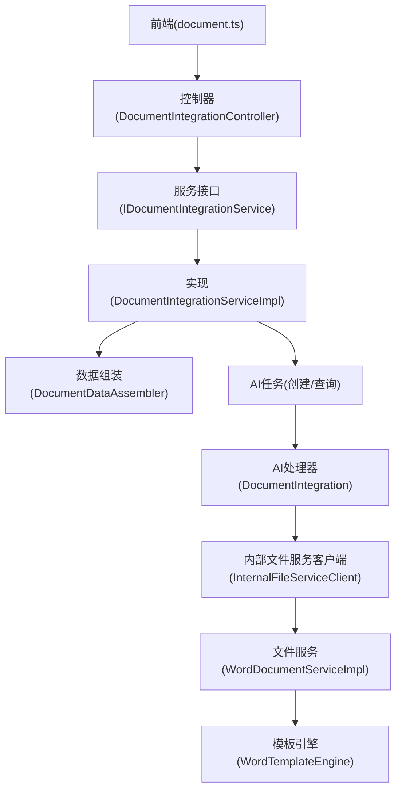
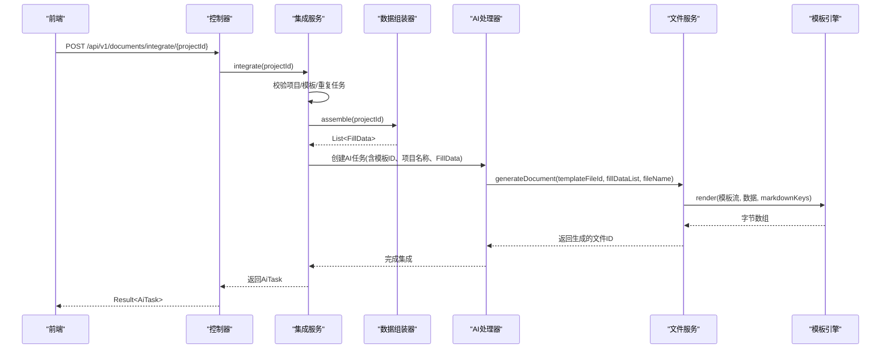
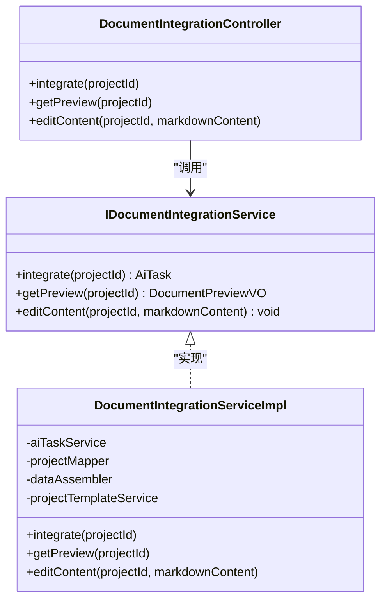
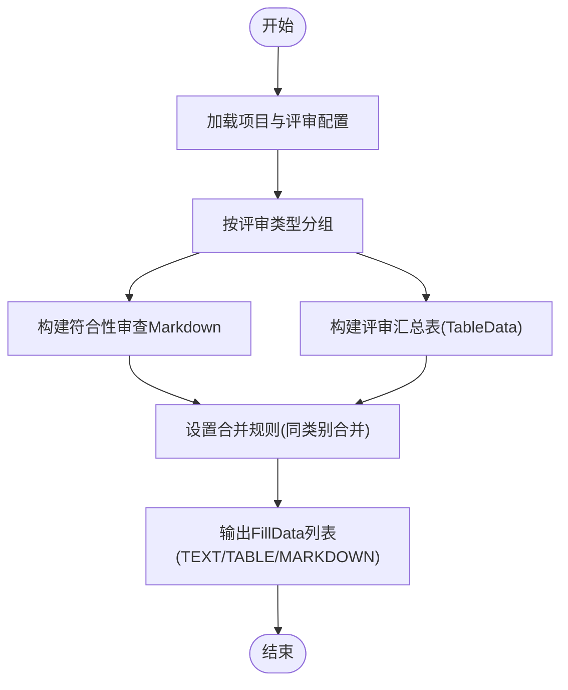
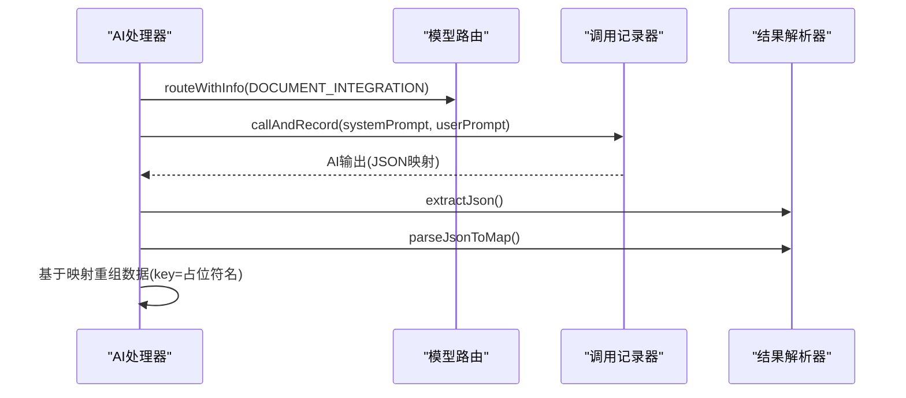
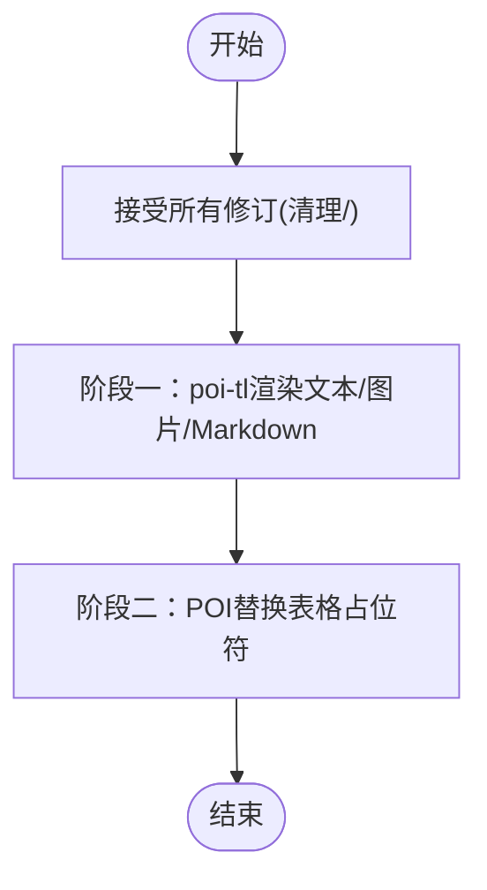
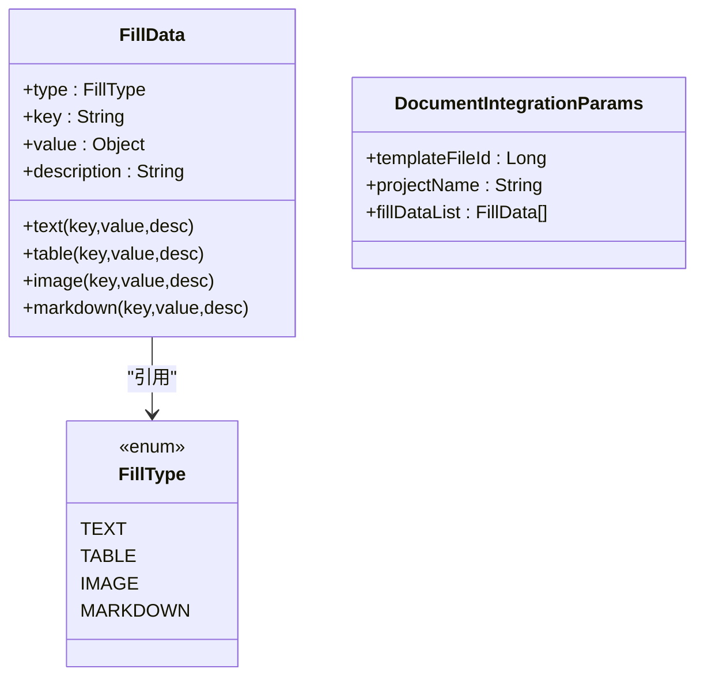
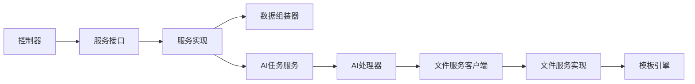

# 文档集成器

<cite>
**本文引用的文件**   
- [DocumentIntegrationController.java](file://ele-ai-tender-system/ele-ai-tender-core/src/main/java/com/jy/eleaitender/core/controller/DocumentIntegrationController.java)
- [IDocumentIntegrationService.java](file://ele-ai-tender-system/ele-ai-tender-core/src/main/java/com/jy/eleaitender/core/service/IDocumentIntegrationService.java)
- [DocumentIntegrationServiceImpl.java](file://ele-ai-tender-system/ele-ai-tender-core/src/main/java/com/jy/eleaitender/core/service/impl/DocumentIntegrationServiceImpl.java)
- [DocumentDataAssembler.java](file://ele-ai-tender-system/ele-ai-tender-core/src/main/java/com/jy/eleaitender/core/engine/DocumentDataAssembler.java)
- [DocumentIntegrationParams.java](file://ele-ai-tender-system/ele-ai-tender-common/src/main/java/com/jy/eleaitender/common/dto/ai/DocumentIntegrationParams.java)
- [FillData.java](file://ele-ai-tender-system/ele-ai-tender-common/src/main/java/com/jy/eleaitender/common/dto/FillData.java)
- [FillType.java](file://ele-ai-tender-system/ele-ai-tender-common/src/main/java/com/jy/eleaitender/common/dto/FillType.java)
- [DocumentIntegration.java](file://ele-ai-tender-system/ele-ai-tender-ai/src/main/java/com/jy/eleaitender/ai/processor/generator/DocumentIntegration.java)
- [WordTemplateEngine.java](file://ele-ai-tender-system/ele-ai-tender-file/src/main/java/com/jy/eleaitender/file/engine/WordTemplateEngine.java)
- [WordDocumentServiceImpl.java](file://ele-ai-tender-system/ele-ai-tender-file/src/main/java/com/jy/eleaitender/file/service/impl/WordDocumentServiceImpl.java)
- [FILE_SERVICE_SPEC.md](file://docs/rules/FILE_SERVICE_SPEC.md)
- [document.ts](file://ele-ai-tender-frontend/src/api/document.ts)
</cite>

## 目录
1. [简介](#简介)
2. [项目结构](#项目结构)
3. [核心组件](#核心组件)
4. [架构总览](#架构总览)
5. [详细组件分析](#详细组件分析)
6. [依赖关系分析](#依赖关系分析)
7. [性能与优化](#性能与优化)
8. [故障排查指南](#故障排查指南)
9. [结论](#结论)
10. [附录](#附录)

## 简介
本技术文档聚焦“文档集成器”的多来源内容智能整合机制，围绕以下目标展开：
- 多来源数据到模板填充数据的结构化组装（去重、合并、冲突解决、一致性校验）
- 文档解析与渲染（poi-tl 原生引擎、修订标记清理、两阶段渲染）
- 占位符与数据字段语义匹配（AI 辅助映射）
- 复杂文档结构处理、格式兼容与大文件优化策略
- 自定义集成规则与性能调优建议

## 项目结构
文档集成器涉及 Core、AI、File 三个服务模块以及前端 API 调用。整体流程为：
- 前端通过 /core-api/v1/documents/* 发起集成请求
- Core 层负责任务编排、数据组装与模板绑定
- AI 层在必要时进行占位符与数据字段的语义匹配
- File 层基于 poi-tl 模板引擎生成 Word 文档

图表来源
- [DocumentIntegrationController.java:1-49](file://ele-ai-tender-system/ele-ai-tender-core/src/main/java/com/jy/eleaitender/core/controller/DocumentIntegrationController.java#L1-L49)
- [IDocumentIntegrationService.java:1-25](file://ele-ai-tender-system/ele-ai-tender-core/src/main/java/com/jy/eleaitender/core/service/IDocumentIntegrationService.java#L1-L25)
- [DocumentIntegrationServiceImpl.java:1-112](file://ele-ai-tender-system/ele-ai-tender-core/src/main/java/com/jy/eleaitender/core/service/impl/DocumentIntegrationServiceImpl.java#L1-L112)
- [DocumentDataAssembler.java:1-267](file://ele-ai-tender-system/ele-ai-tender-core/src/main/java/com/jy/eleaitender/core/engine/DocumentDataAssembler.java#L1-L267)
- [DocumentIntegration.java:1-180](file://ele-ai-tender-system/ele-ai-tender-ai/src/main/java/com/jy/eleaitender/ai/processor/generator/DocumentIntegration.java#L1-L180)
- [WordDocumentServiceImpl.java:71-152](file://ele-ai-tender-system/ele-ai-tender-file/src/main/java/com/jy/eleaitender/file/service/impl/WordDocumentServiceImpl.java#L71-L152)
- [WordTemplateEngine.java:1-121](file://ele-ai-tender-system/ele-ai-tender-file/src/main/java/com/jy/eleaitender/file/engine/WordTemplateEngine.java#L1-L121)
- [document.ts:1-20](file://ele-ai-tender-frontend/src/api/document.ts#L1-L20)

章节来源
- [DocumentIntegrationController.java:1-49](file://ele-ai-tender-system/ele-ai-tender-core/src/main/java/com/jy/eleaitender/core/controller/DocumentIntegrationController.java#L1-L49)
- [IDocumentIntegrationService.java:1-25](file://ele-ai-tender-system/ele-ai-tender-core/src/main/java/com/jy/eleaitender/core/service/IDocumentIntegrationService.java#L1-L25)
- [DocumentIntegrationServiceImpl.java:1-112](file://ele-ai-tender-system/ele-ai-tender-core/src/main/java/com/jy/eleaitender/core/service/impl/DocumentIntegrationServiceImpl.java#L1-L112)
- [DocumentDataAssembler.java:1-267](file://ele-ai-tender-system/ele-ai-tender-core/src/main/java/com/jy/eleaitender/core/engine/DocumentDataAssembler.java#L1-L267)
- [DocumentIntegration.java:1-180](file://ele-ai-tender-system/ele-ai-tender-ai/src/main/java/com/jy/eleaitender/ai/processor/generator/DocumentIntegration.java#L1-L180)
- [WordDocumentServiceImpl.java:71-152](file://ele-ai-tender-system/ele-ai-tender-file/src/main/java/com/jy/eleaitender/file/service/impl/WordDocumentServiceImpl.java#L71-L152)
- [WordTemplateEngine.java:1-121](file://ele-ai-tender-system/ele-ai-tender-file/src/main/java/com/jy/eleaitender/file/engine/WordTemplateEngine.java#L1-L121)
- [document.ts:1-20](file://ele-ai-tender-frontend/src/api/document.ts#L1-L20)

## 核心组件
- 控制器层：提供文档集成的 REST 接口，包括执行集成、获取预览、编辑内容（当前不支持在线编辑）。
- 服务层：负责项目校验、重复任务检查、模板绑定、数据组装与任务创建。
- 数据组装器：将项目基础信息、需求内容与评审项数据转换为 FillData 列表，支持 TEXT/TABLE/IMAGE/MARKDOWN 四类类型。
- AI 处理器：在需要时通过模型进行占位符与数据字段语义匹配，并调用 File 服务生成文档。
- 文件服务：两阶段渲染（文本/图片/Markdown 由 poi-tl 渲染；表格由 POI 编程生成），并对模板修订标记进行预处理。

章节来源
- [DocumentIntegrationController.java:1-49](file://ele-ai-tender-system/ele-ai-tender-core/src/main/java/com/jy/eleaitender/core/controller/DocumentIntegrationController.java#L1-L49)
- [DocumentIntegrationServiceImpl.java:1-112](file://ele-ai-tender-system/ele-ai-tender-core/src/main/java/com/jy/eleaitender/core/service/impl/DocumentIntegrationServiceImpl.java#L1-L112)
- [DocumentDataAssembler.java:1-267](file://ele-ai-tender-system/ele-ai-tender-core/src/main/java/com/jy/eleaitender/core/engine/DocumentDataAssembler.java#L1-L267)
- [DocumentIntegration.java:1-180](file://ele-ai-tender-system/ele-ai-tender-ai/src/main/java/com/jy/eleaitender/ai/processor/generator/DocumentIntegration.java#L1-L180)
- [WordDocumentServiceImpl.java:71-152](file://ele-ai-tender-system/ele-ai-tender-file/src/main/java/com/jy/eleaitender/file/service/impl/WordDocumentServiceImpl.java#L71-L152)
- [WordTemplateEngine.java:1-121](file://ele-ai-tender-system/ele-ai-tender-file/src/main/java/com/jy/eleaitender/file/engine/WordTemplateEngine.java#L1-L121)

## 架构总览
文档集成器的端到端调用序列如下：

图表来源
- [DocumentIntegrationController.java:26-49](file://ele-ai-tender-system/ele-ai-tender-core/src/main/java/com/jy/eleaitender/core/controller/DocumentIntegrationController.java#L26-L49)
- [DocumentIntegrationServiceImpl.java:49-78](file://ele-ai-tender-system/ele-ai-tender-core/src/main/java/com/jy/eleaitender/core/service/impl/DocumentIntegrationServiceImpl.java#L49-L78)
- [DocumentDataAssembler.java:47-99](file://ele-ai-tender-system/ele-ai-tender-core/src/main/java/com/jy/eleaitender/core/engine/DocumentDataAssembler.java#L47-L99)
- [DocumentIntegration.java:55-75](file://ele-ai-tender-system/ele-ai-tender-ai/src/main/java/com/jy/eleaitender/ai/processor/generator/DocumentIntegration.java#L55-L75)
- [WordDocumentServiceImpl.java:76-133](file://ele-ai-tender-system/ele-ai-tender-file/src/main/java/com/jy/eleaitender/file/service/impl/WordDocumentServiceImpl.java#L76-L133)
- [WordTemplateEngine.java:42-63](file://ele-ai-tender-system/ele-ai-tender-file/src/main/java/com/jy/eleaitender/file/engine/WordTemplateEngine.java#L42-L63)

## 详细组件分析

### 控制器与服务层
- 控制器暴露三个接口：执行集成、获取预览、编辑内容。当前编辑功能未启用，提示通过模板修改后重新生成。
- 服务层在执行集成前进行：
  - 项目存在性校验
  - 活跃任务重复检测（PENDING/PROCESSING）
  - 项目模板绑定校验
  - 数据组装与任务创建（包含模板文件ID、项目名称、FillData 列表）

图表来源
- [DocumentIntegrationController.java:1-49](file://ele-ai-tender-system/ele-ai-tender-core/src/main/java/com/jy/eleaitender/core/controller/DocumentIntegrationController.java#L1-L49)
- [IDocumentIntegrationService.java:1-25](file://ele-ai-tender-system/ele-ai-tender-core/src/main/java/com/jy/eleaitender/core/service/IDocumentIntegrationService.java#L1-L25)
- [DocumentIntegrationServiceImpl.java:1-112](file://ele-ai-tender-system/ele-ai-tender-core/src/main/java/com/jy/eleaitender/core/service/impl/DocumentIntegrationServiceImpl.java#L1-L112)

章节来源
- [DocumentIntegrationController.java:1-49](file://ele-ai-tender-system/ele-ai-tender-core/src/main/java/com/jy/eleaitender/core/controller/DocumentIntegrationController.java#L1-L49)
- [DocumentIntegrationServiceImpl.java:49-112](file://ele-ai-tender-system/ele-ai-tender-core/src/main/java/com/jy/eleaitender/core/service/impl/DocumentIntegrationServiceImpl.java#L49-L112)

### 数据组装器（多来源整合与冲突解决）
- 数据来源：项目基础信息、需求内容、评审项配置与明细。
- 整合策略：
  - 去重：按 ReviewType 分组，使用 LinkedHashMap 保持顺序，避免重复类别输出。
  - 结构合并：符合性审查项以 Markdown 形式输出，忽略一级节点，仅展示二级与三级项。
  - 冲突解决：主观/客观列根据 ReviewConfig 动态控制；权重模式与分值模式分别处理类别标签与最高分值计算。
  - 一致性校验：空值安全处理（nullSafe）、评分求和与格式化、分类标签统一映射。

图表来源
- [DocumentDataAssembler.java:47-99](file://ele-ai-tender-system/ele-ai-tender-core/src/main/java/com/jy/eleaitender/core/engine/DocumentDataAssembler.java#L47-L99)
- [DocumentDataAssembler.java:106-121](file://ele-ai-tender-system/ele-ai-tender-core/src/main/java/com/jy/eleaitender/core/engine/DocumentDataAssembler.java#L106-L121)
- [DocumentDataAssembler.java:132-166](file://ele-ai-tender-system/ele-ai-tender-core/src/main/java/com/jy/eleaitender/core/engine/DocumentDataAssembler.java#L132-L166)
- [DocumentDataAssembler.java:170-214](file://ele-ai-tender-system/ele-ai-tender-core/src/main/java/com/jy/eleaitender/core/engine/DocumentDataAssembler.java#L170-L214)

章节来源
- [DocumentDataAssembler.java:1-267](file://ele-ai-tender-system/ele-ai-tender-core/src/main/java/com/jy/eleaitender/core/engine/DocumentDataAssembler.java#L1-L267)

### AI 处理器（占位符与数据字段语义匹配）
- 当模板占位符名称与数据 key 不一致时，可通过 AI 进行语义匹配，生成映射表，再重组数据。
- 当前主流程直接调用 File 服务生成文档；AI 匹配作为可选增强路径（代码中存在 TODO 注释）。

图表来源
- [DocumentIntegration.java:111-166](file://ele-ai-tender-system/ele-ai-tender-ai/src/main/java/com/jy/eleaitender/ai/processor/generator/DocumentIntegration.java#L111-L166)
- [PromptBuilder.java:158-162](file://ele-ai-tender-system/ele-ai-tender-ai/src/main/java/com/jy/eleaitender/ai/processor/prompt/PromptBuilder.java#L158-L162)
- [SystemPromptTemplates.java:478-494](file://ele-ai-tender-system/ele-ai-tender-ai/src/main/java/com/jy/eleaitender/ai/processor/prompt/SystemPromptTemplates.java#L478-L494)

章节来源
- [DocumentIntegration.java:55-100](file://ele-ai-tender-system/ele-ai-tender-ai/src/main/java/com/jy/eleaitender/ai/processor/generator/DocumentIntegration.java#L55-L100)
- [DocumentIntegration.java:111-166](file://ele-ai-tender-system/ele-ai-tender-ai/src/main/java/com/jy/eleaitender/ai/processor/generator/DocumentIntegration.java#L111-L166)

### 文件服务与模板引擎（两阶段渲染与修订标记清理）
- 两阶段渲染：
  - 阶段一：文本、图片、Markdown 由 poi-tl 渲染；TABLE 类型替换为占位文本。
  - 阶段二：POI 扫描占位段落，用 TableGenerator 生成真实表格。
- 修订标记清理：在渲染前接受所有修订，避免 poi-tl 因 <w:ins> 包裹导致索引错乱异常。
- 模板约束：必须使用原生引擎（禁止 SpringEL），占位符语法遵循 {{var}} 等规范。

图表来源
- [WordDocumentServiceImpl.java:76-133](file://ele-ai-tender-system/ele-ai-tender-file/src/main/java/com/jy/eleaitender/file/service/impl/WordDocumentServiceImpl.java#L76-L133)
- [WordTemplateEngine.java:42-89](file://ele-ai-tender-system/ele-ai-tender-file/src/main/java/com/jy/eleaitender/file/engine/WordTemplateEngine.java#L42-L89)
- [FILE_SERVICE_SPEC.md:33-71](file://docs/rules/FILE_SERVICE_SPEC.md#L33-L71)

章节来源
- [WordDocumentServiceImpl.java:71-152](file://ele-ai-tender-system/ele-ai-tender-file/src/main/java/com/jy/eleaitender/file/service/impl/WordDocumentServiceImpl.java#L71-L152)
- [WordTemplateEngine.java:1-121](file://ele-ai-tender-system/ele-ai-tender-file/src/main/java/com/jy/eleaitender/file/engine/WordTemplateEngine.java#L1-L121)
- [FILE_SERVICE_SPEC.md:33-71](file://docs/rules/FILE_SERVICE_SPEC.md#L33-L71)

### 数据结构与类型系统
- FillData：统一的填充数据项，支持 TEXT/TABLE/IMAGE/MARKDOWN 四种类型，并提供便捷构造方法。
- FillType：枚举定义数据类型，用于分派渲染逻辑。
- DocumentIntegrationParams：AI 任务参数，包含模板文件ID、项目名称与 FillData 列表。

图表来源
- [FillData.java:1-60](file://ele-ai-tender-system/ele-ai-tender-common/src/main/java/com/jy/eleaitender/common/dto/FillData.java#L1-L60)
- [FillType.java:1-19](file://ele-ai-tender-system/ele-ai-tender-common/src/main/java/com/jy/eleaitender/common/dto/FillType.java#L1-L19)
- [DocumentIntegrationParams.java:1-20](file://ele-ai-tender-system/ele-ai-tender-common/src/main/java/com/jy/eleaitender/common/dto/ai/DocumentIntegrationParams.java#L1-L20)

章节来源
- [FillData.java:1-60](file://ele-ai-tender-system/ele-ai-tender-common/src/main/java/com/jy/eleaitender/common/dto/FillData.java#L1-L60)
- [FillType.java:1-19](file://ele-ai-tender-system/ele-ai-tender-common/src/main/java/com/jy/eleaitender/common/dto/FillType.java#L1-L19)
- [DocumentIntegrationParams.java:1-20](file://ele-ai-tender-system/ele-ai-tender-common/src/main/java/com/jy/eleaitender/common/dto/ai/DocumentIntegrationParams.java#L1-L20)

## 依赖关系分析
- 控制器依赖服务接口；服务实现依赖数据组装器、项目模板服务与 AI 任务服务。
- AI 处理器依赖内部文件服务客户端与模型路由；文件服务依赖模板引擎与存储。
- 模板引擎依赖 poi-tl 原生引擎与 DOM 操作进行修订清理。

图表来源
- [DocumentIntegrationController.java:1-49](file://ele-ai-tender-system/ele-ai-tender-core/src/main/java/com/jy/eleaitender/core/controller/DocumentIntegrationController.java#L1-L49)
- [DocumentIntegrationServiceImpl.java:1-112](file://ele-ai-tender-system/ele-ai-tender-core/src/main/java/com/jy/eleaitender/core/service/impl/DocumentIntegrationServiceImpl.java#L1-L112)
- [DocumentIntegration.java:1-180](file://ele-ai-tender-system/ele-ai-tender-ai/src/main/java/com/jy/eleaitender/ai/processor/generator/DocumentIntegration.java#L1-L180)
- [WordDocumentServiceImpl.java:71-152](file://ele-ai-tender-system/ele-ai-tender-file/src/main/java/com/jy/eleaitender/file/service/impl/WordDocumentServiceImpl.java#L71-L152)
- [WordTemplateEngine.java:1-121](file://ele-ai-tender-system/ele-ai-tender-file/src/main/java/com/jy/eleaitender/file/engine/WordTemplateEngine.java#L1-L121)

章节来源
- [DocumentIntegrationController.java:1-49](file://ele-ai-tender-system/ele-ai-tender-core/src/main/java/com/jy/eleaitender/core/controller/DocumentIntegrationController.java#L1-L49)
- [DocumentIntegrationServiceImpl.java:1-112](file://ele-ai-tender-system/ele-ai-tender-core/src/main/java/com/jy/eleaitender/core/service/impl/DocumentIntegrationServiceImpl.java#L1-L112)
- [DocumentIntegration.java:1-180](file://ele-ai-tender-system/ele-ai-tender-ai/src/main/java/com/jy/eleaitender/ai/processor/generator/DocumentIntegration.java#L1-L180)
- [WordDocumentServiceImpl.java:71-152](file://ele-ai-tender-system/ele-ai-tender-file/src/main/java/com/jy/eleaitender/file/service/impl/WordDocumentServiceImpl.java#L71-L152)
- [WordTemplateEngine.java:1-121](file://ele-ai-tender-system/ele-ai-tender-file/src/main/java/com/jy/eleaitender/file/engine/WordTemplateEngine.java#L1-L121)

## 性能与优化
- 模板引擎选择：使用原生引擎避免 SpringEL 反射开销与缺失字段异常，提升容错性与性能。
- 修订标记清理：在渲染前批量清理修订标记，减少 poi-tl 编译阶段的异常与回退成本。
- 两阶段渲染：将表格生成从模板中解耦，降低模板复杂度与渲染失败概率。
- 大文件优化：
  - 流式处理模板输入输出，避免一次性加载大文件到内存。
  - 表格生成采用 POI 编程方式，避免大量循环标签导致的模板解析问题。
  - 合理拆分 FillData，减少单次渲染的数据体积。
- 并发与线程池：AI 任务可结合动态线程池管理，避免阻塞与资源争用。

[本节为通用指导，不直接分析具体文件]

## 故障排查指南
- 重复集成任务：若检测到 PENDING/PROCESSING 状态的任务，会抛出业务异常，需等待或取消后再试。
- 模板未绑定：项目未绑定模板或模板无文件时，集成流程终止并返回错误。
- 在线编辑不支持：当前 editContent 接口明确提示不支持在线编辑，需通过模板修改后重新生成。
- 模板修订标记异常：若出现 IndexOutOfBoundsException，检查模板是否包含修订标记，确保已接受所有修订。
- 内部服务调用错误：检查 InternalFileServiceClient 的错误响应处理与 JWT 认证配置。

章节来源
- [DocumentIntegrationServiceImpl.java:54-65](file://ele-ai-tender-system/ele-ai-tender-core/src/main/java/com/jy/eleaitender/core/service/impl/DocumentIntegrationServiceImpl.java#L54-L65)
- [DocumentIntegrationServiceImpl.java:100-102](file://ele-ai-tender-system/ele-ai-tender-core/src/main/java/com/jy/eleaitender/core/service/impl/DocumentIntegrationServiceImpl.java#L100-L102)
- [WordTemplateEngine.java:51-89](file://ele-ai-tender-system/ele-ai-tender-file/src/main/java/com/jy/eleaitender/file/engine/WordTemplateEngine.java#L51-L89)
- [FILE_SERVICE_SPEC.md:123-137](file://docs/rules/FILE_SERVICE_SPEC.md#L123-L137)

## 结论
文档集成器通过“数据组装—AI匹配—模板渲染”的流水线，实现了多来源内容的智能整合与高质量文档生成。其关键优势在于：
- 结构化数据模型（FillData）与类型化渲染策略
- 两阶段渲染与修订标记清理保障稳定性
- AI 辅助的占位符语义匹配提升模板适配能力
- 明确的错误处理与重复任务防护

[本节为总结，不直接分析具体文件]

## 附录
- 前端 API 调用示例路径：/core-api/v1/documents/integrate/{projectId}、/core-api/v1/documents/preview/{projectId}、/core-api/v1/documents/edit/{projectId}
- 模板占位符语法与标签说明参见文件服务规范

章节来源
- [document.ts:1-20](file://ele-ai-tender-frontend/src/api/document.ts#L1-L20)
- [FILE_SERVICE_SPEC.md:33-71](file://docs/rules/FILE_SERVICE_SPEC.md#L33-L71)