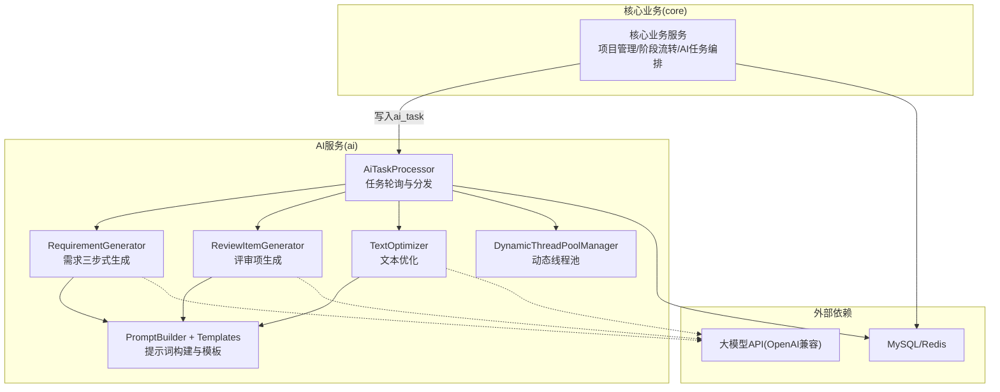
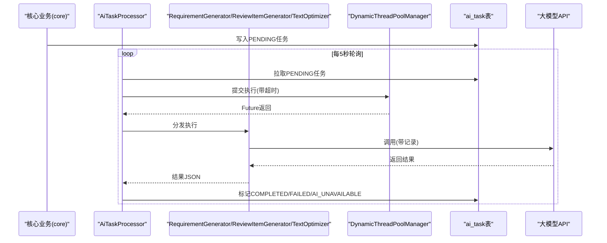
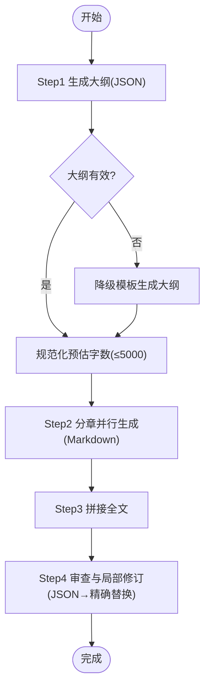
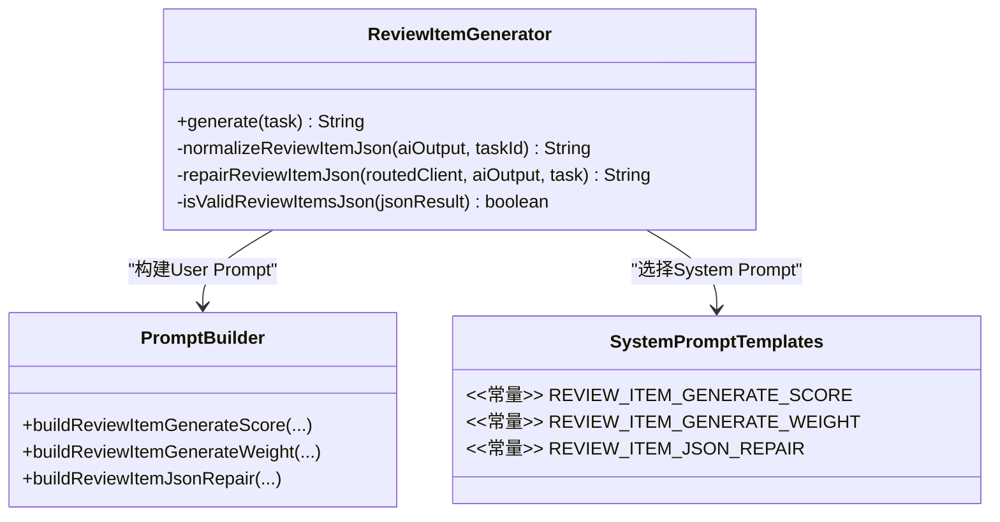
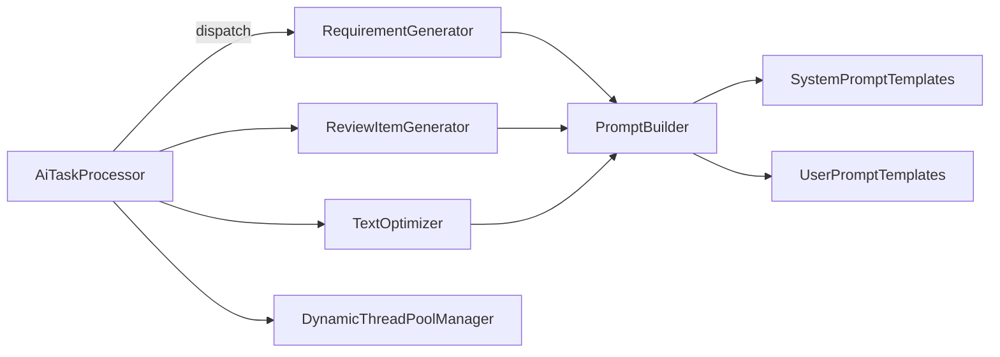

# 智能内容生成引擎

<cite>
**本文引用的文件**
- [CLAUDE.md](file://CLAUDE.md)
- [CORE_MODULE_SPEC.md](file://docs/rules/CORE_MODULE_SPEC.md)
- [AI_MODULE_SPEC.md](file://docs/rules/AI_MODULE_SPEC.md)
- [AiTaskProcessor.java](file://ele-ai-tender-system/ele-ai-tender-ai/src/main/java/com/jy/eleaitender/ai/processor/AiTaskProcessor.java)
- [DynamicThreadPoolManager.java](file://ele-ai-tender-system/ele-ai-tender-ai/src/main/java/com/jy/eleaitender/ai/threadpool/DynamicThreadPoolManager.java)
- [RequirementGenerator.java](file://ele-ai-tender-system/ele-ai-tender-ai/src/main/java/com/jy/eleaitender/ai/processor/generator/RequirementGenerator.java)
- [ReviewItemGenerator.java](file://ele-ai-tender-system/ele-ai-tender-ai/src/main/java/com/jy/eleaitender/ai/processor/generator/ReviewItemGenerator.java)
- [TextOptimizer.java](file://ele-ai-tender-system/ele-ai-tender-ai/src/main/java/com/jy/eleaitender/ai/processor/generator/TextOptimizer.java)
- [PromptBuilder.java](file://ele-ai-tender-system/ele-ai-tender-ai/src/main/java/com/jy/eleaitender/ai/processor/prompt/PromptBuilder.java)
- [SystemPromptTemplates.java](file://ele-ai-tender-system/ele-ai-tender-ai/src/main/java/com/jy/eleaitender/ai/processor/prompt/SystemPromptTemplates.java)
- [UserPromptTemplates.java](file://ele-ai-tender-system/ele-ai-tender-ai/src/main/java/com/jy/eleaitender/ai/processor/prompt/UserPromptTemplates.java)
</cite>

## 目录
1. [引言](#引言)
2. [项目结构](#项目结构)
3. [核心组件](#核心组件)
4. [架构总览](#架构总览)
5. [详细组件分析](#详细组件分析)
6. [依赖关系分析](#依赖关系分析)
7. [性能与并发优化](#性能与并发优化)
8. [故障排查指南](#故障排查指南)
9. [结论](#结论)
10. [附录：开发指南](#附录开发指南)

## 引言
本技术文档围绕“智能内容生成引擎”展开，聚焦需求生成、审查项生成、文本优化三大核心能力，系统阐述提示词工程、模板匹配、上下文管理、质量控制与结果验证、格式标准化等关键机制。同时给出批量生成、异步处理、缓存优化等性能调优策略，并提供自定义生成器与提示词模板的开发指南，帮助开发者快速扩展与落地。

## 项目结构
后端采用多模块分层架构，AI能力由独立服务提供，通过任务表异步解耦；前端双应用分别负责支撑中心管理与AI编制业务。整体职责边界清晰：core模块负责“何时生成”，ai模块负责“如何生成”。

图表来源
- [AiTaskProcessor.java:1-196](file://ele-ai-tender-system/ele-ai-tender-ai/src/main/java/com/jy/eleaitender/ai/processor/AiTaskProcessor.java#L1-L196)
- [DynamicThreadPoolManager.java:1-190](file://ele-ai-tender-system/ele-ai-tender-ai/src/main/java/com/jy/eleaitender/ai/threadpool/DynamicThreadPoolManager.java#L1-L190)
- [RequirementGenerator.java:1-800](file://ele-ai-tender-system/ele-ai-tender-ai/src/main/java/com/jy/eleaitender/ai/processor/generator/RequirementGenerator.java#L1-L800)
- [ReviewItemGenerator.java:1-305](file://ele-ai-tender-system/ele-ai-tender-ai/src/main/java/com/jy/eleaitender/ai/processor/generator/ReviewItemGenerator.java#L1-L305)
- [TextOptimizer.java:1-63](file://ele-ai-tender-system/ele-ai-tender-ai/src/main/java/com/jy/eleaitender/ai/processor/generator/TextOptimizer.java#L1-L63)
- [PromptBuilder.java:1-89](file://ele-ai-tender-system/ele-ai-tender-ai/src/main/java/com/jy/eleaitender/ai/processor/prompt/PromptBuilder.java#L1-L89)
- [SystemPromptTemplates.java:1-496](file://ele-ai-tender-system/ele-ai-tender-ai/src/main/java/com/jy/eleaitender/ai/processor/prompt/SystemPromptTemplates.java#L1-L496)
- [UserPromptTemplates.java:1-224](file://ele-ai-tender-system/ele-ai-tender-ai/src/main/java/com/jy/eleaitender/ai/processor/prompt/UserPromptTemplates.java#L1-L224)

章节来源
- [CLAUDE.md:1-192](file://CLAUDE.md#L1-L192)
- [CORE_MODULE_SPEC.md:1-358](file://docs/rules/CORE_MODULE_SPEC.md#L1-L358)
- [AI_MODULE_SPEC.md:1-211](file://docs/rules/AI_MODULE_SPEC.md#L1-L211)

## 核心组件
- 任务调度与执行
  - AiTaskProcessor：定时轮询待处理任务，按类型分发到具体处理器，统一异常与状态落库。
  - DynamicThreadPoolManager：从数据库加载线程池参数并热更新，支持用户级并发控制。
- 生成器
  - RequirementGenerator：需求生成的三步式Agent（大纲→分章并行→审查修订），渐进式进度推送与字数硬约束。
  - ReviewItemGenerator：评审项生成，受模板配置驱动，JSON归一化与AI修复。
  - TextOptimizer：文本优化，面向批量场景的任务模式。
- 提示词工程
  - PromptBuilder：根据场景动态组装User Prompt。
  - SystemPromptTemplates / UserPromptTemplates：集中管理System与User提示词模板。

章节来源
- [AiTaskProcessor.java:1-196](file://ele-ai-tender-system/ele-ai-tender-ai/src/main/java/com/jy/eleaitender/ai/processor/AiTaskProcessor.java#L1-L196)
- [DynamicThreadPoolManager.java:1-190](file://ele-ai-tender-system/ele-ai-tender-ai/src/main/java/com/jy/eleaitender/ai/threadpool/DynamicThreadPoolManager.java#L1-L190)
- [RequirementGenerator.java:1-800](file://ele-ai-tender-system/ele-ai-tender-ai/src/main/java/com/jy/eleaitender/ai/processor/generator/RequirementGenerator.java#L1-L800)
- [ReviewItemGenerator.java:1-305](file://ele-ai-tender-system/ele-ai-tender-ai/src/main/java/com/jy/eleaitender/ai/processor/generator/ReviewItemGenerator.java#L1-L305)
- [TextOptimizer.java:1-63](file://ele-ai-tender-system/ele-ai-tender-ai/src/main/java/com/jy/eleaitender/ai/processor/generator/TextOptimizer.java#L1-L63)
- [PromptBuilder.java:1-89](file://ele-ai-tender-system/ele-ai-tender-ai/src/main/java/com/jy/eleaitender/ai/processor/prompt/PromptBuilder.java#L1-L89)
- [SystemPromptTemplates.java:1-496](file://ele-ai-tender-system/ele-ai-tender-ai/src/main/java/com/jy/eleaitender/ai/processor/prompt/SystemPromptTemplates.java#L1-L496)
- [UserPromptTemplates.java:1-224](file://ele-ai-tender-system/ele-ai-tender-ai/src/main/java/com/jy/eleaitender/ai/processor/prompt/UserPromptTemplates.java#L1-L224)

## 架构总览
AI生成链路以“任务表+处理器”为核心，实现高内聚低耦合的异步编排。核心业务侧仅负责触发与结果同步，AI服务专注生成质量与稳定性。

图表来源
- [AiTaskProcessor.java:1-196](file://ele-ai-tender-system/ele-ai-tender-ai/src/main/java/com/jy/eleaitender/ai/processor/AiTaskProcessor.java#L1-L196)
- [DynamicThreadPoolManager.java:1-190](file://ele-ai-tender-system/ele-ai-tender-ai/src/main/java/com/jy/eleaitender/ai/threadpool/DynamicThreadPoolManager.java#L1-L190)

## 详细组件分析

### 需求生成（三步式Agent）
- 流程要点
  - Step1 大纲生成：基于项目信息输出结构化大纲，含章节数与预估字数，失败时回退预设模板。
  - Step2 分章并行：使用虚拟线程与信号量限流，逐章生成Markdown正文，实时推送章节完成进度。
  - Step3 全文拼接与审查：纯代码拼接后，进行合规性审查与局部修订，最终固化结果。
- 质量控制
  - 5000字硬约束：三层保障（Prompt要求、代码层压缩、章节Prompt强制）。
  - 渐进式进度：contentStage字段驱动前端渲染骨架与已生成章节。
  - 修订安全：最小原文长度、唯一匹配、从后向前替换避免偏移漂移。
- 关键实现路径
  - 生成入口与步骤编排：[RequirementGenerator.java:124-195](file://ele-ai-tender-system/ele-ai-tender-ai/src/main/java/com/jy/eleaitender/ai/processor/generator/RequirementGenerator.java#L124-L195)
  - 大纲生成与降级：[RequirementGenerator.java:199-343](file://ele-ai-tender-system/ele-ai-tender-ai/src/main/java/com/jy/eleaitender/ai/processor/generator/RequirementGenerator.java#L199-L343)
  - 分章并行与进度推送：[RequirementGenerator.java:347-428](file://ele-ai-tender-system/ele-ai-tender-ai/src/main/java/com/jy/eleaitender/ai/processor/generator/RequirementGenerator.java#L347-L428)
  - 审查与修订应用：[RequirementGenerator.java:646-764](file://ele-ai-tender-system/ele-ai-tender-ai/src/main/java/com/jy/eleaitender/ai/processor/generator/RequirementGenerator.java#L646-L764)

图表来源
- [RequirementGenerator.java:124-195](file://ele-ai-tender-system/ele-ai-tender-ai/src/main/java/com/jy/eleaitender/ai/processor/generator/RequirementGenerator.java#L124-L195)
- [RequirementGenerator.java:199-343](file://ele-ai-tender-system/ele-ai-tender-ai/src/main/java/com/jy/eleaitender/ai/processor/generator/RequirementGenerator.java#L199-L343)
- [RequirementGenerator.java:347-428](file://ele-ai-tender-system/ele-ai-tender-ai/src/main/java/com/jy/eleaitender/ai/processor/generator/RequirementGenerator.java#L347-L428)
- [RequirementGenerator.java:646-764](file://ele-ai-tender-system/ele-ai-tender-ai/src/main/java/com/jy/eleaitender/ai/processor/generator/RequirementGenerator.java#L646-L764)

章节来源
- [RequirementGenerator.java:1-800](file://ele-ai-tender-system/ele-ai-tender-ai/src/main/java/com/jy/eleaitender/ai/processor/generator/RequirementGenerator.java#L1-L800)
- [AI_MODULE_SPEC.md:64-80](file://docs/rules/AI_MODULE_SPEC.md#L64-L80)

### 评审项生成（模板驱动+JSON归一化）
- 流程要点
  - 依据模板review_config决定启用类型与是否生成标准；权重模式下保留所有启用类型以计算权重。
  - AI输出经JSON提取与归一化，兼容多种字段名与包装结构；首次失败则触发AI修复。
  - 计分规则在Prompt层硬约束（符合性score=0、叶子合计=100）。
- 关键实现路径
  - 生成入口与配置解析：[ReviewItemGenerator.java:74-154](file://ele-ai-tender-system/ele-ai-tender-ai/src/main/java/com/jy/eleaitender/ai/processor/generator/ReviewItemGenerator.java#L74-L154)
  - JSON归一化与修复：[ReviewItemGenerator.java:222-302](file://ele-ai-tender-system/ele-ai-tender-ai/src/main/java/com/jy/eleaitender/ai/processor/generator/ReviewItemGenerator.java#L222-L302)

图表来源
- [ReviewItemGenerator.java:1-305](file://ele-ai-tender-system/ele-ai-tender-ai/src/main/java/com/jy/eleaitender/ai/processor/generator/ReviewItemGenerator.java#L1-L305)
- [PromptBuilder.java:1-89](file://ele-ai-tender-system/ele-ai-tender-ai/src/main/java/com/jy/eleaitender/ai/processor/prompt/PromptBuilder.java#L1-L89)
- [SystemPromptTemplates.java:1-496](file://ele-ai-tender-system/ele-ai-tender-ai/src/main/java/com/jy/eleaitender/ai/processor/prompt/SystemPromptTemplates.java#L1-L496)

章节来源
- [ReviewItemGenerator.java:1-305](file://ele-ai-tender-system/ele-ai-tender-ai/src/main/java/com/jy/eleaitender/ai/processor/generator/ReviewItemGenerator.java#L1-L305)
- [AI_MODULE_SPEC.md:82-88](file://docs/rules/AI_MODULE_SPEC.md#L82-L88)

### 文本优化（批量任务模式）
- 流程要点
  - 接收待优化内容与优化要求，路由至合适模型，返回标准化JSON结果。
  - 适用于批量优化场景，复用任务队列与线程池资源。
- 关键实现路径
  - 优化入口与结果封装：[TextOptimizer.java:39-60](file://ele-ai-tender-system/ele-ai-tender-ai/src/main/java/com/jy/eleaitender/ai/processor/generator/TextOptimizer.java#L39-L60)

章节来源
- [TextOptimizer.java:1-63](file://ele-ai-tender-system/ele-ai-tender-ai/src/main/java/com/jy/eleaitender/ai/processor/generator/TextOptimizer.java#L1-L63)

### 提示词工程与模板匹配
- 设计原则
  - 单花括号：模板内JSON示例直接使用{}/}，调用入口通过SystemMessage/UserMessage直接发送完整提示词，避免被PromptTemplate解析。
  - 角色定位：统一为招标采购专家，强调法规与可操作性建议。
  - 场景化模板：需求大纲、章节生成、审查、评审项、占位符匹配等均有专用模板。
- 关键实现路径
  - 动态构建User Prompt：[PromptBuilder.java:1-89](file://ele-ai-tender-system/ele-ai-tender-ai/src/main/java/com/jy/eleaitender/ai/processor/prompt/PromptBuilder.java#L1-L89)
  - System与User模板常量：[SystemPromptTemplates.java:1-496](file://ele-ai-tender-system/ele-ai-tender-ai/src/main/java/com/jy/eleaitender/ai/processor/prompt/SystemPromptTemplates.java#L1-L496)、[UserPromptTemplates.java:1-224](file://ele-ai-tender-system/ele-ai-tender-ai/src/main/java/com/jy/eleaitender/ai/processor/prompt/UserPromptTemplates.java#L1-L224)

章节来源
- [PromptBuilder.java:1-89](file://ele-ai-tender-system/ele-ai-tender-ai/src/main/java/com/jy/eleaitender/ai/processor/prompt/PromptBuilder.java#L1-L89)
- [SystemPromptTemplates.java:1-496](file://ele-ai-tender-system/ele-ai-tender-ai/src/main/java/com/jy/eleaitender/ai/processor/prompt/SystemPromptTemplates.java#L1-L496)
- [UserPromptTemplates.java:1-224](file://ele-ai-tender-system/ele-ai-tender-ai/src/main/java/com/jy/eleaitender/ai/processor/prompt/UserPromptTemplates.java#L1-L224)
- [AI_MODULE_SPEC.md:111-127](file://docs/rules/AI_MODULE_SPEC.md#L111-L127)

## 依赖关系分析
- 组件耦合
  - AiTaskProcessor对各类生成器弱耦合，通过任务类型switch分发，便于新增生成器。
  - 生成器依赖PromptBuilder与模板常量，不直接感知Spring AI内部细节。
  - 线程池与并发控制通过管理器抽象，支持运行时热更新。
- 外部依赖
  - 大模型API通过OpenAI兼容接口接入，默认DeepSeek，完全由数据库配置驱动。
  - 任务持久化与状态同步通过ai_task表与Mapper完成。

图表来源
- [AiTaskProcessor.java:1-196](file://ele-ai-tender-system/ele-ai-tender-ai/src/main/java/com/jy/eleaitender/ai/processor/AiTaskProcessor.java#L1-L196)
- [RequirementGenerator.java:1-800](file://ele-ai-tender-system/ele-ai-tender-ai/src/main/java/com/jy/eleaitender/ai/processor/generator/RequirementGenerator.java#L1-L800)
- [ReviewItemGenerator.java:1-305](file://ele-ai-tender-system/ele-ai-tender-ai/src/main/java/com/jy/eleaitender/ai/processor/generator/ReviewItemGenerator.java#L1-L305)
- [TextOptimizer.java:1-63](file://ele-ai-tender-system/ele-ai-tender-ai/src/main/java/com/jy/eleaitender/ai/processor/generator/TextOptimizer.java#L1-L63)
- [PromptBuilder.java:1-89](file://ele-ai-tender-system/ele-ai-tender-ai/src/main/java/com/jy/eleaitender/ai/processor/prompt/PromptBuilder.java#L1-L89)
- [SystemPromptTemplates.java:1-496](file://ele-ai-tender-system/ele-ai-tender-ai/src/main/java/com/jy/eleaitender/ai/processor/prompt/SystemPromptTemplates.java#L1-L496)
- [UserPromptTemplates.java:1-224](file://ele-ai-tender-system/ele-ai-tender-ai/src/main/java/com/jy/eleaitender/ai/processor/prompt/UserPromptTemplates.java#L1-L224)
- [DynamicThreadPoolManager.java:1-190](file://ele-ai-tender-system/ele-ai-tender-ai/src/main/java/com/jy/eleaitender/ai/threadpool/DynamicThreadPoolManager.java#L1-L190)

章节来源
- [AI_MODULE_SPEC.md:129-141](file://docs/rules/AI_MODULE_SPEC.md#L129-L141)
- [CORE_MODULE_SPEC.md:295-330](file://docs/rules/CORE_MODULE_SPEC.md#L295-L330)

## 性能与并发优化
- 异步与批量化
  - 任务队列：AiTaskProcessor每5秒拉取PENDING任务，批量上限可配，避免瞬时压力。
  - 任务超时：submitWithConcurrencyControl支持分钟级超时，防止长尾阻塞。
- 线程池与并发控制
  - 动态线程池：从sup_sys_parameter读取参数，Hash检测变更热更新，队列容量变化重建线程池。
  - 用户级并发：UserConcurrencyManager双层Semaphore控制全局与单用户并发，避免热点用户独占资源。
- 生成过程优化
  - 需求分章并行：虚拟线程+信号量限制并发度，降低API速率限制风险。
  - 渐进式进度：减少前端等待焦虑，提升交互体验。
- 缓存与存储
  - Redis键空间用于任务状态、会话历史、检测结果与Token用量统计，详见规范文档。
- 参考实现路径
  - 任务调度与超时：[AiTaskProcessor.java:130-167](file://ele-ai-tender-system/ele-ai-tender-ai/src/main/java/com/jy/eleaitender/ai/processor/AiTaskProcessor.java#L130-L167)
  - 线程池热更新：[DynamicThreadPoolManager.java:68-145](file://ele-ai-tender-system/ele-ai-tender-ai/src/main/java/com/jy/eleaitender/ai/threadpool/DynamicThreadPoolManager.java#L68-L145)
  - 分章并发与进度：[RequirementGenerator.java:347-428](file://ele-ai-tender-system/ele-ai-tender-ai/src/main/java/com/jy/eleaitender/ai/processor/generator/RequirementGenerator.java#L347-L428)

章节来源
- [AiTaskProcessor.java:1-196](file://ele-ai-tender-system/ele-ai-tender-ai/src/main/java/com/jy/eleaitender/ai/processor/AiTaskProcessor.java#L1-L196)
- [DynamicThreadPoolManager.java:1-190](file://ele-ai-tender-system/ele-ai-tender-ai/src/main/java/com/jy/eleaitender/ai/threadpool/DynamicThreadPoolManager.java#L1-L190)
- [RequirementGenerator.java:347-428](file://ele-ai-tender-system/ele-ai-tender-ai/src/main/java/com/jy/eleaitender/ai/processor/generator/RequirementGenerator.java#L347-L428)
- [CORE_MODULE_SPEC.md:284-293](file://docs/rules/CORE_MODULE_SPEC.md#L284-L293)

## 故障排查指南
- 任务卡在PROCESSING
  - 检查ai_task.started_at与超时配置；必要时跳过任务或重试。
- 模型调用失败
  - 核对sup_model_config与sup_model_route_rule配置，确认api_key与endpoint正确。
- 知识库检索不准
  - 检查ai_knowledge_document.vector_ids，确认向量化完成。
- 线程池任务堆积
  - 查看sup_sys_parameter线程池参数与DynamicThreadPoolManager日志。
- 用户并发超限
  - 检查UserConcurrencyManager许可数与活跃计数。
- 需求生成卡住/字数异常
  - 查看专用日志AI_REQUIREMENT_GENERATION_LOG，关注contentStage推进与各阶段耗时。

章节来源
- [AI_MODULE_SPEC.md:189-197](file://docs/rules/AI_MODULE_SPEC.md#L189-L197)
- [CORE_MODULE_SPEC.md:342-349](file://docs/rules/CORE_MODULE_SPEC.md#L342-L349)

## 结论
本引擎以“任务表+处理器”的异步架构为基础，结合三步式需求生成、模板驱动的评审项生成与文本优化，形成稳定可控的智能内容生产流水线。通过提示词工程与严格的质量控制、渐进式进度反馈、动态线程池与用户级并发控制，兼顾了生成质量与系统吞吐。后续可在保持现有契约的前提下，按需扩展更多生成器与模板，持续完善生态。

## 附录：开发指南

### 自定义生成器开发指南
- 步骤
  - 新建生成器类，实现对应任务类型的处理逻辑，返回标准化JSON字符串。
  - 在AiTaskProcessor.dispatch中增加case分支，将新任务类型映射到新生成器。
  - 如需提示词，新增SystemPromptTemplates与UserPromptTemplates常量，并通过PromptBuilder构建User Prompt。
  - 若涉及并发与进度，参考RequirementGenerator的分章并行与publishProgress模式。
- 参考路径
  - 任务分发：[AiTaskProcessor.java:172-189](file://ele-ai-tender-system/ele-ai-tender-ai/src/main/java/com/jy/eleaitender/ai/processor/AiTaskProcessor.java#L172-L189)
  - 生成器示例：[TextOptimizer.java:39-60](file://ele-ai-tender-system/ele-ai-tender-ai/src/main/java/com/jy/eleaitender/ai/processor/generator/TextOptimizer.java#L39-L60)
  - 提示词构建：[PromptBuilder.java:1-89](file://ele-ai-tender-system/ele-ai-tender-ai/src/main/java/com/jy/eleaitender/ai/processor/prompt/PromptBuilder.java#L1-L89)

### 提示词模板开发与最佳实践
- 模板组织
  - SystemPromptTemplates：定义角色定位、输出格式与评分规则等强约束。
  - UserPromptTemplates：承载场景化输入（如项目信息、待优化文本、政策内容等）。
  - PromptBuilder：按场景拼装User Prompt，确保变量注入与默认值兜底。
- 注意事项
  - 单花括号：避免被PromptTemplate误解析，统一通过SystemMessage/UserMessage发送。
  - 字数与结构约束：在Prompt层明确硬性上限与JSON结构，配合代码层校验与修复。
- 参考路径
  - 模板常量：[SystemPromptTemplates.java:1-496](file://ele-ai-tender-system/ele-ai-tender-ai/src/main/java/com/jy/eleaitender/ai/processor/prompt/SystemPromptTemplates.java#L1-L496)、[UserPromptTemplates.java:1-224](file://ele-ai-tender-system/ele-ai-tender-ai/src/main/java/com/jy/eleaitender/ai/processor/prompt/UserPromptTemplates.java#L1-L224)
  - 构建器：[PromptBuilder.java:1-89](file://ele-ai-tender-system/ele-ai-tender-ai/src/main/java/com/jy/eleaitender/ai/processor/prompt/PromptBuilder.java#L1-L89)