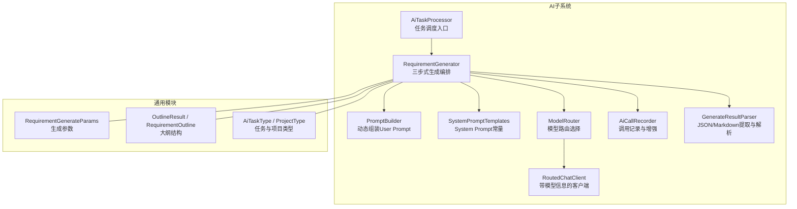
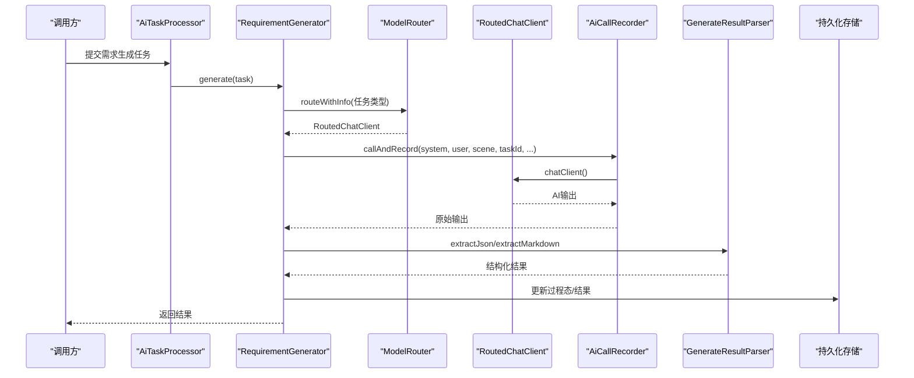
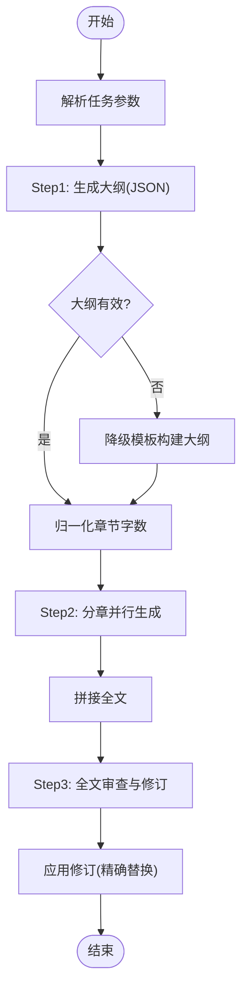
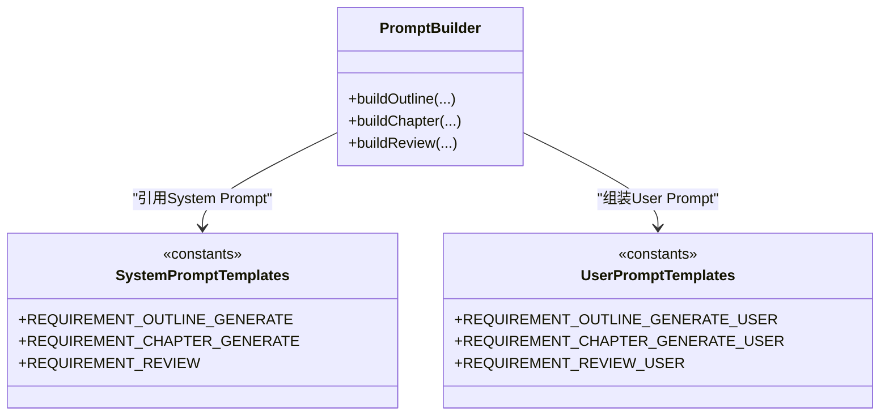
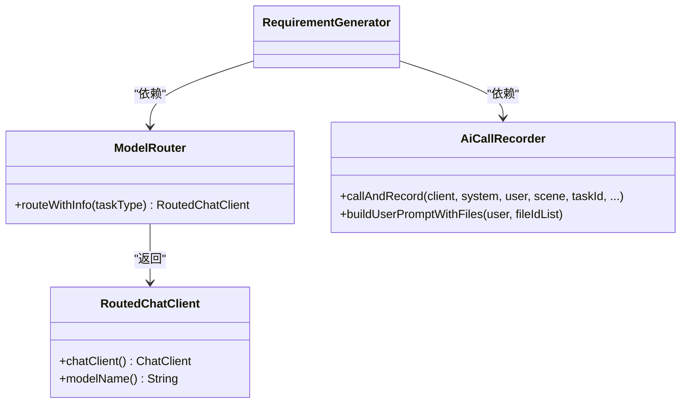
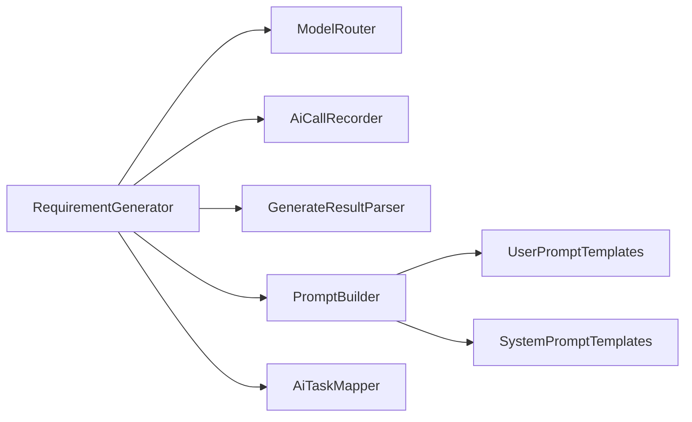

# 需求生成器

<cite>
**本文引用的文件**   
- [RequirementGenerator.java](file://ele-ai-tender-system/ele-ai-tender-ai/src/main/java/com/jy/eleaitender/ai/processor/generator/RequirementGenerator.java)
- [SystemPromptTemplates.java](file://ele-ai-tender-system/ele-ai-tender-ai/src/main/java/com/jy/eleaitender/ai/processor/prompt/SystemPromptTemplates.java)
- [UserPromptTemplates.java](file://ele-ai-tender-system/ele-ai-tender-ai/src/main/java/com/jy/eleaitender/ai/processor/prompt/UserPromptTemplates.java)
- [PromptBuilder.java](file://ele-ai-tender-system/ele-ai-tender-ai/src/main/java/com/jy/eleaitender/ai/processor/prompt/PromptBuilder.java)
- [AiTaskProcessor.java](file://ele-ai-tender-system/ele-ai-tender-ai/src/main/java/com/jy/eleaitender/ai/processor/AiTaskProcessor.java)
- [GenerateResultParser.java](file://ele-ai-tender-system/ele-ai-tender-ai/src/main/java/com/jy/eleaitender/ai/processor/model/GenerateResultParser.java)
- [ModelRouter.java](file://ele-ai-tender-system/ele-ai-tender-ai/src/main/java/com/jy/eleaitender/ai/processor/model/ModelRouter.java)
- [RoutedChatClient.java](file://ele-ai-tender-system/ele-ai-tender-ai/src/main/java/com/jy/eleaitender/ai/processor/model/RoutedChatClient.java)
- [AiCallRecorder.java](file://ele-ai-tender-system/ele-ai-tender-ai/src/main/java/com/jy/eleaitender/ai/processor/recorder/AiCallRecorder.java)
- [RequirementGenerateParams.java](file://ele-ai-tender-system/ele-ai-tender-common/src/main/java/com/jy/eleaitender/common/dto/ai/RequirementGenerateParams.java)
- [OutlineResult.java](file://ele-ai-tender-system/ele-ai-tender-common/src/main/java/com/jy/eleaitender/common/dto/ai/OutlineResult.java)
- [RequirementOutline.java](file://ele-ai-tender-system/ele-ai-tender-common/src/main/java/com/jy/eleaitender/common/dto/ai/RequirementOutline.java)
- [AiTaskType.java](file://ele-ai-tender-system/ele-ai-tender-common/src/main/java/com/jy/eleaitender/common/enums/AiTaskType.java)
- [ProjectType.java](file://ele-ai-tender-system/ele-ai-tender-common/src/main/java/com/jy/eleaitender/common/enums/ProjectType.java)
</cite>

## 目录
1. [简介](#简介)
2. [项目结构](#项目结构)
3. [核心组件](#核心组件)
4. [架构总览](#架构总览)
5. [详细组件分析](#详细组件分析)
6. [依赖关系分析](#依赖关系分析)
7. [性能与并发特性](#性能与并发特性)
8. [提示词模板设计与业务规则映射](#提示词模板设计与业务规则映射)
9. [数据源整合与上下文注入](#数据源整合与上下文注入)
10. [结构化处理、格式标准化与质量评估](#结构化处理格式标准化与质量评估)
11. [自定义需求模板开发指南](#自定义需求模板开发指南)
12. [故障排查与常见问题](#故障排查与常见问题)
13. [结论](#结论)

## 简介
本技术文档围绕“需求生成器”展开，系统性阐述基于AI的需求内容自动生成机制。该机制采用“三步式Agent编排”：先生成大纲，再并行分章生成正文，最后进行全文审查与局部修订。文档覆盖需求分析、上下文理解、智能填充、提示词模板设计、业务规则映射、数据源整合、结构化处理、格式标准化、质量评估等关键环节，并提供自定义模板开发与性能优化建议。

## 项目结构
需求生成器位于AI子系统的处理器层，核心由“生成器 + 提示词构建 + 模型路由 + 调用记录 + 结果解析”组成，并与通用DTO/枚举定义解耦。

图表来源
- [AiTaskProcessor.java](file://ele-ai-tender-system/ele-ai-tender-ai/src/main/java/com/jy/eleaitender/ai/processor/AiTaskProcessor.java)
- [RequirementGenerator.java](file://ele-ai-tender-system/ele-ai-tender-ai/src/main/java/com/jy/eleaitender/ai/processor/generator/RequirementGenerator.java)
- [PromptBuilder.java](file://ele-ai-tender-system/ele-ai-tender-ai/src/main/java/com/jy/eleaitender/ai/processor/prompt/PromptBuilder.java)
- [SystemPromptTemplates.java](file://ele-ai-tender-system/ele-ai-tender-ai/src/main/java/com/jy/eleaitender/ai/processor/prompt/SystemPromptTemplates.java)
- [ModelRouter.java](file://ele-ai-tender-system/ele-ai-tender-ai/src/main/java/com/jy/eleaitender/ai/processor/model/ModelRouter.java)
- [RoutedChatClient.java](file://ele-ai-tender-system/ele-ai-tender-ai/src/main/java/com/jy/eleaitender/ai/processor/model/RoutedChatClient.java)
- [AiCallRecorder.java](file://ele-ai-tender-system/ele-ai-tender-ai/src/main/java/com/jy/eleaitender/ai/processor/recorder/AiCallRecorder.java)
- [GenerateResultParser.java](file://ele-ai-tender-system/ele-ai-tender-ai/src/main/java/com/jy/eleaitender/ai/processor/model/GenerateResultParser.java)
- [RequirementGenerateParams.java](file://ele-ai-tender-system/ele-ai-tender-common/src/main/java/com/jy/eleaitender/common/dto/ai/RequirementGenerateParams.java)
- [OutlineResult.java](file://ele-ai-tender-system/ele-ai-tender-common/src/main/java/com/jy/eleaitender/common/dto/ai/OutlineResult.java)
- [RequirementOutline.java](file://ele-ai-tender-system/ele-ai-tender-common/src/main/java/com/jy/eleaitender/common/dto/ai/RequirementOutline.java)
- [AiTaskType.java](file://ele-ai-tender-system/ele-ai-tender-common/src/main/java/com/jy/eleaitender/common/enums/AiTaskType.java)
- [ProjectType.java](file://ele-ai-tender-system/ele-ai-tender-common/src/main/java/com/jy/eleaitender/common/enums/ProjectType.java)

章节来源
- [RequirementGenerator.java:118-195](file://ele-ai-tender-system/ele-ai-tender-ai/src/main/java/com/jy/eleaitender/ai/processor/generator/RequirementGenerator.java#L118-L195)
- [AiTaskProcessor.java:5-40](file://ele-ai-tender-system/ele-ai-tender-ai/src/main/java/com/jy/eleaitender/ai/processor/AiTaskProcessor.java#L5-L40)

## 核心组件
- 需求生成器（RequirementGenerator）
  - 负责三步式编排：大纲生成 → 分章并行生成 → 全文审查与修订；维护进度状态、字数预算、并发控制与降级策略。
- 提示词构建器（PromptBuilder）
  - 将业务参数与模板常量组合为最终User Prompt，避免Spring AI的变量占位冲突。
- System Prompt模板（SystemPromptTemplates）
  - 集中管理各场景的System Prompt，包括需求大纲、章节生成、审查、评审项生成、检测类与占位符匹配等。
- User Prompt模板（UserPromptTemplates）
  - 提供可插拔的参数化用户提示词模板，配合PromptBuilder使用。
- 模型路由（ModelRouter + RoutedChatClient）
  - 根据任务类型选择合适模型并返回带模型信息的客户端。
- 调用记录（AiCallRecorder）
  - 统一封装AI调用、日志记录、上下文增强（如文件内容注入）。
- 结果解析（GenerateResultParser）
  - 从AI输出中提取JSON或Markdown，并反序列化为结构化对象。

章节来源
- [RequirementGenerator.java:118-195](file://ele-ai-tender-system/ele-ai-tender-ai/src/main/java/com/jy/eleaitender/ai/processor/generator/RequirementGenerator.java#L118-L195)
- [PromptBuilder.java:48-88](file://ele-ai-tender-system/ele-ai-tender-ai/src/main/java/com/jy/eleaitender/ai/processor/prompt/PromptBuilder.java#L48-L88)
- [SystemPromptTemplates.java:68-188](file://ele-ai-tender-system/ele-ai-tender-ai/src/main/java/com/jy/eleaitender/ai/processor/prompt/SystemPromptTemplates.java#L68-L188)
- [UserPromptTemplates.java:40-82](file://ele-ai-tender-system/ele-ai-tender-ai/src/main/java/com/jy/eleaitender/ai/processor/prompt/UserPromptTemplates.java#L40-L82)
- [ModelRouter.java](file://ele-ai-tender-system/ele-ai-tender-ai/src/main/java/com/jy/eleaitender/ai/processor/model/ModelRouter.java)
- [RoutedChatClient.java](file://ele-ai-tender-system/ele-ai-tender-ai/src/main/java/com/jy/eleaitender/ai/processor/model/RoutedChatClient.java)
- [AiCallRecorder.java](file://ele-ai-tender-system/ele-ai-tender-ai/src/main/java/com/jy/eleaitender/ai/processor/recorder/AiCallRecorder.java)
- [GenerateResultParser.java](file://ele-ai-tender-system/ele-ai-tender-ai/src/main/java/com/jy/eleaitender/ai/processor/model/GenerateResultParser.java)

## 架构总览
下图展示需求生成的端到端流程：从任务调度到模型调用、结果解析、进度发布与最终落库。

图表来源
- [AiTaskProcessor.java](file://ele-ai-tender-system/ele-ai-tender-ai/src/main/java/com/jy/eleaitender/ai/processor/AiTaskProcessor.java)
- [RequirementGenerator.java:118-195](file://ele-ai-tender-system/ele-ai-tender-ai/src/main/java/com/jy/eleaitender/ai/processor/generator/RequirementGenerator.java#L118-L195)
- [ModelRouter.java](file://ele-ai-tender-system/ele-ai-tender-ai/src/main/java/com/jy/eleaitender/ai/processor/model/ModelRouter.java)
- [RoutedChatClient.java](file://ele-ai-tender-system/ele-ai-tender-ai/src/main/java/com/jy/eleaitender/ai/processor/model/RoutedChatClient.java)
- [AiCallRecorder.java](file://ele-ai-tender-system/ele-ai-tender-ai/src/main/java/com/jy/eleaitender/ai/processor/recorder/AiCallRecorder.java)
- [GenerateResultParser.java](file://ele-ai-tender-system/ele-ai-tender-ai/src/main/java/com/jy/eleaitender/ai/processor/model/GenerateResultParser.java)

## 详细组件分析

### 需求生成器（RequirementGenerator）
- 三步式编排
  - Step1 大纲生成：结合项目信息生成JSON大纲，包含章节标题、核心要点与预估字数；若失败则走工程/货物/服务三类降级模板。
  - Step2 分章生成：按大纲并行生成每章正文，限制并发度，实时发布进度，支持超时取消与异常兜底。
  - Step3 审查修订：对全文进行一致性、合规性与完整性审查，输出修订列表后执行精确替换。
- 关键能力
  - 字数预算与压缩：自动归一化章节预估字数，确保总字数不超过上限。
  - 并发控制：使用信号量限制同时发起的章节请求数，避免触发API速率限制。
  - 进度上报：在大纲完成、章节生成中、草稿完成、审查中、完成等阶段持续更新任务结果。
  - 安全替换：仅当原文唯一匹配且长度足够时才应用修订，避免误替换。

图表来源
- [RequirementGenerator.java:118-195](file://ele-ai-tender-system/ele-ai-tender-ai/src/main/java/com/jy/eleaitender/ai/processor/generator/RequirementGenerator.java#L118-L195)
- [RequirementGenerator.java:197-343](file://ele-ai-tender-system/ele-ai-tender-ai/src/main/java/com/jy/eleaitender/ai/processor/generator/RequirementGenerator.java#L197-L343)
- [RequirementGenerator.java:345-507](file://ele-ai-tender-system/ele-ai-tender-ai/src/main/java/com/jy/eleaitender/ai/processor/generator/RequirementGenerator.java#L345-L507)
- [RequirementGenerator.java:509-764](file://ele-ai-tender-system/ele-ai-tender-ai/src/main/java/com/jy/eleaitender/ai/processor/generator/RequirementGenerator.java#L509-L764)

章节来源
- [RequirementGenerator.java:118-195](file://ele-ai-tender-system/ele-ai-tender-ai/src/main/java/com/jy/eleaitender/ai/processor/generator/RequirementGenerator.java#L118-L195)
- [RequirementGenerator.java:197-343](file://ele-ai-tender-system/ele-ai-tender-ai/src/main/java/com/jy/eleaitender/ai/processor/generator/RequirementGenerator.java#L197-L343)
- [RequirementGenerator.java:345-507](file://ele-ai-tender-system/ele-ai-tender-ai/src/main/java/com/jy/eleaitender/ai/processor/generator/RequirementGenerator.java#L345-L507)
- [RequirementGenerator.java:509-764](file://ele-ai-tender-system/ele-ai-tender-ai/src/main/java/com/jy/eleaitender/ai/processor/generator/RequirementGenerator.java#L509-L764)

### 提示词构建与模板体系
- PromptBuilder
  - 提供buildOutline/buildChapter/buildReview等方法，将业务参数与UserPromptTemplates组合，避免Spring AI的{variableName}冲突。
- SystemPromptTemplates
  - 定义需求大纲、章节生成、审查等系统级指令，明确输出格式、约束与行业规范。
- UserPromptTemplates
  - 提供参数化的用户提示词模板，便于在不同场景下复用与扩展。

图表来源
- [PromptBuilder.java:48-88](file://ele-ai-tender-system/ele-ai-tender-ai/src/main/java/com/jy/eleaitender/ai/processor/prompt/PromptBuilder.java#L48-L88)
- [SystemPromptTemplates.java:68-188](file://ele-ai-tender-system/ele-ai-tender-ai/src/main/java/com/jy/eleaitender/ai/processor/prompt/SystemPromptTemplates.java#L68-L188)
- [UserPromptTemplates.java:40-82](file://ele-ai-tender-system/ele-ai-tender-ai/src/main/java/com/jy/eleaitender/ai/processor/prompt/UserPromptTemplates.java#L40-L82)

章节来源
- [PromptBuilder.java:48-88](file://ele-ai-tender-system/ele-ai-tender-ai/src/main/java/com/jy/eleaitender/ai/processor/prompt/PromptBuilder.java#L48-L88)
- [SystemPromptTemplates.java:68-188](file://ele-ai-tender-system/ele-ai-tender-ai/src/main/java/com/jy/eleaitender/ai/processor/prompt/SystemPromptTemplates.java#L68-L188)
- [UserPromptTemplates.java:40-82](file://ele-ai-tender-system/ele-ai-tender-ai/src/main/java/com/jy/eleaitender/ai/processor/prompt/UserPromptTemplates.java#L40-L82)

### 模型路由与调用记录
- ModelRouter
  - 根据AiTaskType选择模型，返回RoutedChatClient，携带实际模型名称。
- RoutedChatClient
  - 封装ChatClient与模型名，供上层统一调用。
- AiCallRecorder
  - 统一记录AI调用上下文、耗时、输入输出摘要，支持在User Prompt中注入参考文件内容。

图表来源
- [ModelRouter.java](file://ele-ai-tender-system/ele-ai-tender-ai/src/main/java/com/jy/eleaitender/ai/processor/model/ModelRouter.java)
- [RoutedChatClient.java](file://ele-ai-tender-system/ele-ai-tender-ai/src/main/java/com/jy/eleaitender/ai/processor/model/RoutedChatClient.java)
- [AiCallRecorder.java](file://ele-ai-tender-system/ele-ai-tender-ai/src/main/java/com/jy/eleaitender/ai/processor/recorder/AiCallRecorder.java)
- [RequirementGenerator.java:138-141](file://ele-ai-tender-system/ele-ai-tender-ai/src/main/java/com/jy/eleaitender/ai/processor/generator/RequirementGenerator.java#L138-L141)

章节来源
- [RequirementGenerator.java:138-141](file://ele-ai-tender-system/ele-ai-tender-ai/src/main/java/com/jy/eleaitender/ai/processor/generator/RequirementGenerator.java#L138-L141)

### 结果解析与结构化
- GenerateResultParser
  - 从AI输出中提取JSON或Markdown片段，并反序列化为OutlineResult等结构体，支撑后续拼装与审查。

章节来源
- [GenerateResultParser.java](file://ele-ai-tender-system/ele-ai-tender-ai/src/main/java/com/jy/eleaitender/ai/processor/model/GenerateResultParser.java)

## 依赖关系分析
- 直接依赖
  - RequirementGenerator依赖ModelRouter、AiCallRecorder、GenerateResultParser、PromptBuilder、SystemPromptTemplates。
  - PromptBuilder依赖UserPromptTemplates与枚举类型（ProjectType、ReviewMethod、ReviewType）。
- 间接依赖
  - 通过AiTaskMapper更新任务结果（持久化），通过虚拟线程执行器提升并发效率。
- 耦合与内聚
  - 生成器职责清晰，提示词与业务参数解耦，模型路由与调用记录抽象良好，整体内聚度高、耦合度适中。

图表来源
- [RequirementGenerator.java:118-195](file://ele-ai-tender-system/ele-ai-tender-ai/src/main/java/com/jy/eleaitender/ai/processor/generator/RequirementGenerator.java#L118-L195)
- [PromptBuilder.java:48-88](file://ele-ai-tender-system/ele-ai-tender-ai/src/main/java/com/jy/eleaitender/ai/processor/prompt/PromptBuilder.java#L48-L88)

章节来源
- [RequirementGenerator.java:118-195](file://ele-ai-tender-system/ele-ai-tender-ai/src/main/java/com/jy/eleaitender/ai/processor/generator/RequirementGenerator.java#L118-L195)
- [PromptBuilder.java:48-88](file://ele-ai-tender-system/ele-ai-tender-ai/src/main/java/com/jy/eleaitender/ai/processor/prompt/PromptBuilder.java#L48-L88)

## 性能与并发特性
- 并发控制
  - 分章生成使用信号量限制最大并发数，避免触发外部API速率限制。
- 虚拟线程
  - 使用JDK21虚拟线程执行器，提高I/O密集型任务的吞吐。
- 超时与取消
  - 分章生成设置总体等待超时，超时后取消未完成章节，保障整体SLA。
- 字数预算
  - 自动归一化章节预估字数，防止单章过长导致LLM输出不稳定。
- 调用记录
  - 统一记录每次AI调用的耗时与结果摘要，便于性能分析与问题定位。

章节来源
- [RequirementGenerator.java:345-428](file://ele-ai-tender-system/ele-ai-tender-ai/src/main/java/com/jy/eleaitender/ai/processor/generator/RequirementGenerator.java#L345-L428)
- [RequirementGenerator.java:240-279](file://ele-ai-tender-system/ele-ai-tender-ai/src/main/java/com/jy/eleaitender/ai/processor/generator/RequirementGenerator.java#L240-L279)

## 提示词模板设计与业务规则映射
- 大纲生成
  - System Prompt强调按项目类型（工程/货物/服务）规划章节，控制总字数，避免重叠。
  - User Prompt传入项目名称、类型、类别、预算与描述，驱动AI输出JSON大纲。
- 章节生成
  - System Prompt要求严格遵循核心要点、编号规范、量化指标与字数上限。
  - User Prompt注入项目概况、完整大纲目录、当前章节标题与核心要点、硬性字数上限。
- 审查修订
  - System Prompt聚焦重复、矛盾、模糊、歧视性表述、编号一致性与完整性检查。
  - User Prompt附带项目信息与全文内容，AI输出修订列表（original/revised/reason）。
- 业务规则映射
  - 预算与资格门槛：根据预算给出价格分权重建议与资格要求建议。
  - 项目类型差异化：工程侧重施工组织与材料品牌推荐表框架；货物侧重技术参数与验收；服务侧重团队配置与SLA。

章节来源
- [SystemPromptTemplates.java:68-188](file://ele-ai-tender-system/ele-ai-tender-ai/src/main/java/com/jy/eleaitender/ai/processor/prompt/SystemPromptTemplates.java#L68-L188)
- [UserPromptTemplates.java:40-82](file://ele-ai-tender-system/ele-ai-tender-ai/src/main/java/com/jy/eleaitender/ai/processor/prompt/UserPromptTemplates.java#L40-L82)
- [PromptBuilder.java:48-88](file://ele-ai-tender-system/ele-ai-tender-ai/src/main/java/com/jy/eleaitender/ai/processor/prompt/PromptBuilder.java#L48-L88)

## 数据源整合与上下文注入
- 参考文件注入
  - 在大纲生成阶段，通过AiCallRecorder.buildUserPromptWithFiles将附件内容注入User Prompt，增强上下文理解。
- 分章与审查阶段
  - 为避免token膨胀，分章生成与审查不传fileIdList，减少额外上下文开销。
- 数据模型
  - RequirementGenerateParams承载生成所需的项目元数据；OutlineResult/RequirementOutline承载大纲结构。

章节来源
- [RequirementGenerator.java:207-212](file://ele-ai-tender-system/ele-ai-tender-ai/src/main/java/com/jy/eleaitender/ai/processor/generator/RequirementGenerator.java#L207-L212)
- [RequirementGenerator.java:646-692](file://ele-ai-tender-system/ele-ai-tender-ai/src/main/java/com/jy/eleaitender/ai/processor/generator/RequirementGenerator.java#L646-L692)
- [RequirementGenerateParams.java](file://ele-ai-tender-system/ele-ai-tender-common/src/main/java/com/jy/eleaitender/common/dto/ai/RequirementGenerateParams.java)
- [OutlineResult.java](file://ele-ai-tender-system/ele-ai-tender-common/src/main/java/com/jy/eleaitender/common/dto/ai/OutlineResult.java)
- [RequirementOutline.java](file://ele-ai-tender-system/ele-ai-tender-common/src/main/java/com/jy/eleaitender/common/dto/ai/RequirementOutline.java)

## 结构化处理、格式标准化与质量评估
- 结构化处理
  - 大纲以JSON形式输出，包含projectOverview与chapters数组；章节正文以Markdown输出，便于后续渲染与导出。
- 格式标准化
  - 章节标题层级、条款编号、表格呈现均受System Prompt约束，保证一致性。
- 质量评估
  - 审查阶段输出revisions列表，代码层执行精确替换；同时统计应用与跳过数量，便于审计。
- 容错与降级
  - 大纲解析失败时回退至预设模板；章节生成失败时插入占位提示；审查失败时使用原始内容。

章节来源
- [RequirementGenerator.java:229-238](file://ele-ai-tender-system/ele-ai-tender-ai/src/main/java/com/jy/eleaitender/ai/processor/generator/RequirementGenerator.java#L229-L238)
- [RequirementGenerator.java:494-507](file://ele-ai-tender-system/ele-ai-tender-ai/src/main/java/com/jy/eleaitender/ai/processor/generator/RequirementGenerator.java#L494-L507)
- [RequirementGenerator.java:702-764](file://ele-ai-tender-system/ele-ai-tender-ai/src/main/java/com/jy/eleaitender/ai/processor/generator/RequirementGenerator.java#L702-L764)

## 自定义需求模板开发指南
- 新增或修改System Prompt
  - 在SystemPromptTemplates中添加新的常量，明确输出格式、约束与业务规则。
- 新增或修改User Prompt模板
  - 在UserPromptTemplates中新增模板字符串，并在PromptBuilder中暴露对应构建方法。
- 接入生成器
  - 在RequirementGenerator中增加新步骤或分支逻辑，调用PromptBuilder与AiCallRecorder完成AI交互。
- 结果解析适配
  - 在GenerateResultParser中增加对应的JSON/Markdown提取与反序列化逻辑。
- 测试与验证
  - 编写单元测试覆盖边界条件（空输入、超长文本、非法JSON等），确保稳定性。

章节来源
- [SystemPromptTemplates.java:68-188](file://ele-ai-tender-system/ele-ai-tender-ai/src/main/java/com/jy/eleaitender/ai/processor/prompt/SystemPromptTemplates.java#L68-L188)
- [UserPromptTemplates.java:40-82](file://ele-ai-tender-system/ele-ai-tender-ai/src/main/java/com/jy/eleaitender/ai/processor/prompt/UserPromptTemplates.java#L40-L82)
- [PromptBuilder.java:48-88](file://ele-ai-tender-system/ele-ai-tender-ai/src/main/java/com/jy/eleaitender/ai/processor/prompt/PromptBuilder.java#L48-L88)
- [RequirementGenerator.java:118-195](file://ele-ai-tender-system/ele-ai-tender-ai/src/main/java/com/jy/eleaitender/ai/processor/generator/RequirementGenerator.java#L118-L195)

## 故障排查与常见问题
- 大纲解析失败
  - 现象：无法得到有效JSON大纲。
  - 处理：自动降级到预设模板，检查User Prompt参数是否完整。
- 章节生成超时或失败
  - 现象：部分章节未生成或超时。
  - 处理：检查并发限制与外部API限流；查看调用记录中的耗时与错误信息。
- 审查修订未生效
  - 现象：修订项被跳过。
  - 处理：确认原文长度与唯一匹配；检查AI输出的revisions字段是否符合预期。
- 进度状态不一致
  - 现象：前端显示的状态与实际不符。
  - 处理：核对publishProgress与updateTaskResult调用路径，确认持久化成功。

章节来源
- [RequirementGenerator.java:229-238](file://ele-ai-tender-system/ele-ai-tender-ai/src/main/java/com/jy/eleaitender/ai/processor/generator/RequirementGenerator.java#L229-L238)
- [RequirementGenerator.java:404-428](file://ele-ai-tender-system/ele-ai-tender-ai/src/main/java/com/jy/eleaitender/ai/processor/generator/RequirementGenerator.java#L404-L428)
- [RequirementGenerator.java:702-764](file://ele-ai-tender-system/ele-ai-tender-ai/src/main/java/com/jy/eleaitender/ai/processor/generator/RequirementGenerator.java#L702-L764)
- [RequirementGenerator.java:532-580](file://ele-ai-tender-system/ele-ai-tender-ai/src/main/java/com/jy/eleaitender/ai/processor/generator/RequirementGenerator.java#L532-L580)

## 结论
需求生成器通过“三步式Agent编排”实现了高可控、可扩展、可观测的招标需求自动化生成。其核心优势在于：
- 结构化大纲与分章并行生成，兼顾质量与效率；
- 严格的提示词模板与业务规则映射，确保合规与一致性；
- 完善的调用记录与进度上报，便于监控与排障；
- 灵活的模板扩展点与降级策略，适应多样化业务场景。