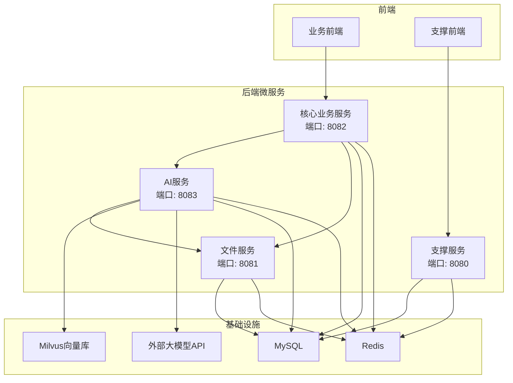
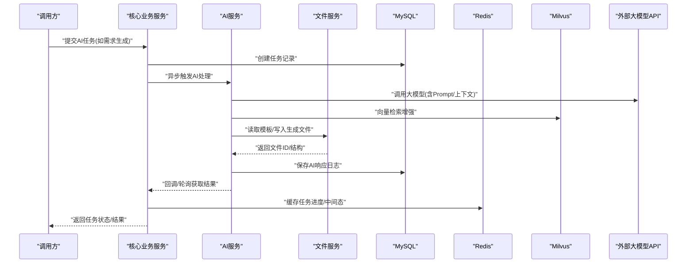
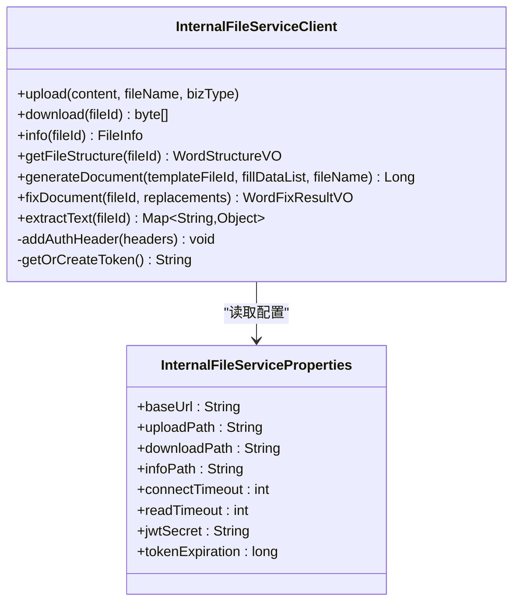
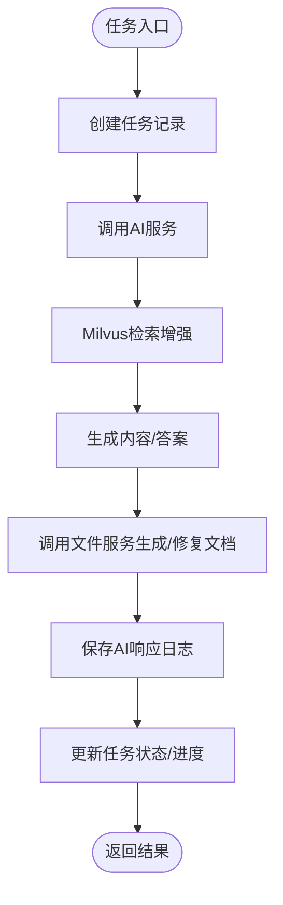
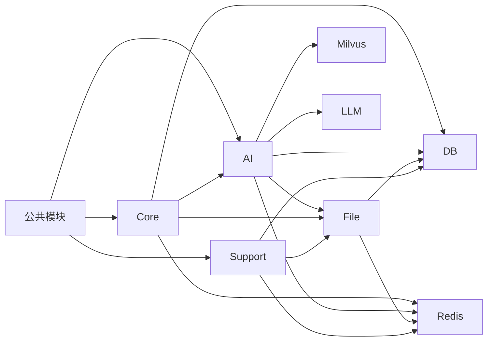

# 服务概述与架构

<cite>
**本文引用的文件**
- [AiApplication.java](file://ele-ai-tender-system/ele-ai-tender-ai/src/main/java/com/jy/eleaitender/ai/AiApplication.java)
- [CoreApplication.java](file://ele-ai-tender-system/ele-ai-tender-core/src/main/java/com/jy/eleaitender/core/CoreApplication.java)
- [FileApplication.java](file://ele-ai-tender-system/ele-ai-tender-file/src/main/java/com/jy/eleaitender/file/FileApplication.java)
- [SupportApplication.java](file://ele-ai-tender-system/ele-ai-tender-support/src/main/java/com/jy/eleaitender/support/SupportApplication.java)
- [application.yml（AI）](file://ele-ai-tender-system/ele-ai-tender-ai/src/main/resources/application.yml)
- [application.yml（Core）](file://ele-ai-tender-system/ele-ai-tender-core/src/main/resources/application.yml)
- [application.yml（File）](file://ele-ai-tender-system/ele-ai-tender-file/src/main/resources/application.yml)
- [application.yml（Support）](file://ele-ai-tender-system/ele-ai-tender-support/src/main/resources/application.yml)
- [InternalFileServiceClient.java](file://ele-ai-tender-system/ele-ai-tender-common/src/main/java/com/jy/eleaitender/common/client/InternalFileServiceClient.java)
- [InternalFileServiceProperties.java](file://ele-ai-tender-system/ele-ai-tender-common/src/main/java/com/jy/eleaitender/common/client/InternalFileServiceProperties.java)
</cite>

## 目录
1. [简介](#简介)
2. [项目结构](#项目结构)
3. [核心组件](#核心组件)
4. [架构总览](#架构总览)
5. [详细组件分析](#详细组件分析)
6. [依赖关系分析](#依赖关系分析)
7. [性能考虑](#性能考虑)
8. [故障排查指南](#故障排查指南)
9. [结论](#结论)
10. [附录：快速开始与环境部署要点](#附录快速开始与环境部署要点)

## 简介
本文件为“AI处理服务”的综合性概述文档，面向开发者、运维与产品人员。内容覆盖整体架构设计、核心功能模块与技术栈选型；说明Spring AI集成方案、微服务间通信机制、数据流向与依赖关系；阐述服务启动流程、配置管理与环境部署要点；并包含监控、日志与指标等运维实践建议，以及快速开始与常见问题解决方案。

## 项目结构
系统采用多模块微服务架构，主要包含以下服务与公共能力：
- AI服务（ele-ai-tender-ai）：提供AI对话、模型连通性测试、知识检索、文档匹配等能力，集成Spring AI调用外部大模型。
- 核心业务服务（ele-ai-tender-core）：承载项目、阶段、任务编排、状态机、调度等核心业务逻辑。
- 文件服务（ele-ai-tender-file）：提供文件上传下载、Word文档结构解析、文本提取、模板生成与修复等能力。
- 支撑服务（ele-ai-tender-support）：提供用户、权限、菜单、参数、短信网关等通用支撑能力。
- 公共模块（ele-ai-tender-common）：跨服务共享的DTO、实体、枚举、异常、工具类、内部文件服务客户端等。

图表来源
- [application.yml（AI）:1-72](file://ele-ai-tender-system/ele-ai-tender-ai/src/main/resources/application.yml#L1-L72)
- [application.yml（Core）:1-59](file://ele-ai-tender-system/ele-ai-tender-core/src/main/resources/application.yml#L1-L59)
- [application.yml（File）:1-63](file://ele-ai-tender-system/ele-ai-tender-file/src/main/resources/application.yml#L1-L63)
- [application.yml（Support）:1-68](file://ele-ai-tender-system/ele-ai-tender-support/src/main/resources/application.yml#L1-L68)

章节来源
- [AiApplication.java:1-26](file://ele-ai-tender-system/ele-ai-tender-ai/src/main/java/com/jy/eleaitender/ai/AiApplication.java#L1-L26)
- [CoreApplication.java:1-24](file://ele-ai-tender-system/ele-ai-tender-core/src/main/java/com/jy/eleaitender/core/CoreApplication.java#L1-L24)
- [FileApplication.java:1-18](file://ele-ai-tender-system/ele-ai-tender-file/src/main/java/com/jy/eleaitender/file/FileApplication.java#L1-L18)
- [SupportApplication.java:1-21](file://ele-ai-tender-system/ele-ai-tender-support/src/main/java/com/jy/eleaitender/support/SupportApplication.java#L1-L21)

## 核心组件
- AI服务
  - 职责：对外暴露AI对话、文档匹配、知识库查询、模型连通性测试等接口；通过Spring AI对接外部大模型；结合Milvus进行向量检索；持久化AI任务与响应日志。
  - 关键配置：OpenAI兼容端点、模型名称、JWT密钥、Milvus连接、内部文件服务地址。
- 核心业务服务
  - 职责：项目管理、阶段推进、任务编排、状态机流转、定时同步AI任务结果；协调AI与文件服务完成端到端流程。
  - 关键配置：数据库、Redis、JWT、内部文件服务地址。
- 文件服务
  - 职责：文件上传下载、元数据管理、Word文档结构解析、文本提取、模板填充生成、文档修复。
  - 关键配置：存储路径、允许类型、大小限制、数据库与Redis。
- 支撑服务
  - 职责：用户、角色、菜单、系统参数、短信网关、访问日志等通用能力。
  - 关键配置：数据库、Redis、JWT、短信网关。
- 公共模块
  - 职责：跨服务共享的DTO/Entity/Enum/Exception/Util、内部文件服务HTTP客户端及自动装配。

章节来源
- [application.yml（AI）:1-72](file://ele-ai-tender-system/ele-ai-tender-ai/src/main/resources/application.yml#L1-L72)
- [application.yml（Core）:1-59](file://ele-ai-tender-system/ele-ai-tender-core/src/main/resources/application.yml#L1-L59)
- [application.yml（File）:1-63](file://ele-ai-tender-system/ele-ai-tender-file/src/main/resources/application.yml#L1-L63)
- [application.yml（Support）:1-68](file://ele-ai-tender-system/ele-ai-tender-support/src/main/resources/application.yml#L1-L68)

## 架构总览
系统以REST API为主的服务间通信方式，核心业务服务作为编排中心，驱动AI服务与文件服务协作完成招投标文档的生成与检测。AI服务通过Spring AI调用外部大模型，并结合Milvus进行语义检索；所有服务共享MySQL与Redis，部分场景使用本地文件系统或对象存储（由文件服务抽象）。

图表来源
- [application.yml（AI）:1-72](file://ele-ai-tender-system/ele-ai-tender-ai/src/main/resources/application.yml#L1-L72)
- [application.yml（Core）:1-59](file://ele-ai-tender-system/ele-ai-tender-core/src/main/resources/application.yml#L1-L59)
- [application.yml（File）:1-63](file://ele-ai-tender-system/ele-ai-tender-file/src/main/resources/application.yml#L1-L63)

## 详细组件分析

### Spring AI集成方案
- 集成方式：通过Spring AI的OpenAI兼容客户端对接外部大模型（DeepSeek），在AI服务中配置API Key与Base URL，指定聊天模型名称。
- 使用模式：AI服务在处理器或服务层组装Prompt与上下文，调用Spring AI ChatClient完成问答/生成；同时结合Milvus进行RAG增强。
- 可观测性：开启Spring AI日志级别便于调试；结合全局异常处理器统一错误码与消息。

章节来源
- [application.yml（AI）:28-35](file://ele-ai-tender-system/ele-ai-tender-ai/src/main/resources/application.yml#L28-L35)

### 微服务间通信机制
- 通信协议：HTTP REST，基于RestTemplate发起请求。
- 认证方式：服务间调用通过JWT Token鉴权，客户端在服务启动时按策略生成Token并注入Authorization头。
- 内部文件服务客户端：封装上传、下载、信息获取、文档结构解析、文本提取、模板生成与修复等能力，并提供统一的错误处理与重试提示。

图表来源
- [InternalFileServiceClient.java:1-362](file://ele-ai-tender-system/ele-ai-tender-common/src/main/java/com/jy/eleaitender/common/client/InternalFileServiceClient.java#L1-L362)
- [InternalFileServiceProperties.java:1-39](file://ele-ai-tender-system/ele-ai-tender-common/src/main/java/com/jy/eleaitender/common/client/InternalFileServiceProperties.java#L1-L39)

章节来源
- [InternalFileServiceClient.java:1-362](file://ele-ai-tender-system/ele-ai-tender-common/src/main/java/com/jy/eleaitender/common/client/InternalFileServiceClient.java#L1-L362)
- [InternalFileServiceProperties.java:1-39](file://ele-ai-tender-system/ele-ai-tender-common/src/main/java/com/jy/eleaitender/common/client/InternalFileServiceProperties.java#L1-L39)

### 数据流向与依赖关系
- 数据源：MySQL用于持久化业务与AI相关数据；Redis用于缓存与分布式锁；Milvus用于向量检索；外部大模型API用于生成式AI能力。
- 文件流：核心服务编排任务→AI服务生成内容→文件服务生成/修复文档→返回文件ID供下游消费。
- 依赖方向：核心服务依赖AI与文件服务；AI服务依赖文件服务、Milvus与大模型；支撑服务独立提供通用能力。

图表来源
- [application.yml（AI）:50-54](file://ele-ai-tender-system/ele-ai-tender-ai/src/main/resources/application.yml#L50-L54)
- [application.yml（Core）:1-59](file://ele-ai-tender-system/ele-ai-tender-core/src/main/resources/application.yml#L1-L59)
- [application.yml（File）:1-63](file://ele-ai-tender-system/ele-ai-tender-file/src/main/resources/application.yml#L1-L63)

### 服务启动流程
- AI服务：加载应用配置，扫描包与Mapper，启用定时任务，初始化Spring AI客户端与Milvus连接，启动Web容器。
- 核心业务服务：加载配置，扫描包与Mapper，启用定时任务，初始化业务引擎与状态机，启动Web容器。
- 文件服务：加载配置，初始化文件存储与解析引擎，启动Web容器。
- 支撑服务：加载配置，初始化安全、菜单、参数、短信网关等，启动Web容器。

章节来源
- [AiApplication.java:1-26](file://ele-ai-tender-system/ele-ai-tender-ai/src/main/java/com/jy/eleaitender/ai/AiApplication.java#L1-L26)
- [CoreApplication.java:1-24](file://ele-ai-tender-system/ele-ai-tender-core/src/main/java/com/jy/eleaitender/core/CoreApplication.java#L1-L24)
- [FileApplication.java:1-18](file://ele-ai-tender-system/ele-ai-tender-file/src/main/java/com/jy/eleaitender/file/FileApplication.java#L1-L18)
- [SupportApplication.java:1-21](file://ele-ai-tender-system/ele-ai-tender-support/src/main/java/com/jy/eleaitender/support/SupportApplication.java#L1-L21)

### 配置管理与环境变量
- 统一配置键：各服务均支持通过环境变量覆盖数据库、Redis、JWT、内部文件服务地址等关键配置。
- 本地覆盖：支持从用户目录导入local配置文件，便于开发环境与生产环境隔离。
- 典型变量：
  - 数据库：SPRING_DATASOURCE_URL、SPRING_DATASOURCE_USERNAME、SPRING_DATASOURCE_PASSWORD
  - Redis：SPRING_DATA_REDIS_HOST、SPRING_DATA_REDIS_PORT、SPRING_DATA_REDIS_DATABASE、SPRING_DATA_REDIS_PASSWORD
  - JWT：APP_JWT_SECRET、APP_JWT_EXPIRATION、APP_JWT_EXTERNAL_EXPIRATION
  - 内部文件服务：INTERNAL_FILE_SERVICE_URL
  - AI：DEEPSEEK_API_KEY、DEEPSEEK_BASE_URL
  - Milvus：MILVUS_HOST、MILVUS_PORT、MILVUS_DATABASE
  - 文件存储：FILE_STORAGE_BASE_PATH、FILE_STORAGE_ALLOWED_TYPES、FILE_STORAGE_MAX_SIZE

章节来源
- [application.yml（AI）:1-72](file://ele-ai-tender-system/ele-ai-tender-ai/src/main/resources/application.yml#L1-L72)
- [application.yml（Core）:1-59](file://ele-ai-tender-system/ele-ai-tender-core/src/main/resources/application.yml#L1-L59)
- [application.yml（File）:1-63](file://ele-ai-tender-system/ele-ai-tender-file/src/main/resources/application.yml#L1-L63)
- [application.yml（Support）:1-68](file://ele-ai-tender-system/ele-ai-tender-support/src/main/resources/application.yml#L1-L68)

## 依赖关系分析
- 直接依赖
  - AI服务：Spring Boot、MyBatis-Plus、Spring AI、Milvus客户端、JDBC、Redis、JWT工具。
  - 核心业务服务：Spring Boot、MyBatis-Plus、Redis、JWT工具、内部文件服务客户端。
  - 文件服务：Spring Boot、MyBatis-Plus、Redis、文件解析与生成引擎。
  - 支撑服务：Spring Boot、MyBatis-Plus、Redis、JWT工具、短信网关客户端。
- 间接依赖
  - 公共模块被多个服务引入，降低重复实现，提升一致性。
- 潜在风险
  - 外部大模型API可用性影响AI服务稳定性，需增加超时与重试策略。
  - 文件服务高并发下I/O瓶颈，需关注磁盘与网络吞吐。

图表来源
- [InternalFileServiceClient.java:1-362](file://ele-ai-tender-system/ele-ai-tender-common/src/main/java/com/jy/eleaitender/common/client/InternalFileServiceClient.java#L1-L362)
- [application.yml（AI）:1-72](file://ele-ai-tender-system/ele-ai-tender-ai/src/main/resources/application.yml#L1-L72)
- [application.yml（Core）:1-59](file://ele-ai-tender-system/ele-ai-tender-core/src/main/resources/application.yml#L1-L59)
- [application.yml（File）:1-63](file://ele-ai-tender-system/ele-ai-tender-file/src/main/resources/application.yml#L1-L63)
- [application.yml（Support）:1-68](file://ele-ai-tender-system/ele-ai-tender-support/src/main/resources/application.yml#L1-L68)

## 性能考虑
- 线程池与并发控制：AI服务提供动态线程池与用户并发管理器，避免大模型调用阻塞主线程。
- 超时与重试：对文件服务与外部大模型API设置合理的连接与读取超时，必要时增加幂等与重试。
- 缓存策略：利用Redis缓存热点数据与任务进度，减少数据库压力。
- I/O优化：文件服务调整最大文件大小与请求体大小，合理选择存储介质与分片策略。

[本节为通用指导，不直接分析具体文件]

## 故障排查指南
- 常见错误定位
  - 外部大模型不可用：检查DEEPSEEK_API_KEY与DEEPSEEK_BASE_URL，确认网络可达与配额。
  - 文件服务调用失败：核对INTERNAL_FILE_SERVICE_URL与JWT密钥一致，查看服务端口与路由。
  - Milvus连接失败：校验MILVUS_HOST/MILVUS_PORT/MILVUS_DATABASE是否正确。
  - 数据库/Redis连接失败：检查对应环境变量与服务实例是否可用。
- 日志与追踪
  - 日志格式包含traceId，便于跨服务链路追踪。
  - 调整日志级别至debug以获取更多上下文。
- 健康检查
  - 可通过模型连通性测试接口验证AI服务对外部模型的连通性。

章节来源
- [application.yml（AI）:66-72](file://ele-ai-tender-system/ele-ai-tender-ai/src/main/resources/application.yml#L66-L72)
- [application.yml（Core）:53-59](file://ele-ai-tender-system/ele-ai-tender-core/src/main/resources/application.yml#L53-L59)
- [application.yml（File）:60-63](file://ele-ai-tender-system/ele-ai-tender-file/src/main/resources/application.yml#L60-L63)
- [application.yml（Support）:65-68](file://ele-ai-tender-system/ele-ai-tender-support/src/main/resources/application.yml#L65-L68)

## 结论
本系统以微服务架构为基础，围绕AI编制与文档处理构建了一套可扩展、可观测、易维护的平台。通过Spring AI与Milvus的结合，实现了具备RAG能力的智能生成；借助内部文件服务客户端，完成了跨服务的文件处理流水线。配合完善的配置管理与日志体系，可在不同环境中稳定运行。

[本节为总结性内容，不直接分析具体文件]

## 附录：快速开始与环境部署要点
- 前置条件
  - 安装并启动MySQL、Redis、Milvus。
  - 准备外部大模型API Key与Base URL。
- 环境变量示例
  - 数据库：SPRING_DATASOURCE_URL、SPRING_DATASOURCE_USERNAME、SPRING_DATASOURCE_PASSWORD
  - Redis：SPRING_DATA_REDIS_HOST、SPRING_DATA_REDIS_PORT、SPRING_DATA_REDIS_DATABASE、SPRING_DATA_REDIS_PASSWORD
  - JWT：APP_JWT_SECRET、APP_JWT_EXPIRATION、APP_JWT_EXTERNAL_EXPIRATION
  - 内部文件服务：INTERNAL_FILE_SERVICE_URL
  - AI：DEEPSEEK_API_KEY、DEEPSEEK_BASE_URL
  - Milvus：MILVUS_HOST、MILVUS_PORT、MILVUS_DATABASE
  - 文件存储：FILE_STORAGE_BASE_PATH、FILE_STORAGE_ALLOWED_TYPES、FILE_STORAGE_MAX_SIZE
- 启动顺序建议
  - 先启动文件服务与支撑服务，再启动核心业务服务，最后启动AI服务。
- 本地覆盖配置
  - 将各服务的local配置文件放置于用户目录下的.ele-ai-tender文件夹，以便覆盖默认值。

章节来源
- [application.yml（AI）:1-72](file://ele-ai-tender-system/ele-ai-tender-ai/src/main/resources/application.yml#L1-L72)
- [application.yml（Core）:1-59](file://ele-ai-tender-system/ele-ai-tender-core/src/main/resources/application.yml#L1-L59)
- [application.yml（File）:1-63](file://ele-ai-tender-system/ele-ai-tender-file/src/main/resources/application.yml#L1-L63)
- [application.yml（Support）:1-68](file://ele-ai-tender-system/ele-ai-tender-support/src/main/resources/application.yml#L1-L68)