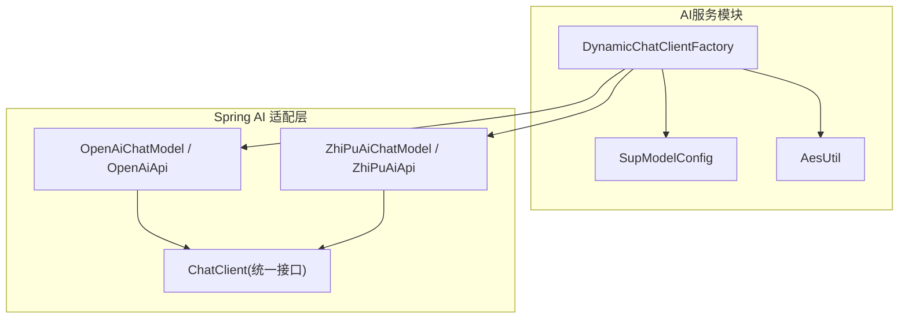
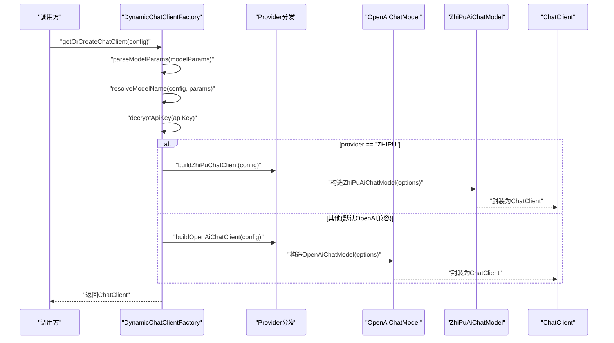
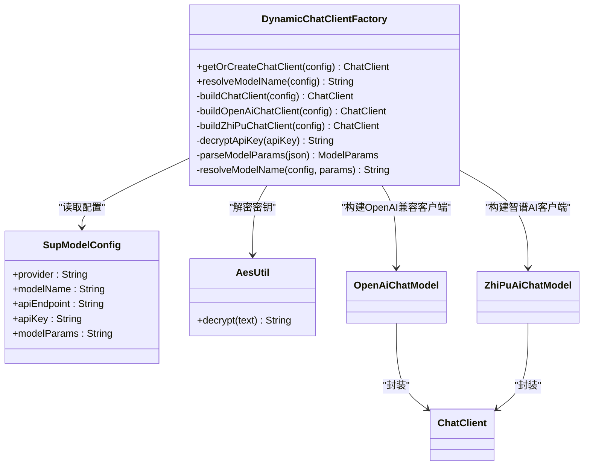
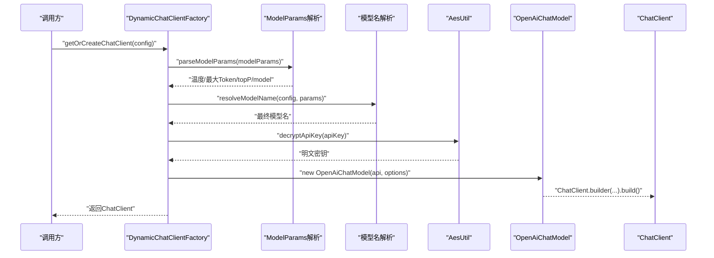
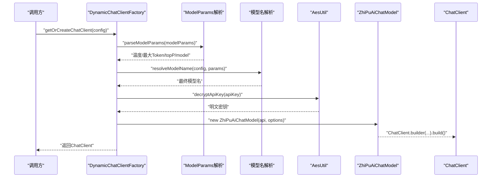
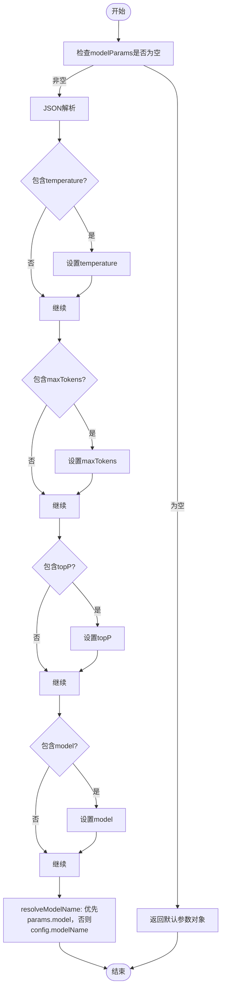
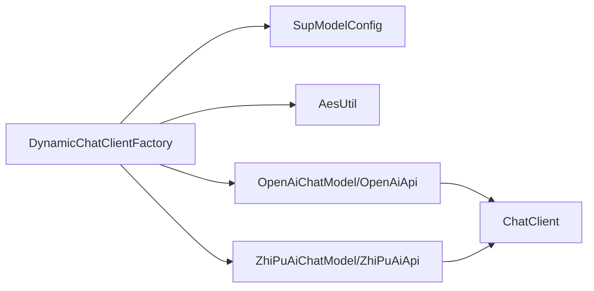

# 动态客户端工厂

<cite>
**本文引用的文件**   
- [DynamicChatClientFactory.java](file://ele-ai-tender-system/ele-ai-tender-ai/src/main/java/com/jy/eleaitender/ai/processor/model/DynamicChatClientFactory.java)
- [SupModelConfig.java](file://ele-ai-tender-system/ele-ai-tender-common/src/main/java/com/jy/eleaitender/common/entity/support/SupModelConfig.java)
- [AesUtil.java](file://ele-ai-tender-system/ele-ai-tender-common/src/main/java/com/jy/eleaitender/common/util/AesUtil.java)
</cite>

## 目录
1. [简介](#简介)
2. [项目结构](#项目结构)
3. [核心组件](#核心组件)
4. [架构总览](#架构总览)
5. [详细组件分析](#详细组件分析)
6. [依赖关系分析](#依赖关系分析)
7. [性能与资源优化](#性能与资源优化)
8. [错误处理与重试机制](#错误处理与重试机制)
9. [监控与可观测性](#监控与可观测性)
10. [最佳实践](#最佳实践)
11. [故障排查指南](#故障排查指南)
12. [结论](#结论)

## 简介
本技术文档围绕“动态ChatClient工厂”展开，聚焦于 DynamicChatClientFactory 的客户端创建与管理机制。该工厂根据数据库中的模型配置（SupModelConfig）动态构建 ChatClient 实例，支持多模型供应商（OpenAI兼容协议、智谱AI），并实现参数解析、密钥解密、模型名解析等关键流程。文档同时涵盖连接池与资源优化策略、生命周期管理、错误重试建议以及性能监控集成方案，并提供最佳实践与故障排查指引，帮助读者在生产环境中稳定高效地使用动态客户端。

## 项目结构
- 模块定位：DynamicChatClientFactory 位于 AI 服务模块 ele-ai-tender-ai 的处理器模型子包中，负责按运行时配置动态装配 ChatClient。
- 相关实体与工具：
  - SupModelConfig：描述模型供应商、端点、模型名称、API Key、扩展参数等。
  - AesUtil：提供 API Key 的加解密能力，用于安全存储与使用敏感配置。
- 外部依赖：基于 Spring AI 的 OpenAI 与 ZhiPuAi 适配层，通过统一的 ChatClient 接口屏蔽底层差异。

图表来源
- [DynamicChatClientFactory.java:1-187](file://ele-ai-tender-system/ele-ai-tender-ai/src/main/java/com/jy/eleaitender/ai/processor/model/DynamicChatClientFactory.java#L1-L187)
- [SupModelConfig.java](file://ele-ai-tender-system/ele-ai-tender-common/src/main/java/com/jy/eleaitender/common/entity/support/SupModelConfig.java)
- [AesUtil.java](file://ele-ai-tender-system/ele-ai-tender-common/src/main/java/com/jy/eleaitender/common/util/AesUtil.java)

章节来源
- [DynamicChatClientFactory.java:1-187](file://ele-ai-tender-system/ele-ai-tender-ai/src/main/java/com/jy/eleaitender/ai/processor/model/DynamicChatClientFactory.java#L1-L187)
- [SupModelConfig.java](file://ele-ai-tender-system/ele-ai-tender-common/src/main/java/com/jy/eleaitender/common/entity/support/SupModelConfig.java)
- [AesUtil.java](file://ele-ai-tender-system/ele-ai-tender-common/src/main/java/com/jy/eleaitender/common/util/AesUtil.java)

## 核心组件
- DynamicChatClientFactory
  - 职责：根据 SupModelConfig 动态构建 ChatClient；不缓存实例，确保配置变更实时生效。
  - 关键方法：
    - getOrCreateChatClient(SupModelConfig)：入口方法，委托内部构建逻辑。
    - resolveModelName(SupModelConfig)：优先从 modelParams 中解析 model，否则回退到配置项。
    - buildChatClient(SupModelConfig)：按 provider 分发至具体构建器。
    - buildOpenAiChatClient(SupModelConfig)：构建 OpenAI 兼容客户端。
    - buildZhiPuChatClient(SupModelConfig)：构建智谱AI客户端。
    - decryptApiKey(String)：解密 API Key，兼容历史明文数据。
    - parseModelParams(String)：解析 JSON 形式的模型参数（temperature、maxTokens、topP、model）。
- SupModelConfig
  - 字段要点：provider、modelName、apiEndpoint、apiKey、modelParams 等。
- AesUtil
  - 功能：对 apiKey 进行 AES 解密，失败时降级为明文返回。

章节来源
- [DynamicChatClientFactory.java:26-187](file://ele-ai-tender-system/ele-ai-tender-ai/src/main/java/com/jy/eleaitender/ai/processor/model/DynamicChatClientFactory.java#L26-L187)
- [SupModelConfig.java](file://ele-ai-tender-system/ele-ai-tender-common/src/main/java/com/jy/eleaitender/common/entity/support/SupModelConfig.java)
- [AesUtil.java](file://ele-ai-tender-system/ele-ai-tender-common/src/main/java/com/jy/eleaitender/common/util/AesUtil.java)

## 架构总览
DynamicChatClientFactory 作为统一入口，依据 SupModelConfig.provider 选择不同构建路径：
- OpenAI 兼容：使用 OpenAiApi/OpenAiChatModel，适用于 GPT、DeepSeek、本地 vLLM/Ollama 等。
- 智谱AI：使用 ZhiPuAiApi/ZhiPuAiChatModel，支持自定义 baseUrl 以适配私有化部署。

图表来源
- [DynamicChatClientFactory.java:38-124](file://ele-ai-tender-system/ele-ai-tender-ai/src/main/java/com/jy/eleaitender/ai/processor/model/DynamicChatClientFactory.java#L38-L124)

## 详细组件分析

### 类图：DynamicChatClientFactory 与其依赖

图表来源
- [DynamicChatClientFactory.java:26-187](file://ele-ai-tender-system/ele-ai-tender-ai/src/main/java/com/jy/eleaitender/ai/processor/model/DynamicChatClientFactory.java#L26-L187)
- [SupModelConfig.java](file://ele-ai-tender-system/ele-ai-tender-common/src/main/java/com/jy/eleaitender/common/entity/support/SupModelConfig.java)
- [AesUtil.java](file://ele-ai-tender-system/ele-ai-tender-common/src/main/java/com/jy/eleaitender/common/util/AesUtil.java)

### 序列图：OpenAI 兼容客户端创建流程

图表来源
- [DynamicChatClientFactory.java:64-89](file://ele-ai-tender-system/ele-ai-tender-ai/src/main/java/com/jy/eleaitender/ai/processor/model/DynamicChatClientFactory.java#L64-L89)

### 序列图：智谱AI客户端创建流程

图表来源
- [DynamicChatClientFactory.java:95-124](file://ele-ai-tender-system/ele-ai-tender-ai/src/main/java/com/jy/eleaitender/ai/processor/model/DynamicChatClientFactory.java#L95-L124)

### 流程图：模型参数解析与模型名解析

图表来源
- [DynamicChatClientFactory.java:145-175](file://ele-ai-tender-system/ele-ai-tender-ai/src/main/java/com/jy/eleaitender/ai/processor/model/DynamicChatClientFactory.java#L145-L175)

## 依赖关系分析
- 直接依赖
  - SupModelConfig：提供运行时模型配置。
  - AesUtil：提供密钥解密能力。
  - Spring AI 适配：OpenAiChatModel/OpenAiApi、ZhiPuAiChatModel/ZhiPuAiApi。
  - Jackson ObjectMapper：用于解析 modelParams JSON。
- 间接依赖
  - ChatClient：统一抽象，屏蔽不同提供商差异。
- 耦合与内聚
  - 工厂类高内聚：所有构建逻辑集中在单一类中，便于维护与扩展。
  - 低耦合：通过配置对象与标准接口解耦，新增提供商只需扩展分发逻辑。

图表来源
- [DynamicChatClientFactory.java:1-187](file://ele-ai-tender-system/ele-ai-tender-ai/src/main/java/com/jy/eleaitender/ai/processor/model/DynamicChatClientFactory.java#L1-L187)

章节来源
- [DynamicChatClientFactory.java:1-187](file://ele-ai-tender-system/ele-ai-tender-ai/src/main/java/com/jy/eleaitender/ai/processor/model/DynamicChatClientFactory.java#L1-L187)

## 性能与资源优化
- 无缓存策略
  - 当前实现不缓存 ChatClient，每次请求均重新构建，保证配置变更即时生效。
  - 优点：配置热更新友好，避免脏读。
  - 代价：频繁创建底层模型对象可能带来额外开销。
- 连接池与HTTP客户端
  - 底层 OpenAI/ZhiPu SDK 通常复用 HTTP 连接池；建议在应用侧合理配置连接池大小、超时与重试策略。
- 线程与并发
  - ChatClient 一般具备线程安全性；若存在非线程安全场景，可在上层增加实例隔离或限流。
- 参数调优
  - temperature、maxTokens、topP 等参数应结合业务场景与模型能力进行压测与调优。
- 资源回收
  - 由于未缓存实例，无需显式释放；但需关注上游调用方的引用管理与异常路径下的资源清理。

[本节为通用指导，不涉及具体文件分析]

## 错误处理与重试机制
- 密钥解密容错
  - 当 AesUtil 解密失败时，降级为明文返回，避免启动阻塞；建议记录告警并推动数据迁移。
- JSON 解析容错
  - modelParams 解析异常会被捕获并记录警告，随后使用默认参数，保障可用性。
- 重试建议
  - 在调用 ChatClient 的上层服务中引入幂等与重试策略（如指数退避），针对网络抖动、限流、临时不可用等场景提升鲁棒性。
- 熔断与降级
  - 结合断路器模式，在连续失败后快速失败，避免雪崩；同时提供降级模型或缓存结果。

章节来源
- [DynamicChatClientFactory.java:129-140](file://ele-ai-tender-system/ele-ai-tender-ai/src/main/java/com/jy/eleaitender/ai/processor/model/DynamicChatClientFactory.java#L129-L140)
- [DynamicChatClientFactory.java:145-168](file://ele-ai-tender-system/ele-ai-tender-ai/src/main/java/com/jy/eleaitender/ai/processor/model/DynamicChatClientFactory.java#L145-L168)

## 监控与可观测性
- 日志
  - 工厂在创建客户端与解析参数时输出关键信息（模型名、类型、端点、解析结果等），便于问题定位。
- 指标
  - 建议在调用层埋点统计：QPS、延迟分布、错误率、各提供商占比、模型名分布等。
- 链路追踪
  - 将 ChatClient 调用纳入分布式追踪，关联用户会话与任务上下文，形成端到端可视化。
- 审计
  - 记录模型调用审计日志（脱敏后的 key、模型名、耗时、状态码），满足合规要求。

章节来源
- [DynamicChatClientFactory.java:64-124](file://ele-ai-tender-system/ele-ai-tender-ai/src/main/java/com/jy/eleaitender/ai/processor/model/DynamicChatClientFactory.java#L64-L124)

## 最佳实践
- 配置管理
  - 将 SupModelConfig 持久化至数据库或配置中心，确保 provider、endpoint、apiKey、modelParams 完整且正确。
  - 使用加密存储 apiKey，并在首次使用时自动解密。
- 模型选择
  - 在 modelParams 中指定 model 可实现运行时覆盖 modelName，便于灰度与A/B测试。
- 参数调优
  - 针对不同业务场景调整 temperature、maxTokens、topP，并通过压测确定最优值。
- 稳定性
  - 在上层服务实现重试、熔断、降级策略；对关键路径增加超时控制。
- 可扩展性
  - 新增提供商时，仅需在分发逻辑中添加分支并实现对应构建器，保持工厂单一职责。

[本节为通用指导，不涉及具体文件分析]

## 故障排查指南
- 现象：返回空模型名
  - 检查 SupModelConfig.modelName 与 modelParams.model 是否配置；确认 resolveModelName 优先级逻辑。
- 现象：API Key 无效或鉴权失败
  - 确认 apiKey 是否正确加密；查看解密日志；必要时手动解密验证。
- 现象：模型参数不生效
  - 检查 modelParams JSON 格式与字段名；确认解析日志是否报错。
- 现象：端点不可达
  - 核对 apiEndpoint 地址与网络连通性；对于智谱AI，确认是否启用自定义 baseUrl。
- 现象：性能抖动
  - 评估连接池与超时配置；观察下游限流与配额；适当降低并发或增大超时。

章节来源
- [DynamicChatClientFactory.java:170-175](file://ele-ai-tender-system/ele-ai-tender-ai/src/main/java/com/jy/eleaitender/ai/processor/model/DynamicChatClientFactory.java#L170-L175)
- [DynamicChatClientFactory.java:129-140](file://ele-ai-tender-system/ele-ai-tender-ai/src/main/java/com/jy/eleaitender/ai/processor/model/DynamicChatClientFactory.java#L129-L140)
- [DynamicChatClientFactory.java:145-168](file://ele-ai-tender-system/ele-ai-tender-ai/src/main/java/com/jy/eleaitender/ai/processor/model/DynamicChatClientFactory.java#L145-L168)

## 结论
DynamicChatClientFactory 提供了灵活、可扩展的动态客户端创建能力，通过配置驱动的方式屏蔽了不同 AI 提供商的差异，实现了即插即用的多模型支持。其不缓存的设计确保了配置变更的实时生效，配合完善的参数解析与密钥解密机制，提升了系统的可用性与可维护性。在生产环境中，建议结合重试、熔断、监控与审计等工程化手段，进一步提升稳定性与可观测性。