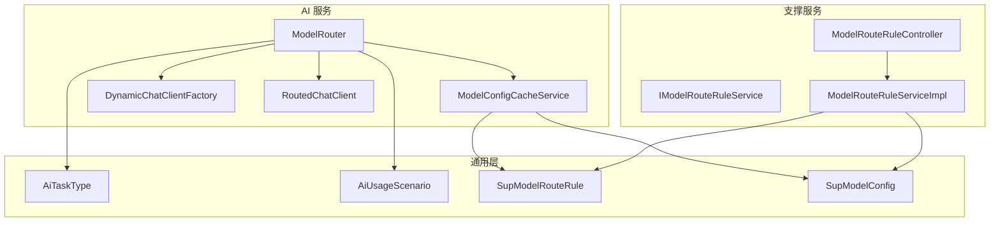
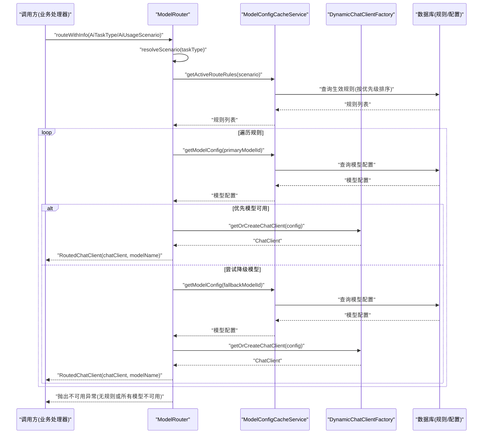
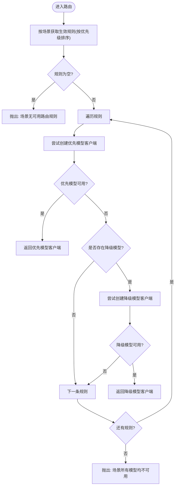
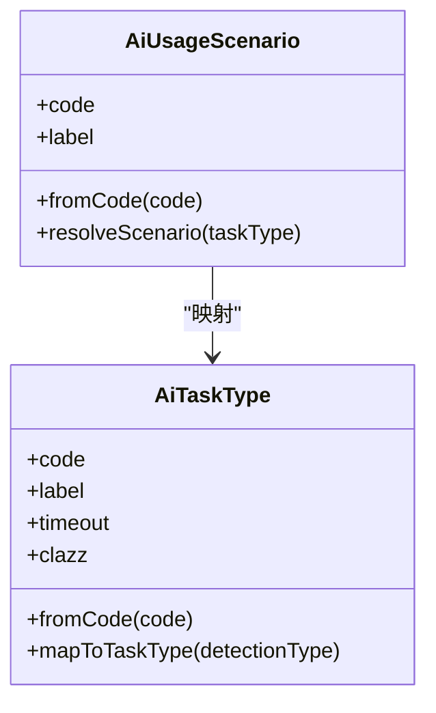
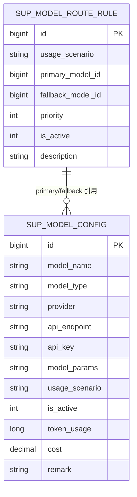
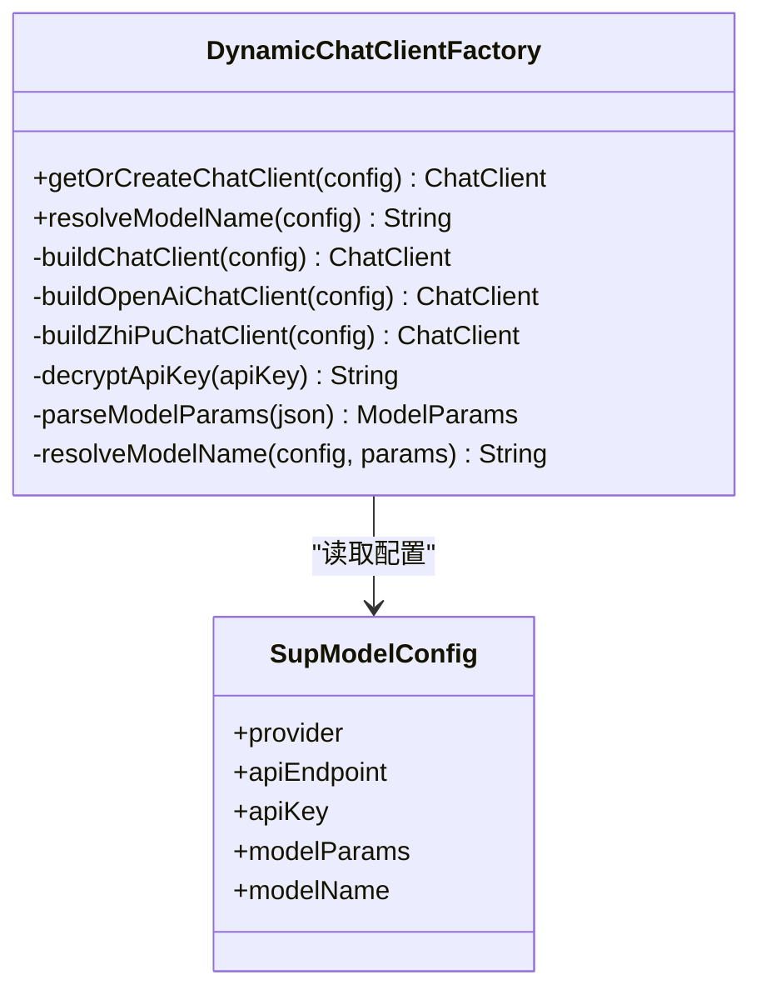
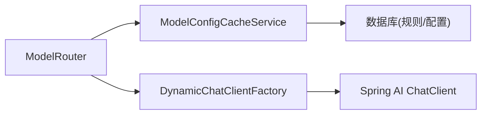

# 核心路由算法

<cite>
**本文引用的文件**   
- [ModelRouter.java](file://ele-ai-tender-system/ele-ai-tender-ai/src/main/java/com/jy/eleaitender/ai/processor/model/ModelRouter.java)
- [ModelConfigCacheService.java](file://ele-ai-tender-system/ele-ai-tender-ai/src/main/java/com/jy/eleaitender/ai/processor/model/ModelConfigCacheService.java)
- [DynamicChatClientFactory.java](file://ele-ai-tender-system/ele-ai-tender-ai/src/main/java/com/jy/eleaitender/ai/processor/model/DynamicChatClientFactory.java)
- [RoutedChatClient.java](file://ele-ai-tender-system/ele-ai-tender-ai/src/main/java/com/jy/eleaitender/ai/processor/model/RoutedChatClient.java)
- [AiTaskType.java](file://ele-ai-tender-system/ele-ai-tender-common/src/main/java/com/jy/eleaitender/common/enums/AiTaskType.java)
- [AiUsageScenario.java](file://ele-ai-tender-system/ele-ai-tender-common/src/main/java/com/jy/eleaitender/common/enums/AiUsageScenario.java)
- [SupModelRouteRule.java](file://ele-ai-tender-system/ele-ai-tender-common/src/main/java/com/jy/eleaitender/common/entity/support/SupModelRouteRule.java)
- [SupModelConfig.java](file://ele-ai-tender-system/ele-ai-tender-common/src/main/java/com/jy/eleaitender/common/entity/support/SupModelConfig.java)
- [IModelRouteRuleService.java](file://ele-ai-tender-system/ele-ai-tender-support/src/main/java/com/jy/eleaitender/support/service/IModelRouteRuleService.java)
- [ModelRouteRuleServiceImpl.java](file://ele-ai-tender-system/ele-ai-tender-support/src/main/java/com/jy/eleaitender/support/service/impl/ModelRouteRuleServiceImpl.java)
- [ModelRouteRuleController.java](file://ele-ai-tender-system/ele-ai-tender-support/src/main/java/com/jy/eleaitender/support/controller/ModelRouteRuleController.java)
- [ModelRouterTest.java](file://ele-ai-tender-system/ele-ai-tender-ai/src/test/java/com/jy/eleaitender/ai/processor/model/ModelRouterTest.java)
- [AiChatServiceImpl.java](file://ele-ai-tender-system/ele-ai-tender-ai/src/main/java/com/jy/eleaitender/ai/service/impl/AiChatServiceImpl.java)
</cite>

## 目录
1. [引言](#引言)
2. [项目结构](#项目结构)
3. [核心组件](#核心组件)
4. [架构总览](#架构总览)
5. [详细组件分析](#详细组件分析)
6. [依赖关系分析](#依赖关系分析)
7. [性能考量](#性能考量)
8. [故障排查指南](#故障排查指南)
9. [结论](#结论)
10. [附录](#附录)

## 引言
本文件围绕核心模型路由器 ModelRouter 的路由算法进行深入技术说明，涵盖：
- 基于任务类型与使用场景的智能路由逻辑
- 优先模型与降级模型的切换机制
- 路由规则匹配策略与异常处理流程
- AiTaskType 到 AiUsageScenario 的映射关系
- 路由决策的性能优化考虑
- 不同场景下的行为示例（以测试用例为参考）
- 自定义路由规则的扩展指南

## 项目结构
与核心路由相关的代码主要分布在以下模块：
- AI 服务模块：实现路由、客户端工厂、配置读取等核心能力
- 通用枚举与实体：定义任务类型、使用场景、路由规则与模型配置
- 支撑服务模块：提供路由规则的管理接口与控制器

图表来源
- [ModelRouter.java:19-105](file://ele-ai-tender-system/ele-ai-tender-ai/src/main/java/com/jy/eleaitender/ai/processor/model/ModelRouter.java#L19-L105)
- [ModelConfigCacheService.java:19-59](file://ele-ai-tender-system/ele-ai-tender-ai/src/main/java/com/jy/eleaitender/ai/processor/model/ModelConfigCacheService.java#L19-L59)
- [DynamicChatClientFactory.java:25-187](file://ele-ai-tender-system/ele-ai-tender-ai/src/main/java/com/jy/eleaitender/ai/processor/model/DynamicChatClientFactory.java#L25-L187)
- [RoutedChatClient.java:1-7](file://ele-ai-tender-system/ele-ai-tender-ai/src/main/java/com/jy/eleaitender/ai/processor/model/RoutedChatClient.java#L1-L7)
- [AiTaskType.java:12-52](file://ele-ai-tender-system/ele-ai-tender-common/src/main/java/com/jy/eleaitender/common/enums/AiTaskType.java#L12-L52)
- [AiUsageScenario.java:11-50](file://ele-ai-tender-system/ele-ai-tender-common/src/main/java/com/jy/eleaitender/common/enums/AiUsageScenario.java#L11-L50)
- [SupModelRouteRule.java:12-35](file://ele-ai-tender-system/ele-ai-tender-common/src/main/java/com/jy/eleaitender/common/entity/support/SupModelRouteRule.java#L12-L35)
- [SupModelConfig.java:12-38](file://ele-ai-tender-system/ele-ai-tender-common/src/main/java/com/jy/eleaitender/common/entity/support/SupModelConfig.java#L12-L38)
- [IModelRouteRuleService.java:12-61](file://ele-ai-tender-system/ele-ai-tender-support/src/main/java/com/jy/eleaitender/support/service/IModelRouteRuleService.java#L12-L61)
- [ModelRouteRuleServiceImpl.java:34-131](file://ele-ai-tender-system/ele-ai-tender-support/src/main/java/com/jy/eleaitender/support/service/impl/ModelRouteRuleServiceImpl.java#L34-L131)
- [ModelRouteRuleController.java:35-80](file://ele-ai-tender-system/ele-ai-tender-support/src/main/java/com/jy/eleaitender/support/controller/ModelRouteRuleController.java#L35-L80)

章节来源
- [ModelRouter.java:19-105](file://ele-ai-tender-system/ele-ai-tender-ai/src/main/java/com/jy/eleaitender/ai/processor/model/ModelRouter.java#L19-L105)
- [ModelConfigCacheService.java:19-59](file://ele-ai-tender-system/ele-ai-tender-ai/src/main/java/com/jy/eleaitender/ai/processor/model/ModelConfigCacheService.java#L19-L59)
- [DynamicChatClientFactory.java:25-187](file://ele-ai-tender-system/ele-ai-tender-ai/src/main/java/com/jy/eleaitender/ai/processor/model/DynamicChatClientFactory.java#L25-L187)
- [RoutedChatClient.java:1-7](file://ele-ai-tender-system/ele-ai-tender-ai/src/main/java/com/jy/eleaitender/ai/processor/model/RoutedChatClient.java#L1-L7)
- [AiTaskType.java:12-52](file://ele-ai-tender-system/ele-ai-tender-common/src/main/java/com/jy/eleaitender/common/enums/AiTaskType.java#L12-L52)
- [AiUsageScenario.java:11-50](file://ele-ai-tender-system/ele-ai-tender-common/src/main/java/com/jy/eleaitender/common/enums/AiUsageScenario.java#L11-L50)
- [SupModelRouteRule.java:12-35](file://ele-ai-tender-system/ele-ai-tender-common/src/main/java/com/jy/eleaitender/common/entity/support/SupModelRouteRule.java#L12-L35)
- [SupModelConfig.java:12-38](file://ele-ai-tender-system/ele-ai-tender-common/src/main/java/com/jy/eleaitender/common/entity/support/SupModelConfig.java#L12-L38)
- [IModelRouteRuleService.java:12-61](file://ele-ai-tender-system/ele-ai-tender-support/src/main/java/com/jy/eleaitender/support/service/IModelRouteRuleService.java#L12-L61)
- [ModelRouteRuleServiceImpl.java:34-131](file://ele-ai-tender-system/ele-ai-tender-support/src/main/java/com/jy/eleaitender/support/service/impl/ModelRouteRuleServiceImpl.java#L34-L131)
- [ModelRouteRuleController.java:35-80](file://ele-ai-tender-system/ele-ai-tender-support/src/main/java/com/jy/eleaitender/support/controller/ModelRouteRuleController.java#L35-L80)

## 核心组件
- ModelRouter：根据任务类型或使用场景进行智能路由，支持“优先模型 + 降级模型”的自动切换。
- ModelConfigCacheService：按场景查询生效的路由规则与模型配置，保证实时性。
- DynamicChatClientFactory：依据模型配置动态创建 ChatClient，支持多供应商（OpenAI兼容、智谱）。
- RoutedChatClient：封装返回的 ChatClient 与其实际使用的模型名称。
- AiTaskType / AiUsageScenario：定义任务类型与使用场景，并提供从任务类型到使用场景的映射。
- SupModelRouteRule / SupModelConfig：持久化的路由规则与模型配置实体。
- 支撑服务：提供路由规则的分页、启用/停用、CRUD 等管理能力。

章节来源
- [ModelRouter.java:19-105](file://ele-ai-tender-system/ele-ai-tender-ai/src/main/java/com/jy/eleaitender/ai/processor/model/ModelRouter.java#L19-L105)
- [ModelConfigCacheService.java:19-59](file://ele-ai-tender-system/ele-ai-tender-ai/src/main/java/com/jy/eleaitender/ai/processor/model/ModelConfigCacheService.java#L19-L59)
- [DynamicChatClientFactory.java:25-187](file://ele-ai-tender-system/ele-ai-tender-ai/src/main/java/com/jy/eleaitender/ai/processor/model/DynamicChatClientFactory.java#L25-L187)
- [RoutedChatClient.java:1-7](file://ele-ai-tender-system/ele-ai-tender-ai/src/main/java/com/jy/eleaitender/ai/processor/model/RoutedChatClient.java#L1-L7)
- [AiTaskType.java:12-52](file://ele-ai-tender-system/ele-ai-tender-common/src/main/java/com/jy/eleaitender/common/enums/AiTaskType.java#L12-L52)
- [AiUsageScenario.java:11-50](file://ele-ai-tender-system/ele-ai-tender-common/src/main/java/com/jy/eleaitender/common/enums/AiUsageScenario.java#L11-L50)
- [SupModelRouteRule.java:12-35](file://ele-ai-tender-system/ele-ai-tender-common/src/main/java/com/jy/eleaitender/common/entity/support/SupModelRouteRule.java#L12-L35)
- [SupModelConfig.java:12-38](file://ele-ai-tender-system/ele-ai-tender-common/src/main/java/com/jy/eleaitender/common/entity/support/SupModelConfig.java#L12-L38)

## 架构总览
下图展示了从调用方到最终 ChatClient 的完整链路，包括场景解析、规则匹配、模型选择与客户端构建。

图表来源
- [ModelRouter.java:32-85](file://ele-ai-tender-system/ele-ai-tender-ai/src/main/java/com/jy/eleaitender/ai/processor/model/ModelRouter.java#L32-L85)
- [ModelConfigCacheService.java:34-59](file://ele-ai-tender-system/ele-ai-tender-ai/src/main/java/com/jy/eleaitender/ai/processor/model/ModelConfigCacheService.java#L34-L59)
- [DynamicChatClientFactory.java:38-124](file://ele-ai-tender-system/ele-ai-tender-ai/src/main/java/com/jy/eleaitender/ai/processor/model/DynamicChatClientFactory.java#L38-L124)
- [AiUsageScenario.java:33-48](file://ele-ai-tender-system/ele-ai-tender-common/src/main/java/com/jy/eleaitender/common/enums/AiUsageScenario.java#L33-L48)

## 详细组件分析

### ModelRouter 类分析
- 入口方法
  - route(AiTaskType): 将任务类型转换为使用场景后委托给场景路由。
  - routeWithInfo(AiTaskType): 返回包含 ChatClient 与实际模型名的结果对象。
  - route(AiUsageScenario)/routeWithInfo(AiUsageScenario): 直接按使用场景进行路由。
  - routeModel(Long)/routeModelWithInfo(Long): 指定模型 ID 的直接路由。
- 路由算法
  - 获取当前场景下所有启用的路由规则，按优先级升序排列。
  - 对每条规则依次尝试优先模型；若失败且存在降级模型，则尝试降级模型。
  - 任一成功即返回；全部失败则抛出不可用异常。
- 异常处理
  - 无可用规则：抛出“场景无可用路由规则”。
  - 所有模型不可用：抛出“场景所有模型均不可用”。
  - 指定模型不可用：抛出“模型不可用: modelId=...”。
- 关键数据流
  - 通过 ModelConfigCacheService 获取规则与模型配置。
  - 通过 DynamicChatClientFactory 构建 ChatClient 并解析实际模型名。

图表来源
- [ModelRouter.java:48-70](file://ele-ai-tender-system/ele-ai-tender-ai/src/main/java/com/jy/eleaitender/ai/processor/model/ModelRouter.java#L48-L70)

章节来源
- [ModelRouter.java:19-105](file://ele-ai-tender-system/ele-ai-tender-ai/src/main/java/com/jy/eleaitender/ai/processor/model/ModelRouter.java#L19-L105)
- [ModelRouterTest.java:21-81](file://ele-ai-tender-system/ele-ai-tender-ai/src/test/java/com/jy/eleaitender/ai/processor/model/ModelRouterTest.java#L21-L81)

### 任务类型到使用场景的映射
- AiTaskType 定义了多种任务类型（如需求生成、评审项生成、文档集成、文本优化、各类检测等）。
- AiUsageScenario 定义了使用场景（生成、优化、检测、对话），并提供 resolveScenario 将任务类型映射到对应场景。
- 映射要点
  - 生成类任务 → GENERATION
  - 优化类任务 → OPTIMIZATION
  - 检测类任务 → DETECTION

图表来源
- [AiTaskType.java:12-52](file://ele-ai-tender-system/ele-ai-tender-common/src/main/java/com/jy/eleaitender/common/enums/AiTaskType.java#L12-L52)
- [AiUsageScenario.java:11-50](file://ele-ai-tender-system/ele-ai-tender-common/src/main/java/com/jy/eleaitender/common/enums/AiUsageScenario.java#L11-L50)

章节来源
- [AiTaskType.java:12-52](file://ele-ai-tender-system/ele-ai-tender-common/src/main/java/com/jy/eleaitender/common/enums/AiTaskType.java#L12-L52)
- [AiUsageScenario.java:11-50](file://ele-ai-tender-system/ele-ai-tender-common/src/main/java/com/jy/eleaitender/common/enums/AiUsageScenario.java#L11-L50)

### 路由规则与模型配置
- SupModelRouteRule：描述一个场景下的路由规则，包含优先模型ID、降级模型ID、优先级、是否启用、描述等。
- SupModelConfig：描述一个模型实例的配置，包含模型名称、供应商、端点、密钥、参数JSON、是否启用等。
- 规则管理
  - IModelRouteRuleService 提供分页查询、按场景获取生效规则、CRUD、启用/停用等接口。
  - ModelRouteRuleServiceImpl 实现上述接口，并按优先级排序返回。
  - ModelRouteRuleController 暴露 REST API 供前端管理。

图表来源
- [SupModelRouteRule.java:12-35](file://ele-ai-tender-system/ele-ai-tender-common/src/main/java/com/jy/eleaitender/common/entity/support/SupModelRouteRule.java#L12-L35)
- [SupModelConfig.java:12-38](file://ele-ai-tender-system/ele-ai-tender-common/src/main/java/com/jy/eleaitender/common/entity/support/SupModelConfig.java#L12-L38)
- [IModelRouteRuleService.java:12-61](file://ele-ai-tender-system/ele-ai-tender-support/src/main/java/com/jy/eleaitender/support/service/IModelRouteRuleService.java#L12-L61)
- [ModelRouteRuleServiceImpl.java:34-131](file://ele-ai-tender-system/ele-ai-tender-support/src/main/java/com/jy/eleaitender/support/service/impl/ModelRouteRuleServiceImpl.java#L34-L131)
- [ModelRouteRuleController.java:35-80](file://ele-ai-tender-system/ele-ai-tender-support/src/main/java/com/jy/eleaitender/support/controller/ModelRouteRuleController.java#L35-L80)

章节来源
- [SupModelRouteRule.java:12-35](file://ele-ai-tender-system/ele-ai-tender-common/src/main/java/com/jy/eleaitender/common/entity/support/SupModelRouteRule.java#L12-L35)
- [SupModelConfig.java:12-38](file://ele-ai-tender-system/ele-ai-tender-common/src/main/java/com/jy/eleaitender/common/entity/support/SupModelConfig.java#L12-L38)
- [IModelRouteRuleService.java:12-61](file://ele-ai-tender-system/ele-ai-tender-support/src/main/java/com/jy/eleaitender/support/service/IModelRouteRuleService.java#L12-L61)
- [ModelRouteRuleServiceImpl.java:34-131](file://ele-ai-tender-system/ele-ai-tender-support/src/main/java/com/jy/eleaitender/support/service/impl/ModelRouteRuleServiceImpl.java#L34-L131)
- [ModelRouteRuleController.java:35-80](file://ele-ai-tender-system/ele-ai-tender-support/src/main/java/com/jy/eleaitender/support/controller/ModelRouteRuleController.java#L35-L80)

### 客户端工厂与多供应商支持
- DynamicChatClientFactory 根据模型配置的供应商类型分发构建 ChatClient：
  - OpenAI 兼容协议：适用于 DeepSeek、GPT、本地 vLLM/Ollama 等。
  - 智谱AI：使用专属 SDK，支持自定义 baseUrl。
- 支持从 modelParams JSON 中解析 temperature、maxTokens、topP、model 等参数，并覆盖默认值。
- 支持 apiKey 解密（兼容历史明文数据）。

图表来源
- [DynamicChatClientFactory.java:25-187](file://ele-ai-tender-system/ele-ai-tender-ai/src/main/java/com/jy/eleaitender/ai/processor/model/DynamicChatClientFactory.java#L25-L187)
- [SupModelConfig.java:12-38](file://ele-ai-tender-system/ele-ai-tender-common/src/main/java/com/jy/eleaitender/common/entity/support/SupModelConfig.java#L12-L38)

章节来源
- [DynamicChatClientFactory.java:25-187](file://ele-ai-tender-system/ele-ai-tender-ai/src/main/java/com/jy/eleaitender/ai/processor/model/DynamicChatClientFactory.java#L25-L187)

### 典型调用路径与示例
- 聊天场景
  - AiChatServiceImpl 在对话场景中通过 ModelRouter.routeWithInfo(AiUsageScenario.CHAT) 获取 ChatClient 并记录调用信息。
- 单元测试示例（来自测试用例）
  - 指定模型路由：当传入有效 modelId 时，应返回对应 ChatClient。
  - 场景路由与信息返回：当存在生效规则且优先模型可用时，返回包含 ChatClient 与实际模型名的结果。
  - 不可用异常：当指定模型不存在或不可用时，抛出“模型不可用”异常。

章节来源
- [AiChatServiceImpl.java:177-206](file://ele-ai-tender-system/ele-ai-tender-ai/src/main/java/com/jy/eleaitender/ai/service/impl/AiChatServiceImpl.java#L177-L206)
- [ModelRouterTest.java:21-81](file://ele-ai-tender-system/ele-ai-tender-ai/src/test/java/com/jy/eleaitender/ai/processor/model/ModelRouterTest.java#L21-L81)

## 依赖关系分析
- 低耦合设计
  - ModelRouter 仅依赖抽象的服务与工厂接口，便于替换与测试。
  - 规则与配置读取集中在 ModelConfigCacheService，避免重复查询逻辑。
- 外部依赖
  - Spring AI 的 ChatClient 及具体供应商实现（OpenAI、智谱）。
  - MyBatis-Plus 的数据访问层用于读取规则与配置。
- 可能的循环依赖
  - 当前结构未见循环依赖迹象，职责清晰分层。

图表来源
- [ModelRouter.java:19-105](file://ele-ai-tender-system/ele-ai-tender-ai/src/main/java/com/jy/eleaitender/ai/processor/model/ModelRouter.java#L19-L105)
- [ModelConfigCacheService.java:19-59](file://ele-ai-tender-system/ele-ai-tender-ai/src/main/java/com/jy/eleaitender/ai/processor/model/ModelConfigCacheService.java#L19-L59)
- [DynamicChatClientFactory.java:25-187](file://ele-ai-tender-system/ele-ai-tender-ai/src/main/java/com/jy/eleaitender/ai/processor/model/DynamicChatClientFactory.java#L25-L187)

章节来源
- [ModelRouter.java:19-105](file://ele-ai-tender-system/ele-ai-tender-ai/src/main/java/com/jy/eleaitender/ai/processor/model/ModelRouter.java#L19-L105)
- [ModelConfigCacheService.java:19-59](file://ele-ai-tender-system/ele-ai-tender-ai/src/main/java/com/jy/eleaitender/ai/processor/model/ModelConfigCacheService.java#L19-L59)
- [DynamicChatClientFactory.java:25-187](file://ele-ai-tender-system/ele-ai-tender-ai/src/main/java/com/jy/eleaitender/ai/processor/model/DynamicChatClientFactory.java#L25-L187)

## 性能考量
- 规则与配置读取
  - 当前实现直接查库，不缓存，确保配置变更实时生效。在高并发场景下可能引入额外延迟。
  - 建议：可引入本地缓存（如 Caffeine）或分布式缓存（如 Redis），并对热点场景的规则与模型配置设置合理 TTL。
- 客户端创建
  - 每次路由都会创建 ChatClient，未做客户端级缓存。对于高频短请求场景，可考虑客户端池化或轻量级缓存。
- 数据库索引
  - 建议在 sup_model_route_rule 表上针对 usage_scenario、is_active、priority 建立复合索引，加速生效规则查询。
  - 建议在 sup_model_config 表上针对 id、is_delete、is_active 建立合适索引，提升模型配置查询效率。
- 异常快速失败
  - 路由失败快速返回，避免长时间阻塞。结合超时与重试策略，提升整体稳定性。

[本节为通用指导，无需特定文件引用]

## 故障排查指南
- 常见问题定位
  - “场景无可用路由规则”：检查对应场景是否存在启用状态的路由规则。
  - “场景所有模型均不可用”：检查优先/降级模型配置是否启用、是否存在、是否可创建客户端。
  - “模型不可用: modelId=...”：检查指定模型配置是否存在、是否启用、API 密钥是否正确。
- 日志线索
  - 优先/降级模型创建失败会记录错误日志，包含 modelId 与模型名称，便于快速定位。
- 验证步骤
  - 通过支撑服务的“获取生效规则”接口确认规则是否按预期生效。
  - 通过“模型连通性测试”接口验证各供应商客户端是否能正常创建。

章节来源
- [ModelRouter.java:48-105](file://ele-ai-tender-system/ele-ai-tender-ai/src/main/java/com/jy/eleaitender/ai/processor/model/ModelRouter.java#L48-L105)
- [ModelRouteRuleController.java:35-80](file://ele-ai-tender-system/ele-ai-tender-support/src/main/java/com/jy/eleaitender/support/controller/ModelRouteRuleController.java#L35-L80)

## 结论
ModelRouter 提供了简洁而强大的模型路由能力：
- 通过任务类型到使用场景的映射，统一了不同业务的模型选择策略。
- 基于“优先 + 降级”的双模型策略，提升了系统鲁棒性与可用性。
- 配合支撑服务的前端界面，实现了可视化的规则管理与即时生效。
- 在保持实时性的同时，可通过缓存与索引等手段进一步优化性能。

[本节为总结性内容，无需特定文件引用]

## 附录

### 自定义路由规则扩展指南
- 新增场景
  - 在 AiUsageScenario 中增加新的使用场景枚举值。
  - 在 AiTaskType 中为新任务类型添加映射到该场景的逻辑。
- 新增规则
  - 通过支撑服务的 REST API 或前端页面创建路由规则，填写使用场景、优先/降级模型、优先级等信息。
  - 确保模型配置已启用且可创建客户端。
- 调整优先级
  - 修改规则的 priority 字段，值越小优先级越高。
- 灰度与回滚
  - 利用 isActive 字段控制规则启用/停用，实现灰度发布与快速回滚。
- 监控与观测
  - 结合日志与统计指标，观察不同场景下的模型选择分布与失败率，持续优化规则。

章节来源
- [AiUsageScenario.java:11-50](file://ele-ai-tender-system/ele-ai-tender-common/src/main/java/com/jy/eleaitender/common/enums/AiUsageScenario.java#L11-L50)
- [AiTaskType.java:12-52](file://ele-ai-tender-system/ele-ai-tender-common/src/main/java/com/jy/eleaitender/common/enums/AiTaskType.java#L12-L52)
- [IModelRouteRuleService.java:12-61](file://ele-ai-tender-system/ele-ai-tender-support/src/main/java/com/jy/eleaitender/support/service/IModelRouteRuleService.java#L12-L61)
- [ModelRouteRuleController.java:35-80](file://ele-ai-tender-system/ele-ai-tender-support/src/main/java/com/jy/eleaitender/support/controller/ModelRouteRuleController.java#L35-L80)