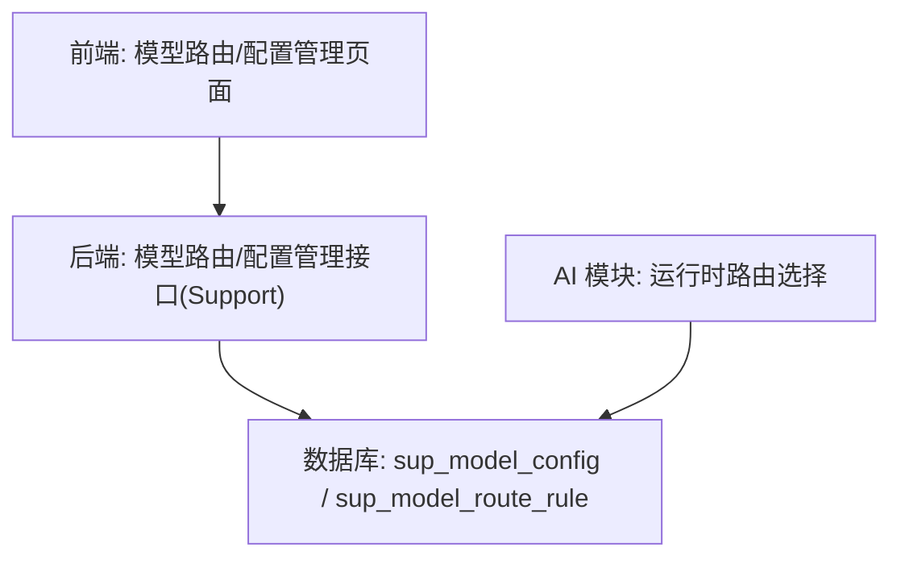
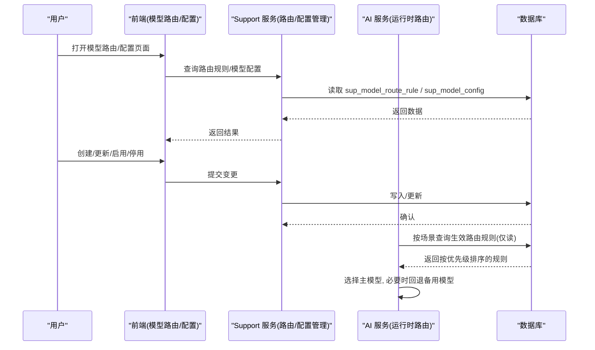
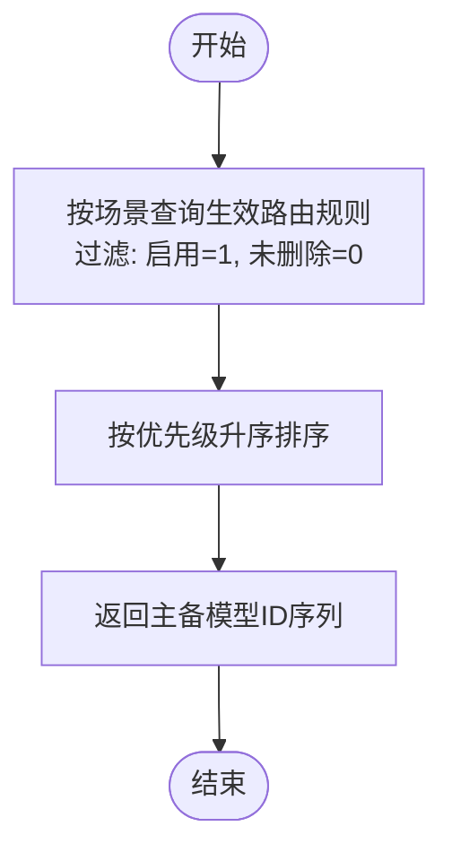
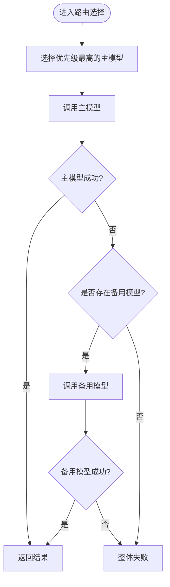
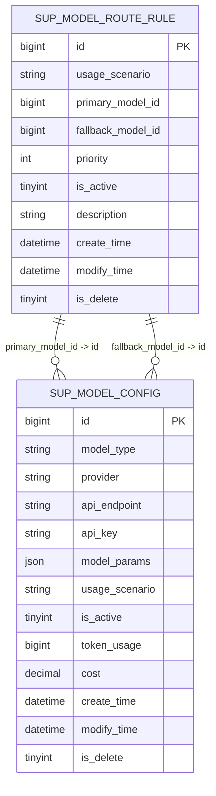
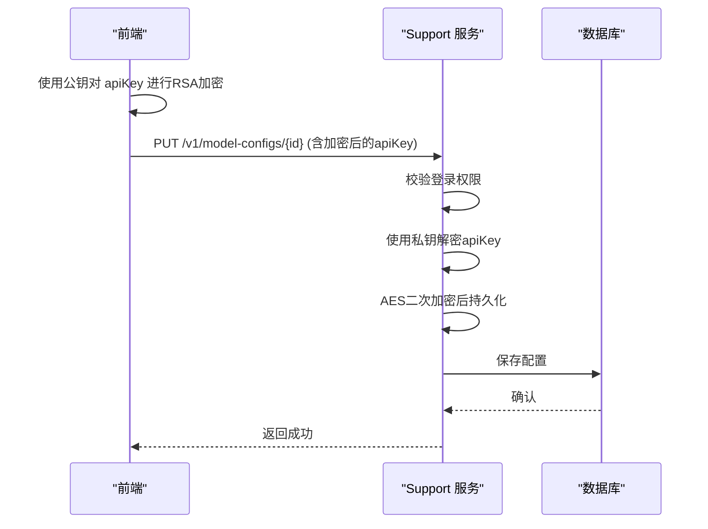
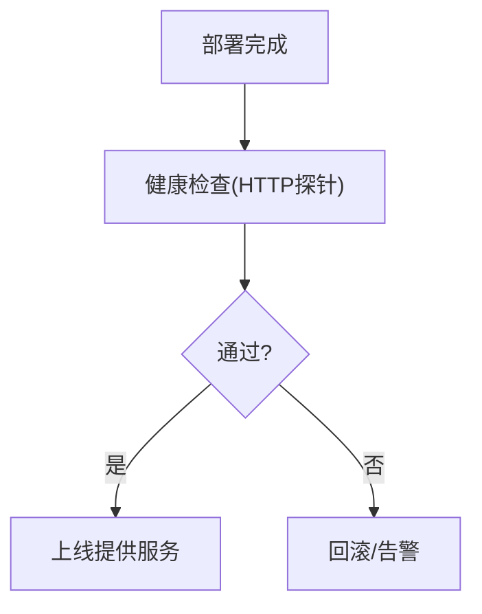
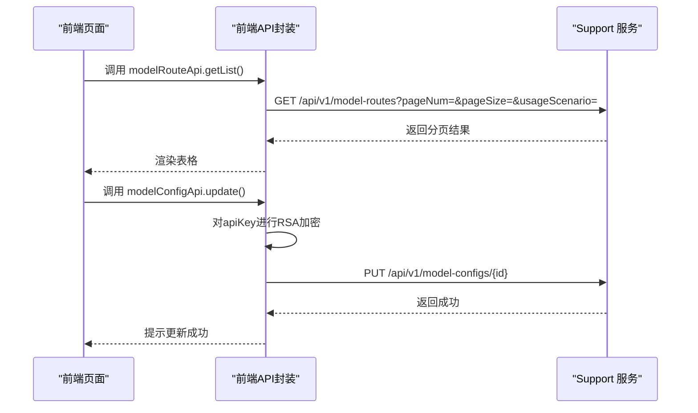
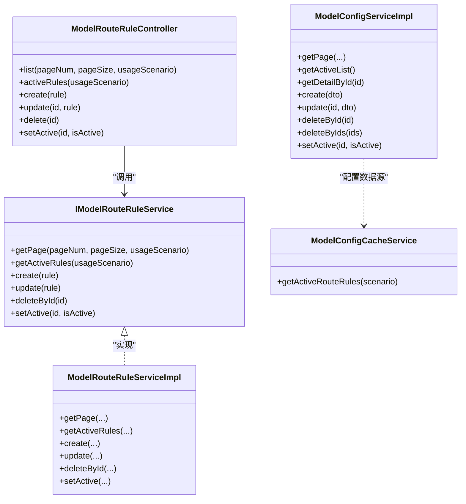

# 模型路由与连接管理

<cite>
**本文引用的文件**
- [ModelConfigCacheService.java](file://ele-ai-tender-system/ele-ai-tender-ai/src/main/java/com/jy/eleaitender/ai/processor/model/ModelConfigCacheService.java)
- [SupModelRouteRule.java](file://ele-ai-tender-system/ele-ai-tender-common/src/main/java/com/jy/eleaitender/common/entity/support/SupModelRouteRule.java)
- [ModelRouteRuleController.java](file://ele-ai-tender-system/ele-ai-tender-support/src/main/java/com/jy/eleaitender/support/controller/ModelRouteRuleController.java)
- [IModelRouteRuleService.java](file://ele-ai-tender-system/ele-ai-tender-support/src/main/java/com/jy/eleaitender/support/service/IModelRouteRuleService.java)
- [ModelRouteRuleServiceImpl.java](file://ele-ai-tender-system/ele-ai-tender-support/src/main/java/com/jy/eleaitender/support/service/impl/ModelRouteRuleServiceImpl.java)
- [ModelConfigServiceImpl.java](file://ele-ai-tender-system/ele-ai-tender-support/src/main/java/com/jy/eleaitender/support/service/impl/ModelConfigServiceImpl.java)
- [IModelConfigService.java](file://ele-ai-tender-system/ele-ai-tender-support/src/main/java/com/jy/eleaitender/support/service/IModelConfigService.java)
- [model-route.ts](file://ele-ai-tender-support-frontend/src/api/model-route.ts)
- [model-config.ts](file://ele-ai-tender-support-frontend/src/api/model-config.ts)
- [model-route.ts（类型）](file://ele-ai-tender-support-frontend/src/types/model-route.ts)
- [index.vue（模型路由页面）](file://ele-ai-tender-support-frontend/src/views/model-route/index.vue)
- [init.sql（支持库表结构片段）](file://ele-ai-tender-system/ele-ai-tender-support/sql/init.sql)
</cite>

## 目录
1. [简介](#简介)
2. [项目结构](#项目结构)
3. [核心组件](#核心组件)
4. [架构总览](#架构总览)
5. [详细组件分析](#详细组件分析)
6. [依赖关系分析](#依赖关系分析)
7. [性能考量](#性能考量)
8. [故障排查指南](#故障排查指南)
9. [结论](#结论)
10. [附录](#附录)

## 简介
本技术文档围绕“模型路由与连接管理”展开，聚焦以下能力：
- 动态模型路由算法：基于使用场景、优先级与主备模型的路由选择。
- 负载均衡策略：按优先级顺序的串行回退与可扩展的权重/健康度扩展点。
- 故障转移机制：主模型不可用时自动降级至备用模型。
- 多模型配置管理：模型供应商、端点、密钥、参数、启用状态、累计用量与费用等。
- 连接池优化：面向外部模型调用的连接复用与并发控制建议。
- 认证授权实现：前端密钥加密传输、后端存储加密与接口鉴权。
- 健康检查与自动切换：部署阶段健康检查与运行时可用性探测思路。
- 监控统计与成本控制：Token 用量与费用字段支撑的统计与限额基础。
- 扩展接口与自定义规则：如何新增路由策略与接入新模型供应商。

## 项目结构
系统采用前后端分离的多模块架构：
- 前端（support-frontend）提供模型配置与路由规则的可视化维护界面，并通过 API 调用后端服务。
- 后端（support 模块）提供模型配置与路由规则的 CRUD 与查询接口，供 AI 模块在运行时读取生效规则。
- AI 模块通过只读 Mapper 直接查询数据库获取当前生效的路由规则，保证配置实时生效。

图表来源
- [ModelRouteRuleController.java](file://ele-ai-tender-system/ele-ai-tender-support/src/main/java/com/jy/eleaitender/support/controller/ModelRouteRuleController.java)
- [ModelConfigServiceImpl.java](file://ele-ai-tender-system/ele-ai-tender-support/src/main/java/com/jy/eleaitender/support/service/impl/ModelConfigServiceImpl.java)
- [ModelConfigCacheService.java](file://ele-ai-tender-system/ele-ai-tender-ai/src/main/java/com/jy/eleaitender/ai/processor/model/ModelConfigCacheService.java)
- [init.sql（支持库表结构片段）](file://ele-ai-tender-system/ele-ai-tender-support/sql/init.sql)

章节来源
- [ModelRouteRuleController.java](file://ele-ai-tender-system/ele-ai-tender-support/src/main/java/com/jy/eleaitender/support/controller/ModelRouteRuleController.java)
- [ModelConfigServiceImpl.java](file://ele-ai-tender-system/ele-ai-tender-support/src/main/java/com/jy/eleaitender/support/service/impl/ModelConfigServiceImpl.java)
- [ModelConfigCacheService.java](file://ele-ai-tender-system/ele-ai-tender-ai/src/main/java/com/jy/eleaitender/ai/processor/model/ModelConfigCacheService.java)
- [init.sql（支持库表结构片段）](file://ele-ai-tender-system/ele-ai-tender-support/sql/init.sql)

## 核心组件
- 模型路由规则实体与数据表
  - 路由规则包含使用场景、主模型ID、备用模型ID、优先级、是否启用、描述等字段，用于决定请求应优先走哪个模型，并在失败时回退到备用模型。
  - 数据表包含创建/修改审计字段与逻辑删除标记，确保可追溯与软删除。
- 路由规则管理服务（Support）
  - 提供分页查询、按场景获取生效规则、增删改、启用/停用等操作。
- 模型配置管理服务（Support）
  - 提供模型配置的增删改查、批量操作、启用/停用、列表过滤等。
  - 支持对敏感字段（如 apiKey）进行 RSA 解密后 AES 加密存储，保障安全。
- 运行时路由选择（AI）
  - 根据使用场景查询启用的路由规则并按优先级排序，返回主备模型序列，供上层调度器执行主模型调用与失败回退。

章节来源
- [SupModelRouteRule.java](file://ele-ai-tender-system/ele-ai-tender-common/src/main/java/com/jy/eleaitender/common/entity/support/SupModelRouteRule.java)
- [IModelRouteRuleService.java](file://ele-ai-tender-system/ele-ai-tender-support/src/main/java/com/jy/eleaitender/support/service/IModelRouteRuleService.java)
- [ModelRouteRuleServiceImpl.java](file://ele-ai-tender-system/ele-ai-tender-support/src/main/java/com/jy/eleaitender/support/service/impl/ModelRouteRuleServiceImpl.java)
- [IModelConfigService.java](file://ele-ai-tender-system/ele-ai-tender-support/src/main/java/com/jy/eleaitender/support/service/IModelConfigService.java)
- [ModelConfigServiceImpl.java](file://ele-ai-tender-system/ele-ai-tender-support/src/main/java/com/jy/eleaitender/support/service/impl/ModelConfigServiceImpl.java)
- [ModelConfigCacheService.java](file://ele-ai-tender-system/ele-ai-tender-ai/src/main/java/com/jy/eleaitender/ai/processor/model/ModelConfigCacheService.java)

## 架构总览
下图展示了从前端管理到后端持久化，再到 AI 模块运行时的完整链路。

图表来源
- [ModelRouteRuleController.java](file://ele-ai-tender-system/ele-ai-tender-support/src/main/java/com/jy/eleaitender/support/controller/ModelRouteRuleController.java)
- [ModelConfigServiceImpl.java](file://ele-ai-tender-system/ele-ai-tender-support/src/main/java/com/jy/eleaitender/support/service/impl/ModelConfigServiceImpl.java)
- [ModelConfigCacheService.java](file://ele-ai-tender-system/ele-ai-tender-ai/src/main/java/com/jy/eleaitender/ai/processor/model/ModelConfigCacheService.java)
- [init.sql（支持库表结构片段）](file://ele-ai-tender-system/ele-ai-tender-support/sql/init.sql)

## 详细组件分析

### 动态模型路由算法
- 输入：使用场景（如 GENERATION/OPTIMIZATION/DETECTION）。
- 处理：
  - 查询该场景下已启用且未删除的路由规则。
  - 按优先级升序排序，得到候选模型序列（主模型在前，备用模型在后）。
- 输出：有序的主备模型 ID 列表，供调用方依次尝试。

图表来源
- [ModelConfigCacheService.java](file://ele-ai-tender-system/ele-ai-tender-ai/src/main/java/com/jy/eleaitender/ai/processor/model/ModelConfigCacheService.java)
- [SupModelRouteRule.java](file://ele-ai-tender-system/ele-ai-tender-common/src/main/java/com/jy/eleaitender/common/entity/support/SupModelRouteRule.java)

章节来源
- [ModelConfigCacheService.java](file://ele-ai-tender-system/ele-ai-tender-ai/src/main/java/com/jy/eleaitender/ai/processor/model/ModelConfigCacheService.java)
- [SupModelRouteRule.java](file://ele-ai-tender-system/ele-ai-tender-common/src/main/java/com/jy/eleaitender/common/entity/support/SupModelRouteRule.java)

### 负载均衡策略与故障转移
- 负载均衡策略：
  - 当前实现为“按优先级顺序”的串行选择，适合主备容灾与简单灰度。
  - 可扩展方向：引入权重轮询、最少活跃连接、延迟感知等策略（需在上层调度器中实现）。
- 故障转移机制：
  - 当主模型调用失败或超时，自动切换到备用模型；若无备用模型则直接失败。
  - 建议在调用层记录失败原因并触发告警，便于定位问题。

[此图为概念流程，不直接映射具体代码文件]

### 多模型配置管理
- 功能要点：
  - 支持按模型类型、供应商、使用场景、名称、启用状态等多条件分页查询。
  - 支持创建、更新、删除、批量删除、启用/停用。
  - 敏感字段（apiKey）采用前端 RSA 加密、后端 AES 加密存储，避免明文泄露。
- 数据模型：
  - 模型配置包含供应商、API 端点、密钥、模型参数、使用场景、启用状态、累计 Token 用量与费用等。
  - 路由规则包含使用场景、主模型ID、备用模型ID、优先级、启用状态与描述。

图表来源
- [init.sql（支持库表结构片段）](file://ele-ai-tender-system/ele-ai-tender-support/sql/init.sql)
- [SupModelRouteRule.java](file://ele-ai-tender-system/ele-ai-tender-common/src/main/java/com/jy/eleaitender/common/entity/support/SupModelRouteRule.java)

章节来源
- [ModelConfigServiceImpl.java](file://ele-ai-tender-system/ele-ai-tender-support/src/main/java/com/jy/eleaitender/support/service/impl/ModelConfigServiceImpl.java)
- [IModelConfigService.java](file://ele-ai-tender-system/ele-ai-tender-support/src/main/java/com/jy/eleaitender/support/service/IModelConfigService.java)
- [init.sql（支持库表结构片段）](file://ele-ai-tender-system/ele-ai-tender-support/sql/init.sql)
- [SupModelRouteRule.java](file://ele-ai-tender-system/ele-ai-tender-common/src/main/java/com/jy/eleaitender/common/entity/support/SupModelRouteRule.java)

### 认证授权实现
- 接口鉴权：
  - 路由规则相关接口均标注登录校验注解，确保只有登录用户可访问。
- 密钥安全：
  - 前端在更新模型配置时对 apiKey 进行 RSA 加密后再发送。
  - 后端接收后解密并 AES 加密存储，避免明文落盘。

图表来源
- [model-config.ts](file://ele-ai-tender-support-frontend/src/api/model-config.ts)
- [ModelConfigServiceImpl.java](file://ele-ai-tender-system/ele-ai-tender-support/src/main/java/com/jy/eleaitender/support/service/impl/ModelConfigServiceImpl.java)
- [ModelRouteRuleController.java](file://ele-ai-tender-system/ele-ai-tender-support/src/main/java/com/jy/eleaitender/support/controller/ModelRouteRuleController.java)

章节来源
- [model-config.ts](file://ele-ai-tender-support-frontend/src/api/model-config.ts)
- [ModelConfigServiceImpl.java](file://ele-ai-tender-system/ele-ai-tender-support/src/main/java/com/jy/eleaitender/support/service/impl/ModelConfigServiceImpl.java)
- [ModelRouteRuleController.java](file://ele-ai-tender-system/ele-ai-tender-support/src/main/java/com/jy/eleaitender/support/controller/ModelRouteRuleController.java)

### 模型健康检查与自动切换
- 部署期健康检查：
  - CI/CD 流水线中包含健康检查步骤，若服务启动后无法响应则判定失败，防止将不健康实例纳入流量。
- 运行期健康检查（建议）：
  - 在路由选择前增加轻量级探针（如快速 ping 或最小请求），失败则跳过该模型实例。
  - 结合熔断与重试策略，避免雪崩。

图表来源
- [Jenkinsfile-ai.groovy](file://Jenkinsfile-ai.groovy)
- [Jenkinsfile-core.groovy](file://Jenkinsfile-core.groovy)
- [Jenkinsfile-file.groovy](file://Jenkinsfile-file.groovy)
- [Jenkinsfile-support.groovy](file://Jenkinsfile-support.groovy)

章节来源
- [Jenkinsfile-ai.groovy](file://Jenkinsfile-ai.groovy)
- [Jenkinsfile-core.groovy](file://Jenkinsfile-core.groovy)
- [Jenkinsfile-file.groovy](file://Jenkinsfile-file.groovy)
- [Jenkinsfile-support.groovy](file://Jenkinsfile-support.groovy)

### 模型调用统计、成本控制与配额管理
- 统计字段：
  - 模型配置包含累计 Token 用量与累计费用，可用于统计与成本核算。
- 成本控制：
  - 可在路由层或计费层设置阈值，达到配额时拒绝或降级。
- 配额管理（建议）：
  - 基于租户/项目维度统计用量，超过配额后限制调用或切换低成本模型。

章节来源
- [init.sql（支持库表结构片段）](file://ele-ai-tender-system/ele-ai-tender-support/sql/init.sql)

### 前端管理与交互
- 模型路由管理：
  - 提供分页查询、创建、更新、删除、启用/停用的 API 封装与页面交互。
- 模型配置管理：
  - 提供创建、更新（含密钥加密）、删除、批量删除、启用/停用等 API 封装。

图表来源
- [model-route.ts](file://ele-ai-tender-support-frontend/src/api/model-route.ts)
- [model-config.ts](file://ele-ai-tender-support-frontend/src/api/model-config.ts)
- [ModelRouteRuleController.java](file://ele-ai-tender-system/ele-ai-tender-support/src/main/java/com/jy/eleaitender/support/controller/ModelRouteRuleController.java)
- [ModelConfigServiceImpl.java](file://ele-ai-tender-system/ele-ai-tender-support/src/main/java/com/jy/eleaitender/support/service/impl/ModelConfigServiceImpl.java)

章节来源
- [model-route.ts](file://ele-ai-tender-support-frontend/src/api/model-route.ts)
- [model-config.ts](file://ele-ai-tender-support-frontend/src/api/model-config.ts)
- [index.vue（模型路由页面）](file://ele-ai-tender-support-frontend/src/views/model-route/index.vue)
- [ModelRouteRuleController.java](file://ele-ai-tender-system/ele-ai-tender-support/src/main/java/com/jy/eleaitender/support/controller/ModelRouteRuleController.java)
- [ModelConfigServiceImpl.java](file://ele-ai-tender-system/ele-ai-tender-support/src/main/java/com/jy/eleaitender/support/service/impl/ModelConfigServiceImpl.java)

### 扩展接口与自定义路由规则
- 新增模型供应商：
  - 在模型配置中新增一条记录，填写供应商、端点、密钥与参数。
  - 在 AI 模块的模型客户端中实现对应供应商的适配。
- 自定义路由策略：
  - 在路由规则表中新增规则，调整优先级与主备模型。
  - 如需更复杂策略（如权重、地域、延迟），可在上层调度器中扩展，读取规则后进行加权选择。

章节来源
- [SupModelRouteRule.java](file://ele-ai-tender-system/ele-ai-tender-common/src/main/java/com/jy/eleaitender/common/entity/support/SupModelRouteRule.java)
- [ModelConfigCacheService.java](file://ele-ai-tender-system/ele-ai-tender-ai/src/main/java/com/jy/eleaitender/ai/processor/model/ModelConfigCacheService.java)

## 依赖关系分析
- 控制器与服务：
  - 路由规则控制器依赖 IModelRouteRuleService，服务实现负责分页、过滤与状态变更。
- 服务与数据层：
  - 服务实现依赖 MyBatis Plus 的 Mapper 进行数据读写。
- AI 模块与数据层：
  - AI 模块通过只读 Mapper 直接查询生效路由规则，保证配置实时生效。

图表来源
- [ModelRouteRuleController.java](file://ele-ai-tender-system/ele-ai-tender-support/src/main/java/com/jy/eleaitender/support/controller/ModelRouteRuleController.java)
- [IModelRouteRuleService.java](file://ele-ai-tender-system/ele-ai-tender-support/src/main/java/com/jy/eleaitender/support/service/IModelRouteRuleService.java)
- [ModelRouteRuleServiceImpl.java](file://ele-ai-tender-system/ele-ai-tender-support/src/main/java/com/jy/eleaitender/support/service/impl/ModelRouteRuleServiceImpl.java)
- [ModelConfigServiceImpl.java](file://ele-ai-tender-system/ele-ai-tender-support/src/main/java/com/jy/eleaitender/support/service/impl/ModelConfigServiceImpl.java)
- [ModelConfigCacheService.java](file://ele-ai-tender-system/ele-ai-tender-ai/src/main/java/com/jy/eleaitender/ai/processor/model/ModelConfigCacheService.java)

章节来源
- [ModelRouteRuleController.java](file://ele-ai-tender-system/ele-ai-tender-support/src/main/java/com/jy/eleaitender/support/controller/ModelRouteRuleController.java)
- [IModelRouteRuleService.java](file://ele-ai-tender-system/ele-ai-tender-support/src/main/java/com/jy/eleaitender/support/service/IModelRouteRuleService.java)
- [ModelRouteRuleServiceImpl.java](file://ele-ai-tender-system/ele-ai-tender-support/src/main/java/com/jy/eleaitender/support/service/impl/ModelRouteRuleServiceImpl.java)
- [ModelConfigServiceImpl.java](file://ele-ai-tender-system/ele-ai-tender-support/src/main/java/com/jy/eleaitender/support/service/impl/ModelConfigServiceImpl.java)
- [ModelConfigCacheService.java](file://ele-ai-tender-system/ele-ai-tender-ai/src/main/java/com/jy/eleaitender/ai/processor/model/ModelConfigCacheService.java)

## 性能考量
- 直连数据库读取规则：
  - AI 模块直接查询数据库获取生效规则，避免缓存失效带来的不一致，但可能带来额外 IO。
  - 建议在高并发场景下引入本地缓存（带短 TTL）或分布式缓存，并监听配置变更事件刷新缓存。
- 连接池优化（建议）：
  - 针对外部模型 HTTP 客户端配置合理的连接池大小、超时与重试策略。
  - 针对不同供应商设置独立连接池，避免相互影响。
- 限流与熔断（建议）：
  - 在路由层增加令牌桶/漏桶限流，防止突发流量压垮下游。
  - 对频繁失败的模型实例进行熔断，降低无效调用。

[本节为通用指导，不直接分析具体文件]

## 故障排查指南
- 常见问题定位：
  - 路由规则未生效：检查规则是否启用、是否被逻辑删除、优先级是否正确。
  - 模型配置异常：检查供应商、端点、密钥与参数是否正确；确认密钥是否经过正确加解密。
  - 健康检查失败：查看 CI/CD 日志中的健康检查步骤输出，确认服务端口与路径可达。
- 建议排查手段：
  - 通过管理页面查询路由规则与模型配置，核对最新状态。
  - 在 AI 模块侧打印路由选择日志，观察主备模型切换情况。
  - 对模型调用增加错误码与耗时统计，便于定位瓶颈与失败原因。

章节来源
- [ModelRouteRuleController.java](file://ele-ai-tender-system/ele-ai-tender-support/src/main/java/com/jy/eleaitender/support/controller/ModelRouteRuleController.java)
- [ModelConfigServiceImpl.java](file://ele-ai-tender-system/ele-ai-tender-support/src/main/java/com/jy/eleaitender/support/service/impl/ModelConfigServiceImpl.java)
- [Jenkinsfile-ai.groovy](file://Jenkinsfile-ai.groovy)
- [Jenkinsfile-core.groovy](file://Jenkinsfile-core.groovy)
- [Jenkinsfile-file.groovy](file://Jenkinsfile-file.groovy)
- [Jenkinsfile-support.groovy](file://Jenkinsfile-support.groovy)

## 结论
本项目实现了以“使用场景+优先级+主备模型”为核心的动态模型路由能力，并通过支持服务提供完善的配置管理能力。AI 模块直接读取数据库以确保配置实时生效，配合部署期的健康检查形成端到端的稳定性保障。在此基础上，可通过引入缓存、连接池优化、限流熔断与更丰富的路由策略进一步提升性能与弹性。

## 附录
- 前端类型定义参考：
  - 模型路由规则信息、查询参数与创建/更新参数类型定义。
- 前端 API 封装参考：
  - 模型路由与模型配置的 API 方法封装，包括分页、增删改与状态变更。

章节来源
- [model-route.ts（类型）](file://ele-ai-tender-support-frontend/src/types/model-route.ts)
- [model-route.ts](file://ele-ai-tender-support-frontend/src/api/model-route.ts)
- [model-config.ts](file://ele-ai-tender-support-frontend/src/api/model-config.ts)