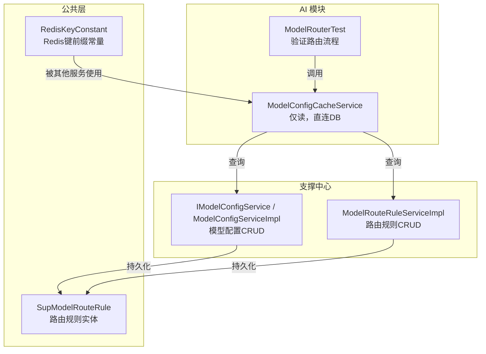
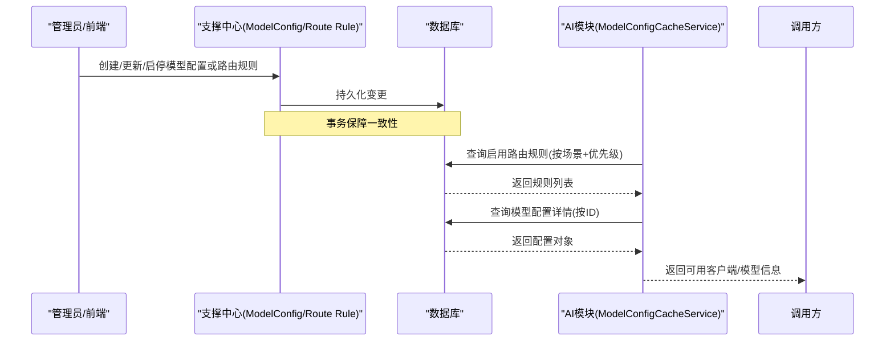
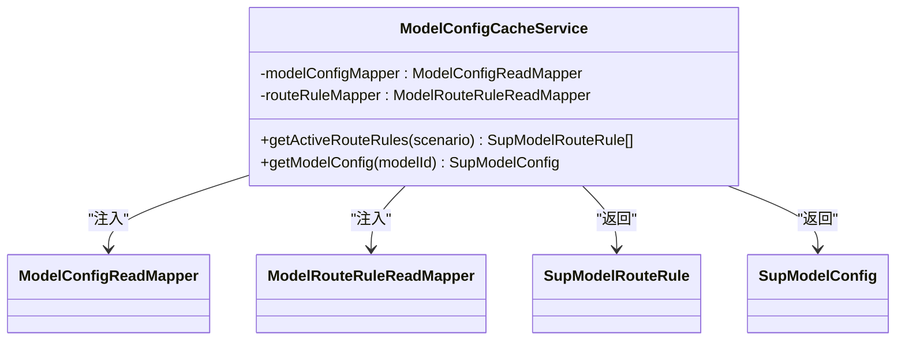
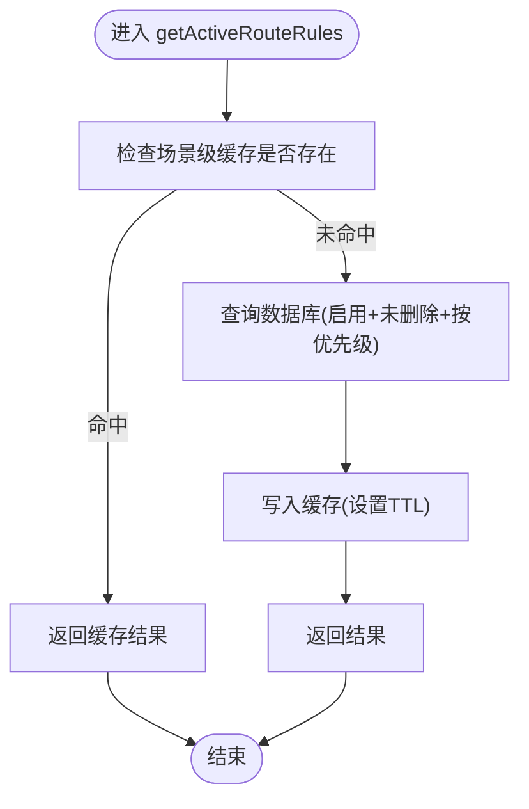
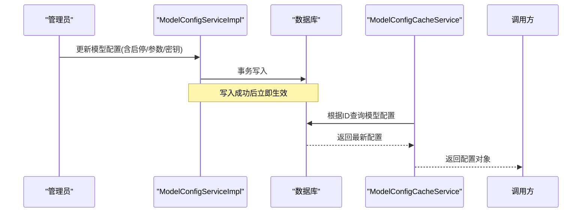
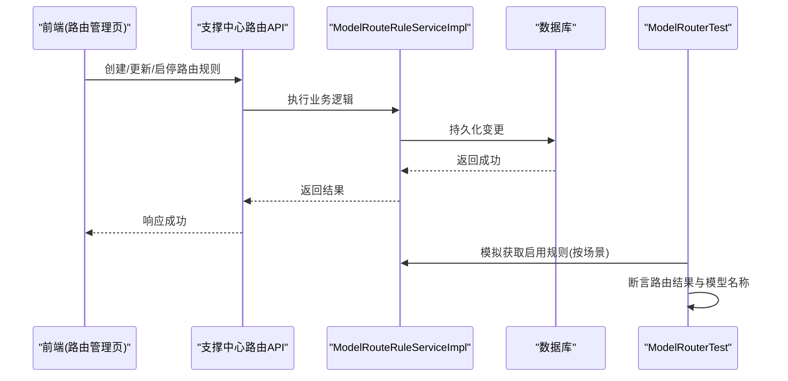
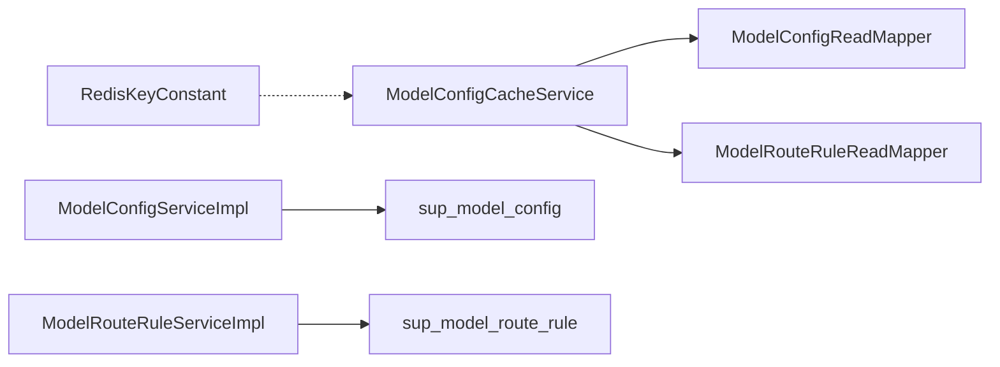

# 模型配置缓存服务

<cite>
**本文引用的文件**
- [ModelConfigCacheService.java](file://ele-ai-tender-system/ele-ai-tender-ai/src/main/java/com/jy/eleaitender/ai/processor/model/ModelConfigCacheService.java)
- [ModelRouterTest.java](file://ele-ai-tender-system/ele-ai-tender-ai/src/test/java/com/jy/eleaitender/ai/processor/model/ModelRouterTest.java)
- [IModelConfigService.java](file://ele-ai-tender-system/ele-ai-tender-support/src/main/java/com/jy/eleaitender/support/service/IModelConfigService.java)
- [ModelConfigServiceImpl.java](file://ele-ai-tender-system/ele-ai-tender-support/src/main/java/com/jy/eleaitender/support/service/impl/ModelConfigServiceImpl.java)
- [ModelRouteRuleServiceImpl.java](file://ele-ai-tender-system/ele-ai-tender-support/src/main/java/com/jy/eleaitender/support/service/impl/ModelRouteRuleServiceImpl.java)
- [RedisKeyConstant.java](file://ele-ai-tender-system/ele-ai-tender-common/src/main/java/com/jy/eleaitender/common/constant/RedisKeyConstant.java)
- [SupModelRouteRule.java](file://ele-ai-tender-system/ele-ai-tender-common/src/main/java/com/jy/eleaitender/common/entity/support/SupModelRouteRule.java)
</cite>

## 目录
1. [简介](#简介)
2. [项目结构](#项目结构)
3. [核心组件](#核心组件)
4. [架构总览](#架构总览)
5. [详细组件分析](#详细组件分析)
6. [依赖关系分析](#依赖关系分析)
7. [性能考虑](#性能考虑)
8. [故障排查指南](#故障排查指南)
9. [结论](#结论)
10. [附录](#附录)

## 简介
本技术文档围绕“模型配置缓存服务”展开，聚焦于 ModelConfigCacheService 的缓存策略、数据同步与一致性保证、路由规则缓存管理、热更新机制与性能优化方案。同时涵盖监控、故障恢复与数据迁移的实现细节，并提供缓存配置调优与故障排查指南。

需要特别说明的是：当前仓库中的 ModelConfigCacheService 注释明确为“直接查DB，不缓存，保证配置实时生效”。因此，本节将基于现有实现进行说明，并给出在引入 Redis 缓存后的演进建议与落地路径。

## 项目结构
与模型配置和路由相关的代码主要分布在以下模块：
- AI 模块（读取侧）：提供运行时对模型配置与路由规则的只读访问能力
- 支撑中心（写入侧）：提供模型配置与路由规则的增删改查与启停控制
- 公共常量：集中定义 Redis Key 前缀等常量

图表来源
- [ModelConfigCacheService.java:18-59](file://ele-ai-tender-system/ele-ai-tender-ai/src/main/java/com/jy/eleaitender/ai/processor/model/ModelConfigCacheService.java#L18-L59)
- [ModelRouterTest.java:21-80](file://ele-ai-tender-system/ele-ai-tender-ai/src/test/java/com/jy/eleaitender/ai/processor/model/ModelRouterTest.java#L21-L80)
- [IModelConfigService.java:10-19](file://ele-ai-tender-system/ele-ai-tender-support/src/main/java/com/jy/eleaitender/support/service/IModelConfigService.java#L10-L19)
- [ModelConfigServiceImpl.java:27-143](file://ele-ai-tender-system/ele-ai-tender-support/src/main/java/com/jy/eleaitender/support/service/impl/ModelConfigServiceImpl.java#L27-L143)
- [ModelRouteRuleServiceImpl.java:34-96](file://ele-ai-tender-system/ele-ai-tender-support/src/main/java/com/jy/eleaitender/support/service/impl/ModelRouteRuleServiceImpl.java#L34-L96)
- [RedisKeyConstant.java:6-69](file://ele-ai-tender-system/ele-ai-tender-common/src/main/java/com/jy/eleaitender/common/constant/RedisKeyConstant.java#L6-L69)
- [SupModelRouteRule.java:12-35](file://ele-ai-tender-system/ele-ai-tender-common/src/main/java/com/jy/eleaitender/common/entity/support/SupModelRouteRule.java#L12-L35)

章节来源
- [ModelConfigCacheService.java:18-59](file://ele-ai-tender-system/ele-ai-tender-ai/src/main/java/com/jy/eleaitender/ai/processor/model/ModelConfigCacheService.java#L18-L59)
- [ModelRouterTest.java:21-80](file://ele-ai-tender-system/ele-ai-tender-ai/src/test/java/com/jy/eleaitender/ai/processor/model/ModelRouterTest.java#L21-L80)
- [IModelConfigService.java:10-19](file://ele-ai-tender-system/ele-ai-tender-support/src/main/java/com/jy/eleaitender/support/service/IModelConfigService.java#L10-L19)
- [ModelConfigServiceImpl.java:27-143](file://ele-ai-tender-system/ele-ai-tender-support/src/main/java/com/jy/eleaitender/support/service/impl/ModelConfigServiceImpl.java#L27-L143)
- [ModelRouteRuleServiceImpl.java:34-96](file://ele-ai-tender-system/ele-ai-tender-support/src/main/java/com/jy/eleaitender/support/service/impl/ModelRouteRuleServiceImpl.java#L34-L96)
- [RedisKeyConstant.java:6-69](file://ele-ai-tender-system/ele-ai-tender-common/src/main/java/com/jy/eleaitender/common/constant/RedisKeyConstant.java#L6-L69)
- [SupModelRouteRule.java:12-35](file://ele-ai-tender-system/ele-ai-tender-common/src/main/java/com/jy/eleaitender/common/entity/support/SupModelRouteRule.java#L12-L35)

## 核心组件
- ModelConfigCacheService
  - 职责：提供模型配置与路由规则的只读接口；当前实现为直连数据库，无本地或分布式缓存
  - 关键方法：
    - getActiveRouteRules(scenario)：按场景获取启用且未删除的路由规则，按优先级升序返回
    - getModelConfig(modelId)：按ID获取模型配置，过滤已删除记录
- IModelConfigService / ModelConfigServiceImpl
  - 职责：模型配置的创建、更新、删除、启停与分页查询；包含参数JSON组装与API密钥加解密逻辑
- ModelRouteRuleServiceImpl
  - 职责：路由规则的CRUD与启停；支持按场景查询并按优先级排序
- RedisKeyConstant
  - 职责：集中定义系统内各类 Redis Key 前缀与过期时间常量（当前未用于模型配置缓存）
- SupModelRouteRule
  - 职责：路由规则实体，包含使用场景、主备模型ID、优先级、是否启用等字段

章节来源
- [ModelConfigCacheService.java:18-59](file://ele-ai-tender-system/ele-ai-tender-ai/src/main/java/com/jy/eleaitender/ai/processor/model/ModelConfigCacheService.java#L18-L59)
- [IModelConfigService.java:10-19](file://ele-ai-tender-system/ele-ai-tender-support/src/main/java/com/jy/eleaitender/support/service/IModelConfigService.java#L10-L19)
- [ModelConfigServiceImpl.java:27-143](file://ele-ai-tender-system/ele-ai-tender-support/src/main/java/com/jy/eleaitender/support/service/impl/ModelConfigServiceImpl.java#L27-L143)
- [ModelRouteRuleServiceImpl.java:34-96](file://ele-ai-tender-system/ele-ai-tender-support/src/main/java/com/jy/eleaitender/support/service/impl/ModelRouteRuleServiceImpl.java#L34-L96)
- [RedisKeyConstant.java:6-69](file://ele-ai-tender-system/ele-ai-tender-common/src/main/java/com/jy/eleaitender/common/constant/RedisKeyConstant.java#L6-L69)
- [SupModelRouteRule.java:12-35](file://ele-ai-tender-system/ele-ai-tender-common/src/main/java/com/jy/eleaitender/common/entity/support/SupModelRouteRule.java#L12-L35)

## 架构总览
下图展示了运行期模型配置与路由规则的数据流向：支撑中心负责写，AI 模块负责读。当前读路径直连数据库，确保强一致与即时生效。

图表来源
- [ModelConfigCacheService.java:34-58](file://ele-ai-tender-system/ele-ai-tender-ai/src/main/java/com/jy/eleaitender/ai/processor/model/ModelConfigCacheService.java#L34-L58)
- [ModelConfigServiceImpl.java:86-143](file://ele-ai-tender-system/ele-ai-tender-support/src/main/java/com/jy/eleaitender/support/service/impl/ModelConfigServiceImpl.java#L86-L143)
- [ModelRouteRuleServiceImpl.java:63-96](file://ele-ai-tender-system/ele-ai-tender-support/src/main/java/com/jy/eleaitender/support/service/impl/ModelRouteRuleServiceImpl.java#L63-L96)

## 详细组件分析

### ModelConfigCacheService 组件分析
- 设计要点
  - 当前实现为“直连DB”，通过 MyBatis-Plus 的 Mapper 执行查询
  - 路由规则查询条件：usageScenario=指定场景、isActive=1、isDelete=0，按 priority 升序
  - 模型配置查询：按ID取单条，若不存在或已删除则返回空
- 一致性保证
  - 由于每次请求都直连数据库，天然具备强一致性，修改后即刻生效
- 可扩展性
  - 可在该服务中引入 Redis 作为二级缓存，结合失效策略与热点保护，提升吞吐与降低DB压力

图表来源
- [ModelConfigCacheService.java:18-59](file://ele-ai-tender-system/ele-ai-tender-ai/src/main/java/com/jy/eleaitender/ai/processor/model/ModelConfigCacheService.java#L18-L59)
- [SupModelRouteRule.java:12-35](file://ele-ai-tender-system/ele-ai-tender-common/src/main/java/com/jy/eleaitender/common/entity/support/SupModelRouteRule.java#L12-L35)

章节来源
- [ModelConfigCacheService.java:18-59](file://ele-ai-tender-system/ele-ai-tender-ai/src/main/java/com/jy/eleaitender/ai/processor/model/ModelConfigCacheService.java#L18-L59)

### 路由规则缓存管理与热更新机制（现状与建议）
- 现状
  - 当前 ModelConfigCacheService 未使用任何缓存，所有查询均直达数据库
  - 路由规则在支撑中心更新后，AI 模块下次查询即可读到最新值
- 建议的热更新与缓存策略（可选演进）
  - 缓存键设计：以 usageScenario 为维度，如 ai:model:route:{SCENARIO}
  - TTL 策略：默认短TTL（例如30分钟），兼顾时效性与稳定性
  - 失效策略：在支撑中心更新/启停路由规则时主动删除对应场景的缓存键
  - 回源保护：缓存穿透时直接回源DB；缓存击穿采用互斥锁或一次性重建
  - 一致性：最终一致，但通过短TTL与主动失效缩短不一致窗口

图表来源
- [ModelConfigCacheService.java:34-41](file://ele-ai-tender-system/ele-ai-tender-ai/src/main/java/com/jy/eleaitender/ai/processor/model/ModelConfigCacheService.java#L34-L41)
- [RedisKeyConstant.java:6-69](file://ele-ai-tender-system/ele-ai-tender-common/src/main/java/com/jy/eleaitender/common/constant/RedisKeyConstant.java#L6-L69)

章节来源
- [ModelConfigCacheService.java:34-41](file://ele-ai-tender-system/ele-ai-tender-ai/src/main/java/com/jy/eleaitender/ai/processor/model/ModelConfigCacheService.java#L34-L41)
- [RedisKeyConstant.java:6-69](file://ele-ai-tender-system/ele-ai-tender-common/src/main/java/com/jy/eleaitender/common/constant/RedisKeyConstant.java#L6-L69)

### 模型配置数据的加载、更新与一致性
- 加载
  - 通过 getModelConfig(modelId) 直连数据库获取，自动过滤已删除记录
- 更新
  - 支撑中心的 ModelConfigServiceImpl 提供 create/update/setActive 等方法，内部包含参数JSON组装与API密钥加密存储
- 一致性
  - 当前读路径直连DB，具备强一致性；若后续引入缓存，需配合失效策略保证最终一致性

图表来源
- [ModelConfigServiceImpl.java:86-143](file://ele-ai-tender-system/ele-ai-tender-support/src/main/java/com/jy/eleaitender/support/service/impl/ModelConfigServiceImpl.java#L86-L143)
- [ModelConfigCacheService.java:49-58](file://ele-ai-tender-system/ele-ai-tender-ai/src/main/java/com/jy/eleaitender/ai/processor/model/ModelConfigCacheService.java#L49-L58)

章节来源
- [ModelConfigServiceImpl.java:86-143](file://ele-ai-tender-system/ele-ai-tender-support/src/main/java/com/jy/eleaitender/support/service/impl/ModelConfigServiceImpl.java#L86-L143)
- [ModelConfigCacheService.java:49-58](file://ele-ai-tender-system/ele-ai-tender-ai/src/main/java/com/jy/eleaitender/ai/processor/model/ModelConfigCacheService.java#L49-L58)

### 路由规则的热更新与测试验证
- 前端操作
  - 支撑中心前端可对路由规则进行创建、编辑、启停与删除，提交后刷新列表
- 后端处理
  - ModelRouteRuleServiceImpl 提供 CRUD 与 setActive 接口，按场景与优先级维护规则顺序
- 测试验证
  - ModelRouterTest 验证了路由流程：从缓存服务获取规则与配置，构造客户端并返回有效模型名；当模型不可用时抛出异常

图表来源
- [ModelRouteRuleServiceImpl.java:34-96](file://ele-ai-tender-system/ele-ai-tender-support/src/main/java/com/jy/eleaitender/support/service/impl/ModelRouteRuleServiceImpl.java#L34-L96)
- [ModelRouterTest.java:44-80](file://ele-ai-tender-system/ele-ai-tender-ai/src/test/java/com/jy/eleaitender/ai/processor/model/ModelRouterTest.java#L44-L80)

章节来源
- [ModelRouteRuleServiceImpl.java:34-96](file://ele-ai-tender-system/ele-ai-tender-support/src/main/java/com/jy/eleaitender/support/service/impl/ModelRouteRuleServiceImpl.java#L34-L96)
- [ModelRouterTest.java:44-80](file://ele-ai-tender-system/ele-ai-tender-ai/src/test/java/com/jy/eleaitender/ai/processor/model/ModelRouterTest.java#L44-L80)

## 依赖关系分析
- 组件耦合
  - ModelConfigCacheService 依赖两个只读 Mapper，分别用于模型配置与路由规则查询
  - 支撑中心的服务类依赖各自的 Mapper 完成持久化
- 外部依赖
  - RedisKeyConstant 定义了通用 Redis Key 前缀，当前未被模型配置缓存使用，可作为未来扩展的基础
- 潜在循环依赖
  - 当前读/写分离清晰，未见循环依赖迹象

图表来源
- [ModelConfigCacheService.java:22-26](file://ele-ai-tender-system/ele-ai-tender-ai/src/main/java/com/jy/eleaitender/ai/processor/model/ModelConfigCacheService.java#L22-L26)
- [RedisKeyConstant.java:6-69](file://ele-ai-tender-system/ele-ai-tender-common/src/main/java/com/jy/eleaitender/common/constant/RedisKeyConstant.java#L6-L69)

章节来源
- [ModelConfigCacheService.java:22-26](file://ele-ai-tender-system/ele-ai-tender-ai/src/main/java/com/jy/eleaitender/ai/processor/model/ModelConfigCacheService.java#L22-L26)
- [RedisKeyConstant.java:6-69](file://ele-ai-tender-system/ele-ai-tender-common/src/main/java/com/jy/eleaitender/common/constant/RedisKeyConstant.java#L6-L69)

## 性能考虑
- 当前实现的优势
  - 直连数据库，避免缓存一致性问题，适合配置变更频繁且要求强一致的场景
- 可优化的方向（可选）
  - 引入 Redis 缓存路由规则，按场景分片，设置合理TTL
  - 针对热点模型配置增加本地缓存（如 Caffeine）做二级加速
  - 对高并发场景增加限流与熔断保护，防止缓存雪崩或击穿
  - 对批量查询进行合并与去重，减少DB往返

[本节为通用性能建议，不涉及具体文件分析]

## 故障排查指南
- 常见问题定位
  - 路由规则未生效：确认支撑中心是否正确启停与保存；当前读路径直连DB，无需关注缓存失效
  - 模型配置为空：检查模型是否被软删除或ID不存在
  - 路由选择异常：核对 usageScenario、priority 与 isActive 字段是否符合预期
- 日志与断点
  - 在 ModelConfigCacheService 的关键查询处添加日志，观察入参与返回值
  - 在支撑中心的 update/setActive 方法处打点，确认事务提交成功
- 数据校验
  - 使用支撑中心的前端页面查看规则列表与模型列表，确认状态与优先级正确

章节来源
- [ModelConfigCacheService.java:34-58](file://ele-ai-tender-system/ele-ai-tender-ai/src/main/java/com/jy/eleaitender/ai/processor/model/ModelConfigCacheService.java#L34-L58)
- [ModelRouteRuleServiceImpl.java:63-96](file://ele-ai-tender-system/ele-ai-tender-support/src/main/java/com/jy/eleaitender/support/service/impl/ModelRouteRuleServiceImpl.java#L63-L96)

## 结论
- 当前 ModelConfigCacheService 采用“直连DB”的策略，确保模型配置与路由规则强一致与即时生效
- 支撑中心提供了完善的模型配置与路由规则管理能力，包括参数JSON组装与密钥加密
- 若需进一步提升性能，可在该服务中引入 Redis 缓存与失效策略，并结合监控与降级手段保障稳定性

[本节为总结性内容，不涉及具体文件分析]

## 附录
- 相关实体与常量
  - SupModelRouteRule：路由规则实体，包含 usageScenario、primaryModelId、fallbackModelId、priority、isActive 等字段
  - RedisKeyConstant：集中定义系统内各类 Redis Key 前缀与过期时间常量，可作为未来缓存键设计的参考

章节来源
- [SupModelRouteRule.java:12-35](file://ele-ai-tender-system/ele-ai-tender-common/src/main/java/com/jy/eleaitender/common/entity/support/SupModelRouteRule.java#L12-L35)
- [RedisKeyConstant.java:6-69](file://ele-ai-tender-system/ele-ai-tender-common/src/main/java/com/jy/eleaitender/common/constant/RedisKeyConstant.java#L6-L69)