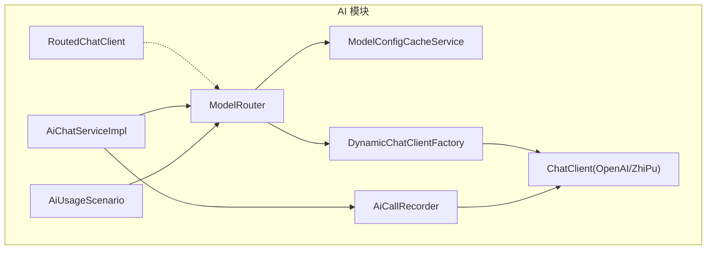
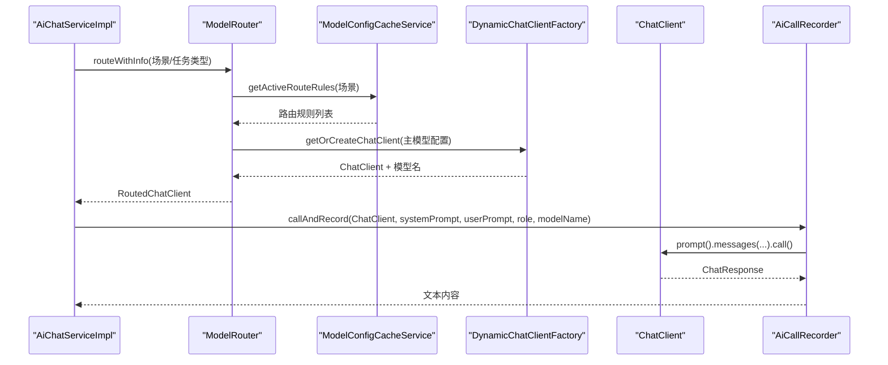
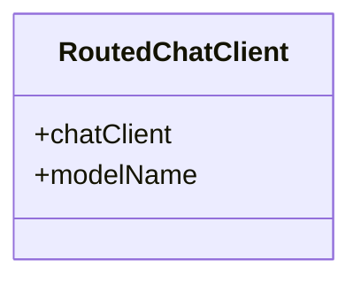
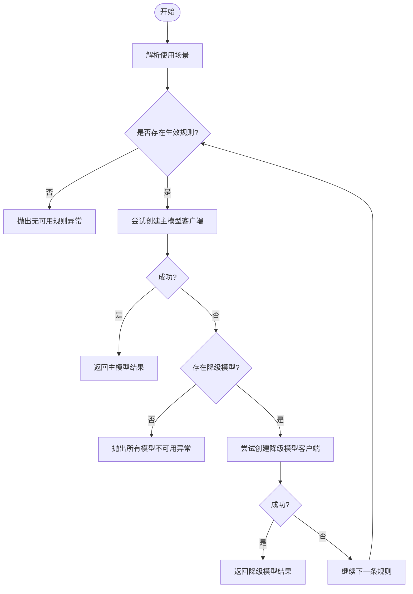
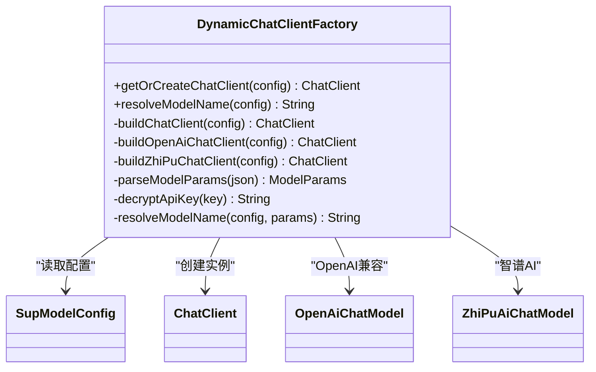
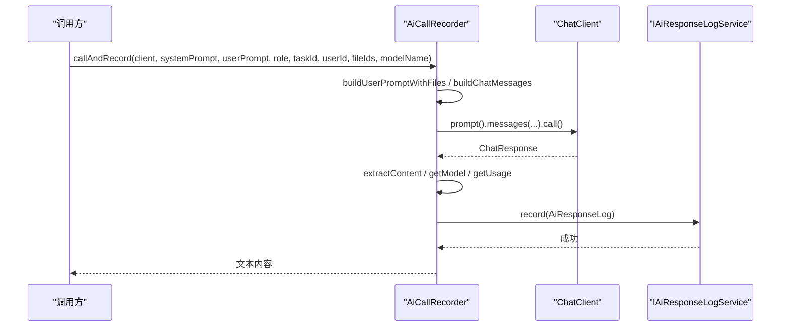
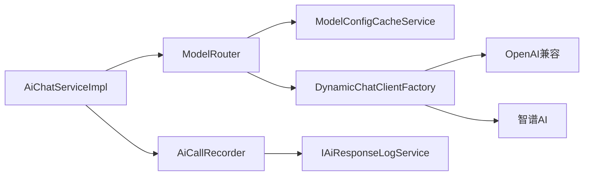
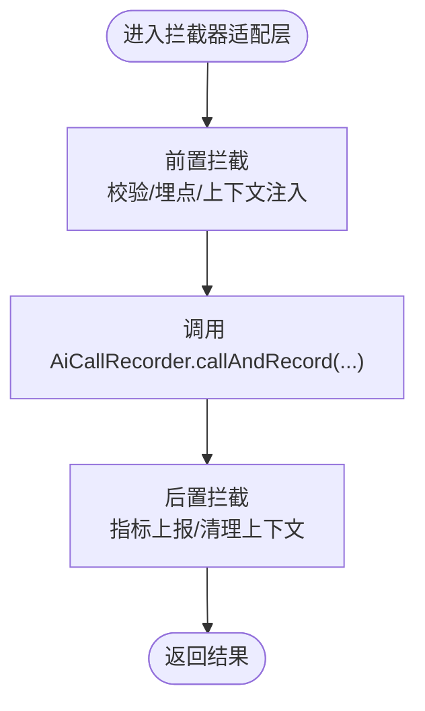

# 路由聊天客户端封装

<cite>
**本文引用的文件**   
- [RoutedChatClient.java](file://ele-ai-tender-system/ele-ai-tender-ai/src/main/java/com/jy/eleaitender/ai/processor/model/RoutedChatClient.java)
- [ModelRouter.java](file://ele-ai-tender-system/ele-ai-tender-ai/src/main/java/com/jy/eleaitender/ai/processor/model/ModelRouter.java)
- [DynamicChatClientFactory.java](file://ele-ai-tender-system/ele-ai-tender-ai/src/main/java/com/jy/eleaitender/ai/processor/model/DynamicChatClientFactory.java)
- [AiCallRecorder.java](file://ele-ai-tender-system/ele-ai-tender-ai/src/main/java/com/jy/eleaitender/ai/processor/recorder/AiCallRecorder.java)
- [AiChatServiceImpl.java](file://ele-ai-tender-system/ele-ai-tender-ai/src/main/java/com/jy/eleaitender/ai/service/impl/AiChatServiceImpl.java)
- [ModelConfigCacheService.java](file://ele-ai-tender-system/ele-ai-tender-ai/src/main/java/com/jy/eleaitender/ai/processor/model/ModelConfigCacheService.java)
- [AiUsageScenario.java](file://ele-ai-tender-system/ele-ai-tender-common/src/main/java/com/jy/eleaitender/common/enums/AiUsageScenario.java)
- [ModelRouterTest.java](file://ele-ai-tender-system/ele-ai-tender-ai/src/test/java/com/jy/eleaitender/ai/processor/model/ModelRouterTest.java)
</cite>

## 目录
1. [简介](#简介)
2. [项目结构](#项目结构)
3. [核心组件](#核心组件)
4. [架构总览](#架构总览)
5. [详细组件分析](#详细组件分析)
6. [依赖关系分析](#依赖关系分析)
7. [性能与可观测性](#性能与可观测性)
8. [使用示例与最佳实践](#使用示例与最佳实践)
9. [故障排查指南](#故障排查指南)
10. [结论](#结论)

## 简介
本技术文档围绕“路由聊天客户端封装”展开，聚焦于对 Spring AI ChatClient 的包装与增强。系统通过模型路由器、动态工厂与调用记录器，实现：
- 基于任务类型/使用场景的模型选择与降级策略
- 动态创建并解析模型名称（支持 OpenAI 兼容协议与智谱 AI）
- 统一的调用统计、日志记录与错误处理
- 面向扩展的拦截点与上下文传递机制设计建议

说明：当前仓库未提供基于 AOP 的动态代理或方法拦截实现；本文在“扩展点与自定义拦截器”章节给出在不侵入现有代码的前提下，如何以组合方式实现拦截与追踪的建议方案。

## 项目结构
与“路由聊天客户端封装”直接相关的核心模块位于 AI 服务子模块中，关键类分布如下：
- 模型路由与包装：ModelRouter、RoutedChatClient
- 动态客户端构建：DynamicChatClientFactory
- 调用记录与指标：AiCallRecorder
- 业务入口集成：AiChatServiceImpl
- 配置读取：ModelConfigCacheService
- 场景枚举：AiUsageScenario

图表来源
- [ModelRouter.java:1-105](file://ele-ai-tender-system/ele-ai-tender-ai/src/main/java/com/jy/eleaitender/ai/processor/model/ModelRouter.java#L1-L105)
- [DynamicChatClientFactory.java:1-187](file://ele-ai-tender-system/ele-ai-tender-ai/src/main/java/com/jy/eleaitender/ai/processor/model/DynamicChatClientFactory.java#L1-L187)
- [AiCallRecorder.java:1-206](file://ele-ai-tender-system/ele-ai-tender-ai/src/main/java/com/jy/eleaitender/ai/processor/recorder/AiCallRecorder.java#L1-L206)
- [AiChatServiceImpl.java:177-206](file://ele-ai-tender-system/ele-ai-tender-ai/src/main/java/com/jy/eleaitender/ai/service/impl/AiChatServiceImpl.java#L177-L206)
- [ModelConfigCacheService.java:1-60](file://ele-ai-tender-system/ele-ai-tender-ai/src/main/java/com/jy/eleaitender/ai/processor/model/ModelConfigCacheService.java#L1-L60)
- [AiUsageScenario.java:1-50](file://ele-ai-tender-system/ele-ai-tender-common/src/main/java/com/jy/eleaitender/common/enums/AiUsageScenario.java#L1-L50)

章节来源
- [ModelRouter.java:1-105](file://ele-ai-tender-system/ele-ai-tender-ai/src/main/java/com/jy/eleaitender/ai/processor/model/ModelRouter.java#L1-L105)
- [DynamicChatClientFactory.java:1-187](file://ele-ai-tender-system/ele-ai-tender-ai/src/main/java/com/jy/eleaitender/ai/processor/model/DynamicChatClientFactory.java#L1-L187)
- [AiCallRecorder.java:1-206](file://ele-ai-tender-system/ele-ai-tender-ai/src/main/java/com/jy/eleaitender/ai/processor/recorder/AiCallRecorder.java#L1-L206)
- [AiChatServiceImpl.java:177-206](file://ele-ai-tender-system/ele-ai-tender-ai/src/main/java/com/jy/eleaitender/ai/service/impl/AiChatServiceImpl.java#L177-L206)
- [ModelConfigCacheService.java:1-60](file://ele-ai-tender-system/ele-ai-tender-ai/src/main/java/com/jy/eleaitender/ai/processor/model/ModelConfigCacheService.java#L1-L60)
- [AiUsageScenario.java:1-50](file://ele-ai-tender-system/ele-ai-tender-common/src/main/java/com/jy/eleaitender/common/enums/AiUsageScenario.java#L1-L50)

## 核心组件
- RoutedChatClient：轻量记录对象，承载实际 ChatClient 与其生效的模型名称，便于后续统计与日志记录。
- ModelRouter：根据任务类型或使用场景，从数据库规则中选择主模型与降级模型，构造 RoutedChatClient。
- DynamicChatClientFactory：按供应商类型（OpenAI 兼容/智谱 AI）动态构建 ChatClient，并解析最终模型名。
- AiCallRecorder：统一封装一次调用的消息组装、请求执行、结果提取、Token 用量与结束原因记录。
- AiChatServiceImpl：将路由得到的 ChatClient 与模型名传入记录器，完成对话式调用。
- ModelConfigCacheService：查询生效的路由规则与模型配置。
- AiUsageScenario：定义使用场景及任务类型到场景的映射。

章节来源
- [RoutedChatClient.java:1-6](file://ele-ai-tender-system/ele-ai-tender-ai/src/main/java/com/jy/eleaitender/ai/processor/model/RoutedChatClient.java#L1-L6)
- [ModelRouter.java:1-105](file://ele-ai-tender-system/ele-ai-tender-ai/src/main/java/com/jy/eleaitender/ai/processor/model/ModelRouter.java#L1-L105)
- [DynamicChatClientFactory.java:1-187](file://ele-ai-tender-system/ele-ai-tender-ai/src/main/java/com/jy/eleaitender/ai/processor/model/DynamicChatClientFactory.java#L1-L187)
- [AiCallRecorder.java:1-206](file://ele-ai-tender-system/ele-ai-tender-ai/src/main/java/com/jy/eleaitender/ai/processor/recorder/AiCallRecorder.java#L1-L206)
- [AiChatServiceImpl.java:177-206](file://ele-ai-tender-system/ele-ai-tender-ai/src/main/java/com/jy/eleaitender/ai/service/impl/AiChatServiceImpl.java#L177-L206)
- [ModelConfigCacheService.java:1-60](file://ele-ai-tender-system/ele-ai-tender-ai/src/main/java/com/jy/eleaitender/ai/processor/model/ModelConfigCacheService.java#L1-L60)
- [AiUsageScenario.java:1-50](file://ele-ai-tender-system/ele-ai-tender-common/src/main/java/com/jy/eleaitender/common/enums/AiUsageScenario.java#L1-L50)

## 架构总览
下图展示了从业务侧发起对话到模型返回结果的完整链路，包括模型选择、客户端创建、调用记录与指标收集。

图表来源
- [AiChatServiceImpl.java:177-206](file://ele-ai-tender-system/ele-ai-tender-ai/src/main/java/com/jy/eleaitender/ai/service/impl/AiChatServiceImpl.java#L177-L206)
- [ModelRouter.java:32-85](file://ele-ai-tender-system/ele-ai-tender-ai/src/main/java/com/jy/eleaitender/ai/processor/model/ModelRouter.java#L32-L85)
- [ModelConfigCacheService.java:34-58](file://ele-ai-tender-system/ele-ai-tender-ai/src/main/java/com/jy/eleaitender/ai/processor/model/ModelConfigCacheService.java#L34-L58)
- [DynamicChatClientFactory.java:38-89](file://ele-ai-tender-system/ele-ai-tender-ai/src/main/java/com/jy/eleaitender/ai/processor/model/DynamicChatClientFactory.java#L38-L89)
- [AiCallRecorder.java:47-62](file://ele-ai-tender-system/ele-ai-tender-ai/src/main/java/com/jy/eleaitender/ai/processor/recorder/AiCallRecorder.java#L47-L62)

## 详细组件分析

### 组件一：RoutedChatClient（路由结果载体）
- 职责：封装 ChatClient 与其生效的模型名称，供上层进行统计与记录。
- 设计要点：使用 record 类型，不可变且简洁，避免额外状态污染。

图表来源
- [RoutedChatClient.java:1-6](file://ele-ai-tender-system/ele-ai-tender-ai/src/main/java/com/jy/eleaitender/ai/processor/model/RoutedChatClient.java#L1-L6)

章节来源
- [RoutedChatClient.java:1-6](file://ele-ai-tender-system/ele-ai-tender-ai/src/main/java/com/jy/eleaitender/ai/processor/model/RoutedChatClient.java#L1-L6)

### 组件二：ModelRouter（模型路由器）
- 职责：依据任务类型/使用场景选择主模型与降级模型，构造 RoutedChatClient。
- 关键点：
  - 场景解析：AiUsageScenario.resolveScenario(taskType)
  - 规则获取：ModelConfigCacheService.getActiveRouteRules(scenario)
  - 失败路径：无规则或所有模型不可用时抛出异常
  - 指定模型：routeModel(modelId) 用于强制指定模型

图表来源
- [ModelRouter.java:32-85](file://ele-ai-tender-system/ele-ai-tender-ai/src/main/java/com/jy/eleaitender/ai/processor/model/ModelRouter.java#L32-L85)
- [ModelConfigCacheService.java:34-58](file://ele-ai-tender-system/ele-ai-tender-ai/src/main/java/com/jy/eleaitender/ai/processor/model/ModelConfigCacheService.java#L34-L58)
- [AiUsageScenario.java:33-48](file://ele-ai-tender-system/ele-ai-tender-common/src/main/java/com/jy/eleaitender/common/enums/AiUsageScenario.java#L33-L48)

章节来源
- [ModelRouter.java:1-105](file://ele-ai-tender-system/ele-ai-tender-ai/src/main/java/com/jy/eleaitender/ai/processor/model/ModelRouter.java#L1-L105)
- [ModelConfigCacheService.java:1-60](file://ele-ai-tender-system/ele-ai-tender-ai/src/main/java/com/jy/eleaitender/ai/processor/model/ModelConfigCacheService.java#L1-L60)
- [AiUsageScenario.java:1-50](file://ele-ai-tender-system/ele-ai-tender-common/src/main/java/com/jy/eleaitender/common/enums/AiUsageScenario.java#L1-L50)
- [ModelRouterTest.java:22-81](file://ele-ai-tender-system/ele-ai-tender-ai/src/test/java/com/jy/eleaitender/ai/processor/model/ModelRouterTest.java#L22-L81)

### 组件三：DynamicChatClientFactory（动态客户端工厂）
- 职责：根据 SupModelConfig 动态创建 ChatClient，并解析最终模型名。
- 能力：
  - 支持 OpenAI 兼容协议与智谱 AI 两种供应商
  - 支持 temperature、maxTokens、topP 等参数解析
  - 支持 modelParams 覆盖显式 model 字段
  - 不缓存 ChatClient，保证配置变更实时生效

图表来源
- [DynamicChatClientFactory.java:38-187](file://ele-ai-tender-system/ele-ai-tender-ai/src/main/java/com/jy/eleaitender/ai/processor/model/DynamicChatClientFactory.java#L38-L187)

章节来源
- [DynamicChatClientFactory.java:1-187](file://ele-ai-tender-system/ele-ai-tender-ai/src/main/java/com/jy/eleaitender/ai/processor/model/DynamicChatClientFactory.java#L1-L187)

### 组件四：AiCallRecorder（调用记录与指标）
- 职责：统一封装一次调用的消息组装、请求执行、结果提取、Token 用量与结束原因记录。
- 关键点：
  - 支持传入 systemPrompt/userPrompt 或直接传入 Message 列表
  - 自动附加文件内容（若提供 fileIds）
  - 记录模型名（优先响应元数据，回退传入 modelName）
  - 记录 finishReason、promptTokens、completionTokens、totalTokens
  - 异常安全：记录过程捕获异常，不影响主流程

图表来源
- [AiCallRecorder.java:47-137](file://ele-ai-tender-system/ele-ai-tender-ai/src/main/java/com/jy/eleaitender/ai/processor/recorder/AiCallRecorder.java#L47-L137)

章节来源
- [AiCallRecorder.java:1-206](file://ele-ai-tender-system/ele-ai-tender-ai/src/main/java/com/jy/eleaitender/ai/processor/recorder/AiCallRecorder.java#L1-L206)

### 组件五：AiChatServiceImpl（业务集成）
- 职责：组装用户提示词，结合路由结果与记录器完成对话式调用。
- 关键点：
  - 使用 RoutedChatClient 中的 chatClient 与 modelName
  - 将角色标记为 CHAT，便于统计区分

章节来源
- [AiChatServiceImpl.java:177-206](file://ele-ai-tender-system/ele-ai-tender-ai/src/main/java/com/jy/eleaitender/ai/service/impl/AiChatServiceImpl.java#L177-L206)

## 依赖关系分析
- 低耦合：ModelRouter 仅依赖配置读取与客户端工厂，不感知具体供应商细节。
- 高内聚：DynamicChatClientFactory 集中处理不同供应商的构建逻辑与参数解析。
- 可观测性：AiCallRecorder 作为横切关注点，统一采集指标与日志。
- 可扩展：新增供应商只需在工厂中扩展分支；新增场景只需在枚举与规则表中维护。

图表来源
- [ModelRouter.java:1-105](file://ele-ai-tender-system/ele-ai-tender-ai/src/main/java/com/jy/eleaitender/ai/processor/model/ModelRouter.java#L1-L105)
- [DynamicChatClientFactory.java:1-187](file://ele-ai-tender-system/ele-ai-tender-ai/src/main/java/com/jy/eleaitender/ai/processor/model/DynamicChatClientFactory.java#L1-L187)
- [AiCallRecorder.java:1-206](file://ele-ai-tender-system/ele-ai-tender-ai/src/main/java/com/jy/eleaitender/ai/processor/recorder/AiCallRecorder.java#L1-L206)
- [AiChatServiceImpl.java:177-206](file://ele-ai-tender-system/ele-ai-tender-ai/src/main/java/com/jy/eleaitender/ai/service/impl/AiChatServiceImpl.java#L177-L206)

章节来源
- [ModelRouter.java:1-105](file://ele-ai-tender-system/ele-ai-tender-ai/src/main/java/com/jy/eleaitender/ai/processor/model/ModelRouter.java#L1-L105)
- [DynamicChatClientFactory.java:1-187](file://ele-ai-tender-system/ele-ai-tender-ai/src/main/java/com/jy/eleaitender/ai/processor/model/DynamicChatClientFactory.java#L1-L187)
- [AiCallRecorder.java:1-206](file://ele-ai-tender-system/ele-ai-tender-ai/src/main/java/com/jy/eleaitender/ai/processor/recorder/AiCallRecorder.java#L1-L206)
- [AiChatServiceImpl.java:177-206](file://ele-ai-tender-system/ele-ai-tender-ai/src/main/java/com/jy/eleaitender/ai/service/impl/AiChatServiceImpl.java#L177-L206)

## 性能与可观测性
- 性能特性
  - 每次调用均新建 ChatClient，避免长连接与配置陈旧问题，代价是创建开销略增。
  - 模型参数解析采用 JSON 解析，开销较小；可通过减少大对象传递优化。
- 可观测性
  - 记录器统一采集 Token 用量、结束原因、模型名、耗时（通过时间戳差计算）。
  - 建议在更高层（如 Controller 或网关）补充端到端耗时与链路 ID，形成全链路追踪。

[本节为通用指导，无需源码引用]

## 使用示例与最佳实践

### 基本用法（对话式）
- 步骤
  - 根据任务类型或场景，调用 ModelRouter.routeWithInfo(...) 获取 RoutedChatClient
  - 使用 AiCallRecorder.callAndRecord(...) 发起调用并记录
  - 返回文本内容给上层

- 参考路径
  - [AiChatServiceImpl.java:177-206](file://ele-ai-tender-system/ele-ai-tender-ai/src/main/java/com/jy/eleaitender/ai/service/impl/AiChatServiceImpl.java#L177-L206)
  - [AiCallRecorder.java:47-62](file://ele-ai-tender-system/ele-ai-tender-ai/src/main/java/com/jy/eleaitender/ai/processor/recorder/AiCallRecorder.java#L47-L62)

### 指定模型调用
- 当需要固定模型时，使用 ModelRouter.routeModelWithInfo(modelId)
- 适用于灰度发布、A/B 测试或特定任务强绑定模型

- 参考路径
  - [ModelRouter.java:75-85](file://ele-ai-tender-system/ele-ai-tender-ai/src/main/java/com/jy/eleaitender/ai/processor/model/ModelRouter.java#L75-L85)

### 最佳实践
- 场景与规则
  - 在数据库中维护多套路由规则，合理设置优先级与降级模型
  - 保持模型配置 isActive=1 且未逻辑删除
- 参数与模型名
  - 通过 modelParams 覆盖 model 字段，确保 resolveModelName 返回期望值
- 错误处理
  - 捕获 AiUnavailableException，提供友好提示与降级策略
- 日志与追踪
  - 利用记录器输出的模型名、Token 用量与结束原因进行成本与质量分析
  - 在更上层注入链路 ID，关联多次调用

[本节为通用指导，无需源码引用]

## 故障排查指南
- 常见异常
  - 无可用路由规则：检查场景编码与规则是否启用
  - 所有模型不可用：检查模型配置 isActive 与逻辑删除状态
  - 指定模型不可用：确认 modelId 有效且未被停用
- 定位手段
  - 查看记录器的模型名与 Token 用量，确认实际命中模型
  - 核对 modelParams 是否包含覆盖的 model 字段
  - 检查工厂日志输出（创建客户端时的 endpoint、model、type）

章节来源
- [ModelRouter.java:48-104](file://ele-ai-tender-system/ele-ai-tender-ai/src/main/java/com/jy/eleaitender/ai/processor/model/ModelRouter.java#L48-L104)
- [DynamicChatClientFactory.java:64-124](file://ele-ai-tender-system/ele-ai-tender-ai/src/main/java/com/jy/eleaitender/ai/processor/model/DynamicChatClientFactory.java#L64-L124)
- [AiCallRecorder.java:113-137](file://ele-ai-tender-system/ele-ai-tender-ai/src/main/java/com/jy/eleaitender/ai/processor/recorder/AiCallRecorder.java#L113-L137)

## 结论
该封装以“路由 + 工厂 + 记录器”的组合模式，实现了对 Spring AI ChatClient 的灵活包装与增强：
- 通过场景化路由与降级策略提升可用性
- 通过动态工厂屏蔽多供应商差异
- 通过记录器统一采集指标与日志，支撑运维与成本分析
在当前仓库中未发现基于 AOP 的方法拦截实现；如需拦截与上下文传递，可在现有组合基础上引入轻量级拦截器（见下节建议），以保持最小侵入与高可维护性。

[本节为总结性内容，无需源码引用]

## 附录：扩展点与自定义拦截器（建议方案）

### 目标
- 在不修改现有类的情况下，增加调用前/后拦截、上下文传递（如链路 ID、租户信息）、限流与熔断开关等能力。

### 推荐方案
- 在业务层封装一个“拦截器适配器”，在调用 AiCallRecorder 前后执行自定义逻辑
- 使用 ThreadLocal 或上下文对象传递跨层信息（如 traceId、userId）
- 将拦截器注册为独立 Bean，按需启用

[此图为概念性流程图，不直接映射具体源码，故不提供图表来源]

### 上下文传递机制（建议）
- 使用线程局部变量保存链路 ID、租户 ID、用户信息等
- 在拦截器前置阶段注入，后置阶段清理，避免泄漏
- 在记录器中可选择性写入这些字段，便于审计与分析

### 自定义拦截器接口（建议）
- 定义统一接口：beforeInvoke(context)、afterInvoke(context, result)、onError(context, error)
- 提供默认空实现，便于按需覆盖
- 通过配置开关控制是否启用

[本节为概念性设计与建议，无需源码引用]