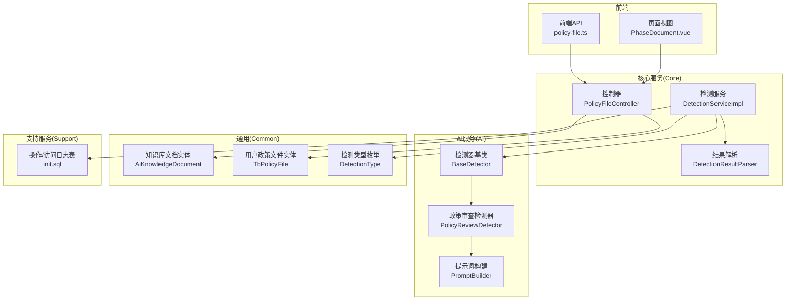
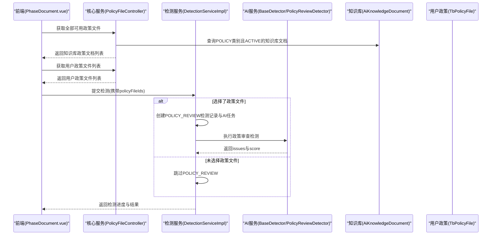
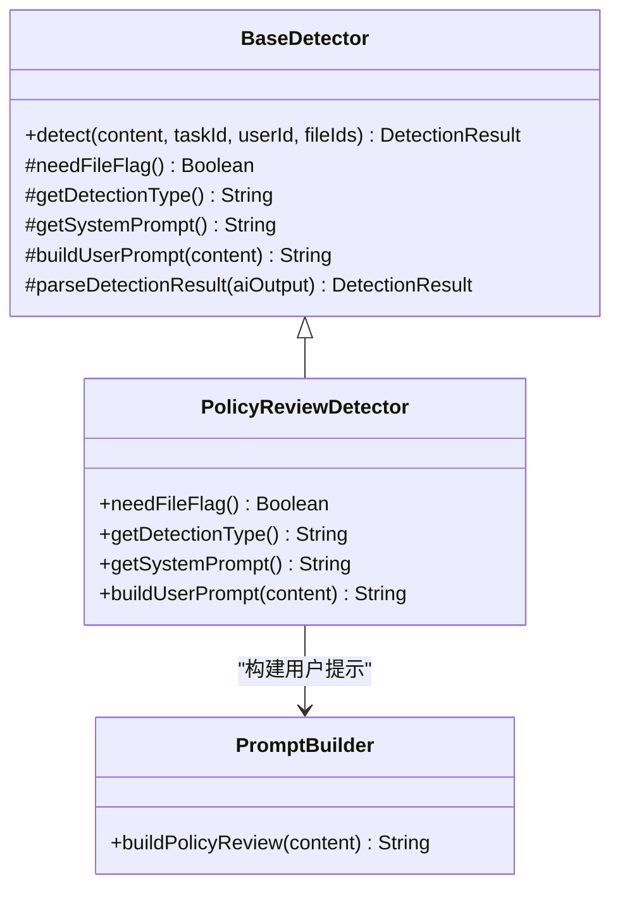
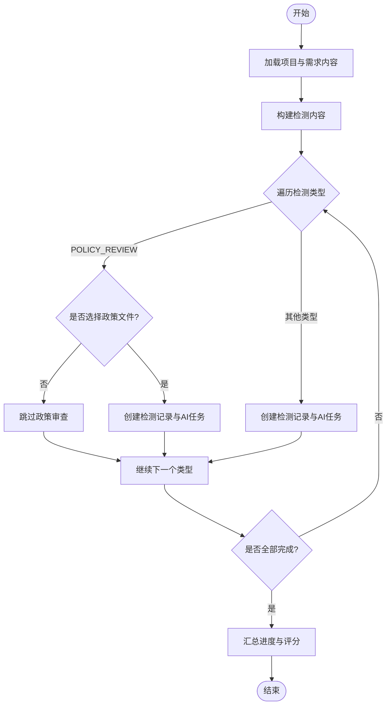
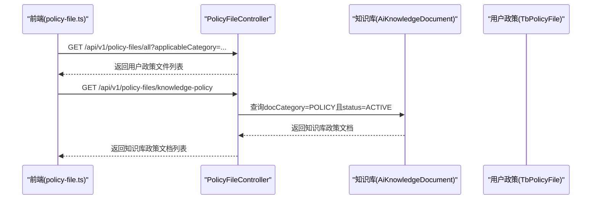
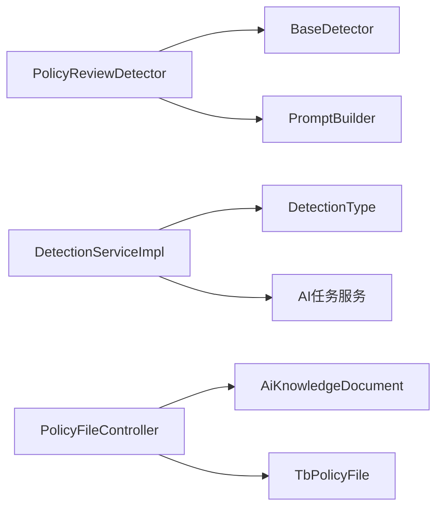
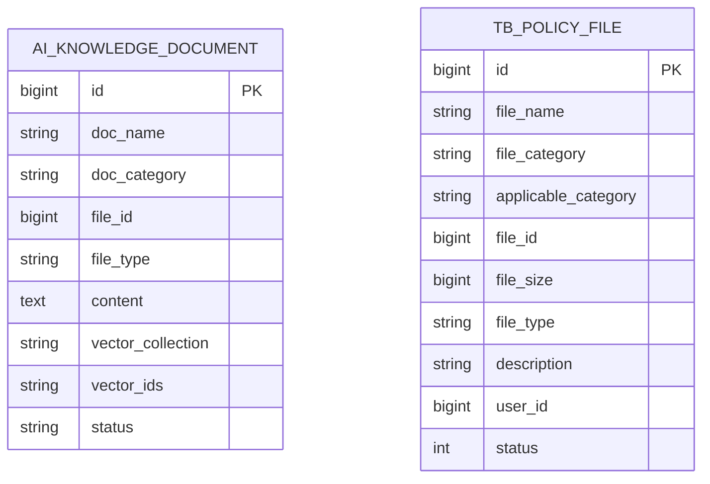

# 政策审查检测器

<cite>
**本文引用的文件**   
- [PolicyReviewDetector.java](file://ele-ai-tender-system/ele-ai-tender-ai/src/main/java/com/jy/eleaitender/ai/processor/checker/PolicyReviewDetector.java)
- [BaseDetector.java](file://ele-ai-tender-system/ele-ai-tender-ai/src/main/java/com/jy/eleaitender/ai/processor/checker/BaseDetector.java)
- [PromptBuilder.java](file://ele-ai-tender-system/ele-ai-tender-ai/src/main/java/com/jy/eleaitender/ai/processor/prompt/PromptBuilder.java)
- [DetectionServiceImpl.java](file://ele-ai-tender-system/ele-ai-tender-core/src/main/java/com/jy/eleaitender/core/service/impl/DetectionServiceImpl.java)
- [PolicyFileController.java](file://ele-ai-tender-system/ele-ai-tender-core/src/main/java/com/jy/eleaitender/core/controller/PolicyFileController.java)
- [AiKnowledgeDocument.java](file://ele-ai-tender-system/ele-ai-tender-common/src/main/java/com/jy/eleaitender/common/entity/ai/AiKnowledgeDocument.java)
- [TbPolicyFile.java](file://ele-ai-tender-system/ele-ai-tender-common/src/main/java/com/jy/eleaitender/common/entity/core/TbPolicyFile.java)
- [DetectionType.java](file://ele-ai-tender-system/ele-ai-tender-common/src/main/java/com/jy/eleaitender/common/enums/DetectionType.java)
- [DetectionResultParser.java](file://ele-ai-tender-system/ele-ai-tender-core/src/main/java/com/jy/eleaitender/core/util/DetectionResultParser.java)
- [policy-file.ts](file://ele-ai-tender-frontend/src/api/policy-file.ts)
- [PhaseDocument.vue](file://ele-ai-tender-frontend/src/views/project/phases/PhaseDocument.vue)
- [policy-file.ts（类型）](file://ele-ai-tender-frontend/src/types/policy-file.ts)
- [init.sql（支持库）](file://ele-ai-tender-system/ele-ai-tender-support/sql/init.sql)
</cite>

## 目录
1. [引言](#引言)
2. [项目结构](#项目结构)
3. [核心组件](#核心组件)
4. [架构总览](#架构总览)
5. [详细组件分析](#详细组件分析)
6. [依赖关系分析](#依赖关系分析)
7. [性能与可扩展性](#性能与可扩展性)
8. [故障排查指南](#故障排查指南)
9. [结论](#结论)
10. [附录](#附录)

## 引言
本技术文档围绕“政策审查检测器”展开，系统性阐述政策法规知识库的构建、条款匹配与合规性判断逻辑、政策文件解析处理与版本管理、智能分析与预警机制、配置管理与规则引擎、审计日志与企业级特性，以及政策库维护、规则定制与审查报告生成等实用能力。目标是帮助开发者与业务人员快速理解并高效使用该系统。

## 项目结构
系统采用前后端分离与多模块微服务化组织：
- 前端（编制中心）：提供政策文件选择、检测提交、结果展示与交互。
- 核心服务（Core）：编排检测流程、管理检测记录、聚合结果、对接AI任务。
- AI服务（AI）：实现具体检测器（含政策审查）、模型路由、提示词构建与结果解析。
- 通用层（Common）：实体、枚举、DTO、工具类、安全与日志等公共能力。
- 支持服务（Support）：系统级元数据、操作日志、访问日志、消息通知等。

图表来源
- [PolicyFileController.java:1-112](file://ele-ai-tender-system/ele-ai-tender-core/src/main/java/com/jy/eleaitender/core/controller/PolicyFileController.java#L1-L112)
- [DetectionServiceImpl.java:1-200](file://ele-ai-tender-system/ele-ai-tender-core/src/main/java/com/jy/eleaitender/core/service/impl/DetectionServiceImpl.java#L1-L200)
- [PolicyReviewDetector.java:1-38](file://ele-ai-tender-system/ele-ai-tender-ai/src/main/java/com/jy/eleaitender/ai/processor/checker/PolicyReviewDetector.java#L1-L38)
- [BaseDetector.java:1-113](file://ele-ai-tender-system/ele-ai-tender-ai/src/main/java/com/jy/eleaitender/ai/processor/checker/BaseDetector.java#L1-L113)
- [PromptBuilder.java:139-172](file://ele-ai-tender-system/ele-ai-tender-ai/src/main/java/com/jy/eleaitender/ai/processor/prompt/PromptBuilder.java#L139-L172)
- [AiKnowledgeDocument.java:1-31](file://ele-ai-tender-system/ele-ai-tender-common/src/main/java/com/jy/eleaitender/common/entity/ai/AiKnowledgeDocument.java#L1-L31)
- [TbPolicyFile.java:13-45](file://ele-ai-tender-system/ele-ai-tender-common/src/main/java/com/jy/eleaitender/common/entity/core/TbPolicyFile.java#L13-L45)
- [DetectionType.java:1-30](file://ele-ai-tender-system/ele-ai-tender-common/src/main/java/com/jy/eleaitender/common/enums/DetectionType.java#L1-L30)
- [DetectionResultParser.java:39-64](file://ele-ai-tender-system/ele-ai-tender-core/src/main/java/com/jy/eleaitender/core/util/DetectionResultParser.java#L39-L64)
- [policy-file.ts:1-42](file://ele-ai-tender-frontend/src/api/policy-file.ts#L1-L42)
- [PhaseDocument.vue:324-357](file://ele-ai-tender-frontend/src/views/project/phases/PhaseDocument.vue#L324-L357)
- [init.sql（支持库）:213-238](file://ele-ai-tender-system/ele-ai-tender-support/sql/init.sql#L213-L238)

章节来源
- [PolicyFileController.java:1-112](file://ele-ai-tender-system/ele-ai-tender-core/src/main/java/com/jy/eleaitender/core/controller/PolicyFileController.java#L1-L112)
- [DetectionServiceImpl.java:1-200](file://ele-ai-tender-system/ele-ai-tender-core/src/main/java/com/jy/eleaitender/core/service/impl/DetectionServiceImpl.java#L1-L200)
- [PolicyReviewDetector.java:1-38](file://ele-ai-tender-system/ele-ai-tender-ai/src/main/java/com/jy/eleaitender/ai/processor/checker/PolicyReviewDetector.java#L1-L38)
- [BaseDetector.java:1-113](file://ele-ai-tender-system/ele-ai-tender-ai/src/main/java/com/jy/eleaitender/ai/processor/checker/BaseDetector.java#L1-L113)
- [PromptBuilder.java:139-172](file://ele-ai-tender-system/ele-ai-tender-ai/src/main/java/com/jy/eleaitender/ai/processor/prompt/PromptBuilder.java#L139-L172)
- [AiKnowledgeDocument.java:1-31](file://ele-ai-tender-system/ele-ai-tender-common/src/main/java/com/jy/eleaitender/common/entity/ai/AiKnowledgeDocument.java#L1-L31)
- [TbPolicyFile.java:13-45](file://ele-ai-tender-system/ele-ai-tender-common/src/main/java/com/jy/eleaitender/common/entity/core/TbPolicyFile.java#L13-L45)
- [DetectionType.java:1-30](file://ele-ai-tender-system/ele-ai-tender-common/src/main/java/com/jy/eleaitender/common/enums/DetectionType.java#L1-L30)
- [DetectionResultParser.java:39-64](file://ele-ai-tender-system/ele-ai-tender-core/src/main/java/com/jy/eleaitender/core/util/DetectionResultParser.java#L39-L64)
- [policy-file.ts:1-42](file://ele-ai-tender-frontend/src/api/policy-file.ts#L1-L42)
- [PhaseDocument.vue:324-357](file://ele-ai-tender-frontend/src/views/project/phases/PhaseDocument.vue#L324-L357)
- [init.sql（支持库）:213-238](file://ele-ai-tender-system/ele-ai-tender-support/sql/init.sql#L213-L238)

## 核心组件
- 政策审查检测器（PolicyReviewDetector）：继承检测器基类，声明需要文件上下文，绑定“政策文件审查”检测类型，组装系统提示与用户提示，驱动AI完成合规性检查。
- 检测器基类（BaseDetector）：封装模型路由、调用记录、异常兜底与结果解析；子类仅需实现策略相关方法。
- 提示词构建（PromptBuilder）：统一构造检测相关的用户提示，包括政策审查专用模板。
- 检测服务（DetectionServiceImpl）：编排敏感词、错别字、格式规范、政策审查四类检测；当未选择政策文件时跳过政策审查；创建检测记录与AI任务；汇总进度与评分。
- 政策文件控制器（PolicyFileController）：提供用户政策文件的增删改查、启用禁用、全部可用列表，以及从知识库中拉取政策类文档的能力。
- 结果解析（DetectionResultParser）：将AI返回的JSON结果解析为问题清单与分数，供前端展示与后续处理。
- 实体与枚举：知识库文档（AiKnowledgeDocument）、用户政策文件（TbPolicyFile）、检测类型（DetectionType）。

章节来源
- [PolicyReviewDetector.java:1-38](file://ele-ai-tender-system/ele-ai-tender-ai/src/main/java/com/jy/eleaitender/ai/processor/checker/PolicyReviewDetector.java#L1-L38)
- [BaseDetector.java:1-113](file://ele-ai-tender-system/ele-ai-tender-ai/src/main/java/com/jy/eleaitender/ai/processor/checker/BaseDetector.java#L1-L113)
- [PromptBuilder.java:139-172](file://ele-ai-tender-system/ele-ai-tender-ai/src/main/java/com/jy/eleaitender/ai/processor/prompt/PromptBuilder.java#L139-L172)
- [DetectionServiceImpl.java:1-200](file://ele-ai-tender-system/ele-ai-tender-core/src/main/java/com/jy/eleaitender/core/service/impl/DetectionServiceImpl.java#L1-L200)
- [PolicyFileController.java:1-112](file://ele-ai-tender-system/ele-ai-tender-core/src/main/java/com/jy/eleaitender/core/controller/PolicyFileController.java#L1-L112)
- [DetectionResultParser.java:39-64](file://ele-ai-tender-system/ele-ai-tender-core/src/main/java/com/jy/eleaitender/core/util/DetectionResultParser.java#L39-L64)
- [AiKnowledgeDocument.java:1-31](file://ele-ai-tender-system/ele-ai-tender-common/src/main/java/com/jy/eleaitender/common/entity/ai/AiKnowledgeDocument.java#L1-L31)
- [TbPolicyFile.java:13-45](file://ele-ai-tender-system/ele-ai-tender-common/src/main/java/com/jy/eleaitender/common/entity/core/TbPolicyFile.java#L13-L45)
- [DetectionType.java:1-30](file://ele-ai-tender-system/ele-ai-tender-common/src/main/java/com/jy/eleaitender/common/enums/DetectionType.java#L1-L30)

## 架构总览
端到端流程概览：
- 用户在编制中心选择政策文件（平台+用户），进入“智能检测”阶段。
- 核心服务根据是否选择政策文件决定是否创建“政策文件审查”任务。
- AI服务通过检测器基类进行模型路由与调用，返回结构化检测结果。
- 核心服务汇总各检测项结果，计算总体状态与问题清单，供前端渲染。

图表来源
- [PhaseDocument.vue:324-357](file://ele-ai-tender-frontend/src/views/project/phases/PhaseDocument.vue#L324-L357)
- [PolicyFileController.java:81-111](file://ele-ai-tender-system/ele-ai-tender-core/src/main/java/com/jy/eleaitender/core/controller/PolicyFileController.java#L81-L111)
- [DetectionServiceImpl.java:86-143](file://ele-ai-tender-system/ele-ai-tender-core/src/main/java/com/jy/eleaitender/core/service/impl/DetectionServiceImpl.java#L86-L143)
- [BaseDetector.java:47-66](file://ele-ai-tender-system/ele-ai-tender-ai/src/main/java/com/jy/eleaitender/ai/processor/checker/BaseDetector.java#L47-L66)
- [PolicyReviewDetector.java:18-36](file://ele-ai-tender-system/ele-ai-tender-ai/src/main/java/com/jy/eleaitender/ai/processor/checker/PolicyReviewDetector.java#L18-L36)
- [AiKnowledgeDocument.java:13-30](file://ele-ai-tender-system/ele-ai-tender-common/src/main/java/com/jy/eleaitender/common/entity/ai/AiKnowledgeDocument.java#L13-L30)
- [TbPolicyFile.java:13-45](file://ele-ai-tender-system/ele-ai-tender-common/src/main/java/com/jy/eleaitender/common/entity/core/TbPolicyFile.java#L13-L45)

## 详细组件分析

### 政策审查检测器（PolicyReviewDetector）
- 职责：定义“政策文件审查”检测器的行为，声明需要文件上下文，绑定检测类型，组装提示词。
- 关键行为：
  - needFileFlag() 返回true，表示该检测需要关联文件ID。
  - getDetectionType() 返回 POLICY_REVIEW。
  - getSystemPrompt()/buildUserPrompt() 分别返回系统提示与用户提示模板。
- 扩展点：如需调整审查维度或输出结构，可在提示词模板与结果解析处协同变更。

图表来源
- [BaseDetector.java:1-113](file://ele-ai-tender-system/ele-ai-tender-ai/src/main/java/com/jy/eleaitender/ai/processor/checker/BaseDetector.java#L1-L113)
- [PolicyReviewDetector.java:1-38](file://ele-ai-tender-system/ele-ai-tender-ai/src/main/java/com/jy/eleaitender/ai/processor/checker/PolicyReviewDetector.java#L1-L38)
- [PromptBuilder.java:139-172](file://ele-ai-tender-system/ele-ai-tender-ai/src/main/java/com/jy/eleaitender/ai/processor/prompt/PromptBuilder.java#L139-L172)

章节来源
- [PolicyReviewDetector.java:1-38](file://ele-ai-tender-system/ele-ai-tender-ai/src/main/java/com/jy/eleaitender/ai/processor/checker/PolicyReviewDetector.java#L1-L38)
- [BaseDetector.java:1-113](file://ele-ai-tender-system/ele-ai-tender-ai/src/main/java/com/jy/eleaitender/ai/processor/checker/BaseDetector.java#L1-L113)
- [PromptBuilder.java:139-172](file://ele-ai-tender-system/ele-ai-tender-ai/src/main/java/com/jy/eleaitender/ai/processor/prompt/PromptBuilder.java#L139-L172)

### 检测编排与合规性判断（DetectionServiceImpl）
- 编排四类检测：敏感词、错别字、格式规范、政策文件审查。
- 当未选择政策文件时，自动跳过“政策文件审查”，避免无效AI调用。
- 为每个检测类型创建检测记录与AI任务，记录内容快照与关联政策文件ID。
- 汇总进度：统计问题数、分数、整体状态（PENDING/DETECTING/COMPLETED/FAILED/AI_UNAVAILABLE）。

图表来源
- [DetectionServiceImpl.java:86-143](file://ele-ai-tender-system/ele-ai-tender-core/src/main/java/com/jy/eleaitender/core/service/impl/DetectionServiceImpl.java#L86-L143)
- [DetectionServiceImpl.java:146-200](file://ele-ai-tender-system/ele-ai-tender-core/src/main/java/com/jy/eleaitender/core/service/impl/DetectionServiceImpl.java#L146-L200)

章节来源
- [DetectionServiceImpl.java:86-143](file://ele-ai-tender-system/ele-ai-tender-core/src/main/java/com/jy/eleaitender/core/service/impl/DetectionServiceImpl.java#L86-L143)
- [DetectionServiceImpl.java:146-200](file://ele-ai-tender-system/ele-ai-tender-core/src/main/java/com/jy/eleaitender/core/service/impl/DetectionServiceImpl.java#L146-L200)

### 政策文件与知识库管理（PolicyFileController）
- 提供用户政策文件分页查询、新增、删除、启用/禁用、全部可用列表。
- 提供“知识库政策文档”接口，按 docCategory=POLICY 且 status=ACTIVE 过滤，便于在编制中心直接引用。
- 前端通过 policy-file.ts 调用上述接口，并在 PhaseDocument.vue 中合并“平台+用户”政策文件用于检测。

图表来源
- [PolicyFileController.java:81-111](file://ele-ai-tender-system/ele-ai-tender-core/src/main/java/com/jy/eleaitender/core/controller/PolicyFileController.java#L81-L111)
- [policy-file.ts:1-42](file://ele-ai-tender-frontend/src/api/policy-file.ts#L1-L42)
- [PhaseDocument.vue:324-357](file://ele-ai-tender-frontend/src/views/project/phases/PhaseDocument.vue#L324-L357)
- [AiKnowledgeDocument.java:13-30](file://ele-ai-tender-system/ele-ai-tender-common/src/main/java/com/jy/eleaitender/common/entity/ai/AiKnowledgeDocument.java#L13-L30)
- [TbPolicyFile.java:13-45](file://ele-ai-tender-system/ele-ai-tender-common/src/main/java/com/jy/eleaitender/common/entity/core/TbPolicyFile.java#L13-L45)

章节来源
- [PolicyFileController.java:1-112](file://ele-ai-tender-system/ele-ai-tender-core/src/main/java/com/jy/eleaitender/core/controller/PolicyFileController.java#L1-L112)
- [policy-file.ts:1-42](file://ele-ai-tender-frontend/src/api/policy-file.ts#L1-L42)
- [PhaseDocument.vue:324-357](file://ele-ai-tender-frontend/src/views/project/phases/PhaseDocument.vue#L324-L357)
- [AiKnowledgeDocument.java:13-30](file://ele-ai-tender-system/ele-ai-tender-common/src/main/java/com/jy/eleaitender/common/entity/ai/AiKnowledgeDocument.java#L13-L30)
- [TbPolicyFile.java:13-45](file://ele-ai-tender-system/ele-ai-tender-common/src/main/java/com/jy/eleaitender/common/entity/core/TbPolicyFile.java#L13-L45)

### 结果解析与问题清单（DetectionResultParser）
- 从检测记录的result字段解析JSON，提取issues数组与score。
- 将每条issue映射为包含位置、原文、目标文本、描述、建议、严重等级、处理状态等字段的结构化对象。
- 若结果为空或格式异常，返回空列表，保证前端稳定展示。

章节来源
- [DetectionResultParser.java:39-64](file://ele-ai-tender-system/ele-ai-tender-core/src/main/java/com/jy/eleaitender/core/util/DetectionResultParser.java#L39-L64)

### 前端交互与类型定义
- policy-file.ts：封装政策文件CRUD与“全部可用”、“知识库政策文档”接口调用。
- types/policy-file.ts：定义PolicyFileVO、PolicyFileRequest、KnowledgeDocumentPolicyVO等类型。
- PhaseDocument.vue：加载知识库政策文档与用户政策文件，合并选择后推进到“智能检测”阶段，后端自动提交检测并携带policyFileIds。

章节来源
- [policy-file.ts:1-42](file://ele-ai-tender-frontend/src/api/policy-file.ts#L1-L42)
- [policy-file.ts（类型）:1-37](file://ele-ai-tender-frontend/src/types/policy-file.ts#L1-L37)
- [PhaseDocument.vue:324-357](file://ele-ai-tender-frontend/src/views/project/phases/PhaseDocument.vue#L324-L357)

## 依赖关系分析
- 检测器层次：PolicyReviewDetector 继承 BaseDetector，复用模型路由、调用记录与结果解析能力。
- 提示词依赖：PolicyReviewDetector 通过 PromptBuilder 构建用户提示，确保提示模板集中管理。
- 服务编排：DetectionServiceImpl 依赖检测类型枚举、AI任务服务、文件服务客户端、消息助手与版本服务。
- 数据模型：AiKnowledgeDocument 与 TbPolicyFile 分别承载知识库与用户政策文件信息，被控制器与前端共同消费。

图表来源
- [PolicyReviewDetector.java:1-38](file://ele-ai-tender-system/ele-ai-tender-ai/src/main/java/com/jy/eleaitender/ai/processor/checker/PolicyReviewDetector.java#L1-L38)
- [BaseDetector.java:1-113](file://ele-ai-tender-system/ele-ai-tender-ai/src/main/java/com/jy/eleaitender/ai/processor/checker/BaseDetector.java#L1-L113)
- [PromptBuilder.java:139-172](file://ele-ai-tender-system/ele-ai-tender-ai/src/main/java/com/jy/eleaitender/ai/processor/prompt/PromptBuilder.java#L139-L172)
- [DetectionServiceImpl.java:1-200](file://ele-ai-tender-system/ele-ai-tender-core/src/main/java/com/jy/eleaitender/core/service/impl/DetectionServiceImpl.java#L1-L200)
- [PolicyFileController.java:1-112](file://ele-ai-tender-system/ele-ai-tender-core/src/main/java/com/jy/eleaitender/core/controller/PolicyFileController.java#L1-L112)
- [AiKnowledgeDocument.java:13-30](file://ele-ai-tender-system/ele-ai-tender-common/src/main/java/com/jy/eleaitender/common/entity/ai/AiKnowledgeDocument.java#L13-L30)
- [TbPolicyFile.java:13-45](file://ele-ai-tender-system/ele-ai-tender-common/src/main/java/com/jy/eleaitender/common/entity/core/TbPolicyFile.java#L13-L45)
- [DetectionType.java:1-30](file://ele-ai-tender-system/ele-ai-tender-common/src/main/java/com/jy/eleaitender/common/enums/DetectionType.java#L1-L30)

章节来源
- [PolicyReviewDetector.java:1-38](file://ele-ai-tender-system/ele-ai-tender-ai/src/main/java/com/jy/eleaitender/ai/processor/checker/PolicyReviewDetector.java#L1-L38)
- [BaseDetector.java:1-113](file://ele-ai-tender-system/ele-ai-tender-ai/src/main/java/com/jy/eleaitender/ai/processor/checker/BaseDetector.java#L1-L113)
- [PromptBuilder.java:139-172](file://ele-ai-tender-system/ele-ai-tender-ai/src/main/java/com/jy/eleaitender/ai/processor/prompt/PromptBuilder.java#L139-L172)
- [DetectionServiceImpl.java:1-200](file://ele-ai-tender-system/ele-ai-tender-core/src/main/java/com/jy/eleaitender/core/service/impl/DetectionServiceImpl.java#L1-L200)
- [PolicyFileController.java:1-112](file://ele-ai-tender-system/ele-ai-tender-core/src/main/java/com/jy/eleaitender/core/controller/PolicyFileController.java#L1-L112)
- [AiKnowledgeDocument.java:13-30](file://ele-ai-tender-system/ele-ai-tender-common/src/main/java/com/jy/eleaitender/common/entity/ai/AiKnowledgeDocument.java#L13-L30)
- [TbPolicyFile.java:13-45](file://ele-ai-tender-system/ele-ai-tender-common/src/main/java/com/jy/eleaitender/common/entity/core/TbPolicyFile.java#L13-L45)
- [DetectionType.java:1-30](file://ele-ai-tender-system/ele-ai-tender-common/src/main/java/com/jy/eleaitender/common/enums/DetectionType.java#L1-L30)

## 性能与可扩展性
- 并行检测：四类检测独立创建任务，可并行执行，缩短整体耗时。
- 条件跳过：未选择政策文件时跳过政策审查，减少不必要的AI调用。
- 结果缓存：建议在高频读取场景对“全部可用政策文件”与“知识库政策文档”做短期缓存，降低数据库压力。
- 可扩展检测器：新增检测类型只需实现检测器并注册至编排流程，保持高内聚低耦合。

[本节为通用指导，不直接分析具体文件]

## 故障排查指南
- 政策审查未触发：确认前端是否正确传递policyFileIds；后端在未选择政策文件时会跳过该检测。
- 结果解析失败：检查AI返回JSON是否符合预期结构；DetectionResultParser会容错返回空列表。
- 知识库文档不可用：确认知识库文档docCategory=POLICY且status=ACTIVE；否则不会出现在“知识库政策文档”列表中。
- 审计与访问日志：可通过支持服务的操作日志与访问日志表定位问题。

章节来源
- [DetectionServiceImpl.java:86-143](file://ele-ai-tender-system/ele-ai-tender-core/src/main/java/com/jy/eleaitender/core/service/impl/DetectionServiceImpl.java#L86-L143)
- [DetectionResultParser.java:39-64](file://ele-ai-tender-system/ele-ai-tender-core/src/main/java/com/jy/eleaitender/core/util/DetectionResultParser.java#L39-L64)
- [PolicyFileController.java:81-111](file://ele-ai-tender-system/ele-ai-tender-core/src/main/java/com/jy/eleaitender/core/controller/PolicyFileController.java#L81-L111)
- [init.sql（支持库）:213-238](file://ele-ai-tender-system/ele-ai-tender-support/sql/init.sql#L213-L238)

## 结论
政策审查检测器以“检测器基类+提示词模板+结果解析”为核心，结合“知识库+用户政策文件”双源数据，实现了灵活、可扩展的政策合规性检查。通过服务编排与条件跳过策略，系统在保障准确性的同时兼顾了性能与稳定性。配合完善的审计日志与前端交互，形成完整的企业级政策审查解决方案。

[本节为总结性内容，不直接分析具体文件]

## 附录

### 数据模型概览

图表来源
- [AiKnowledgeDocument.java:13-30](file://ele-ai-tender-system/ele-ai-tender-common/src/main/java/com/jy/eleaitender/common/entity/ai/AiKnowledgeDocument.java#L13-L30)
- [TbPolicyFile.java:13-45](file://ele-ai-tender-system/ele-ai-tender-common/src/main/java/com/jy/eleaitender/common/entity/core/TbPolicyFile.java#L13-L45)

### 前端API与类型参考
- policy-file.ts：提供分页查询、详情、创建、删除、状态设置、全部可用、知识库政策文档等接口。
- types/policy-file.ts：定义PolicyFileVO、PolicyFileRequest、KnowledgeDocumentPolicyVO等数据结构。

章节来源
- [policy-file.ts:1-42](file://ele-ai-tender-frontend/src/api/policy-file.ts#L1-L42)
- [policy-file.ts（类型）:1-37](file://ele-ai-tender-frontend/src/types/policy-file.ts#L1-L37)