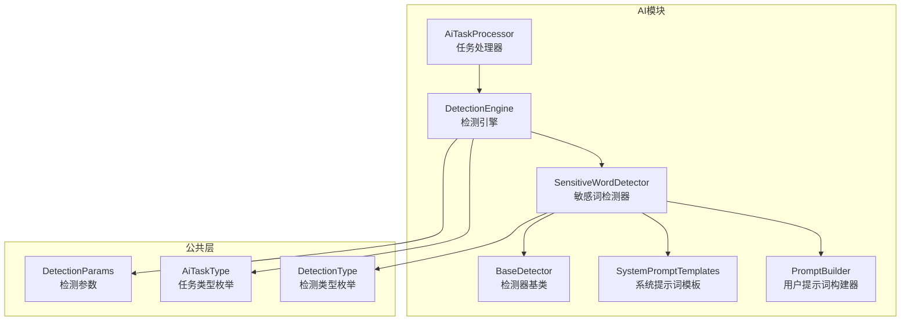
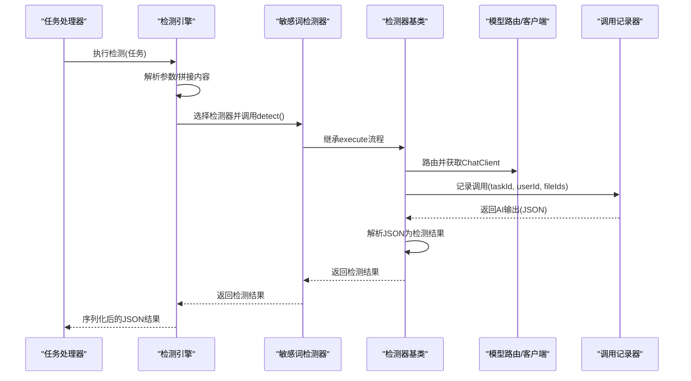
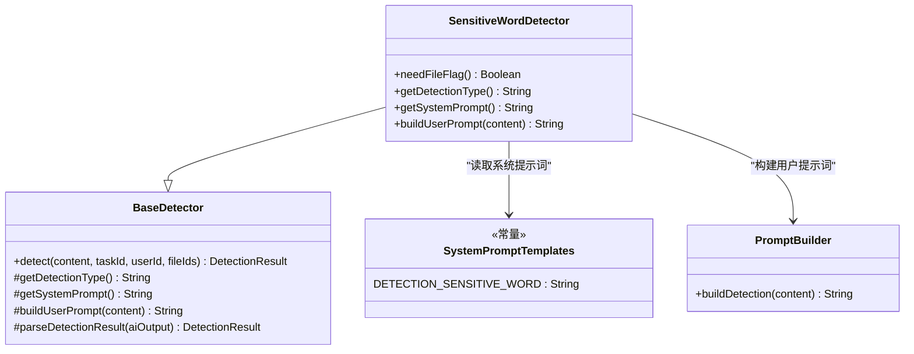
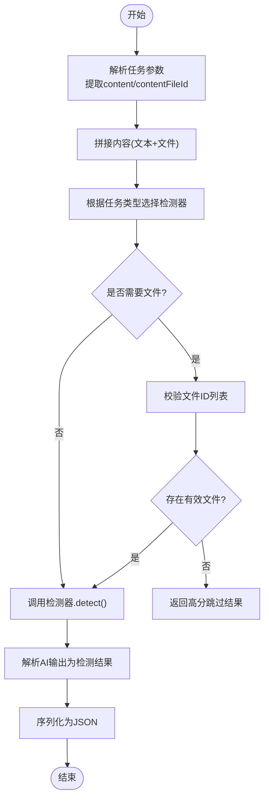
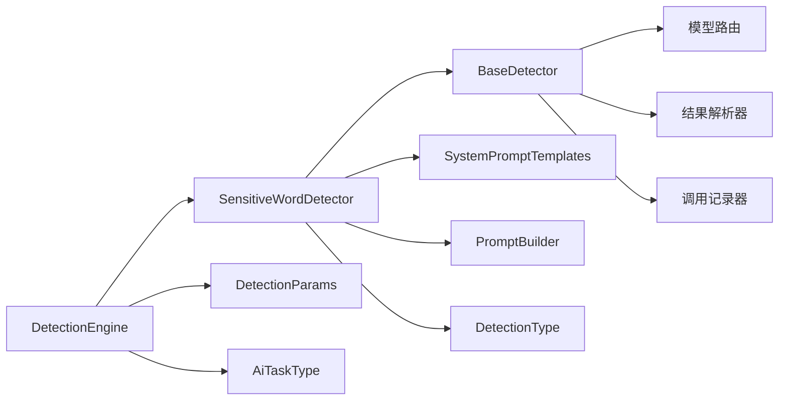

# 敏感词检测器

<cite>
**本文引用的文件**   
- [SensitiveWordDetector.java](file://ele-ai-tender-system/ele-ai-tender-ai/src/main/java/com/jy/eleaitender/ai/processor/checker/SensitiveWordDetector.java)
- [BaseDetector.java](file://ele-ai-tender-system/ele-ai-tender-ai/src/main/java/com/jy/eleaitender/ai/processor/checker/BaseDetector.java)
- [DetectionEngine.java](file://ele-ai-tender-system/ele-ai-tender-ai/src/main/java/com/jy/eleaitender/ai/processor/checker/DetectionEngine.java)
- [SystemPromptTemplates.java](file://ele-ai-tender-system/ele-ai-tender-ai/src/main/java/com/jy/eleaitender/ai/processor/prompt/SystemPromptTemplates.java)
- [PromptBuilder.java](file://ele-ai-tender-system/ele-ai-tender-ai/src/main/java/com/jy/eleaitender/ai/processor/prompt/PromptBuilder.java)
- [AiTaskProcessor.java](file://ele-ai-tender-system/ele-ai-tender-ai/src/main/java/com/jy/eleaitender/ai/processor/AiTaskProcessor.java)
- [DetectionParams.java](file://ele-ai-tender-system/ele-ai-tender-common/src/main/java/com/jy/eleaitender/common/dto/ai/DetectionParams.java)
- [AiTaskType.java](file://ele-ai-tender-system/ele-ai-tender-common/src/main/java/com/jy/eleaitender/common/enums/AiTaskType.java)
- [DetectionType.java](file://ele-ai-tender-system/ele-ai-tender-common/src/main/java/com/jy/eleaitender/common/enums/DetectionType.java)
</cite>

## 目录
1. [简介](#简介)
2. [项目结构](#项目结构)
3. [核心组件](#核心组件)
4. [架构总览](#架构总览)
5. [详细组件分析](#详细组件分析)
6. [依赖关系分析](#依赖关系分析)
7. [性能与并发优化](#性能与并发优化)
8. [配置与运维](#配置与运维)
9. [故障排查指南](#故障排查指南)
10. [结论](#结论)

## 简介
本技术文档聚焦“敏感词检测器”的实现与使用，覆盖其工作机制、提示词编排、结果解析、任务调度集成、以及可扩展的扩展点。当前实现采用大模型驱动的语义检测方式：通过系统提示词定义检测范围与评分规则，用户提示词注入待检测内容，由统一模型路由与调用记录组件完成AI交互，最终将结构化结果（问题列表与评分）返回给上层服务。

## 项目结构
敏感词检测相关代码位于 AI 模块的检测处理器子包中，围绕“引擎-检测器-提示词-参数/枚举”分层组织：
- 检测引擎：根据任务类型分发到具体检测器
- 检测器基类：封装模型调用、结果解析、错误处理等通用逻辑
- 敏感词检测器：实现敏感词检测的具体策略
- 提示词模板与构建器：集中管理 System/User Prompt
- 任务处理器：在任务执行阶段触发检测引擎
- 公共DTO与枚举：定义检测参数与任务类型



图表来源
- [DetectionEngine.java:53-95](file://ele-ai-tender-system/ele-ai-tender-ai/src/main/java/com/jy/eleaitender/ai/processor/checker/DetectionEngine.java#L53-L95)
- [BaseDetector.java:47-66](file://ele-ai-tender-system/ele-ai-tender-ai/src/main/java/com/jy/eleaitender/ai/processor/checker/BaseDetector.java#L47-L66)
- [SensitiveWordDetector.java:14-36](file://ele-ai-tender-system/ele-ai-tender-ai/src/main/java/com/jy/eleaitender/ai/processor/checker/SensitiveWordDetector.java#L14-L36)
- [SystemPromptTemplates.java:347-374](file://ele-ai-tender-system/ele-ai-tender-ai/src/main/java/com/jy/eleaitender/ai/processor/prompt/SystemPromptTemplates.java#L347-L374)
- [PromptBuilder.java:140-143](file://ele-ai-tender-system/ele-ai-tender-ai/src/main/java/com/jy/eleaitender/ai/processor/prompt/PromptBuilder.java#L140-L143)
- [AiTaskProcessor.java:181-188](file://ele-ai-tender-system/ele-ai-tender-ai/src/main/java/com/jy/eleaitender/ai/processor/AiTaskProcessor.java#L181-L188)
- [DetectionParams.java:5](file://ele-ai-tender-system/ele-ai-tender-common/src/main/java/com/jy/eleaitender/common/dto/ai/DetectionParams.java#L5)
- [AiTaskType.java:20](file://ele-ai-tender-system/ele-ai-tender-common/src/main/java/com/jy/eleaitender/common/enums/AiTaskType.java#L20)
- [DetectionType.java:12](file://ele-ai-tender-system/ele-ai-tender-common/src/main/java/com/jy/eleaitender/common/enums/DetectionType.java#L12)

章节来源
- [DetectionEngine.java:53-95](file://ele-ai-tender-system/ele-ai-tender-ai/src/main/java/com/jy/eleaitender/ai/processor/checker/DetectionEngine.java#L53-L95)
- [AiTaskProcessor.java:181-188](file://ele-ai-tender-system/ele-ai-tender-ai/src/main/java/com/jy/eleaitender/ai/processor/AiTaskProcessor.java#L181-L188)

## 核心组件
- 检测引擎 DetectionEngine
  - 负责从任务中提取内容与可选文件内容，按任务类型选择对应检测器并执行检测，最后序列化为统一JSON输出。
- 检测器基类 BaseDetector
  - 提供统一的检测流程：组装System/User提示词、路由模型、记录调用、解析AI返回的JSON为检测结果对象。
- 敏感词检测器 SensitiveWordDetector
  - 指定检测类型为“敏感词”，绑定对应的系统提示词与用户提示词构建方法。
- 提示词模板 SystemPromptTemplates
  - 集中维护各类检测的系统提示词，包括敏感词检测的判定范围与评分规则。
- 提示词构建器 PromptBuilder
  - 统一构建检测类的用户提示词，避免模板变量冲突。
- 任务处理器 AiTaskProcessor
  - 在任务执行分支中将“敏感词检测”任务路由至检测引擎。
- 公共DTO与枚举
  - DetectionParams：检测任务参数载体（含文本内容与可选文件ID）。
  - AiTaskType：任务类型枚举，包含 DETECTION_SENSITIVE_WORD。
  - DetectionType：检测类型枚举，包含 SENSITIVE_WORD。

章节来源
- [DetectionEngine.java:53-95](file://ele-ai-tender-system/ele-ai-tender-ai/src/main/java/com/jy/eleaitender/ai/processor/checker/DetectionEngine.java#L53-L95)
- [BaseDetector.java:47-66](file://ele-ai-tender-system/ele-ai-tender-ai/src/main/java/com/jy/eleaitender/ai/processor/checker/BaseDetector.java#L47-L66)
- [SensitiveWordDetector.java:14-36](file://ele-ai-tender-system/ele-ai-tender-ai/src/main/java/com/jy/eleaitender/ai/processor/checker/SensitiveWordDetector.java#L14-L36)
- [SystemPromptTemplates.java:347-374](file://ele-ai-tender-system/ele-ai-tender-ai/src/main/java/com/jy/eleaitender/ai/processor/prompt/SystemPromptTemplates.java#L347-L374)
- [PromptBuilder.java:140-143](file://ele-ai-tender-system/ele-ai-tender-ai/src/main/java/com/jy/eleaitender/ai/processor/prompt/PromptBuilder.java#L140-L143)
- [AiTaskProcessor.java:181-188](file://ele-ai-tender-system/ele-ai-tender-ai/src/main/java/com/jy/eleaitender/ai/processor/AiTaskProcessor.java#L181-L188)
- [DetectionParams.java:5](file://ele-ai-tender-system/ele-ai-tender-common/src/main/java/com/jy/eleaitender/common/dto/ai/DetectionParams.java#L5)
- [AiTaskType.java:20](file://ele-ai-tender-system/ele-ai-tender-common/src/main/java/com/jy/eleaitender/common/enums/AiTaskType.java#L20)
- [DetectionType.java:12](file://ele-ai-tender-system/ele-ai-tender-common/src/main/java/com/jy/eleaitender/common/enums/DetectionType.java#L12)

## 架构总览
敏感词检测的整体流程如下：
- 任务入口：任务处理器识别 DETECTION_SENSITIVE_WORD 分支，调用检测引擎
- 内容准备：从任务参数提取文本内容与可选文件内容，拼接为完整输入
- 检测器选择：根据任务类型选择 SensitiveWordDetector
- 模型调用：基类统一进行模型路由与调用记录
- 结果解析：从AI输出中提取JSON，转换为检测结果对象（issues与score）
- 返回结果：序列化后返回给上层



图表来源
- [AiTaskProcessor.java:181-188](file://ele-ai-tender-system/ele-ai-tender-ai/src/main/java/com/jy/eleaitender/ai/processor/AiTaskProcessor.java#L181-L188)
- [DetectionEngine.java:53-95](file://ele-ai-tender-system/ele-ai-tender-ai/src/main/java/com/jy/eleaitender/ai/processor/checker/DetectionEngine.java#L53-L95)
- [BaseDetector.java:47-66](file://ele-ai-tender-system/ele-ai-tender-ai/src/main/java/com/jy/eleaitender/ai/processor/checker/BaseDetector.java#L47-L66)

## 详细组件分析

### 敏感词检测器（SensitiveWordDetector）
- 职责
  - 声明检测类型为“敏感词”
  - 绑定系统提示词模板（定义检测范围与评分规则）
  - 构建用户提示词（注入待检测内容）
- 关键行为
  - needFileFlag 返回 false，表示不需要额外政策文件参与
  - getDetectionType 返回 SENSITIVE_WORD
  - getSystemPrompt 返回 DETECTION_SENSITIVE_WORD 模板
  - buildUserPrompt 使用 PromptBuilder.buildDetection 构造用户提示词



图表来源
- [SensitiveWordDetector.java:14-36](file://ele-ai-tender-system/ele-ai-tender-ai/src/main/java/com/jy/eleaitender/ai/processor/checker/SensitiveWordDetector.java#L14-L36)
- [BaseDetector.java:47-66](file://ele-ai-tender-system/ele-ai-tender-ai/src/main/java/com/jy/eleaitender/ai/processor/checker/BaseDetector.java#L47-L66)
- [SystemPromptTemplates.java:347-374](file://ele-ai-tender-system/ele-ai-tender-ai/src/main/java/com/jy/eleaitender/ai/processor/prompt/SystemPromptTemplates.java#L347-L374)
- [PromptBuilder.java:140-143](file://ele-ai-tender-system/ele-ai-tender-ai/src/main/java/com/jy/eleaitender/ai/processor/prompt/PromptBuilder.java#L140-L143)

章节来源
- [SensitiveWordDetector.java:14-36](file://ele-ai-tender-system/ele-ai-tender-ai/src/main/java/com/jy/eleaitender/ai/processor/checker/SensitiveWordDetector.java#L14-L36)
- [SystemPromptTemplates.java:347-374](file://ele-ai-tender-system/ele-ai-tender-ai/src/main/java/com/jy/eleaitender/ai/processor/prompt/SystemPromptTemplates.java#L347-L374)
- [PromptBuilder.java:140-143](file://ele-ai-tender-system/ele-ai-tender-ai/src/main/java/com/jy/eleaitender/ai/processor/prompt/PromptBuilder.java#L140-L143)

### 检测引擎（DetectionEngine）
- 职责
  - 从任务参数解析内容（文本或文件内容），拼接为完整输入
  - 根据任务类型选择具体检测器
  - 对需要文件的检测器（如政策审查）做前置校验
  - 调用检测器并序列化结果为JSON
- 关键点
  - 支持 content 与 contentFileId 两种输入源
  - 对未选择政策文件的场景直接返回高分跳过结果
  - 统一日志记录与异常兜底



图表来源
- [DetectionEngine.java:53-95](file://ele-ai-tender-system/ele-ai-tender-ai/src/main/java/com/jy/eleaitender/ai/processor/checker/DetectionEngine.java#L53-L95)

章节来源
- [DetectionEngine.java:53-95](file://ele-ai-tender-system/ele-ai-tender-ai/src/main/java/com/jy/eleaitender/ai/processor/checker/DetectionEngine.java#L53-L95)

### 检测器基类（BaseDetector）
- 职责
  - 统一执行检测流程：组装提示词、路由模型、记录调用、解析结果
  - 定义抽象方法供子类实现：检测类型、系统提示词、用户提示词构建
  - 提供检测结果内部类（issues、score、error）
- 关键点
  - 异常捕获与降级：失败时返回空问题列表与0分，并记录错误信息
  - JSON解析容错：当AI输出非标准JSON时，记录警告并返回默认结果

```mermaid
classDiagram
class BaseDetector {
+detect(content, taskId, userId, fileIds) DetectionResult
#getDetectionType() String
#getSystemPrompt() String
#buildUserPrompt(content) String
#parseDetectionResult(aiOutput) DetectionResult
class DetectionResult {
+issues : List
+score : int
+error : String
}
}
```

图表来源
- [BaseDetector.java:47-66](file://ele-ai-tender-system/ele-ai-tender-ai/src/main/java/com/jy/eleaitender/ai/processor/checker/BaseDetector.java#L47-L66)
- [BaseDetector.java:88-118](file://ele-ai-tender-system/ele-ai-tender-ai/src/main/java/com/jy/eleaitender/ai/processor/checker/BaseDetector.java#L88-L118)
- [BaseDetector.java:124-128](file://ele-ai-tender-system/ele-ai-tender-ai/src/main/java/com/jy/eleaitender/ai/processor/checker/BaseDetector.java#L124-L128)

章节来源
- [BaseDetector.java:47-66](file://ele-ai-tender-system/ele-ai-tender-ai/src/main/java/com/jy/eleaitender/ai/processor/checker/BaseDetector.java#L47-L66)
- [BaseDetector.java:88-118](file://ele-ai-tender-system/ele-ai-tender-ai/src/main/java/com/jy/eleaitender/ai/processor/checker/BaseDetector.java#L88-L118)
- [BaseDetector.java:124-128](file://ele-ai-tender-system/ele-ai-tender-ai/src/main/java/com/jy/eleaitender/ai/processor/checker/BaseDetector.java#L124-L128)

### 提示词体系（SystemPromptTemplates 与 PromptBuilder）
- 系统提示词
  - DETECTION_SENSITIVE_WORD：定义敏感词检测范围（歧视性、限制性、排他性、倾向性）与评分规则（HIGH/MEDIUM/LOW扣分）
- 用户提示词
  - PromptBuilder.buildDetection：将待检测内容注入用户提示词模板
- 设计要点
  - 避免Spring AI PromptTemplate对花括号变量的误解析，优先使用SystemMessage/UserMessage发送完整提示词

章节来源
- [SystemPromptTemplates.java:347-374](file://ele-ai-tender-system/ele-ai-tender-ai/src/main/java/com/jy/eleaitender/ai/processor/prompt/SystemPromptTemplates.java#L347-L374)
- [PromptBuilder.java:140-143](file://ele-ai-tender-system/ele-ai-tender-ai/src/main/java/com/jy/eleaitender/ai/processor/prompt/PromptBuilder.java#L140-L143)

### 任务处理器集成（AiTaskProcessor）
- 在任务执行分支中，将 DETECTION_SENSITIVE_WORD 任务路由至检测引擎
- 与其他检测类型（错别字、政策审查、格式检测）并列处理

章节来源
- [AiTaskProcessor.java:181-188](file://ele-ai-tender-system/ele-ai-tender-ai/src/main/java/com/jy/eleaitender/ai/processor/AiTaskProcessor.java#L181-L188)

## 依赖关系分析
- 组件耦合
  - 检测引擎依赖各检测器实例（通过依赖注入）
  - 敏感词检测器依赖系统提示词模板与用户提示词构建器
  - 基类依赖模型路由、结果解析、调用记录等基础设施
- 外部依赖
  - 模型路由与客户端：用于实际AI调用
  - 调用记录器：记录每次AI调用的上下文与结果
  - Jackson ObjectMapper：序列化/反序列化JSON



图表来源
- [DetectionEngine.java:53-95](file://ele-ai-tender-system/ele-ai-tender-ai/src/main/java/com/jy/eleaitender/ai/processor/checker/DetectionEngine.java#L53-L95)
- [BaseDetector.java:47-66](file://ele-ai-tender-system/ele-ai-tender-ai/src/main/java/com/jy/eleaitender/ai/processor/checker/BaseDetector.java#L47-L66)
- [SensitiveWordDetector.java:14-36](file://ele-ai-tender-system/ele-ai-tender-ai/src/main/java/com/jy/eleaitender/ai/processor/checker/SensitiveWordDetector.java#L14-L36)
- [DetectionParams.java:5](file://ele-ai-tender-system/ele-ai-tender-common/src/main/java/com/jy/eleaitender/common/dto/ai/DetectionParams.java#L5)
- [AiTaskType.java:20](file://ele-ai-tender-system/ele-ai-tender-common/src/main/java/com/jy/eleaitender/common/enums/AiTaskType.java#L20)
- [DetectionType.java:12](file://ele-ai-tender-system/ele-ai-tender-common/src/main/java/com/jy/eleaitender/common/enums/DetectionType.java#L12)

章节来源
- [DetectionEngine.java:53-95](file://ele-ai-tender-system/ele-ai-tender-ai/src/main/java/com/jy/eleaitender/ai/processor/checker/DetectionEngine.java#L53-L95)
- [BaseDetector.java:47-66](file://ele-ai-tender-system/ele-ai-tender-ai/src/main/java/com/jy/eleaitender/ai/processor/checker/BaseDetector.java#L47-L66)
- [SensitiveWordDetector.java:14-36](file://ele-ai-tender-system/ele-ai-tender-ai/src/main/java/com/jy/eleaitender/ai/processor/checker/SensitiveWordDetector.java#L14-L36)

## 性能与并发优化
- 异步任务处理
  - 检测任务通过任务处理器进入异步队列，避免阻塞主线程
- 内容拼接优化
  - 仅在有文本或文件内容时追加，减少无效拼接
- 结果解析容错
  - 解析失败时快速降级，返回空问题与0分，避免长时间等待
- 建议优化方向
  - 对长文本进行分段检测与合并结果
  - 引入缓存机制（如相同内容的检测结果缓存）
  - 调整模型路由与线程池参数以匹配峰值负载

[本节为通用指导，不直接分析具体文件]

## 配置与运维
- 敏感词库管理
  - 当前实现基于大模型的语义理解，敏感词库通过系统提示词中的规则描述体现，无需本地静态词表
- 动态更新与热重载
  - 可通过修改系统提示词模板（DETECTION_SENSITIVE_WORD）实现检测规则的动态调整；建议在配置中心管理并在应用重启或热加载机制生效
- 版本管理
  - 建议为系统提示词增加版本号字段，便于回溯与灰度发布
- 自定义词库添加
  - 可在系统提示词中补充示例与规则说明，增强模型对特定领域词汇的敏感度
- 检测效果调优
  - 调整评分规则（如不同严重级别的扣分权重）
  - 丰富用户提示词上下文（如加入行业术语、常见表述）
  - 结合业务反馈持续迭代提示词

章节来源
- [SystemPromptTemplates.java:347-374](file://ele-ai-tender-system/ele-ai-tender-ai/src/main/java/com/jy/eleaitender/ai/processor/prompt/SystemPromptTemplates.java#L347-L374)

## 故障排查指南
- 常见问题
  - AI输出非标准JSON：基类会记录警告并返回默认结果，检查提示词是否被截断或模型返回异常
  - 未选择政策文件导致跳过：政策审查检测在未选择文件时返回高分跳过，确认任务参数是否正确
  - 检测失败返回空问题与0分：检查模型路由与调用记录，确认网络与鉴权正常
- 定位步骤
  - 查看任务日志中的“开始检测/检测完成”信息
  - 核对任务参数（content/contentFileId）是否齐全
  - 检查系统提示词与用户提示词是否按预期拼接
  - 验证AI调用记录中的模型名称与返回内容

章节来源
- [BaseDetector.java:58-66](file://ele-ai-tender-system/ele-ai-tender-ai/src/main/java/com/jy/eleaitender/ai/processor/checker/BaseDetector.java#L58-L66)
- [BaseDetector.java:111-118](file://ele-ai-tender-system/ele-ai-tender-ai/src/main/java/com/jy/eleaitender/ai/processor/checker/BaseDetector.java#L111-L118)
- [DetectionEngine.java:81-86](file://ele-ai-tender-system/ele-ai-tender-ai/src/main/java/com/jy/eleaitender/ai/processor/checker/DetectionEngine.java#L81-L86)

## 结论
敏感词检测器在当前架构下以大模型为核心，通过系统提示词定义检测范围与评分规则，结合用户提示词注入内容，实现灵活的语义级检测。该方案具备良好的可维护性与可扩展性，后续可通过提示词工程、缓存与分段策略进一步提升性能与准确率。对于需要本地词表与模糊匹配的场景，可在现有框架基础上扩展专用检测器并与统一引擎集成。