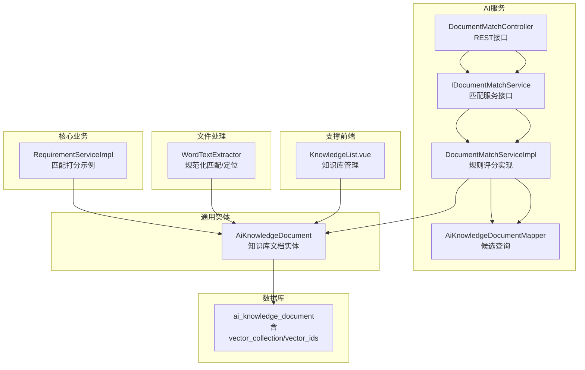
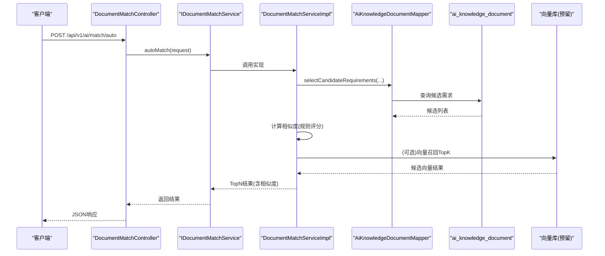
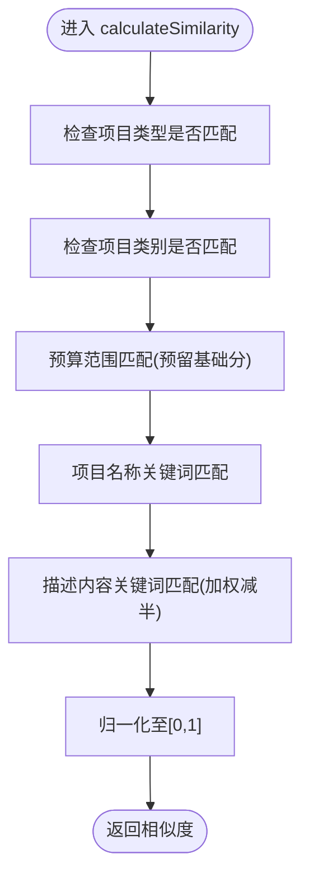
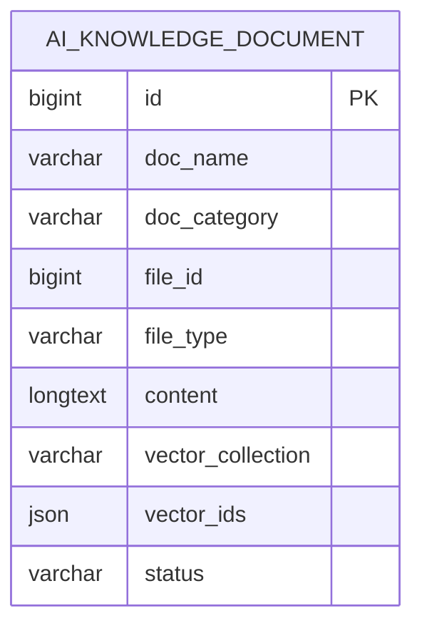
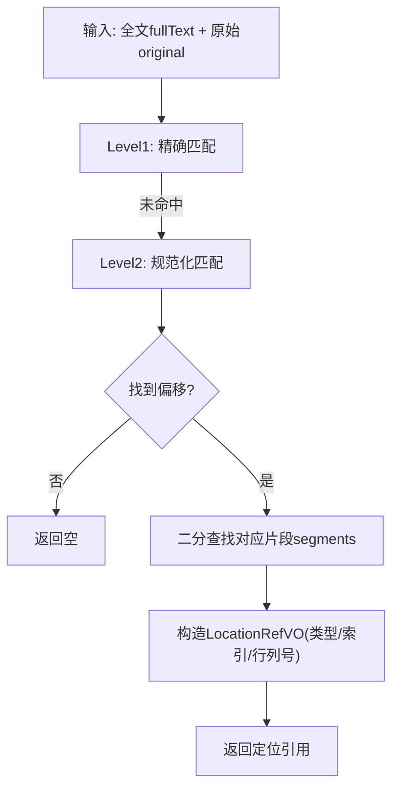
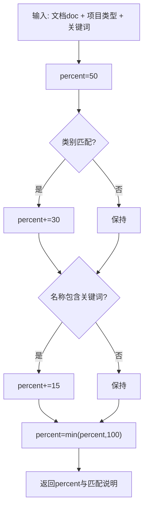
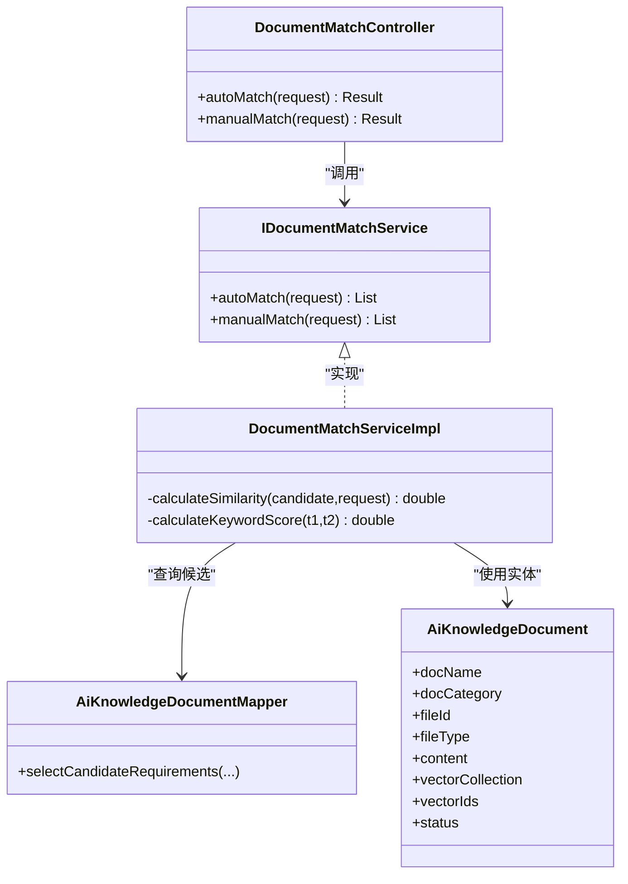

# 文档相似度分析

<cite>
**本文引用的文件**   
- [DocumentMatchController.java](file://ele-ai-tender-system/ele-ai-tender-ai/src/main/java/com/jy/eleaitender/ai/controller/DocumentMatchController.java)
- [IDocumentMatchService.java](file://ele-ai-tender-system/ele-ai-tender-ai/src/main/java/com/jy/eleaitender/ai/service/IDocumentMatchService.java)
- [DocumentMatchServiceImpl.java](file://ele-ai-tender-system/ele-ai-tender-ai/src/main/java/com/jy/eleaitender/ai/service/impl/DocumentMatchServiceImpl.java)
- [AiKnowledgeDocumentMapper.java](file://ele-ai-tender-system/ele-ai-tender-ai/src/main/java/com/jy/eleaitender/ai/mapper/AiKnowledgeDocumentMapper.java)
- [AiKnowledgeDocument.java](file://ele-ai-tender-system/ele-ai-tender-common/src/main/java/com/jy/eleaitender/common/entity/ai/AiKnowledgeDocument.java)
- [init.sql](file://ele-ai-tender-system/ele-ai-tender-ai/sql/init.sql)
- [RequirementServiceImpl.java](file://ele-ai-tender-system/ele-ai-tender-core/src/main/java/com/jy/eleaitender/core/service/impl/RequirementServiceImpl.java)
- [WordTextExtractor.java](file://ele-ai-tender-system/ele-ai-tender-file/src/main/java/com/jy/eleaitender/file/engine/WordTextExtractor.java)
- [KnowledgeList.vue](file://ele-ai-tender-support-frontend/src/views/knowledge/KnowledgeList.vue)
</cite>

## 目录
1. [简介](#简介)
2. [项目结构](#项目结构)
3. [核心组件](#核心组件)
4. [架构总览](#架构总览)
5. [详细组件分析](#详细组件分析)
6. [依赖关系分析](#依赖关系分析)
7. [性能与可扩展性](#性能与可扩展性)
8. [故障排查指南](#故障排查指南)
9. [结论](#结论)
10. [附录：配置与API参考](#附录配置与api参考)

## 简介
本技术文档围绕“文档相似度分析”能力，系统梳理当前仓库中的实现现状、数据模型与接口契约，并在此基础上给出向量相似度计算、文本特征提取、语义匹配算法、分块策略、索引构建、检索优化、阈值与排序、重复度评估、分布式与增量更新、缓存策略以及可视化展示等工程化方案。文档既覆盖现有代码层面的事实描述，也提供面向未来的演进建议，帮助读者快速理解并扩展该功能。

## 项目结构
与文档相似度相关的关键模块与职责如下：
- AI服务层（AI模块）
  - 控制器：暴露文档匹配接口
  - 服务层：实现自动/手动匹配流程与评分逻辑
  - Mapper：查询候选需求/文档
- 通用实体（Common模块）
  - 知识库文档实体：包含向量化字段（集合名、向量ID列表）
- 数据库脚本（AI模块SQL）
  - 知识库文档表定义，含向量集合与向量ID列
- 核心业务（Core模块）
  - 需求服务中已有基于类别与关键词的匹配打分示例
- 文件处理（File模块）
  - Word文本抽取器：支持规范化匹配与定位，可用于相似度定位与高亮
- 支撑前端（Support-Frontend）
  - 知识库管理页面：展示文档状态与向量化标记

图表来源
- [DocumentMatchController.java:1-49](file://ele-ai-tender-system/ele-ai-tender-ai/src/main/java/com/jy/eleaitender/ai/controller/DocumentMatchController.java#L1-L49)
- [IDocumentMatchService.java:1-23](file://ele-ai-tender-system/ele-ai-tender-ai/src/main/java/com/jy/eleaitender/ai/service/IDocumentMatchService.java#L1-L23)
- [DocumentMatchServiceImpl.java:1-115](file://ele-ai-tender-system/ele-ai-tender-ai/src/main/java/com/jy/eleaitender/ai/service/impl/DocumentMatchServiceImpl.java#L1-L115)
- [AiKnowledgeDocumentMapper.java](file://ele-ai-tender-system/ele-ai-tender-ai/src/main/java/com/jy/eleaitender/ai/mapper/AiKnowledgeDocumentMapper.java)
- [AiKnowledgeDocument.java:1-31](file://ele-ai-tender-system/ele-ai-tender-common/src/main/java/com/jy/eleaitender/common/entity/ai/AiKnowledgeDocument.java#L1-L31)
- [init.sql:48-73](file://ele-ai-tender-system/ele-ai-tender-ai/sql/init.sql#L48-L73)
- [RequirementServiceImpl.java:362-396](file://ele-ai-tender-system/ele-ai-tender-core/src/main/java/com/jy/eleaitender/core/service/impl/RequirementServiceImpl.java#L362-L396)
- [WordTextExtractor.java:110-150](file://ele-ai-tender-system/ele-ai-tender-file/src/main/java/com/jy/eleaitender/file/engine/WordTextExtractor.java#L110-L150)
- [KnowledgeList.vue:1-33](file://ele-ai-tender-support-frontend/src/views/knowledge/KnowledgeList.vue#L1-L33)

章节来源
- [DocumentMatchController.java:1-49](file://ele-ai-tender-system/ele-ai-tender-ai/src/main/java/com/jy/eleaitender/ai/controller/DocumentMatchController.java#L1-L49)
- [IDocumentMatchService.java:1-23](file://ele-ai-tender-system/ele-ai-tender-ai/src/main/java/com/jy/eleaitender/ai/service/IDocumentMatchService.java#L1-L23)
- [DocumentMatchServiceImpl.java:1-115](file://ele-ai-tender-system/ele-ai-tender-ai/src/main/java/com/jy/eleaitender/ai/service/impl/DocumentMatchServiceImpl.java#L1-L115)
- [AiKnowledgeDocument.java:1-31](file://ele-ai-tender-system/ele-ai-tender-common/src/main/java/com/jy/eleaitender/common/entity/ai/AiKnowledgeDocument.java#L1-L31)
- [init.sql:48-73](file://ele-ai-tender-system/ele-ai-tender-ai/sql/init.sql#L48-L73)
- [RequirementServiceImpl.java:362-396](file://ele-ai-tender-system/ele-ai-tender-core/src/main/java/com/jy/eleaitender/core/service/impl/RequirementServiceImpl.java#L362-L396)
- [WordTextExtractor.java:110-150](file://ele-ai-tender-system/ele-ai-tender-file/src/main/java/com/jy/eleaitender/file/engine/WordTextExtractor.java#L110-L150)
- [KnowledgeList.vue:1-33](file://ele-ai-tender-support-frontend/src/views/knowledge/KnowledgeList.vue#L1-L33)

## 核心组件
- 文档匹配控制器
  - 提供自动匹配与手动选择匹配的REST接口，统一返回结果封装
- 文档匹配服务接口与实现
  - 自动匹配：按项目类型/类别筛选候选，计算相似度后取Top5
  - 手动匹配：放宽限制，返回更多候选供人工选择
  - 评分维度：项目类型、项目类别、预算范围（预留）、关键词匹配
- 知识库文档实体与表
  - 包含向量集合名称与向量ID列表字段，为后续向量检索预留
- 需求服务中的匹配打分示例
  - 以类别与关键词为基础分+加分的简单打分，可作为相似度基线
- 文本抽取与规范化匹配
  - 在Word文档中通过规范化匹配定位原文位置，便于相似度高亮与溯源

章节来源
- [DocumentMatchController.java:1-49](file://ele-ai-tender-system/ele-ai-tender-ai/src/main/java/com/jy/eleaitender/ai/controller/DocumentMatchController.java#L1-L49)
- [IDocumentMatchService.java:1-23](file://ele-ai-tender-system/ele-ai-tender-ai/src/main/java/com/jy/eleaitender/ai/service/IDocumentMatchService.java#L1-L23)
- [DocumentMatchServiceImpl.java:1-115](file://ele-ai-tender-system/ele-ai-tender-ai/src/main/java/com/jy/eleaitender/ai/service/impl/DocumentMatchServiceImpl.java#L1-L115)
- [AiKnowledgeDocument.java:1-31](file://ele-ai-tender-system/ele-ai-tender-common/src/main/java/com/jy/eleaitender/common/entity/ai/AiKnowledgeDocument.java#L1-L31)
- [RequirementServiceImpl.java:362-396](file://ele-ai-tender-system/ele-ai-tender-core/src/main/java/com/jy/eleaitender/core/service/impl/RequirementServiceImpl.java#L362-L396)
- [WordTextExtractor.java:110-150](file://ele-ai-tender-system/ele-ai-tender-file/src/main/java/com/jy/eleaitender/file/engine/WordTextExtractor.java#L110-L150)

## 架构总览
下图展示了从请求到匹配结果的端到端流程，包括规则评分与未来可接入的向量检索路径。

图表来源
- [DocumentMatchController.java:1-49](file://ele-ai-tender-system/ele-ai-tender-ai/src/main/java/com/jy/eleaitender/ai/controller/DocumentMatchController.java#L1-L49)
- [IDocumentMatchService.java:1-23](file://ele-ai-tender-system/ele-ai-tender-ai/src/main/java/com/jy/eleaitender/ai/service/IDocumentMatchService.java#L1-L23)
- [DocumentMatchServiceImpl.java:1-115](file://ele-ai-tender-system/ele-ai-tender-ai/src/main/java/com/jy/eleaitender/ai/service/impl/DocumentMatchServiceImpl.java#L1-L115)
- [AiKnowledgeDocumentMapper.java](file://ele-ai-tender-system/ele-ai-tender-ai/src/main/java/com/jy/eleaitender/ai/mapper/AiKnowledgeDocumentMapper.java)
- [init.sql:48-73](file://ele-ai-tender-system/ele-ai-tender-ai/sql/init.sql#L48-L73)

## 详细组件分析

### 组件A：文档匹配服务（规则评分）
- 自动匹配
  - 根据项目类型/类别筛选候选，计算相似度后返回Top5
- 手动匹配
  - 放宽限制，返回更多候选项
- 评分维度
  - 项目类型匹配、项目类别匹配、预算范围（预留）、关键词匹配
- 关键词匹配
  - 对输入文本进行切分，统计关键词在目标文本中的命中比例，折算为分数

图表来源
- [DocumentMatchServiceImpl.java:54-113](file://ele-ai-tender-system/ele-ai-tender-ai/src/main/java/com/jy/eleaitender/ai/service/impl/DocumentMatchServiceImpl.java#L54-L113)

章节来源
- [DocumentMatchServiceImpl.java:25-52](file://ele-ai-tender-system/ele-ai-tender-ai/src/main/java/com/jy/eleaitender/ai/service/impl/DocumentMatchServiceImpl.java#L25-L52)
- [DocumentMatchServiceImpl.java:54-113](file://ele-ai-tender-system/ele-ai-tender-ai/src/main/java/com/jy/eleaitender/ai/service/impl/DocumentMatchServiceImpl.java#L54-L113)

### 组件B：知识库文档实体与表（向量化预留）
- 实体字段
  - 文档名称、类别、文件ID、文件类型、纯文本内容、向量集合名称、向量ID列表JSON、状态
- 表结构要点
  - ai_knowledge_document表包含vector_collection与vector_ids字段，用于关联外部向量库
  - 建立类别、状态、文件ID索引，利于检索与过滤

图表来源
- [AiKnowledgeDocument.java:1-31](file://ele-ai-tender-system/ele-ai-tender-common/src/main/java/com/jy/eleaitender/common/entity/ai/AiKnowledgeDocument.java#L1-L31)
- [init.sql:48-73](file://ele-ai-tender-system/ele-ai-tender-ai/sql/init.sql#L48-L73)

章节来源
- [AiKnowledgeDocument.java:1-31](file://ele-ai-tender-system/ele-ai-tender-common/src/main/java/com/jy/eleaitender/common/entity/ai/AiKnowledgeDocument.java#L1-L31)
- [init.sql:48-73](file://ele-ai-tender-system/ele-ai-tender-ai/sql/init.sql#L48-L73)

### 组件C：文本抽取与规范化匹配（定位与高亮）
- 功能要点
  - 在完整文本中进行精确匹配与规范化匹配（去除空白/标点差异）
  - 将匹配偏移映射回结构化片段（段落/表格单元格），生成定位引用
- 适用场景
  - 相似度结果的高亮与溯源；重复度检测时精准定位相似片段

图表来源
- [WordTextExtractor.java:110-150](file://ele-ai-tender-system/ele-ai-tender-file/src/main/java/com/jy/eleaitender/file/engine/WordTextExtractor.java#L110-L150)

章节来源
- [WordTextExtractor.java:110-150](file://ele-ai-tender-system/ele-ai-tender-file/src/main/java/com/jy/eleaitender/file/engine/WordTextExtractor.java#L110-L150)

### 组件D：需求服务中的匹配打分示例
- 设计思路
  - 基础分+类别匹配加分+关键词匹配加分，上限封顶
  - 输出匹配百分比与匹配说明，便于前端展示
- 价值
  - 作为相似度基线，可与向量相似度融合形成混合评分

图表来源
- [RequirementServiceImpl.java:362-396](file://ele-ai-tender-system/ele-ai-tender-core/src/main/java/com/jy/eleaitender/core/service/impl/RequirementServiceImpl.java#L362-L396)

章节来源
- [RequirementServiceImpl.java:362-396](file://ele-ai-tender-system/ele-ai-tender-core/src/main/java/com/jy/eleaitender/core/service/impl/RequirementServiceImpl.java#L362-L396)

### 组件E：前端知识库管理（向量化状态展示）
- 功能要点
  - 列表展示文档名称、大小、向量集合、状态、创建人、时间
  - 操作按钮支持编辑与删除
- 价值
  - 直观呈现文档是否已向量化，辅助运维与排障

章节来源
- [KnowledgeList.vue:1-33](file://ele-ai-tender-support-frontend/src/views/knowledge/KnowledgeList.vue#L1-L33)
- [KnowledgeList.vue:66-95](file://ele-ai-tender-support-frontend/src/views/knowledge/KnowledgeList.vue#L66-L95)

## 依赖关系分析
- 控制器依赖服务接口，服务实现依赖Mapper与实体
- 实体与数据库表强耦合，向量字段为外部向量库集成预留
- 需求服务与文件处理模块分别提供打分与定位能力，均可复用

图表来源
- [DocumentMatchController.java:1-49](file://ele-ai-tender-system/ele-ai-tender-ai/src/main/java/com/jy/eleaitender/ai/controller/DocumentMatchController.java#L1-L49)
- [IDocumentMatchService.java:1-23](file://ele-ai-tender-system/ele-ai-tender-ai/src/main/java/com/jy/eleaitender/ai/service/IDocumentMatchService.java#L1-L23)
- [DocumentMatchServiceImpl.java:1-115](file://ele-ai-tender-system/ele-ai-tender-ai/src/main/java/com/jy/eleaitender/ai/service/impl/DocumentMatchServiceImpl.java#L1-L115)
- [AiKnowledgeDocumentMapper.java](file://ele-ai-tender-system/ele-ai-tender-ai/src/main/java/com/jy/eleaitender/ai/mapper/AiKnowledgeDocumentMapper.java)
- [AiKnowledgeDocument.java:1-31](file://ele-ai-tender-system/ele-ai-tender-common/src/main/java/com/jy/eleaitender/common/entity/ai/AiKnowledgeDocument.java#L1-L31)

章节来源
- [DocumentMatchController.java:1-49](file://ele-ai-tender-system/ele-ai-tender-ai/src/main/java/com/jy/eleaitender/ai/controller/DocumentMatchController.java#L1-L49)
- [IDocumentMatchService.java:1-23](file://ele-ai-tender-system/ele-ai-tender-ai/src/main/java/com/jy/eleaitender/ai/service/IDocumentMatchService.java#L1-L23)
- [DocumentMatchServiceImpl.java:1-115](file://ele-ai-tender-system/ele-ai-tender-ai/src/main/java/com/jy/eleaitender/ai/service/impl/DocumentMatchServiceImpl.java#L1-L115)
- [AiKnowledgeDocument.java:1-31](file://ele-ai-tender-system/ele-ai-tender-common/src/main/java/com/jy/eleaitender/common/entity/ai/AiKnowledgeDocument.java#L1-L31)

## 性能与可扩展性
- 向量相似度计算
  - 建议采用领域微调的中文Embedding模型，结合余弦相似度或内积相似度
  - 召回阶段使用近似最近邻（ANN）索引（如HNSW/IVF-PQ），降低全量扫描开销
- 文本特征提取
  - 预处理：去噪、标准化、术语对齐、停用词过滤
  - 分块策略：按段落/标题层级切分，控制单块长度（例如512-1024 token），保留上下文重叠
- 语义匹配算法
  - 双塔模型：查询与文档分别编码，计算相似度
  - 交叉编码器精排：对召回Top-K进行细粒度重排
- 索引构建与检索优化
  - 离线批量建索引，增量实时写入；冷热分层存储
  - 多路召回：关键词倒排+向量召回+图谱/规则召回，融合排序
- 相似度阈值与结果排序
  - 动态阈值：按业务场景设置最小相似度阈值，低于阈值的候选直接过滤
  - 排序策略：线性组合或学习排序（LR/GBDT）融合规则分与向量分
- 重复度评估
  - 段落级Jaccard/余弦相似度，结合位置信息聚合为文档级重复度
- 大规模分布式方案
  - 任务拆分：按文档/批次并行向量化与索引构建
  - 消息队列：削峰填谷，保证幂等与重试
  - 水平扩展：无状态服务横向扩容，向量库集群化部署
- 缓存策略
  - 热点查询缓存：Redis缓存Top-N结果与常用参数组合
  - 中间结果缓存：Embedding结果缓存，避免重复计算
- 增量更新
  - 变更检测：基于文件版本/时间戳/哈希触发增量向量化
  - 软删除与归档：失效向量标记清理，定期回收

[本节为通用指导，不直接分析具体文件]

## 故障排查指南
- 接口返回空结果
  - 确认控制器已启用服务调用逻辑
  - 检查Mapper查询条件与数据库索引是否生效
- 相似度异常偏高/偏低
  - 核对评分权重与关键词切分逻辑
  - 若引入向量相似度，检查Embedding模型与相似度度量一致性
- 向量化状态不一致
  - 核对vector_collection与vector_ids字段是否与外部向量库一致
  - 前端“已向量化”标签仅做展示，需与后端状态同步
- 定位高亮失败
  - 检查规范化匹配与分段映射是否正确
  - 确认表格/段落索引字段填充完整

章节来源
- [DocumentMatchController.java:30-46](file://ele-ai-tender-system/ele-ai-tender-ai/src/main/java/com/jy/eleaitender/ai/controller/DocumentMatchController.java#L30-L46)
- [DocumentMatchServiceImpl.java:25-52](file://ele-ai-tender-system/ele-ai-tender-ai/src/main/java/com/jy/eleaitender/ai/service/impl/DocumentMatchServiceImpl.java#L25-L52)
- [AiKnowledgeDocument.java:24-27](file://ele-ai-tender-system/ele-ai-tender-common/src/main/java/com/jy/eleaitender/common/entity/ai/AiKnowledgeDocument.java#L24-L27)
- [KnowledgeList.vue:66-95](file://ele-ai-tender-support-frontend/src/views/knowledge/KnowledgeList.vue#L66-L95)
- [WordTextExtractor.java:110-150](file://ele-ai-tender-system/ele-ai-tender-file/src/main/java/com/jy/eleaitender/file/engine/WordTextExtractor.java#L110-L150)

## 结论
当前仓库已具备文档相似度分析的基础骨架：规则评分、候选检索、向量化预留字段与前端展示。下一步建议优先落地向量召回与精排融合、完善分块与索引构建流水线、引入阈值与重复度评估机制，并通过缓存与分布式改造提升吞吐与稳定性。

[本节为总结性内容，不直接分析具体文件]

## 附录：配置与API参考
- API接口
  - 自动匹配历史需求
    - 方法：POST
    - 路径：/api/v1/ai/match/auto
    - 鉴权：需要登录
    - 请求体：MatchRequest
    - 响应：Result<List<MatchResultVO>>
  - 手动选择匹配（返回候选列表）
    - 方法：POST
    - 路径：/api/v1/ai/match/manual
    - 鉴权：需要登录
    - 请求体：MatchRequest
    - 响应：Result<List<MatchResultVO>>
- 关键DTO与实体
  - MatchRequest：包含项目类型、类别、名称、描述等匹配条件
  - MatchResultVO：包含相似度字段，用于排序与展示
  - AiKnowledgeDocument：包含向量集合与向量ID字段，用于向量检索
- 数据库表
  - ai_knowledge_document：包含vector_collection与vector_ids列，用于关联向量库

章节来源
- [DocumentMatchController.java:30-46](file://ele-ai-tender-system/ele-ai-tender-ai/src/main/java/com/jy/eleaitender/ai/controller/DocumentMatchController.java#L30-L46)
- [IDocumentMatchService.java:11-22](file://ele-ai-tender-system/ele-ai-tender-ai/src/main/java/com/jy/eleaitender/ai/service/IDocumentMatchService.java#L11-L22)
- [AiKnowledgeDocument.java:24-27](file://ele-ai-tender-system/ele-ai-tender-common/src/main/java/com/jy/eleaitender/common/entity/ai/AiKnowledgeDocument.java#L24-L27)
- [init.sql:48-73](file://ele-ai-tender-system/ele-ai-tender-ai/sql/init.sql#L48-L73)