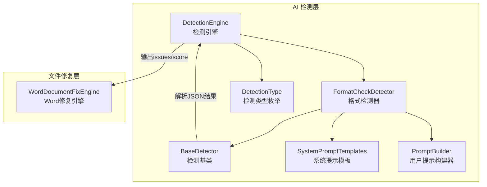
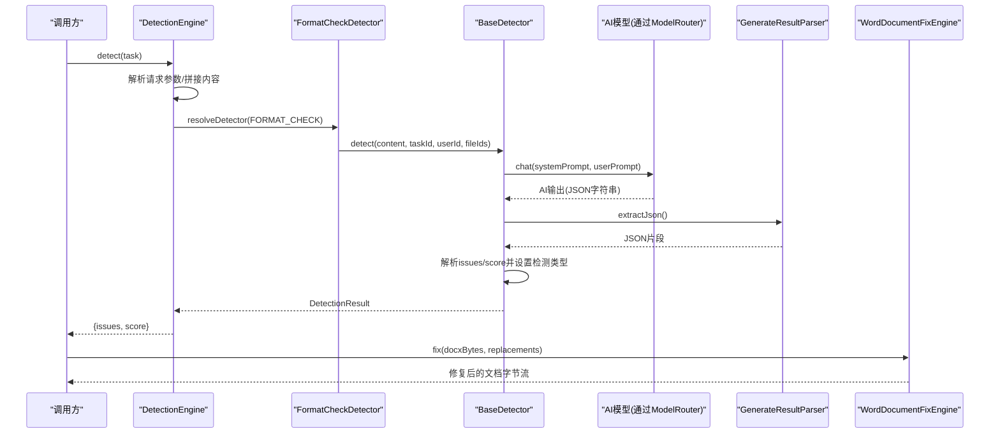
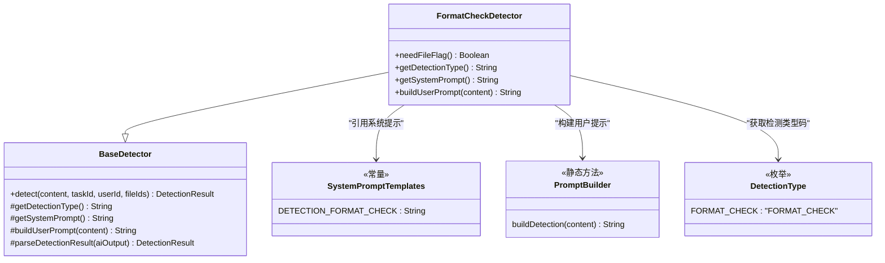
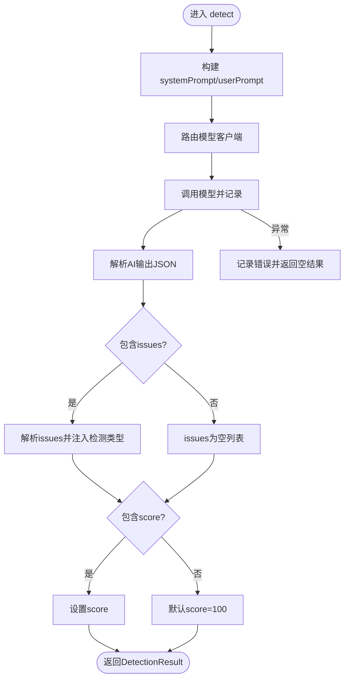
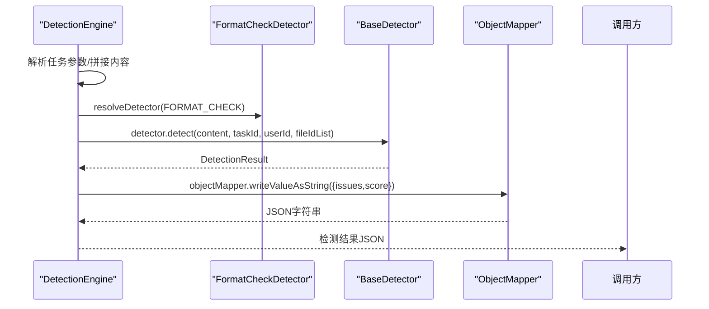
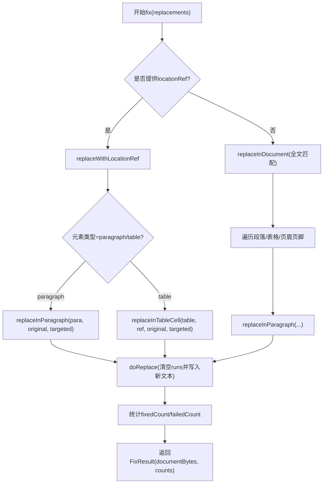
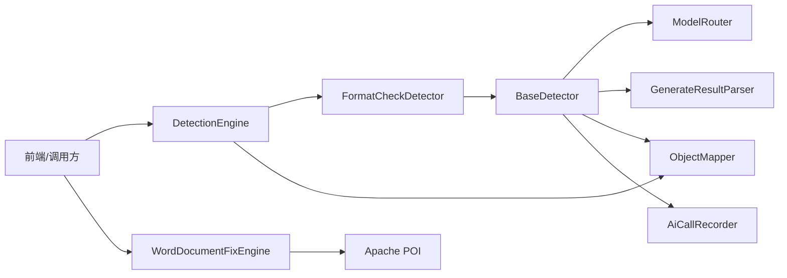

# 格式检查检测器

<cite>
**本文引用的文件**   
- [FormatCheckDetector.java](file://ele-ai-tender-system/ele-ai-tender-ai/src/main/java/com/jy/eleaitender/ai/processor/checker/FormatCheckDetector.java)
- [BaseDetector.java](file://ele-ai-tender-system/ele-ai-tender-ai/src/main/java/com/jy/eleaitender/ai/processor/checker/BaseDetector.java)
- [DetectionEngine.java](file://ele-ai-tender-system/ele-ai-tender-ai/src/main/java/com/jy/eleaitender/ai/processor/checker/DetectionEngine.java)
- [SystemPromptTemplates.java](file://ele-ai-tender-system/ele-ai-tender-ai/src/main/java/com/jy/eleaitender/ai/processor/prompt/SystemPromptTemplates.java)
- [PromptBuilder.java](file://ele-ai-tender-system/ele-ai-tender-ai/src/main/java/com/jy/eleaitender/ai/processor/prompt/PromptBuilder.java)
- [DetectionType.java](file://ele-ai-tender-system/ele-ai-tender-common/src/main/java/com/jy/eleaitender/common/enums/DetectionType.java)
- [WordDocumentFixEngine.java](file://ele-ai-tender-system/ele-ai-tender-file/src/main/java/com/jy/eleaitender/file/engine/WordDocumentFixEngine.java)
</cite>

## 目录
1. [简介](#简介)
2. [项目结构](#项目结构)
3. [核心组件](#核心组件)
4. [架构总览](#架构总览)
5. [详细组件分析](#详细组件分析)
6. [依赖关系分析](#依赖关系分析)
7. [性能考虑](#性能考虑)
8. [故障排查指南](#故障排查指南)
9. [结论](#结论)
10. [附录](#附录)

## 简介
本技术文档聚焦“格式检查检测器”，围绕其实现原理、规则检测逻辑、错误定位算法与修复建议生成机制展开，覆盖以下能力：
- Word 文档结构检查与修复（基于 Apache POI）
- Markdown 语法验证（通过提示词驱动的大模型进行文本级格式校验）
- PDF 格式校验（在系统内以任务编排方式接入，当前仓库未提供具体实现）

同时说明不同文档类型的特殊处理逻辑、兼容性考量、配置项、性能优化策略、常见问题解决方案以及测试与调试技巧。

## 项目结构
与格式检查检测器直接相关的代码主要分布在 AI 处理器模块与文件处理模块中：
- AI 侧负责“检测”流程：组装提示词、路由模型、记录调用、解析结果
- 文件侧负责“修复”流程：对 Word 文档执行精准替换与结构化修复

图表来源
- [DetectionEngine.java:45-125](file://ele-ai-tender-system/ele-ai-tender-ai/src/main/java/com/jy/eleaitender/ai/processor/checker/DetectionEngine.java#L45-L125)
- [FormatCheckDetector.java:1-37](file://ele-ai-tender-system/ele-ai-tender-ai/src/main/java/com/jy/eleaitender/ai/processor/checker/FormatCheckDetector.java#L1-L37)
- [BaseDetector.java:1-130](file://ele-ai-tender-system/ele-ai-tender-ai/src/main/java/com/jy/eleaitender/ai/processor/checker/BaseDetector.java#L1-L130)
- [SystemPromptTemplates.java:440-470](file://ele-ai-tender-system/ele-ai-tender-ai/src/main/java/com/jy/eleaitender/ai/processor/prompt/SystemPromptTemplates.java#L440-L470)
- [PromptBuilder.java:135-151](file://ele-ai-tender-system/ele-ai-tender-ai/src/main/java/com/jy/eleaitender/ai/processor/prompt/PromptBuilder.java#L135-L151)
- [DetectionType.java:1-29](file://ele-ai-tender-system/ele-ai-tender-common/src/main/java/com/jy/eleaitender/common/enums/DetectionType.java#L1-L29)
- [WordDocumentFixEngine.java:1-252](file://ele-ai-tender-system/ele-ai-tender-file/src/main/java/com/jy/eleaitender/file/engine/WordDocumentFixEngine.java#L1-L252)

章节来源
- [DetectionEngine.java:45-125](file://ele-ai-tender-system/ele-ai-tender-ai/src/main/java/com/jy/eleaitender/ai/processor/checker/DetectionEngine.java#L45-L125)
- [FormatCheckDetector.java:1-37](file://ele-ai-tender-system/ele-ai-tender-ai/src/main/java/com/jy/eleaitender/ai/processor/checker/FormatCheckDetector.java#L1-L37)
- [BaseDetector.java:1-130](file://ele-ai-tender-system/ele-ai-tender-ai/src/main/java/com/jy/eleaitender/ai/processor/checker/BaseDetector.java#L1-L130)
- [SystemPromptTemplates.java:440-470](file://ele-ai-tender-system/ele-ai-tender-ai/src/main/java/com/jy/eleaitender/ai/processor/prompt/SystemPromptTemplates.java#L440-L470)
- [PromptBuilder.java:135-151](file://ele-ai-tender-system/ele-ai-tender-ai/src/main/java/com/jy/eleaitender/ai/processor/prompt/PromptBuilder.java#L135-L151)
- [DetectionType.java:1-29](file://ele-ai-tender-system/ele-ai-tender-common/src/main/java/com/jy/eleaitender/common/enums/DetectionType.java#L1-L29)
- [WordDocumentFixEngine.java:1-252](file://ele-ai-tender-system/ele-ai-tender-file/src/main/java/com/jy/eleaitender/file/engine/WordDocumentFixEngine.java#L1-L252)

## 核心组件
- 格式检测器（FormatCheckDetector）
  - 职责：定义格式检测的任务类型、系统提示与用户提示构造逻辑
  - 关键点：不依赖外部文件ID；使用统一检测提示构建器
- 检测基类（BaseDetector）
  - 职责：封装模型路由、调用记录、结果解析与异常兜底
  - 关键点：将大模型返回的 JSON 解析为 issues 列表与评分；自动注入检测类型
- 检测引擎（DetectionEngine）
  - 职责：根据任务类型分发到具体检测器；拼接内容（文本或从文件提取）；序列化检测结果
- 提示模板（SystemPromptTemplates / PromptBuilder）
  - 职责：定义格式检测的系统提示与通用检测用户提示
- Word 修复引擎（WordDocumentFixEngine）
  - 职责：基于 Apache POI 对 Word 文档执行文本查找替换，支持精确定位与规范化匹配

章节来源
- [FormatCheckDetector.java:1-37](file://ele-ai-tender-system/ele-ai-tender-ai/src/main/java/com/jy/eleaitender/ai/processor/checker/FormatCheckDetector.java#L1-L37)
- [BaseDetector.java:1-130](file://ele-ai-tender-system/ele-ai-tender-ai/src/main/java/com/jy/eleaitender/ai/processor/checker/BaseDetector.java#L1-L130)
- [DetectionEngine.java:45-125](file://ele-ai-tender-system/ele-ai-tender-ai/src/main/java/com/jy/eleaitender/ai/processor/checker/DetectionEngine.java#L45-L125)
- [SystemPromptTemplates.java:440-470](file://ele-ai-tender-system/ele-ai-tender-ai/src/main/java/com/jy/eleaitender/ai/processor/prompt/SystemPromptTemplates.java#L440-L470)
- [PromptBuilder.java:135-151](file://ele-ai-tender-system/ele-ai-tender-ai/src/main/java/com/jy/eleaitender/ai/processor/prompt/PromptBuilder.java#L135-L151)
- [WordDocumentFixEngine.java:1-252](file://ele-ai-tender-system/ele-ai-tender-file/src/main/java/com/jy/eleaitender/file/engine/WordDocumentFixEngine.java#L1-L252)

## 架构总览
格式检查检测器的端到端流程如下：
- 输入：任务参数中的文本内容或文件ID（若存在）
- 处理：检测引擎选择格式检测器，构造系统/用户提示，调用大模型
- 输出：标准化 JSON（issues 列表 + score），供前端展示与后续修复

图表来源
- [DetectionEngine.java:45-125](file://ele-ai-tender-system/ele-ai-tender-ai/src/main/java/com/jy/eleaitender/ai/processor/checker/DetectionEngine.java#L45-L125)
- [FormatCheckDetector.java:1-37](file://ele-ai-tender-system/ele-ai-tender-ai/src/main/java/com/jy/eleaitender/ai/processor/checker/FormatCheckDetector.java#L1-L37)
- [BaseDetector.java:1-130](file://ele-ai-tender-system/ele-ai-tender-ai/src/main/java/com/jy/eleaitender/ai/processor/checker/BaseDetector.java#L1-L130)
- [WordDocumentFixEngine.java:1-252](file://ele-ai-tender-system/ele-ai-tender-file/src/main/java/com/jy/eleaitender/file/engine/WordDocumentFixEngine.java#L1-L252)

## 详细组件分析

### 格式检测器（FormatCheckDetector）
- 角色与职责
  - 指定检测类型为 FORMAT_CHECK
  - 使用统一的检测提示构建器生成用户提示
  - 使用系统提示模板定义格式检查范围与输出规范
- 关键行为
  - needFileFlag=false：不依赖外部文件ID列表
  - getSystemPrompt：返回格式检测的系统提示
  - buildUserPrompt：复用通用检测用户提示模板

图表来源
- [FormatCheckDetector.java:1-37](file://ele-ai-tender-system/ele-ai-tender-ai/src/main/java/com/jy/eleaitender/ai/processor/checker/FormatCheckDetector.java#L1-L37)
- [BaseDetector.java:1-130](file://ele-ai-tender-system/ele-ai-tender-ai/src/main/java/com/jy/eleaitender/ai/processor/checker/BaseDetector.java#L1-L130)
- [SystemPromptTemplates.java:440-470](file://ele-ai-tender-system/ele-ai-tender-ai/src/main/java/com/jy/eleaitender/ai/processor/prompt/SystemPromptTemplates.java#L440-L470)
- [PromptBuilder.java:135-151](file://ele-ai-tender-system/ele-ai-tender-ai/src/main/java/com/jy/eleaitender/ai/processor/prompt/PromptBuilder.java#L135-L151)
- [DetectionType.java:1-29](file://ele-ai-tender-system/ele-ai-tender-common/src/main/java/com/jy/eleaitender/common/enums/DetectionType.java#L1-L29)

章节来源
- [FormatCheckDetector.java:1-37](file://ele-ai-tender-system/ele-ai-tender-ai/src/main/java/com/jy/eleaitender/ai/processor/checker/FormatCheckDetector.java#L1-L37)
- [SystemPromptTemplates.java:440-470](file://ele-ai-tender-system/ele-ai-tender-ai/src/main/java/com/jy/eleaitender/ai/processor/prompt/SystemPromptTemplates.java#L440-L470)
- [PromptBuilder.java:135-151](file://ele-ai-tender-system/ele-ai-tender-ai/src/main/java/com/jy/eleaitender/ai/processor/prompt/PromptBuilder.java#L135-L151)
- [DetectionType.java:1-29](file://ele-ai-tender-system/ele-ai-tender-common/src/main/java/com/jy/eleaitender/common/enums/DetectionType.java#L1-L29)

### 检测基类（BaseDetector）
- 角色与职责
  - 统一封装检测流程：构造提示、路由模型、记录调用、解析结果、异常兜底
- 关键行为
  - detect：调用模型并解析 JSON 结果
  - parseDetectionResult：抽取 JSON 片段，解析 issues 与 score，并为每个 issue 注入检测类型
  - 异常处理：失败时返回空 issues、score=0 并携带错误信息

图表来源
- [BaseDetector.java:1-130](file://ele-ai-tender-system/ele-ai-tender-ai/src/main/java/com/jy/eleaitender/ai/processor/checker/BaseDetector.java#L1-L130)

章节来源
- [BaseDetector.java:1-130](file://ele-ai-tender-system/ele-ai-tender-ai/src/main/java/com/jy/eleaitender/ai/processor/checker/BaseDetector.java#L1-L130)

### 检测引擎（DetectionEngine）
- 角色与职责
  - 根据任务类型选择对应检测器
  - 合并文本内容与可选的文件内容
  - 将检测结果序列化为统一 JSON 结构
- 关键行为
  - detect：拼装内容、分发检测器、记录日志、序列化结果
  - resolveDetector：按 AiTaskType 映射到具体检测器
  - toJson：将 DetectionResult 转为 {issues, score} 的 JSON 字符串

图表来源
- [DetectionEngine.java:45-125](file://ele-ai-tender-system/ele-ai-tender-ai/src/main/java/com/jy/eleaitender/ai/processor/checker/DetectionEngine.java#L45-L125)

章节来源
- [DetectionEngine.java:45-125](file://ele-ai-tender-system/ele-ai-tender-ai/src/main/java/com/jy/eleaitender/ai/processor/checker/DetectionEngine.java#L45-L125)

### Word 文档修复引擎（WordDocumentFixEngine）
- 角色与职责
  - 基于 Apache POI 对 Word 文档执行文本替换
  - 支持两种定位策略：locationRef 精确位置替换与全文档匹配替换
- 关键行为
  - fix：遍历替换项，优先使用 locationRef，否则全文匹配
  - replaceInParagraph：两级匹配（精确匹配与规范化匹配）
  - findActualOriginal：通过空白归一化与位置映射还原实际子串范围
  - doReplace：清空段落所有 Run，写入替换后文本至首个 Run

图表来源
- [WordDocumentFixEngine.java:1-252](file://ele-ai-tender-system/ele-ai-tender-file/src/main/java/com/jy/eleaitender/file/engine/WordDocumentFixEngine.java#L1-L252)

章节来源
- [WordDocumentFixEngine.java:1-252](file://ele-ai-tender-system/ele-ai-tender-file/src/main/java/com/jy/eleaitender/file/engine/WordDocumentFixEngine.java#L1-L252)

### 提示模板与规则定义
- 系统提示（SystemPromptTemplates.DETECTION_FORMAT_CHECK）
  - 明确检查范围：标题层级、编号格式、必要章节完整性、表格格式、附件引用完整性
  - 规定输出 JSON 结构与字段含义（position/original/targeted/suggestion/ruleViolated）
  - 定义评分规则（满分100，每问题扣分）
- 用户提示（PromptBuilder.buildDetection）
  - 将待检测内容嵌入统一检测用户提示模板

章节来源
- [SystemPromptTemplates.java:440-470](file://ele-ai-tender-system/ele-ai-tender-ai/src/main/java/com/jy/eleaitender/ai/processor/prompt/SystemPromptTemplates.java#L440-L470)
- [PromptBuilder.java:135-151](file://ele-ai-tender-system/ele-ai-tender-ai/src/main/java/com/jy/eleaitender/ai/processor/prompt/PromptBuilder.java#L135-L151)

## 依赖关系分析
- 组件耦合
  - FormatCheckDetector 依赖 BaseDetector 提供的通用检测流程
  - BaseDetector 依赖 ModelRouter、GenerateResultParser、ObjectMapper、AiCallRecorder
  - DetectionEngine 依赖各检测器实例与 ObjectMapper
  - WordDocumentFixEngine 依赖 Apache POI 与文本归一化工具
- 外部依赖
  - 大模型服务（通过 ModelRouter 路由）
  - Apache POI（用于 Word 文档读写）
  - Jackson（JSON 序列化/反序列化）

图表来源
- [DetectionEngine.java:45-125](file://ele-ai-tender-system/ele-ai-tender-ai/src/main/java/com/jy/eleaitender/ai/processor/checker/DetectionEngine.java#L45-L125)
- [BaseDetector.java:1-130](file://ele-ai-tender-system/ele-ai-tender-ai/src/main/java/com/jy/eleaitender/ai/processor/checker/BaseDetector.java#L1-L130)
- [WordDocumentFixEngine.java:1-252](file://ele-ai-tender-system/ele-ai-tender-file/src/main/java/com/jy/eleaitender/file/engine/WordDocumentFixEngine.java#L1-L252)

章节来源
- [DetectionEngine.java:45-125](file://ele-ai-tender-system/ele-ai-tender-ai/src/main/java/com/jy/eleaitender/ai/processor/checker/DetectionEngine.java#L45-L125)
- [BaseDetector.java:1-130](file://ele-ai-tender-system/ele-ai-tender-ai/src/main/java/com/jy/eleaitender/ai/processor/checker/BaseDetector.java#L1-L130)
- [WordDocumentFixEngine.java:1-252](file://ele-ai-tender-system/ele-ai-tender-file/src/main/java/com/jy/eleaitender/file/engine/WordDocumentFixEngine.java#L1-L252)

## 性能考虑
- 提示词长度控制
  - 避免一次性传入超长文本，必要时分段检测或仅传递关键章节
- 模型调用成本与延迟
  - 利用 AiCallRecorder 记录与监控，结合缓存策略减少重复检测
- Word 修复效率
  - 优先使用 locationRef 定位替换，降低全文扫描开销
  - 规范化匹配仅在精确匹配失败时启用，避免不必要的正则或复杂计算
- 并发与线程池
  - 批量检测可结合线程池并行执行，注意限流与资源隔离

[本节为通用指导，无需源码引用]

## 故障排查指南
- 检测结果解析失败
  - 现象：返回空 issues、score=0，并携带错误信息
  - 排查：确认大模型返回是否为合法 JSON；检查 GenerateResultParser.extractJson 是否能正确抽取片段
- 原文无法定位导致修复失败
  - 现象：日志提示“未找到原文，跳过修复”
  - 排查：核对 original 是否与文档实际文本一致（含空白差异）；确认 locationRef 索引是否正确
- 检测类型不匹配
  - 现象：非检测类型任务抛出非法参数异常
  - 排查：确认 AiTaskType 与 DetectionType 映射是否正确

章节来源
- [BaseDetector.java:1-130](file://ele-ai-tender-system/ele-ai-tender-ai/src/main/java/com/jy/eleaitender/ai/processor/checker/BaseDetector.java#L1-L130)
- [WordDocumentFixEngine.java:1-252](file://ele-ai-tender-system/ele-ai-tender-file/src/main/java/com/jy/eleaitender/file/engine/WordDocumentFixEngine.java#L1-L252)

## 结论
格式检查检测器通过“提示词驱动的大模型检测 + 结构化结果解析 + Word 文档修复引擎”的组合，实现了从发现问题到自动修复的闭环。其优势在于：
- 规则清晰：系统提示明确检查范围与输出结构
- 定位准确：支持 locationRef 与规范化匹配，提升修复成功率
- 可扩展性强：新增检测类型只需扩展检测器与提示模板

未来可在以下方面持续优化：
- 引入更细粒度的规则引擎与本地校验，减少对大模型的强依赖
- 增加对 Markdown 与 PDF 的专用校验器与修复器
- 完善性能监控与降级策略

[本节为总结性内容，无需源码引用]

## 附录

### 配置选项与兼容性
- 检测类型
  - FORMAT_CHECK：格式规范检测
- 提示模板
  - 系统提示：定义检查范围、输出 JSON 结构与评分规则
  - 用户提示：统一检测入口，便于复用
- 兼容性
  - Word 文档：兼容常见段落、表格、页眉页脚的文本替换
  - Markdown：当前通过文本级检测，未提供专用解析器
  - PDF：未在仓库中提供具体实现，可按需扩展

章节来源
- [DetectionType.java:1-29](file://ele-ai-tender-system/ele-ai-tender-common/src/main/java/com/jy/eleaitender/common/enums/DetectionType.java#L1-L29)
- [SystemPromptTemplates.java:440-470](file://ele-ai-tender-system/ele-ai-tender-ai/src/main/java/com/jy/eleaitender/ai/processor/prompt/SystemPromptTemplates.java#L440-L470)
- [PromptBuilder.java:135-151](file://ele-ai-tender-system/ele-ai-tender-ai/src/main/java/com/jy/eleaitender/ai/processor/prompt/PromptBuilder.java#L135-L151)

### 测试用例与调试技巧
- 单元测试要点
  - 检测器：验证检测类型、系统提示与用户提示构造
  - 基类：验证 JSON 解析、异常兜底与错误信息填充
  - 引擎：验证任务分发与结果序列化
  - 修复引擎：验证 locationRef 与规范化匹配路径
- 调试技巧
  - 开启日志：关注“检测失败/解析失败/未找到原文”等关键日志
  - 打印中间产物：systemPrompt、userPrompt、AI 原始输出、抽取的 JSON 片段
  - 对比原文与 original：确保空白字符一致或使用规范化匹配

章节来源
- [BaseDetector.java:1-130](file://ele-ai-tender-system/ele-ai-tender-ai/src/main/java/com/jy/eleaitender/ai/processor/checker/BaseDetector.java#L1-L130)
- [DetectionEngine.java:45-125](file://ele-ai-tender-system/ele-ai-tender-ai/src/main/java/com/jy/eleaitender/ai/processor/checker/DetectionEngine.java#L45-L125)
- [WordDocumentFixEngine.java:1-252](file://ele-ai-tender-system/ele-ai-tender-file/src/main/java/com/jy/eleaitender/file/engine/WordDocumentFixEngine.java#L1-L252)