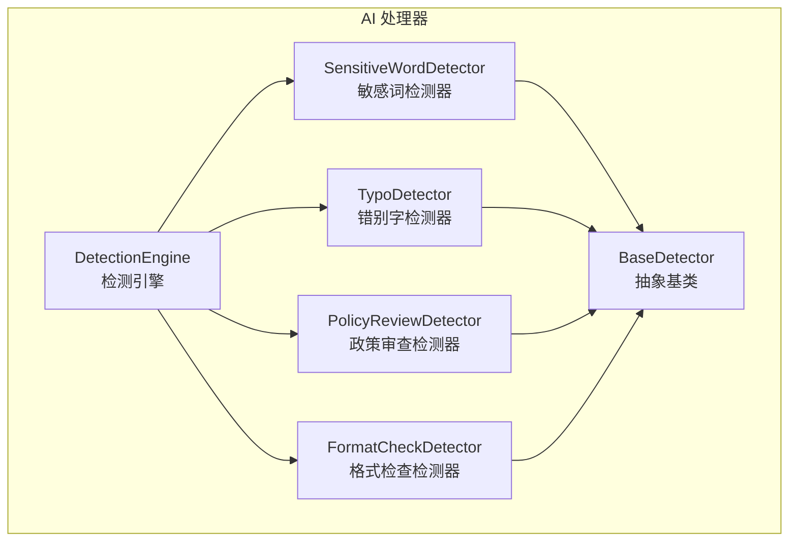
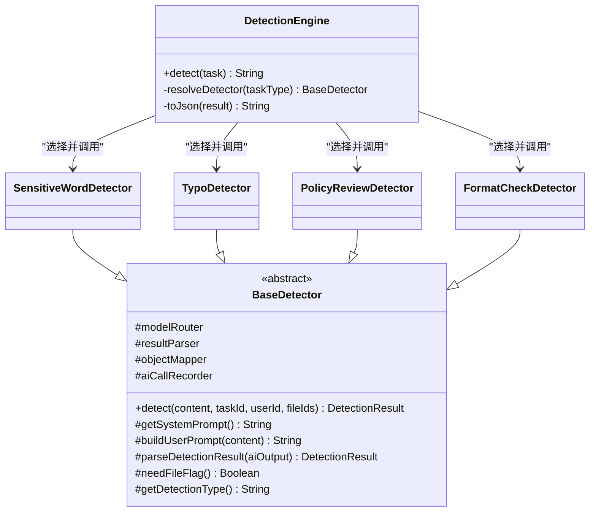
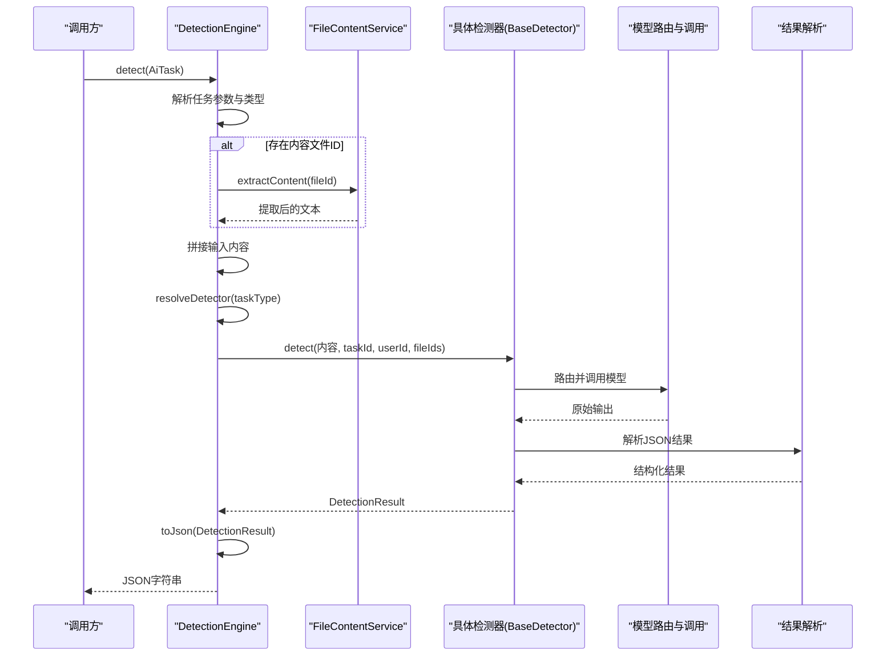
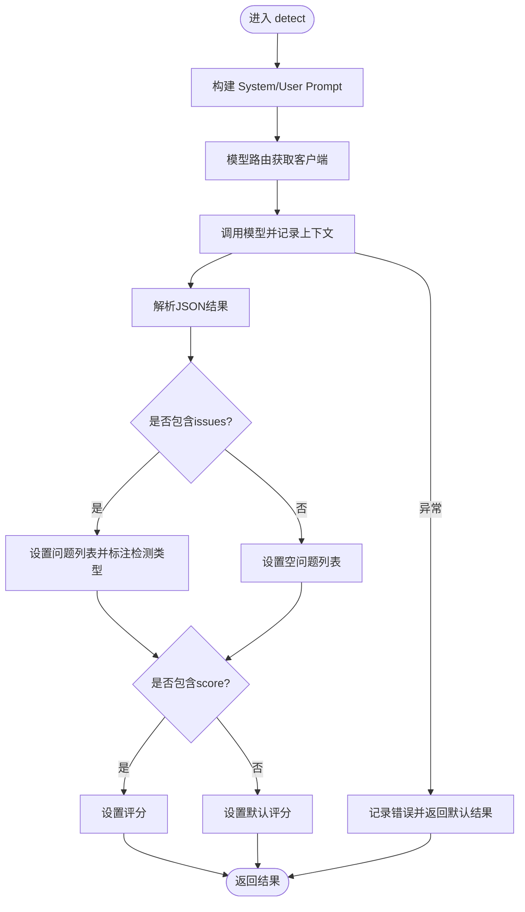
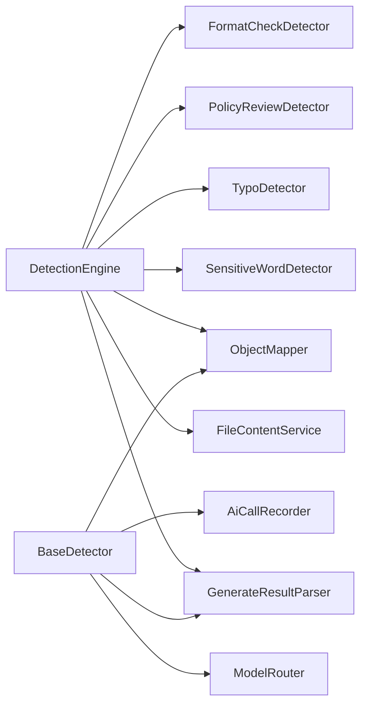

# 检测引擎架构

<cite>
**本文引用的文件**   
- [DetectionEngine.java](file://ele-ai-tender-system/ele-ai-tender-ai/src/main/java/com/jy/eleaitender/ai/processor/checker/DetectionEngine.java)
- [BaseDetector.java](file://ele-ai-tender-system/ele-ai-tender-ai/src/main/java/com/jy/eleaitender/ai/processor/checker/BaseDetector.java)
- [SensitiveWordDetector.java](file://ele-ai-tender-system/ele-ai-tender-ai/src/main/java/com/jy/eleaitender/ai/processor/checker/SensitiveWordDetector.java)
- [TypoDetector.java](file://ele-ai-tender-system/ele-ai-tender-ai/src/main/java/com/jy/eleaitender/ai/processor/checker/TypoDetector.java)
- [PolicyReviewDetector.java](file://ele-ai-tender-system/ele-ai-tender-ai/src/main/java/com/jy/eleaitender/ai/processor/checker/PolicyReviewDetector.java)
- [FormatCheckDetector.java](file://ele-ai-tender-system/ele-ai-tender-ai/src/main/java/com/jy/eleaitender/ai/processor/checker/FormatCheckDetector.java)
</cite>

## 目录
1. [简介](#简介)
2. [项目结构](#项目结构)
3. [核心组件](#核心组件)
4. [架构总览](#架构总览)
5. [详细组件分析](#详细组件分析)
6. [依赖关系分析](#依赖关系分析)
7. [性能与并发](#性能与并发)
8. [错误处理与重试](#错误处理与重试)
9. [配置管理与动态加载](#配置管理与动态加载)
10. [自定义检测器开发指南](#自定义检测器开发指南)
11. [故障排查](#故障排查)
12. [结论](#结论)

## 简介
本技术文档围绕检测引擎的架构设计与实现进行深入解析，重点覆盖以下方面：
- DetectionEngine 的核心编排模式、检测器分发策略与结果聚合
- BaseDetector 抽象基类的设计理念、扩展点与通用流程
- 检测任务调度、线程池管理、错误处理与重试机制（现状与改进建议）
- 检测规则的配置管理、动态加载与版本控制（现状与改进建议）
- 自定义检测器的开发指南与最佳实践

## 项目结构
检测引擎位于 AI 模块的处理器子包中，采用“引擎 + 具体检测器”的分层组织方式：
- 引擎层：DetectionEngine 负责任务类型识别、内容组装、检测器选择与结果序列化
- 抽象层：BaseDetector 提供统一的模型调用、记录与结果解析流程
- 具体检测器：敏感词、错别字、政策审查、格式检查等具体实现

图表来源
- [DetectionEngine.java:1-126](file://ele-ai-tender-system/ele-ai-tender-ai/src/main/java/com/jy/eleaitender/ai/processor/checker/DetectionEngine.java#L1-L126)
- [BaseDetector.java:1-130](file://ele-ai-tender-system/ele-ai-tender-ai/src/main/java/com/jy/eleaitender/ai/processor/checker/BaseDetector.java#L1-L130)

章节来源
- [DetectionEngine.java:1-126](file://ele-ai-tender-system/ele-ai-tender-ai/src/main/java/com/jy/eleaitender/ai/processor/checker/DetectionEngine.java#L1-L126)
- [BaseDetector.java:1-130](file://ele-ai-tender-system/ele-ai-tender-ai/src/main/java/com/jy/eleaitender/ai/processor/checker/BaseDetector.java#L1-L130)

## 核心组件
- DetectionEngine：根据任务类型将请求路由到具体检测器，负责输入内容拼接、可选的文件内容提取、条件跳过逻辑以及最终结果的 JSON 序列化。
- BaseDetector：封装了通用的检测执行流程，包括系统提示与用户提示构建、模型路由与调用、调用记录、结果解析与异常兜底。
- 具体检测器：继承 BaseDetector，实现特定业务场景的检测逻辑（如敏感词、错别字、政策审查、格式检查）。

章节来源
- [DetectionEngine.java:1-126](file://ele-ai-tender-system/ele-ai-tender-ai/src/main/java/com/jy/eleaitender/ai/processor/checker/DetectionEngine.java#L1-L126)
- [BaseDetector.java:1-130](file://ele-ai-tender-system/ele-ai-tender-ai/src/main/java/com/jy/eleaitender/ai/processor/checker/BaseDetector.java#L1-L130)

## 架构总览
检测引擎采用“编排器 + 插件化检测器”的模式。DetectionEngine 作为编排中心，依据 AiTaskType 选择对应检测器；各检测器通过 BaseDetector 统一接入模型路由与结果解析能力，形成可扩展的检测流水线。

图表来源
- [DetectionEngine.java:1-126](file://ele-ai-tender-system/ele-ai-tender-ai/src/main/java/com/jy/eleaitender/ai/processor/checker/DetectionEngine.java#L1-L126)
- [BaseDetector.java:1-130](file://ele-ai-tender-system/ele-ai-tender-ai/src/main/java/com/jy/eleaitender/ai/processor/checker/BaseDetector.java#L1-L130)

## 详细组件分析

### DetectionEngine 编排器
- 任务解析：从任务参数中提取文本内容与可选的内容文件ID，必要时调用文件内容服务进行内容提取，并将多段内容拼接为统一输入。
- 检测器选择：基于 AiTaskType 使用 switch 表达式映射到具体检测器实例。
- 条件跳过：当类型为政策审查且未提供政策文件时，直接返回默认高分结果，避免不必要的模型调用。
- 结果聚合：将检测结果转换为标准 JSON 结构，包含问题列表与评分，并对序列化异常做兜底处理。

图表来源
- [DetectionEngine.java:1-126](file://ele-ai-tender-system/ele-ai-tender-ai/src/main/java/com/jy/eleaitender/ai/processor/checker/DetectionEngine.java#L1-L126)
- [BaseDetector.java:1-130](file://ele-ai-tender-system/ele-ai-tender-ai/src/main/java/com/jy/eleaitender/ai/processor/checker/BaseDetector.java#L1-L130)

章节来源
- [DetectionEngine.java:1-126](file://ele-ai-tender-system/ele-ai-tender-ai/src/main/java/com/jy/eleaitender/ai/processor/checker/DetectionEngine.java#L1-L126)

### BaseDetector 抽象基类
- 设计目标：屏蔽不同检测器在模型调用、记录与结果解析上的重复逻辑，提供一致的异常处理与默认返回值。
- 关键流程：
  - 构建 System Prompt 与 User Prompt
  - 通过模型路由器获取带信息的客户端并发起调用
  - 记录调用上下文（任务ID、用户ID、文件ID、模型名称）
  - 解析模型返回的 JSON，填充问题列表与评分
  - 捕获异常并返回安全默认值，保证上层稳定
- 扩展点：子类需实现检测类型标识、是否需要文件ID标志、系统提示与用户提示构建方法。

图表来源
- [BaseDetector.java:1-130](file://ele-ai-tender-system/ele-ai-tender-ai/src/main/java/com/jy/eleaitender/ai/processor/checker/BaseDetector.java#L1-L130)

章节来源
- [BaseDetector.java:1-130](file://ele-ai-tender-system/ele-ai-tender-ai/src/main/java/com/jy/eleaitender/ai/processor/checker/BaseDetector.java#L1-L130)

### 具体检测器
- SensitiveWordDetector：用于敏感词检测，继承 BaseDetector 实现特定提示与解析逻辑。
- TypoDetector：用于错别字检测，继承 BaseDetector 实现特定提示与解析逻辑。
- PolicyReviewDetector：用于政策文件审查，支持在缺少政策文件时由引擎层跳过调用。
- FormatCheckDetector：用于格式检查，继承 BaseDetector 实现特定提示与解析逻辑。

章节来源
- [SensitiveWordDetector.java](file://ele-ai-tender-system/ele-ai-tender-ai/src/main/java/com/jy/eleaitender/ai/processor/checker/SensitiveWordDetector.java)
- [TypoDetector.java](file://ele-ai-tender-system/ele-ai-tender-ai/src/main/java/com/jy/eleaitender/ai/processor/checker/TypoDetector.java)
- [PolicyReviewDetector.java](file://ele-ai-tender-system/ele-ai-tender-ai/src/main/java/com/jy/eleaitender/ai/processor/checker/PolicyReviewDetector.java)
- [FormatCheckDetector.java](file://ele-ai-tender-system/ele-ai-tender-ai/src/main/java/com/jy/eleaitender/ai/processor/checker/FormatCheckDetector.java)

## 依赖关系分析
- DetectionEngine 依赖：
  - FileContentService：用于从文件ID提取内容
  - GenerateResultParser：用于解析任务参数
  - ObjectMapper：用于结果序列化
  - 四个具体检测器实例：通过 Spring 注入并在运行时选择
- BaseDetector 依赖：
  - ModelRouter：按场景路由到合适的模型客户端
  - GenerateResultParser：抽取 JSON 片段
  - ObjectMapper：JSON 树解析与对象转换
  - AiCallRecorder：记录模型调用上下文

图表来源
- [DetectionEngine.java:1-126](file://ele-ai-tender-system/ele-ai-tender-ai/src/main/java/com/jy/eleaitender/ai/processor/checker/DetectionEngine.java#L1-L126)
- [BaseDetector.java:1-130](file://ele-ai-tender-system/ele-ai-tender-ai/src/main/java/com/jy/eleaitender/ai/processor/checker/BaseDetector.java#L1-L130)

章节来源
- [DetectionEngine.java:1-126](file://ele-ai-tender-system/ele-ai-tender-ai/src/main/java/com/jy/eleaitender/ai/processor/checker/DetectionEngine.java#L1-L126)
- [BaseDetector.java:1-130](file://ele-ai-tender-system/ele-ai-tender-ai/src/main/java/com/jy/eleaitender/ai/processor/checker/BaseDetector.java#L1-L130)

## 性能与并发
- 当前实现：
  - DetectionEngine 与 BaseDetector 均为同步阻塞调用，未体现显式的并行处理框架或线程池管理。
  - 结果聚合以单次任务为单位，串行执行单个检测器。
- 优化建议：
  - 引入可配置的线程池（固定大小或自适应），对多个检测器进行并行执行，提升吞吐。
  - 在 DetectionEngine.detect 中，将需要并行的检测器提交到线程池，使用 Future/CompletableFuture 收集结果后再聚合。
  - 针对大文本内容，考虑分片处理与增量聚合，降低单次模型调用负载。
  - 增加限流与熔断策略，保护下游模型服务稳定性。

[本节为通用性能讨论，不直接分析具体文件]

## 错误处理与重试
- 当前实现：
  - BaseDetector.detect 捕获异常并返回默认结果（空问题列表、低评分、错误信息），确保上层稳定。
  - DetectionEngine.toJson 对序列化异常进行兜底，返回安全的 JSON 结构。
- 改进建议：
  - 在 BaseDetector 中增加重试机制（指数退避、最大重试次数），针对网络抖动或临时性失败。
  - 区分可重试与不可重试异常，记录更丰富的诊断信息（模型名称、耗时、输入摘要）。
  - 在 DetectionEngine 层增加整体超时控制与降级策略，避免长尾任务阻塞。

章节来源
- [BaseDetector.java:1-130](file://ele-ai-tender-system/ele-ai-tender-ai/src/main/java/com/jy/eleaitender/ai/processor/checker/BaseDetector.java#L1-L130)
- [DetectionEngine.java:1-126](file://ele-ai-tender-system/ele-ai-tender-ai/src/main/java/com/jy/eleaitender/ai/processor/checker/DetectionEngine.java#L1-L126)

## 配置管理与动态加载
- 当前实现：
  - 检测器通过 Spring 容器注入，DetectionEngine 使用 switch 表达式进行静态映射。
  - 未观察到基于配置文件的动态加载或版本控制机制。
- 改进建议：
  - 引入检测器注册表（Map<String, BaseDetector>），支持按类型名动态装配与热更新。
  - 通过配置文件或配置中心声明检测器启用状态、优先级与版本标签。
  - 在 DetectionEngine 中改为查表式路由，新增检测器无需修改核心代码，仅注册即可生效。
  - 增加检测器版本兼容校验，确保升级过程中的平滑过渡。

[本节为通用配置与加载讨论，不直接分析具体文件]

## 自定义检测器开发指南
- 步骤概览：
  - 新建类继承 BaseDetector，实现必要抽象方法：
    - getDetectionType：返回检测类型标识
    - needFileFlag：是否需要文件ID列表
    - getSystemPrompt：定义系统提示模板
    - buildUserPrompt：根据输入内容构建用户提示
  - 在 DetectionEngine 中添加新的 AiTaskType 分支，将新检测器注入并路由。
- 最佳实践：
  - 保持提示工程的可维护性，将模板与业务逻辑解耦。
  - 合理设置 needFileFlag，仅在确实需要文件上下文时开启，减少不必要的数据传输。
  - 在 parseDetectionResult 中严格校验 JSON 结构，避免脏数据污染结果。
  - 为每个检测器添加单元测试，覆盖正常路径与异常路径。
  - 遵循统一的日志规范，便于问题定位与性能分析。

章节来源
- [BaseDetector.java:1-130](file://ele-ai-tender-system/ele-ai-tender-ai/src/main/java/com/jy/eleaitender/ai/processor/checker/BaseDetector.java#L1-L130)
- [DetectionEngine.java:1-126](file://ele-ai-tender-system/ele-ai-tender-ai/src/main/java/com/jy/eleaitender/ai/processor/checker/DetectionEngine.java#L1-L126)

## 故障排查
- 常见问题与定位要点：
  - 检测结果为空或评分异常：检查 BaseDetector.parseDetectionResult 的 JSON 解析与字段映射。
  - 模型调用失败：查看 AiCallRecorder 记录的上下文信息与错误堆栈。
  - 政策审查未触发：确认 PolicyReviewDetector 的条件跳过逻辑与文件ID是否正确传入。
  - 序列化失败：关注 DetectionEngine.toJson 的兜底返回，检查 ObjectMapper 配置。
- 建议的诊断手段：
  - 开启详细日志，记录输入摘要、模型名称、耗时与错误码。
  - 对关键路径增加断点与指标埋点，监控成功率与延迟分布。
  - 使用最小复现用例验证提示模板与解析逻辑。

章节来源
- [BaseDetector.java:1-130](file://ele-ai-tender-system/ele-ai-tender-ai/src/main/java/com/jy/eleaitender/ai/processor/checker/BaseDetector.java#L1-L130)
- [DetectionEngine.java:1-126](file://ele-ai-tender-system/ele-ai-tender-ai/src/main/java/com/jy/eleaitender/ai/processor/checker/DetectionEngine.java#L1-L126)

## 结论
检测引擎采用清晰的编排器与抽象基类分层设计，具备良好的可扩展性与稳定性。当前实现聚焦于单任务串行执行与基础异常兜底，后续可在并行处理、动态加载、重试与版本控制等方面进一步增强，以满足更高吞吐与更灵活的业务需求。