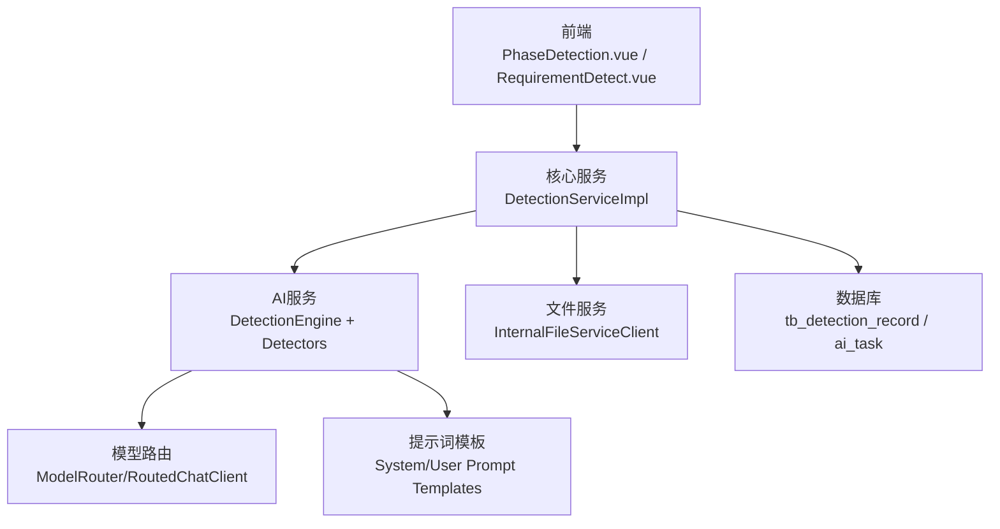
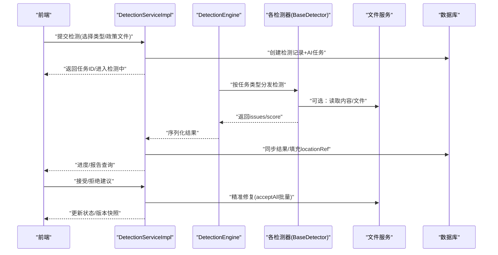
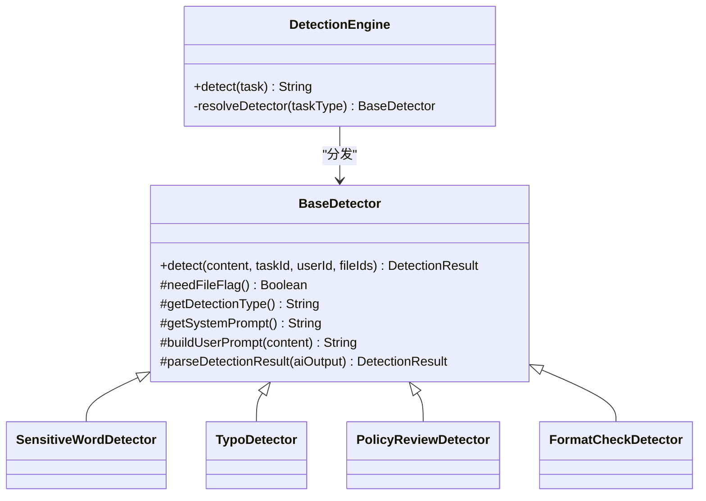
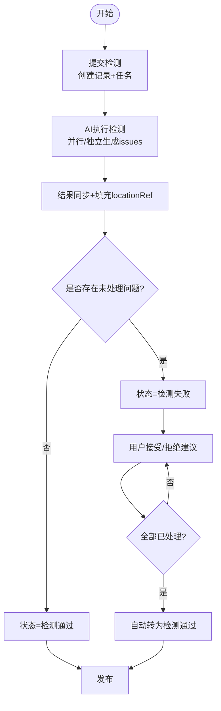
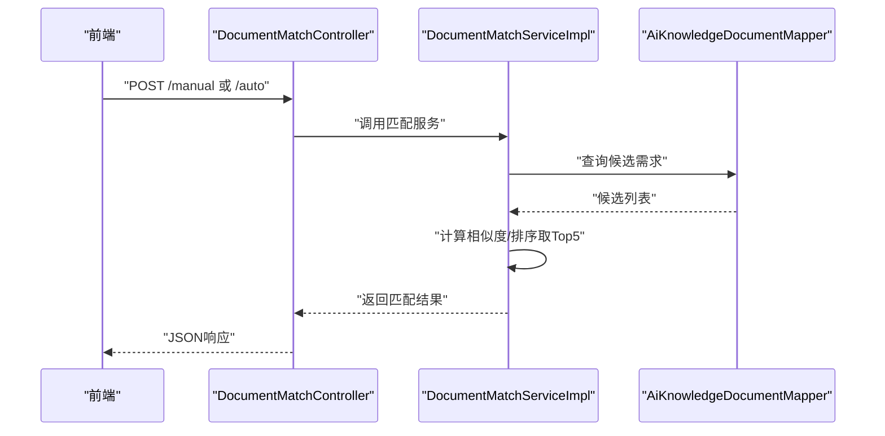
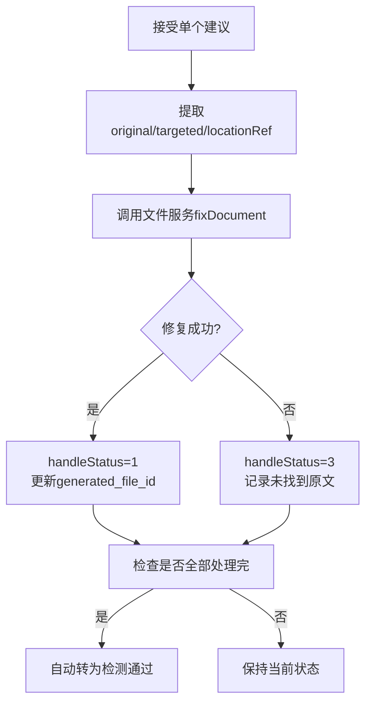
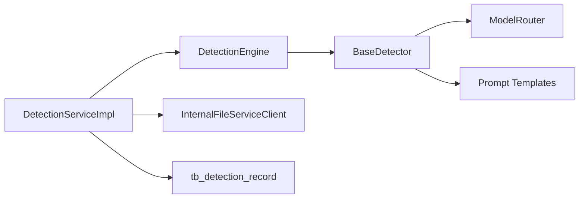

# 质量检测与合规性检查

<cite>
**本文引用的文件**
- [DetectionEngine.java](file://ele-ai-tender-system/ele-ai-tender-ai/src/main/java/com/jy/eleaitender/ai/processor/checker/DetectionEngine.java)
- [BaseDetector.java](file://ele-ai-tender-system/ele-ai-tender-ai/src/main/java/com/jy/eleaitender/ai/processor/checker/BaseDetector.java)
- [SensitiveWordDetector.java](file://ele-ai-tender-system/ele-ai-tender-ai/src/main/java/com/jy/eleaitender/ai/processor/checker/SensitiveWordDetector.java)
- [TypoDetector.java](file://ele-ai-tender-system/ele-ai-tender-ai/src/main/java/com/jy/eleaitender/ai/processor/checker/TypoDetector.java)
- [PolicyReviewDetector.java](file://ele-ai-tender-system/ele-ai-tender-ai/src/main/java/com/jy/eleaitender/ai/processor/checker/PolicyReviewDetector.java)
- [FormatCheckDetector.java](file://ele-ai-tender-system/ele-ai-tender-ai/src/main/java/com/jy/eleaitender/ai/processor/checker/FormatCheckDetector.java)
- [UserPromptTemplates.java](file://ele-ai-tender-system/ele-ai-tender-ai/src/main/java/com/jy/eleaitender/ai/processor/prompt/UserPromptTemplates.java)
- [DetectionServiceImpl.java](file://ele-ai-tender-system/ele-ai-tender-core/src/main/java/com/jy/eleaitender/core/service/impl/DetectionServiceImpl.java)
- [IDetectionService.java](file://ele-ai-tender-system/ele-ai-tender-core/src/main/java/com/jy/eleaitender/core/service/IDetectionService.java)
- [DetectionReportVO.java](file://ele-ai-tender-system/ele-ai-tender-core/src/main/java/com/jy/eleaitender/core/dto/response/DetectionReportVO.java)
- [DetectionProgressVO.java](file://ele-ai-tender-system/ele-ai-tender-core/src/main/java/com/jy/eleaitender/core/dto/response/DetectionProgressVO.java)
- [DetectionIssueVO.java](file://ele-ai-tender-system/ele-ai-tender-core/src/main/java/com/jy/eleaitender/core/dto/response/DetectionIssueVO.java)
- [DETECTION_FLOW_SPEC.md](file://docs/rules/DETECTION_FLOW_SPEC.md)
- [init.sql](file://ele-ai-tender-system/ele-ai-tender-core/sql/init.sql)
- [PhaseDetection.vue](file://ele-ai-tender-frontend/src/views/project/phases/PhaseDetection.vue)
- [RequirementDetect.vue](file://ele-ai-tender-frontend/src/views/requirement/RequirementDetect.vue)
- [IDocumentMatchService.java](file://ele-ai-tender-system/ele-ai-tender-ai/src/main/java/com/jy/eleaitender/ai/service/IDocumentMatchService.java)
- [DocumentMatchServiceImpl.java](file://ele-ai-tender-system/ele-ai-tender-ai/src/main/java/com/jy/eleaitender/ai/service/impl/DocumentMatchServiceImpl.java)
- [DocumentMatchController.java](file://ele-ai-tender-system/ele-ai-tender-ai/src/main/java/com/jy/eleaitender/ai/controller/DocumentMatchController.java)
- [MatchResultVO.java](file://ele-ai-tender-system/ele-ai-tender-ai/src/main/java/com/jy/eleaitender/ai/dto/response/MatchResultVO.java)
</cite>

## 目录
1. [简介](#简介)
2. [项目结构](#项目结构)
3. [核心组件](#核心组件)
4. [架构总览](#架构总览)
5. [详细组件分析](#详细组件分析)
6. [依赖关系分析](#依赖关系分析)
7. [性能考量](#性能考量)
8. [故障排查指南](#故障排查指南)
9. [结论](#结论)
10. [附录](#附录)

## 简介
本技术文档围绕“质量检测与合规性检查”能力，系统阐述格式检查、敏感词检测、错别字识别、政策审查等检测规则的实现方式；深入解析检测引擎的调度机制、并行处理、结果聚合；说明相似度分析、文档匹配、风险评估等高级能力；并提供检测规则配置、自定义检测器开发、性能优化、检测结果可视化与问题修复建议等实用指南。

## 项目结构
本项目采用前后端分离与多模块后端架构：
- 前端（Vue）提供检测任务提交、进度查看、报告展示、问题接受/拒绝与一键修复等交互。
- 核心服务（Core）负责检测流程编排、状态机流转、结果聚合与版本备份。
- AI 服务（AI）实现检测器体系与模型路由、提示词模板、结果解析与调用记录。
- 文件服务（File）提供 Word 文本提取与精准修复能力。
- 支撑服务（Support）提供系统级能力（如系统级政策文件）。

图表来源
- [DetectionServiceImpl.java:86-143](file://ele-ai-tender-system/ele-ai-tender-core/src/main/java/com/jy/eleaitender/core/service/impl/DetectionServiceImpl.java#L86-L143)
- [DetectionEngine.java:53-95](file://ele-ai-tender-system/ele-ai-tender-ai/src/main/java/com/jy/eleaitender/ai/processor/checker/DetectionEngine.java#L53-L95)
- [DETECTION_FLOW_SPEC.md:1-217](file://docs/rules/DETECTION_FLOW_SPEC.md#L1-L217)

章节来源
- [DetectionServiceImpl.java:86-143](file://ele-ai-tender-system/ele-ai-tender-core/src/main/java/com/jy/eleaitender/core/service/impl/DetectionServiceImpl.java#L86-L143)
- [DetectionEngine.java:53-95](file://ele-ai-tender-system/ele-ai-tender-ai/src/main/java/com/jy/eleaitender/ai/processor/checker/DetectionEngine.java#L53-L95)
- [DETECTION_FLOW_SPEC.md:1-217](file://docs/rules/DETECTION_FLOW_SPEC.md#L1-L217)

## 核心组件
- 检测服务接口与实现：定义提交、进度、报告、接受/拒绝建议、跳过、重试等能力。
- 检测引擎与检测器：按任务类型分发到具体检测器，统一构建输入、调用模型、解析结果。
- 检测报告与进度 VO：面向前端的结构化数据，包含总体状态、问题列表、得分、文件信息等。
- 检测全链路规范：从提交到修复的状态流转、定位填充、版本快照与排障要点。

章节来源
- [IDetectionService.java:1-58](file://ele-ai-tender-system/ele-ai-tender-core/src/main/java/com/jy/eleaitender/core/service/IDetectionService.java#L1-L58)
- [DetectionServiceImpl.java:146-230](file://ele-ai-tender-system/ele-ai-tender-core/src/main/java/com/jy/eleaitender/core/service/impl/DetectionServiceImpl.java#L146-L230)
- [DetectionReportVO.java:1-36](file://ele-ai-tender-system/ele-ai-tender-core/src/main/java/com/jy/eleaitender/core/dto/response/DetectionReportVO.java#L1-L36)
- [DetectionProgressVO.java:1-44](file://ele-ai-tender-system/ele-ai-tender-core/src/main/java/com/jy/eleaitender/core/dto/response/DetectionProgressVO.java#L1-L44)
- [DetectionIssueVO.java:1-55](file://ele-ai-tender-system/ele-ai-tender-core/src/main/java/com/jy/eleaitender/core/dto/response/DetectionIssueVO.java#L1-L55)
- [DETECTION_FLOW_SPEC.md:1-217](file://docs/rules/DETECTION_FLOW_SPEC.md#L1-L217)

## 架构总览
检测流程由 Core 层发起，AI 层执行，文件服务辅助定位与修复，数据库持久化中间态与结果。

图表来源
- [DetectionServiceImpl.java:86-143](file://ele-ai-tender-system/ele-ai-tender-core/src/main/java/com/jy/eleaitender/core/service/impl/DetectionServiceImpl.java#L86-L143)
- [DetectionEngine.java:53-95](file://ele-ai-tender-system/ele-ai-tender-ai/src/main/java/com/jy/eleaitender/ai/processor/checker/DetectionEngine.java#L53-L95)
- [DETECTION_FLOW_SPEC.md:1-217](file://docs/rules/DETECTION_FLOW_SPEC.md#L1-L217)

## 详细组件分析

### 检测引擎与检测器体系
- 检测引擎根据任务类型将请求分发至对应检测器，并组装输入内容（纯文本或文件提取），输出统一的 JSON 结果。
- 检测器基类封装模型路由、调用记录、结果解析与错误兜底；具体检测器仅实现差异化提示词与类型标识。
- 四种检测器分别覆盖敏感词、错别字、政策审查、格式规范。

图表来源
- [BaseDetector.java:47-118](file://ele-ai-tender-system/ele-ai-tender-ai/src/main/java/com/jy/eleaitender/ai/processor/checker/BaseDetector.java#L47-L118)
- [SensitiveWordDetector.java:1-37](file://ele-ai-tender-system/ele-ai-tender-ai/src/main/java/com/jy/eleaitender/ai/processor/checker/SensitiveWordDetector.java#L1-L37)
- [TypoDetector.java:1-37](file://ele-ai-tender-system/ele-ai-tender-ai/src/main/java/com/jy/eleaitender/ai/processor/checker/TypoDetector.java#L1-L37)
- [PolicyReviewDetector.java:1-38](file://ele-ai-tender-system/ele-ai-tender-ai/src/main/java/com/jy/eleaitender/ai/processor/checker/PolicyReviewDetector.java#L1-L38)
- [FormatCheckDetector.java:1-38](file://ele-ai-tender-system/ele-ai-tender-ai/src/main/java/com/jy/eleaitender/ai/processor/checker/FormatCheckDetector.java#L1-L38)
- [DetectionEngine.java:53-125](file://ele-ai-tender-system/ele-ai-tender-ai/src/main/java/com/jy/eleaitender/ai/processor/checker/DetectionEngine.java#L53-L125)

章节来源
- [DetectionEngine.java:53-125](file://ele-ai-tender-system/ele-ai-tender-ai/src/main/java/com/jy/eleaitender/ai/processor/checker/DetectionEngine.java#L53-L125)
- [BaseDetector.java:47-118](file://ele-ai-tender-system/ele-ai-tender-ai/src/main/java/com/jy/eleaitender/ai/processor/checker/BaseDetector.java#L47-L118)
- [SensitiveWordDetector.java:1-37](file://ele-ai-tender-system/ele-ai-tender-ai/src/main/java/com/jy/eleaitender/ai/processor/checker/SensitiveWordDetector.java#L1-L37)
- [TypoDetector.java:1-37](file://ele-ai-tender-system/ele-ai-tender-ai/src/main/java/com/jy/eleaitender/ai/processor/checker/TypoDetector.java#L1-L37)
- [PolicyReviewDetector.java:1-38](file://ele-ai-tender-system/ele-ai-tender-ai/src/main/java/com/jy/eleaitender/ai/processor/checker/PolicyReviewDetector.java#L1-L38)
- [FormatCheckDetector.java:1-38](file://ele-ai-tender-system/ele-ai-tender-ai/src/main/java/com/jy/eleaitender/ai/processor/checker/FormatCheckDetector.java#L1-L38)

### 检测规则与提示词
- 敏感词检测：聚焦歧视性、限制性、排他性、倾向性表述。
- 错别字检测：识别错别字、语法错误、标点符号错误。
- 政策审查：对照政策文件进行合规性检查，需传入政策文件 ID 列表。
- 格式规范检测：标题层级、编号格式、必要章节完整性等。

提示词模板通过 System/User 模板组合注入上下文，确保检测器行为一致且可配置。

章节来源
- [UserPromptTemplates.java:194-224](file://ele-ai-tender-system/ele-ai-tender-ai/src/main/java/com/jy/eleaitender/ai/processor/prompt/UserPromptTemplates.java#L194-L224)
- [SensitiveWordDetector.java:23-35](file://ele-ai-tender-system/ele-ai-tender-ai/src/main/java/com/jy/eleaitender/ai/processor/checker/SensitiveWordDetector.java#L23-L35)
- [TypoDetector.java:24-36](file://ele-ai-tender-system/ele-ai-tender-ai/src/main/java/com/jy/eleaitender/ai/processor/checker/TypoDetector.java#L24-L36)
- [PolicyReviewDetector.java:24-36](file://ele-ai-tender-system/ele-ai-tender-ai/src/main/java/com/jy/eleaitender/ai/processor/checker/PolicyReviewDetector.java#L24-L36)
- [FormatCheckDetector.java:24-36](file://ele-ai-tender-system/ele-ai-tender-ai/src/main/java/com/jy/eleaitender/ai/processor/checker/FormatCheckDetector.java#L24-L36)

### 检测流程与状态机
- 提交检测：为每种检测类型创建检测记录与 AI 任务，更新项目状态为检测中。
- 执行与同步：AI 任务完成后，结果写入检测记录，自动填充 locationRef，用于后续精准修复。
- 状态流转：检测完成若存在未处理问题则失败，否则通过；用户接受/拒绝后自动判定是否转为通过。
- 重试与跳过：支持重试失败项与跳过检测，均遵循状态机约束。

图表来源
- [DetectionServiceImpl.java:86-143](file://ele-ai-tender-system/ele-ai-tender-core/src/main/java/com/jy/eleaitender/core/service/impl/DetectionServiceImpl.java#L86-L143)
- [DetectionServiceImpl.java:527-552](file://ele-ai-tender-system/ele-ai-tender-core/src/main/java/com/jy/eleaitender/core/service/impl/DetectionServiceImpl.java#L527-L552)
- [DETECTION_FLOW_SPEC.md:1-217](file://docs/rules/DETECTION_FLOW_SPEC.md#L1-L217)

章节来源
- [DetectionServiceImpl.java:86-143](file://ele-ai-tender-system/ele-ai-tender-core/src/main/java/com/jy/eleaitender/core/service/impl/DetectionServiceImpl.java#L86-L143)
- [DetectionServiceImpl.java:527-552](file://ele-ai-tender-system/ele-ai-tender-core/src/main/java/com/jy/eleaitender/core/service/impl/DetectionServiceImpl.java#L527-L552)
- [DETECTION_FLOW_SPEC.md:1-217](file://docs/rules/DETECTION_FLOW_SPEC.md#L1-L217)

### 结果聚合与可视化
- 进度视图：汇总各检测项的任务状态、问题数与得分，计算总体状态。
- 报告视图：聚合所有检测记录的 issues，统计总数与总体状态，附带检测文件信息。
- 前端展示：阶段页面提供检测类型选择、政策文件选择、进度与报告展示；需求编辑页提供问题接受/拒绝操作。

章节来源
- [DetectionProgressVO.java:1-44](file://ele-ai-tender-system/ele-ai-tender-core/src/main/java/com/jy/eleaitender/core/dto/response/DetectionProgressVO.java#L1-L44)
- [DetectionReportVO.java:1-36](file://ele-ai-tender-system/ele-ai-tender-core/src/main/java/com/jy/eleaitender/core/dto/response/DetectionReportVO.java#L1-L36)
- [DetectionIssueVO.java:1-55](file://ele-ai-tender-system/ele-ai-tender-core/src/main/java/com/jy/eleaitender/core/dto/response/DetectionIssueVO.java#L1-L55)
- [PhaseDetection.vue:1-30](file://ele-ai-tender-frontend/src/views/project/phases/PhaseDetection.vue#L1-L30)
- [RequirementDetect.vue:117-142](file://ele-ai-tender-frontend/src/views/requirement/RequirementDetect.vue#L117-L142)

### 相似度分析与文档匹配
- 文档匹配服务提供自动匹配与手动候选匹配，基于数据库关键字匹配与规则评分，返回 TopN 候选及相似度。
- 控制器暴露接口供前端调用（当前为占位实现，逻辑在 Service 层）。

图表来源
- [DocumentMatchController.java:34-48](file://ele-ai-tender-system/ele-ai-tender-ai/src/main/java/com/jy/eleaitender/ai/controller/DocumentMatchController.java#L34-L48)
- [DocumentMatchServiceImpl.java:26-39](file://ele-ai-tender-system/ele-ai-tender-ai/src/main/java/com/jy/eleaitender/ai/service/impl/DocumentMatchServiceImpl.java#L26-L39)
- [IDocumentMatchService.java:1-22](file://ele-ai-tender-system/ele-ai-tender-ai/src/main/java/com/jy/eleaitender/ai/service/IDocumentMatchService.java#L1-L22)
- [MatchResultVO.java:1-33](file://ele-ai-tender-system/ele-ai-tender-ai/src/main/java/com/jy/eleaitender/ai/dto/response/MatchResultVO.java#L1-L33)

章节来源
- [DocumentMatchController.java:34-48](file://ele-ai-tender-system/ele-ai-tender-ai/src/main/java/com/jy/eleaitender/ai/controller/DocumentMatchController.java#L34-L48)
- [DocumentMatchServiceImpl.java:26-39](file://ele-ai-tender-system/ele-ai-tender-ai/src/main/java/com/jy/eleaitender/ai/service/impl/DocumentMatchServiceImpl.java#L26-L39)
- [IDocumentMatchService.java:1-22](file://ele-ai-tender-system/ele-ai-tender-ai/src/main/java/com/jy/eleaitender/ai/service/IDocumentMatchService.java#L1-L22)
- [MatchResultVO.java:1-33](file://ele-ai-tender-system/ele-ai-tender-ai/src/main/java/com/jy/eleaitender/ai/dto/response/MatchResultVO.java#L1-L33)

### 风险评估与得分策略
- 每个检测器返回 score 与 issues 列表，Core 层汇总形成报告总分与总体状态。
- 总体状态依据是否有未处理问题、AI 可用性、失败情况综合判定。

章节来源
- [DetectionProgressVO.java:1-44](file://ele-ai-tender-system/ele-ai-tender-core/src/main/java/com/jy/eleaitender/core/dto/response/DetectionProgressVO.java#L1-L44)
- [DetectionReportVO.java:1-36](file://ele-ai-tender-system/ele-ai-tender-core/src/main/java/com/jy/eleaitender/core/dto/response/DetectionReportVO.java#L1-L36)
- [DetectionServiceImpl.java:146-202](file://ele-ai-tender-system/ele-ai-tender-core/src/main/java/com/jy/eleaitender/core/service/impl/DetectionServiceImpl.java#L146-L202)

### 定位与修复（接受即修复）
- 检测完成后自动填充 locationRef，基于 Word 文件的 segments 精准定位段落/表格单元格。
- 接受建议时，提取 original/targeted 与 locationRef，调用文件服务修复文档；批量接受一次性修复。
- 拒绝建议仅标记 handleStatus，不修改文档。

图表来源
- [DetectionServiceImpl.java:291-336](file://ele-ai-tender-system/ele-ai-tender-core/src/main/java/com/jy/eleaitender/core/service/impl/DetectionServiceImpl.java#L291-L336)
- [DetectionServiceImpl.java:362-394](file://ele-ai-tender-system/ele-ai-tender-core/src/main/java/com/jy/eleaitender/core/service/impl/DetectionServiceImpl.java#L362-L394)
- [DETECTION_FLOW_SPEC.md:131-158](file://docs/rules/DETECTION_FLOW_SPEC.md#L131-L158)

章节来源
- [DetectionServiceImpl.java:291-336](file://ele-ai-tender-system/ele-ai-tender-core/src/main/java/com/jy/eleaitender/core/service/impl/DetectionServiceImpl.java#L291-L336)
- [DetectionServiceImpl.java:362-394](file://ele-ai-tender-system/ele-ai-tender-core/src/main/java/com/jy/eleaitender/core/service/impl/DetectionServiceImpl.java#L362-L394)
- [DETECTION_FLOW_SPEC.md:131-158](file://docs/rules/DETECTION_FLOW_SPEC.md#L131-L158)

## 依赖关系分析
- Core 对 AI 与 File 的依赖通过内部客户端与服务接口解耦。
- AI 检测器依赖模型路由与提示词模板，结果解析统一在基类中实现。
- 数据库表 tb_detection_record 存储检测内容与结果 JSON，字段包括检测类型、状态、关联任务 ID、政策文件 ID 列表等。

图表来源
- [DetectionServiceImpl.java:86-143](file://ele-ai-tender-system/ele-ai-tender-core/src/main/java/com/jy/eleaitender/core/service/impl/DetectionServiceImpl.java#L86-L143)
- [DetectionEngine.java:53-95](file://ele-ai-tender-system/ele-ai-tender-ai/src/main/java/com/jy/eleaitender/ai/processor/checker/DetectionEngine.java#L53-L95)
- [BaseDetector.java:47-118](file://ele-ai-tender-system/ele-ai-tender-ai/src/main/java/com/jy/eleaitender/ai/processor/checker/BaseDetector.java#L47-L118)
- [init.sql:223-239](file://ele-ai-tender-system/ele-ai-tender-core/sql/init.sql#L223-L239)

章节来源
- [DetectionServiceImpl.java:86-143](file://ele-ai-tender-system/ele-ai-tender-core/src/main/java/com/jy/eleaitender/core/service/impl/DetectionServiceImpl.java#L86-L143)
- [DetectionEngine.java:53-95](file://ele-ai-tender-system/ele-ai-tender-ai/src/main/java/com/jy/eleaitender/ai/processor/checker/DetectionEngine.java#L53-L95)
- [BaseDetector.java:47-118](file://ele-ai-tender-system/ele-ai-tender-ai/src/main/java/com/jy/eleaitender/ai/processor/checker/BaseDetector.java#L47-L118)
- [init.sql:223-239](file://ele-ai-tender-system/ele-ai-tender-core/sql/init.sql#L223-L239)

## 性能考量
- 并行执行：四种检测独立生成结果，避免相互阻塞，提升整体吞吐。
- 结果序列化容错：当序列化异常时返回安全默认值，保障下游稳定。
- 定时轮询：每 10 秒扫描待处理检测记录并同步任务状态，降低前端轮询压力。
- 批量修复：一次收集所有替换项，减少文件服务往返次数。
- 内容快照：检测对象为纯文本快照，避免重复解析大文件，提高稳定性。

章节来源
- [DetectionEngine.java:114-125](file://ele-ai-tender-system/ele-ai-tender-ai/src/main/java/com/jy/eleaitender/ai/processor/checker/DetectionEngine.java#L114-L125)
- [DetectionServiceImpl.java:566-575](file://ele-ai-tender-system/ele-ai-tender-core/src/main/java/com/jy/eleaitender/core/service/impl/DetectionServiceImpl.java#L566-L575)
- [DetectionServiceImpl.java:362-394](file://ele-ai-tender-system/ele-ai-tender-core/src/main/java/com/jy/eleaitender/core/service/impl/DetectionServiceImpl.java#L362-L394)
- [DETECTION_FLOW_SPEC.md:60-77](file://docs/rules/DETECTION_FLOW_SPEC.md#L60-L77)

## 故障排查指南
- 检测任务不执行：检查 ai_task 是否为 PENDING，确认 AiTaskProcessor 轮询日志正常。
- 检测结果为空：查看 tb_detection_record.result JSON，确认 AI 返回有效结果。
- locationRef 未填充：检查 AiTaskResultSyncHandler 日志是否报 extractText 或 fillLocationRefs 失败，project.generated_file_id 是否有值。
- 接受建议后文档未修复：检查 issue 的 original/targeted 是否有效、WordDocumentFixEngine 日志是否报告未找到原文、project.generated_file_id 是否已更新、locationRef 是否正确传递。
- 检测后状态未流转：检查是否所有 detection_record 已终态、是否仍有 handleStatus=0 的问题。
- 修复替换了错误位置：检查 FixReplacement.locationRef 是否为空（为空走全文档替换）、elementIndex 对应的 IBodyElement 类型是否与 type 字段一致。
- 模板内容被误报为问题：检测仅作用于 buildDetectionContent（需求内容 + 评审项标准纯文本），模板内容不在检测范围；确认 content_file_id 为 null、content_snapshot 仅含需求与评审项。

章节来源
- [DETECTION_FLOW_SPEC.md:198-217](file://docs/rules/DETECTION_FLOW_SPEC.md#L198-L217)

## 结论
本系统以“纯文本快照检测 + Word 精准定位修复”为核心思路，结合检测引擎的并行编排与结果聚合，实现了格式检查、敏感词检测、错别字识别、政策审查等多维度的质量与合规性保障。通过状态机驱动的流程控制、版本快照与自动化流转，提升了用户体验与交付效率。同时，文档匹配与相似度分析提供了历史复用能力，便于快速构建高质量招标文件。

## 附录

### 检测规则配置与自定义检测器开发
- 新增检测器步骤：
  - 继承 BaseDetector，实现 needFileFlag、getDetectionType、getSystemPrompt、buildUserPrompt。
  - 在 DetectionEngine 中添加新类型的分发分支。
  - 在检测内容构建与前端选择中补充新类型。
- 提示词模板：
  - 在 System/User 模板中扩展新场景，确保输入结构与解析契约一致。
- 结果解析：
  - 遵循 issues/score 结构，必要时扩展字段并在 Core 层兼容。

章节来源
- [BaseDetector.java:47-118](file://ele-ai-tender-system/ele-ai-tender-ai/src/main/java/com/jy/eleaitender/ai/processor/checker/BaseDetector.java#L47-L118)
- [DetectionEngine.java:100-108](file://ele-ai-tender-system/ele-ai-tender-ai/src/main/java/com/jy/eleaitender/ai/processor/checker/DetectionEngine.java#L100-L108)
- [UserPromptTemplates.java:194-224](file://ele-ai-tender-system/ele-ai-tender-ai/src/main/java/com/jy/eleaitender/ai/processor/prompt/UserPromptTemplates.java#L194-L224)

### 检测结果可视化与问题修复建议
- 进度页面：显示各检测项状态、问题数与得分，总体状态一目了然。
- 报告页面：汇总问题列表、严重程度、建议修改内容、相关政策引用与违反规则。
- 修复建议：支持单条接受/拒绝与一键接受，自动触发文档修复与版本快照。

章节来源
- [DetectionProgressVO.java:1-44](file://ele-ai-tender-system/ele-ai-tender-core/src/main/java/com/jy/eleaitender/core/dto/response/DetectionProgressVO.java#L1-L44)
- [DetectionReportVO.java:1-36](file://ele-ai-tender-system/ele-ai-tender-core/src/main/java/com/jy/eleaitender/core/dto/response/DetectionReportVO.java#L1-L36)
- [DetectionIssueVO.java:1-55](file://ele-ai-tender-system/ele-ai-tender-core/src/main/java/com/jy/eleaitender/core/dto/response/DetectionIssueVO.java#L1-L55)
- [PhaseDetection.vue:1-30](file://ele-ai-tender-frontend/src/views/project/phases/PhaseDetection.vue#L1-L30)
- [RequirementDetect.vue:117-142](file://ele-ai-tender-frontend/src/views/requirement/RequirementDetect.vue#L117-L142)