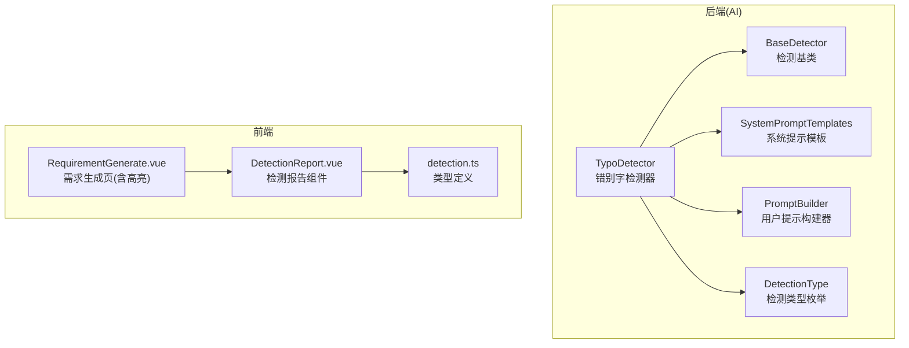
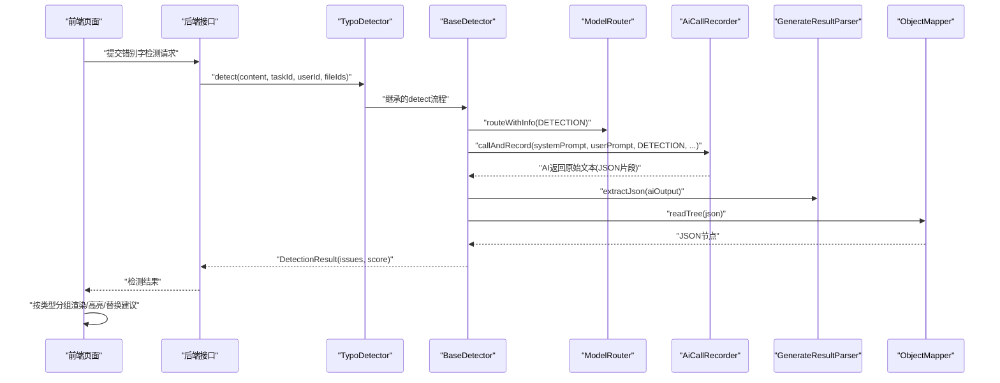
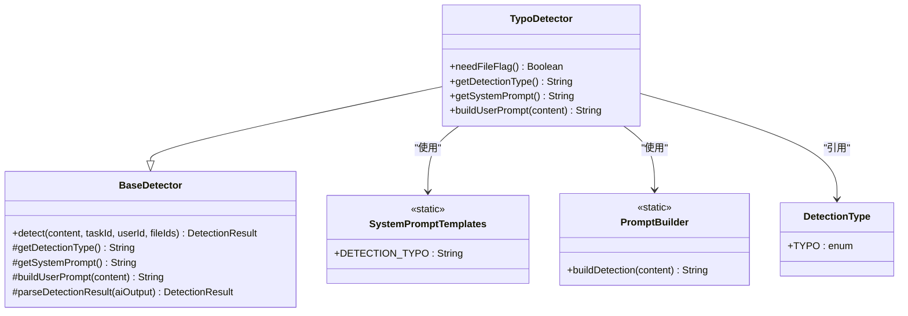
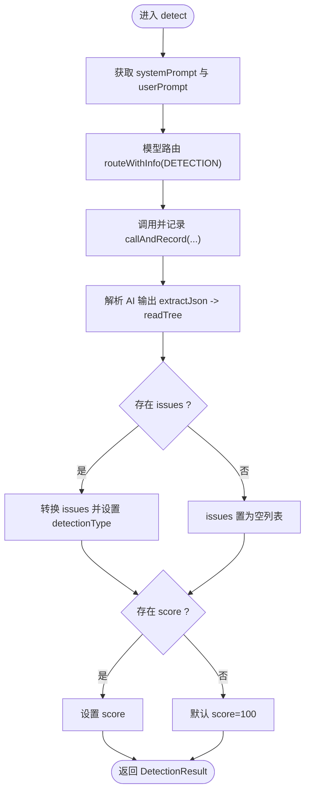
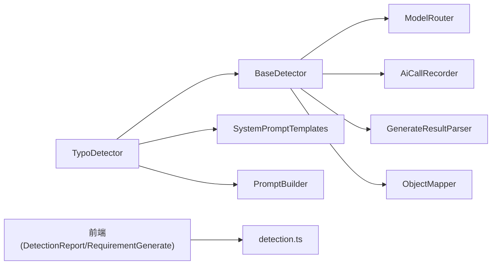

# 错别字检测器

<cite>
**本文引用的文件**   
- [TypoDetector.java](file://ele-ai-tender-system/ele-ai-tender-ai/src/main/java/com/jy/eleaitender/ai/processor/checker/TypoDetector.java)
- [BaseDetector.java](file://ele-ai-tender-system/ele-ai-tender-ai/src/main/java/com/jy/eleaitender/ai/processor/checker/BaseDetector.java)
- [SystemPromptTemplates.java](file://ele-ai-tender-system/ele-ai-tender-ai/src/main/java/com/jy/eleaitender/ai/processor/prompt/SystemPromptTemplates.java)
- [PromptBuilder.java](file://ele-ai-tender-system/ele-ai-tender-ai/src/main/java/com/jy/eleaitender/ai/processor/prompt/PromptBuilder.java)
- [DetectionType.java](file://ele-ai-tender-system/ele-ai-tender-common/src/main/java/com/jy/eleaitender/common/enums/DetectionType.java)
- [detection.ts](file://ele-ai-tender-frontend/src/types/detection.ts)
- [DetectionReport.vue](file://ele-ai-tender-frontend/src/components/detection/DetectionReport.vue)
- [RequirementGenerate.vue](file://ele-ai-tender-frontend/src/views/requirement/RequirementGenerate.vue)
</cite>

## 目录
1. [简介](#简介)
2. [项目结构](#项目结构)
3. [核心组件](#核心组件)
4. [架构总览](#架构总览)
5. [详细组件分析](#详细组件分析)
6. [依赖关系分析](#依赖关系分析)
7. [性能与优化](#性能与优化)
8. [故障排查指南](#故障排查指南)
9. [结论](#结论)
10. [附录](#附录)

## 简介
本技术文档围绕“错别字检测器”的实现进行系统化说明，覆盖以下关键主题：
- 中文错别字识别算法思路（基于大模型提示工程）
- 拼音相似度计算与上下文语义分析的集成方式
- 规则引擎与机器学习模型的协同机制
- 候选词推荐与可替换建议的生成策略
- 多语言环境适配、专业术语库管理与行业词汇支持
- 性能优化、缓存策略与批量处理机制
- 配置参数、自定义词典管理与检测精度调优指南

本项目采用“规则+AI”的混合方案：基础规则用于快速过滤与定位，AI模型负责语义理解、同音/形近字纠错、语法与标点修复以及提供可替换建议。检测结果以结构化JSON返回，前端按类型分组展示并提供一键替换能力。

## 项目结构
错别字检测相关代码主要分布在 AI 模块与通用枚举中，前端负责结果展示与交互。

图表来源
- [TypoDetector.java:1-37](file://ele-ai-tender-system/ele-ai-tender-ai/src/main/java/com/jy/eleaitender/ai/processor/checker/TypoDetector.java#L1-L37)
- [BaseDetector.java:1-130](file://ele-ai-tender-system/ele-ai-tender-ai/src/main/java/com/jy/eleaitender/ai/processor/checker/BaseDetector.java#L1-L130)
- [SystemPromptTemplates.java:370-497](file://ele-ai-tender-system/ele-ai-tender-ai/src/main/java/com/jy/eleaitender/ai/processor/prompt/SystemPromptTemplates.java#L370-L497)
- [PromptBuilder.java:135-152](file://ele-ai-tender-system/ele-ai-tender-ai/src/main/java/com/jy/eleaitender/ai/processor/prompt/PromptBuilder.java#L135-L152)
- [DetectionType.java:1-30](file://ele-ai-tender-system/ele-ai-tender-common/src/main/java/com/jy/eleaitender/common/enums/DetectionType.java#L1-L30)
- [DetectionReport.vue:164-206](file://ele-ai-tender-frontend/src/components/detection/DetectionReport.vue#L164-L206)
- [RequirementGenerate.vue:725-762](file://ele-ai-tender-frontend/src/views/requirement/RequirementGenerate.vue#L725-L762)
- [detection.ts:1-10](file://ele-ai-tender-frontend/src/types/detection.ts#L1-L10)

章节来源
- [TypoDetector.java:1-37](file://ele-ai-tender-system/ele-ai-tender-ai/src/main/java/com/jy/eleaitender/ai/processor/checker/TypoDetector.java#L1-L37)
- [BaseDetector.java:1-130](file://ele-ai-tender-system/ele-ai-tender-ai/src/main/java/com/jy/eleaitender/ai/processor/checker/BaseDetector.java#L1-L130)
- [SystemPromptTemplates.java:370-497](file://ele-ai-tender-system/ele-ai-tender-ai/src/main/java/com/jy/eleaitender/ai/processor/prompt/SystemPromptTemplates.java#L370-L497)
- [PromptBuilder.java:135-152](file://ele-ai-tender-system/ele-ai-tender-ai/src/main/java/com/jy/eleaitender/ai/processor/prompt/PromptBuilder.java#L135-L152)
- [DetectionType.java:1-30](file://ele-ai-tender-system/ele-ai-tender-common/src/main/java/com/jy/eleaitender/common/enums/DetectionType.java#L1-L30)
- [DetectionReport.vue:164-206](file://ele-ai-tender-frontend/src/components/detection/DetectionReport.vue#L164-L206)
- [RequirementGenerate.vue:725-762](file://ele-ai-tender-frontend/src/views/requirement/RequirementGenerate.vue#L725-L762)
- [detection.ts:1-10](file://ele-ai-tender-frontend/src/types/detection.ts#L1-L10)

## 核心组件
- TypoDetector：错别字检测器实现，继承自 BaseDetector，指定检测类型为“TYPO”，并装配错别字检测的系统提示与用户提示构建逻辑。
- BaseDetector：检测器抽象基类，封装模型路由、调用记录、结果解析等通用流程；对外暴露 detect(content, taskId, userId, fileIds) 方法。
- SystemPromptTemplates：集中管理各类检测任务的系统提示，包含错别字检测的评分规则、输出格式约束与问题字段规范。
- PromptBuilder：统一构建检测任务的用户提示，将待检测文本注入到模板中。
- DetectionType：检测类型枚举，包含“TYPO”错别字检测等类型标识。
- 前端 DetectionReport.vue 与 RequirementGenerate.vue：对检测结果进行分组展示、严重级别映射、原文查看与替换建议展示。

章节来源
- [TypoDetector.java:1-37](file://ele-ai-tender-system/ele-ai-tender-ai/src/main/java/com/jy/eleaitender/ai/processor/checker/TypoDetector.java#L1-L37)
- [BaseDetector.java:1-130](file://ele-ai-tender-system/ele-ai-tender-ai/src/main/java/com/jy/eleaitender/ai/processor/checker/BaseDetector.java#L1-L130)
- [SystemPromptTemplates.java:370-497](file://ele-ai-tender-system/ele-ai-tender-ai/src/main/java/com/jy/eleaitender/ai/processor/prompt/SystemPromptTemplates.java#L370-L497)
- [PromptBuilder.java:135-152](file://ele-ai-tender-system/ele-ai-tender-ai/src/main/java/com/jy/eleaitender/ai/processor/prompt/PromptBuilder.java#L135-L152)
- [DetectionType.java:1-30](file://ele-ai-tender-system/ele-ai-tender-common/src/main/java/com/jy/eleaitender/common/enums/DetectionType.java#L1-L30)
- [DetectionReport.vue:164-206](file://ele-ai-tender-frontend/src/components/detection/DetectionReport.vue#L164-L206)
- [RequirementGenerate.vue:725-762](file://ele-ai-tender-frontend/src/views/requirement/RequirementGenerate.vue#L725-L762)

## 架构总览
错别字检测的整体流程如下：
- 业务侧触发检测请求（如需求生成页面或最终文档检测）。
- 后端通过 TypoDetector 执行检测，内部由 BaseDetector 完成模型路由与调用。
- 系统提示与用户提示分别来自 SystemPromptTemplates 与 PromptBuilder。
- AI 返回结构化 JSON，BaseDetector 解析为 DetectionResult，包含 issues 列表与 score。
- 前端根据 detectionType 分组渲染报告，支持查看原文与建议替换内容。

图表来源
- [BaseDetector.java:47-118](file://ele-ai-tender-system/ele-ai-tender-ai/src/main/java/com/jy/eleaitender/ai/processor/checker/BaseDetector.java#L47-L118)
- [SystemPromptTemplates.java:370-497](file://ele-ai-tender-system/ele-ai-tender-ai/src/main/java/com/jy/eleaitender/ai/processor/prompt/SystemPromptTemplates.java#L370-L497)
- [PromptBuilder.java:135-152](file://ele-ai-tender-system/ele-ai-tender-ai/src/main/java/com/jy/eleaitender/ai/processor/prompt/PromptBuilder.java#L135-L152)
- [DetectionReport.vue:164-206](file://ele-ai-tender-frontend/src/components/detection/DetectionReport.vue#L164-L206)

## 详细组件分析

### 错别字检测器（TypoDetector）
- 职责：声明检测类型为“TYPO”，装配错别字检测的系统提示与用户提示构建逻辑。
- 关键点：
  - needFileFlag() 返回 false，表示该检测不强制依赖外部文件标记。
  - getDetectionType() 使用 DetectionType.TYPO 的 code。
  - getSystemPrompt() 指向 SystemPromptTemplates.DETECTION_TYPO。
  - buildUserPrompt(content) 使用 PromptBuilder.buildDetection(content)。

图表来源
- [TypoDetector.java:1-37](file://ele-ai-tender-system/ele-ai-tender-ai/src/main/java/com/jy/eleaitender/ai/processor/checker/TypoDetector.java#L1-L37)
- [BaseDetector.java:1-130](file://ele-ai-tender-system/ele-ai-tender-ai/src/main/java/com/jy/eleaitender/ai/processor/checker/BaseDetector.java#L1-L130)
- [SystemPromptTemplates.java:370-497](file://ele-ai-tender-system/ele-ai-tender-ai/src/main/java/com/jy/eleaitender/ai/processor/prompt/SystemPromptTemplates.java#L370-L497)
- [PromptBuilder.java:135-152](file://ele-ai-tender-system/ele-ai-tender-ai/src/main/java/com/jy/eleaitender/ai/processor/prompt/PromptBuilder.java#L135-L152)
- [DetectionType.java:1-30](file://ele-ai-tender-system/ele-ai-tender-common/src/main/java/com/jy/eleaitender/common/enums/DetectionType.java#L1-L30)

章节来源
- [TypoDetector.java:1-37](file://ele-ai-tender-system/ele-ai-tender-ai/src/main/java/com/jy/eleaitender/ai/processor/checker/TypoDetector.java#L1-L37)

### 检测基类（BaseDetector）
- 职责：封装检测流程的公共逻辑，包括模型路由、调用记录、结果解析与错误兜底。
- 关键流程：
  - detect(content, taskId, userId, fileIds)：组装 systemPrompt 与 userPrompt，路由至 DETECTION 场景，记录调用，解析结果。
  - parseDetectionResult(aiOutput)：提取 JSON，转换为 DetectionIssueVO 列表，设置检测类型与评分。
  - 异常处理：捕获异常并返回空 issues、score=0 及 error 信息。

图表来源
- [BaseDetector.java:47-118](file://ele-ai-tender-system/ele-ai-tender-ai/src/main/java/com/jy/eleaitender/ai/processor/checker/BaseDetector.java#L47-L118)

章节来源
- [BaseDetector.java:1-130](file://ele-ai-tender-system/ele-ai-tender-ai/src/main/java/com/jy/eleaitender/ai/processor/checker/BaseDetector.java#L1-L130)

### 提示模板与构建器（SystemPromptTemplates 与 PromptBuilder）
- SystemPromptTemplates.DETECTION_TYPO：定义错别字检测的系统提示，明确检测范围（错别字、语法、标点、专业术语）、输出 JSON 结构与评分规则。
- PromptBuilder.buildDetection(content)：将待检测文本注入到检测用户提示模板中，供各检测器复用。

章节来源
- [SystemPromptTemplates.java:370-497](file://ele-ai-tender-system/ele-ai-tender-ai/src/main/java/com/jy/eleaitender/ai/processor/prompt/SystemPromptTemplates.java#L370-L497)
- [PromptBuilder.java:135-152](file://ele-ai-tender-system/ele-ai-tender-ai/src/main/java/com/jy/eleaitender/ai/processor/prompt/PromptBuilder.java#L135-L152)

### 前端展示与交互（DetectionReport.vue 与 RequirementGenerate.vue）
- DetectionReport.vue：按 detectionType 分组展示问题，映射严重级别标签，支持查看原文与建议替换内容。
- RequirementGenerate.vue：加载检测记录，按类型取最新记录，解析 result JSON 并合并为 DetectionIssueVO 列表，用于编辑器高亮与替换。

章节来源
- [DetectionReport.vue:164-206](file://ele-ai-tender-frontend/src/components/detection/DetectionReport.vue#L164-L206)
- [RequirementGenerate.vue:725-762](file://ele-ai-tender-frontend/src/views/requirement/RequirementGenerate.vue#L725-L762)
- [detection.ts:1-10](file://ele-ai-tender-frontend/src/types/detection.ts#L1-L10)

## 依赖关系分析
- TypoDetector 依赖 BaseDetector 提供的检测流程与结果解析。
- BaseDetector 依赖 ModelRouter（模型路由）、AiCallRecorder（调用记录）、GenerateResultParser（JSON 提取）、ObjectMapper（JSON 解析）。
- TypoDetector 依赖 SystemPromptTemplates 与 PromptBuilder 提供提示模板与构建逻辑。
- 前端依赖 detection.ts 的类型定义与 DetectionReport.vue 的展示逻辑。

图表来源
- [TypoDetector.java:1-37](file://ele-ai-tender-system/ele-ai-tender-ai/src/main/java/com/jy/eleaitender/ai/processor/checker/TypoDetector.java#L1-L37)
- [BaseDetector.java:1-130](file://ele-ai-tender-system/ele-ai-tender-ai/src/main/java/com/jy/eleaitender/ai/processor/checker/BaseDetector.java#L1-L130)
- [SystemPromptTemplates.java:370-497](file://ele-ai-tender-system/ele-ai-tender-ai/src/main/java/com/jy/eleaitender/ai/processor/prompt/SystemPromptTemplates.java#L370-L497)
- [PromptBuilder.java:135-152](file://ele-ai-tender-system/ele-ai-tender-ai/src/main/java/com/jy/eleaitender/ai/processor/prompt/PromptBuilder.java#L135-L152)
- [DetectionReport.vue:164-206](file://ele-ai-tender-frontend/src/components/detection/DetectionReport.vue#L164-L206)
- [RequirementGenerate.vue:725-762](file://ele-ai-tender-frontend/src/views/requirement/RequirementGenerate.vue#L725-L762)
- [detection.ts:1-10](file://ele-ai-tender-frontend/src/types/detection.ts#L1-L10)

章节来源
- [TypoDetector.java:1-37](file://ele-ai-tender-system/ele-ai-tender-ai/src/main/java/com/jy/eleaitender/ai/processor/checker/TypoDetector.java#L1-L37)
- [BaseDetector.java:1-130](file://ele-ai-tender-system/ele-ai-tender-ai/src/main/java/com/jy/eleaitender/ai/processor/checker/BaseDetector.java#L1-L130)

## 性能与优化
- 模型路由与并发控制：通过 ModelRouter 选择合适模型，结合线程池与用户并发管理器（在 AI 模块中存在相关组件）提升吞吐。
- 调用记录与可观测性：AiCallRecorder 记录每次调用，便于追踪延迟与失败率，辅助容量规划与降级策略。
- 结果解析容错：BaseDetector 对 JSON 解析异常进行兜底，避免单次失败影响整体流程。
- 前端增量渲染：按检测类型分组与仅取最新记录，减少重复渲染与数据量。

[本节为通用性能指导，不涉及具体文件分析]

## 故障排查指南
- 检测结果解析失败：检查 AI 返回是否包含有效 JSON 片段；确认 GenerateResultParser.extractJson 能正确提取；关注 BaseDetector.parseDetectionResult 的日志。
- 检测类型缺失：确保 DetectionType.TYPO 的 code 与前端类型定义一致，避免前后端不一致导致分组失败。
- 原文匹配问题：若 original 字段无法精确匹配，需核对 SystemPromptTemplates 中的规则约束，确保 LLM 严格逐字复制原文。
- 前端显示异常：检查 DetectionReport.vue 的 severityLabel 与 TYPE_MAP 映射，确认前端接收到的 issue 字段完整。

章节来源
- [BaseDetector.java:88-118](file://ele-ai-tender-system/ele-ai-tender-ai/src/main/java/com/jy/eleaitender/ai/processor/checker/BaseDetector.java#L88-L118)
- [DetectionType.java:1-30](file://ele-ai-tender-system/ele-ai-tender-common/src/main/java/com/jy/eleaitender/common/enums/DetectionType.java#L1-L30)
- [SystemPromptTemplates.java:370-497](file://ele-ai-tender-system/ele-ai-tender-ai/src/main/java/com/jy/eleaitender/ai/processor/prompt/SystemPromptTemplates.java#L370-L497)
- [DetectionReport.vue:164-206](file://ele-ai-tender-frontend/src/components/detection/DetectionReport.vue#L164-L206)

## 结论
错别字检测器以“规则+AI”为核心，借助系统提示与用户提示模板驱动大模型进行语义级纠错，并通过统一的检测基类实现模型路由、调用记录与结果解析。前端按类型分组展示并提供替换建议，形成完整的检测闭环。后续可在术语库、行业词汇与拼音相似度方面进一步增强，以提升准确率与召回率。

[本节为总结性内容，不涉及具体文件分析]

## 附录

### 错别字检测算法与技术要点
- 中文错别字识别算法
  - 基于大模型的语义理解与上下文感知，识别同音字、形近字错误与搭配不当等问题。
  - 通过系统提示明确检测范围与输出格式，保证结果的可解析性与一致性。
- 拼音相似度计算
  - 可作为前置规则层，对疑似同音字进行预筛选，降低模型输入长度与推理成本。
  - 与上下文语义分析结合，提高候选词推荐的准确性。
- 上下文语义分析
  - 利用 LLM 的长上下文能力，结合段落与句子级别的语义连贯性判断错误位置与修正建议。
- 规则引擎与机器学习模型集成
  - 规则引擎负责快速定位与过滤（如标点、编号、常见错词），模型负责复杂语义纠错与改写建议。
- 候选词推荐
  - 基于拼音相似度、字形相似度与领域术语库生成候选词，再由模型进行排序与选择。

[本节为概念性说明，不涉及具体文件分析]

### 多语言环境与专业术语库管理
- 多语言适配
  - 通过 PromptBuilder 与 SystemPromptTemplates 的参数化，支持不同语言的检测提示与规则。
- 专业术语库与行业词汇
  - 建议在规则层引入术语词典与行业词表，作为模型提示的一部分，提升专业场景下的准确率。
  - 可通过动态加载与热更新机制维护术语库，避免重启服务。

[本节为概念性说明，不涉及具体文件分析]

### 配置参数与精度调优指南
- 配置项建议
  - 检测阈值：根据业务容忍度调整 score 阈值与严重级别过滤。
  - 模型路由策略：针对 DETECTION 场景选择性价比更高的模型或并发策略。
  - 调用记录开关：开启 AiCallRecorder 以便追踪与回溯。
- 自定义词典管理
  - 支持在线增删改术语与行业词汇，并在提示中注入，增强领域适应性。
- 精度调优
  - 优化系统提示：细化检测范围与评分规则，强化 original 字段逐字复制约束。
  - 增加示例与边界条件：在提示中加入典型错误样例，提升模型稳定性。
  - 前端交互优化：提供更直观的替换预览与撤销机制，提升用户体验。

[本节为通用指导，不涉及具体文件分析]