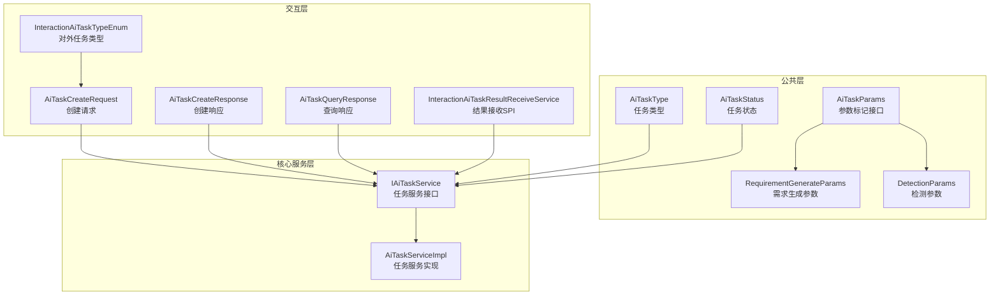
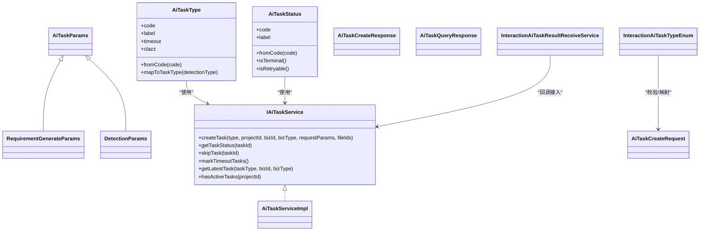
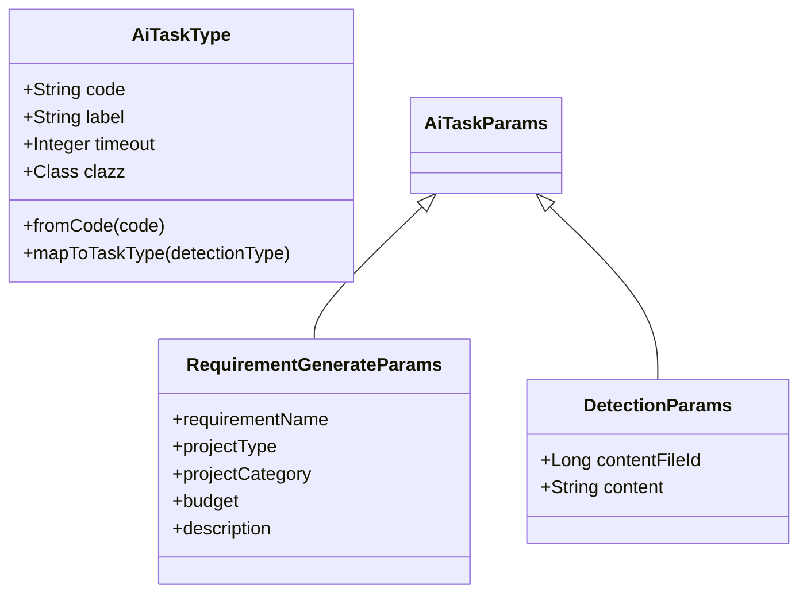
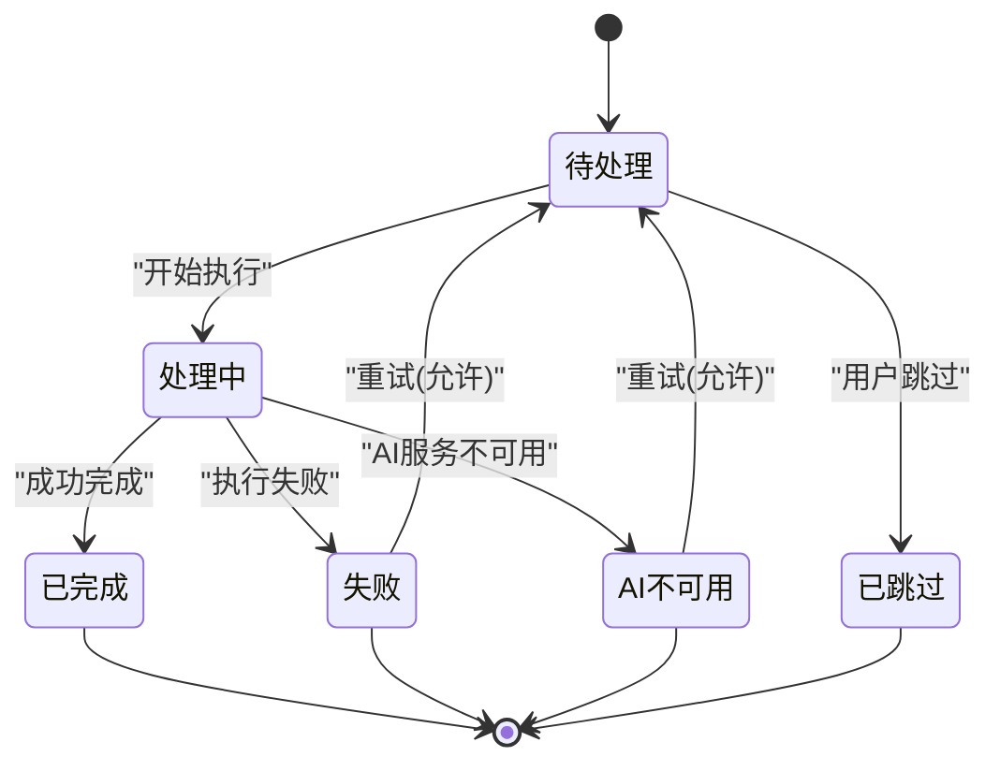
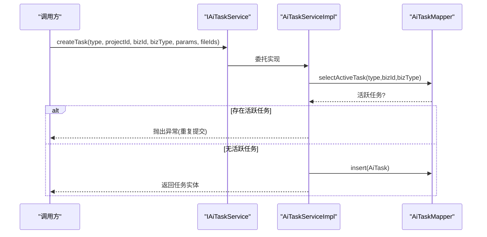
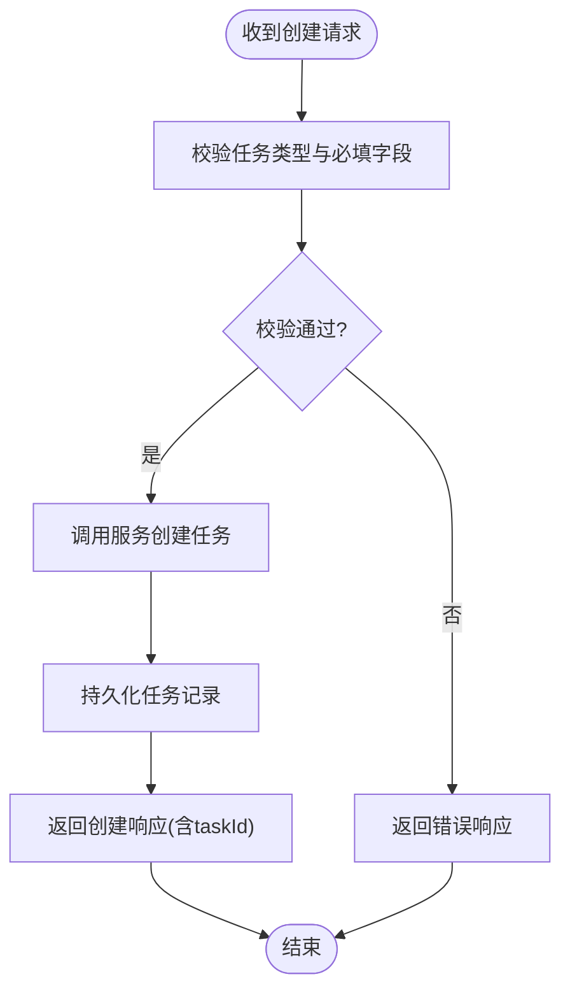
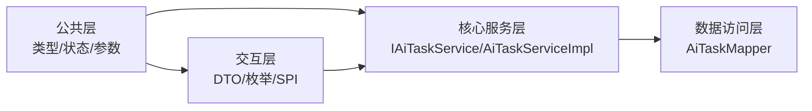

# AI任务参数系统

<cite>
**本文引用的文件**   
- [AiTaskType.java](file://ele-ai-tender-system/ele-ai-tender-common/src/main/java/com/jy/eleaitender/common/enums/AiTaskType.java)
- [AiTaskStatus.java](file://ele-ai-tender-system/ele-ai-tender-common/src/main/java/com/jy/eleaitender/common/enums/AiTaskStatus.java)
- [AiTaskParams.java](file://ele-ai-tender-system/ele-ai-tender-common/src/main/java/com/jy/eleaitender/common/dto/ai/AiTaskParams.java)
- [RequirementGenerateParams.java](file://ele-ai-tender-system/ele-ai-tender-common/src/main/java/com/jy/eleaitender/common/dto/ai/RequirementGenerateParams.java)
- [DetectionParams.java](file://ele-ai-tender-system/ele-ai-tender-common/src/main/java/com/jy/eleaitender/common/dto/ai/DetectionParams.java)
- [IAiTaskService.java](file://ele-ai-tender-system/ele-ai-tender-core/src/main/java/com/jy/eleaitender/core/service/IAiTaskService.java)
- [AiTaskServiceImpl.java](file://ele-ai-tender-system/ele-ai-tender-core/src/main/java/com/jy/eleaitender/core/service/impl/AiTaskServiceImpl.java)
- [AiTaskCreateRequest.java](file://ele-ai-tender-system/ele-ai-tender-interaction/ele-ai-tender-common-interaction/src/main/java/com/jy/eleaitender/common/interaction/dto/AiTaskCreateRequest.java)
- [AiTaskCreateResponse.java](file://ele-ai-tender-system/ele-ai-tender-interaction/ele-ai-tender-common-interaction/src/main/java/com/jy/eleaitender/common/interaction/dto/AiTaskCreateResponse.java)
- [AiTaskQueryResponse.java](file://ele-ai-tender-system/ele-ai-tender-interaction/ele-ai-tender-common-interaction/src/main/java/com/jy/eleaitender/common/interaction/dto/AiTaskQueryResponse.java)
- [InteractionAiTaskTypeEnum.java](file://ele-ai-tender-system/ele-ai-tender-interaction/ele-ai-tender-common-interaction/src/main/java/com/jy/eleaitender/common/interaction/enums/InteractionAiTaskTypeEnum.java)
- [InteractionAiTaskResultReceiveService.java](file://ele-ai-tender-system/ele-ai-tender-interaction/ele-ai-tender-common-interaction/src/main/java/com/jy/eleaitender/common/interaction/spi/InteractionAiTaskResultReceiveService.java)
</cite>

## 目录
1. [简介](#简介)
2. [项目结构](#项目结构)
3. [核心组件](#核心组件)
4. [架构总览](#架构总览)
5. [详细组件分析](#详细组件分析)
6. [依赖关系分析](#依赖关系分析)
7. [性能与扩展性](#性能与扩展性)
8. [故障排查指南](#故障排查指南)
9. [结论](#结论)
10. [附录：API契约](#附录api契约)

## 简介
本文件围绕“AI任务参数系统”进行系统化说明，聚焦于任务类型、状态机、参数模型、服务接口与对外交互协议。目标是帮助读者快速理解：
- 如何定义与扩展新的AI任务类型及其参数
- 任务生命周期与状态流转规则
- 创建、查询、跳过、超时处理等关键流程
- 外部系统与内部系统的对接方式（请求/响应/SPI）

## 项目结构
AI任务参数系统主要分布在以下模块：
- 公共枚举与DTO：定义任务类型、状态、通用参数标记接口及具体参数类
- 核心服务层：提供任务的创建、查询、跳过、超时处理等能力
- 交互层：定义对外暴露的任务创建/查询/回调的DTO与SPI

图表来源
- [AiTaskType.java:1-52](file://ele-ai-tender-system/ele-ai-tender-common/src/main/java/com/jy/eleaitender/common/enums/AiTaskType.java#L1-L52)
- [AiTaskStatus.java:1-46](file://ele-ai-tender-system/ele-ai-tender-common/src/main/java/com/jy/eleaitender/common/enums/AiTaskStatus.java#L1-L46)
- [AiTaskParams.java:1-9](file://ele-ai-tender-system/ele-ai-tender-common/src/main/java/com/jy/eleaitender/common/dto/ai/AiTaskParams.java#L1-L9)
- [RequirementGenerateParams.java:1-22](file://ele-ai-tender-system/ele-ai-tender-common/src/main/java/com/jy/eleaitender/common/dto/ai/RequirementGenerateParams.java#L1-L22)
- [DetectionParams.java:1-17](file://ele-ai-tender-system/ele-ai-tender-common/src/main/java/com/jy/eleaitender/common/dto/ai/DetectionParams.java#L1-L17)
- [IAiTaskService.java:1-44](file://ele-ai-tender-system/ele-ai-tender-core/src/main/java/com/jy/eleaitender/core/service/IAiTaskService.java#L1-L44)
- [AiTaskServiceImpl.java:1-148](file://ele-ai-tender-system/ele-ai-tender-core/src/main/java/com/jy/eleaitender/core/service/impl/AiTaskServiceImpl.java#L1-L148)
- [AiTaskCreateRequest.java:1-40](file://ele-ai-tender-system/ele-ai-tender-interaction/ele-ai-tender-common-interaction/src/main/java/com/jy/eleaitender/common/interaction/dto/AiTaskCreateRequest.java#L1-L40)
- [AiTaskCreateResponse.java:1-35](file://ele-ai-tender-system/ele-ai-tender-interaction/ele-ai-tender-common-interaction/src/main/java/com/jy/eleaitender/common/interaction/dto/AiTaskCreateResponse.java#L1-L35)
- [AiTaskQueryResponse.java:1-80](file://ele-ai-tender-system/ele-ai-tender-interaction/ele-ai-tender-common-interaction/src/main/java/com/jy/eleaitender/common/interaction/dto/AiTaskQueryResponse.java#L1-L80)
- [InteractionAiTaskTypeEnum.java:1-38](file://ele-ai-tender-system/ele-ai-tender-interaction/ele-ai-tender-common-interaction/src/main/java/com/jy/eleaitender/common/interaction/enums/InteractionAiTaskTypeEnum.java#L1-L38)
- [InteractionAiTaskResultReceiveService.java:1-13](file://ele-ai-tender-system/ele-ai-tender-interaction/ele-ai-tender-common-interaction/src/main/java/com/jy/eleaitender/common/interaction/spi/InteractionAiTaskResultReceiveService.java#L1-L13)

章节来源
- [AiTaskType.java:1-52](file://ele-ai-tender-system/ele-ai-tender-common/src/main/java/com/jy/eleaitender/common/enums/AiTaskType.java#L1-L52)
- [AiTaskStatus.java:1-46](file://ele-ai-tender-system/ele-ai-tender-common/src/main/java/com/jy/eleaitender/common/enums/AiTaskStatus.java#L1-L46)
- [AiTaskParams.java:1-9](file://ele-ai-tender-system/ele-ai-tender-common/src/main/java/com/jy/eleaitender/common/dto/ai/AiTaskParams.java#L1-L9)
- [RequirementGenerateParams.java:1-22](file://ele-ai-tender-system/ele-ai-tender-common/src/main/java/com/jy/eleaitender/common/dto/ai/RequirementGenerateParams.java#L1-L22)
- [DetectionParams.java:1-17](file://ele-ai-tender-system/ele-ai-tender-common/src/main/java/com/jy/eleaitender/common/dto/ai/DetectionParams.java#L1-L17)
- [IAiTaskService.java:1-44](file://ele-ai-tender-system/ele-ai-tender-core/src/main/java/com/jy/eleaitender/core/service/IAiTaskService.java#L1-L44)
- [AiTaskServiceImpl.java:1-148](file://ele-ai-tender-system/ele-ai-tender-core/src/main/java/com/jy/eleaitender/core/service/impl/AiTaskServiceImpl.java#L1-L148)
- [AiTaskCreateRequest.java:1-40](file://ele-ai-tender-system/ele-ai-tender-interaction/ele-ai-tender-common-interaction/src/main/java/com/jy/eleaitender/common/interaction/dto/AiTaskCreateRequest.java#L1-L40)
- [AiTaskCreateResponse.java:1-35](file://ele-ai-tender-system/ele-ai-tender-interaction/ele-ai-tender-common-interaction/src/main/java/com/jy/eleaitender/common/interaction/dto/AiTaskCreateResponse.java#L1-L35)
- [AiTaskQueryResponse.java:1-80](file://ele-ai-tender-system/ele-ai-tender-interaction/ele-ai-tender-common-interaction/src/main/java/com/jy/eleaitender/common/interaction/dto/AiTaskQueryResponse.java#L1-L80)
- [InteractionAiTaskTypeEnum.java:1-38](file://ele-ai-tender-system/ele-ai-tender-interaction/ele-ai-tender-common-interaction/src/main/java/com/jy/eleaitender/common/interaction/enums/InteractionAiTaskTypeEnum.java#L1-L38)
- [InteractionAiTaskResultReceiveService.java:1-13](file://ele-ai-tender-system/ele-ai-tender-interaction/ele-ai-tender-common-interaction/src/main/java/com/jy/eleaitender/common/interaction/spi/InteractionAiTaskResultReceiveService.java#L1-L13)

## 核心组件
- 任务类型与参数
  - AiTaskType：集中管理所有AI任务类型、默认超时时间以及对应的参数类，提供按编码查找与检测类型映射方法
  - AiTaskParams：参数标记接口，用于在编译期约束createTask的参数类型
  - RequirementGenerateParams、DetectionParams：具体任务参数示例，分别对应需求生成与检测类任务
- 任务状态
  - AiTaskStatus：定义待处理、处理中、已完成、失败、AI不可用、已跳过等状态，并提供终态判断与可重试判断
- 任务服务
  - IAiTaskService：定义创建任务、查询状态、跳过任务、标记超时、查询最新任务、检查活跃任务等能力
  - AiTaskServiceImpl：实现防重复提交、序列化参数、状态转换、超时标记等逻辑
- 交互协议
  - AiTaskCreateRequest/AiTaskCreateResponse/AiTaskQueryResponse：对外创建、创建返回、查询返回的数据结构
  - InteractionAiTaskTypeEnum：对外暴露的任务类型枚举
  - InteractionAiTaskResultReceiveService：外部系统实现以接收AI任务终态回调

章节来源
- [AiTaskType.java:1-52](file://ele-ai-tender-system/ele-ai-tender-common/src/main/java/com/jy/eleaitender/common/enums/AiTaskType.java#L1-L52)
- [AiTaskStatus.java:1-46](file://ele-ai-tender-system/ele-ai-tender-common/src/main/java/com/jy/eleaitender/common/enums/AiTaskStatus.java#L1-L46)
- [AiTaskParams.java:1-9](file://ele-ai-tender-system/ele-ai-tender-common/src/main/java/com/jy/eleaitender/common/dto/ai/AiTaskParams.java#L1-L9)
- [RequirementGenerateParams.java:1-22](file://ele-ai-tender-system/ele-ai-tender-common/src/main/java/com/jy/eleaitender/common/dto/ai/RequirementGenerateParams.java#L1-L22)
- [DetectionParams.java:1-17](file://ele-ai-tender-system/ele-ai-tender-common/src/main/java/com/jy/eleaitender/common/dto/ai/DetectionParams.java#L1-L17)
- [IAiTaskService.java:1-44](file://ele-ai-tender-system/ele-ai-tender-core/src/main/java/com/jy/eleaitender/core/service/IAiTaskService.java#L1-L44)
- [AiTaskServiceImpl.java:1-148](file://ele-ai-tender-system/ele-ai-tender-core/src/main/java/com/jy/eleaitender/core/service/impl/AiTaskServiceImpl.java#L1-L148)
- [AiTaskCreateRequest.java:1-40](file://ele-ai-tender-system/ele-ai-tender-interaction/ele-ai-tender-common-interaction/src/main/java/com/jy/eleaitender/common/interaction/dto/AiTaskCreateRequest.java#L1-L40)
- [AiTaskCreateResponse.java:1-35](file://ele-ai-tender-system/ele-ai-tender-interaction/ele-ai-tender-common-interaction/src/main/java/com/jy/eleaitender/common/interaction/dto/AiTaskCreateResponse.java#L1-L35)
- [AiTaskQueryResponse.java:1-80](file://ele-ai-tender-system/ele-ai-tender-interaction/ele-ai-tender-common-interaction/src/main/java/com/jy/eleaitender/common/interaction/dto/AiTaskQueryResponse.java#L1-L80)
- [InteractionAiTaskTypeEnum.java:1-38](file://ele-ai-tender-system/ele-ai-tender-interaction/ele-ai-tender-common-interaction/src/main/java/com/jy/eleaitender/common/interaction/enums/InteractionAiTaskTypeEnum.java#L1-L38)
- [InteractionAiTaskResultReceiveService.java:1-13](file://ele-ai-tender-system/ele-ai-tender-interaction/ele-ai-tender-common-interaction/src/main/java/com/jy/eleaitender/common/interaction/spi/InteractionAiTaskResultReceiveService.java#L1-L13)

## 架构总览
AI任务参数系统采用分层设计：
- 公共层：统一类型、状态与参数模型
- 核心服务层：封装任务生命周期与业务规则
- 交互层：面向外部系统的请求/响应与回调SPI

图表来源
- [AiTaskType.java:1-52](file://ele-ai-tender-system/ele-ai-tender-common/src/main/java/com/jy/eleaitender/common/enums/AiTaskType.java#L1-L52)
- [AiTaskStatus.java:1-46](file://ele-ai-tender-system/ele-ai-tender-common/src/main/java/com/jy/eleaitender/common/enums/AiTaskStatus.java#L1-L46)
- [AiTaskParams.java:1-9](file://ele-ai-tender-system/ele-ai-tender-common/src/main/java/com/jy/eleaitender/common/dto/ai/AiTaskParams.java#L1-L9)
- [RequirementGenerateParams.java:1-22](file://ele-ai-tender-system/ele-ai-tender-common/src/main/java/com/jy/eleaitender/common/dto/ai/RequirementGenerateParams.java#L1-L22)
- [DetectionParams.java:1-17](file://ele-ai-tender-system/ele-ai-tender-common/src/main/java/com/jy/eleaitender/common/dto/ai/DetectionParams.java#L1-L17)
- [IAiTaskService.java:1-44](file://ele-ai-tender-system/ele-ai-tender-core/src/main/java/com/jy/eleaitender/core/service/IAiTaskService.java#L1-L44)
- [AiTaskServiceImpl.java:1-148](file://ele-ai-tender-system/ele-ai-tender-core/src/main/java/com/jy/eleaitender/core/service/impl/AiTaskServiceImpl.java#L1-L148)
- [AiTaskCreateRequest.java:1-40](file://ele-ai-tender-system/ele-ai-tender-interaction/ele-ai-tender-common-interaction/src/main/java/com/jy/eleaitender/common/interaction/dto/AiTaskCreateRequest.java#L1-L40)
- [AiTaskCreateResponse.java:1-35](file://ele-ai-tender-system/ele-ai-tender-interaction/ele-ai-tender-common-interaction/src/main/java/com/jy/eleaitender/common/interaction/dto/AiTaskCreateResponse.java#L1-L35)
- [AiTaskQueryResponse.java:1-80](file://ele-ai-tender-system/ele-ai-tender-interaction/ele-ai-tender-common-interaction/src/main/java/com/jy/eleaitender/common/interaction/dto/AiTaskQueryResponse.java#L1-L80)
- [InteractionAiTaskTypeEnum.java:1-38](file://ele-ai-tender-system/ele-ai-tender-interaction/ele-ai-tender-common-interaction/src/main/java/com/jy/eleaitender/common/interaction/enums/InteractionAiTaskTypeEnum.java#L1-L38)
- [InteractionAiTaskResultReceiveService.java:1-13](file://ele-ai-tender-system/ele-ai-tender-interaction/ele-ai-tender-common-interaction/src/main/java/com/jy/eleaitender/common/interaction/spi/InteractionAiTaskResultReceiveService.java#L1-L13)

## 详细组件分析

### 任务类型与参数模型
- 任务类型
  - 通过AiTaskType统一管理，包含编码、标签、默认超时与参数类引用
  - 提供从编码反查类型的方法，并支持将检测类型映射为内部任务类型
- 参数模型
  - AiTaskParams作为标记接口，确保createTask在编译期对参数类型进行约束
  - RequirementGenerateParams用于需求生成场景
  - DetectionParams用于各类检测任务（敏感词、错别字、政策审查、格式规范），支持内容文件或文本二选一

图表来源
- [AiTaskType.java:1-52](file://ele-ai-tender-system/ele-ai-tender-common/src/main/java/com/jy/eleaitender/common/enums/AiTaskType.java#L1-L52)
- [AiTaskParams.java:1-9](file://ele-ai-tender-system/ele-ai-tender-common/src/main/java/com/jy/eleaitender/common/dto/ai/AiTaskParams.java#L1-L9)
- [RequirementGenerateParams.java:1-22](file://ele-ai-tender-system/ele-ai-tender-common/src/main/java/com/jy/eleaitender/common/dto/ai/RequirementGenerateParams.java#L1-L22)
- [DetectionParams.java:1-17](file://ele-ai-tender-system/ele-ai-tender-common/src/main/java/com/jy/eleaitender/common/dto/ai/DetectionParams.java#L1-L17)

章节来源
- [AiTaskType.java:1-52](file://ele-ai-tender-system/ele-ai-tender-common/src/main/java/com/jy/eleaitender/common/enums/AiTaskType.java#L1-L52)
- [AiTaskParams.java:1-9](file://ele-ai-tender-system/ele-ai-tender-common/src/main/java/com/jy/eleaitender/common/dto/ai/AiTaskParams.java#L1-L9)
- [RequirementGenerateParams.java:1-22](file://ele-ai-tender-system/ele-ai-tender-common/src/main/java/com/jy/eleaitender/common/dto/ai/RequirementGenerateParams.java#L1-L22)
- [DetectionParams.java:1-17](file://ele-ai-tender-system/ele-ai-tender-common/src/main/java/com/jy/eleaitender/common/dto/ai/DetectionParams.java#L1-L17)

### 任务状态机
- 状态集合：待处理、处理中、已完成、失败、AI不可用、已跳过
- 终态判定：已完成、失败、AI不可用、已跳过
- 可重试判定：失败、AI不可用

图表来源
- [AiTaskStatus.java:1-46](file://ele-ai-tender-system/ele-ai-tender-common/src/main/java/com/jy/eleaitender/common/enums/AiTaskStatus.java#L1-L46)

章节来源
- [AiTaskStatus.java:1-46](file://ele-ai-tender-system/ele-ai-tender-common/src/main/java/com/jy/eleaitender/common/enums/AiTaskStatus.java#L1-L46)

### 任务服务接口与实现
- 接口能力
  - 创建任务：传入任务类型、项目ID、业务ID/类型、参数对象与关联文件ID列表
  - 查询任务状态：根据任务ID返回视图对象
  - 跳过任务：将当前非终态或允许跳过的任务置为已跳过
  - 标记超时：定时任务调用，将超时任务标记为AI不可用
  - 查询最新任务：按任务类型+业务标识获取最近一次任务
  - 检查活跃任务：判断项目下是否存在待处理/处理中的任务
- 实现要点
  - 防重复提交：同一业务同一类型存在活跃任务时拒绝创建
  - 参数序列化：将参数对象序列化为JSON字符串持久化
  - 状态转换：在VO转换时解析类型与状态的中文名称
  - 事务控制：创建与跳过操作具备事务保障

图表来源
- [IAiTaskService.java:1-44](file://ele-ai-tender-system/ele-ai-tender-core/src/main/java/com/jy/eleaitender/core/service/IAiTaskService.java#L1-L44)
- [AiTaskServiceImpl.java:1-148](file://ele-ai-tender-system/ele-ai-tender-core/src/main/java/com/jy/eleaitender/core/service/impl/AiTaskServiceImpl.java#L1-L148)

章节来源
- [IAiTaskService.java:1-44](file://ele-ai-tender-system/ele-ai-tender-core/src/main/java/com/jy/eleaitender/core/service/IAiTaskService.java#L1-L44)
- [AiTaskServiceImpl.java:1-148](file://ele-ai-tender-system/ele-ai-tender-core/src/main/java/com/jy/eleaitender/core/service/impl/AiTaskServiceImpl.java#L1-L148)

### 对外交互协议
- 创建任务请求
  - 字段：任务类型、业务ID、业务类型、请求参数(JSON)、关联文件ID列表
- 创建任务响应
  - 字段：任务ID、任务类型、任务状态、创建时间
- 查询任务响应
  - 字段：任务ID、任务类型、业务ID/类型、状态与状态名、结果(JSON)、错误信息、重试次数/上限、开始/完成/创建时间
- 对外任务类型枚举
  - 与内部任务类型保持一致，便于外部系统识别
- 结果回调SPI
  - 外部系统实现该接口，接收AI任务终态结果回调

图表来源
- [AiTaskCreateRequest.java:1-40](file://ele-ai-tender-system/ele-ai-tender-interaction/ele-ai-tender-common-interaction/src/main/java/com/jy/eleaitender/common/interaction/dto/AiTaskCreateRequest.java#L1-L40)
- [AiTaskCreateResponse.java:1-35](file://ele-ai-tender-system/ele-ai-tender-interaction/ele-ai-tender-common-interaction/src/main/java/com/jy/eleaitender/common/interaction/dto/AiTaskCreateResponse.java#L1-L35)
- [AiTaskQueryResponse.java:1-80](file://ele-ai-tender-system/ele-ai-tender-interaction/ele-ai-tender-common-interaction/src/main/java/com/jy/eleaitender/common/interaction/dto/AiTaskQueryResponse.java#L1-L80)
- [InteractionAiTaskTypeEnum.java:1-38](file://ele-ai-tender-system/ele-ai-tender-interaction/ele-ai-tender-common-interaction/src/main/java/com/jy/eleaitender/common/interaction/enums/InteractionAiTaskTypeEnum.java#L1-L38)
- [InteractionAiTaskResultReceiveService.java:1-13](file://ele-ai-tender-system/ele-ai-tender-interaction/ele-ai-tender-common-interaction/src/main/java/com/jy/eleaitender/common/interaction/spi/InteractionAiTaskResultReceiveService.java#L1-L13)

章节来源
- [AiTaskCreateRequest.java:1-40](file://ele-ai-tender-system/ele-ai-tender-interaction/ele-ai-tender-common-interaction/src/main/java/com/jy/eleaitender/common/interaction/dto/AiTaskCreateRequest.java#L1-L40)
- [AiTaskCreateResponse.java:1-35](file://ele-ai-tender-system/ele-ai-tender-interaction/ele-ai-tender-common-interaction/src/main/java/com/jy/eleaitender/common/interaction/dto/AiTaskCreateResponse.java#L1-L35)
- [AiTaskQueryResponse.java:1-80](file://ele-ai-tender-system/ele-ai-tender-interaction/ele-ai-tender-common-interaction/src/main/java/com/jy/eleaitender/common/interaction/dto/AiTaskQueryResponse.java#L1-L80)
- [InteractionAiTaskTypeEnum.java:1-38](file://ele-ai-tender-system/ele-ai-tender-interaction/ele-ai-tender-common-interaction/src/main/java/com/jy/eleaitender/common/interaction/enums/InteractionAiTaskTypeEnum.java#L1-L38)
- [InteractionAiTaskResultReceiveService.java:1-13](file://ele-ai-tender-system/ele-ai-tender-interaction/ele-ai-tender-common-interaction/src/main/java/com/jy/eleaitender/common/interaction/spi/InteractionAiTaskResultReceiveService.java#L1-L13)

## 依赖关系分析
- 低耦合高内聚
  - 公共层仅定义类型、状态与参数，不依赖服务实现
  - 核心服务层依赖公共层，并通过Mapper访问数据
  - 交互层通过DTO与SPI与外部系统解耦
- 直接依赖
  - AiTaskServiceImpl依赖AiTaskType与AiTaskStatus进行参数与状态处理
  - 对外DTO与枚举独立于内部实现，便于跨进程通信
- 潜在循环依赖
  - 当前结构未发现循环依赖；如需扩展，建议新增参数类并注册到AiTaskType，避免在服务层硬编码

图表来源
- [AiTaskType.java:1-52](file://ele-ai-tender-system/ele-ai-tender-common/src/main/java/com/jy/eleaitender/common/enums/AiTaskType.java#L1-L52)
- [AiTaskStatus.java:1-46](file://ele-ai-tender-system/ele-ai-tender-common/src/main/java/com/jy/eleaitender/common/enums/AiTaskStatus.java#L1-L46)
- [IAiTaskService.java:1-44](file://ele-ai-tender-system/ele-ai-tender-core/src/main/java/com/jy/eleaitender/core/service/IAiTaskService.java#L1-L44)
- [AiTaskServiceImpl.java:1-148](file://ele-ai-tender-system/ele-ai-tender-core/src/main/java/com/jy/eleaitender/core/service/impl/AiTaskServiceImpl.java#L1-L148)
- [AiTaskCreateRequest.java:1-40](file://ele-ai-tender-system/ele-ai-tender-interaction/ele-ai-tender-common-interaction/src/main/java/com/jy/eleaitender/common/interaction/dto/AiTaskCreateRequest.java#L1-L40)
- [AiTaskCreateResponse.java:1-35](file://ele-ai-tender-system/ele-ai-tender-interaction/ele-ai-tender-common-interaction/src/main/java/com/jy/eleaitender/common/interaction/dto/AiTaskCreateResponse.java#L1-L35)
- [AiTaskQueryResponse.java:1-80](file://ele-ai-tender-system/ele-ai-tender-interaction/ele-ai-tender-common-interaction/src/main/java/com/jy/eleaitender/common/interaction/dto/AiTaskQueryResponse.java#L1-L80)
- [InteractionAiTaskTypeEnum.java:1-38](file://ele-ai-tender-system/ele-ai-tender-interaction/ele-ai-tender-common-interaction/src/main/java/com/jy/eleaitender/common/interaction/enums/InteractionAiTaskTypeEnum.java#L1-L38)
- [InteractionAiTaskResultReceiveService.java:1-13](file://ele-ai-tender-system/ele-ai-tender-interaction/ele-ai-tender-common-interaction/src/main/java/com/jy/eleaitender/common/interaction/spi/InteractionAiTaskResultReceiveService.java#L1-L13)

章节来源
- [AiTaskType.java:1-52](file://ele-ai-tender-system/ele-ai-tender-common/src/main/java/com/jy/eleaitender/common/enums/AiTaskType.java#L1-L52)
- [AiTaskStatus.java:1-46](file://ele-ai-tender-system/ele-ai-tender-common/src/main/java/com/jy/eleaitender/common/enums/AiTaskStatus.java#L1-L46)
- [IAiTaskService.java:1-44](file://ele-ai-tender-system/ele-ai-tender-core/src/main/java/com/jy/eleaitender/core/service/IAiTaskService.java#L1-L44)
- [AiTaskServiceImpl.java:1-148](file://ele-ai-tender-system/ele-ai-tender-core/src/main/java/com/jy/eleaitender/core/service/impl/AiTaskServiceImpl.java#L1-L148)
- [AiTaskCreateRequest.java:1-40](file://ele-ai-tender-system/ele-ai-tender-interaction/ele-ai-tender-common-interaction/src/main/java/com/jy/eleaitender/common/interaction/dto/AiTaskCreateRequest.java#L1-L40)
- [AiTaskCreateResponse.java:1-35](file://ele-ai-tender-system/ele-ai-tender-interaction/ele-ai-tender-common-interaction/src/main/java/com/jy/eleaitender/common/interaction/dto/AiTaskCreateResponse.java#L1-L35)
- [AiTaskQueryResponse.java:1-80](file://ele-ai-tender-system/ele-ai-tender-interaction/ele-ai-tender-common-interaction/src/main/java/com/jy/eleaitender/common/interaction/dto/AiTaskQueryResponse.java#L1-L80)
- [InteractionAiTaskTypeEnum.java:1-38](file://ele-ai-tender-system/ele-ai-tender-interaction/ele-ai-tender-common-interaction/src/main/java/com/jy/eleaitender/common/interaction/enums/InteractionAiTaskTypeEnum.java#L1-L38)
- [InteractionAiTaskResultReceiveService.java:1-13](file://ele-ai-tender-system/ele-ai-tender-interaction/ele-ai-tender-common-interaction/src/main/java/com/jy/eleaitender/common/interaction/spi/InteractionAiTaskResultReceiveService.java#L1-L13)

## 性能与扩展性
- 并发与幂等
  - 通过“同一业务同一类型不允许活跃任务”的规则防止重复提交，降低并发冲突风险
- 超时与重试
  - 每个任务类型自带默认超时分钟数；服务提供标记超时任务的能力，结合状态机的可重试判定，便于后续引入重试策略
- 可扩展性
  - 新增任务类型：在AiTaskType中注册新类型与默认超时，并实现对应参数类
  - 新增参数类：实现AiTaskParams接口，保持编译期约束
  - 对外扩展：在InteractionAiTaskTypeEnum中同步新增类型，保证内外一致

[本节为通用指导，无需列出章节来源]

## 故障排查指南
- 常见错误
  - 重复提交：当同一业务同一类型存在活跃任务时，创建会失败
  - 任务不存在：查询或跳过任务时若任务ID无效，会抛出未找到异常
  - 状态不支持：对处于终态且不允许跳过的任务执行跳过操作会报错
- 定位建议
  - 查看任务状态是否为终态，确认是否允许重试或跳过
  - 核对任务类型与业务标识是否正确
  - 检查参数序列化是否成功（失败时会降级为空对象）

章节来源
- [AiTaskServiceImpl.java:1-148](file://ele-ai-tender-system/ele-ai-tender-core/src/main/java/com/jy/eleaitender/core/service/impl/AiTaskServiceImpl.java#L1-L148)

## 结论
AI任务参数系统通过统一的类型与状态模型、清晰的服务边界与对外交互协议，实现了高内聚、低耦合的任务管理能力。新增任务类型与参数的成本较低，同时提供了防重、超时与可重试的基础能力，适合在复杂业务流程中稳定运行。

[本节为总结性内容，无需列出章节来源]

## 附录：API契约
- 创建任务
  - 请求体：AiTaskCreateRequest
  - 响应体：AiTaskCreateResponse
- 查询任务
  - 响应体：AiTaskQueryResponse
- 回调接收
  - SPI：InteractionAiTaskResultReceiveService.receive(request)

章节来源
- [AiTaskCreateRequest.java:1-40](file://ele-ai-tender-system/ele-ai-tender-interaction/ele-ai-tender-common-interaction/src/main/java/com/jy/eleaitender/common/interaction/dto/AiTaskCreateRequest.java#L1-L40)
- [AiTaskCreateResponse.java:1-35](file://ele-ai-tender-system/ele-ai-tender-interaction/ele-ai-tender-common-interaction/src/main/java/com/jy/eleaitender/common/interaction/dto/AiTaskCreateResponse.java#L1-L35)
- [AiTaskQueryResponse.java:1-80](file://ele-ai-tender-system/ele-ai-tender-interaction/ele-ai-tender-common-interaction/src/main/java/com/jy/eleaitender/common/interaction/dto/AiTaskQueryResponse.java#L1-L80)
- [InteractionAiTaskResultReceiveService.java:1-13](file://ele-ai-tender-system/ele-ai-tender-interaction/ele-ai-tender-common-interaction/src/main/java/com/jy/eleaitender/common/interaction/spi/InteractionAiTaskResultReceiveService.java#L1-L13)