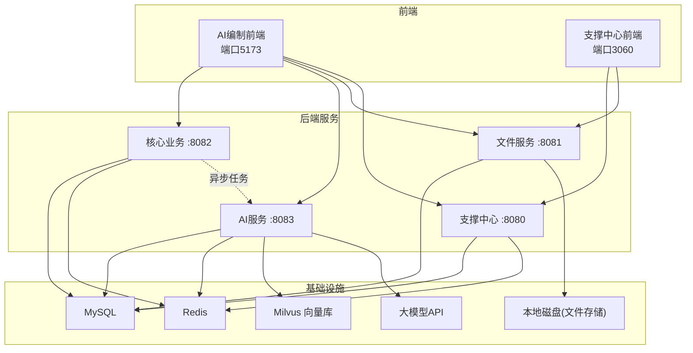
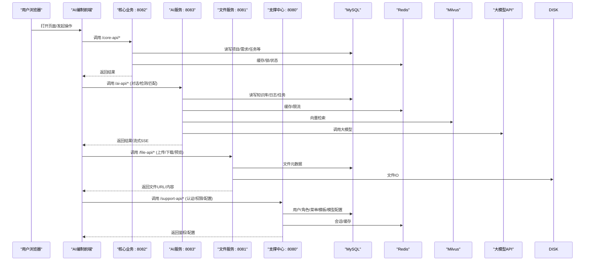
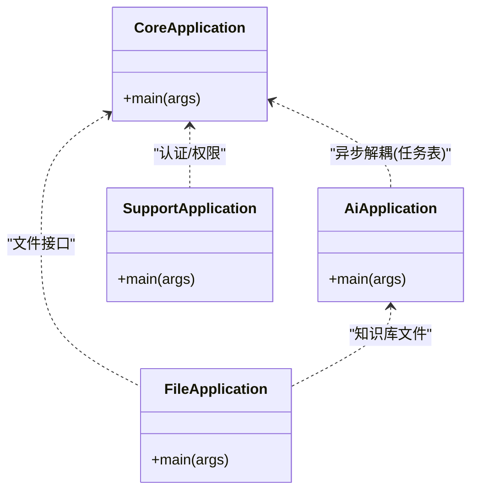
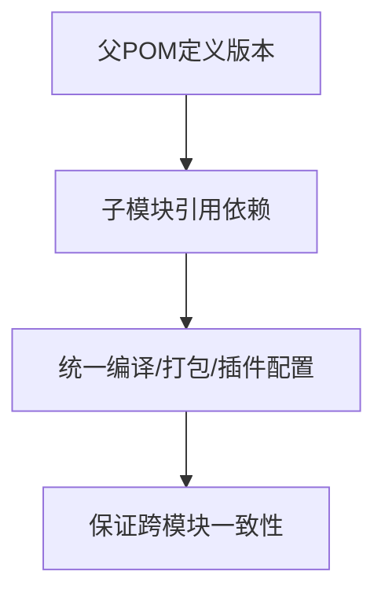
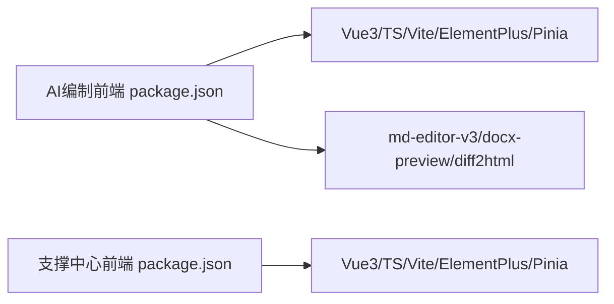
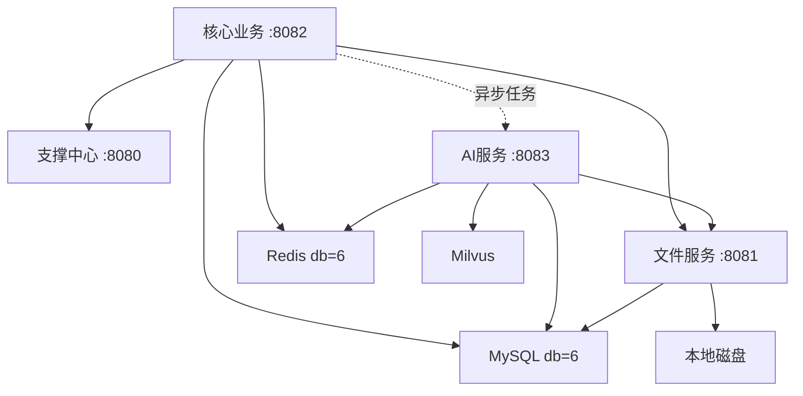

# AI任务管理系统

<cite>
**本文引用的文件**   
- [CLAUDE.md](file://CLAUDE.md)
- [ele-ai-tender-system/pom.xml](file://ele-ai-tender-system/pom.xml)
- [ele-ai-tender-frontend/package.json](file://ele-ai-tender-frontend/package.json)
- [ele-ai-tender-support-frontend/package.json](file://ele-ai-tender-support-frontend/package.json)
- [ele-ai-tender-core/src/main/java/com/jy/eleaitender/core/CoreApplication.java](file://ele-ai-tender-core/src/main/java/com/jy/eleaitender/core/CoreApplication.java)
- [ele-ai-tender-ai/src/main/java/com/jy/eleaitender/ai/AiApplication.java](file://ele-ai-tender-ai/src/main/java/com/jy/eleaitender/ai/AiApplication.java)
- [ele-ai-tender-support/src/main/java/com/jy/eleaitender/support/SupportApplication.java](file://ele-ai-tender-support/src/main/java/com/jy/eleaitender/support/SupportApplication.java)
- [ele-ai-tender-file/src/main/java/com/jy/eleaitender/file/FileApplication.java](file://ele-ai-tender-file/src/main/java/com/jy/eleaitender/file/FileApplication.java)
</cite>

## 目录
1. [简介](#简介)
2. [项目结构](#项目结构)
3. [核心组件](#核心组件)
4. [架构总览](#架构总览)
5. [详细组件分析](#详细组件分析)
6. [依赖关系分析](#依赖关系分析)
7. [性能考虑](#性能考虑)
8. [故障排查指南](#故障排查指南)
9. [结论](#结论)
10. [附录](#附录)

## 简介
本系统为“招标文件AI编制工具”，支持独立部署与嵌入第三方平台，提供项目管理、需求编制、智能检测、文档生成、知识库与模型路由等能力。后端采用Spring Boot 3.2.2 + MyBatis-Plus 3.5.5 + MySQL 8.4.0；AI侧集成Spring AI 1.1.0、Milvus向量库、Apache Tika、poi-tl、flexmark-java等；前端包含两个Vue 3应用：支撑中心管理后台与AI编制业务前端。

## 项目结构
仓库采用前后端分离与多模块后端架构：
- 前端
  - ele-ai-tender-frontend：AI编制业务前端（端口5173）
  - ele-ai-tender-support-frontend：支撑中心管理后台（端口3060）
- 后端（Maven多模块）
  - ele-ai-tender-common：公共实体、工具类、异常、统一响应
  - ele-ai-tender-common-interaction：交互协议DTO/SPI/路径常量
  - ele-ai-tender-interaction：业务系统接入Starter（core/autoconfigure/starter）
  - ele-ai-tender-support：认证、用户、角色、菜单、模板配置、知识库配置、模型配置与路由、系统参数、政策文件、消息通知、统计分析、访问/操作日志、版本管理（:8080）
  - ele-ai-tender-file：文件上传/下载/查询/删除、文档生成（Markdown→Word引擎）（:8081）
  - ele-ai-tender-core：项目管理、业务需求编制、AI编制任务、AI内容反馈、检测管理、评审项管理、文档集成、用户消息、政策文件（用户级）、项目模板快照（:8082）
  - ele-ai-tender-ai：AI对话、知识库管理、文档匹配、智能检测、模型路由、模型连通性测试（:8083）

图表来源
- [CLAUDE.md](file://CLAUDE.md)

章节来源
- [CLAUDE.md](file://CLAUDE.md)

## 核心组件
- 启动入口
  - 核心业务：CoreApplication
  - AI服务：AiApplication
  - 支撑中心：SupportApplication
  - 文件服务：FileApplication
- 技术栈与依赖治理
  - 父POM集中管理Spring Boot、MyBatis-Plus、JWT、Hutool、MySQL、Lombok、SpringDoc、Redisson、Spring AI、Milvus、Tika、poi-tl、flexmark等版本
- 前端工程
  - AI编制前端与支撑中心前端均基于Vue 3 + TypeScript + Vite + Element Plus + Pinia

章节来源
- [ele-ai-tender-core/src/main/java/com/jy/eleaitender/core/CoreApplication.java](file://ele-ai-tender-core/src/main/java/com/jy/eleaitender/core/CoreApplication.java)
- [ele-ai-tender-ai/src/main/java/com/jy/eleaitender/ai/AiApplication.java](file://ele-ai-tender-ai/src/main/java/com/jy/eleaitender/ai/AiApplication.java)
- [ele-ai-tender-support/src/main/java/com/jy/eleaitender/support/SupportApplication.java](file://ele-ai-tender-support/src/main/java/com/jy/eleaitender/support/SupportApplication.java)
- [ele-ai-tender-file/src/main/java/com/jy/eleaitender/file/FileApplication.java](file://ele-ai-tender-file/src/main/java/com/jy/eleaitender/file/FileApplication.java)
- [ele-ai-tender-system/pom.xml](file://ele-ai-tender-system/pom.xml)
- [ele-ai-tender-frontend/package.json](file://ele-ai-tender-frontend/package.json)
- [ele-ai-tender-support-frontend/package.json](file://ele-ai-tender-support-frontend/package.json)

## 架构总览
请求链路与服务职责
- 浏览器 → 支撑中心前端(3060)
  - /support-api/* → rewrite(/api/*) → 支撑中心:8080 → MySQL(db=6)+Redis(db=6)
  - /file-api/* → 直接转发 → 文件服务:8081 → MySQL(db=6)+本地磁盘
- 浏览器 → AI编制前端(5173)
  - /core-api/* → rewrite(/api/*) → 核心业务:8082 → MySQL(db=6)+Redis(db=6)
  - /ai-api/* → rewrite(/api/*) → AI服务:8083 → MySQL(db=6)+Redis(db=6)+Milvus+大模型API
  - /file-api/* → rewrite(/api/*) → 文件服务:8081 → MySQL(db=6)+本地磁盘
  - /support-api/* → rewrite(/api/*) → 支撑中心:8080 → MySQL(db=6)+Redis(db=6)
- 业务系统 → Interaction Starter → /api/eleAiTender/interaction/*

图表来源
- [CLAUDE.md](file://CLAUDE.md)

章节来源
- [CLAUDE.md](file://CLAUDE.md)

## 详细组件分析

### 启动与装配
- 各服务通过独立的Spring Boot启动类完成扫描与初始化，启用定时任务（@EnableScheduling），并指定Mapper扫描包范围。
- 核心业务与AI服务在启动时打印服务名，便于运维识别。

图表来源
- [ele-ai-tender-core/src/main/java/com/jy/eleaitender/core/CoreApplication.java](file://ele-ai-tender-core/src/main/java/com/jy/eleaitender/core/CoreApplication.java)
- [ele-ai-tender-ai/src/main/java/com/jy/eleaitender/ai/AiApplication.java](file://ele-ai-tender-ai/src/main/java/com/jy/eleaitender/ai/AiApplication.java)
- [ele-ai-tender-support/src/main/java/com/jy/eleaitender/support/SupportApplication.java](file://ele-ai-tender-support/src/main/java/com/jy/eleaitender/support/SupportApplication.java)
- [ele-ai-tender-file/src/main/java/com/jy/eleaitender/file/FileApplication.java](file://ele-ai-tender-file/src/main/java/com/jy/eleaitender/file/FileApplication.java)

章节来源
- [ele-ai-tender-core/src/main/java/com/jy/eleaitender/core/CoreApplication.java](file://ele-ai-tender-core/src/main/java/com/jy/eleaitender/core/CoreApplication.java)
- [ele-ai-tender-ai/src/main/java/com/jy/eleaitender/ai/AiApplication.java](file://ele-ai-tender-ai/src/main/java/com/jy/eleaitender/ai/AiApplication.java)
- [ele-ai-tender-support/src/main/java/com/jy/eleaitender/support/SupportApplication.java](file://ele-ai-tender-support/src/main/java/com/jy/eleaitender/support/SupportApplication.java)
- [ele-ai-tender-file/src/main/java/com/jy/eleaitender/file/FileApplication.java](file://ele-ai-tender-file/src/main/java/com/jy/eleaitender/file/FileApplication.java)

### 构建与依赖治理
- 父POM统一管理所有子模块与外部依赖版本，确保编译一致性与可维护性。
- 关键依赖包括Spring Boot 3.2.2、MyBatis-Plus 3.5.5、JJWT 0.12.5、Hutool 5.8.25、MySQL 8.4.0、Lombok 1.18.34、SpringDoc 2.3.0、Redisson 3.27.2、Spring AI 1.1.0、Milvus SDK 2.3.3、Apache Tika 2.9.0、poi-tl 1.12.2、flexmark 0.64.0等。

图表来源
- [ele-ai-tender-system/pom.xml](file://ele-ai-tender-system/pom.xml)

章节来源
- [ele-ai-tender-system/pom.xml](file://ele-ai-tender-system/pom.xml)

### 前端工程概览
- AI编制前端与支撑中心前端均采用Vue 3 + TypeScript + Vite + Element Plus + Pinia，脚本命令支持dev/build/test/local等多环境。
- 依赖差异：AI编制前端额外引入md-editor-v3、docx-preview、diff2html等用于文档编辑与对比预览。

图表来源
- [ele-ai-tender-frontend/package.json](file://ele-ai-tender-frontend/package.json)
- [ele-ai-tender-support-frontend/package.json](file://ele-ai-tender-support-frontend/package.json)

章节来源
- [ele-ai-tender-frontend/package.json](file://ele-ai-tender-frontend/package.json)
- [ele-ai-tender-support-frontend/package.json](file://ele-ai-tender-support-frontend/package.json)

### 业务流程要点（概念性说明）
- 项目状态流转：DRAFT → IN_PROGRESS → PENDING_DETECTION → DETECTING → DETECTION_PASSED/DETENTION_FAILED/DETENTION_SKIPPED → PUBLISHED → ARCHIVED/CANCELLED
- 编制阶段流转：BASIC_INFO(1) → REQUIREMENT(2) → REVIEW_ITEM(3) → DOCUMENT(4) → DETECTION(5)，由阶段流程控制器管控
- 项目-需求关系：进入需求阶段时复制需求内容到项目字段，后续阶段从项目字段读取
- 检测类型：敏感词、错别字、政策文件审查、格式规范检测；仅检测系统生成的招标需求内容与评审项标准纯文本
- 需求生成模式：三步式Agent编排（大纲→分章并行→审查修订），通过ai_task.result渐进推送进度，全文硬约束5000字内
- 评审类型：符合性审查、技术标评审、资信标评审、商务评审

[本节为概念性说明，不直接分析具体源码文件]

## 依赖关系分析
- 服务间调用关系
  - core → support：用户认证、权限校验
  - core → file：文件上传/下载
  - ai → file：知识库文件管理
  - core ↔ ai：通过ai_task表异步解耦（core写入任务 → 处理器轮询执行 → core读取结果），无直接HTTP调用
- 数据库与中间件
  - MySQL：db=6
  - Redis：db=6
  - Milvus：向量检索
  - 本地磁盘：文件存储

图表来源
- [CLAUDE.md](file://CLAUDE.md)

章节来源
- [CLAUDE.md](file://CLAUDE.md)

## 性能考虑
- 线程池与并发控制：AI服务提供动态线程池管理与用户并发度控制，避免大模型调用阻塞主线程
- 异步解耦：core与ai通过任务表异步协作，降低耦合与峰值压力
- 缓存与锁：Redis用于热点数据缓存与分布式锁，减少重复计算与竞争
- 文档处理：使用poi-tl与flexmark进行高效渲染与转换，结合内存优化策略避免OOM
- 流式响应：AI对话与长任务采用SSE流式输出，提升用户体验与资源利用率

[本节为通用指导，不直接分析具体源码文件]

## 故障排查指南
- 启动问题
  - 确认JDK版本为21，且在各子模块目录下执行mvn spring-boot:run
  - 首次或公共模块变更后需先install common，再对各依赖模块clean compile
- 端口冲突
  - 支撑中心:8080、文件服务:8081、核心业务:8082、AI服务:8083
- 依赖不一致
  - 修改common后必须重新install，并在依赖模块执行clean compile，避免运行时找不到符号
- 重启流程
  - kill全部进程 → install common → 各模块clean compile → 按顺序启动（support/file可并行，core/ai可并行）
- 前端构建
  - npm run build前检查依赖安装与环境变量，必要时切换mode（localdev/test）

章节来源
- [CLAUDE.md](file://CLAUDE.md)

## 结论
本系统以清晰的分层与模块化设计实现招标文件AI编制的端到端能力：支撑中心负责基础治理，文件服务专注文档与模板渲染，核心业务编排项目与需求生命周期并通过任务表与AI服务异步协作，AI服务承载对话、检测、匹配与模型路由。配合双前端与完善的依赖治理，系统在可维护性、扩展性与性能方面具备良好基础。

## 附录
- 环境变量覆盖：SPRING_DATASOURCE_PASSWORD、SPRING_REDIS_PASSWORD、APP_JWT_SECRET、DEEPSEEK_API_KEY、LOCAL_MODEL_KEY
- 本地配置覆盖：spring.config.import: optional:file:${user.home}/.ele-ai-tender/{module}-local.yml
- 链路追踪：X-Trace-Id传播，MDC键traceId
- 默认管理员：admin / 123456

章节来源
- [CLAUDE.md](file://CLAUDE.md)