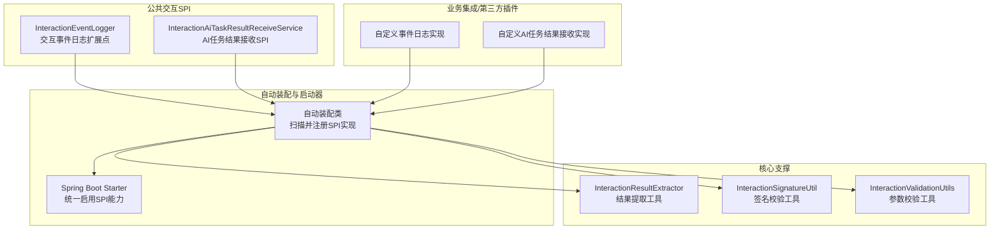
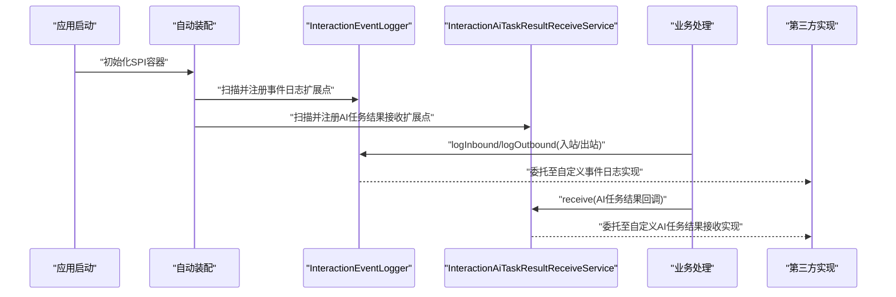
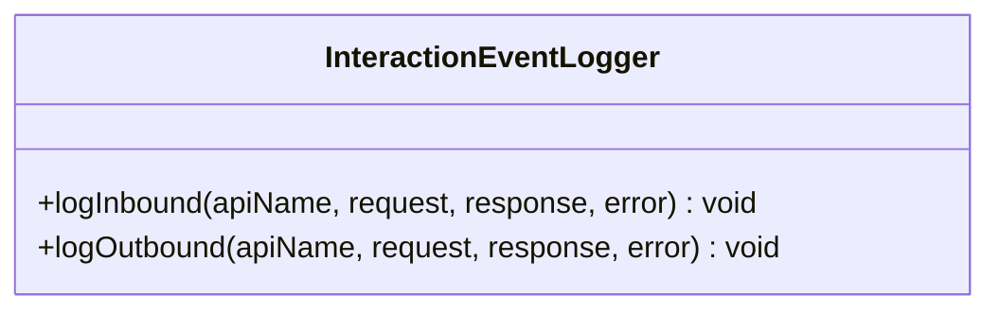
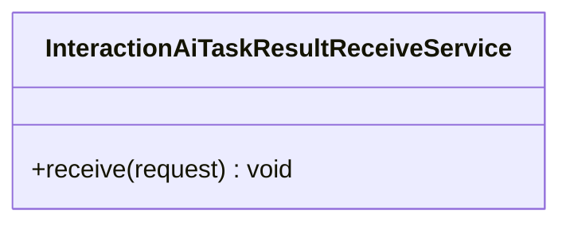
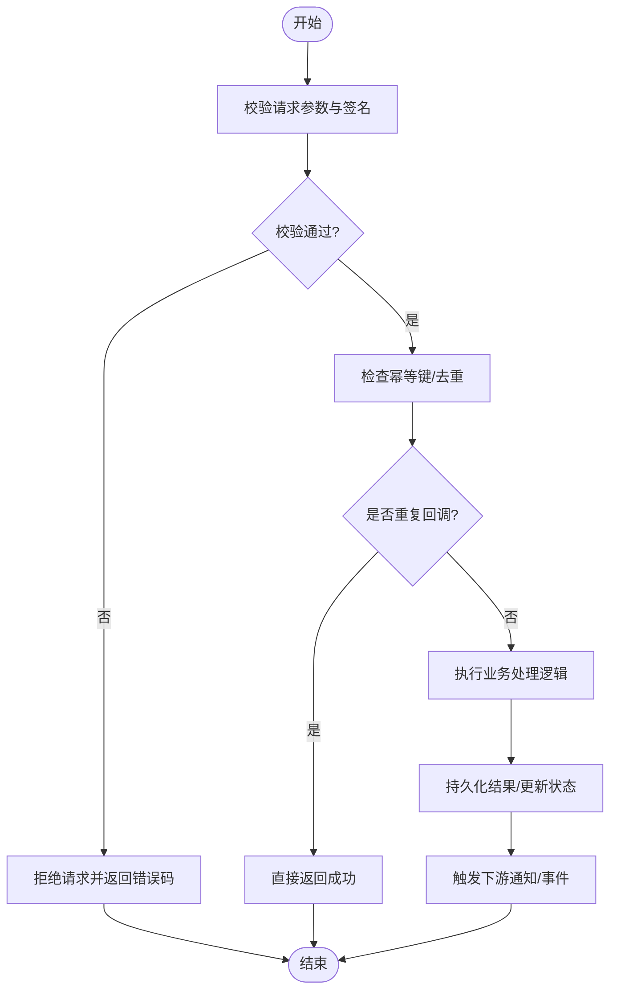
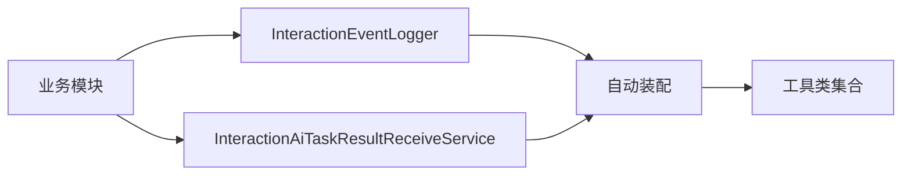

# SPI插件架构

<cite>
**本文引用的文件**   
- [InteractionEventLogger.java](file://ele-ai-tender-system/ele-ai-tender-common-interaction/src/main/java/com/jy/eleaitender/common/interaction/spi/InteractionEventLogger.java)
- [InteractionAiTaskResultReceiveService.java](file://ele-ai-tender-system/ele-ai-tender-common-interaction/src/main/java/com/jy/eleaitender/common/interaction/spi/InteractionAiTaskResultReceiveService.java)
</cite>

## 目录
1. [简介](#简介)
2. [项目结构](#项目结构)
3. [核心组件](#核心组件)
4. [架构总览](#架构总览)
5. [详细组件分析](#详细组件分析)
6. [依赖分析](#依赖分析)
7. [性能考虑](#性能考虑)
8. [故障排查指南](#故障排查指南)
9. [结论](#结论)
10. [附录](#附录)

## 简介
本技术文档围绕交互服务的SPI（Service Provider Interface）插件架构，系统性阐述接口设计模式在外部系统集成中的应用。重点覆盖以下方面：
- SPI接口设计与职责边界
- 插件发现、加载与注册的生命周期管理
- 通过SPI实现第三方系统无缝集成的扩展点设计（回调服务、事件监听器、业务处理器）
- 自定义插件开发规范、配置方法与测试策略
- 实际插件示例与最佳实践

说明：当前仓库中可确认的SPI相关源码包含交互事件日志扩展点与AI任务结果接收SPI。其他如“InteractionBidDecryptResultReceiveService”“InteractionIdentityService”等名称在当前代码库中未检索到对应实现或定义，本文将以已确认的SPI为基准进行架构化说明，并在需要处给出通用扩展建议。

## 项目结构
交互SPI位于公共交互模块中，采用“接口定义 + 自动装配 + 运行时发现”的分层组织方式：
- 公共交互SPI定义：提供对外暴露的扩展点接口
- 自动装配与启动器：负责SPI扫描、实例化与注册
- 核心支撑：提供统一的请求/响应封装、签名校验、结果提取等能力
- 业务集成：由具体业务模块或第三方插件实现SPI接口，完成与外部系统的对接

图表来源
- [InteractionEventLogger.java:1-12](file://ele-ai-tender-system/ele-ai-tender-common-interaction/src/main/java/com/jy/eleaitender/common/interaction/spi/InteractionEventLogger.java#L1-L12)
- [InteractionAiTaskResultReceiveService.java:1-13](file://ele-ai-tender-system/ele-ai-tender-common-interaction/src/main/java/com/jy/eleaitender/common/interaction/spi/InteractionAiTaskResultReceiveService.java#L1-L13)

章节来源
- [InteractionEventLogger.java:1-12](file://ele-ai-tender-system/ele-ai-tender-common-interaction/src/main/java/com/jy/eleaitender/common/interaction/spi/InteractionEventLogger.java#L1-L12)
- [InteractionAiTaskResultReceiveService.java:1-13](file://ele-ai-tender-system/ele-ai-tender-common-interaction/src/main/java/com/jy/eleaitender/common/interaction/spi/InteractionAiTaskResultReceiveService.java#L1-L13)

## 核心组件
本节聚焦已确认的SPI接口及其职责：
- 交互事件日志扩展点：用于记录入站/出站交互事件的审计与追踪
- AI任务结果接收SPI：用于接收外部系统异步回调的AI任务终态结果

这些接口作为扩展点，允许第三方以最小侵入的方式接入交互流程，并通过自动装配机制在应用启动时被发现与注册。

章节来源
- [InteractionEventLogger.java:1-12](file://ele-ai-tender-system/ele-ai-tender-common-interaction/src/main/java/com/jy/eleaitender/common/interaction/spi/InteractionEventLogger.java#L1-L12)
- [InteractionAiTaskResultReceiveService.java:1-13](file://ele-ai-tender-system/ele-ai-tender-common-interaction/src/main/java/com/jy/eleaitender/common/interaction/spi/InteractionAiTaskResultReceiveService.java#L1-L13)

## 架构总览
下图展示了SPI从定义到使用的全链路：接口定义 → 自动装配扫描 → 实例化与注册 → 业务调用 → 第三方实现执行。

图表来源
- [InteractionEventLogger.java:1-12](file://ele-ai-tender-system/ele-ai-tender-common-interaction/src/main/java/com/jy/eleaitender/common/interaction/spi/InteractionEventLogger.java#L1-L12)
- [InteractionAiTaskResultReceiveService.java:1-13](file://ele-ai-tender-system/ele-ai-tender-common-interaction/src/main/java/com/jy/eleaitender/common/interaction/spi/InteractionAiTaskResultReceiveService.java#L1-L13)

## 详细组件分析

### 交互事件日志扩展点（InteractionEventLogger）
- 职责：提供统一的入站/出站交互事件记录能力，便于审计、排障与监控
- 方法语义：
  - 入站日志：记录外部系统进入本系统的请求与响应（含异常）
  - 出站日志：记录本系统调用外部系统的请求与响应（含异常）
- 典型用法：
  - 在HTTP过滤器或网关拦截器中调用入站日志
  - 在HTTP客户端调用前后调用出站日志
  - 将日志持久化到数据库、消息队列或对象存储

图表来源
- [InteractionEventLogger.java:1-12](file://ele-ai-tender-system/ele-ai-tender-common-interaction/src/main/java/com/jy/eleaitender/common/interaction/spi/InteractionEventLogger.java#L1-L12)

章节来源
- [InteractionEventLogger.java:1-12](file://ele-ai-tender-system/ele-ai-tender-common-interaction/src/main/java/com/jy/eleaitender/common/interaction/spi/InteractionEventLogger.java#L1-L12)

### AI任务结果接收SPI（InteractionAiTaskResultReceiveService）
- 职责：接收外部系统异步回调的AI任务终态结果，触发后续业务流程
- 方法语义：
  - receive：处理AI任务结果回调请求，包括幂等性控制、状态更新、下游通知等
- 典型用法：
  - 暴露内部回调接口供外部系统调用
  - 对回调进行签名校验与参数校验
  - 将结果写入本地状态机或消息队列，驱动后续流程

图表来源
- [InteractionAiTaskResultReceiveService.java:1-13](file://ele-ai-tender-system/ele-ai-tender-common-interaction/src/main/java/com/jy/eleaitender/common/interaction/spi/InteractionAiTaskResultReceiveService.java#L1-L13)

章节来源
- [InteractionAiTaskResultReceiveService.java:1-13](file://ele-ai-tender-system/ele-ai-tender-common-interaction/src/main/java/com/jy/eleaitender/common/interaction/spi/InteractionAiTaskResultReceiveService.java#L1-L13)

### 回调处理流程（AI任务结果）
该流程图展示从外部系统回调到内部处理的完整路径，强调幂等与错误处理。

[本图为概念性流程示意，不直接映射具体源码文件]

## 依赖分析
SPI的依赖关系遵循“低耦合、高内聚”的原则：
- 业务模块仅依赖SPI接口，不感知具体实现
- 自动装配负责发现并注册实现类
- 工具类提供通用的校验、签名与结果提取能力

[本图为概念性依赖示意，不直接映射具体源码文件]

## 性能考虑
- 异步化处理：对于耗时操作（如落库、发送通知），建议使用线程池或消息队列异步执行，避免阻塞主流程
- 幂等与去重：回调场景需保证幂等，防止重复处理导致数据不一致
- 批量与批处理：对大量事件日志可采用批量写入策略，降低IO开销
- 限流与熔断：对第三方回调入口增加限流与熔断保护，保障系统稳定性
- 缓存与索引：热点查询（如幂等键、状态查询）应结合缓存与合适索引提升性能

[本节为通用指导，不涉及具体源码分析]

## 故障排查指南
- 事件日志缺失：检查入站/出站日志是否在关键路径被调用；确认自定义事件日志实现是否正确注册
- 回调失败：核对签名校验与参数校验逻辑；检查幂等键生成规则与去重表
- 重复回调：确认幂等键唯一性与过期策略；核查上游重试策略
- 性能问题：关注日志落盘/入库的延迟；评估是否需要异步化与批量化

章节来源
- [InteractionEventLogger.java:1-12](file://ele-ai-tender-system/ele-ai-tender-common-interaction/src/main/java/com/jy/eleaitender/common/interaction/spi/InteractionEventLogger.java#L1-L12)
- [InteractionAiTaskResultReceiveService.java:1-13](file://ele-ai-tender-system/ele-ai-tender-common-interaction/src/main/java/com/jy/eleaitender/common/interaction/spi/InteractionAiTaskResultReceiveService.java#L1-L13)

## 结论
本SPI插件架构通过清晰的接口定义与自动装配机制，实现了与外部系统的松耦合集成。基于已确认的SPI接口，可以构建可扩展的回调服务、事件监听器与业务处理器。建议在实现中重视幂等、异步化、限流与可观测性，以提升整体稳定性与可维护性。

[本节为总结性内容，不涉及具体源码分析]

## 附录

### 自定义插件开发指南
- 接口实现规范
  - 严格遵循SPI接口的方法语义与约束
  - 保证方法的幂等性与健壮性
  - 对异常进行分类处理与上报
- 配置方法
  - 通过配置文件或环境变量启用/禁用特定实现
  - 为不同环境（开发/测试/生产）提供差异化配置
- 测试策略
  - 单元测试：覆盖正常路径与异常分支
  - 集成测试：模拟外部系统回调，验证端到端流程
  - 契约测试：确保与外部系统的请求/响应格式一致
- 最佳实践
  - 使用统一的错误码与消息体
  - 对敏感信息进行脱敏与加密
  - 完善日志与指标采集，便于排障与监控

[本节为通用指导，不涉及具体源码分析]