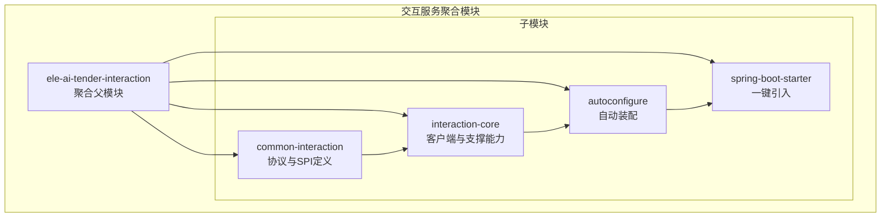
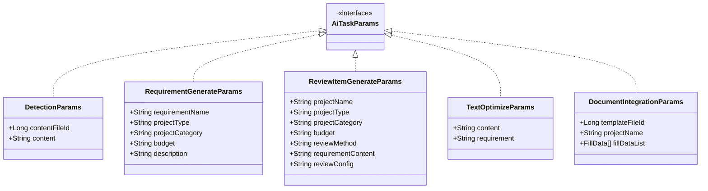
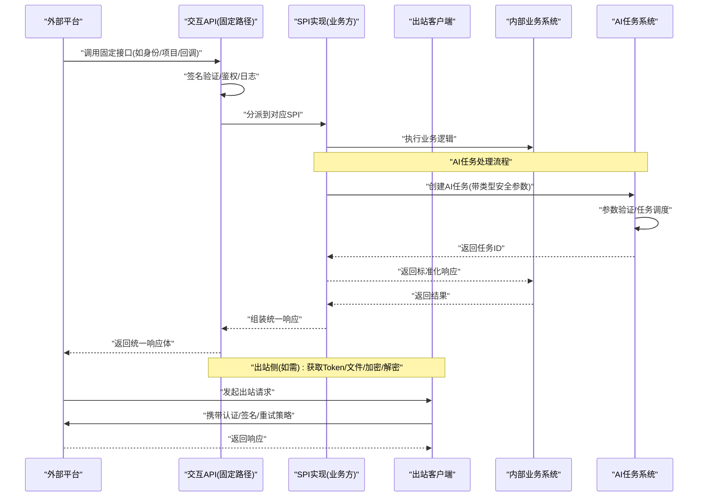
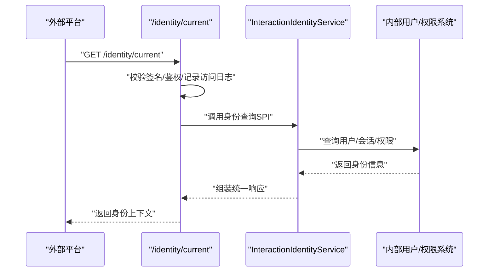
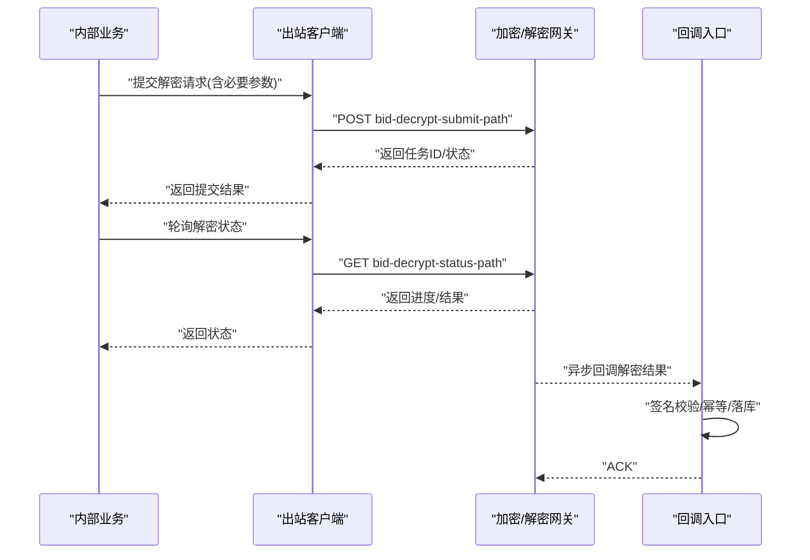
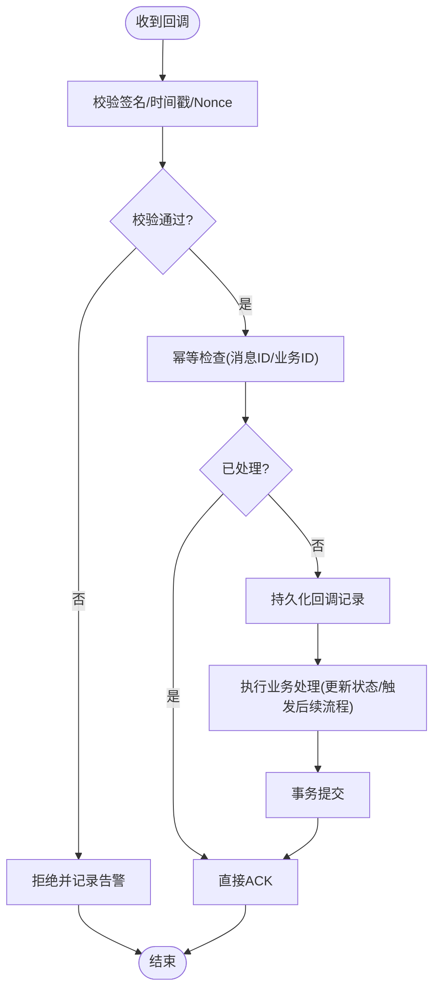
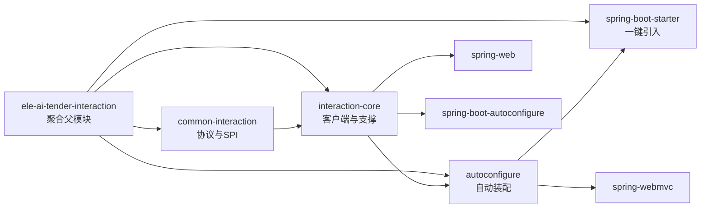

# 交互服务 (ele-ai-tender-interaction)

<cite>
**本文引用的文件**   
- [INTERACTION_INTEGRATION_SPEC.md](file://docs/rules/INTERACTION_INTEGRATION_SPEC.md)
- [pom.xml](file://ele-ai-tender-system/ele-ai-tender-interaction/pom.xml)
- [pom.xml](file://ele-ai-tender-system/ele-ai-tender-interaction/ele-ai-tender-common-interaction/pom.xml)
- [pom.xml](file://ele-ai-tender-system/ele-ai-tender-interaction/ele-ai-tender-interaction-core/pom.xml)
- [pom.xml](file://ele-ai-tender-system/ele-ai-tender-interaction/ele-ai-tender-interaction-autoconfigure/pom.xml)
- [pom.xml](file://ele-ai-tender-system/ele-ai-tender-interaction/ele-ai-tender-interaction-spring-boot-starter/pom.xml)
- [AiTaskParams.java](file://ele-ai-tender-system/ele-ai-tender-common/src/main/java/com/jy/eleaitender/common/dto/ai/AiTaskParams.java)
- [DetectionParams.java](file://ele-ai-tender-system/ele-ai-tender-common/src/main/java/com/jy/eleaitender/common/dto/ai/DetectionParams.java)
- [RequirementGenerateParams.java](file://ele-ai-tender-system/ele-ai-tender-common/src/main/java/com/jy/eleaitender/common/dto/ai/RequirementGenerateParams.java)
- [ReviewItemGenerateParams.java](file://ele-ai-tender-system/ele-ai-tender-common/src/main/java/com/jy/eleaitender/common/dto/ai/ReviewItemGenerateParams.java)
- [TextOptimizeParams.java](file://ele-ai-tender-system/ele-ai-tender-common/src/main/java/com/jy/eleaitender/common/dto/ai/TextOptimizeParams.java)
- [DocumentIntegrationParams.java](file://ele-ai-tender-system/ele-ai-tender-common/src/main/java/com/jy/eleaitender/common/dto/ai/DocumentIntegrationParams.java)
- [AiTaskType.java](file://ele-ai-tender-system/ele-ai-tender-common/src/main/java/com/jy/eleaitender/common/enums/AiTaskType.java)
</cite>

## 更新摘要
**所做更改**   
- 新增了AI任务参数系统章节，详细介绍类型安全的参数定义框架
- 更新了核心组件章节，补充AI任务参数相关的SPI和客户端能力
- 增强了架构总览图表，体现AI任务参数处理流程
- 添加了详细的参数类型说明和使用示例

## 目录
1. [简介](#简介)
2. [项目结构](#项目结构)
3. [核心组件](#核心组件)
4. [AI任务参数系统](#ai任务参数系统)
5. [架构总览](#架构总览)
6. [详细组件分析](#详细组件分析)
7. [依赖分析](#依赖分析)
8. [性能考虑](#性能考虑)
9. [故障排查指南](#故障排查指南)
10. [结论](#结论)
11. [附录](#附录)

## 简介
本技术文档聚焦于"交互服务"模块，围绕外部系统集成能力展开，包括 SPI 插件架构、第三方平台对接、回调机制、投标解密与标书推送、CA 证书管理等业务接口实现；同时覆盖签名验证、请求拦截、日志记录等安全机制，以及自动配置、客户端封装、错误处理等框架特性。特别地，本次更新引入了增强的AI任务参数系统，提供类型安全的参数定义框架，支持检测任务、需求生成、评审项生成、文本优化等多种AI任务场景的参数配置。文末提供外部系统集成指南、协议规范与调试方法，帮助快速接入与排障。

## 项目结构
交互相关代码采用分层与模块化设计，现已完成模块结构重组：

**更新** 交互服务模块已完成结构重组，ele-ai-tender-common-interaction模块已迁移至ele-ai-tender-system/ele-ai-tender-interaction/子目录下，保持了原有的包结构和功能完整性，但改变了Maven模块层级关系。

- **聚合父模块**（ele-ai-tender-interaction）：统一管理子模块版本和依赖，定义Spring Boot 2.7.18兼容性配置
- **公共契约层**（ele-ai-tender-common-interaction）：统一对外协议 DTO、枚举、常量、异常与工具类，作为单源维护的协议定义
- **核心能力层**（ele-ai-tender-interaction-core）：出站客户端、属性配置、支持类与自动装配基础能力
- **自动配置层**（ele-ai-tender-interaction-autoconfigure）：基于 Spring Boot 的自动装配与默认行为
- **Starter 层**（ele-ai-tender-interaction-spring-boot-starter）：对外发布的一键引入包



**图表来源**
- [pom.xml:43-48](file://ele-ai-tender-system/ele-ai-tender-interaction/pom.xml#L43-L48)

**章节来源**
- [INTERACTION_INTEGRATION_SPEC.md:1-89](file://docs/rules/INTERACTION_INTEGRATION_SPEC.md#L1-L89)
- [pom.xml:1-64](file://ele-ai-tender-system/ele-ai-tender-interaction/pom.xml#L1-L64)
- [pom.xml:1-49](file://ele-ai-tender-system/ele-ai-tender-interaction/ele-ai-tender-common-interaction/pom.xml#L1-L49)
- [pom.xml:1-55](file://ele-ai-tender-system/ele-ai-tender-interaction/ele-ai-tender-interaction-core/pom.xml#L1-L55)

## 核心组件
- **固定 API 前缀与路径**
  - 统一前缀：/api/eleAiTender/interaction
  - 当前固定接口涵盖身份查询、项目信息、标书记录方案、CA 密钥、招标文件回调、投标文件结果回调、解密结果回调等。
- **业务系统必须实现的 SPI**
  - 身份、项目信息、标书记录方案、CA 密钥、招标文件接收、投标文件结果接收、解密结果接收等 SPI 由业务方实现以完成具体集成。
- **出站客户端能力**
  - 获取 external token、用户信息、文件信息查询/下载/上传、推送投标文件预存、提交解密请求、查询解密状态、构造编制入口 URL 等。
- **AI任务参数系统**
  - 类型安全的参数定义框架，支持编译期类型约束
  - 多种AI任务场景的参数配置：检测任务、需求生成、评审项生成、文本优化、文档集成
  - 统一的参数接口标记，确保类型安全和可维护性
- **配置项**
  - 统一前缀 ele-ai-tender.interaction，包含 api-base-url、page-base-url、app-key、app-secret、token-path、user-info-path、file-*、crypto-base-url、bid-document-push-path、bid-decrypt-submit-path、bid-decrypt-status-path 等关键项。
- **模型约束**
  - 协议 DTO 在 common-interaction 中单源维护，controller/facade 边界做显式 mapper 转换，避免透传协议 DTO。

**章节来源**
- [INTERACTION_INTEGRATION_SPEC.md:19-83](file://docs/rules/INTERACTION_INTEGRATION_SPEC.md#L19-L83)

## AI任务参数系统

### 类型安全参数框架
交互服务引入了增强的AI任务参数系统，通过类型安全的参数定义框架，为各种AI任务场景提供编译期类型约束和运行时安全保障。

**核心设计理念**
- **标记接口**：所有AI任务参数类实现统一的 `AiTaskParams` 接口
- **编译期约束**：通过泛型和方法签名确保参数类型正确性
- **运行时验证**：结合任务类型枚举进行参数合法性校验
- **扩展性设计**：支持新增任务类型时无需修改现有代码



**图表来源**
- [AiTaskParams.java:7-8](file://ele-ai-tender-system/ele-ai-tender-common/src/main/java/com/jy/eleaitender/common/dto/ai/AiTaskParams.java#L7-L8)
- [DetectionParams.java:9-16](file://ele-ai-tender-system/ele-ai-tender-common/src/main/java/com/jy/eleaitender/common/dto/ai/DetectionParams.java#L9-L16)
- [RequirementGenerateParams.java:9-21](file://ele-ai-tender-system/ele-ai-tender-common/src/main/java/com/jy/eleaitender/common/dto/ai/RequirementGenerateParams.java#L9-L21)
- [ReviewItemGenerateParams.java:9-25](file://ele-ai-tender-system/ele-ai-tender-common/src/main/java/com/jy/eleaitender/common/dto/ai/ReviewItemGenerateParams.java#L9-L25)
- [TextOptimizeParams.java:9-15](file://ele-ai-tender-system/ele-ai-tender-common/src/main/java/com/jy/eleaitender/common/dto/ai/TextOptimizeParams.java#L9-L15)
- [DocumentIntegrationParams.java:12-19](file://ele-ai-tender-system/ele-ai-tender-common/src/main/java/com/jy/eleaitender/common/dto/ai/DocumentIntegrationParams.java#L12-L19)

### 支持的AI任务类型
系统定义了完整的AI任务类型枚举，每种任务类型都关联了特定的参数类和超时配置：

| 任务类型 | 代码 | 标签 | 超时(秒) | 参数类 |
|---------|------|------|----------|--------|
| 需求生成 | REQUIREMENT_GENERATE | 需求生成 | 20 | RequirementGenerateParams |
| 项目需求生成 | PROJECT_REQUIREMENT_GENERATE | 项目需求生成 | 20 | RequirementGenerateParams |
| 评审项生成 | REVIEW_ITEM_GENERATE | 评审项生成 | 10 | ReviewItemGenerateParams |
| 文档集成 | DOCUMENT_INTEGRATION | 文档集成 | 10 | DocumentIntegrationParams |
| 敏感词检测 | DETECTION_SENSITIVE_WORD | 敏感词检测 | 15 | DetectionParams |
| 错别字检测 | DETECTION_TYPO | 错别字检测 | 15 | DetectionParams |
| 政策文件审查 | DETECTION_POLICY_REVIEW | 政策文件审查 | 15 | DetectionParams |
| 格式规范检测 | DETECTION_FORMAT_CHECK | 格式规范检测 | 15 | DetectionParams |
| 文本优化 | TEXT_OPTIMIZE | 文本优化 | 10 | TextOptimizeParams |

### 参数使用示例
**创建检测任务**
```java
// 使用内容文件ID进行检测
DetectionParams detectionParams = new DetectionParams();
detectionParams.setContentFileId(fileId);
AiTask task = aiTaskService.createTask(AiTaskType.DETECTION_SENSITIVE_WORD, projectId, null, "检测任务", detectionParams, userId);

// 直接使用文本内容进行检测
DetectionParams textParams = new DetectionParams();
textParams.setContent("待检测的文本内容");
AiTask task2 = aiTaskService.createTask(AiTaskType.DETECTION_TYPO, projectId, null, "错别字检测", textParams, userId);
```

**创建需求生成任务**
```java
RequirementGenerateParams params = new RequirementGenerateParams();
params.setRequirementName("智能标书生成系统");
params.setProjectType("IT服务");
params.setProjectCategory("软件开发");
params.setBudget("500000");
params.setDescription("需要开发一个智能化的招投标文档生成系统");

AiTask task = aiTaskService.createTask(AiTaskType.REQUIREMENT_GENERATE, projectId, null, "需求生成", params, userId);
```

**章节来源**
- [AiTaskType.java:12-51](file://ele-ai-tender-system/ele-ai-tender-common/src/main/java/com/jy/eleaitender/common/enums/AiTaskType.java#L12-L51)
- [DetectionParams.java:1-17](file://ele-ai-tender-system/ele-ai-tender-common/src/main/java/com/jy/eleaitender/common/dto/ai/DetectionParams.java#L1-L17)
- [RequirementGenerateParams.java:1-22](file://ele-ai-tender-system/ele-ai-tender-common/src/main/java/com/jy/eleaitender/common/dto/ai/RequirementGenerateParams.java#L1-L22)
- [ReviewItemGenerateParams.java:1-26](file://ele-ai-tender-system/ele-ai-tender-common/src/main/java/com/jy/eleaitender/common/dto/ai/ReviewItemGenerateParams.java#L1-L26)
- [TextOptimizeParams.java:1-16](file://ele-ai-tender-system/ele-ai-tender-common/src/main/java/com/jy/eleaitender/common/dto/ai/TextOptimizeParams.java#L1-L16)
- [DocumentIntegrationParams.java:1-20](file://ele-ai-tender-system/ele-ai-tender-common/src/main/java/com/jy/eleaitender/common/dto/ai/DocumentIntegrationParams.java#L1-L20)

## 架构总览
交互服务通过"入站控制器 + SPI 分发 + 出站客户端"的模式，将外部平台与内部业务解耦：
- **入站**：固定路径的 REST 接口负责参数校验、签名验证、鉴权与日志记录，随后路由到对应 SPI 实现。
- **出站**：统一的 HTTP 客户端封装，负责认证、加签、重试、超时、错误码映射与响应提取。
- **回调**：针对招标文件、投标文件结果、解密结果等场景，提供标准回调入口与处理流程。
- **AI任务处理**：通过类型安全的参数系统，支持多种AI任务的创建、执行和结果处理。



**图表来源**
- [INTERACTION_INTEGRATION_SPEC.md:19-83](file://docs/rules/INTERACTION_INTEGRATION_SPEC.md#L19-L83)
- [AiTaskType.java:12-51](file://ele-ai-tender-system/ele-ai-tender-common/src/main/java/com/jy/eleaitender/common/enums/AiTaskType.java#L12-L51)

## 详细组件分析

### 入站接口与 SPI 分发
- **固定接口清单**
  - GET /identity/current
  - POST /projects/basic-info
  - POST /bid-record-schemes/query
  - POST /ca-keys/query
  - POST /callbacks/tender-pdf
  - POST /callbacks/tender-package
  - POST /callbacks/bid-document-result
  - POST /callbacks/bid-decrypt-result
- **SPI 职责划分**
  - 身份与项目信息：用于外部平台登录态与项目上下文获取。
  - 标书记录方案与 CA 密钥：用于标书生成与加密所需元数据。
  - 回调接收：招标文件、投标文件结果、解密结果等异步通知处理。
  - AI任务处理：支持多种AI任务的创建和执行，使用类型安全的参数系统。
- **典型调用序列（以身份查询为例）**


**图表来源**
- [INTERACTION_INTEGRATION_SPEC.md:23-43](file://docs/rules/INTERACTION_INTEGRATION_SPEC.md#L23-L43)

**章节来源**
- [INTERACTION_INTEGRATION_SPEC.md:23-43](file://docs/rules/INTERACTION_INTEGRATION_SPEC.md#L23-L43)

### 出站客户端与第三方平台对接
- **能力范围**
  - 获取 external token、用户信息、文件信息查询/下载/上传、推送投标文件预存、提交解密请求、查询解密状态、构造编制入口 URL。
- **关键配置项**
  - 基础地址：api-base-url、page-base-url、file-base-url、crypto-base-url
  - 认证：app-key、app-secret、token-path、user-info-path
  - 文件：file-info-path、file-download-path、file-upload-path
  - 业务：bid-document-push-path、bid-decrypt-submit-path、bid-decrypt-status-path
- **典型调用序列（以提交解密请求为例）**


**图表来源**
- [INTERACTION_INTEGRATION_SPEC.md:45-76](file://docs/rules/INTERACTION_INTEGRATION_SPEC.md#L45-L76)

**章节来源**
- [INTERACTION_INTEGRATION_SPEC.md:45-76](file://docs/rules/INTERACTION_INTEGRATION_SPEC.md#L45-L76)

### 回调机制与幂等性
- **回调类型**
  - 招标文件回调、投标文件结果回调、解密结果回调。
- **处理要点**
  - 签名验证：确保请求来源可信。
  - 幂等控制：基于业务主键或消息 ID 去重。
  - 异步落库：先持久化再处理，失败可重试。
  - 结果确认：成功返回统一成功码，便于发送方重试策略。
- **流程图（以解密结果回调为例）**


**图表来源**
- [INTERACTION_INTEGRATION_SPEC.md:29-32](file://docs/rules/INTERACTION_INTEGRATION_SPEC.md#L29-L32)

**章节来源**
- [INTERACTION_INTEGRATION_SPEC.md:29-32](file://docs/rules/INTERACTION_INTEGRATION_SPEC.md#L29-L32)

### 安全机制：签名验证、请求拦截、日志记录
- **签名验证**
  - 对入站请求进行签名校验，防止篡改与重放。
- **请求拦截**
  - 统一鉴权、白名单、限流、审计等横切逻辑。
- **日志记录**
  - 访问日志、业务日志、错误堆栈与链路追踪信息集中记录，便于问题定位。

**章节来源**
- [INTERACTION_INTEGRATION_SPEC.md:19-33](file://docs/rules/INTERACTION_INTEGRATION_SPEC.md#L19-L33)

### 自动配置与客户端封装
- **自动配置**
  - 基于 Spring Boot 自动装配，按配置项初始化客户端、拦截器、序列化器等。
- **客户端封装**
  - 统一封装 HTTP 调用、重试、超时、错误码映射、响应提取等通用能力。
- **依赖关系**
  - interaction-core 依赖 common-interaction 的协议与工具，并引入 spring-web、spring-boot-autoconfigure 等基础能力。

**章节来源**
- [pom.xml:19-53](file://ele-ai-tender-system/ele-ai-tender-interaction/ele-ai-tender-interaction-core/pom.xml#L19-L53)

## 依赖分析
- **模块依赖**
  - 新的模块层级结构下，interaction-core 依赖 common-interaction，形成"协议在上、实现在下"的清晰边界。
  - autoconfigure 模块依赖 core 和 common-interaction，提供自动装配能力。
  - starter 模块聚合 core 和 autoconfigure，提供一键引入体验。
- **运行时依赖**
  - 使用 spring-web 与 spring-boot-autoconfigure 提供 Web 与自动装配能力。
  - 父模块统一定义 Spring Boot 2.7.18 版本，确保 JDK 8 兼容性。
- **版本与兼容性**
  - 公开 API 需保持 JDK 8 兼容，推荐运行环境为 Spring Boot 2.7.x + Spring MVC。



**图表来源**
- [pom.xml:43-48](file://ele-ai-tender-system/ele-ai-tender-interaction/pom.xml#L43-L48)
- [pom.xml:19-53](file://ele-ai-tender-system/ele-ai-tender-interaction/ele-ai-tender-interaction-core/pom.xml#L19-L53)
- [pom.xml:19-55](file://ele-ai-tender-system/ele-ai-tender-interaction/ele-ai-tender-interaction-autoconfigure/pom.xml#L19-L55)
- [pom.xml:19-34](file://ele-ai-tender-system/ele-ai-tender-interaction/ele-ai-tender-interaction-spring-boot-starter/pom.xml#L19-L34)

**章节来源**
- [pom.xml:19-53](file://ele-ai-tender-system/ele-ai-tender-interaction/ele-ai-tender-interaction-core/pom.xml#L19-L53)
- [pom.xml:1-49](file://ele-ai-tender-system/ele-ai-tender-interaction/ele-ai-tender-common-interaction/pom.xml#L1-L49)
- [pom.xml:1-64](file://ele-ai-tender-system/ele-ai-tender-interaction/pom.xml#L1-L64)
- [INTERACTION_INTEGRATION_SPEC.md:14-17](file://docs/rules/INTERACTION_INTEGRATION_SPEC.md#L14-L17)

## 性能考虑
- **连接池与超时**
  - 合理设置连接池大小、读写超时与重试退避策略，避免雪崩。
- **异步与批处理**
  - 对大文件或批量操作采用异步与分批处理，降低阻塞。
- **缓存与幂等**
  - 对热点查询（如项目信息、CA 密钥）进行缓存；回调与出站请求保证幂等。
- **监控与指标**
  - 暴露关键指标（QPS、耗时、错误率），结合日志与链路追踪进行容量规划与优化。
- **AI任务性能优化**
  - 根据任务类型设置合理的超时时间，避免长时间占用资源。
  - 对AI任务进行优先级排序和资源隔离，确保关键任务优先执行。

## 故障排查指南
- **常见问题定位**
  - 签名失败：检查 app-key/app-secret、时间戳与 Nonce、排序规则与编码。
  - 回调未达：检查网络连通性、防火墙策略、回调地址与端口。
  - 解密卡住：核对解密任务 ID、状态轮询间隔、重试次数与上限。
  - AI任务参数错误：检查参数类字段是否与任务类型匹配，验证必填字段是否完整。
- **日志与断点**
  - 开启访问日志与错误堆栈输出；在 SPI 实现与客户端关键分支打点。
  - 针对AI任务，记录参数序列化前后的JSON数据，便于调试参数传递问题。
- **最小复现**
  - 使用固定路径与最小参数集构造请求，逐步缩小问题范围。
  - 对于AI任务，使用最简单的参数组合进行测试，逐步增加复杂度。

## 结论
交互服务通过清晰的协议契约、SPI 扩展点与统一的出站客户端，实现了与外部平台的松耦合集成。配合签名验证、请求拦截与完善的日志体系，能够保障高可用与安全合规。新增的类型安全AI任务参数系统进一步提升了系统的可维护性和安全性，通过编译期类型约束和运行时验证，有效减少了参数传递过程中的错误。模块结构重组后，新的Maven层级关系更加清晰，有利于独立开发和部署。建议在实际落地时严格遵循协议规范与最佳实践，完善监控与容错，提升整体稳定性与可观测性。

## 附录

### 外部系统集成指南
- **接入步骤**
  - 引入 starter 依赖，配置 ele-ai-tender.interaction.* 相关项。
  - 实现 SPI 接口，注册为 Spring Bean。
  - 在业务系统中调用出站客户端完成第三方平台对接。
  - 使用类型安全的参数系统创建和管理AI任务。
- **注意事项**
  - 协议 DTO 仅在 common-interaction 中维护，跨层不做透传。
  - 所有出站请求需遵循统一认证与签名策略。
  - AI任务参数必须实现对应的参数类，确保类型安全。

**章节来源**
- [INTERACTION_INTEGRATION_SPEC.md:57-83](file://docs/rules/INTERACTION_INTEGRATION_SPEC.md#L57-L83)

### 协议规范摘要
- **固定路径**
  - 统一前缀：/api/eleAiTender/interaction
  - 接口清单见"固定接口"小节。
- **配置项**
  - 统一前缀：ele-ai-tender.interaction
  - 关键项包括 api-base-url、page-base-url、app-key、app-secret、token-path、user-info-path、file-*、crypto-base-url、bid-document-push-path、bid-decrypt-submit-path、bid-decrypt-status-path。
- **AI任务参数规范**
  - 所有参数类必须实现 AiTaskParams 接口
  - 每个任务类型都有对应的参数类定义
  - 参数字段必须添加必要的注释说明

**章节来源**
- [INTERACTION_INTEGRATION_SPEC.md:19-76](file://docs/rules/INTERACTION_INTEGRATION_SPEC.md#L19-L76)
- [AiTaskParams.java:1-9](file://ele-ai-tender-system/ele-ai-tender-common/src/main/java/com/jy/eleaitender/common/dto/ai/AiTaskParams.java#L1-L9)

### 调试方法
- **本地联调**
  - 使用 Mock 外部平台，优先验证签名与鉴权流程。
  - 针对AI任务，使用单元测试验证参数序列化和反序列化。
- **抓包与日志**
  - 抓取 HTTP 报文，核对签名字段与顺序；对照访问日志定位差异。
  - 启用AI任务参数的详细日志，记录参数创建、验证、执行的完整过程。
- **灰度与回滚**
  - 小流量灰度新实现，观察错误率与延迟，必要时快速回滚。
  - 对于AI任务，监控不同任务类型的执行时间和成功率。