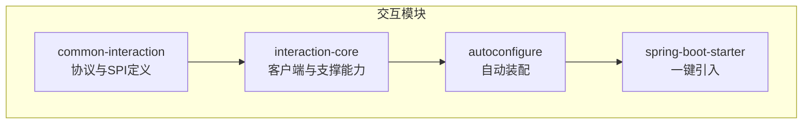
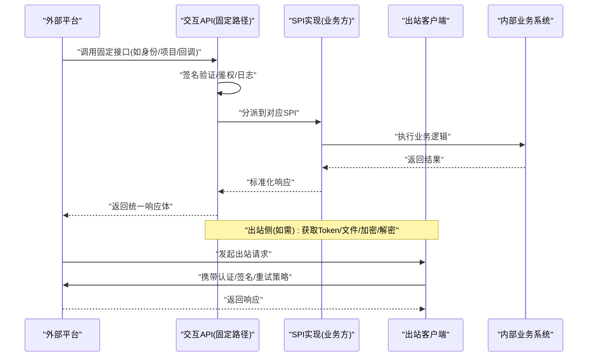
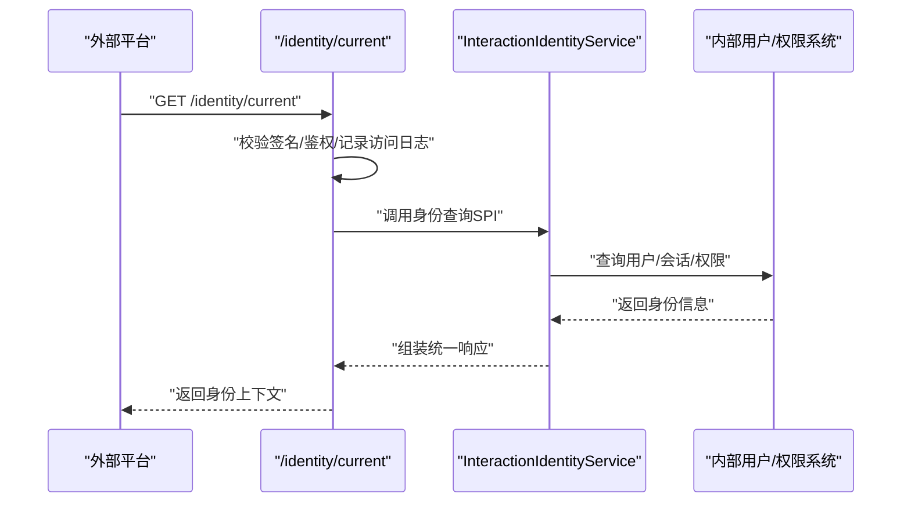
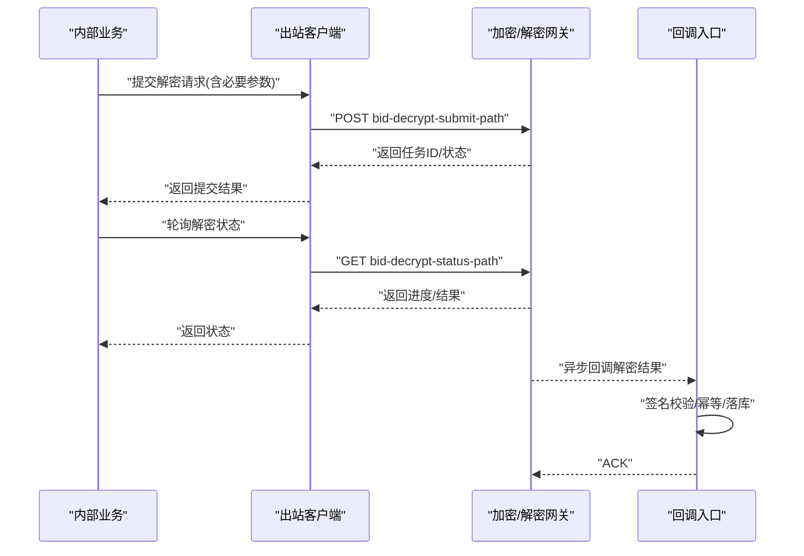
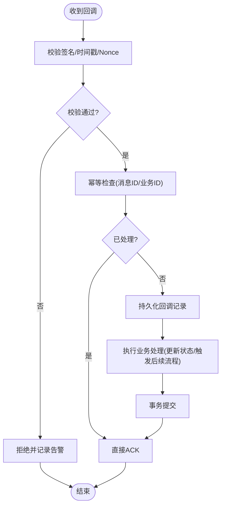
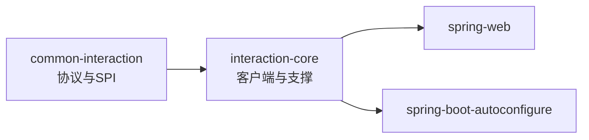

# 交互服务 (ele-ai-tender-interaction)

<cite>
**本文引用的文件**   
- [INTERACTION_INTEGRATION_SPEC.md](file://docs/rules/INTERACTION_INTEGRATION_SPEC.md)
- [pom.xml](file://ele-ai-tender-system/ele-ai-tender-common-interaction/pom.xml)
- [pom.xml](file://ele-ai-tender-system/ele-ai-tender-interaction/ele-ai-tender-interaction-core/pom.xml)
</cite>

## 目录
1. [简介](#简介)
2. [项目结构](#项目结构)
3. [核心组件](#核心组件)
4. [架构总览](#架构总览)
5. [详细组件分析](#详细组件分析)
6. [依赖分析](#依赖分析)
7. [性能考虑](#性能考虑)
8. [故障排查指南](#故障排查指南)
9. [结论](#结论)
10. [附录](#附录)

## 简介
本技术文档聚焦于“交互服务”模块，围绕外部系统集成能力展开，包括 SPI 插件架构、第三方平台对接、回调机制、投标解密与标书推送、CA 证书管理等业务接口实现；同时覆盖签名验证、请求拦截、日志记录等安全机制，以及自动配置、客户端封装、错误处理等框架特性。文末提供外部系统集成指南、协议规范与调试方法，帮助快速接入与排障。

## 项目结构
交互相关代码采用分层与模块化设计：
- 公共契约层（ele-ai-tender-common-interaction）：统一对外协议 DTO、枚举、常量、异常与工具类，作为单源维护的协议定义。
- 核心能力层（ele-ai-tender-interaction-core）：出站客户端、属性配置、支持类与自动装配基础能力。
- 自动配置层（ele-ai-tender-interaction-autoconfigure）：基于 Spring Boot 的自动装配与默认行为。
- Starter 层（ele-ai-tender-interaction-spring-boot-starter）：对外发布的一键引入包。

图表来源
- [pom.xml:1-49](file://ele-ai-tender-system/ele-ai-tender-common-interaction/pom.xml#L1-L49)
- [pom.xml:1-55](file://ele-ai-tender-system/ele-ai-tender-interaction/ele-ai-tender-interaction-core/pom.xml#L1-L55)

章节来源
- [INTERACTION_INTEGRATION_SPEC.md:1-89](file://docs/rules/INTERACTION_INTEGRATION_SPEC.md#L1-L89)
- [pom.xml:1-49](file://ele-ai-tender-system/ele-ai-tender-common-interaction/pom.xml#L1-L49)
- [pom.xml:1-55](file://ele-ai-tender-system/ele-ai-tender-interaction/ele-ai-tender-interaction-core/pom.xml#L1-L55)

## 核心组件
- 固定 API 前缀与路径
  - 统一前缀：/api/eleAiTender/interaction
  - 当前固定接口涵盖身份查询、项目信息、标书记录方案、CA 密钥、招标文件回调、投标文件结果回调、解密结果回调等。
- 业务系统必须实现的 SPI
  - 身份、项目信息、标书记录方案、CA 密钥、招标文件接收、投标文件结果接收、解密结果接收等 SPI 由业务方实现以完成具体集成。
- 出站客户端能力
  - 获取 external token、用户信息、文件信息查询/下载/上传、推送投标文件预存、提交解密请求、查询解密状态、构造编制入口 URL 等。
- 配置项
  - 统一前缀 ele-ai-tender.interaction，包含 api-base-url、page-base-url、app-key、app-secret、token-path、user-info-path、file-*、crypto-base-url、bid-document-push-path、bid-decrypt-submit-path、bid-decrypt-status-path 等关键项。
- 模型约束
  - 协议 DTO 在 common-interaction 中单源维护，controller/facade 边界做显式 mapper 转换，避免透传协议 DTO。

章节来源
- [INTERACTION_INTEGRATION_SPEC.md:19-83](file://docs/rules/INTERACTION_INTEGRATION_SPEC.md#L19-L83)

## 架构总览
交互服务通过“入站控制器 + SPI 分发 + 出站客户端”的模式，将外部平台与内部业务解耦：
- 入站：固定路径的 REST 接口负责参数校验、签名验证、鉴权与日志记录，随后路由到对应 SPI 实现。
- 出站：统一的 HTTP 客户端封装，负责认证、加签、重试、超时、错误码映射与响应提取。
- 回调：针对招标文件、投标文件结果、解密结果等场景，提供标准回调入口与处理流程。

图表来源
- [INTERACTION_INTEGRATION_SPEC.md:19-83](file://docs/rules/INTERACTION_INTEGRATION_SPEC.md#L19-L83)

## 详细组件分析

### 入站接口与 SPI 分发
- 固定接口清单
  - GET /identity/current
  - POST /projects/basic-info
  - POST /bid-record-schemes/query
  - POST /ca-keys/query
  - POST /callbacks/tender-pdf
  - POST /callbacks/tender-package
  - POST /callbacks/bid-document-result
  - POST /callbacks/bid-decrypt-result
- SPI 职责划分
  - 身份与项目信息：用于外部平台登录态与项目上下文获取。
  - 标书记录方案与 CA 密钥：用于标书生成与加密所需元数据。
  - 回调接收：招标文件、投标文件结果、解密结果等异步通知处理。
- 典型调用序列（以身份查询为例）

图表来源
- [INTERACTION_INTEGRATION_SPEC.md:23-43](file://docs/rules/INTERACTION_INTEGRATION_SPEC.md#L23-L43)

章节来源
- [INTERACTION_INTEGRATION_SPEC.md:23-43](file://docs/rules/INTERACTION_INTEGRATION_SPEC.md#L23-L43)

### 出站客户端与第三方平台对接
- 能力范围
  - 获取 external token、用户信息、文件信息查询/下载/上传、推送投标文件预存、提交解密请求、查询解密状态、构造编制入口 URL。
- 关键配置项
  - 基础地址：api-base-url、page-base-url、file-base-url、crypto-base-url
  - 认证：app-key、app-secret、token-path、user-info-path
  - 文件：file-info-path、file-download-path、file-upload-path
  - 业务：bid-document-push-path、bid-decrypt-submit-path、bid-decrypt-status-path
- 典型调用序列（以提交解密请求为例）

图表来源
- [INTERACTION_INTEGRATION_SPEC.md:45-76](file://docs/rules/INTERACTION_INTEGRATION_SPEC.md#L45-L76)

章节来源
- [INTERACTION_INTEGRATION_SPEC.md:45-76](file://docs/rules/INTERACTION_INTEGRATION_SPEC.md#L45-L76)

### 回调机制与幂等性
- 回调类型
  - 招标文件回调、投标文件结果回调、解密结果回调。
- 处理要点
  - 签名验证：确保请求来源可信。
  - 幂等控制：基于业务主键或消息 ID 去重。
  - 异步落库：先持久化再处理，失败可重试。
  - 结果确认：成功返回统一成功码，便于发送方重试策略。
- 流程图（以解密结果回调为例）

图表来源
- [INTERACTION_INTEGRATION_SPEC.md:29-32](file://docs/rules/INTERACTION_INTEGRATION_SPEC.md#L29-L32)

章节来源
- [INTERACTION_INTEGRATION_SPEC.md:29-32](file://docs/rules/INTERACTION_INTEGRATION_SPEC.md#L29-L32)

### 安全机制：签名验证、请求拦截、日志记录
- 签名验证
  - 对入站请求进行签名校验，防止篡改与重放。
- 请求拦截
  - 统一鉴权、白名单、限流、审计等横切逻辑。
- 日志记录
  - 访问日志、业务日志、错误堆栈与链路追踪信息集中记录，便于问题定位。

章节来源
- [INTERACTION_INTEGRATION_SPEC.md:19-33](file://docs/rules/INTERACTION_INTEGRATION_SPEC.md#L19-L33)

### 自动配置与客户端封装
- 自动配置
  - 基于 Spring Boot 自动装配，按配置项初始化客户端、拦截器、序列化器等。
- 客户端封装
  - 统一封装 HTTP 调用、重试、超时、错误码映射、响应提取等通用能力。
- 依赖关系
  - interaction-core 依赖 common-interaction 的协议与工具，并引入 spring-web、spring-boot-autoconfigure 等基础能力。

章节来源
- [pom.xml:19-53](file://ele-ai-tender-system/ele-ai-tender-interaction/ele-ai-tender-interaction-core/pom.xml#L19-L53)

## 依赖分析
- 模块依赖
  - interaction-core 依赖 common-interaction，形成“协议在上、实现在下”的清晰边界。
- 运行时依赖
  - 使用 spring-web 与 spring-boot-autoconfigure 提供 Web 与自动装配能力。
- 版本与兼容性
  - 公开 API 需保持 JDK 8 兼容，推荐运行环境为 Spring Boot 2.7.x + Spring MVC。

图表来源
- [pom.xml:19-53](file://ele-ai-tender-system/ele-ai-tender-interaction/ele-ai-tender-interaction-core/pom.xml#L19-L53)
- [pom.xml:1-49](file://ele-ai-tender-system/ele-ai-tender-common-interaction/pom.xml#L1-L49)
- [INTERACTION_INTEGRATION_SPEC.md:14-17](file://docs/rules/INTERACTION_INTEGRATION_SPEC.md#L14-L17)

章节来源
- [pom.xml:19-53](file://ele-ai-tender-system/ele-ai-tender-interaction/ele-ai-tender-interaction-core/pom.xml#L19-L53)
- [pom.xml:1-49](file://ele-ai-tender-system/ele-ai-tender-common-interaction/pom.xml#L1-L49)
- [INTERACTION_INTEGRATION_SPEC.md:14-17](file://docs/rules/INTERACTION_INTEGRATION_SPEC.md#L14-L17)

## 性能考虑
- 连接池与超时
  - 合理设置连接池大小、读写超时与重试退避策略，避免雪崩。
- 异步与批处理
  - 对大文件或批量操作采用异步与分批处理，降低阻塞。
- 缓存与幂等
  - 对热点查询（如项目信息、CA 密钥）进行缓存；回调与出站请求保证幂等。
- 监控与指标
  - 暴露关键指标（QPS、耗时、错误率），结合日志与链路追踪进行容量规划与优化。

[本节为通用指导，不直接分析具体文件]

## 故障排查指南
- 常见问题定位
  - 签名失败：检查 app-key/app-secret、时间戳与 Nonce、排序规则与编码。
  - 回调未达：检查网络连通性、防火墙策略、回调地址与端口。
  - 解密卡住：核对解密任务 ID、状态轮询间隔、重试次数与上限。
- 日志与断点
  - 开启访问日志与错误堆栈输出；在 SPI 实现与客户端关键分支打点。
- 最小复现
  - 使用固定路径与最小参数集构造请求，逐步缩小问题范围。

[本节为通用指导，不直接分析具体文件]

## 结论
交互服务通过清晰的协议契约、SPI 扩展点与统一的出站客户端，实现了与外部平台的松耦合集成。配合签名验证、请求拦截与完善的日志体系，能够保障高可用与安全合规。建议在实际落地时严格遵循协议规范与最佳实践，完善监控与容错，提升整体稳定性与可观测性。

[本节为总结性内容，不直接分析具体文件]

## 附录

### 外部系统集成指南
- 接入步骤
  - 引入 starter 依赖，配置 ele-ai-tender.interaction.* 相关项。
  - 实现 SPI 接口，注册为 Spring Bean。
  - 在业务系统中调用出站客户端完成第三方平台对接。
- 注意事项
  - 协议 DTO 仅在 common-interaction 中维护，跨层不做透传。
  - 所有出站请求需遵循统一认证与签名策略。

章节来源
- [INTERACTION_INTEGRATION_SPEC.md:57-83](file://docs/rules/INTERACTION_INTEGRATION_SPEC.md#L57-L83)

### 协议规范摘要
- 固定路径
  - 统一前缀：/api/eleAiTender/interaction
  - 接口清单见“固定接口”小节。
- 配置项
  - 统一前缀：ele-ai-tender.interaction
  - 关键项包括 api-base-url、page-base-url、app-key、app-secret、token-path、user-info-path、file-*、crypto-base-url、bid-document-push-path、bid-decrypt-submit-path、bid-decrypt-status-path。

章节来源
- [INTERACTION_INTEGRATION_SPEC.md:19-76](file://docs/rules/INTERACTION_INTEGRATION_SPEC.md#L19-L76)

### 调试方法
- 本地联调
  - 使用 Mock 外部平台，优先验证签名与鉴权流程。
- 抓包与日志
  - 抓取 HTTP 报文，核对签名字段与顺序；对照访问日志定位差异。
- 灰度与回滚
  - 小流量灰度新实现，观察错误率与延迟，必要时快速回滚。

[本节为通用指导，不直接分析具体文件]