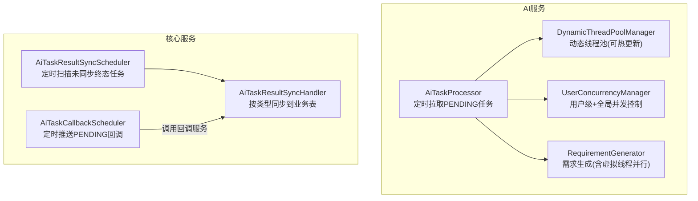
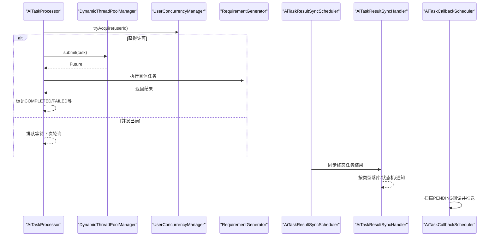
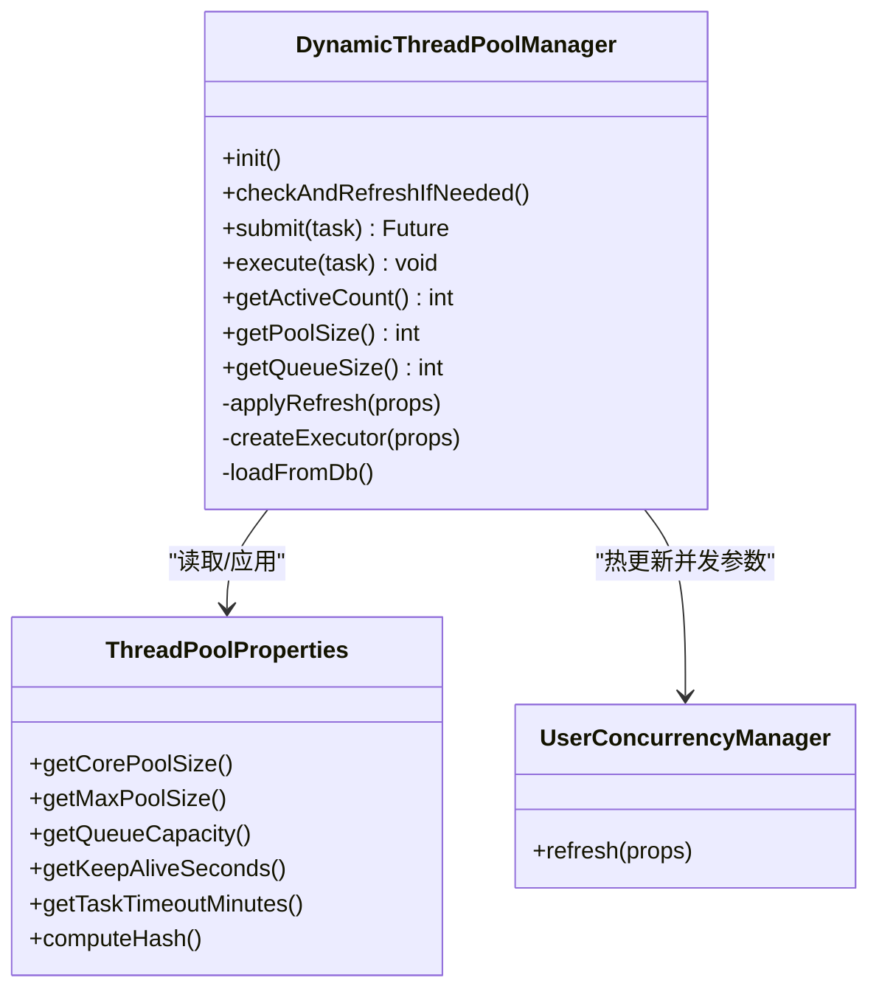
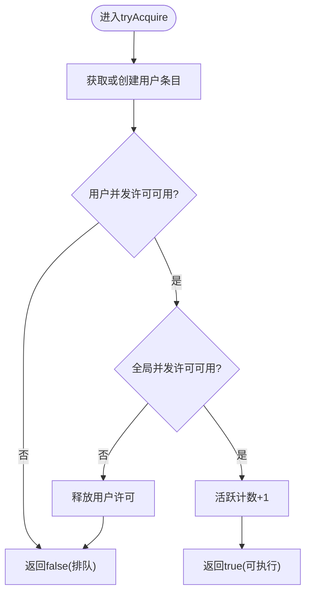
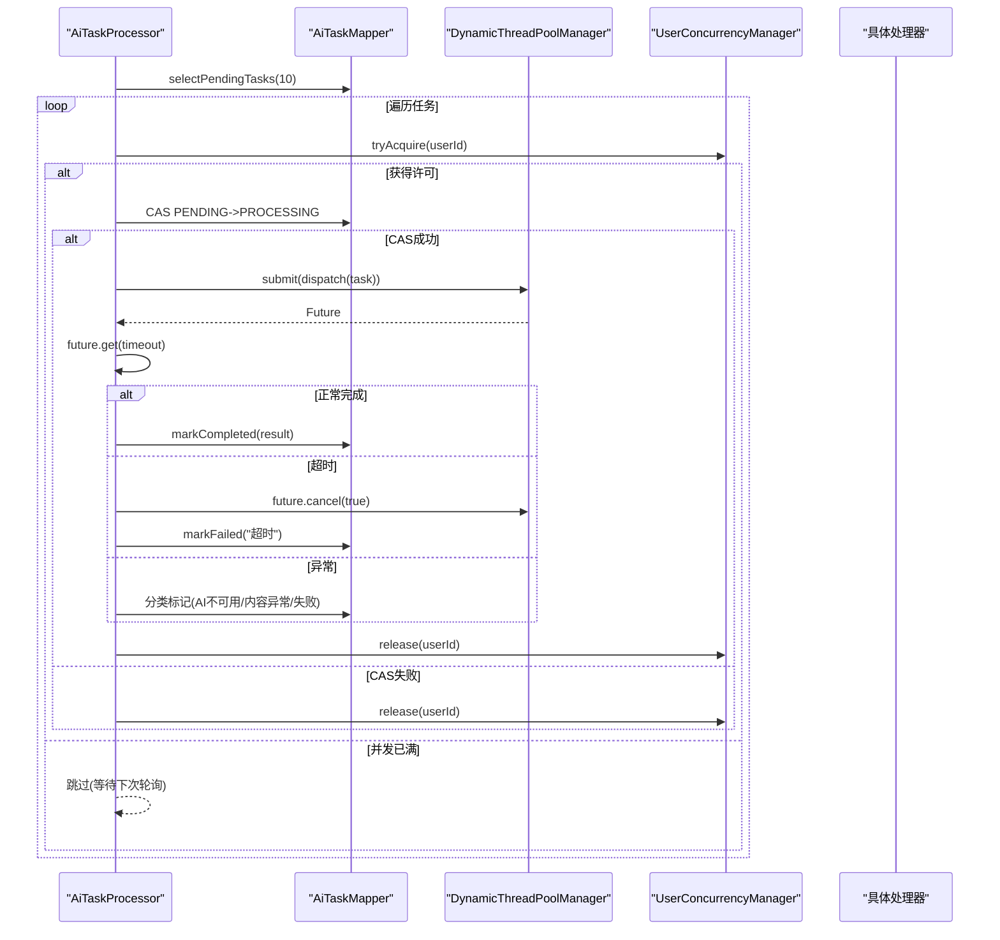
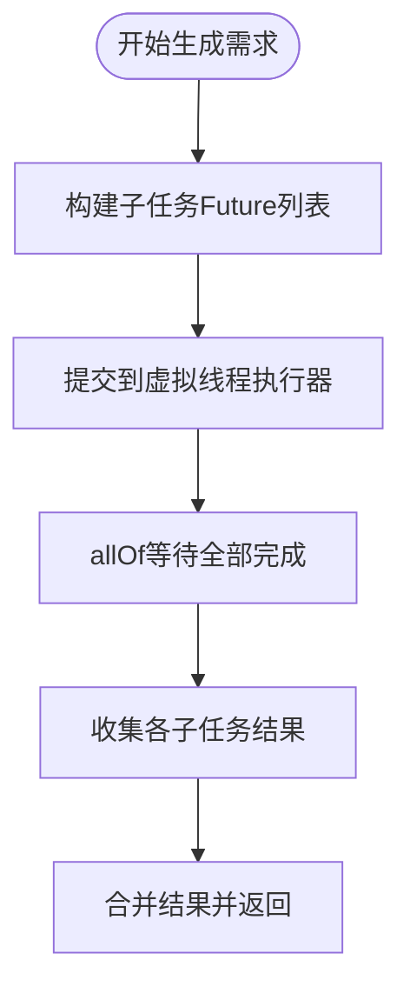
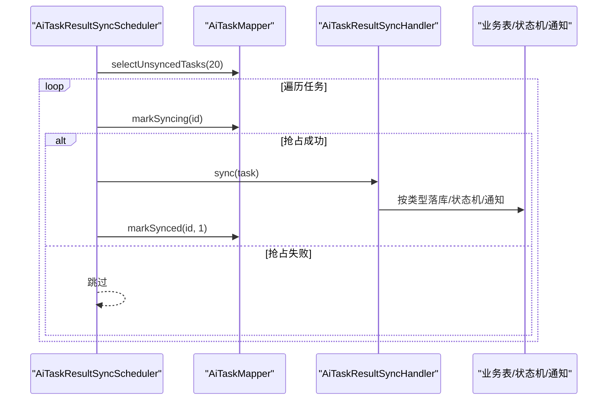
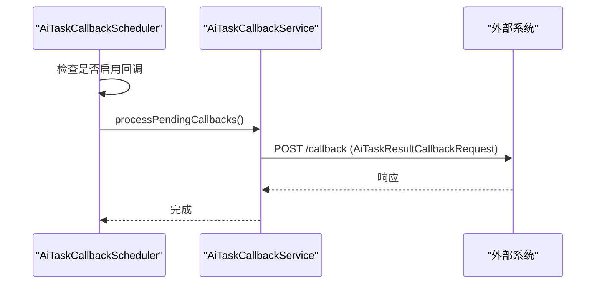
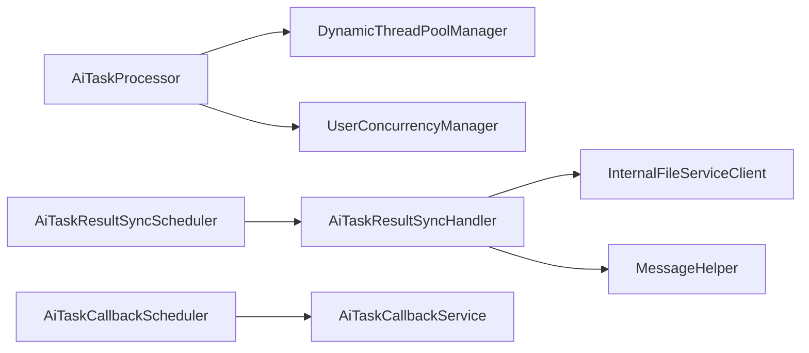

# 回调机制与异步处理

<cite>
**本文引用的文件**
- [AiTaskCallbackScheduler.java](file://ele-ai-tender-system/ele-ai-tender-core/src/main/java/com/jy/eleaitender/core/scheduler/AiTaskCallbackScheduler.java)
- [AiTaskResultSyncScheduler.java](file://ele-ai-tender-system/ele-ai-tender-core/src/main/java/com/jy/eleaitender/core/scheduler/AiTaskResultSyncScheduler.java)
- [AiTaskResultSyncHandler.java](file://ele-ai-tender-system/ele-ai-tender-core/src/main/java/com/jy/eleaitender/core/scheduler/AiTaskResultSyncHandler.java)
- [DynamicThreadPoolManager.java](file://ele-ai-tender-system/ele-ai-tender-ai/src/main/java/com/jy/eleaitender/ai/threadpool/DynamicThreadPoolManager.java)
- [UserConcurrencyManager.java](file://ele-ai-tender-system/ele-ai-tender-ai/src/main/java/com/jy/eleaitender/ai/threadpool/UserConcurrencyManager.java)
- [AiTaskProcessor.java](file://ele-ai-tender-system/ele-ai-tender-ai/src/main/java/com/jy/eleaitender/ai/processor/AiTaskProcessor.java)
- [RequirementGenerator.java](file://ele-ai-tender-system/ele-ai-tender-ai/src/main/java/com/jy/eleaitender/ai/processor/generator/RequirementGenerator.java)
- [AiTaskResultCallbackRequest.java](file://ele-ai-tender-system/ele-ai-tender-common-interaction/src/main/java/com/jy/eleaitender/common/interaction/dto/AiTaskResultCallbackRequest.java)
</cite>

## 目录
1. [简介](#简介)
2. [项目结构](#项目结构)
3. [核心组件](#核心组件)
4. [架构总览](#架构总览)
5. [详细组件分析](#详细组件分析)
6. [依赖关系分析](#依赖关系分析)
7. [性能考量](#性能考量)
8. [故障排查指南](#故障排查指南)
9. [结论](#结论)
10. [附录](#附录)

## 简介
本文件聚焦于“回调机制与异步处理”在招标文档工具系统中的设计与实现，覆盖以下关键主题：
- 任务异步执行：基于动态线程池与用户级并发控制的任务调度、超时控制与异常分流。
- 结果同步与状态推进：定时扫描终态任务并落库到业务表，联动项目阶段与通知。
- 外部回调：面向外部系统的AI任务终态结果回调（请求模型定义与调度入口）。
- 前端轮询与SSE：前端通过轮询或流式接口获取进度与结果。

## 项目结构
围绕回调与异步的核心代码分布在两个服务模块中：
- AI服务（ele-ai-tender-ai）：负责拉取待处理任务、并发控制、提交到动态线程池执行、超时与异常处理。
- 核心服务（ele-ai-tender-core）：负责将AI任务的终态结果同步到业务表、驱动项目状态机、发送通知；同时提供对外部回调的调度入口。

图表来源
- [AiTaskProcessor.java:60-101](file://ele-ai-tender-system/ele-ai-tender-ai/src/main/java/com/jy/eleaitender/ai/processor/AiTaskProcessor.java#L60-L101)
- [DynamicThreadPoolManager.java:46-82](file://ele-ai-tender-system/ele-ai-tender-ai/src/main/java/com/jy/eleaitender/ai/threadpool/DynamicThreadPoolManager.java#L46-L82)
- [UserConcurrencyManager.java:63-88](file://ele-ai-tender-system/ele-ai-tender-ai/src/main/java/com/jy/eleaitender/ai/threadpool/UserConcurrencyManager.java#L63-L88)
- [RequirementGenerator.java:364-404](file://ele-ai-tender-system/ele-ai-tender-ai/src/main/java/com/jy/eleaitender/ai/processor/generator/RequirementGenerator.java#L364-L404)
- [AiTaskResultSyncScheduler.java:29-62](file://ele-ai-tender-system/ele-ai-tender-core/src/main/java/com/jy/eleaitender/core/scheduler/AiTaskResultSyncScheduler.java#L29-L62)
- [AiTaskResultSyncHandler.java:75-104](file://ele-ai-tender-system/ele-ai-tender-core/src/main/java/com/jy/eleaitender/core/scheduler/AiTaskResultSyncHandler.java#L75-L104)
- [AiTaskCallbackScheduler.java:24-34](file://ele-ai-tender-system/ele-ai-tender-core/src/main/java/com/jy/eleaitender/core/scheduler/AiTaskCallbackScheduler.java#L24-L34)

章节来源
- [AiTaskProcessor.java:60-101](file://ele-ai-tender-system/ele-ai-tender-ai/src/main/java/com/jy/eleaitender/ai/processor/AiTaskProcessor.java#L60-L101)
- [DynamicThreadPoolManager.java:46-82](file://ele-ai-tender-system/ele-ai-tender-ai/src/main/java/com/jy/eleaitender/ai/threadpool/DynamicThreadPoolManager.java#L46-L82)
- [UserConcurrencyManager.java:63-88](file://ele-ai-tender-system/ele-ai-tender-ai/src/main/java/com/jy/eleaitender/ai/threadpool/UserConcurrencyManager.java#L63-L88)
- [RequirementGenerator.java:364-404](file://ele-ai-tender-system/ele-ai-tender-ai/src/main/java/com/jy/eleaitender/ai/processor/generator/RequirementGenerator.java#L364-L404)
- [AiTaskResultSyncScheduler.java:29-62](file://ele-ai-tender-system/ele-ai-tender-core/src/main/java/com/jy/eleaitender/core/scheduler/AiTaskResultSyncScheduler.java#L29-L62)
- [AiTaskResultSyncHandler.java:75-104](file://ele-ai-tender-system/ele-ai-tender-core/src/main/java/com/jy/eleaitender/core/scheduler/AiTaskResultSyncHandler.java#L75-L104)
- [AiTaskCallbackScheduler.java:24-34](file://ele-ai-tender-system/ele-ai-tender-core/src/main/java/com/jy/eleaitender/core/scheduler/AiTaskCallbackScheduler.java#L24-L34)

## 核心组件
- 动态线程池管理器：支持从系统参数表加载配置、运行时热更新、队列容量变更时重建线程池，并提供submit/execute接口。
- 用户级并发控制：基于信号量实现用户维度与全局维度的并发上限控制，配合数据库统计发起数限制。
- AI任务处理器：定时拉取PENDING任务，经并发控制后提交到线程池，带超时控制与异常分类落库。
- 结果同步调度器与处理器：定时扫描已完成的AI任务，按类型将结果同步到业务表，并触发状态机流转与通知。
- 回调调度器：定时扫描待推送的回调记录，调用回调服务完成对外推送。
- 外部回调请求模型：定义AI任务终态回调的请求体结构。

章节来源
- [DynamicThreadPoolManager.java:46-82](file://ele-ai-tender-system/ele-ai-tender-ai/src/main/java/com/jy/eleaitender/ai/threadpool/DynamicThreadPoolManager.java#L46-L82)
- [UserConcurrencyManager.java:63-88](file://ele-ai-tender-system/ele-ai-tender-ai/src/main/java/com/jy/eleaitender/ai/threadpool/UserConcurrencyManager.java#L63-L88)
- [AiTaskProcessor.java:130-167](file://ele-ai-tender-system/ele-ai-tender-ai/src/main/java/com/jy/eleaitender/ai/processor/AiTaskProcessor.java#L130-L167)
- [AiTaskResultSyncScheduler.java:29-62](file://ele-ai-tender-system/ele-ai-tender-core/src/main/java/com/jy/eleaitender/core/scheduler/AiTaskResultSyncScheduler.java#L29-L62)
- [AiTaskResultSyncHandler.java:75-104](file://ele-ai-tender-system/ele-ai-tender-core/src/main/java/com/jy/eleaitender/core/scheduler/AiTaskResultSyncHandler.java#L75-L104)
- [AiTaskCallbackScheduler.java:24-34](file://ele-ai-tender-system/ele-ai-tender-core/src/main/java/com/jy/eleaitender/core/scheduler/AiTaskCallbackScheduler.java#L24-L34)
- [AiTaskResultCallbackRequest.java:1-45](file://ele-ai-tender-system/ele-ai-tender-common-interaction/src/main/java/com/jy/eleaitender/common/interaction/dto/AiTaskResultCallbackRequest.java#L1-L45)

## 架构总览
整体流程分为两条主线：
- 异步执行主线：AI服务定时拉取任务→并发控制→线程池执行→超时/异常处理→写入ai_task结果。
- 结果同步主线：核心服务定时扫描终态任务→按类型同步到业务表→状态机流转→消息通知。
- 外部回调支线：核心服务定时扫描待推送回调→调用回调服务→持久化回调状态。

图表来源
- [AiTaskProcessor.java:60-101](file://ele-ai-tender-system/ele-ai-tender-ai/src/main/java/com/jy/eleaitender/ai/processor/AiTaskProcessor.java#L60-L101)
- [DynamicThreadPoolManager.java:84-96](file://ele-ai-tender-system/ele-ai-tender-ai/src/main/java/com/jy/eleaitender/ai/threadpool/DynamicThreadPoolManager.java#L84-L96)
- [UserConcurrencyManager.java:63-88](file://ele-ai-tender-system/ele-ai-tender-ai/src/main/java/com/jy/eleaitender/ai/threadpool/UserConcurrencyManager.java#L63-L88)
- [RequirementGenerator.java:364-404](file://ele-ai-tender-system/ele-ai-tender-ai/src/main/java/com/jy/eleaitender/ai/processor/generator/RequirementGenerator.java#L364-L404)
- [AiTaskResultSyncScheduler.java:29-62](file://ele-ai-tender-system/ele-ai-tender-core/src/main/java/com/jy/eleaitender/core/scheduler/AiTaskResultSyncScheduler.java#L29-L62)
- [AiTaskResultSyncHandler.java:75-104](file://ele-ai-tender-system/ele-ai-tender-core/src/main/java/com/jy/eleaitender/core/scheduler/AiTaskResultSyncHandler.java#L75-L104)
- [AiTaskCallbackScheduler.java:24-34](file://ele-ai-tender-system/ele-ai-tender-core/src/main/java/com/jy/eleaitender/core/scheduler/AiTaskCallbackScheduler.java#L24-L34)

## 详细组件分析

### 动态线程池管理器
- 功能要点
  - 启动时从系统参数表加载线程池配置，计算哈希缓存，创建线程池。
  - 每10秒轮询DB参数，若哈希变化则热更新：队列容量变化时重建线程池，否则调整core/max/keepAlive。
  - 暴露submit/execute接口，供上层提交有返回值和无返回值任务。
  - 销毁时优雅关闭线程池。
- 设计模式
  - 观察者式热更新：通过定时任务监听配置变更并应用。
  - 策略式拒绝：使用CallerRunsPolicy作为背压策略。
- 复杂度与性能
  - 热更新为O(1)（仅修改Semaphore/线程池参数），队列容量变更需重建线程池，存在短暂抖动但可控。
  - 监控指标：活跃数、池大小、队列长度便于观测。

图表来源
- [DynamicThreadPoolManager.java:46-82](file://ele-ai-tender-system/ele-ai-tender-ai/src/main/java/com/jy/eleaitender/ai/threadpool/DynamicThreadPoolManager.java#L46-L82)
- [DynamicThreadPoolManager.java:113-145](file://ele-ai-tender-system/ele-ai-tender-ai/src/main/java/com/jy/eleaitender/ai/threadpool/DynamicThreadPoolManager.java#L113-L145)
- [DynamicThreadPoolManager.java:147-161](file://ele-ai-tender-system/ele-ai-tender-ai/src/main/java/com/jy/eleaitender/ai/threadpool/DynamicThreadPoolManager.java#L147-L161)
- [DynamicThreadPoolManager.java:166-187](file://ele-ai-tender-system/ele-ai-tender-ai/src/main/java/com/jy/eleaitender/ai/threadpool/DynamicThreadPoolManager.java#L166-L187)

章节来源
- [DynamicThreadPoolManager.java:46-82](file://ele-ai-tender-system/ele-ai-tender-ai/src/main/java/com/jy/eleaitender/ai/threadpool/DynamicThreadPoolManager.java#L46-L82)
- [DynamicThreadPoolManager.java:113-145](file://ele-ai-tender-system/ele-ai-tender-ai/src/main/java/com/jy/eleaitender/ai/threadpool/DynamicThreadPoolManager.java#L113-L145)
- [DynamicThreadPoolManager.java:147-161](file://ele-ai-tender-system/ele-ai-tender-ai/src/main/java/com/jy/eleaitender/ai/threadpool/DynamicThreadPoolManager.java#L147-L161)
- [DynamicThreadPoolManager.java:166-187](file://ele-ai-tender-system/ele-ai-tender-ai/src/main/java/com/jy/eleaitender/ai/threadpool/DynamicThreadPoolManager.java#L166-L187)

### 用户级并发控制管理器
- 功能要点
  - 全局并发：Semaphore控制全局PROCESSING数量。
  - 用户并发：每个用户独立Semaphore控制并发上限。
  - 发起数限制：查询DB统计PENDING+PROCESSING数量，超过上限直接拒绝。
  - 热更新：刷新新Semaphore许可数为max-active，避免刷新导致并发骤降。
- 时序与边界
  - tryAcquire先尝试用户许可，再尝试全局许可；失败需回滚用户许可。
  - release对称释放用户与全局许可。

图表来源
- [UserConcurrencyManager.java:63-88](file://ele-ai-tender-system/ele-ai-tender-ai/src/main/java/com/jy/eleaitender/ai/threadpool/UserConcurrencyManager.java#L63-L88)
- [UserConcurrencyManager.java:105-116](file://ele-ai-tender-system/ele-ai-tender-ai/src/main/java/com/jy/eleaitender/ai/threadpool/UserConcurrencyManager.java#L105-L116)

章节来源
- [UserConcurrencyManager.java:63-88](file://ele-ai-tender-system/ele-ai-tender-ai/src/main/java/com/jy/eleaitender/ai/threadpool/UserConcurrencyManager.java#L63-L88)
- [UserConcurrencyManager.java:105-116](file://ele-ai-tender-system/ele-ai-tender-ai/src/main/java/com/jy/eleaitender/ai/threadpool/UserConcurrencyManager.java#L105-L116)

### AI任务处理器（异步执行与超时控制）
- 功能要点
  - 定时拉取PENDING任务，优先CAS改为PROCESSING，避免重复消费。
  - 无用户ID任务直接提交；有用户ID任务先获取并发许可再提交。
  - 提交任务时使用Future.get(timeout)进行超时控制，超时取消任务并标记失败。
  - 异常分类：AI不可用、内容异常、其他异常分别落库不同字段。
- 分发逻辑
  - 根据任务类型分发给文本优化、需求生成、评审项生成、文档集成、检测引擎等处理器。

图表来源
- [AiTaskProcessor.java:60-101](file://ele-ai-tender-system/ele-ai-tender-ai/src/main/java/com/jy/eleaitender/ai/processor/AiTaskProcessor.java#L60-L101)
- [AiTaskProcessor.java:130-167](file://ele-ai-tender-system/ele-ai-tender-ai/src/main/java/com/jy/eleaitender/ai/processor/AiTaskProcessor.java#L130-L167)
- [AiTaskProcessor.java:172-189](file://ele-ai-tender-system/ele-ai-tender-ai/src/main/java/com/jy/eleaitender/ai/processor/AiTaskProcessor.java#L172-L189)

章节来源
- [AiTaskProcessor.java:60-101](file://ele-ai-tender-system/ele-ai-tender-ai/src/main/java/com/jy/eleaitender/ai/processor/AiTaskProcessor.java#L60-L101)
- [AiTaskProcessor.java:130-167](file://ele-ai-tender-system/ele-ai-tender-ai/src/main/java/com/jy/eleaitender/ai/processor/AiTaskProcessor.java#L130-L167)
- [AiTaskProcessor.java:172-189](file://ele-ai-tender-system/ele-ai-tender-ai/src/main/java/com/jy/eleaitender/ai/processor/AiTaskProcessor.java#L172-L189)

### 需求生成器（并行与虚拟线程）
- 功能要点
  - 使用CompletableFuture对子任务并行处理，统一收集结果。
  - 使用虚拟线程执行器提升IO密集型任务吞吐。
  - 所有子任务完成后汇总结果，返回给上层。
- 适用场景
  - 需要并发调用多个外部资源或进行多段文本处理的场景。

图表来源
- [RequirementGenerator.java:364-404](file://ele-ai-tender-system/ele-ai-tender-ai/src/main/java/com/jy/eleaitender/ai/processor/generator/RequirementGenerator.java#L364-L404)

章节来源
- [RequirementGenerator.java:364-404](file://ele-ai-tender-system/ele-ai-tender-ai/src/main/java/com/jy/eleaitender/ai/processor/generator/RequirementGenerator.java#L364-L404)

### 结果同步调度器与处理器
- 调度器
  - 每10秒扫描未同步的终态AI任务，批量获取并逐个抢占（markSyncing），防止多实例重复处理。
  - 同步失败时标记失败状态，保证幂等与可重试。
- 处理器
  - 按任务类型分发：需求生成、项目需求生成、评审项生成、文档集成、检测任务等。
  - 事务性：在公共方法上开启事务，确保落库一致性。
  - 联动：检测完成后更新项目状态机、自动创建版本快照、发送通知。

图表来源
- [AiTaskResultSyncScheduler.java:29-62](file://ele-ai-tender-system/ele-ai-tender-core/src/main/java/com/jy/eleaitender/core/scheduler/AiTaskResultSyncScheduler.java#L29-L62)
- [AiTaskResultSyncHandler.java:75-104](file://ele-ai-tender-system/ele-ai-tender-core/src/main/java/com/jy/eleaitender/core/scheduler/AiTaskResultSyncHandler.java#L75-L104)

章节来源
- [AiTaskResultSyncScheduler.java:29-62](file://ele-ai-tender-system/ele-ai-tender-core/src/main/java/com/jy/eleaitender/core/scheduler/AiTaskResultSyncScheduler.java#L29-L62)
- [AiTaskResultSyncHandler.java:75-104](file://ele-ai-tender-system/ele-ai-tender-core/src/main/java/com/jy/eleaitender/core/scheduler/AiTaskResultSyncHandler.java#L75-L104)

### 外部回调调度与请求模型
- 回调调度
  - 定时扫描PENDING回调记录并推送，开关由配置控制，异常捕获不影响主循环。
- 回调请求模型
  - 包含任务ID、类型、状态、结果JSON、错误信息、完成时间等字段，用于外部系统接收AI任务终态。

图表来源
- [AiTaskCallbackScheduler.java:24-34](file://ele-ai-tender-system/ele-ai-tender-core/src/main/java/com/jy/eleaitender/core/scheduler/AiTaskCallbackScheduler.java#L24-L34)
- [AiTaskResultCallbackRequest.java:1-45](file://ele-ai-tender-system/ele-ai-tender-common-interaction/src/main/java/com/jy/eleaitender/common/interaction/dto/AiTaskResultCallbackRequest.java#L1-L45)

章节来源
- [AiTaskCallbackScheduler.java:24-34](file://ele-ai-tender-system/ele-ai-tender-core/src/main/java/com/jy/eleaitender/core/scheduler/AiTaskCallbackScheduler.java#L24-L34)
- [AiTaskResultCallbackRequest.java:1-45](file://ele-ai-tender-system/ele-ai-tender-common-interaction/src/main/java/com/jy/eleaitender/common/interaction/dto/AiTaskResultCallbackRequest.java#L1-L45)

## 依赖关系分析
- 组件耦合
  - AiTaskProcessor依赖DynamicThreadPoolManager与UserConcurrencyManager，解耦了执行与并发控制。
  - AiTaskResultSyncScheduler与AiTaskResultSyncHandler职责清晰：前者负责拉取与抢占，后者专注落库与联动。
  - 回调调度与回调服务分离，便于扩展多种回调通道。
- 外部依赖
  - 系统参数表用于动态配置线程池与并发控制参数。
  - 内部文件服务客户端用于检测结果位置索引填充。
  - 消息助手用于发送通知。

图表来源
- [AiTaskProcessor.java:60-101](file://ele-ai-tender-system/ele-ai-tender-ai/src/main/java/com/jy/eleaitender/ai/processor/AiTaskProcessor.java#L60-L101)
- [AiTaskResultSyncScheduler.java:29-62](file://ele-ai-tender-system/ele-ai-tender-core/src/main/java/com/jy/eleaitender/core/scheduler/AiTaskResultSyncScheduler.java#L29-L62)
- [AiTaskResultSyncHandler.java:75-104](file://ele-ai-tender-system/ele-ai-tender-core/src/main/java/com/jy/eleaitender/core/scheduler/AiTaskResultSyncHandler.java#L75-L104)
- [AiTaskCallbackScheduler.java:24-34](file://ele-ai-tender-system/ele-ai-tender-core/src/main/java/com/jy/eleaitender/core/scheduler/AiTaskCallbackScheduler.java#L24-L34)

章节来源
- [AiTaskProcessor.java:60-101](file://ele-ai-tender-system/ele-ai-tender-ai/src/main/java/com/jy/eleaitender/ai/processor/AiTaskProcessor.java#L60-L101)
- [AiTaskResultSyncScheduler.java:29-62](file://ele-ai-tender-system/ele-ai-tender-core/src/main/java/com/jy/eleaitender/core/scheduler/AiTaskResultSyncScheduler.java#L29-L62)
- [AiTaskResultSyncHandler.java:75-104](file://ele-ai-tender-system/ele-ai-tender-core/src/main/java/com/jy/eleaitender/core/scheduler/AiTaskResultSyncHandler.java#L75-L104)
- [AiTaskCallbackScheduler.java:24-34](file://ele-ai-tender-system/ele-ai-tender-core/src/main/java/com/jy/eleaitender/core/scheduler/AiTaskCallbackScheduler.java#L24-L34)

## 性能考量
- 线程池热更新
  - 队列容量不变时仅调整核心/最大线程数与存活时间，避免重建带来的抖动。
  - 队列容量变化时重建线程池，注意旧池优雅关闭与中断处理。
- 并发控制
  - 用户级与全局并发双重限流，避免热点用户独占资源。
  - 发起数限制通过DB统计，避免内存计数不一致问题。
- 超时与背压
  - 使用Future.get(timeout)进行任务级超时控制，结合CallerRunsPolicy提供背压。
- 并行度优化
  - 需求生成使用虚拟线程提升IO密集场景吞吐。
  - 批量拉取与分页处理减少单次负载。

[本节为通用指导，不直接分析具体文件]

## 故障排查指南
- 任务长时间处于PENDING
  - 检查用户级并发是否已满，查看UserConcurrencyManager日志。
  - 确认全局并发与队列容量配置是否合理。
- 任务频繁超时
  - 核对任务超时分钟数配置与实际耗时，必要时调大超时或拆分任务。
- 结果未同步到业务表
  - 查看AiTaskResultSyncScheduler是否抢占成功，关注markSyncing返回值。
  - 检查AiTaskResultSyncHandler的事务与异常日志。
- 外部回调未送达
  - 确认回调开关配置，查看AiTaskCallbackScheduler日志与回调服务响应。
- 检测结果显示不完整
  - 检查locationRef填充是否成功，关注文件服务提取与解析异常。

章节来源
- [AiTaskResultSyncScheduler.java:29-62](file://ele-ai-tender-system/ele-ai-tender-core/src/main/java/com/jy/eleaitender/core/scheduler/AiTaskResultSyncScheduler.java#L29-L62)
- [AiTaskResultSyncHandler.java:75-104](file://ele-ai-tender-system/ele-ai-tender-core/src/main/java/com/jy/eleaitender/core/scheduler/AiTaskResultSyncHandler.java#L75-L104)
- [AiTaskCallbackScheduler.java:24-34](file://ele-ai-tender-system/ele-ai-tender-core/src/main/java/com/jy/eleaitender/core/scheduler/AiTaskCallbackScheduler.java#L24-L34)

## 结论
该方案通过“动态线程池+用户级并发控制+超时管理”的异步执行链路，结合“定时扫描+事务落库+状态机联动”的结果同步机制，实现了高吞吐、强一致与可扩展的回调体系。外部回调以独立调度器承载，便于接入更多渠道。整体设计兼顾稳定性与可运维性，适合复杂AI任务场景。

[本节为总结性内容，不直接分析具体文件]

## 附录
- 前端交互建议
  - 长耗时任务建议使用轮询或SSE获取进度与结果，避免阻塞UI。
  - 对于文本优化类任务，可直接通过SSE流式返回，无需落库同步。
- 配置项参考
  - 线程池与并发控制参数来源于系统参数表，可按环境差异化配置。
  - 回调开关与间隔可通过配置中心或环境变量控制。

[本节为补充说明，不直接分析具体文件]