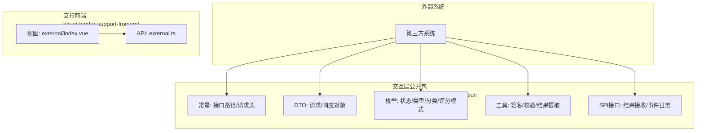
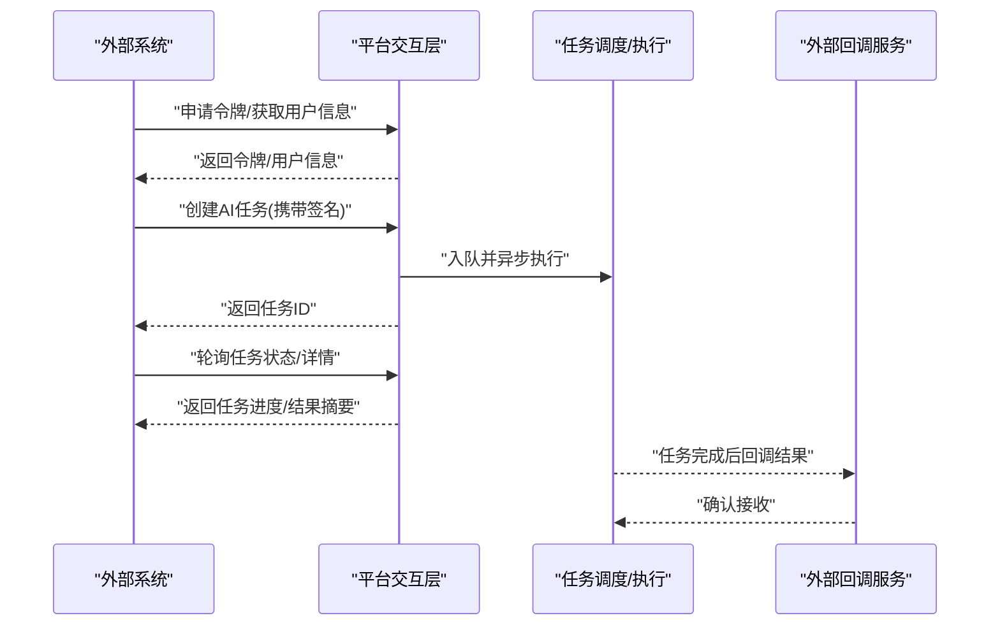
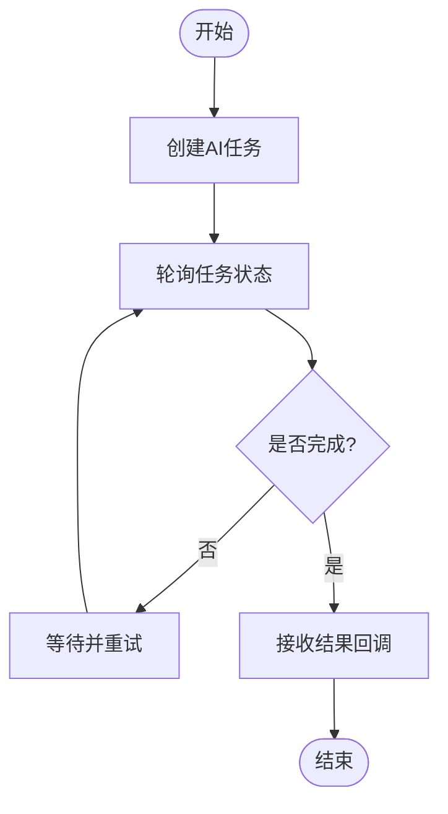

# 外部SPI集成指南

<cite>
**本文引用的文件**   
- [EXTERNAL_SPI_INTEGRATION_GUIDE.md](file://docs/guides/EXTERNAL_SPI_INTEGRATION_GUIDE.md)
- [InteractionApiPaths.java](file://ele-ai-tender-system/ele-ai-tender-interaction/ele-ai-tender-common-interaction/src/main/java/com/jy/eleaitender/common/interaction/constant/InteractionApiPaths.java)
- [InteractionHeaderConstants.java](file://ele-ai-tender-system/ele-ai-tender-interaction/ele-ai-tender-common-interaction/src/main/java/com/jy/eleaitender/common/interaction/constant/InteractionHeaderConstants.java)
- [ExternalTokenRequest.java](file://ele-ai-tender-system/ele-ai-tender-interaction/ele-ai-tender-common-interaction/src/main/java/com/jy/eleaitender/common/interaction/dto/ExternalTokenRequest.java)
- [ExternalTokenResponse.java](file://ele-ai-tender-system/ele-ai-tender-interaction/ele-ai-tender-common-interaction/src/main/java/com/jy/eleaitender/common/interaction/dto/ExternalTokenResponse.java)
- [ExternalUserInfoResponse.java](file://ele-ai-tender-system/ele-ai-tender-interaction/ele-ai-tender-common-interaction/src/main/java/com/jy/eleaitender/common/interaction/dto/ExternalUserInfoResponse.java)
- [AiTaskCreateRequest.java](file://ele-ai-tender-system/ele-ai-tender-interaction/ele-ai-tender-common-interaction/src/main/java/com/jy/eleaitender/common/interaction/dto/AiTaskCreateRequest.java)
- [AiTaskCreateResponse.java](file://ele-ai-tender-system/ele-ai-tender-interaction/ele-ai-tender-common-interaction/src/main/java/com/jy/eleaitender/common/interaction/dto/AiTaskCreateResponse.java)
- [AiTaskQueryResponse.java](file://ele-ai-tender-system/ele-ai-tender-interaction/ele-ai-tender-common-interaction/src/main/java/com/jy/eleaitender/common/interaction/dto/AiTaskQueryResponse.java)
- [AiTaskResultCallbackRequest.java](file://ele-ai-tender-system/ele-ai-tender-interaction/ele-ai-tender-common-interaction/src/main/java/com/jy/eleaitender/common/interaction/dto/AiTaskResult回调请求.java)
- [InteractionFileUploadResponse.java](file://ele-ai-tender-system/ele-ai-tender-interaction/ele-ai-tender-common-interaction/src/main/java/com/jy/eleaitender/common/interaction/dto/InteractionFileUploadResponse.java)
- [InteractionFileInfoResponse.java](file://ele-ai-tender-system/ele-ai-tender-interaction/ele-ai-tender-common-interaction/src/main/java/com/jy/eleaitender/common/interaction/dto/InteractionFileInfoResponse.java)
- [InteractionFileDownloadResponse.java](file://ele-ai-tender-system/ele-ai-tender-interaction/ele-ai-tender-common-interaction/src/main/java/com/jy/eleaitender/common/interaction/dto/InteractionFileDownloadResponse.java)
- [InteractionPolicyFileVO.java](file://ele-ai-tender-system/ele-ai-tender-interaction/ele-ai-tender-common-interaction/src/main/java/com/jy/eleaitender/common/interaction/dto/InteractionPolicyFileVO.java)
- [PolicyFileQueryResponse.java](file://ele-ai-tender-system/ele-ai-tender-interaction/ele-ai-tender-common-interaction/src/main/java/com/jy/eleaitender/common/interaction/dto/PolicyFileQueryResponse.java)
- [InteractionResult.java](file://ele-ai-tender-system/ele-ai-tender-interaction/ele-ai-tender-common-interaction/src/main/java/com/jy/eleaitender/common/interaction/dto/InteractionResult.java)
- [InteractionException.java](file://ele-ai-tender-system/ele-ai-tender-interaction/ele-ai-tender-common-interaction/src/main/java/com/jy/eleaitender/common/interaction/exception/InteractionException.java)
- [InteractionSignatureUtil.java](file://ele-ai-tender-system/ele-ai-tender-interaction/ele-ai-tender-common-interaction/src/main/java/com/jy/eleaitender/common/interaction/util/InteractionSignatureUtil.java)
- [InteractionValidationUtils.java](file://ele-ai-tender-system/ele-ai-tender-interaction/ele-ai-tender-common-interaction/src/main/java/com/jy/eleaitender/common/interaction/util/InteractionValidationUtils.java)
- [InteractionResultExtractor.java](file://ele-ai-tender-system/ele-ai-tender-interaction/ele-ai-tender-common-interaction/src/main/java/com/jy/eleaitender/common/interaction/util/InteractionResultExtractor.java)
- [InteractionAiTaskResultReceiveService.java](file://ele-ai-tender-system/ele-ai-tender-interaction/ele-ai-tender-common-interaction/src/main/java/com/jy/eleaitender/common/interaction/spi/InteractionAiTaskResultReceiveService.java)
- [InteractionEventLogger.java](file://ele-ai-tender-system/ele-ai-tender-interaction/ele-ai-tender-common-interaction/src/main/java/com/jy/eleaitender/common/interaction/spi/InteractionEventLogger.java)
- [InteractionAiTaskStatusEnum.java](file://ele-ai-tender-system/ele-ai-tender-interaction/ele-ai-tender-common-interaction/src/main/java/com/jy/eleaitender/common/interaction/enums/InteractionAiTaskStatusEnum.java)
- [InteractionAiTaskTypeEnum.java](file://ele-ai-tender-system/ele-ai-tender-interaction/ele-ai-tender-common-interaction/src/main/java/com/jy/eleaitender/common/interaction/enums/InteractionAiTaskTypeEnum.java)
- [InteractionFileCategory.java](file://ele-ai-tender-system/ele-ai-tender-interaction/ele-ai-tender-common-interaction/src/main/java/com/jy/eleaitender/common/interaction/enums/InteractionFileCategory.java)
- [InteractionResponseCode.java](file://ele-ai-tender-system/ele-ai-tender-interaction/ele-ai-tender-common-interaction/src/main/java/com/jy/eleaitender/common/interaction/enums/InteractionResponseCode.java)
- [InteractionScoreMode.java](file://ele-ai-tender-system/ele-ai-tender-interaction/ele-ai-tender-common-interaction/src/main/java/com/jy/eleaitender/common/interaction/enums/InteractionScoreMode.java)
- [ExternalController.java](file://ele-ai-tender-support-frontend/src/api/external.ts)
- [index.vue（外部管理）](file://ele-ai-tender-support-frontend/src/views/external/index.vue)
</cite>

## 目录
1. [简介](#简介)
2. [项目结构](#项目结构)
3. [核心组件](#核心组件)
4. [架构总览](#架构总览)
5. [详细组件分析](#详细组件分析)
6. [依赖关系分析](#依赖关系分析)
7. [性能与可靠性](#性能与可靠性)
8. [故障排查指南](#故障排查指南)
9. [结论](#结论)
10. [附录](#附录)

## 简介
本指南面向需要与“投标文档工具”进行外部集成的第三方系统，聚焦于交互层对外暴露的SPI能力、协议约定、安全校验、任务编排与结果回传机制。通过阅读本指南，读者可快速完成以下目标：
- 理解外部系统与平台之间的交互边界与职责划分
- 掌握令牌获取、用户信息拉取、AI任务创建与查询、文件上传下载、策略文件查询等关键流程
- 了解签名校验、参数校验与异常处理规范
- 参考最佳实践完成高可用、可观测的外部集成

## 项目结构
本项目采用前后端分离与多模块后端架构。与外部SPI相关的能力主要集中在交互层公共包 ele-ai-tender-common-interaction，以及支撑前端 ele-ai-tender-support-frontend 中的外部管理页面。

图表来源
- [InteractionApiPaths.java](file://ele-ai-tender-system/ele-ai-tender-interaction/ele-ai-tender-common-interaction/src/main/java/com/jy/eleaitender/common/interaction/constant/InteractionApiPaths.java)
- [InteractionHeaderConstants.java](file://ele-ai-tender-system/ele-ai-tender-interaction/ele-ai-tender-common-interaction/src/main/java/com/jy/eleaitender/common/interaction/constant/InteractionHeaderConstants.java)
- [ExternalController.java](file://ele-ai-tender-support-frontend/src/api/external.ts)
- [index.vue（外部管理）](file://ele-ai-tender-support-frontend/src/views/external/index.vue)

章节来源
- [EXTERNAL_SPI_INTEGRATION_GUIDE.md](file://docs/guides/EXTERNAL_SPI_INTEGRATION_GUIDE.md)

## 核心组件
- 常量定义
  - 接口路径常量：集中维护所有对外暴露的REST路径，便于统一管理与版本演进。
  - 请求头常量：定义跨系统通信所需的通用请求头键名，如签名、时间戳、租户标识等。
- DTO模型
  - 认证与用户：令牌申请与返回、外部用户信息返回。
  - AI任务：任务创建、创建响应、任务查询响应、结果回调请求。
  - 文件与策略：文件上传/下载/信息查询、策略文件查询与VO。
  - 通用响应：统一包装体，包含状态码、消息与数据载荷。
- 枚举类型
  - 任务状态、任务类型、文件分类、响应码、评分模式等，用于约束交互语义。
- 工具类
  - 签名生成与校验：保障请求完整性与防重放。
  - 参数校验：对必填字段、格式、长度等进行前置检查。
  - 结果提取：从复杂响应中抽取关键字段，简化调用方逻辑。
- SPI接口
  - 结果接收服务：供平台侧在异步任务完成后回调外部系统的结果处理器。
  - 事件日志：记录关键交互事件，便于审计与排障。

章节来源
- [InteractionApiPaths.java](file://ele-ai-tender-system/ele-ai-tender-interaction/ele-ai-tender-common-interaction/src/main/java/com/jy/eleaitender/common/interaction/constant/InteractionApiPaths.java)
- [InteractionHeaderConstants.java](file://ele-ai-tender-system/ele-ai-tender-interaction/ele-ai-tender-common-interaction/src/main/java/com/jy/eleaitender/common/interaction/constant/InteractionHeaderConstants.java)
- [ExternalTokenRequest.java](file://ele-ai-tender-system/ele-ai-tender-interaction/ele-ai-tender-common-interaction/src/main/java/com/jy/eleaitender/common/interaction/dto/ExternalTokenRequest.java)
- [ExternalTokenResponse.java](file://ele-ai-tender-system/ele-ai-tender-interaction/ele-ai-tender-common-interaction/src/main/java/com/jy/eleaitender/common/interaction/dto/ExternalTokenResponse.java)
- [ExternalUserInfoResponse.java](file://ele-ai-tender-system/ele-ai-tender-interaction/ele-ai-tender-common-interaction/src/main/java/com/jy/eleaitender/common/interaction/dto/ExternalUserInfoResponse.java)
- [AiTaskCreateRequest.java](file://ele-ai-tender-system/ele-ai-tender-interaction/ele-ai-tender-common-interaction/src/main/java/com/jy/eleaitender/common/interaction/dto/AiTaskCreateRequest.java)
- [AiTaskCreateResponse.java](file://ele-ai-tender-system/ele-ai-tender-interaction/ele-ai-tender-common-interaction/src/main/java/com/jy/eleaitender/common/interaction/dto/AiTaskCreateResponse.java)
- [AiTaskQueryResponse.java](file://ele-ai-tender-system/ele-ai-tender-interaction/ele-ai-tender-common-interaction/src/main/java/com/jy/eleaitender/common/interaction/dto/AiTaskQueryResponse.java)
- [AiTaskResultCallbackRequest.java](file://ele-ai-tender-system/ele-ai-tender-interaction/ele-ai-tender-common-interaction/src/main/java/com/jy/eleaitender/common/interaction/dto/AiTaskResult回调请求.java)
- [InteractionFileUploadResponse.java](file://ele-ai-tender-system/ele-ai-tender-interaction/ele-ai-tender-common-interaction/src/main/java/com/jy/eleaitender/common/interaction/dto/InteractionFileUploadResponse.java)
- [InteractionFileInfoResponse.java](file://ele-ai-tender-system/ele-ai-tender-interaction/ele-ai-tender-common-interaction/src/main/java/com/jy/eleaitender/common/interaction/dto/InteractionFileInfoResponse.java)
- [InteractionFileDownloadResponse.java](file://ele-ai-tender-system/ele-ai-tender-interaction/ele-ai-tender-common-interaction/src/main/java/com/jy/eleaitender/common/interaction/dto/InteractionFileDownloadResponse.java)
- [InteractionPolicyFileVO.java](file://ele-ai-tender-system/ele-ai-tender-interaction/ele-ai-tender-common-interaction/src/main/java/com/jy/eleaitender/common/interaction/dto/InteractionPolicyFileVO.java)
- [PolicyFileQueryResponse.java](file://ele-ai-tender-system/ele-ai-tender-interaction/ele-ai-tender-common-interaction/src/main/java/com/jy/eleaitender/common/interaction/dto/PolicyFileQueryResponse.java)
- [InteractionResult.java](file://ele-ai-tender-system/ele-ai-tender-interaction/ele-ai-tender-common-interaction/src/main/java/com/jy/eleaitender/common/interaction/dto/InteractionResult.java)
- [InteractionAiTaskStatusEnum.java](file://ele-ai-tender-system/ele-ai-tender-interaction/ele-ai-tender-common-interaction/src/main/java/com/jy/eleaitender/common/interaction/enums/InteractionAiTaskStatusEnum.java)
- [InteractionAiTaskTypeEnum.java](file://ele-ai-tender-system/ele-ai-tender-interaction/ele-ai-tender-common-interaction/src/main/java/com/jy/eleaitender/common/interaction/enums/InteractionAiTaskTypeEnum.java)
- [InteractionFileCategory.java](file://ele-ai-tender-system/ele-ai-tender-interaction/ele-ai-tender-common-interaction/src/main/java/com/jy/eleaitender/common/interaction/enums/InteractionFileCategory.java)
- [InteractionResponseCode.java](file://ele-ai-tender-system/ele-ai-tender-interaction/ele-ai-tender-common-interaction/src/main/java/com/jy/eleaitender/common/interaction/enums/InteractionResponseCode.java)
- [InteractionScoreMode.java](file://ele-ai-tender-system/ele-ai-tender-interaction/ele-ai-tender-common-interaction/src/main/java/com/jy/eleaitender/common/interaction/enums/InteractionScoreMode.java)
- [InteractionSignatureUtil.java](file://ele-ai-tender-system/ele-ai-tender-interaction/ele-ai-tender-common-interaction/src/main/java/com/jy/eleaitender/common/interaction/util/InteractionSignatureUtil.java)
- [InteractionValidationUtils.java](file://ele-ai-tender-system/ele-ai-tender-interaction/ele-ai-tender-common-interaction/src/main/java/com/jy/eleaitender/common/interaction/util/InteractionValidationUtils.java)
- [InteractionResultExtractor.java](file://ele-ai-tender-system/ele-ai-tender-interaction/ele-ai-tender-common-interaction/src/main/java/com/jy/eleaitender/common/interaction/util/InteractionResultExtractor.java)
- [InteractionAiTaskResultReceiveService.java](file://ele-ai-tender-system/ele-ai-tender-interaction/ele-ai-tender-common-interaction/src/main/java/com/jy/eleaitender/common/interaction/spi/InteractionAiTaskResultReceiveService.java)
- [InteractionEventLogger.java](file://ele-ai-tender-system/ele-ai-tender-interaction/ele-ai-tender-common-interaction/src/main/java/com/jy/eleaitender/common/interaction/spi/InteractionEventLogger.java)

## 架构总览
外部系统通过HTTP REST与平台交互，遵循统一的鉴权、签名与参数校验规范；AI任务以异步方式执行，平台在完成处理后回调外部系统提供的结果接收接口。

图表来源
- [ExternalTokenRequest.java](file://ele-ai-tender-system/ele-ai-tender-interaction/ele-ai-tender-common-interaction/src/main/java/com/jy/eleaitender/common/interaction/dto/ExternalTokenRequest.java)
- [ExternalTokenResponse.java](file://ele-ai-tender-system/ele-ai-tender-interaction/ele-ai-tender-common-interaction/src/main/java/com/jy/eleaitender/common/interaction/dto/ExternalTokenResponse.java)
- [ExternalUserInfoResponse.java](file://ele-ai-tender-system/ele-ai-tender-interaction/ele-ai-tender-common-interaction/src/main/java/com/jy/eleaitender/common/interaction/dto/ExternalUserInfoResponse.java)
- [AiTaskCreateRequest.java](file://ele-ai-tender-system/ele-ai-tender-interaction/ele-ai-tender-common-interaction/src/main/java/com/jy/eleaitender/common/interaction/dto/AiTaskCreateRequest.java)
- [AiTaskCreateResponse.java](file://ele-ai-tender-system/ele-ai-tender-interaction/ele-ai-tender-common-interaction/src/main/java/com/jy/eleaitender/common/interaction/dto/AiTaskCreateResponse.java)
- [AiTaskQueryResponse.java](file://ele-ai-tender-system/ele-ai-tender-interaction/ele-ai-tender-common-interaction/src/main/java/com/jy/eleaitender/common/interaction/dto/AiTaskQueryResponse.java)
- [AiTaskResultCallbackRequest.java](file://ele-ai-tender-system/ele-ai-tender-interaction/ele-ai-tender-common-interaction/src/main/java/com/jy/eleaitender/common/interaction/dto/AiTaskResult回调请求.java)

## 详细组件分析

### 认证与用户信息
- 令牌申请
  - 输入：外部系统标识、密钥或凭证（由平台预配置）。
  - 输出：访问令牌、有效期、刷新策略。
  - 安全：请求需携带签名与时间戳，服务端校验签名与防重放窗口。
- 用户信息拉取
  - 输入：令牌或会话上下文。
  - 输出：外部用户基本信息、角色/权限映射（如有）。
- 错误处理
  - 非法签名、过期、参数缺失等场景返回统一响应码与提示。

章节来源
- [ExternalTokenRequest.java](file://ele-ai-tender-system/ele-ai-tender-interaction/ele-ai-tender-common-interaction/src/main/java/com/jy/eleaitender/common/interaction/dto/ExternalTokenRequest.java)
- [ExternalTokenResponse.java](file://ele-ai-tender-system/ele-ai-tender-interaction/ele-ai-tender-common-interaction/src/main/java/com/jy/eleaitender/common/interaction/dto/ExternalTokenResponse.java)
- [ExternalUserInfoResponse.java](file://ele-ai-tender-system/ele-ai-tender-interaction/ele-ai-tender-common-interaction/src/main/java/com/jy/eleaitender/common/interaction/dto/ExternalUserInfoResponse.java)
- [InteractionSignatureUtil.java](file://ele-ai-tender-system/ele-ai-tender-interaction/ele-ai-tender-common-interaction/src/main/java/com/jy/eleaitender/common/interaction/util/InteractionSignatureUtil.java)
- [InteractionValidationUtils.java](file://ele-ai-tender-system/ele-ai-tender-interaction/ele-ai-tender-common-interaction/src/main/java/com/jy/eleaitender/common/interaction/util/InteractionValidationUtils.java)
- [InteractionResponseCode.java](file://ele-ai-tender-system/ele-ai-tender-interaction/ele-ai-tender-common-interaction/src/main/java/com/jy/eleaitender/common/interaction/enums/InteractionResponseCode.java)

### AI任务生命周期
- 任务创建
  - 输入：任务类型、业务上下文、附件/策略文件引用、评分模式等。
  - 输出：任务ID、预计耗时、初始状态。
- 任务查询
  - 输入：任务ID。
  - 输出：任务状态、进度、结果摘要、错误信息（如有）。
- 结果回调
  - 触发时机：任务执行完成或失败。
  - 内容：结构化结果、评分明细、关联文件链接等。
  - 幂等性：外部系统应保证重复回调不产生副作用。

图表来源
- [AiTaskCreateRequest.java](file://ele-ai-tender-system/ele-ai-tender-interaction/ele-ai-tender-common-interaction/src/main/java/com/jy/eleaitender/common/interaction/dto/AiTaskCreateRequest.java)
- [AiTaskCreateResponse.java](file://ele-ai-tender-system/ele-ai-tender-interaction/ele-ai-tender-common-interaction/src/main/java/com/jy/eleaitender/common/interaction/dto/AiTaskCreateResponse.java)
- [AiTaskQueryResponse.java](file://ele-ai-tender-system/ele-ai-tender-interaction/ele-ai-tender-common-interaction/src/main/java/com/jy/eleaitender/common/interaction/dto/AiTaskQueryResponse.java)
- [AiTaskResultCallbackRequest.java](file://ele-ai-tender-system/ele-ai-tender-interaction/ele-ai-tender-common-interaction/src/main/java/com/jy/eleaitender/common/interaction/dto/AiTaskResult回调请求.java)
- [InteractionAiTaskStatusEnum.java](file://ele-ai-tender-system/ele-ai-tender-interaction/ele-ai-tender-common-interaction/src/main/java/com/jy/eleaitender/common/interaction/enums/InteractionAiTaskStatusEnum.java)
- [InteractionAiTaskTypeEnum.java](file://ele-ai-tender-system/ele-ai-tender-interaction/ele-ai-tender-common-interaction/src/main/java/com/jy/eleaitender/common/interaction/enums/InteractionAiTaskTypeEnum.java)

### 文件与策略文件
- 文件上传
  - 输入：文件流、文件名、分类、业务ID等。
  - 输出：文件ID、访问URL、大小、哈希值（可选）。
- 文件信息
  - 输入：文件ID。
  - 输出：元数据、预览链接、下载链接。
- 文件下载
  - 输入：文件ID、下载凭据。
  - 输出：二进制流或临时下载链接。
- 策略文件
  - 查询：按分类/标签/版本检索策略文件列表与详情。
  - 用途：作为AI任务的规则依据或模板来源。

章节来源
- [InteractionFileUploadResponse.java](file://ele-ai-tender-system/ele-ai-tender-interaction/ele-ai-tender-common-interaction/src/main/java/com/jy/eleaitender/common/interaction/dto/InteractionFileUploadResponse.java)
- [InteractionFileInfoResponse.java](file://ele-ai-tender-system/ele-ai-tender-interaction/ele-ai-tender-common-interaction/src/main/java/com/jy/eleaitender/common/interaction/dto/InteractionFileInfoResponse.java)
- [InteractionFileDownloadResponse.java](file://ele-ai-tender-system/ele-ai-tender-interaction/ele-ai-tender-common-interaction/src/main/java/com/jy/eleaitender/common/interaction/dto/InteractionFileDownloadResponse.java)
- [InteractionPolicyFileVO.java](file://ele-ai-tender-system/ele-ai-tender-interaction/ele-ai-tender-common-interaction/src/main/java/com/jy/eleaitender/common/interaction/dto/InteractionPolicyFileVO.java)
- [PolicyFileQueryResponse.java](file://ele-ai-tender-system/ele-ai-tender-interaction/ele-ai-tender-common-interaction/src/main/java/com/jy/eleaitender/common/interaction/dto/PolicyFileQueryResponse.java)
- [InteractionFileCategory.java](file://ele-ai-tender-system/ele-ai-tender-interaction/ele-ai-tender-common-interaction/src/main/java/com/jy/eleaitender/common/interaction/enums/InteractionFileCategory.java)

### 统一响应与异常
- 统一响应体
  - 字段：状态码、消息、数据载荷、追踪ID等。
  - 作用：为外部系统提供一致的解析入口。
- 异常类型
  - 交互层异常：用于区分参数错误、签名失败、业务不可用等场景。
  - 建议：外部系统在客户端层捕获并展示友好提示。

章节来源
- [InteractionResult.java](file://ele-ai-tender-system/ele-ai-tender-interaction/ele-ai-tender-common-interaction/src/main/java/com/jy/eleaitender/common/interaction/dto/InteractionResult.java)
- [InteractionException.java](file://ele-ai-tender-system/ele-ai-tender-interaction/ele-ai-tender-common-interaction/src/main/java/com/jy/eleaitender/common/interaction/exception/InteractionException.java)
- [InteractionResponseCode.java](file://ele-ai-tender-system/ele-ai-tender-interaction/ele-ai-tender-common-interaction/src/main/java/com/jy/eleaitender/common/interaction/enums/InteractionResponseCode.java)

### 工具与SPI
- 工具类
  - 签名工具：基于约定的算法生成签名，服务端验证签名与时间戳窗口。
  - 校验工具：对请求参数进行非空、格式、范围校验。
  - 结果提取：从嵌套结构中抽取关键字段，降低调用复杂度。
- SPI接口
  - 结果接收服务：外部系统实现该接口，用于接收平台侧的任务结果回调。
  - 事件日志：记录关键交互事件，便于审计与问题定位。

章节来源
- [InteractionSignatureUtil.java](file://ele-ai-tender-system/ele-ai-tender-interaction/ele-ai-tender-common-interaction/src/main/java/com/jy/eleaitender/common/interaction/util/InteractionSignatureUtil.java)
- [InteractionValidationUtils.java](file://ele-ai-tender-system/ele-ai-tender-interaction/ele-ai-tender-common-interaction/src/main/java/com/jy/eleaitender/common/interaction/util/InteractionValidationUtils.java)
- [InteractionResultExtractor.java](file://ele-ai-tender-system/ele-ai-tender-interaction/ele-ai-tender-common-interaction/src/main/java/com/jy/eleaitender/common/interaction/util/InteractionResultExtractor.java)
- [InteractionAiTaskResultReceiveService.java](file://ele-ai-tender-system/ele-ai-tender-interaction/ele-ai-tender-common-interaction/src/main/java/com/jy/eleaitender/common/interaction/spi/InteractionAiTaskResultReceiveService.java)
- [InteractionEventLogger.java](file://ele-ai-tender-system/ele-ai-tender-interaction/ele-ai-tender-common-interaction/src/main/java/com/jy/eleaitender/common/interaction/spi/InteractionEventLogger.java)

### 前端外部管理
- API封装
  - 将外部相关的接口调用封装为TS函数，统一处理请求头、签名与错误。
- 管理页面
  - 提供外部系统接入的配置与查看界面，辅助运维与测试。

章节来源
- [ExternalController.java](file://ele-ai-tender-support-frontend/src/api/external.ts)
- [index.vue（外部管理）](file://ele-ai-tender-support-frontend/src/views/external/index.vue)

## 依赖关系分析
交互层对外暴露的常量、DTO、枚举、工具与SPI共同构成稳定的契约面。外部系统仅需依赖这些契约即可实现集成，无需感知内部实现细节。

```mermaid
classDiagram
class InteractionApiPaths {
+ "接口路径常量"
}
class InteractionHeaderConstants {
+ "请求头常量"
}
class ExternalTokenRequest
class ExternalTokenResponse
class ExternalUserInfoResponse
class AiTaskCreateRequest
class AiTaskCreateResponse
class AiTaskQueryResponse
class AiTaskResultCallbackRequest
class InteractionFileUploadResponse
class InteractionFileInfoResponse
class InteractionFileDownloadResponse
class InteractionPolicyFileVO
class PolicyFileQueryResponse
class InteractionResult
class InteractionAiTaskStatusEnum
class InteractionAiTaskTypeEnum
class InteractionFileCategory
class InteractionResponseCode
class InteractionScoreMode
class InteractionSignatureUtil
class InteractionValidationUtils
class InteractionResultExtractor
class InteractionAiTaskResultReceiveService
class InteractionEventLogger
InteractionApiPaths <.. ExternalTokenRequest : "使用"
InteractionHeaderConstants <.. ExternalTokenRequest : "使用"
InteractionResult <.. ExternalTokenResponse : "包裹"
InteractionResult <.. AiTaskCreateResponse : "包裹"
InteractionResult <.. AiTaskQueryResponse : "包裹"
InteractionResult <.. InteractionFileUploadResponse : "包裹"
InteractionResult <.. InteractionFileInfoResponse : "包裹"
InteractionResult <.. InteractionFileDownloadResponse : "包裹"
InteractionResult <.. PolicyFileQueryResponse : "包裹"
InteractionAiTaskStatusEnum <.. AiTaskQueryResponse : "引用"
InteractionAiTaskTypeEnum <.. AiTaskCreateRequest : "引用"
InteractionFileCategory <.. InteractionFileUploadResponse : "引用"
InteractionResponseCode <.. InteractionResult : "使用"
InteractionSignatureUtil <.. ExternalTokenRequest : "签名"
InteractionValidationUtils <.. ExternalTokenRequest : "校验"
InteractionResultExtractor <.. AiTaskQueryResponse : "提取"
InteractionAiTaskResultReceiveService <.. AiTaskResultCallbackRequest : "接收"
InteractionEventLogger <.. AiTaskResultCallbackRequest : "记录"
```

图表来源
- [InteractionApiPaths.java](file://ele-ai-tender-system/ele-ai-tender-interaction/ele-ai-tender-common-interaction/src/main/java/com/jy/eleaitender/common/interaction/constant/InteractionApiPaths.java)
- [InteractionHeaderConstants.java](file://ele-ai-tender-system/ele-ai-tender-interaction/ele-ai-tender-common-interaction/src/main/java/com/jy/eleaitender/common/interaction/constant/InteractionHeaderConstants.java)
- [ExternalTokenRequest.java](file://ele-ai-tender-system/ele-ai-tender-interaction/ele-ai-tender-common-interaction/src/main/java/com/jy/eleaitender/common/interaction/dto/ExternalTokenRequest.java)
- [ExternalTokenResponse.java](file://ele-ai-tender-system/ele-ai-tender-interaction/ele-ai-tender-common-interaction/src/main/java/com/jy/eleaitender/common/interaction/dto/ExternalTokenResponse.java)
- [ExternalUserInfoResponse.java](file://ele-ai-tender-system/ele-ai-tender-interaction/ele-ai-tender-common-interaction/src/main/java/com/jy/eleaitender/common/interaction/dto/ExternalUserInfoResponse.java)
- [AiTaskCreateRequest.java](file://ele-ai-tender-system/ele-ai-tender-interaction/ele-ai-tender-common-interaction/src/main/java/com/jy/eleaitender/common/interaction/dto/AiTaskCreateRequest.java)
- [AiTaskCreateResponse.java](file://ele-ai-tender-system/ele-ai-tender-interaction/ele-ai-tender-common-interaction/src/main/java/com/jy/eleaitender/common/interaction/dto/AiTaskCreateResponse.java)
- [AiTaskQueryResponse.java](file://ele-ai-tender-system/ele-ai-tender-interaction/ele-ai-tender-common-interaction/src/main/java/com/jy/eleaitender/common/interaction/dto/AiTaskQueryResponse.java)
- [AiTaskResultCallbackRequest.java](file://ele-ai-tender-system/ele-ai-tender-interaction/ele-ai-tender-common-interaction/src/main/java/com/jy/eleaitender/common/interaction/dto/AiTaskResult回调请求.java)
- [InteractionFileUploadResponse.java](file://ele-ai-tender-system/ele-ai-tender-interaction/ele-ai-tender-common-interaction/src/main/java/com/jy/eleaitender/common/interaction/dto/InteractionFileUploadResponse.java)
- [InteractionFileInfoResponse.java](file://ele-ai-tender-system/ele-ai-tender-interaction/ele-ai-tender-common-interaction/src/main/java/com/jy/eleaitender/common/interaction/dto/InteractionFileInfoResponse.java)
- [InteractionFileDownloadResponse.java](file://ele-ai-tender-system/ele-ai-tender-interaction/ele-ai-tender-common-interaction/src/main/java/com/jy/eleaitender/common/interaction/dto/InteractionFileDownloadResponse.java)
- [InteractionPolicyFileVO.java](file://ele-ai-tender-system/ele-ai-tender-interaction/ele-ai-tender-common-interaction/src/main/java/com/jy/eleaitender/common/interaction/dto/InteractionPolicyFileVO.java)
- [PolicyFileQueryResponse.java](file://ele-ai-tender-system/ele-ai-tender-interaction/ele-ai-tender-common-interaction/src/main/java/com/jy/eleaitender/common/interaction/dto/PolicyFileQueryResponse.java)
- [InteractionResult.java](file://ele-ai-tender-system/ele-ai-tender-interaction/ele-ai-tender-common-interaction/src/main/java/com/jy/eleaitender/common/interaction/dto/InteractionResult.java)
- [InteractionAiTaskStatusEnum.java](file://ele-ai-tender-system/ele-ai-tender-interaction/ele-ai-tender-common-interaction/src/main/java/com/jy/eleaitender/common/interaction/enums/InteractionAiTaskStatusEnum.java)
- [InteractionAiTaskTypeEnum.java](file://ele-ai-tender-system/ele-ai-tender-interaction/ele-ai-tender-common-interaction/src/main/java/com/jy/eleaitender/common/interaction/enums/InteractionAiTaskTypeEnum.java)
- [InteractionFileCategory.java](file://ele-ai-tender-system/ele-ai-tender-interaction/ele-ai-tender-common-interaction/src/main/java/com/jy/eleaitender/common/interaction/enums/InteractionFileCategory.java)
- [InteractionResponseCode.java](file://ele-ai-tender-system/ele-ai-tender-interaction/ele-ai-tender-common-interaction/src/main/java/com/jy/eleaitender/common/interaction/enums/InteractionResponseCode.java)
- [InteractionScoreMode.java](file://ele-ai-tender-system/ele-ai-tender-interaction/ele-ai-tender-common-interaction/src/main/java/com/jy/eleaitender/common/interaction/enums/InteractionScoreMode.java)
- [InteractionSignatureUtil.java](file://ele-ai-tender-system/ele-ai-tender-interaction/ele-ai-tender-common-interaction/src/main/java/com/jy/eleaitender/common/interaction/util/InteractionSignatureUtil.java)
- [InteractionValidationUtils.java](file://ele-ai-tender-system/ele-ai-tender-interaction/ele-ai-tender-common-interaction/src/main/java/com/jy/eleaitender/common/interaction/util/InteractionValidationUtils.java)
- [InteractionResultExtractor.java](file://ele-ai-tender-system/ele-ai-tender-interaction/ele-ai-tender-common-interaction/src/main/java/com/jy/eleaitender/common/interaction/util/InteractionResultExtractor.java)
- [InteractionAiTaskResultReceiveService.java](file://ele-ai-tender-system/ele-ai-tender-interaction/ele-ai-tender-common-interaction/src/main/java/com/jy/eleaitender/common/interaction/spi/InteractionAiTaskResultReceiveService.java)
- [InteractionEventLogger.java](file://ele-ai-tender-system/ele-ai-tender-interaction/ele-ai-tender-common-interaction/src/main/java/com/jy/eleaitender/common/interaction/spi/InteractionEventLogger.java)

## 性能与可靠性
- 并发与限流
  - 建议在外部系统侧实现指数退避重试，避免雪崩。
  - 对高频查询接口增加本地缓存，减少无效轮询。
- 超时与重试
  - 合理设置连接与读取超时；对幂等接口启用自动重试。
- 可观测性
  - 记录请求ID、签名、时间戳、状态码与耗时，便于端到端追踪。
- 资源控制
  - 大文件上传/下载建议使用分片与断点续传；限制单次文件大小。

[本节为通用指导，不涉及具体文件分析]

## 故障排查指南
- 常见问题
  - 签名失败：检查密钥配置、时间戳是否在允许窗口内、排序与编码是否与约定一致。
  - 参数校验失败：对照DTO字段要求，确保必填项完整、类型与长度合规。
  - 任务未回调：确认回调地址可达、外部服务端口开放、幂等处理正确。
- 定位手段
  - 使用统一响应体中的追踪ID关联日志。
  - 借助事件日志接口记录的关键节点，快速定位失败阶段。
- 恢复策略
  - 对失败任务提供手动重试入口；对回调失败提供补偿任务。

章节来源
- [InteractionException.java](file://ele-ai-tender-system/ele-ai-tender-interaction/ele-ai-tender-common-interaction/src/main/java/com/jy/eleaitender/common/interaction/exception/InteractionException.java)
- [InteractionResponseCode.java](file://ele-ai-tender-system/ele-ai-tender-interaction/ele-ai-tender-common-interaction/src/main/java/com/jy/eleaitender/common/interaction/enums/InteractionResponseCode.java)
- [InteractionEventLogger.java](file://ele-ai-tender-system/ele-ai-tender-interaction/ele-ai-tender-common-interaction/src/main/java/com/jy/eleaitender/common/interaction/spi/InteractionEventLogger.java)

## 结论
通过统一的常量、DTO、枚举、工具与SPI契约，外部系统可以稳定、安全地接入平台的AI任务与文件能力。遵循本指南的认证、签名、校验与重试策略，可在生产环境获得良好的性能与可靠性表现。

[本节为总结性内容，不涉及具体文件分析]

## 附录
- 参考文档
  - 外部SPI集成指南（仓库内说明）
- 前端外部管理
  - 通过支持前端的“外部管理”页面进行基础配置与调试

章节来源
- [EXTERNAL_SPI_INTEGRATION_GUIDE.md](file://docs/guides/EXTERNAL_SPI_INTEGRATION_GUIDE.md)
- [ExternalController.java](file://ele-ai-tender-support-frontend/src/api/external.ts)
- [index.vue（外部管理）](file://ele-ai-tender-support-frontend/src/views/external/index.vue)