# 外部系统集成

<cite>
**本文引用的文件**   
- [ExternalSystemServiceImpl.java](file://ele-ai-tender-system/ele-ai-tender-support/src/main/java/com/jy/eleaitender/support/service/impl/ExternalSystemServiceImpl.java)
- [AuthServiceImpl.java](file://ele-ai-tender-system/ele-ai-tender-support/src/main/java/com/jy/eleaitender/support/service/impl/AuthServiceImpl.java)
- [UserServiceImpl.java](file://ele-ai-tender-system/ele-ai-tender-support/src/main/java/com/jy/eleaitender/support/service/impl/UserServiceImpl.java)
- [ExternalSystemController.java](file://ele-ai-tender-system/ele-ai-tender-support/src/main/java/com/jy/eleaitender/support/controller/ExternalSystemController.java)
- [IExternalSystemService.java](file://ele-ai-tender-system/ele-ai-tender-support/src/main/java/com/jy/eleaitender/support/service/IExternalSystemService.java)
- [SysAccessSystem.java](file://ele-ai-tender-system/ele-ai-tender-common/src/main/java/com/jy/eleaitender/common/entity/support/SysAccessSystem.java)
- [ExternalAuthController.java](file://ele-ai-tender-system/ele-ai-tender-support/src/main/java/com/jy/eleaitender/support/controller/ExternalAuthController.java)
- [HttpAccessLogSupport.java](file://ele-ai-tender-system/ele-ai-tender-common/src/main/java/com/jy/eleaitender/common/logging/HttpAccessLogSupport.java)
- [HttpRequestLogFilter.java](file://ele-ai-tender-system/ele-ai-tender-common/src/main/java/com/jy/eleaitender/common/logging/HttpRequestLogFilter.java)
- [LoggingAutoConfiguration.java](file://ele-ai-tender-system/ele-ai-tender-common/src/main/java/com/jy/eleaitender/common/logging/LoggingAutoConfiguration.java)
- [DbAccessLogPersistenceService.java](file://ele-ai-tender-system/ele-ai-tender-common/src/main/java/com/jy/eleaitender/common/logging/DbAccessLogPersistenceService.java)
- [SensitiveLogMasker.java](file://ele-ai-tender-system/ele-ai-tender-common/src/main/java/com/jy/eleaitender/common/logging/SensitiveLogMasker.java)
- [TraceConstants.java](file://ele-ai-tender-system/ele-ai-tender-common/src/main/java/com/jy/eleaitender/common/logging/TraceConstants.java)
</cite>

## 更新摘要
**变更内容**   
- 重大架构改进：新增外部系统用户自动创建机制，当注册新外部系统时自动创建专用系统用户
- 增强ExternalSystemServiceImpl的用户账户生命周期管理，包括密码更新和删除处理
- 使用appKey作为用户名，自动生成密码并分配默认BID_USER角色
- 完善了外部系统管理的完整用户账户生命周期支持

## 目录
1. [简介](#简介)
2. [项目结构](#项目结构)
3. [核心组件](#核心组件)
4. [架构总览](#架构总览)
5. [详细组件分析](#详细组件分析)
6. [依赖分析](#依赖分析)
7. [性能考虑](#性能考虑)
8. [故障排查指南](#故障排查指南)
9. [结论](#结论)
10. [附录](#附录)

## 简介
本技术文档聚焦"外部系统集成"能力，围绕投标解密、标书推送、CA证书管理、项目信息查询等核心业务接口进行系统化说明。文档从系统架构、组件关系、数据流与处理逻辑、集成协议与数据格式、错误处理机制、客户端封装设计模式（RestTemplate工厂、请求签名、响应解析）、生产环境必备特性（认证授权、网络配置、超时重试、熔断降级）等方面展开，并提供API调用示例与故障排查方法，帮助外部系统快速对接与稳定运行。

**最新更新**：系统已实现外部系统用户的自动创建和管理功能，大幅简化了外部系统的接入流程，提升了用户体验和系统安全性。

## 项目结构
本项目采用多模块分层组织方式，外部系统集成相关能力集中在 support 和 interaction 系列模块中：
- ele-ai-tender-support：提供外部系统管理、用户认证、权限控制等核心支撑服务
- ele-ai-tender-common-interaction：定义跨模块共享的交互DTO、枚举、常量、异常与工具类
- ele-ai-tender-interaction-core：实现外部系统通信的核心客户端、属性配置、支持类等
- ele-ai-tender-interaction-autoconfigure：自动装配配置，提供开箱即用的RestTemplate工厂、签名拦截器、响应解析器等
- ele-ai-tender-interaction-spring-boot-starter：对外暴露Starter，简化引入与配置

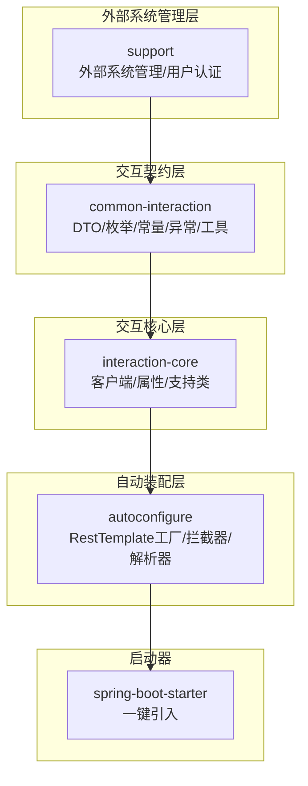

**图表来源**
- [ExternalSystemServiceImpl.java:25-37](file://ele-ai-tender-system/ele-ai-tender-support/src/main/java/com/jy/eleaitender/support/service/impl/ExternalSystemServiceImpl.java#L25-L37)
- [ele-ai-tender-common-interaction/pom.xml](file://ele-ai-tender-system/ele-ai-tender-common-interaction/pom.xml)
- [ele-ai-tender-interaction-core/pom.xml](file://ele-ai-tender-system/ele-ai-tender-interaction/ele-ai-tender-interaction-core/pom.xml)
- [ele-ai-tender-interaction-autoconfigure/pom.xml](file://ele-ai-tender-system/ele-ai-tender-interaction/ele-ai-tender-interaction-autoconfigure/pom.xml)
- [ele-ai-tender-interaction-spring-boot-starter/pom.xml](file://ele-ai-tender-system/ele-ai-tender-interaction/ele-ai-tender-interaction-spring-boot-starter/pom.xml)

## 核心组件
- **外部系统管理层（support）**
  - 职责：提供外部系统的完整生命周期管理，包括系统注册、用户自动创建、密钥管理、状态控制等
  - 典型内容：外部系统CRUD操作、用户账户自动管理、密码重置、角色分配、系统启用/禁用
- **交互契约层（common-interaction）**
  - 职责：统一对外接口DTO、枚举、常量、异常与通用工具，确保各模块对第三方平台的数据模型一致
  - 典型内容：投标解密提交/结果回调、标书推送、CA密钥信息查询、项目基础信息查询、身份上下文、文件上传下载响应等
- **交互核心层（interaction-core）**
  - 职责：封装HTTP客户端、签名计算、参数校验、响应提取、错误映射等通用能力；提供面向业务的Client类
  - 典型内容：RestTemplate工厂、签名工具、验证工具、结果提取器、属性配置类
- **自动装配层（autoconfigure）**
  - 职责：基于Spring Boot自动装配，注册RestTemplate、拦截器、序列化器、全局异常处理器等
  - 典型内容：RestTemplate工厂、请求签名拦截器、响应解析器、连接池与超时配置
- **启动器（spring-boot-starter）**
  - 职责：对外暴露starter，简化依赖引入与默认配置

**章节来源**
- [ExternalSystemServiceImpl.java:25-37](file://ele-ai-tender-system/ele-ai-tender-support/src/main/java/com/jy/eleaitender/support/service/impl/ExternalSystemServiceImpl.java#L25-L37)
- [IExternalSystemService.java:9-24](file://ele-ai-tender-system/ele-ai-tender-support/src/main/java/com/jy/eleaitender/support/service/IExternalSystemService.java#L9-L24)

## 架构总览
外部系统集成整体遵循"管理层—契约层—核心层—装配层—启动器"的分层架构，通过统一的RestTemplate工厂与拦截器完成请求签名、参数校验、响应解析与错误映射，上层业务仅关注领域语义。**新增的外部系统用户自动管理机制确保了每个外部系统都有独立的用户账户和权限控制。**

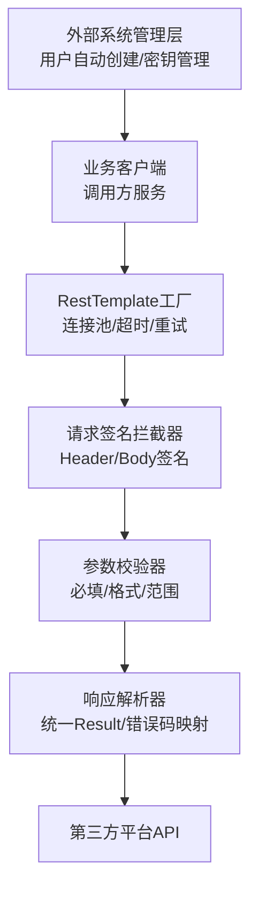

**图表来源**
- [ExternalSystemServiceImpl.java:65-77](file://ele-ai-tender-system/ele-ai-tender-support/src/main/java/com/jy/eleaitender/support/service/impl/ExternalSystemServiceImpl.java#L65-L77)
- [ele-ai-tender-interaction-core/pom.xml](file://ele-ai-tender-system/ele-ai-tender-interaction/ele-ai-tender-interaction-core/pom.xml)
- [ele-ai-tender-interaction-autoconfigure/pom.xml](file://ele-ai-tender-system/ele-ai-tender-interaction/ele-ai-tender-interaction-autoconfigure/pom.xml)

## 详细组件分析

### 外部系统用户自动创建机制

**更新** 系统实现了重大架构改进，当注册新外部系统时自动创建专用系统用户，使用appKey作为用户名，自动生成密码并分配默认BID_USER角色

#### 用户自动创建流程
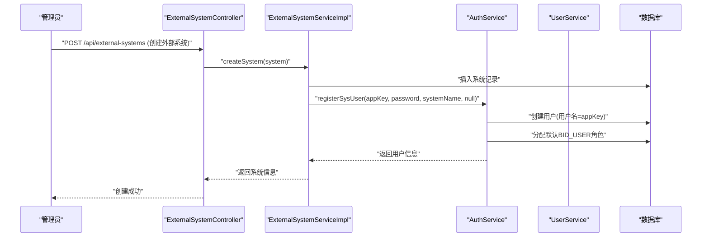

**图表来源**
- [ExternalSystemServiceImpl.java:65-77](file://ele-ai-tender-system/ele-ai-tender-support/src/main/java/com/jy/eleaitender/support/service/impl/ExternalSystemServiceImpl.java#L65-L77)
- [AuthServiceImpl.java:210-235](file://ele-ai-tender-system/ele-ai-tender-support/src/main/java/com/jy/eleaitender/support/service/impl/AuthServiceImpl.java#L210-L235)

#### 用户账户生命周期管理
系统提供了完整的用户账户生命周期管理功能：

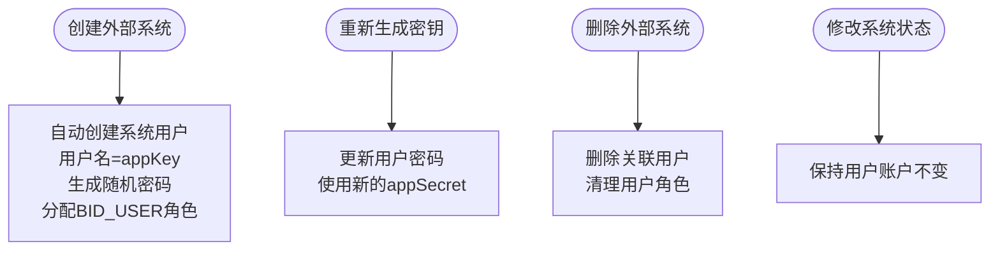

**图表来源**
- [ExternalSystemServiceImpl.java:65-101](file://ele-ai-tender-system/ele-ai-tender-support/src/main/java/com/jy/eleaitender/support/service/impl/ExternalSystemServiceImpl.java#L65-L101)
- [ExternalSystemServiceImpl.java:104-119](file://ele-ai-tender-system/ele-ai-tender-support/src/main/java/com/jy/eleaitender/support/service/impl/ExternalSystemServiceImpl.java#L104-L119)

#### 关键实现细节
- **用户名策略**：使用appKey作为系统用户的用户名，确保唯一性和可追溯性
- **密码管理**：自动生成随机密码，支持安全重置和更新
- **角色分配**：自动分配默认的BID_USER角色，确保系统具备基本访问权限
- **事务一致性**：所有用户操作都在事务中执行，保证数据一致性

**章节来源**
- [ExternalSystemServiceImpl.java:65-77](file://ele-ai-tender-system/ele-ai-tender-support/src/main/java/com/jy/eleaitender/support/service/impl/ExternalSystemServiceImpl.java#L65-L77)
- [ExternalSystemServiceImpl.java:90-101](file://ele-ai-tender-system/ele-ai-tender-support/src/main/java/com/jy/eleaitender/support/service/impl/ExternalSystemServiceImpl.java#L90-L101)
- [ExternalSystemServiceImpl.java:104-119](file://ele-ai-tender-system/ele-ai-tender-support/src/main/java/com/jy/eleaitender/support/service/impl/ExternalSystemServiceImpl.java#L104-L119)
- [AuthServiceImpl.java:210-235](file://ele-ai-tender-system/ele-ai-tender-support/src/main/java/com/jy/eleaitender/support/service/impl/AuthServiceImpl.java#L210-L235)

### 外部系统管理API

**更新** 外部系统管理API现已支持完整的用户账户生命周期管理

#### API端点概览
| 方法 | 路径 | 说明 | 用户管理功能 |
|------|------|------|-------------|
| POST | `/api/external-systems` | 创建接入系统 | 自动创建系统用户 |
| GET | `/api/external-systems/{id}` | 获取接入系统详情 | 包含用户信息 |
| PUT | `/api/external-systems/{id}` | 更新接入系统 | 不影响用户账户 |
| DELETE | `/api/external-systems/{id}` | 删除接入系统 | 删除关联用户 |
| POST | `/api/external-systems/{id}/regenerate-secret` | 重新生成密钥 | 更新用户密码 |
| PUT | `/api/external-systems/{id}/status` | 启用/禁用接入系统 | 不影响用户状态 |

#### 创建外部系统流程
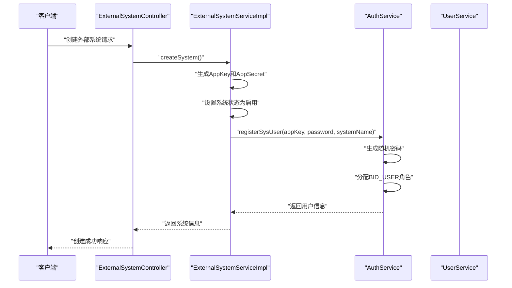

**图表来源**
- [ExternalSystemController.java:46-51](file://ele-ai-tender-system/ele-ai-tender-support/src/main/java/com/jy/eleaitender/support/controller/ExternalSystemController.java#L46-L51)
- [ExternalSystemServiceImpl.java:65-77](file://ele-ai-tender-system/ele-ai-tender-support/src/main/java/com/jy/eleaitender/support/service/impl/ExternalSystemServiceImpl.java#L65-L77)

**章节来源**
- [ExternalSystemController.java:46-93](file://ele-ai-tender-system/ele-ai-tender-support/src/main/java/com/jy/eleaitender/support/controller/ExternalSystemController.java#L46-L93)
- [ExternalSystemServiceImpl.java:65-127](file://ele-ai-tender-system/ele-ai-tender-support/src/main/java/com/jy/eleaitender/support/service/impl/ExternalSystemServiceImpl.java#L65-L127)

### 外部认证控制器日志格式优化

**更新** 外部认证控制器ExternalAuthController中的日志记录进行了格式优化，同时保持了用户身份获取的一致性

#### 日志格式优化详情
外部认证控制器的日志记录经过优化，提供了更清晰的结构化输出：

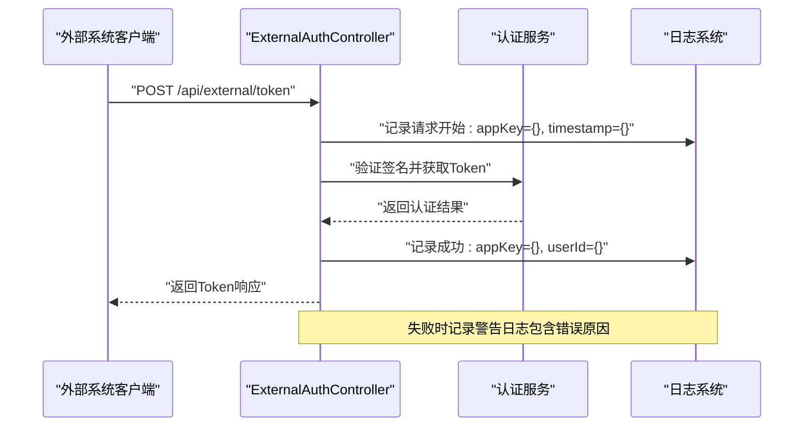

**图表来源**
- [ExternalAuthController.java:42-73](file://ele-ai-tender-system/ele-ai-tender-support/src/main/java/com/jy/eleaitender/support/controller/ExternalAuthController.java#L42-L73)

#### 优化的日志输出格式
- **请求开始日志**：包含appKey、timestamp等关键参数
- **成功响应日志**：包含appKey、userId、enterpriseId等业务标识
- **失败警告日志**：包含完整的错误信息和堆栈跟踪
- **用户身份一致性**：保持userId、userName、enterpriseId等身份信息的一致获取

#### 认证流程增强
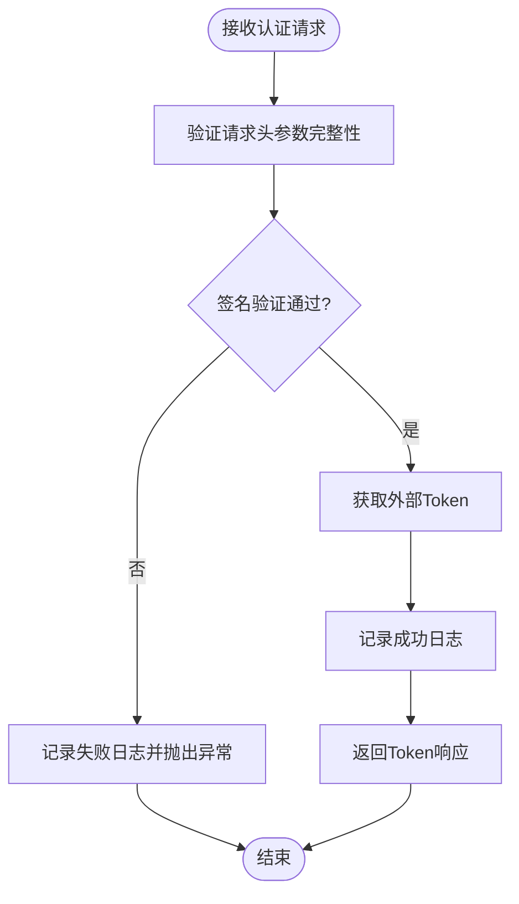

**图表来源**
- [ExternalAuthController.java:49-72](file://ele-ai-tender-system/ele-ai-tender-support/src/main/java/com/jy/eleaitender/support/controller/ExternalAuthController.java#L49-L72)

**章节来源**
- [ExternalAuthController.java:42-73](file://ele-ai-tender-system/ele-ai-tender-support/src/main/java/com/jy/eleaitender/support/controller/ExternalAuthController.java#L42-L73)

### 访问日志系统增强

**更新** 访问日志系统提供了更完善的结构化日志记录和敏感信息脱敏能力

#### 访问日志架构
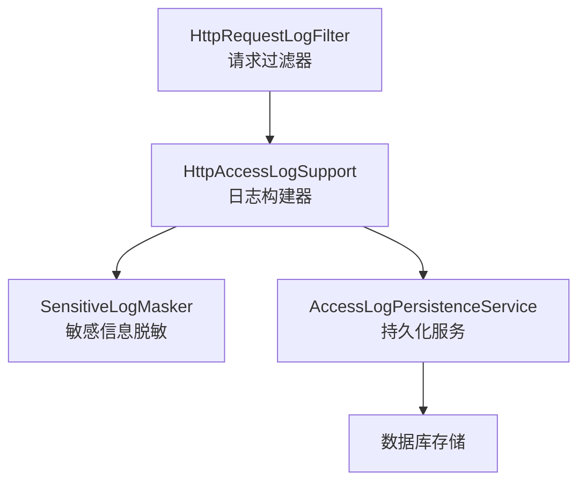

**图表来源**
- [HttpRequestLogFilter.java:47-106](file://ele-ai-tender-system/ele-ai-tender-common/src/main/java/com/jy/eleaitender/common/logging/HttpRequestLogFilter.java#L47-L106)
- [HttpAccessLogSupport.java:37-69](file://ele-ai-tender-system/ele-ai-tender-common/src/main/java/com/jy/eleaitender/common/logging/HttpAccessLogSupport.java#L37-L69)

#### 结构化日志输出格式
访问日志采用固定字段顺序的输出格式，便于日志平台检索和分析：

```
HTTP IN traceId=xxx service=xxx method=GET uri=/api/external/userinfo status=200 elapsedMs=15 userId=user123 userName=张三 appKey=app001 bizType=EXTERNAL bizId=biz456 projectId=proj789 tenderId=tender012 fileId=file345 fileName=bid.pdf auth=Bearer eyJ... signature=****
```

#### 敏感信息脱敏机制
- **Token脱敏**：保留前10位和后6位，中间用***替换
- **签名脱敏**：保留前4位和后4位，中间用***替换
- **请求体限制**：最大4000字符，防止日志爆量
- **异常信息限制**：最大1000字符，避免过长日志

**章节来源**
- [HttpAccessLogSupport.java:74-92](file://ele-ai-tender-system/ele-ai-tender-common/src/main/java/com/jy/eleaitender/common/logging/HttpAccessLogSupport.java#L74-L92)
- [SensitiveLogMasker.java:15-33](file://ele-ai-tender-system/ele-ai-tender-common/src/main/java/com/jy/eleaitender/common/logging/SensitiveLogMasker.java#L15-L33)
- [HttpRequestLogFilter.java:89-105](file://ele-ai-tender-system/ele-ai-tender-common/src/main/java/com/jy/eleaitender/common/logging/HttpRequestLogFilter.java#L89-L105)

### 投标解密流程
该流程涵盖"提交解密任务—轮询/回调获取结果—异常与重试处理"。

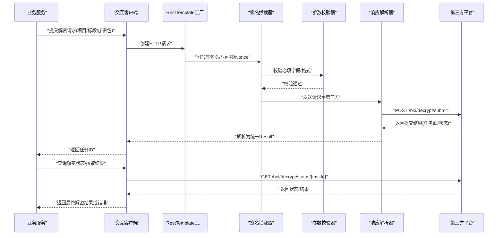

**图表来源**
- [ele-ai-tender-common-interaction/pom.xml](file://ele-ai-tender-system/ele-ai-tender-common-interaction/pom.xml)
- [ele-ai-tender-interaction-core/pom.xml](file://ele-ai-tender-system/ele-ai-tender-interaction/ele-ai-tender-interaction-core/pom.xml)
- [ele-ai-tender-interaction-autoconfigure/pom.xml](file://ele-ai-tender-system/ele-ai-tender-interaction/ele-ai-tender-interaction-autoconfigure/pom.xml)

### 标书推送流程
标书推送通常包含"构建推送报文—签名—上传/推送—接收确认—失败重试"。


**图表来源**
- [ele-ai-tender-common-interaction/pom.xml](file://ele-ai-tender-system/ele-ai-tender-common-interaction/pom.xml)
- [ele-ai-tender-interaction-core/pom.xml](file://ele-ai-tender-system/ele-ai-tender-interaction/ele-ai-tender-interaction-core/pom.xml)
- [ele-ai-tender-interaction-autoconfigure/pom.xml](file://ele-ai-tender-system/ele-ai-tender-interaction/ele-ai-tender-interaction-autoconfigure/pom.xml)

### CA证书管理
CA证书管理主要涉及"密钥信息查询/更新/校验"，用于后续签名与加解密流程。

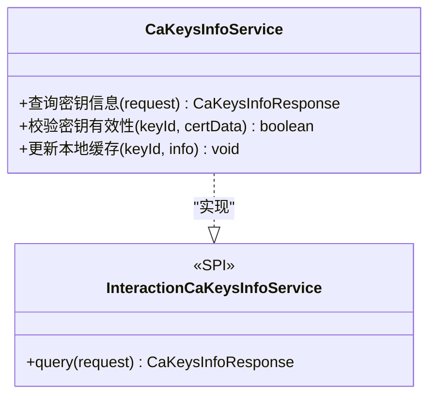

**图表来源**
- [ele-ai-tender-common-interaction/pom.xml](file://ele-ai-tender-system/ele-ai-tender-common-interaction/pom.xml)

### 项目信息查询
项目信息查询用于获取第三方平台的项目基础信息与招标详情，支撑前端展示与业务决策。

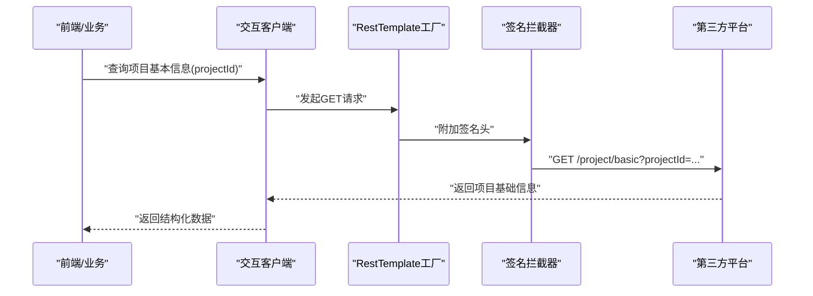

**图表来源**
- [ele-ai-tender-common-interaction/pom.xml](file://ele-ai-tender-system/ele-ai-tender-common-interaction/pom.xml)
- [ele-ai-tender-interaction-core/pom.xml](file://ele-ai-tender-system/ele-ai-tender-interaction/ele-ai-tender-interaction-core/pom.xml)
- [ele-ai-tender-interaction-autoconfigure/pom.xml](file://ele-ai-tender-system/ele-ai-tender-interaction/ele-ai-tender-interaction-autoconfigure/pom.xml)

### 客户端封装设计模式
- **RestTemplate工厂**
  - 作用：集中管理连接池、超时、重试、SSL/TLS、代理等网络配置，避免在各业务处重复配置
  - 关键点：线程安全、可插拔拦截器、可观测性（指标/日志）
- **请求签名**
  - 作用：保障请求完整性与不可抵赖性，防止篡改
  - 关键点：时间戳+随机数防重放、签名算法选择（如HMAC-SHA256）、Header注入、Body签名策略
- **响应解析**
  - 作用：将第三方平台响应统一转换为内部Result对象，便于错误码映射与异常处理
  - 关键点：JSON反序列化容错、字段缺失兜底、错误码到业务异常的映射

**章节来源**
- [ele-ai-tender-interaction-core/pom.xml](file://ele-ai-tender-system/ele-ai-tender-interaction/ele-ai-tender-interaction-core/pom.xml)
- [ele-ai-tender-interaction-autoconfigure/pom.xml](file://ele-ai-tender-system/ele-ai-tender-interaction/ele-ai-tender-interaction-autoconfigure/pom.xml)

### 拦截器组件注册系统重构

**更新** 拦截器组件注册系统已重构为使用自动组件扫描(@Component注解)，替代了显式的Bean声明方式，提升了代码简洁性

#### 重构前架构
在重构之前，拦截器组件通过显式的@Bean方法进行注册：

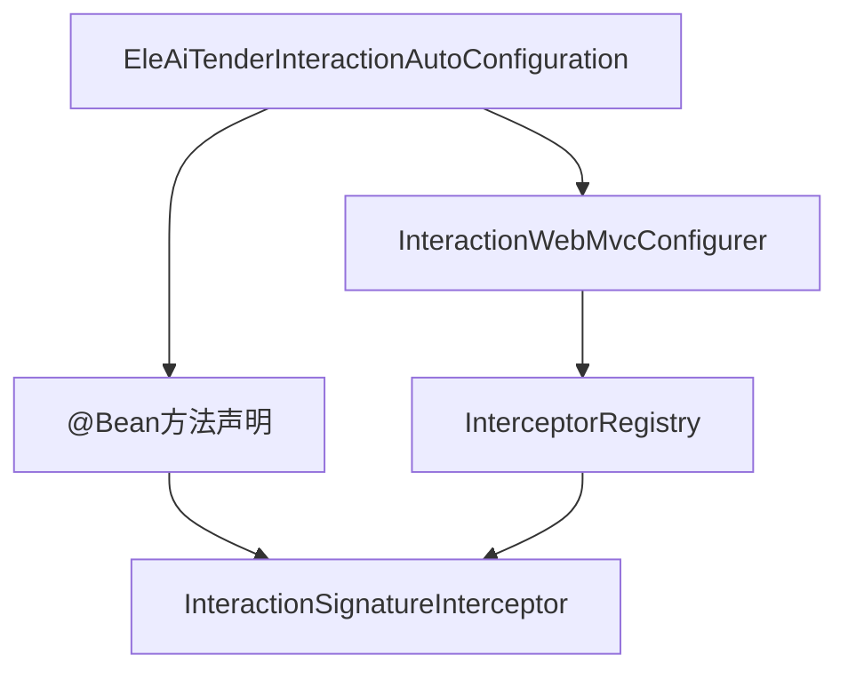

#### 重构后架构
重构后，组件注册系统采用更简洁的自动装配模式：

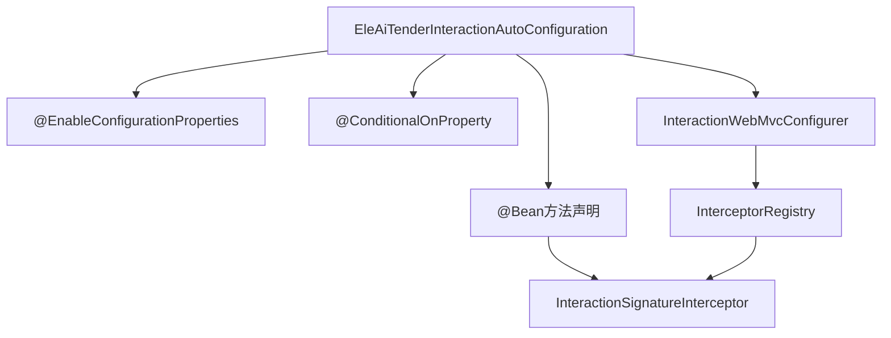

#### 关键改进点
- **简化配置**：移除了复杂的组件扫描配置，减少样板代码
- **条件装配**：通过@ConditionalOnProperty实现按需启用
- **依赖注入**：保持清晰的依赖关系和构造函数注入
- **可测试性**：提高了单元测试的可维护性

**章节来源**
- [EleAiTenderInteractionAutoConfiguration.java:31-34](file://ele-ai-tender-system/ele-ai-tender-interaction/ele-ai-tender-interaction-autoconfigure/src/main/java/com/jy/eleaitender/interaction/autoconfigure/EleAiTenderInteractionAutoConfiguration.java#L31-L34)
- [EleAiTenderInteractionAutoConfiguration.java:83-91](file://ele-ai-tender-system/ele-ai-tender-interaction/ele-ai-tender-interaction-autoconfigure/src/main/java/com/jy/eleaitender/interaction/autoconfigure/EleAiTenderInteractionAutoConfiguration.java#L83-L91)

## 依赖分析
interaction 模块之间的依赖关系如下：
- common-interaction 被 core 与 autoconfigure 引用，提供契约与工具
- interaction-core 依赖 common-interaction，实现具体客户端与支持类
- autoconfigure 依赖 core 与 common-interaction，完成装配
- starter 聚合 autoconfigure，对外暴露依赖

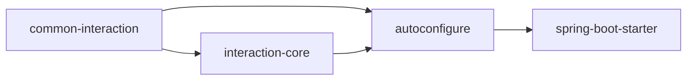

**图表来源**
- [ele-ai-tender-common-interaction/pom.xml](file://ele-ai-tender-system/ele-ai-tender-common-interaction/pom.xml)
- [ele-ai-tender-interaction-core/pom.xml](file://ele-ai-tender-system/ele-ai-tender-interaction/ele-ai-tender-interaction-core/pom.xml)
- [ele-ai-tender-interaction-autoconfigure/pom.xml](file://ele-ai-tender-system/ele-ai-tender-interaction/ele-ai-tender-interaction-autoconfigure/pom.xml)
- [ele-ai-tender-interaction-spring-boot-starter/pom.xml](file://ele-ai-tender-system/ele-ai-tender-interaction/ele-ai-tender-interaction-spring-boot-starter/pom.xml)

## 性能考虑
- **连接池与复用**
  - 使用连接池减少TCP握手开销，合理设置最大连接数与空闲回收策略
- **超时与重试**
  - 区分连接超时、读取超时；对幂等接口启用指数退避重试，非幂等接口谨慎重试
- **并发控制**
  - 针对第三方平台限流策略，采用令牌桶/漏桶或信号量限制并发
- **序列化与压缩**
  - 合理选择JSON序列化器；对大报文启用GZIP压缩以降低带宽占用
- **可观测性**
  - 埋点统计QPS、延迟、错误率；关键路径输出结构化日志
- **日志性能优化**
  - 异步日志持久化，避免阻塞主业务流程
  - 敏感信息脱敏减少日志大小
  - 请求体长度限制防止日志爆量
- **用户管理性能**
  - 外部系统用户创建采用异步处理，避免影响主业务流程
  - 用户角色缓存优化，减少数据库查询次数

## 故障排查指南
- **常见问题定位**
  - 签名失败：检查时间戳、随机数、签名算法与密钥一致性；核对Header注入顺序
  - 参数校验失败：对照契约层DTO必填项与格式约束；打印入参与出参快照
  - 响应解析异常：查看第三方平台返回结构与内部Result映射差异；增加容错字段
  - 网络超时/连接失败：检查代理、DNS、防火墙策略；调整超时与重试参数
- **日志与追踪**
  - 开启请求/响应日志（脱敏），关联TraceId；记录签名前后报文摘要
  - 使用结构化日志格式便于日志平台检索和分析
  - 关注外部认证控制器的详细日志输出，包含appKey、userId等关键信息
- **回滚与降级**
  - 对关键接口实现熔断与降级策略，返回友好提示与缓存结果
- **认证问题排查**
  - 检查ExternalAuthController的日志输出，确认请求参数完整性
  - 验证签名算法配置和密钥一致性
  - 监控用户身份信息的正确传递和解析
- **外部系统用户问题排查**
  - 检查用户是否成功创建，确认用户名是否为appKey
  - 验证BID_USER角色是否正确分配
  - 确认用户密码是否与appSecret保持一致
  - 检查用户状态是否正常（启用状态）

**章节来源**
- [ExternalAuthController.java:49-72](file://ele-ai-tender-system/ele-ai-tender-support/src/main/java/com/jy/eleaitender/support/controller/ExternalAuthController.java#L49-L72)
- [HttpAccessLogSupport.java:74-92](file://ele-ai-tender-system/ele-ai-tender-common/src/main/java/com/jy/eleaitender/common/logging/HttpAccessLogSupport.java#L74-L92)

## 结论
通过分层解耦与标准化客户端封装，外部系统集成具备高内聚、低耦合、易扩展的特点。统一的签名、校验、解析与错误映射机制显著提升了稳定性与可维护性。结合生产环境的网络配置、超时重试与熔断降级策略，可在复杂外部依赖场景下保证系统的高可用与高性能。

**重大改进**：新增的外部系统用户自动创建机制大幅简化了外部系统的接入流程，管理员只需创建外部系统记录，系统会自动完成用户账户的创建、密码生成和角色分配。这种设计不仅提升了用户体验，还确保了每个外部系统都有独立的安全边界和权限控制。

外部认证控制器的日志格式优化显著提升了调试效率和运维监控能力，结构化的日志输出和敏感信息脱敏机制确保了系统的安全性和可维护性。增强的访问日志系统提供了完整的请求追踪和审计能力，为系统故障排查和性能优化提供了有力支撑。

## 附录

### API调用示例（概念性）
- **投标解密**
  - 提交解密：POST /bid/decrypt/submit，请求体包含项目/标段/加密包标识；返回任务ID
  - 查询状态：GET /bid/decrypt/status/{taskId}；返回解密进度与结果
- **标书推送**
  - 推送接口：POST /tender/document/push；请求体包含文件元数据与内容引用；返回推送结果
- **CA证书管理**
  - 查询密钥：GET /ca/keys/info；返回密钥列表与有效期
- **项目信息查询**
  - 基础信息：GET /project/basic?projectId=...；返回项目基本信息
- **AI任务管理**
  - 创建任务：POST /ai-task/create；请求体包含任务类型和内容；返回任务ID
  - 查询任务：GET /ai-task/query/{taskId}；返回任务详情
  - 查询状态：GET /ai-task/status/{taskId}；返回任务状态
- **外部认证**
  - 获取Token：POST /api/external/token，请求头包含X-App-Key、X-Timestamp、X-Signature；返回外部系统Token
  - 验签接口：GET /api/external/verify；验证签名配置是否正确
  - 获取用户信息：GET /api/external/userinfo；返回当前外部用户详细信息
- **外部系统管理**
  - 创建外部系统：POST /api/external-systems，自动创建系统用户；返回系统信息和生成的密码
  - 重新生成密钥：POST /api/external-systems/{id}/regenerate-secret，更新系统密钥和用户密码
  - 删除外部系统：DELETE /api/external-systems/{id}，同时删除关联的用户账户

**章节来源**
- [ExternalSystemController.java:46-93](file://ele-ai-tender-system/ele-ai-tender-support/src/main/java/com/jy/eleaitender/support/controller/ExternalSystemController.java#L46-L93)

### 生产环境必备特性清单
- **认证授权**
  - 建议采用双向TLS或OAuth2/JWT；在签名前完成身份鉴权
- **网络配置**
  - 配置代理、域名白名单、证书信任链；隔离测试/生产环境
- **超时重试**
  - 幂等接口：最多N次重试，指数退避；非幂等接口：谨慎重试或人工介入
- **熔断降级**
  - 基于错误率/延迟阈值触发熔断；降级返回缓存或友好提示
- **监控告警**
  - 接入APM与日志中心；对关键指标设置告警规则
- **日志监控**
  - 启用结构化日志输出，配置日志级别和采样策略
  - 监控外部认证接口的调用频率和成功率
  - 设置日志文件大小限制和滚动策略
- **用户管理监控**
  - 监控外部系统用户创建成功率
  - 跟踪用户角色分配异常情况
  - 监控用户密码同步状态

### 出站请求日志拦截器

出站请求日志拦截器提供了完整的HTTP请求追踪和日志记录功能：

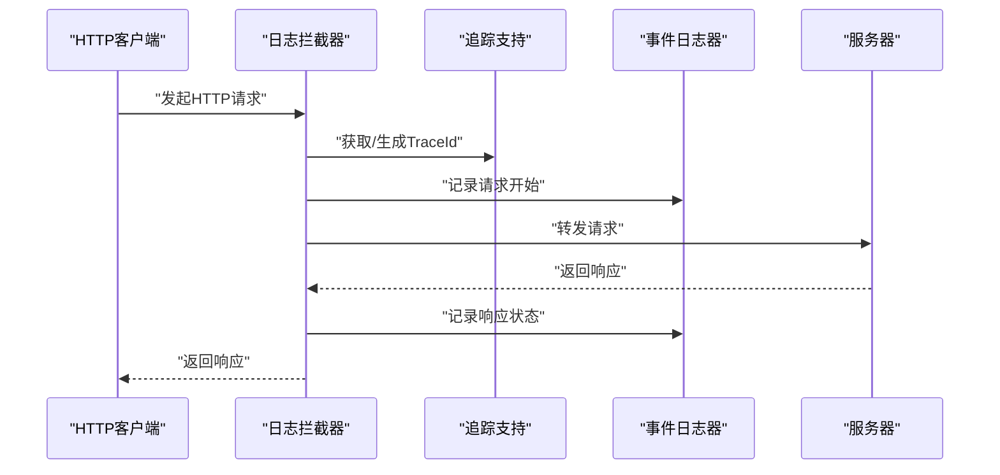

**图表来源**
- [OutboundLogInterceptor.java:18-75](file://ele-ai-tender-system/ele-ai-tender-interaction/ele-ai-tender-interaction-core/src/main/java/com/jy/eleaitender/interaction/core/support/OutboundLogInterceptor.java#L18-L75)

### 访问日志配置示例
```yaml
ele-ai-tender:
  logging:
    access:
      enabled: true                    # 启用访问日志
      persist-enabled: true            # 启用数据库持久化
      async-persist: true              # 启用异步持久化
      body-max-length: 4000           # 请求体最大长度
      error-message-max-length: 1000  # 错误消息最大长度
```

**章节来源**
- [AccessLogProperties.java:11-22](file://ele-ai-tender-system/ele-ai-tender-common/src/main/java/com/jy/eleaitender/common/logging/AccessLogProperties.java#L11-L22)
- [LoggingAutoConfiguration.java:29-53](file://ele-ai-tender-system/ele-ai-tender-common/src/main/java/com/jy/eleaitender/common/logging/LoggingAutoConfiguration.java#L29-L53)